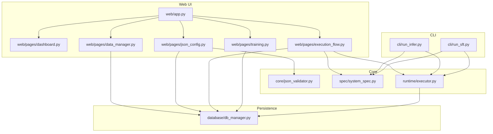
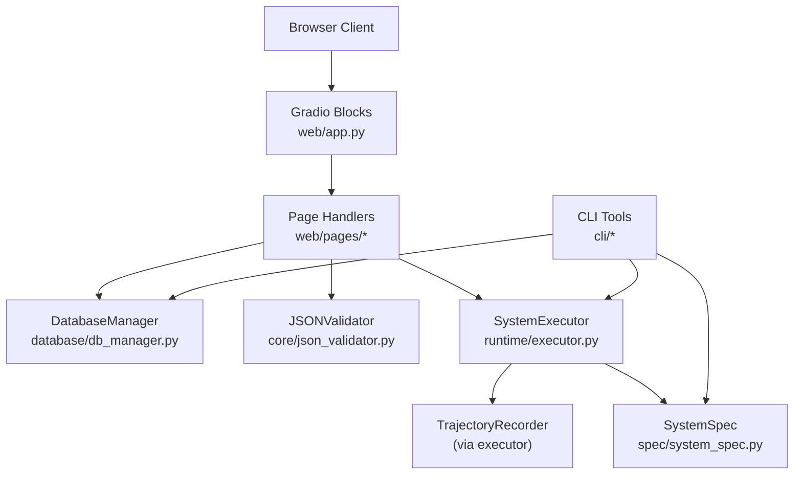
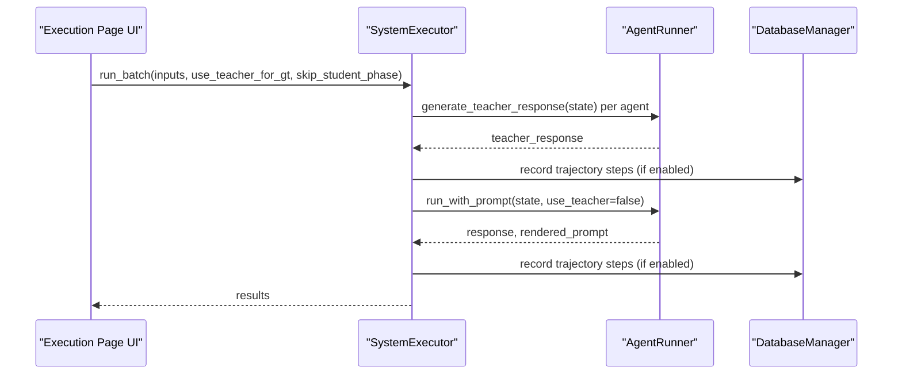
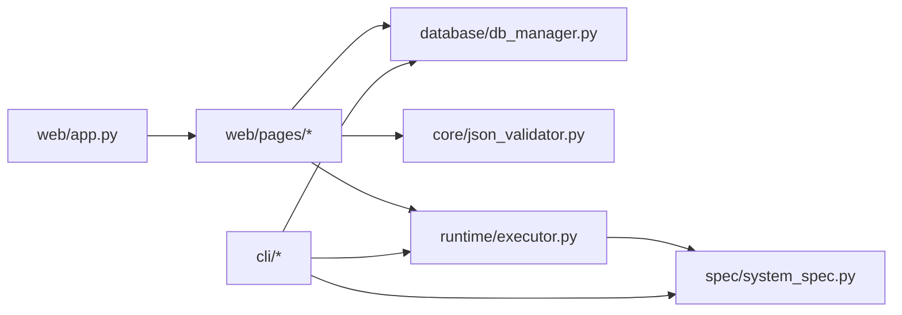

# API Reference

<cite>
**Referenced Files in This Document**
- [main_web.py](file://main_web.py)
- [web/app.py](file://web/app.py)
- [web/pages/dashboard.py](file://web/pages/dashboard.py)
- [web/pages/data_manager.py](file://web/pages/data_manager.py)
- [web/pages/json_config.py](file://web/pages/json_config.py)
- [web/pages/execution_flow.py](file://web/pages/execution_flow.py)
- [web/pages/training.py](file://web/pages/training.py)
- [database/db_manager.py](file://database/db_manager.py)
- [core/json_validator.py](file://core/json_validator.py)
- [runtime/executor.py](file://runtime/executor.py)
- [spec/system_spec.py](file://spec/system_spec.py)
- [cli/run_infer.py](file://cli/run_infer.py)
- [cli/run_sft.py](file://cli/run_sft.py)
- [configs/api_config.yaml](file://configs/api_config.yaml)
</cite>

## Table of Contents
1. [Introduction](#introduction)
2. [Project Structure](#project-structure)
3. [Core Components](#core-components)
4. [Architecture Overview](#architecture-overview)
5. [Detailed Component Analysis](#detailed-component-analysis)
6. [Dependency Analysis](#dependency-analysis)
7. [Performance Considerations](#performance-considerations)
8. [Troubleshooting Guide](#troubleshooting-guide)
9. [Conclusion](#conclusion)
10. [Appendices](#appendices)

## Introduction
This document provides a comprehensive API reference for the Multi-Agent System Builder platform. It covers:
- Web API endpoints exposed via the Gradio interface, including navigation and page interactions
- CLI command reference for batch inference and distillation-based SFT training
- Programmatic interfaces for integration, including database operations and system configuration APIs
- Request/response patterns, error handling strategies, and integration best practices
- Rate limiting, security considerations, and versioning information

The platform offers a browser-based UI for managing datasets, validating JSON configurations, executing multi-agent workflows, and launching training jobs. It also exposes command-line tools for automation and batch processing.

## Project Structure
The system is organized into modular components:
- Web UI: Gradio-based application with multiple pages for dashboard, data management, configuration, execution flow, and training
- Database: SQLite-backed ORM models for datasets, system configurations, executions, and training jobs
- Core: JSON validation and system specification parsing
- Runtime: Execution engine for multi-agent workflows and trajectory recording
- CLI: Command-line tools for inference and SFT training

**Diagram sources**
- [web/app.py:20-157](file://web/app.py#L20-L157)
- [web/pages/data_manager.py:8-307](file://web/pages/data_manager.py#L8-L307)
- [web/pages/json_config.py:8-376](file://web/pages/json_config.py#L8-L376)
- [web/pages/execution_flow.py:9-274](file://web/pages/execution_flow.py#L9-L274)
- [web/pages/training.py:9-552](file://web/pages/training.py#L9-L552)
- [core/json_validator.py:37-346](file://core/json_validator.py#L37-L346)
- [spec/system_spec.py:77-114](file://spec/system_spec.py#L77-L114)
- [runtime/executor.py:9-132](file://runtime/executor.py#L9-L132)
- [database/db_manager.py:11-347](file://database/db_manager.py#L11-L347)
- [cli/run_infer.py:8-45](file://cli/run_infer.py#L8-L45)
- [cli/run_sft.py:17-117](file://cli/run_sft.py#L17-L117)

**Section sources**
- [web/app.py:20-157](file://web/app.py#L20-L157)
- [database/db_manager.py:11-347](file://database/db_manager.py#L11-L347)

## Core Components
- Gradio Application: Creates the UI layout, manages global state, and orchestrates page rendering and navigation
- Page Modules: Encapsulate UI logic and event handlers for each functional area
- Database Manager: Provides CRUD operations for datasets, system configurations, executions, and training jobs
- JSON Validator: Validates system configuration JSON, checks dataflow, and computes execution order
- System Spec: Defines Pydantic models for configuration structures
- Executor: Runs multi-agent workflows, supports two-phase distillation, and records trajectories
- CLI Tools: Provide batch inference and SFT training automation

Key responsibilities:
- Web API: Exposes interactive controls and event handlers through Gradio components
- Database API: Offers typed ORM methods for persistence and retrieval
- Validation API: Ensures configuration correctness and detects cycles
- Execution API: Executes agents in topological order and records steps
- CLI API: Accepts arguments, loads specs, runs inference/training, and prints status

**Section sources**
- [web/app.py:11-157](file://web/app.py#L11-L157)
- [web/pages/data_manager.py:135-306](file://web/pages/data_manager.py#L135-L306)
- [web/pages/json_config.py:181-376](file://web/pages/json_config.py#L181-L376)
- [web/pages/execution_flow.py:116-274](file://web/pages/execution_flow.py#L116-L274)
- [web/pages/training.py:254-552](file://web/pages/training.py#L254-L552)
- [database/db_manager.py:35-347](file://database/db_manager.py#L35-L347)
- [core/json_validator.py:43-346](file://core/json_validator.py#L43-L346)
- [runtime/executor.py:16-132](file://runtime/executor.py#L16-L132)
- [cli/run_infer.py:8-45](file://cli/run_infer.py#L8-L45)
- [cli/run_sft.py:17-117](file://cli/run_sft.py#L17-L117)

## Architecture Overview
The system follows a layered architecture:
- Presentation Layer: Gradio Blocks define UI pages and handle user interactions
- Domain Layer: Validators, executors, and spec parsers encapsulate business logic
- Persistence Layer: SQLAlchemy ORM with SQLite backend

**Diagram sources**
- [web/app.py:20-157](file://web/app.py#L20-L157)
- [web/pages/data_manager.py:135-306](file://web/pages/data_manager.py#L135-L306)
- [web/pages/json_config.py:181-376](file://web/pages/json_config.py#L181-L376)
- [web/pages/execution_flow.py:116-274](file://web/pages/execution_flow.py#L116-L274)
- [web/pages/training.py:254-552](file://web/pages/training.py#L254-L552)
- [database/db_manager.py:35-347](file://database/db_manager.py#L35-L347)
- [core/json_validator.py:43-346](file://core/json_validator.py#L43-L346)
- [runtime/executor.py:16-132](file://runtime/executor.py#L16-L132)
- [spec/system_spec.py:77-114](file://spec/system_spec.py#L77-L114)
- [cli/run_infer.py:8-45](file://cli/run_infer.py#L8-L45)
- [cli/run_sft.py:17-117](file://cli/run_sft.py#L17-L117)

## Detailed Component Analysis

### Web API Endpoints (Gradio)
The application is a single-page Gradio app with navigation between five pages. There are no traditional HTTP endpoints; interactions are handled client-side via Gradio events bound to page functions.

- Navigation
  - Buttons switch the visible page container and update button variants
  - No explicit URL routing; page visibility is managed internally

- Dashboard Page
  - Displays statistics cards and recent activity
  - Provides a refresh button for data updates

- Data Management Page
  - Upload datasets (JSON/JSONL), preview, delete, and export
  - Filter generated data by configuration or dataset
  - Export training-ready datasets

- JSON Configuration Page
  - Validate JSON configuration with real-time feedback
  - Save validated configurations with validation metadata
  - Visualize dataflow graphs using Mermaid

- Execution Flow Page
  - Select configuration and dataset, choose options (teacher GT, trajectory recording)
  - Run execution, observe progress, logs, results, and trajectory steps
  - Visualize execution flow

- Training Management Page
  - Configure and start SFT, DPO, and GRPO jobs
  - View and manage training tasks
  - Generate training scripts for external execution

Common patterns:
- Event binding: Button clicks trigger page functions
- Outputs: Markdown, JSON, Dataframe, and File components render results
- Error handling: Functions return error messages or structured JSON with error keys

**Section sources**
- [web/app.py:107-155](file://web/app.py#L107-L155)
- [web/pages/dashboard.py:12-139](file://web/pages/dashboard.py#L12-L139)
- [web/pages/data_manager.py:135-306](file://web/pages/data_manager.py#L135-L306)
- [web/pages/json_config.py:181-376](file://web/pages/json_config.py#L181-L376)
- [web/pages/execution_flow.py:116-274](file://web/pages/execution_flow.py#L116-L274)
- [web/pages/training.py:254-552](file://web/pages/training.py#L254-L552)

#### Execution Flow Sequence (Two-Phase Distillation)

**Diagram sources**
- [runtime/executor.py:16-132](file://runtime/executor.py#L16-L132)
- [web/pages/execution_flow.py:116-219](file://web/pages/execution_flow.py#L116-L219)
- [database/db_manager.py:159-181](file://database/db_manager.py#L159-L181)

### Database API
The DatabaseManager provides typed ORM methods for CRUD operations across four entity types: Dataset, SystemConfig, Execution, and TrainingJob.

- Dataset Operations
  - create_dataset, get_dataset, get_all_datasets, delete_dataset
- SystemConfig Operations
  - create_system_config, update_config_validation, get_system_config, get_all_system_configs, delete_system_config
- GeneratedData Operations
  - create_generated_data, get_generated_data_by_config, get_generated_data_by_dataset
- Execution Operations
  - create_execution, update_execution_status, get_execution, get_all_executions
- TrainingJob Operations
  - create_training_job, update_training_status, get_training_job, get_all_training_jobs, delete_training_job

Data models and relationships are defined in the models module and created automatically on initialization.

**Section sources**
- [database/db_manager.py:35-347](file://database/db_manager.py#L35-L347)

### JSON Validation API
The JSONValidator validates system configuration JSON against Pydantic models, checks dataflow connectivity, and computes execution order. It also generates a dataflow graph for visualization.

Validation steps:
- Parse JSON and ensure root is an array
- Validate each AgentSpec structure
- Verify dataflow connections and detect cycles
- Compute execution order via topological sort
- Optionally validate training configuration

**Section sources**
- [core/json_validator.py:43-346](file://core/json_validator.py#L43-L346)
- [spec/system_spec.py:77-114](file://spec/system_spec.py#L77-L114)

### Execution API
SystemExecutor orchestrates multi-agent execution in topological order. It supports:
- Two-phase distillation: teacher-generated ground truths followed by student execution with trajectory recording
- Batch processing of inputs
- Optional skipping of the student phase

**Section sources**
- [runtime/executor.py:16-132](file://runtime/executor.py#L16-L132)

### CLI Commands
- run_infer.py
  - Purpose: Run batch inference with a multi-agent system
  - Required arguments:
    - --spec: Path to system specification JSON
    - --input: Path to input JSONL file
  - Optional arguments:
    - --gt: Path to ground truth JSONL file
  - Behavior: Loads spec, reads inputs, optionally loads ground truths, executes SystemExecutor, prints results

- run_sft.py
  - Purpose: Run distillation-based SFT training (aligning with implementation guide)
  - Required arguments:
    - --spec: Path to system specification JSON
  - Optional arguments:
    - --input: Path to raw dataset JSONL
    - --data_file: Path to existing training data file (skip data collection)
    - --output_dir: Output directory for trained model
    - --do_train: Whether to run training after data collection
    - --lr: Learning rate
    - --batch_size: Batch size
    - --epochs: Number of epochs
    - --teacher_only: Only use teacher model to generate data (skip student & training)
  - Behavior: Validates parameters, collects data via SystemExecutor (Phase 1), optionally trains (Phase 2), and prints status

Exit codes:
- 0: Successful completion
- Non-zero: Failure with error printed; debug mode prints stack trace

**Section sources**
- [cli/run_infer.py:8-45](file://cli/run_infer.py#L8-L45)
- [cli/run_sft.py:17-117](file://cli/run_sft.py#L17-L117)

## Dependency Analysis
- Web UI depends on DatabaseManager for persistence and JSONValidator for configuration validation
- Execution page depends on SystemSpec and SystemExecutor
- Training page creates training jobs and writes executable scripts
- CLI tools depend on SystemSpec and SystemExecutor

**Diagram sources**
- [web/app.py:20-157](file://web/app.py#L20-L157)
- [web/pages/data_manager.py:135-306](file://web/pages/data_manager.py#L135-L306)
- [web/pages/json_config.py:181-376](file://web/pages/json_config.py#L181-L376)
- [web/pages/execution_flow.py:116-274](file://web/pages/execution_flow.py#L116-L274)
- [web/pages/training.py:254-552](file://web/pages/training.py#L254-L552)
- [database/db_manager.py:35-347](file://database/db_manager.py#L35-L347)
- [core/json_validator.py:43-346](file://core/json_validator.py#L43-L346)
- [runtime/executor.py:16-132](file://runtime/executor.py#L16-L132)
- [spec/system_spec.py:77-114](file://spec/system_spec.py#L77-L114)
- [cli/run_infer.py:8-45](file://cli/run_infer.py#L8-L45)
- [cli/run_sft.py:17-117](file://cli/run_sft.py#L17-L117)

**Section sources**
- [web/app.py:20-157](file://web/app.py#L20-L157)
- [database/db_manager.py:35-347](file://database/db_manager.py#L35-L347)
- [core/json_validator.py:43-346](file://core/json_validator.py#L43-L346)
- [runtime/executor.py:16-132](file://runtime/executor.py#L16-L132)
- [spec/system_spec.py:77-114](file://spec/system_spec.py#L77-L114)
- [cli/run_infer.py:8-45](file://cli/run_infer.py#L8-L45)
- [cli/run_sft.py:17-117](file://cli/run_sft.py#L17-L117)

## Performance Considerations
- Data loading: Large JSON/JSONL files are loaded line-by-line or fully depending on context; consider streaming for very large datasets
- Database queries: Sorting by creation time and limiting result sets (e.g., preview of 5 records) helps performance
- Execution: Topological ordering ensures minimal recomputation; trajectory recording adds overhead but is optional
- Training: CLI generates scripts for external execution; keep batch sizes and epoch counts reasonable for GPU memory

[No sources needed since this section provides general guidance]

## Troubleshooting Guide
Common issues and resolutions:
- Configuration invalid: Use the validation tab to inspect errors and warnings; fix missing fields or cycles detected by the validator
- Execution failures: Check execution logs on the execution page; ensure selected configuration is valid and dataset exists
- Training job errors: Verify training scripts were generated and run them externally; confirm model paths and hyperparameters
- CLI failures: Review printed error messages; enable debug mode for stack traces

**Section sources**
- [web/pages/json_config.py:181-242](file://web/pages/json_config.py#L181-L242)
- [web/pages/execution_flow.py:221-223](file://web/pages/execution_flow.py#L221-L223)
- [web/pages/training.py:337-408](file://web/pages/training.py#L337-L408)
- [main_web.py:145-153](file://main_web.py#L145-L153)

## Conclusion
The Multi-Agent System Builder provides a cohesive set of APIs:
- A Gradio-based web interface for configuration, execution, and training
- A robust database layer for persistence
- Strong validation and execution engines
- Command-line tools for automation

There are no HTTP endpoints; interactions occur through Gradio events. The CLI offers reliable automation for batch inference and SFT training.

[No sources needed since this section summarizes without analyzing specific files]

## Appendices

### Authentication and Security
- No authentication is enforced by the web application
- The CLI does not implement authentication
- For production deployments, consider:
  - Enabling HTTPS
  - Restricting host binding to localhost or trusted networks
  - Using reverse proxies with authentication
  - Securing file uploads and exports

**Section sources**
- [main_web.py:94-125](file://main_web.py#L94-L125)

### Rate Limiting
- Not implemented in the current codebase
- Recommendations:
  - Add request throttling at the reverse proxy level
  - Implement per-user quotas for training job submissions
  - Use background queues for long-running tasks

[No sources needed since this section provides general guidance]

### Versioning Information
- No explicit versioning is present in the codebase
- Recommendations:
  - Use semantic versioning for releases
  - Maintain a changelog
  - Pin dependency versions in requirements

[No sources needed since this section provides general guidance]

### Configuration Reference
- API configuration for providers is stored in YAML
  - Keys include API keys, base URLs, and default models
  - Intended for provider-specific integrations

**Section sources**
- [configs/api_config.yaml:1-9](file://configs/api_config.yaml#L1-L9)