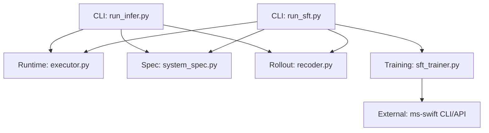
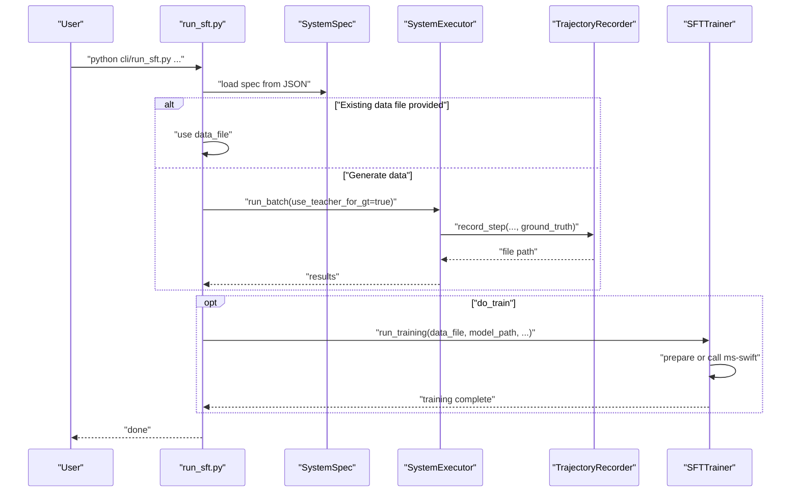
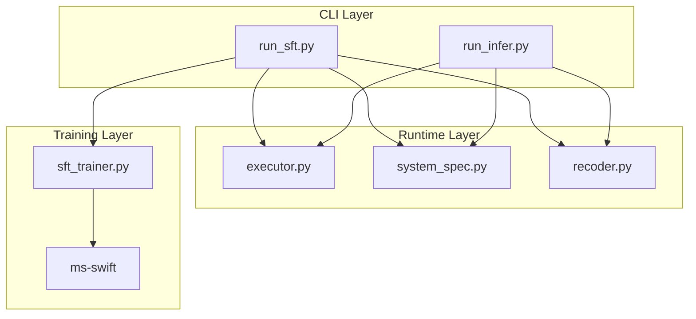
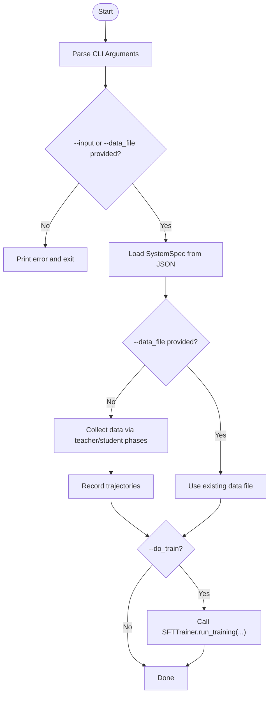
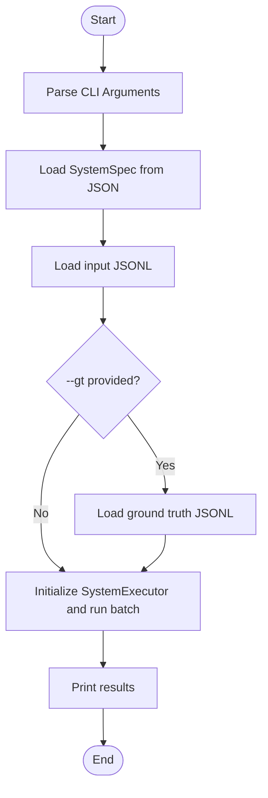
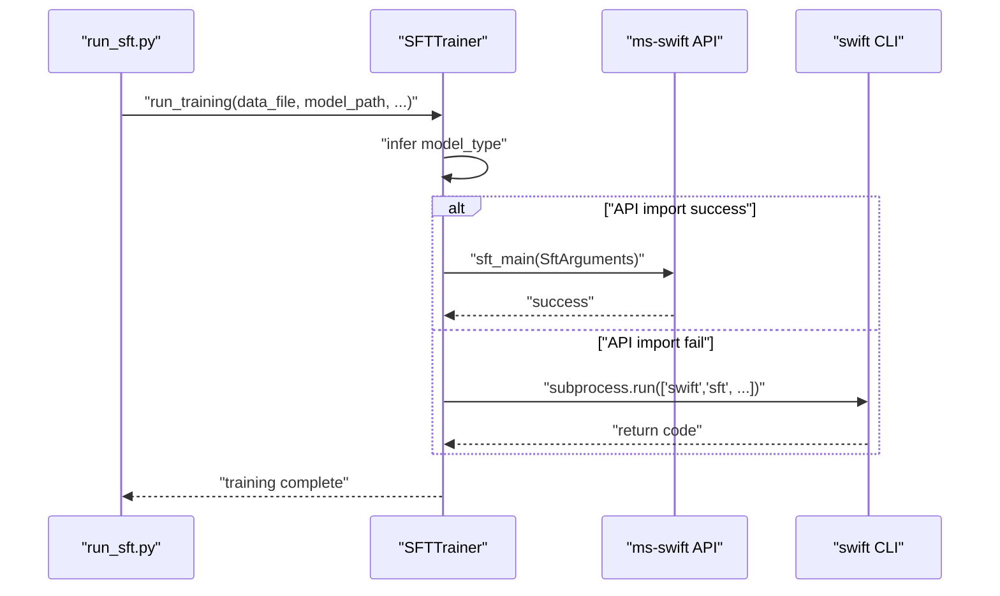
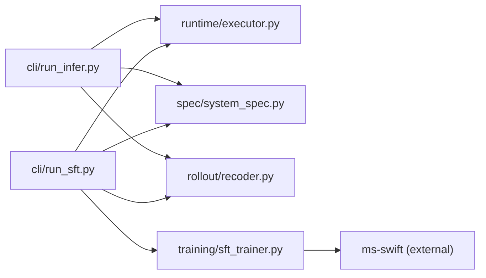

# CLI Commands

<cite>
**Referenced Files in This Document**
- [run_sft.py](file://cli/run_sft.py)
- [run_infer.py](file://cli/run_infer.py)
- [sft_trainer.py](file://training/sft_trainer.py)
- [executor.py](file://runtime/executor.py)
- [system_spec.py](file://spec/system_spec.py)
- [recoder.py](file://rollout/recoder.py)
- [requirements.txt](file://requirements.txt)
- [说明文档.txt](file://说明文档.txt)
</cite>

## Table of Contents
1. [Introduction](#introduction)
2. [Project Structure](#project-structure)
3. [Core Components](#core-components)
4. [Architecture Overview](#architecture-overview)
5. [Detailed Component Analysis](#detailed-component-analysis)
6. [Dependency Analysis](#dependency-analysis)
7. [Performance Considerations](#performance-considerations)
8. [Troubleshooting Guide](#troubleshooting-guide)
9. [Conclusion](#conclusion)
10. [Appendices](#appendices)

## Introduction
This document provides a comprehensive CLI command reference for the multi-agent system builder. It covers:
- The SFT training command for distillation-based supervised fine-tuning
- The inference command for batch execution of multi-agent systems
- Parameter specifications, input/output formats, and configuration options
- Usage examples, parameter combinations, and common workflows
- Exit codes, error messages, and troubleshooting steps
- Automation scripts and integration patterns with other tools

## Project Structure
The CLI tools are located under the cli/ directory and orchestrate the runtime, spec, and training modules:
- cli/run_sft.py: SFT training command
- cli/run_infer.py: Batch inference command
- runtime/executor.py: Multi-agent execution engine
- spec/system_spec.py: System specification loader and agent definitions
- rollout/recoder.py: Trajectory recording for SFT datasets
- training/sft_trainer.py: SFT trainer wrapper around ms-swift

**Diagram sources**
- [run_sft.py:17-117](file://cli/run_sft.py#L17-L117)
- [run_infer.py:8-46](file://cli/run_infer.py#L8-L46)
- [executor.py:9-132](file://runtime/executor.py#L9-L132)
- [system_spec.py:100-114](file://spec/system_spec.py#L100-L114)
- [recoder.py:8-122](file://rollout/recoder.py#L8-L122)
- [sft_trainer.py:28-206](file://training/sft_trainer.py#L28-L206)

**Section sources**
- [run_sft.py:17-117](file://cli/run_sft.py#L17-L117)
- [run_infer.py:8-46](file://cli/run_infer.py#L8-L46)
- [executor.py:9-132](file://runtime/executor.py#L9-L132)
- [system_spec.py:100-114](file://spec/system_spec.py#L100-L114)
- [recoder.py:8-122](file://rollout/recoder.py#L8-L122)
- [sft_trainer.py:28-206](file://training/sft_trainer.py#L28-L206)

## Core Components
- SFT CLI (cli/run_sft.py): Orchestrates teacher/student phases, trajectory recording, and triggers SFT training.
- Inference CLI (cli/run_infer.py): Loads system spec, runs batch inference, optionally compares against ground truth.
- Runtime Executor (runtime/executor.py): Executes agents in order, generates ground truth with teacher models, collects trajectories for SFT.
- System Spec (spec/system_spec.py): Defines agents, prompts, IO mappings, and training configuration.
- Trajectory Recorder (rollout/recoder.py): Records multi-step interactions and converts to SFT-ready formats.
- SFT Trainer (training/sft_trainer.py): Wraps ms-swift CLI/API for system-level SFT.

**Section sources**
- [run_sft.py:17-117](file://cli/run_sft.py#L17-L117)
- [run_infer.py:8-46](file://cli/run_infer.py#L8-L46)
- [executor.py:9-132](file://runtime/executor.py#L9-L132)
- [system_spec.py:77-96](file://spec/system_spec.py#L77-L96)
- [recoder.py:8-122](file://rollout/recoder.py#L8-L122)
- [sft_trainer.py:28-206](file://training/sft_trainer.py#L28-L206)

## Architecture Overview
The CLI commands coordinate a two-phase pipeline for SFT:
- Phase 1 (Teacher): Generate ground truths using teacher models.
- Phase 2 (Student): Execute student models, record trajectories, and optionally train.

**Diagram sources**
- [run_sft.py:36-114](file://cli/run_sft.py#L36-L114)
- [executor.py:16-132](file://runtime/executor.py#L16-L132)
- [recoder.py:15-42](file://rollout/recoder.py#L15-L42)
- [sft_trainer.py:28-206](file://training/sft_trainer.py#L28-L206)

## Detailed Component Analysis

### SFT Training Command Reference
- Purpose: Distillation-based supervised fine-tuning of a multi-agent system.
- Entry point: cli/run_sft.py
- Key behaviors:
  - Loads system specification from JSON.
  - Supports pre-generated training data or automated data collection via teacher/student phases.
  - Generates SFT dataset in SWIFT-compatible format.
  - Invokes SFT training via ms-swift CLI/API.

Parameters
- --spec STRING (required): Path to system specification JSON.
- --input STRING (optional): Path to input JSONL containing user requests.
- --output_dir STRING (default: ./sft_output): Output directory for trained model artifacts.
- --do_train FLAG: Trigger SFT training after data collection.
- --lr FLOAT (default: 2e-5): Learning rate for training.
- --batch_size INT (default: 4): Per-device training batch size.
- --epochs INT (default: 3): Number of training epochs.
- --teacher_only FLAG: Generate ground truths only (skip student phase and training).
- --data_file STRING (optional): Path to existing training data file (skip data collection).

Input Formats
- System specification JSON: Defines agents, prompts, IO mappings, and training configuration.
- Input JSONL (--input): One JSON object per line with user requests.
- Existing training data (--data_file): SWIFT-compatible JSONL with fields suitable for supervised fine-tuning.

Output Formats
- Trajectory JSONL: Generated during data collection; contains multi-step interactions and ground truths.
- SFT dataset JSONL: Converted from trajectories for SWIFT training.
- Trained model artifacts: Saved under output_dir by ms-swift.

Processing Logic
- Validation: Either --input or --data_file must be provided.
- Data collection:
  - Load inputs from JSONL.
  - Execute SystemExecutor with teacher models to produce ground truths.
  - Record steps with TrajectoryRecorder.
- Training:
  - If --do_train is set, call SFTTrainer.run_training with provided hyperparameters.
  - SFTTrainer infers model_type from model path and constructs ms-swift arguments.
  - Falls back to CLI mode if API import fails.

Exit Codes and Error Handling
- Non-zero exit codes occur when:
  - Missing required arguments.
  - Data file does not exist.
  - ms-swift subprocess fails.
- Error messages are printed to stderr/stdout by the CLI and training wrappers.

Usage Examples
- Generate data only:
  - python cli/run_sft.py --spec path/to/spec.json --input path/to/dataset.jsonl --teacher_only
- Generate data and train:
  - python cli/run_sft.py --spec path/to/spec.json --input path/to/dataset.jsonl --do_train
- Use existing data:
  - python cli/run_sft.py --spec path/to/spec.json --data_file path/to/data.jsonl --do_train --lr 1e-5 --batch_size 8 --epochs 5
- Skip student phase:
  - python cli/run_sft.py --spec path/to/spec.json --input path/to/dataset.jsonl --teacher_only

Common Workflows
- Data-first workflow: Prepare dataset.jsonl, then run with --data_file and --do_train.
- Pipeline workflow: Use --input to generate trajectories, then re-run with --data_file and --do_train.

Integration Patterns
- Combine with ms-swift: Ensure ms-swift is installed and available in PATH.
- Automation scripts: Chain CLI invocations with shell scripts or CI jobs to automate data collection and training.

**Section sources**
- [run_sft.py:17-117](file://cli/run_sft.py#L17-L117)
- [executor.py:16-132](file://runtime/executor.py#L16-L132)
- [recoder.py:44-96](file://rollout/recoder.py#L44-L96)
- [sft_trainer.py:28-206](file://training/sft_trainer.py#L28-L206)

### Inference Command Reference
- Purpose: Run batch inference with a multi-agent system.
- Entry point: cli/run_infer.py
- Key behaviors:
  - Loads system specification from JSON.
  - Reads input JSONL and optional ground truth JSONL.
  - Executes agents via SystemExecutor and records state.

Parameters
- --spec STRING (required): Path to system specification JSON.
- --input STRING (required): Path to input JSONL file.
- --gt STRING (optional): Path to ground truth JSONL file.

Input Formats
- System specification JSON: Defines agents and execution order.
- Input JSONL: One JSON object per line representing user requests.
- Ground truth JSONL: Optional; one JSON object per line with expected outputs for comparison.

Output Formats
- Results are stored in the execution state and printed to stdout for inspection.

Processing Logic
- Load system spec and agents.
- Parse input and optional ground truth files.
- Initialize SystemExecutor with trajectory recording enabled.
- Execute run_batch(inputs, gt_list).
- Print completion message and sample results.

Usage Examples
- Basic inference:
  - python cli/run_infer.py --spec path/to/spec.json --input path/to/inputs.jsonl
- Inference with ground truth:
  - python cli/run_infer.py --spec path/to/spec.json --input path/to/inputs.jsonl --gt path/to/gt.jsonl

Common Workflows
- Debugging: Use --gt to compare outputs with expected values.
- Batch evaluation: Prepare large input sets and iterate over results.

**Section sources**
- [run_infer.py:8-46](file://cli/run_infer.py#L8-L46)
- [executor.py:16-132](file://runtime/executor.py#L16-L132)

### SFT Trainer Internals
- Purpose: Wrapper around ms-swift for system-level SFT.
- Key behaviors:
  - Infers model_type from model path.
  - Builds SftArguments or constructs CLI command.
  - Attempts API mode first, falls back to CLI mode.
  - Logs hardware detection and training progress.

Parameters Passed to Training
- data_file: Path to SFT dataset.
- model_path: Path to base model.
- output_dir: Directory for checkpoints/logs.
- lr, batch_size, epochs: Hyperparameters.
- config_file: Optional system spec used for loss weights.

Processing Logic
- Infer model_type based on model path substrings.
- Configure SftArguments with defaults and overrides.
- Try sft_main(args) via ms-swift API.
- On failure, construct and execute swift sft CLI with computed arguments.
- Detect CUDA availability and adjust CLI flags accordingly.

**Section sources**
- [sft_trainer.py:28-206](file://training/sft_trainer.py#L28-L206)

### System Specification and Agent Definitions
- Purpose: Define agents, prompts, IO mappings, and training configuration.
- Key structures:
  - AgentSpec: agent_id, model, instruction_prompt, input/output mappings, training config, teacher_model.
  - SystemSpec: list of AgentSpec loaded from JSON.

Training Configuration Highlights
- mode: sft or grpo.
- dataset.input_key: dataset field used as system input.
- ground_truth.gt_key: dataset field used as supervision target for an agent’s output.
- loss.weight: weighting for loss contribution of an agent.
- train_parameters: lr, batch_size, num_epochs.

**Section sources**
- [system_spec.py:77-96](file://spec/system_spec.py#L77-L96)
- [system_spec.py:100-114](file://spec/system_spec.py#L100-L114)

### Trajectory Recording and Dataset Conversion
- Purpose: Convert multi-step agent interactions into SFT-ready formats.
- Key behaviors:
  - record_step: Writes JSONL entries with messages and metadata.
  - assemble_sft_dataset: Groups records by sample_id and merges messages.
  - convert_to_swift_format: Produces SWIFT-compatible records.

Formats
- Trajectory JSONL: Records per step with messages and optional ground_truth.
- SFT dataset JSONL: Aggregated per sample with merged messages and ground truths.
- SWIFT format JSONL: Records with messages and loss_weight.

**Section sources**
- [recoder.py:15-42](file://rollout/recoder.py#L15-L42)
- [recoder.py:44-96](file://rollout/recoder.py#L44-L96)
- [recoder.py:98-122](file://rollout/recoder.py#L98-L122)

## Architecture Overview
The CLI commands integrate runtime execution, trajectory recording, and SFT training into a cohesive workflow.

**Diagram sources**
- [run_sft.py:17-117](file://cli/run_sft.py#L17-L117)
- [run_infer.py:8-46](file://cli/run_infer.py#L8-L46)
- [executor.py:9-132](file://runtime/executor.py#L9-L132)
- [system_spec.py:100-114](file://spec/system_spec.py#L100-L114)
- [recoder.py:8-122](file://rollout/recoder.py#L8-L122)
- [sft_trainer.py:28-206](file://training/sft_trainer.py#L28-L206)

## Detailed Component Analysis

### SFT CLI Flow

**Diagram sources**
- [run_sft.py:32-114](file://cli/run_sft.py#L32-L114)

**Section sources**
- [run_sft.py:32-114](file://cli/run_sft.py#L32-L114)

### Inference CLI Flow

**Diagram sources**
- [run_infer.py:13-43](file://cli/run_infer.py#L13-L43)

**Section sources**
- [run_infer.py:13-43](file://cli/run_infer.py#L13-L43)

### SFT Training Flow

**Diagram sources**
- [sft_trainer.py:74-181](file://training/sft_trainer.py#L74-L181)

**Section sources**
- [sft_trainer.py:74-181](file://training/sft_trainer.py#L74-L181)

## Dependency Analysis
- CLI depends on runtime, spec, rollout, and training modules.
- SFTTrainer depends on ms-swift (Python API or CLI).
- SystemSpec defines agent configurations consumed by runtime and CLI.

**Diagram sources**
- [run_sft.py:12-14](file://cli/run_sft.py#L12-L14)
- [run_infer.py:2-5](file://cli/run_infer.py#L2-L5)
- [sft_trainer.py:153-154](file://training/sft_trainer.py#L153-L154)

**Section sources**
- [run_sft.py:12-14](file://cli/run_sft.py#L12-L14)
- [run_infer.py:2-5](file://cli/run_infer.py#L2-L5)
- [sft_trainer.py:153-154](file://training/sft_trainer.py#L153-L154)

## Performance Considerations
- Batch size and learning rate impact convergence speed and memory usage.
- Using GPU accelerators reduces training time; the trainer detects CUDA availability and adjusts flags accordingly.
- Trajectory recording writes to disk incrementally; ensure sufficient disk space for large datasets.
- For large-scale inference, consider splitting input JSONL into chunks and processing in batches.

## Troubleshooting Guide
Common Issues and Fixes
- Missing required arguments:
  - Ensure either --input or --data_file is provided.
- Data file not found:
  - Verify --data_file path exists.
- ms-swift not installed:
  - Install ms-swift or rely on CLI fallback; note that API mode is preferred.
- Training failures:
  - Check return codes from subprocess; review logs for errors.
- CUDA/CPU detection:
  - If no GPU detected, training runs on CPU with reduced precision flags.

Error Messages
- CLI prints explicit error messages for invalid inputs and missing files.
- SFTTrainer logs model_type inference and training command construction.

**Section sources**
- [run_sft.py:33-53](file://cli/run_sft.py#L33-L53)
- [sft_trainer.py:176-181](file://training/sft_trainer.py#L176-L181)

## Conclusion
The CLI tools provide a streamlined workflow for multi-agent system inference and SFT training. By combining system specifications, trajectory recording, and ms-swift integration, users can automate data collection, training, and evaluation with minimal boilerplate.

## Appendices

### Parameter Reference Summary
- SFT CLI:
  - --spec STRING (required)
  - --input STRING (optional)
  - --output_dir STRING (default: ./sft_output)
  - --do_train FLAG
  - --lr FLOAT (default: 2e-5)
  - --batch_size INT (default: 4)
  - --epochs INT (default: 3)
  - --teacher_only FLAG
  - --data_file STRING (optional)
- Inference CLI:
  - --spec STRING (required)
  - --input STRING (required)
  - --gt STRING (optional)

### Example Specifications
- System specification JSON describes agents, prompts, IO mappings, and training configuration. See [说明文档.txt:46-107](file://说明文档.txt#L46-L107) for a practical example.

**Section sources**
- [说明文档.txt:46-107](file://说明文档.txt#L46-L107)