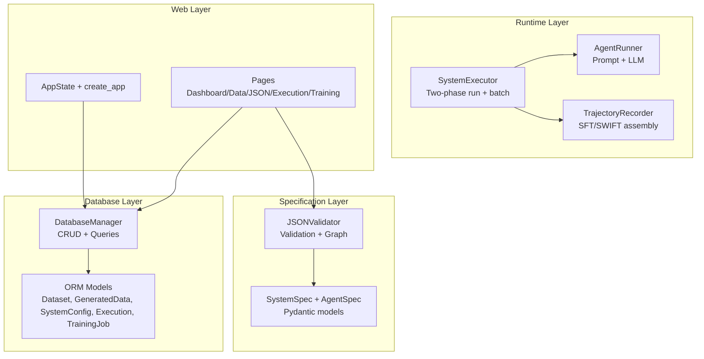
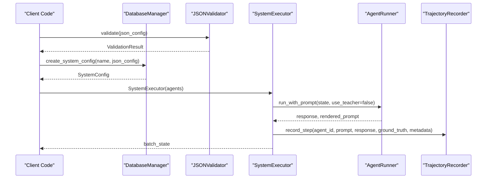
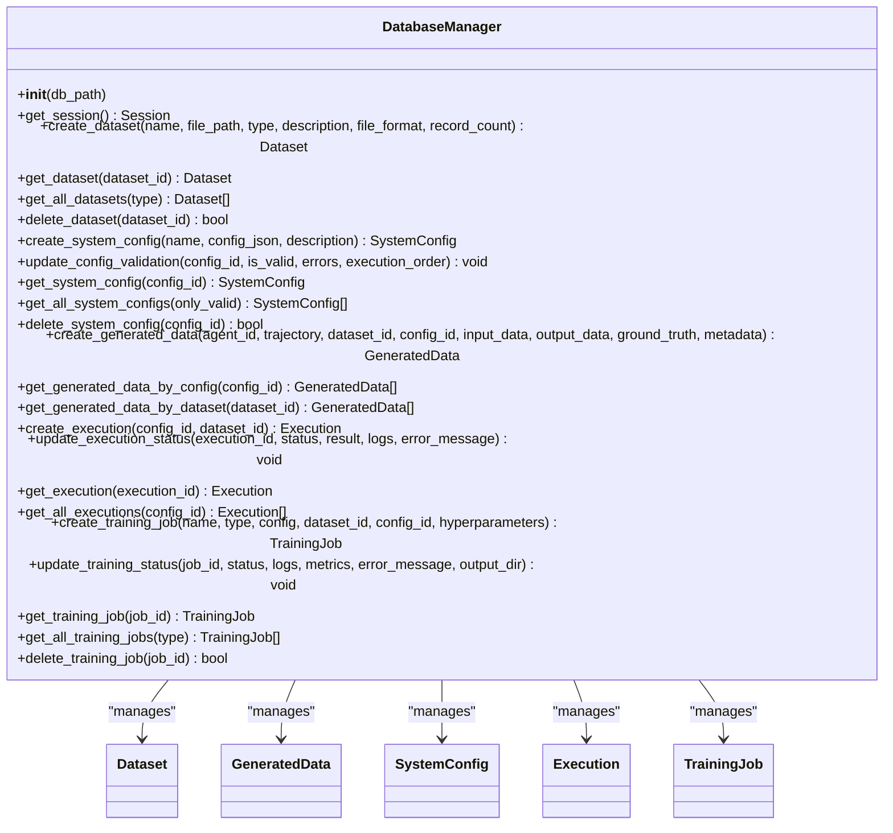
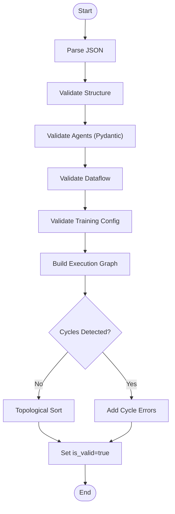
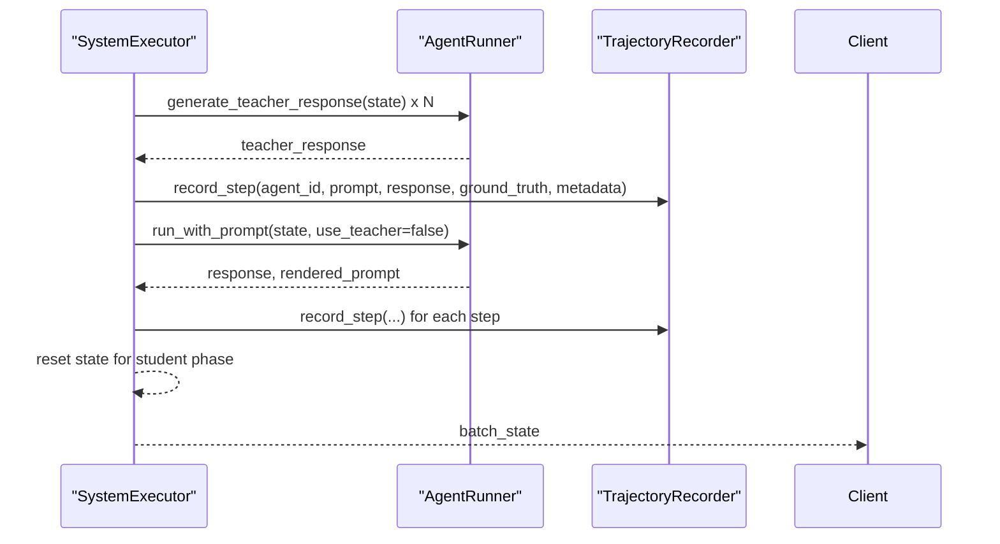
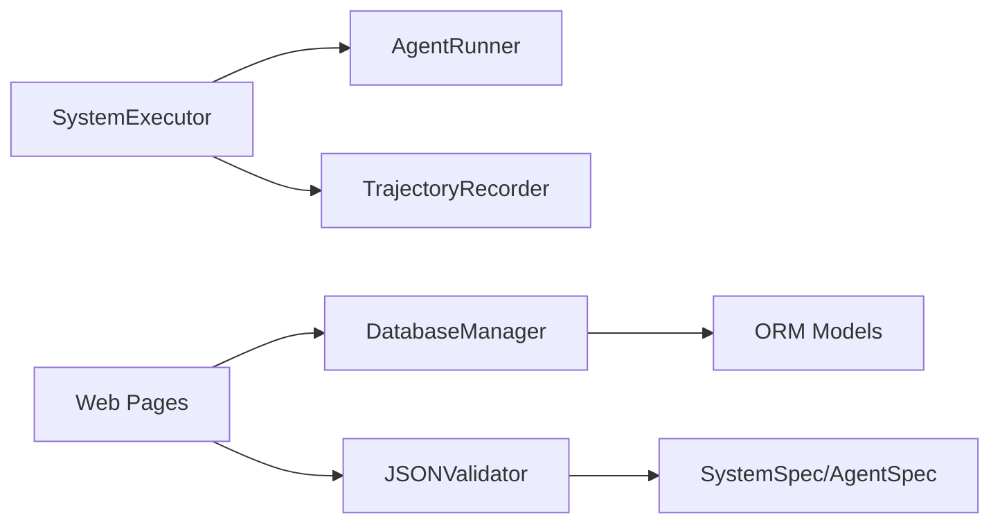

# Programmatic Interfaces

<cite>
**Referenced Files in This Document**
- [database/db_manager.py](file://database/db_manager.py)
- [database/models.py](file://database/models.py)
- [spec/system_spec.py](file://spec/system_spec.py)
- [runtime/executor.py](file://runtime/executor.py)
- [runtime/agent_runner.py](file://runtime/agent_runner.py)
- [rollout/recoder.py](file://rollout/recoder.py)
- [core/json_validator.py](file://core/json_validator.py)
- [web/app.py](file://web/app.py)
- [web/pages/dashboard.py](file://web/pages/dashboard.py)
- [web/pages/data_manager.py](file://web/pages/data_manager.py)
- [web/pages/json_config.py](file://web/pages/json_config.py)
- [configs/api_config.yaml](file://configs/api_config.yaml)
</cite>

## Table of Contents
1. [Introduction](#introduction)
2. [Project Structure](#project-structure)
3. [Core Components](#core-components)
4. [Architecture Overview](#architecture-overview)
5. [Detailed Component Analysis](#detailed-component-analysis)
6. [Dependency Analysis](#dependency-analysis)
7. [Performance Considerations](#performance-considerations)
8. [Troubleshooting Guide](#troubleshooting-guide)
9. [Conclusion](#conclusion)
10. [Appendices](#appendices)

## Introduction
This document describes the programmatic interfaces available for integrating with the multi-agent system. It focuses on:
- The DatabaseManager class for CRUD operations, queries, and transaction-like semantics via SQLAlchemy sessions
- System configuration APIs for validating and persisting JSON-based system specifications
- Execution orchestration APIs enabling automated workflows and batch processing
- Practical integration patterns, error handling, and best practices

The interfaces are designed for both Web UI automation and headless programmatic usage, with clear separation of concerns across database persistence, configuration validation, execution orchestration, and data recording.

## Project Structure
The integration surface spans several modules:
- Database layer: ORM models and a manager class for SQLite-backed persistence
- Specification layer: Pydantic models and validators for system configuration
- Runtime layer: Executor orchestrating multi-agent runs and trajectory recording
- Web layer: Application state and page handlers exposing programmatic hooks

**Diagram sources**
- [database/db_manager.py:11-347](file://database/db_manager.py#L11-L347)
- [database/models.py:10-123](file://database/models.py#L10-L123)
- [spec/system_spec.py:100-114](file://spec/system_spec.py#L100-L114)
- [core/json_validator.py:37-347](file://core/json_validator.py#L37-L347)
- [runtime/executor.py:9-132](file://runtime/executor.py#L9-L132)
- [runtime/agent_runner.py:10-68](file://runtime/agent_runner.py#L10-L68)
- [rollout/recoder.py:8-122](file://rollout/recoder.py#L8-L122)
- [web/app.py:11-173](file://web/app.py#L11-L173)
- [web/pages/dashboard.py:6-140](file://web/pages/dashboard.py#L6-L140)
- [web/pages/data_manager.py:8-310](file://web/pages/data_manager.py#L8-L310)
- [web/pages/json_config.py:8-377](file://web/pages/json_config.py#L8-L377)

**Section sources**
- [database/db_manager.py:11-347](file://database/db_manager.py#L11-L347)
- [database/models.py:10-123](file://database/models.py#L10-L123)
- [spec/system_spec.py:100-114](file://spec/system_spec.py#L100-L114)
- [runtime/executor.py:9-132](file://runtime/executor.py#L9-L132)
- [runtime/agent_runner.py:10-68](file://runtime/agent_runner.py#L10-L68)
- [rollout/recoder.py:8-122](file://rollout/recoder.py#L8-L122)
- [web/app.py:11-173](file://web/app.py#L11-L173)
- [web/pages/dashboard.py:6-140](file://web/pages/dashboard.py#L6-L140)
- [web/pages/data_manager.py:8-310](file://web/pages/data_manager.py#L8-L310)
- [web/pages/json_config.py:8-377](file://web/pages/json_config.py#L8-L377)

## Core Components
This section documents the primary programmatic entry points and their capabilities.

- DatabaseManager
  - Purpose: Centralized CRUD and query interface backed by SQLAlchemy
  - Key responsibilities:
    - Dataset lifecycle: create, read, list, delete
    - System configuration lifecycle: create, validate-update, read, list, delete
    - Generated data lifecycle: create, filter by config/dataset
    - Execution lifecycle: create, status update, read, list
    - Training job lifecycle: create, status update, read, list, delete
  - Transaction handling: Uses per-method SQLAlchemy sessions with explicit commit/close semantics

- SystemSpec and JSONValidator
  - Purpose: Define and validate system configuration schemas and enforce dataflow correctness
  - Key responsibilities:
    - Parse and validate JSON configurations against Pydantic models
    - Detect invalid fields, missing keys, duplicate agent IDs, invalid training modes
    - Build execution graph and detect cycles via topological sort
    - Produce execution order and dataflow graph for visualization

- SystemExecutor and AgentRunner
  - Purpose: Execute multi-agent workflows in two phases and collect trajectories
  - Key responsibilities:
    - Two-phase execution: teacher phase for ground truth generation, student phase for trajectory collection
    - Batch processing over input lists
    - Prompt rendering and LLM invocation
    - Trajectory recording for downstream training formats

- TrajectoryRecorder
  - Purpose: Persist and assemble rollout data into SFT/SWIFT formats
  - Key responsibilities:
    - Append per-step records with optional ground truth
    - Assemble per-sample datasets for SFT
    - Convert to SWIFT-compatible format

- Web AppState and Page Handlers
  - Purpose: Expose programmatic hooks for UI automation and external integrations
  - Key responsibilities:
    - Hold a shared DatabaseManager instance
    - Provide event handlers for upload, validation, filtering, and export
    - Offer refresh and navigation helpers

**Section sources**
- [database/db_manager.py:11-347](file://database/db_manager.py#L11-L347)
- [database/models.py:10-123](file://database/models.py#L10-L123)
- [spec/system_spec.py:100-114](file://spec/system_spec.py#L100-L114)
- [core/json_validator.py:37-347](file://core/json_validator.py#L37-L347)
- [runtime/executor.py:9-132](file://runtime/executor.py#L9-L132)
- [runtime/agent_runner.py:10-68](file://runtime/agent_runner.py#L10-L68)
- [rollout/recoder.py:8-122](file://rollout/recoder.py#L8-L122)
- [web/app.py:11-173](file://web/app.py#L11-L173)
- [web/pages/data_manager.py:8-310](file://web/pages/data_manager.py#L8-L310)
- [web/pages/json_config.py:8-377](file://web/pages/json_config.py#L8-L377)

## Architecture Overview
The integration architecture separates persistence, validation, execution, and presentation:

**Diagram sources**
- [core/json_validator.py:43-82](file://core/json_validator.py#L43-L82)
- [database/db_manager.py:92-108](file://database/db_manager.py#L92-L108)
- [runtime/executor.py:16-132](file://runtime/executor.py#L16-L132)
- [runtime/agent_runner.py:33-68](file://runtime/agent_runner.py#L33-L68)
- [rollout/recoder.py:15-42](file://rollout/recoder.py#L15-L42)

## Detailed Component Analysis

### DatabaseManager
- Instantiation
  - Default SQLite path resolved under the project’s data directory
  - Creates tables automatically on initialization
- Session management
  - Per-operation session creation and cleanup
  - Explicit commit/close in try/finally blocks
- Datasets
  - Create: name, description, type, file_path, file_format, record_count
  - Read: by ID
  - List: optionally filtered by type, ordered by creation time descending
  - Delete: by ID
- SystemConfig
  - Create: name, description, config_json; computes agent_count
  - Validation update: is_valid, validation_errors, execution_order
  - Read: by ID
  - List: optionally filtered by validity
  - Delete: by ID
- GeneratedData
  - Create: agent_id, trajectory, optional dataset_id/config_id, input/output/ground_truth/metadata
  - Filter: by config_id or dataset_id
- Execution
  - Create: config_id, optional dataset_id; initializes status pending
  - Status update: status, result/logs/error_message; sets timestamps on transitions
  - Read: by ID
  - List: optionally filtered by config_id
- TrainingJob
  - Create: name, type, config, optional dataset_id/config_id, hyperparameters
  - Status update: status, logs/metrics/error_message/output_dir; sets timestamps on transitions
  - Read: by ID
  - List: optionally filtered by type
  - Delete: by ID

Best practices:
- Always handle exceptions around session operations and call close in finally blocks
- Use list queries with filters to avoid loading unnecessary rows
- For batch operations, iterate and commit per operation to keep transactions small

**Section sources**
- [database/db_manager.py:14-347](file://database/db_manager.py#L14-L347)
- [database/models.py:10-123](file://database/models.py#L10-L123)

#### DatabaseManager Class Diagram

**Diagram sources**
- [database/db_manager.py:11-347](file://database/db_manager.py#L11-L347)
- [database/models.py:10-123](file://database/models.py#L10-L123)

### SystemSpec and JSONValidator
- SystemSpec
  - Root model containing a list of AgentSpec entries
  - Provides a convenience loader from file
- AgentSpec and nested models
  - ModelConfig, PromptConfig, IOMapping, OutputMapping, TrainingConfig, GroundTruthConfig, LossConfig, TrainParams
  - Helpers to extract model names and teacher model names
- JSONValidator
  - Validates JSON structure, required fields, uniqueness, and dataflow connectivity
  - Enforces training mode constraints and detects cycles in execution graph
  - Produces execution order and dataflow graph for visualization

Integration pattern:
- Load JSON into JSONValidator.validate()
- On success, persist via DatabaseManager.create_system_config()
- Update validation status via update_config_validation()

**Section sources**
- [spec/system_spec.py:100-114](file://spec/system_spec.py#L100-L114)
- [core/json_validator.py:43-347](file://core/json_validator.py#L43-L347)

#### Validation Flow

**Diagram sources**
- [core/json_validator.py:43-267](file://core/json_validator.py#L43-L267)

### SystemExecutor and AgentRunner
- SystemExecutor
  - Two-phase execution:
    - Phase 1 (teacher): generate ground truth for agents with teacher models
    - Phase 2 (student): run student models, render prompts, collect trajectories
  - Batch processing: accepts a list of input dictionaries
  - Optional skipping of student phase for pure GT generation
- AgentRunner
  - Renders Jinja2 templates using input mappings
  - Selects LLM provider (Qwen/OpenAI) based on configuration
  - Supports teacher vs student mode selection

Integration pattern:
- Instantiate SystemExecutor with a list of AgentSpec
- Call run_batch(inputs, ground_truths, flags)
- Optionally use TrajectoryRecorder to persist and assemble datasets

**Section sources**
- [runtime/executor.py:16-132](file://runtime/executor.py#L16-L132)
- [runtime/agent_runner.py:33-68](file://runtime/agent_runner.py#L33-L68)

#### Two-Phase Execution Sequence

**Diagram sources**
- [runtime/executor.py:32-127](file://runtime/executor.py#L32-L127)
- [runtime/agent_runner.py:33-68](file://runtime/agent_runner.py#L33-L68)
- [rollout/recoder.py:15-42](file://rollout/recoder.py#L15-L42)

### TrajectoryRecorder
- Records per-step interactions with optional ground truth
- Assembles per-sample SFT datasets
- Converts to SWIFT format preserving messages and loss weights

Integration pattern:
- Pass recorder instance to SystemExecutor during construction
- After execution, call assemble_sft_dataset() or convert_to_swift_format()

**Section sources**
- [rollout/recoder.py:44-122](file://rollout/recoder.py#L44-L122)

### Web Application State and Page Handlers
- AppState holds a shared DatabaseManager and current IDs for active items
- Page handlers expose programmatic hooks for:
  - Uploading datasets and saving to DB
  - Validating JSON configurations and updating validation status
  - Filtering generated data and exporting training artifacts
  - Refreshing lists and navigating between pages

Integration pattern:
- Initialize AppState in your own process
- Invoke page handler functions programmatically for automation
- Use DatabaseManager methods for bulk operations

**Section sources**
- [web/app.py:11-173](file://web/app.py#L11-L173)
- [web/pages/data_manager.py:135-306](file://web/pages/data_manager.py#L135-L306)
- [web/pages/json_config.py:181-376](file://web/pages/json_config.py#L181-L376)

## Dependency Analysis
- DatabaseManager depends on SQLAlchemy engine/session and ORM models
- SystemExecutor depends on AgentRunner and TrajectoryRecorder
- JSONValidator depends on Pydantic models and NetworkX for graph analysis
- Web pages depend on DatabaseManager and JSONValidator for UI automation

**Diagram sources**
- [database/db_manager.py:11-347](file://database/db_manager.py#L11-L347)
- [database/models.py:10-123](file://database/models.py#L10-L123)
- [runtime/executor.py:9-132](file://runtime/executor.py#L9-L132)
- [runtime/agent_runner.py:10-68](file://runtime/agent_runner.py#L10-L68)
- [rollout/recoder.py:8-122](file://rollout/recoder.py#L8-L122)
- [core/json_validator.py:37-347](file://core/json_validator.py#L37-L347)
- [spec/system_spec.py:100-114](file://spec/system_spec.py#L100-L114)
- [web/pages/data_manager.py:8-310](file://web/pages/data_manager.py#L8-L310)
- [web/pages/json_config.py:8-377](file://web/pages/json_config.py#L8-L377)

**Section sources**
- [database/db_manager.py:11-347](file://database/db_manager.py#L11-L347)
- [runtime/executor.py:9-132](file://runtime/executor.py#L9-L132)
- [core/json_validator.py:37-347](file://core/json_validator.py#L37-L347)
- [web/pages/json_config.py:8-377](file://web/pages/json_config.py#L8-L377)

## Performance Considerations
- Use pagination or limit filters on list queries (e.g., get_all_datasets/get_all_system_configs/get_all_training_jobs)
- Keep batch sizes reasonable to avoid long-running transactions
- Minimize repeated session creation by reusing DatabaseManager instances
- For large exports, stream writes and avoid loading entire datasets into memory
- Prefer filtering by foreign keys (config_id/dataset_id) to reduce scans

## Troubleshooting Guide
Common issues and resolutions:
- JSON validation failures
  - Cause: missing fields, invalid types, duplicate agent IDs, invalid training modes
  - Resolution: inspect ValidationResult.errors/warnings; fix configuration and re-validate
- Execution graph cycles
  - Cause: circular input/output dependencies
  - Resolution: adjust agent input mappings to remove cycles; rely on execution_order from validator
- Missing keys in state during execution
  - Cause: Agent input mappings reference keys not present in state
  - Resolution: ensure upstream agents produce required keys; verify dataflow graph
- Database session errors
  - Cause: unhandled exceptions interrupting session.close()
  - Resolution: wrap operations in try/finally or use context managers; ensure commit/close

**Section sources**
- [core/json_validator.py:124-267](file://core/json_validator.py#L124-L267)
- [runtime/agent_runner.py:33-42](file://runtime/agent_runner.py#L33-L42)
- [database/db_manager.py:41-56](file://database/db_manager.py#L41-L56)

## Conclusion
The system exposes robust programmatic interfaces:
- DatabaseManager for reliable persistence and querying
- JSONValidator and SystemSpec for safe configuration management
- SystemExecutor for automated, two-phase execution with trajectory recording
- Web page handlers for UI-driven automation

Adopt the recommended patterns for error handling, transaction boundaries, and batch processing to integrate seamlessly.

## Appendices

### API Reference: DatabaseManager
- Datasets
  - create_dataset(name, file_path, type="test", description=None, file_format="jsonl", record_count=0) -> Dataset
  - get_dataset(dataset_id: int) -> Dataset or None
  - get_all_datasets(type: str = None) -> List[Dataset]
  - delete_dataset(dataset_id: int) -> bool
- SystemConfig
  - create_system_config(name: str, config_json: dict, description: str = None) -> SystemConfig
  - update_config_validation(config_id: int, is_valid: bool, errors: str = None, execution_order: list = None) -> None
  - get_system_config(config_id: int) -> SystemConfig or None
  - get_all_system_configs(only_valid: bool = False) -> List[SystemConfig]
  - delete_system_config(config_id: int) -> bool
- GeneratedData
  - create_generated_data(agent_id: str, trajectory: dict, dataset_id: int = None, config_id: int = None, input_data: dict = None, output_data: dict = None, ground_truth: dict = None, metadata: dict = None) -> GeneratedData
  - get_generated_data_by_config(config_id: int) -> List[GeneratedData]
  - get_generated_data_by_dataset(dataset_id: int) -> List[GeneratedData]
- Execution
  - create_execution(config_id: int, dataset_id: int = None) -> Execution
  - update_execution_status(execution_id: int, status: str, result: dict = None, logs: str = None, error_message: str = None) -> None
  - get_execution(execution_id: int) -> Execution or None
  - get_all_executions(config_id: int = None) -> List[Execution]
- TrainingJob
  - create_training_job(name: str, type: str, config: dict, dataset_id: int = None, config_id: int = None, hyperparameters: dict = None) -> TrainingJob
  - update_training_status(job_id: int, status: str, logs: str = None, metrics: dict = None, error_message: str = None, output_dir: str = None) -> None
  - get_training_job(job_id: int) -> TrainingJob or None
  - get_all_training_jobs(type: str = None) -> List[TrainingJob]
  - delete_training_job(job_id: int) -> bool

**Section sources**
- [database/db_manager.py:37-347](file://database/db_manager.py#L37-L347)

### API Reference: SystemSpec and JSONValidator
- SystemSpec
  - from_file(file_path: str) -> SystemSpec
- JSONValidator
  - validate(json_data: Any) -> ValidationResult
  - validate_file(file_path: str) -> ValidationResult
  - get_dataflow_graph(json_data: Any) -> Dict

**Section sources**
- [spec/system_spec.py:100-114](file://spec/system_spec.py#L100-L114)
- [core/json_validator.py:43-347](file://core/json_validator.py#L43-L347)

### API Reference: SystemExecutor
- run_batch(inputs: List[Dict], ground_truths: Optional[List[Dict]] = None, use_teacher_for_gt: bool = True, skip_student_phase: bool = False) -> List[Dict]

**Section sources**
- [runtime/executor.py:16-132](file://runtime/executor.py#L16-L132)

### API Reference: TrajectoryRecorder
- record_step(agent_id: str, prompt: str, response: str, ground_truth: Optional[str] = None, metadata: Dict = None) -> None
- get_file_path() -> str
- assemble_sft_dataset(output_file: str = None) -> str
- convert_to_swift_format(output_file: str = None) -> str

**Section sources**
- [rollout/recoder.py:15-122](file://rollout/recoder.py#L15-L122)

### Integration Examples

- Programmatic configuration validation and persistence
  - Steps:
    - Load JSON with JSONValidator.validate()
    - On success, call DatabaseManager.create_system_config()
    - Update validation status with update_config_validation()
  - References:
    - [web/pages/json_config.py:181-242](file://web/pages/json_config.py#L181-L242)
    - [database/db_manager.py:92-123](file://database/db_manager.py#L92-L123)

- Automated dataset upload and listing
  - Steps:
    - Upload file via page handler logic
    - Save to DB with create_dataset()
    - List datasets with get_all_datasets()
  - References:
    - [web/pages/data_manager.py:135-193](file://web/pages/data_manager.py#L135-L193)
    - [database/db_manager.py:37-75](file://database/db_manager.py#L37-L75)

- Two-phase execution and trajectory export
  - Steps:
    - Build SystemExecutor with agents
    - Run run_batch() to collect trajectories
    - Export via TrajectoryRecorder.assemble_sft_dataset() or convert_to_swift_format()
  - References:
    - [runtime/executor.py:16-132](file://runtime/executor.py#L16-L132)
    - [rollout/recoder.py:44-122](file://rollout/recoder.py#L44-L122)

- Best practices
  - Wrap session operations in try/finally or use context managers
  - Limit list query results and filter by foreign keys
  - Validate configurations before persisting
  - Stream large exports and avoid loading entire datasets into memory

**Section sources**
- [runtime/executor.py:16-132](file://runtime/executor.py#L16-L132)
- [rollout/recoder.py:44-122](file://rollout/recoder.py#L44-L122)
- [web/pages/data_manager.py:135-193](file://web/pages/data_manager.py#L135-L193)
- [web/pages/json_config.py:181-242](file://web/pages/json_config.py#L181-L242)

### System Configuration APIs
- Provider configuration (YAML)
  - Keys: provider name, API key, base URL, model
  - Example providers: qwen, openai
  - References:
    - [configs/api_config.yaml:1-9](file://configs/api_config.yaml#L1-L9)

**Section sources**
- [configs/api_config.yaml:1-9](file://configs/api_config.yaml#L1-L9)