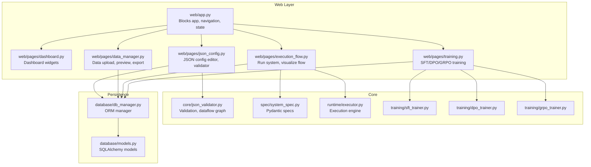
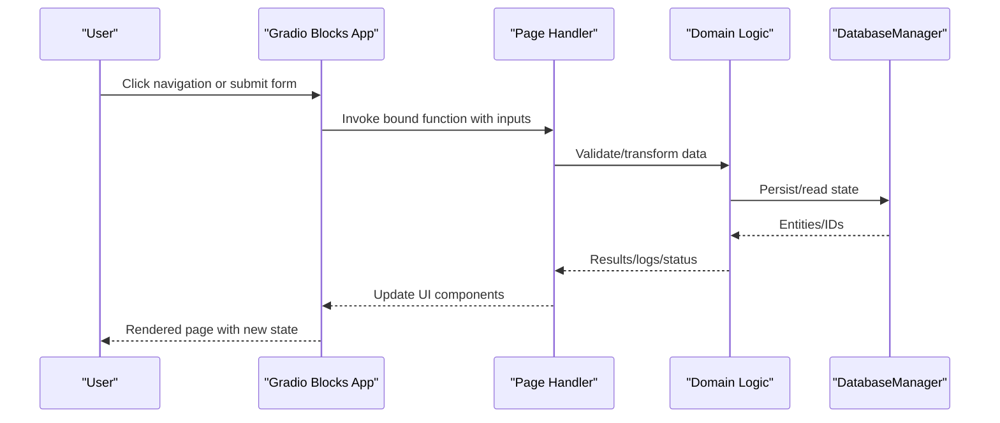
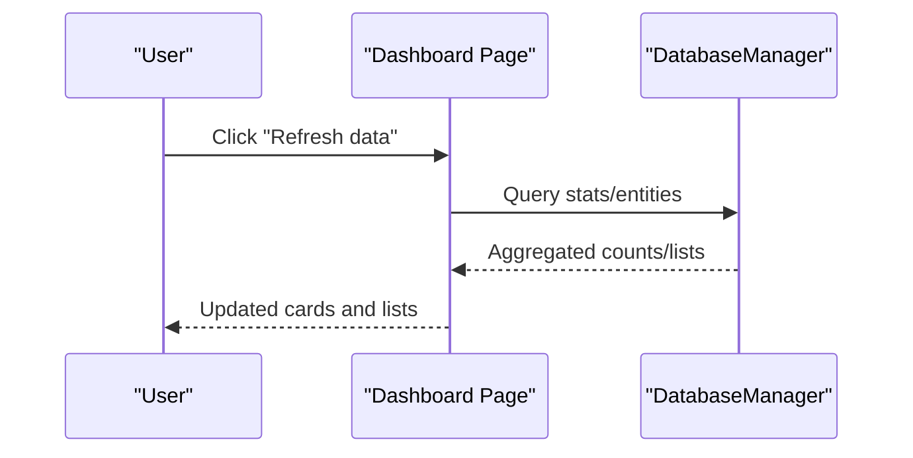
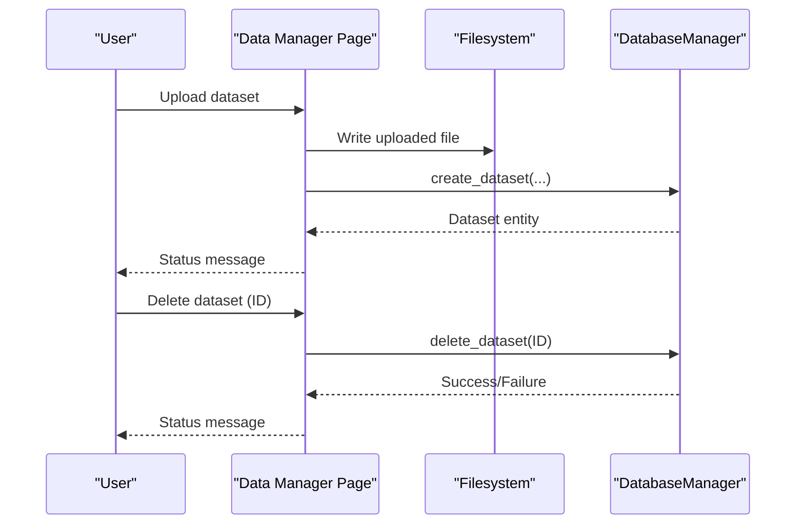
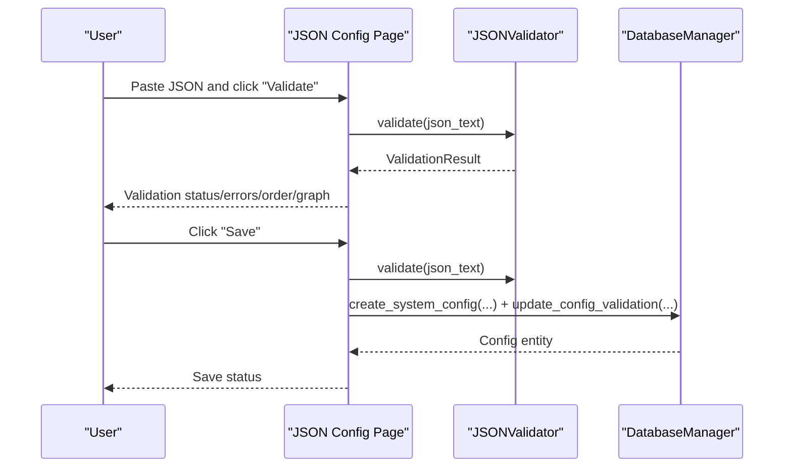
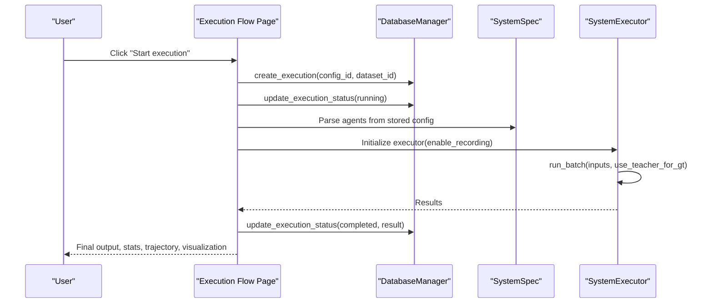
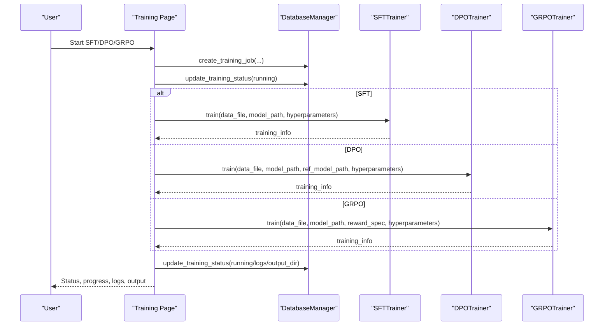
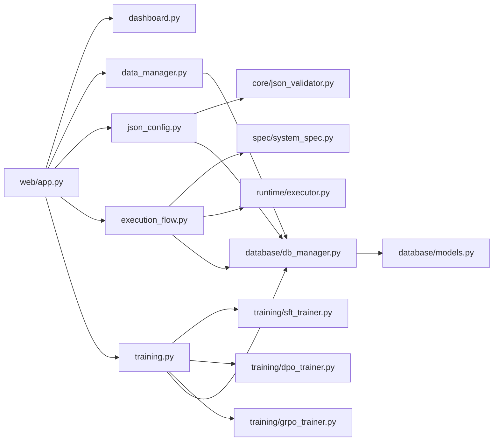

# Web API Endpoints

<cite>
**Referenced Files in This Document**
- [web/app.py](file://web/app.py)
- [main_web.py](file://main_web.py)
- [web/pages/dashboard.py](file://web/pages/dashboard.py)
- [web/pages/data_manager.py](file://web/pages/data_manager.py)
- [web/pages/json_config.py](file://web/pages/json_config.py)
- [web/pages/execution_flow.py](file://web/pages/execution_flow.py)
- [web/pages/training.py](file://web/pages/training.py)
- [database/db_manager.py](file://database/db_manager.py)
- [database/models.py](file://database/models.py)
- [core/json_validator.py](file://core/json_validator.py)
- [spec/system_spec.py](file://spec/system_spec.py)
- [runtime/executor.py](file://runtime/executor.py)
- [training/sft_trainer.py](file://training/sft_trainer.py)
- [training/dpo_trainer.py](file://training/dpo_trainer.py)
- [training/grpo_trainer.py](file://training/grpo_trainer.py)
- [configs/api_config.yaml](file://configs/api_config.yaml)
</cite>

## Table of Contents
1. [Introduction](#introduction)
2. [Project Structure](#project-structure)
3. [Core Components](#core-components)
4. [Architecture Overview](#architecture-overview)
5. [Detailed Component Analysis](#detailed-component-analysis)
6. [Dependency Analysis](#dependency-analysis)
7. [Performance Considerations](#performance-considerations)
8. [Troubleshooting Guide](#troubleshooting-guide)
9. [Conclusion](#conclusion)

## Introduction
This document describes the web API endpoints exposed via the Gradio interface for the Multi-Agent System Builder. It covers interactive components across dashboard widgets, data management forms, configuration editors, execution controls, and training panels. It explains request/response patterns, form submissions, validation, state management, navigation, and UI interactions. It also documents the Gradio Blocks API usage, component properties, and event handling patterns.

## Project Structure
The web application is organized around a central Gradio Blocks app that hosts multiple pages. Each page encapsulates a set of interactive components and event handlers. Data persistence is handled by a SQLite database with SQLAlchemy ORM models. Validation and execution logic are implemented in dedicated modules.



**Diagram sources**
- [web/app.py:20-157](file://web/app.py#L20-L157)
- [web/pages/dashboard.py:6-140](file://web/pages/dashboard.py#L6-L140)
- [web/pages/data_manager.py:8-310](file://web/pages/data_manager.py#L8-L310)
- [web/pages/json_config.py:8-377](file://web/pages/json_config.py#L8-L377)
- [web/pages/execution_flow.py:9-275](file://web/pages/execution_flow.py#L9-L275)
- [web/pages/training.py:9-553](file://web/pages/training.py#L9-L553)
- [core/json_validator.py:37-347](file://core/json_validator.py#L37-L347)
- [spec/system_spec.py:77-114](file://spec/system_spec.py#L77-L114)
- [runtime/executor.py:9-132](file://runtime/executor.py#L9-L132)
- [training/sft_trainer.py:9-263](file://training/sft_trainer.py#L9-L263)
- [training/dpo_trainer.py:8-320](file://training/dpo_trainer.py#L8-L320)
- [training/grpo_trainer.py:8-385](file://training/grpo_trainer.py#L8-L385)
- [database/db_manager.py:11-347](file://database/db_manager.py#L11-L347)
- [database/models.py:10-123](file://database/models.py#L10-L123)

**Section sources**
- [web/app.py:20-157](file://web/app.py#L20-L157)
- [main_web.py:73-154](file://main_web.py#L73-L154)

## Core Components
- Application bootstrap and navigation:
  - Central Gradio Blocks app with theme and global state.
  - Navigation buttons switch page visibility and button variants.
  - Global state holds references to the database manager and selected IDs.

- Page-level components:
  - Dashboard: statistics cards, quick actions, recent items, refresh.
  - Data Manager: dataset upload, preview, filtering, export.
  - JSON Config Editor: validation, saving, visualization.
  - Execution Flow: run system, progress, logs, results, trajectory, visualization.
  - Training Management: SFT/DPO/GRPO tabs, job list, status updates.

- Data persistence:
  - DatabaseManager wraps SQLAlchemy sessions and CRUD operations for datasets, configs, executions, and training jobs.

- Validation and execution:
  - JSONValidator validates agent specs, detects cycles, computes execution order, and builds dataflow graphs.
  - SystemSpec defines Pydantic models for agent and system configuration.
  - SystemExecutor orchestrates two-phase execution and optional trajectory recording.

**Section sources**
- [web/app.py:11-157](file://web/app.py#L11-L157)
- [web/pages/dashboard.py:6-140](file://web/pages/dashboard.py#L6-L140)
- [web/pages/data_manager.py:8-310](file://web/pages/data_manager.py#L8-L310)
- [web/pages/json_config.py:8-377](file://web/pages/json_config.py#L8-L377)
- [web/pages/execution_flow.py:9-275](file://web/pages/execution_flow.py#L9-L275)
- [web/pages/training.py:9-553](file://web/pages/training.py#L9-L553)
- [database/db_manager.py:11-347](file://database/db_manager.py#L11-L347)
- [core/json_validator.py:37-347](file://core/json_validator.py#L37-L347)
- [spec/system_spec.py:77-114](file://spec/system_spec.py#L77-L114)
- [runtime/executor.py:9-132](file://runtime/executor.py#L9-L132)

## Architecture Overview
The application follows a layered architecture:
- Presentation layer: Gradio Blocks pages define UI and bind events.
- Domain layer: Validators, spec parsers, executors encapsulate business logic.
- Persistence layer: DatabaseManager and SQLAlchemy models manage data.



**Diagram sources**
- [web/app.py:106-155](file://web/app.py#L106-L155)
- [web/pages/data_manager.py:135-306](file://web/pages/data_manager.py#L135-L306)
- [web/pages/json_config.py:181-376](file://web/pages/json_config.py#L181-L376)
- [web/pages/execution_flow.py:116-274](file://web/pages/execution_flow.py#L116-L274)
- [web/pages/training.py:254-552](file://web/pages/training.py#L254-L552)
- [database/db_manager.py:35-347](file://database/db_manager.py#L35-L347)

## Detailed Component Analysis

### Navigation and State Management
- Navigation buttons update the current page and button variants via a single switch function.
- Page visibility is controlled by toggling column visibility for each page container.
- Global state stores references to the database manager and selected IDs for cross-page operations.

```mermaid
flowchart TD
Start(["User clicks nav button"]) --> Switch["switch_page(page_name)"]
Switch --> UpdatePages{
"Set visibility of each page container"
}
Switch --> UpdateButtons{
"Set primary/secondary variant for buttons"
}
UpdatePages --> Render["Re-render Blocks layout"]
UpdateButtons --> Render
Render --> End(["New active page"])
```

**Diagram sources**
- [web/app.py:106-155](file://web/app.py#L106-L155)

**Section sources**
- [web/app.py:11-157](file://web/app.py#L11-L157)

### Dashboard Widgets
- Statistics cards display counts for datasets, configs, valid configs, executions, and training jobs.
- Quick actions provide shortcuts to major workflows.
- Recent activity lists latest configs and training jobs.
- Refresh button triggers a status update.



**Diagram sources**
- [web/pages/dashboard.py:12-139](file://web/pages/dashboard.py#L12-L139)
- [database/db_manager.py:66-142](file://database/db_manager.py#L66-L142)

**Section sources**
- [web/pages/dashboard.py:6-140](file://web/pages/dashboard.py#L6-L140)

### Data Management Forms
- Upload tab:
  - Inputs: name, description, type, file.
  - Behavior: parse JSON/JSONL, persist file, create dataset record, return status.
- Dataset list tab:
  - Displays dataset table; supports refresh and delete by ID.
- Preview tab:
  - Fetches dataset and returns a preview payload.
- Generated data filtering:
  - Filters by config or dataset; limits to 50 rows.
- Export tab:
  - Exports training data in configured format; returns downloadable file and status.



**Diagram sources**
- [web/pages/data_manager.py:135-203](file://web/pages/data_manager.py#L135-L203)
- [web/pages/data_manager.py:230-265](file://web/pages/data_manager.py#L230-L265)
- [database/db_manager.py:37-88](file://database/db_manager.py#L37-L88)

**Section sources**
- [web/pages/data_manager.py:8-310](file://web/pages/data_manager.py#L8-L310)
- [database/db_manager.py:35-202](file://database/db_manager.py#L35-L202)

### JSON Configuration Editor
- Editor tab:
  - JSON code block, validate/save buttons.
  - Validation returns status, errors/warnings, execution order, and dataflow graph.
  - Save persists validated JSON, updates validation status, and returns confirmation.
- List tab:
  - Displays configs with validity, agent count, creation time; supports refresh/view/delete.
- Visualization tab:
  - Generates Mermaid flowchart from selected config.



**Diagram sources**
- [web/pages/json_config.py:181-243](file://web/pages/json_config.py#L181-L243)
- [core/json_validator.py:43-82](file://core/json_validator.py#L43-L82)
- [database/db_manager.py:92-124](file://database/db_manager.py#L92-L124)

**Section sources**
- [web/pages/json_config.py:8-377](file://web/pages/json_config.py#L8-L377)
- [core/json_validator.py:37-347](file://core/json_validator.py#L37-L347)
- [database/db_manager.py:90-156](file://database/db_manager.py#L90-L156)

### Execution Controls
- Run configuration:
  - Select valid system config, optional dataset, options for teacher GT and trajectory recording.
- Execution lifecycle:
  - Creates execution record, sets status to running, executes system, updates completion status and result.
  - Produces final output, statistics, trajectory steps, and flow visualization.
- Step detail:
  - Placeholder for step-level inspection.



**Diagram sources**
- [web/pages/execution_flow.py:116-219](file://web/pages/execution_flow.py#L116-L219)
- [runtime/executor.py:16-132](file://runtime/executor.py#L16-L132)
- [database/db_manager.py:205-244](file://database/db_manager.py#L205-L244)

**Section sources**
- [web/pages/execution_flow.py:9-275](file://web/pages/execution_flow.py#L9-L275)
- [runtime/executor.py:9-132](file://runtime/executor.py#L9-L132)
- [database/db_manager.py:203-264](file://database/db_manager.py#L203-L264)

### Training Panels (SFT/DPO/GRPO)
- SFT:
  - Inputs: name, config (only valid), dataset, model path, advanced params.
  - On start: creates training job, updates status to running, prepares training info, writes script, returns status/logs/output.
- DPO:
  - Inputs: name, config, dataset, model path, optional reference model, advanced params.
  - On start: similar pipeline with DPO-specific hyperparameters and script.
- GRPO:
  - Inputs: name, config, dataset, model path, reward type, advanced params.
  - On start: prepares rollout data, computes rewards, prepares verl config, writes script.
- Job management:
  - Lists all jobs, refreshes table, views details, stops jobs.



**Diagram sources**
- [web/pages/training.py:254-485](file://web/pages/training.py#L254-L485)
- [training/sft_trainer.py:59-140](file://training/sft_trainer.py#L59-L140)
- [training/dpo_trainer.py:100-190](file://training/dpo_trainer.py#L100-L190)
- [training/grpo_trainer.py:177-266](file://training/grpo_trainer.py#L177-L266)
- [database/db_manager.py:267-314](file://database/db_manager.py#L267-L314)

**Section sources**
- [web/pages/training.py:9-553](file://web/pages/training.py#L9-L553)
- [training/sft_trainer.py:9-263](file://training/sft_trainer.py#L9-L263)
- [training/dpo_trainer.py:8-320](file://training/dpo_trainer.py#L8-L320)
- [training/grpo_trainer.py:8-385](file://training/grpo_trainer.py#L8-L385)
- [database/db_manager.py:265-347](file://database/db_manager.py#L265-L347)

### Request/Response Patterns and Form Submissions
- Event binding:
  - Each button click invokes a handler function with mapped inputs and updates specified outputs.
- Validation:
  - JSON configuration validation returns structured results including errors, warnings, execution order, and dataflow graph.
- State management:
  - Handlers update database records and UI components atomically; Gradio updates are immediate.
- File handling:
  - Data upload reads temporary file content, parses JSON/JSONL, writes to persistent storage, and records metadata.

**Section sources**
- [web/pages/data_manager.py:267-306](file://web/pages/data_manager.py#L267-L306)
- [web/pages/json_config.py:343-376](file://web/pages/json_config.py#L343-L376)
- [web/pages/execution_flow.py:259-274](file://web/pages/execution_flow.py#L259-L274)
- [web/pages/training.py:523-552](file://web/pages/training.py#L523-L552)

### UI State Transitions
- Navigation:
  - Active button variant changes; only the target page column is visible.
- Execution:
  - Progress slider increments; logs append; final output replaces placeholders.
- Training:
  - Status toggles from pending to running; logs and progress reflect training preparation.
- Data operations:
  - After upload/delete/refresh, tables update with new data.

**Section sources**
- [web/app.py:106-155](file://web/app.py#L106-L155)
- [web/pages/execution_flow.py:116-219](file://web/pages/execution_flow.py#L116-L219)
- [web/pages/training.py:254-485](file://web/pages/training.py#L254-L485)
- [web/pages/data_manager.py:180-203](file://web/pages/data_manager.py#L180-L203)

### Gradio Blocks API Usage and Component Properties
- Layout:
  - Blocks with theme and custom CSS; Rows/Columns for responsive layouts.
  - Tabs for grouping related operations.
- Interactive components:
  - Textboxes, Dropdowns, File uploaders, Dataframe, JSON viewer, Markdown, Buttons, Sliders, Accordion.
- State:
  - gr.State stores current page; gr.Column visibility toggled by navigation.
- Event handling:
  - click(fn=..., inputs=..., outputs=...) binds UI events to Python handlers.

**Section sources**
- [web/app.py:20-157](file://web/app.py#L20-L157)
- [web/pages/dashboard.py:29-140](file://web/pages/dashboard.py#L29-L140)
- [web/pages/data_manager.py:15-310](file://web/pages/data_manager.py#L15-L310)
- [web/pages/json_config.py:16-377](file://web/pages/json_config.py#L16-L377)
- [web/pages/execution_flow.py:16-275](file://web/pages/execution_flow.py#L16-L275)
- [web/pages/training.py:16-553](file://web/pages/training.py#L16-L553)

## Dependency Analysis
- Internal dependencies:
  - Pages depend on DatabaseManager for persistence.
  - Execution and training pages depend on domain modules for validation/specs/executors.
- External dependencies:
  - Gradio for UI.
  - SQLAlchemy for ORM.
  - NetworkX for cycle detection.
  - ms-swift and verl for training integrations (optional).
- No circular dependencies observed among pages and core modules.



**Diagram sources**
- [web/app.py:20-157](file://web/app.py#L20-L157)
- [web/pages/json_config.py:8-377](file://web/pages/json_config.py#L8-L377)
- [web/pages/execution_flow.py:9-275](file://web/pages/execution_flow.py#L9-L275)
- [web/pages/training.py:9-553](file://web/pages/training.py#L9-L553)
- [core/json_validator.py:37-347](file://core/json_validator.py#L37-L347)
- [spec/system_spec.py:77-114](file://spec/system_spec.py#L77-L114)
- [runtime/executor.py:9-132](file://runtime/executor.py#L9-L132)
- [training/sft_trainer.py:9-263](file://training/sft_trainer.py#L9-L263)
- [training/dpo_trainer.py:8-320](file://training/dpo_trainer.py#L8-L320)
- [training/grpo_trainer.py:8-385](file://training/grpo_trainer.py#L8-L385)
- [database/db_manager.py:11-347](file://database/db_manager.py#L11-L347)
- [database/models.py:10-123](file://database/models.py#L10-L123)

**Section sources**
- [database/db_manager.py:11-347](file://database/db_manager.py#L11-L347)
- [database/models.py:10-123](file://database/models.py#L10-L123)

## Performance Considerations
- Large JSON parsing and validation:
  - Prefer streaming or chunked processing for very large datasets.
- Database queries:
  - Paginate lists and limit displayed rows (already capped at 50 in filters).
- File I/O:
  - Write uploads asynchronously and avoid blocking the UI thread.
- Training preparation:
  - Generate scripts and configs offline; keep UI responsive by updating progress incrementally.

## Troubleshooting Guide
- Upload failures:
  - Ensure file type is JSON/JSONL; verify readable content; check filesystem permissions.
- Validation errors:
  - Review returned errors and warnings; fix missing fields or invalid references.
- Execution errors:
  - Confirm valid system configuration; ensure dataset exists and is readable.
- Training errors:
  - Verify model paths and hyperparameters; confirm ms-swift or verl availability; check generated script location.

**Section sources**
- [web/pages/data_manager.py:135-179](file://web/pages/data_manager.py#L135-L179)
- [web/pages/json_config.py:181-206](file://web/pages/json_config.py#L181-L206)
- [web/pages/execution_flow.py:116-224](file://web/pages/execution_flow.py#L116-L224)
- [web/pages/training.py:254-485](file://web/pages/training.py#L254-L485)

## Conclusion
The web application exposes a cohesive set of Gradio-based endpoints covering configuration, data management, execution, and training. Events are cleanly bound to handlers that orchestrate persistence and domain logic, returning structured updates to the UI. The modular design enables straightforward extension and maintenance.