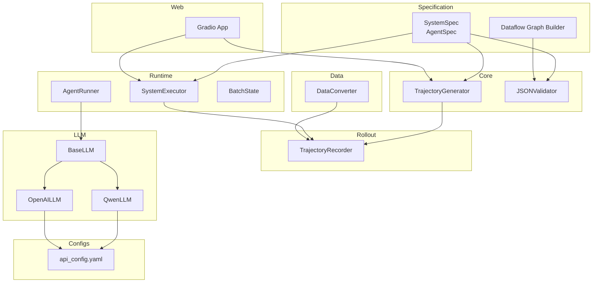
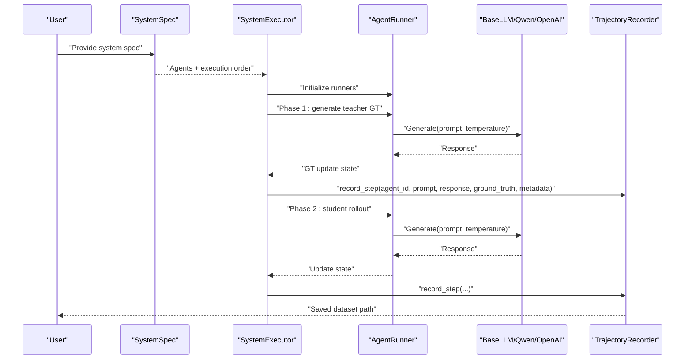
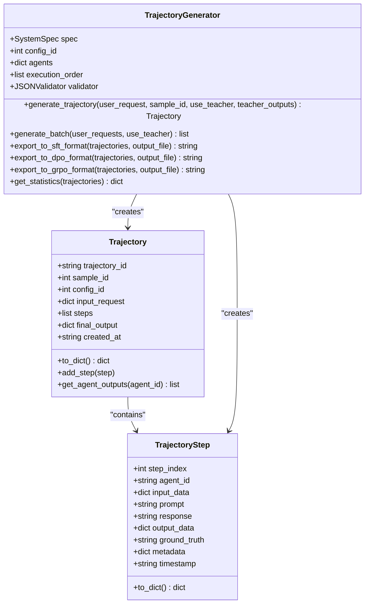
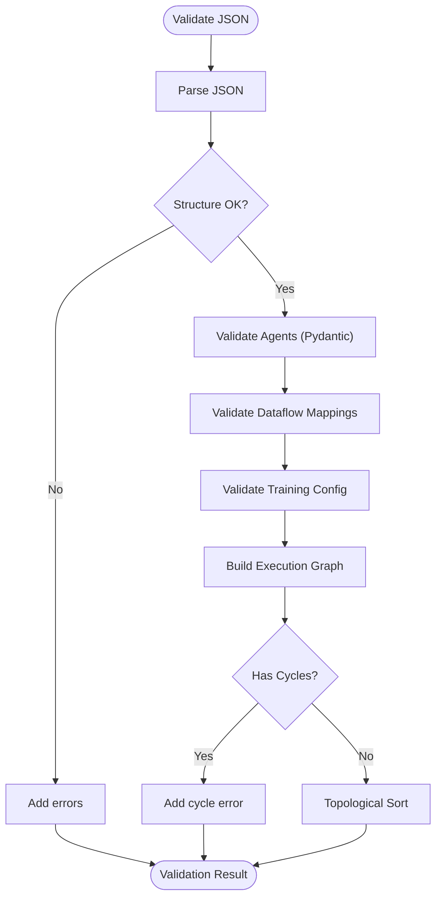
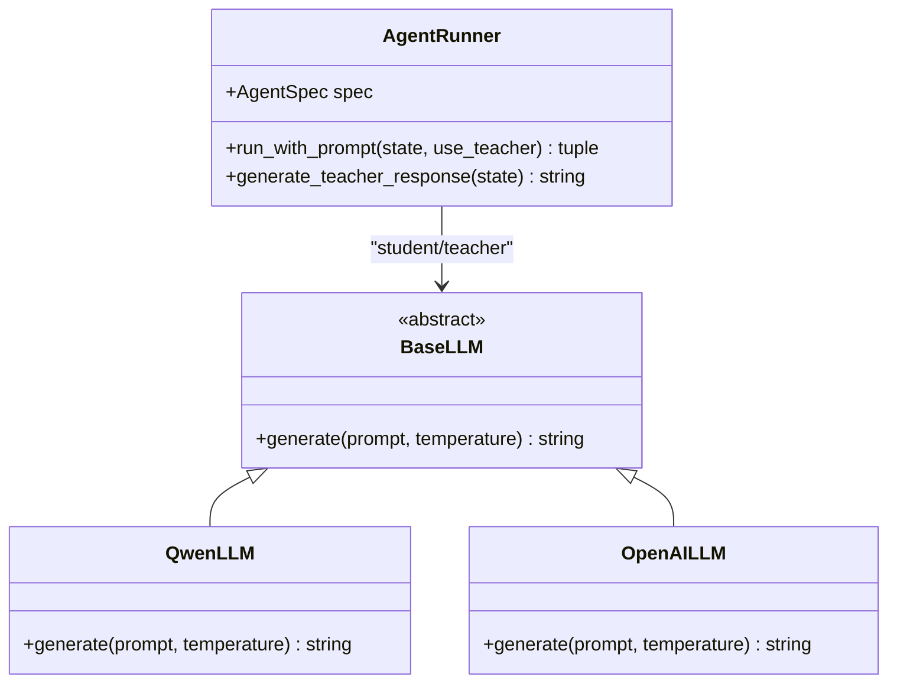
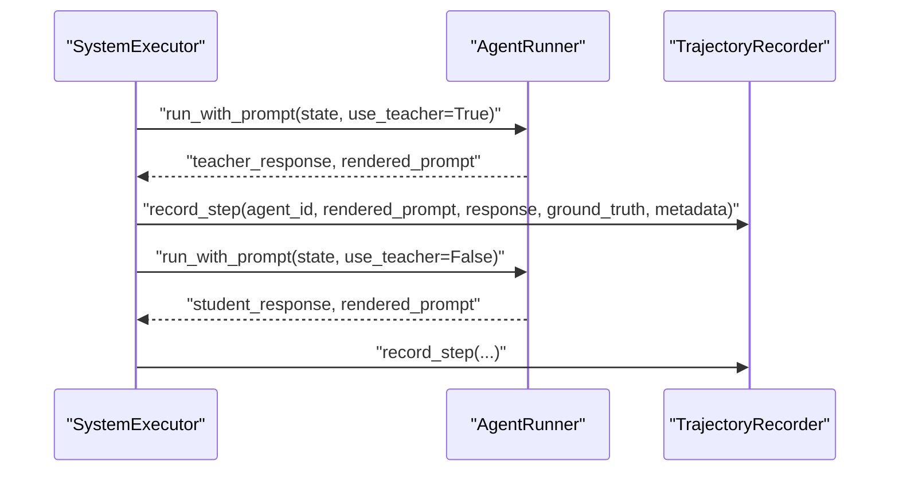
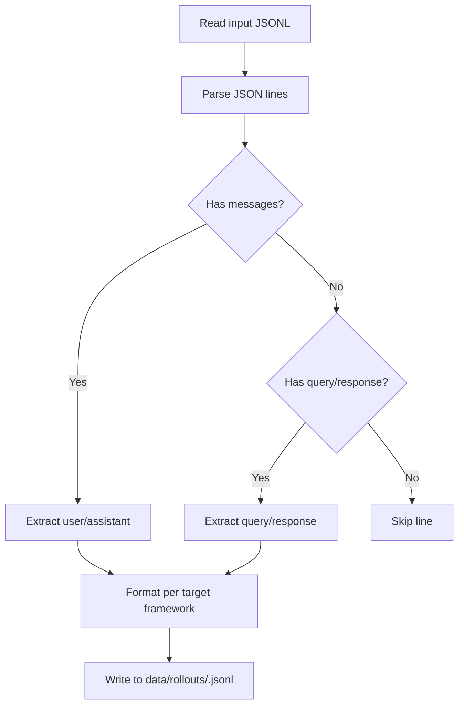
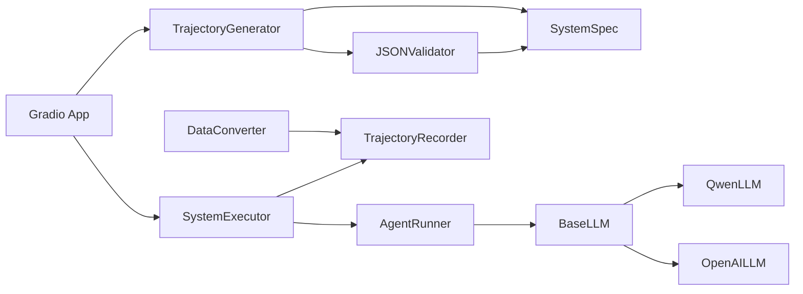

# Advanced Topics

<cite>
**Referenced Files in This Document**
- [trajectory_generator.py](file://core/trajectory_generator.py)
- [json_validator.py](file://core/json_validator.py)
- [data_converter.py](file://data/data_convert/data_converter.py)
- [agent_runner.py](file://runtime/agent_runner.py)
- [executor.py](file://runtime/executor.py)
- [state.py](file://runtime/state.py)
- [system_spec.py](file://spec/system_spec.py)
- [dataflow_graph.py](file://spec/dataflow_graph.py)
- [recoder.py](file://rollout/recoder.py)
- [base.py](file://llm/base.py)
- [qwen_llm.py](file://llm/qwen_llm.py)
- [openai_llm.py](file://llm/openai_llm.py)
- [app.py](file://web/app.py)
- [api_config.yaml](file://configs/api_config.yaml)
- [main.py](file://main.py)
</cite>

## Table of Contents
1. [Introduction](#introduction)
2. [Project Structure](#project-structure)
3. [Core Components](#core-components)
4. [Architecture Overview](#architecture-overview)
5. [Detailed Component Analysis](#detailed-component-analysis)
6. [Dependency Analysis](#dependency-analysis)
7. [Performance Considerations](#performance-considerations)
8. [Troubleshooting Guide](#troubleshooting-guide)
9. [Security and Production Deployment](#security-and-production-deployment)
10. [Extension Points and Plugin Development](#extension-points-and-plugin-development)
11. [Advanced Configuration Patterns](#advanced-configuration-patterns)
12. [Monitoring and Observability](#monitoring-and-observability)
13. [Scaling Large-Scale Multi-Agent Systems](#scaling-large-scale-multi-agent-systems)
14. [Examples and Expert-Level Scenarios](#examples-and-expert-level-scenarios)
15. [Conclusion](#conclusion)

## Introduction
This document targets advanced users and practitioners building sophisticated multi-agent systems. It focuses on trajectory generation, data conversion utilities, and advanced configuration patterns. It also covers performance optimization, memory management, scaling strategies, troubleshooting, security, production deployment, and extension points for custom components and integrations.

## Project Structure
The repository organizes functionality by domain:
- spec: System specification models and dataflow graph builder
- core: Trajectory generation and JSON validation
- runtime: Agent execution pipeline and state management
- rollout: Trajectory recording and dataset assembly
- data: Data conversion utilities
- llm: Pluggable LLM providers
- web: Web UI built with Gradio
- configs: API credentials and base URLs

**Diagram sources**
- [system_spec.py:77-114](file://spec/system_spec.py#L77-L114)
- [dataflow_graph.py:6-32](file://spec/dataflow_graph.py#L6-L32)
- [trajectory_generator.py:58-155](file://core/trajectory_generator.py#L58-L155)
- [json_validator.py:37-82](file://core/json_validator.py#L37-L82)
- [agent_runner.py:10-68](file://runtime/agent_runner.py#L10-L68)
- [executor.py:9-132](file://runtime/executor.py#L9-L132)
- [state.py:3-8](file://runtime/state.py#L3-L8)
- [recoder.py:8-122](file://rollout/recoder.py#L8-L122)
- [data_converter.py:10-99](file://data/data_convert/data_converter.py#L10-L99)
- [base.py:3-6](file://llm/base.py#L3-L6)
- [qwen_llm.py:7-51](file://llm/qwen_llm.py#L7-L51)
- [openai_llm.py:7-49](file://llm/openai_llm.py#L7-L49)
- [app.py:20-157](file://web/app.py#L20-L157)
- [api_config.yaml:1-9](file://configs/api_config.yaml#L1-L9)

**Section sources**
- [system_spec.py:1-114](file://spec/system_spec.py#L1-L114)
- [trajectory_generator.py:1-353](file://core/trajectory_generator.py#L1-L353)
- [json_validator.py:1-347](file://core/json_validator.py#L1-L347)
- [agent_runner.py:1-68](file://runtime/agent_runner.py#L1-L68)
- [executor.py:1-132](file://runtime/executor.py#L1-L132)
- [state.py:1-8](file://runtime/state.py#L1-L8)
- [recoder.py:1-122](file://rollout/recoder.py#L1-L122)
- [data_converter.py:1-99](file://data/data_convert/data_converter.py#L1-L99)
- [base.py:1-6](file://llm/base.py#L1-L6)
- [qwen_llm.py:1-51](file://llm/qwen_llm.py#L1-L51)
- [openai_llm.py:1-49](file://llm/openai_llm.py#L1-L49)
- [app.py:1-173](file://web/app.py#L1-L173)
- [api_config.yaml:1-9](file://configs/api_config.yaml#L1-L9)

## Core Components
- TrajectoryGenerator: orchestrates single or batch trajectory generation, renders prompts, collects outputs, and exports training-ready datasets (SFT/DPO/GRPO).
- JSONValidator: validates system specs, detects cycles, computes execution order, and aggregates warnings/errors.
- AgentRunner: resolves student/teacher providers, renders prompts via Jinja2, and generates responses.
- SystemExecutor: two-phase execution (teacher GT generation, then student rollout) with optional recording.
- TrajectoryRecorder: writes per-step records and assembles SFT datasets.
- DataConverter: transforms raw JSONL into framework-specific formats (Swift/DPO/VERL GRPO).
- LLM Providers: BaseLLM interface plus Qwen/OpenAI implementations with explicit HTTP client configuration.
- Web App: Gradio-based UI for dashboard, data management, configuration, execution flow, and training.

**Section sources**
- [trajectory_generator.py:58-353](file://core/trajectory_generator.py#L58-L353)
- [json_validator.py:37-347](file://core/json_validator.py#L37-L347)
- [agent_runner.py:10-68](file://runtime/agent_runner.py#L10-L68)
- [executor.py:9-132](file://runtime/executor.py#L9-L132)
- [recoder.py:8-122](file://rollout/recoder.py#L8-L122)
- [data_converter.py:10-99](file://data/data_convert/data_converter.py#L10-L99)
- [base.py:3-6](file://llm/base.py#L3-L6)
- [qwen_llm.py:7-51](file://llm/qwen_llm.py#L7-L51)
- [openai_llm.py:7-49](file://llm/openai_llm.py#L7-L49)
- [app.py:20-157](file://web/app.py#L20-L157)

## Architecture Overview
The system follows a staged pipeline:
- Configuration validation and execution order computation
- Two-phase execution (teacher GT generation, student rollout)
- Per-step recording with metadata
- Dataset assembly and export

**Diagram sources**
- [executor.py:16-132](file://runtime/executor.py#L16-L132)
- [agent_runner.py:33-68](file://runtime/agent_runner.py#L33-L68)
- [qwen_llm.py:40-51](file://llm/qwen_llm.py#L40-L51)
- [openai_llm.py:43-49](file://llm/openai_llm.py#L43-L49)
- [recoder.py:15-42](file://rollout/recoder.py#L15-L42)

## Detailed Component Analysis

### Trajectory Generator
Key responsibilities:
- Build trajectories from user requests with configurable teacher/student modes
- Render prompts via Jinja2 templates
- Export to SFT/DPO/GRPO formats
- Compute statistics across trajectories

**Diagram sources**
- [trajectory_generator.py:11-155](file://core/trajectory_generator.py#L11-L155)

**Section sources**
- [trajectory_generator.py:58-353](file://core/trajectory_generator.py#L58-L353)

### JSON Validator and Execution Order
- Validates structure, agent uniqueness, input/output mappings, training modes, and cycles
- Builds a directed graph and returns topological order for deterministic execution

**Diagram sources**
- [json_validator.py:43-82](file://core/json_validator.py#L43-L82)
- [json_validator.py:242-267](file://core/json_validator.py#L242-L267)

**Section sources**
- [json_validator.py:37-347](file://core/json_validator.py#L37-L347)
- [dataflow_graph.py:6-32](file://spec/dataflow_graph.py#L6-L32)

### Agent Runner and LLM Providers
- Resolves student/teacher providers based on agent spec
- Renders prompts and invokes LLM.generate with temperature
- LLM providers encapsulate HTTP client configuration and error handling

**Diagram sources**
- [base.py:3-6](file://llm/base.py#L3-L6)
- [qwen_llm.py:7-51](file://llm/qwen_llm.py#L7-L51)
- [openai_llm.py:7-49](file://llm/openai_llm.py#L7-L49)
- [agent_runner.py:10-68](file://runtime/agent_runner.py#L10-L68)

**Section sources**
- [agent_runner.py:10-68](file://runtime/agent_runner.py#L10-L68)
- [qwen_llm.py:7-51](file://llm/qwen_llm.py#L7-L51)
- [openai_llm.py:7-49](file://llm/openai_llm.py#L7-L49)

### System Executor and Trajectory Recorder
- Two-phase execution: teacher GT generation followed by student rollout
- Records per-step data with metadata and supports assembling SFT datasets

**Diagram sources**
- [executor.py:16-132](file://runtime/executor.py#L16-L132)
- [recoder.py:15-42](file://rollout/recoder.py#L15-L42)

**Section sources**
- [executor.py:9-132](file://runtime/executor.py#L9-L132)
- [recoder.py:8-122](file://rollout/recoder.py#L8-L122)

### Data Conversion Utilities
- Converts raw JSONL into Swift/DPO/VERL GRPO formats
- Writes outputs under data/rollouts with consistent filenames

**Diagram sources**
- [data_converter.py:10-99](file://data/data_convert/data_converter.py#L10-L99)

**Section sources**
- [data_converter.py:10-99](file://data/data_convert/data_converter.py#L10-L99)

## Dependency Analysis
- Coupling: TrajectoryGenerator depends on SystemSpec and JSONValidator; AgentRunner depends on BaseLLM; SystemExecutor composes AgentRunner and TrajectoryRecorder.
- Cohesion: Each module has a focused responsibility; cross-cutting concerns (LLM clients, YAML config) are isolated.
- External dependencies: NetworkX for graph analysis, Jinja2 for templating, OpenAI client via httpx, Gradio for UI.

**Diagram sources**
- [json_validator.py:37-82](file://core/json_validator.py#L37-L82)
- [trajectory_generator.py:58-155](file://core/trajectory_generator.py#L58-L155)
- [executor.py:9-132](file://runtime/executor.py#L9-L132)
- [agent_runner.py:10-68](file://runtime/agent_runner.py#L10-L68)
- [recoder.py:8-122](file://rollout/recoder.py#L8-L122)
- [base.py:3-6](file://llm/base.py#L3-L6)
- [qwen_llm.py:7-51](file://llm/qwen_llm.py#L7-L51)
- [openai_llm.py:7-49](file://llm/openai_llm.py#L7-L49)
- [app.py:20-157](file://web/app.py#L20-L157)
- [data_converter.py:10-99](file://data/data_convert/data_converter.py#L10-L99)

**Section sources**
- [system_spec.py:77-114](file://spec/system_spec.py#L77-L114)
- [json_validator.py:37-347](file://core/json_validator.py#L37-L347)
- [trajectory_generator.py:58-353](file://core/trajectory_generator.py#L58-L353)
- [agent_runner.py:10-68](file://runtime/agent_runner.py#L10-L68)
- [executor.py:9-132](file://runtime/executor.py#L9-L132)
- [recoder.py:8-122](file://rollout/recoder.py#L8-L122)
- [data_converter.py:10-99](file://data/data_convert/data_converter.py#L10-L99)
- [base.py:3-6](file://llm/base.py#L3-L6)
- [qwen_llm.py:7-51](file://llm/qwen_llm.py#L7-L51)
- [openai_llm.py:7-49](file://llm/openai_llm.py#L7-L49)
- [app.py:20-157](file://web/app.py#L20-L157)

## Performance Considerations
- Prompt rendering: Prefer precomputed templates and avoid heavy Jinja2 operations in tight loops.
- LLM calls: Batch requests where supported; reuse HTTP clients; tune temperature and stop conditions.
- Memory management: Stream JSONL processing; avoid loading entire datasets into memory; periodically flush recorder buffers.
- Concurrency: Introduce async/parallelism at the batch level; ensure thread-safe state updates.
- Disk I/O: Write incremental records; compress outputs; monitor disk space for large rollouts.
- Validation overhead: Cache validated specs; invalidate cache on spec changes.

[No sources needed since this section provides general guidance]

## Troubleshooting Guide
Common issues and remedies:
- JSON validation failures: Review missing fields, duplicate agent IDs, invalid training modes, or cyclic dependencies.
- Missing keys in state: AgentRunner raises KeyError when required inputs are absent; ensure dataflow wiring is correct.
- LLM encoding errors: Explicit HTTP client headers prevent encoding issues; verify environment locales.
- Teacher/students mismatch: Ensure teacher_model provider matches agent configuration; validate model names.
- Recording path errors: Verify output directory permissions and existence.

**Section sources**
- [json_validator.py:124-158](file://core/json_validator.py#L124-L158)
- [agent_runner.py:33-68](file://runtime/agent_runner.py#L33-L68)
- [qwen_llm.py:40-51](file://llm/qwen_llm.py#L40-L51)
- [openai_llm.py:43-49](file://llm/openai_llm.py#L43-L49)
- [recoder.py:15-42](file://rollout/recoder.py#L15-L42)

## Security and Production Deployment
- Secrets management: Store API keys in environment variables or secure vaults; avoid hardcoding secrets.
- Network policies: Restrict outbound traffic to trusted LLM endpoints; configure firewalls and proxies.
- Input sanitization: Validate and sanitize user prompts; limit prompt sizes; enforce rate limits.
- Access control: Gate web UI with authentication; restrict dataset downloads; audit logs.
- Containerization: Package with Docker; pin dependency versions; scan images for vulnerabilities.
- Monitoring: Log structured events; track latency, error rates, and throughput; alert on anomalies.

[No sources needed since this section provides general guidance]

## Extension Points and Plugin Development
- LLM providers: Implement BaseLLM and register provider in AgentRunner; support new APIs with consistent interface.
- Data exporters: Extend TrajectoryGenerator.export_* methods or add new converters mirroring existing patterns.
- Validators: Add domain-specific checks in JSONValidator; integrate with execution order computation.
- UI components: Add new pages in web/pages and wire navigation in web/app.py; persist state via DatabaseManager.

**Section sources**
- [base.py:3-6](file://llm/base.py#L3-L6)
- [agent_runner.py:14-32](file://runtime/agent_runner.py#L14-L32)
- [trajectory_generator.py:217-329](file://core/trajectory_generator.py#L217-L329)
- [app.py:20-157](file://web/app.py#L20-L157)

## Advanced Configuration Patterns
- Multi-stage pipelines: Chain agents with complex data dependencies; use output keys to route intermediate results.
- Mixed training modes: Combine SFT/DPO/GRPO agents within a single system; align ground truth generation with teacher models.
- Dynamic execution order: Rely on validator-derived order; override only when necessary and justified.
- Metadata-driven weighting: Use loss weights per agent to balance contributions during joint training.
- Environment-specific overrides: Load model/provider from api_config.yaml; support staging vs production endpoints.

**Section sources**
- [system_spec.py:29-36](file://spec/system_spec.py#L29-L36)
- [executor.py:96-123](file://runtime/executor.py#L96-L123)
- [api_config.yaml:1-9](file://configs/api_config.yaml#L1-L9)

## Monitoring and Observability
- Metrics: Track number of trajectories, steps, ground-truth coverage, and export sizes.
- Logs: Capture per-step prompts/responses, metadata, and exceptions; correlate with execution IDs.
- Dashboards: Visualize execution graphs, dataflow connections, and training dataset distributions.
- Alerts: Notify on repeated validation errors, LLM timeouts, or disk space thresholds.

[No sources needed since this section provides general guidance]

## Scaling Large-Scale Multi-Agent Systems
- Horizontal scaling: Distribute batches across workers; maintain shared state via database or message queues.
- Vertical scaling: Increase batch sizes; optimize LLM client concurrency; provision larger instances.
- Data locality: Precompute teacher GTs; cache frequently used prompts; shard datasets by domain.
- Backpressure: Implement retry with exponential backoff; queue management; graceful degradation.
- Resource isolation: Use containers/processes per agent group; monitor CPU/memory/GPU utilization.

[No sources needed since this section provides general guidance]

## Examples and Expert-Level Scenarios
- Expert scenario 1: Hybrid teacher-student rollout with per-agent loss weights and multi-format dataset exports.
- Expert scenario 2: Automated pipeline that validates specs, generates GT, executes rollouts, and converts datasets in one pass.
- Expert scenario 3: Custom LLM provider for internal inference endpoints; integrate with enterprise auth and telemetry.

[No sources needed since this section provides general guidance]

## Conclusion
This guide outlined advanced usage of trajectory generation, data conversion, and configuration patterns, along with performance, security, and scalability recommendations. By leveraging the modular components and extensibility points, teams can build robust, production-grade multi-agent systems.