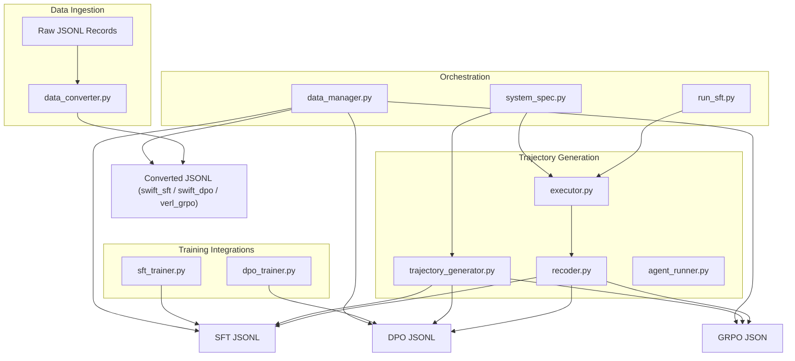
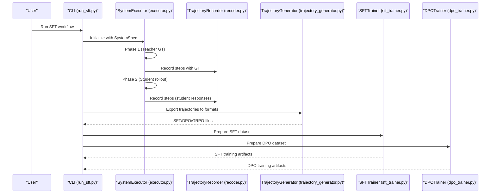
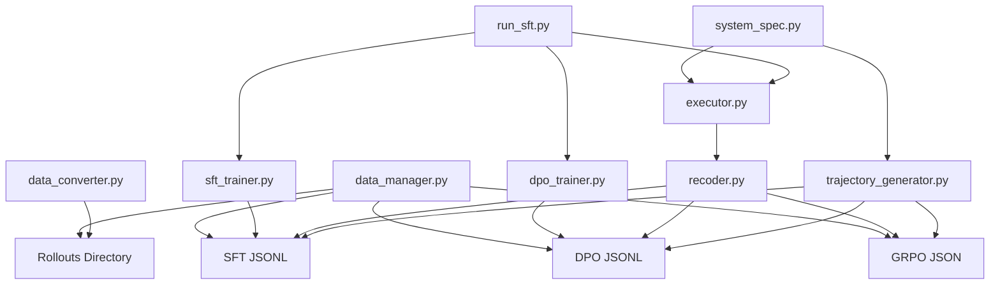

# Data Conversion Utilities

<cite>
**Referenced Files in This Document**
- [data_converter.py](file://data/data_convert/data_converter.py)
- [trajectory_generator.py](file://core/trajectory_generator.py)
- [sft_trainer.py](file://training/sft_trainer.py)
- [dpo_trainer.py](file://training/dpo_trainer.py)
- [system_spec.py](file://spec/system_spec.py)
- [recoder.py](file://rollout/recoder.py)
- [executor.py](file://runtime/executor.py)
- [agent_runner.py](file://runtime/agent_runner.py)
- [run_sft.py](file://cli/run_sft.py)
- [data_manager.py](file://web/pages/data_manager.py)
- [sft_test.jsonl](file://test_outputs/sft_test.jsonl)
- [dpo_test.jsonl](file://test_outputs/dpo_test.jsonl)
- [grpo_test.jsonl](file://test_outputs/grpo_test.jsonl)
</cite>

## Table of Contents
1. [Introduction](#introduction)
2. [Project Structure](#project-structure)
3. [Core Components](#core-components)
4. [Architecture Overview](#architecture-overview)
5. [Detailed Component Analysis](#detailed-component-analysis)
6. [Dependency Analysis](#dependency-analysis)
7. [Performance Considerations](#performance-considerations)
8. [Troubleshooting Guide](#troubleshooting-guide)
9. [Conclusion](#conclusion)
10. [Appendices](#appendices)

## Introduction
This document explains the data conversion utilities and transformation workflows in the project. It covers:
- Input and output format transformations for training pipelines
- Validation during conversion
- Batch processing capabilities
- Integration with trajectory data exports and training pipeline requirements
- Examples of converting raw data to various formats
- Handling missing data scenarios
- Optimizing data structures for different training methodologies
- Performance considerations for large-scale data conversion tasks

## Project Structure
The data conversion ecosystem spans several modules:
- Raw data ingestion and initial conversion
- Trajectory generation and export to training formats
- Trainer integrations for SFT and DPO
- CLI and web interfaces for orchestration and export
- System specification models that define training and data flow

**Diagram sources**
- [data_converter.py:10-82](file://data/data_convert/data_converter.py#L10-L82)
- [trajectory_generator.py:218-330](file://core/trajectory_generator.py#L218-L330)
- [recoder.py:44-122](file://rollout/recoder.py#L44-L122)
- [executor.py:16-132](file://runtime/executor.py#L16-L132)
- [agent_runner.py:33-68](file://runtime/agent_runner.py#L33-L68)
- [sft_trainer.py:16-57](file://training/sft_trainer.py#L16-L57)
- [dpo_trainer.py:15-98](file://training/dpo_trainer.py#L15-L98)
- [run_sft.py:17-117](file://cli/run_sft.py#L17-L117)
- [data_manager.py:113-133](file://web/pages/data_manager.py#L113-L133)
- [system_spec.py:77-102](file://spec/system_spec.py#L77-L102)

**Section sources**
- [data_converter.py:10-82](file://data/data_convert/data_converter.py#L10-L82)
- [trajectory_generator.py:218-330](file://core/trajectory_generator.py#L218-L330)
- [recoder.py:44-122](file://rollout/recoder.py#L44-L122)
- [executor.py:16-132](file://runtime/executor.py#L16-L132)
- [sft_trainer.py:16-57](file://training/sft_trainer.py#L16-L57)
- [dpo_trainer.py:15-98](file://training/dpo_trainer.py#L15-L98)
- [run_sft.py:17-117](file://cli/run_sft.py#L17-L117)
- [data_manager.py:113-133](file://web/pages/data_manager.py#L113-L133)
- [system_spec.py:77-102](file://spec/system_spec.py#L77-L102)

## Core Components
- Data Converter: Converts raw JSONL records into framework-specific formats (SWIFT SFT/DPO, VERL GRPO). Handles missing prompts and filters invalid lines.
- Trajectory Generator: Exports trajectories to SFT, DPO, and GRPO formats, aggregating step-level data with optional ground truth.
- Recorder: Assembles and converts rollouts into SWIFT-compatible formats and SFT datasets.
- Executors and Agent Runner: Drive the two-phase data collection process (teacher-generated ground truth, followed by student execution and recording).
- Trainers: Prepare training-ready datasets and integrate with ms-swift for SFT and DPO.
- CLI and Web: Orchestrate end-to-end workflows and expose export capabilities.

**Section sources**
- [data_converter.py:10-82](file://data/data_convert/data_converter.py#L10-L82)
- [trajectory_generator.py:218-330](file://core/trajectory_generator.py#L218-L330)
- [recoder.py:44-122](file://rollout/recoder.py#L44-L122)
- [executor.py:16-132](file://runtime/executor.py#L16-L132)
- [agent_runner.py:33-68](file://runtime/agent_runner.py#L33-L68)
- [sft_trainer.py:16-57](file://training/sft_trainer.py#L16-L57)
- [dpo_trainer.py:15-98](file://training/dpo_trainer.py#L15-L98)
- [run_sft.py:17-117](file://cli/run_sft.py#L17-L117)
- [data_manager.py:113-133](file://web/pages/data_manager.py#L113-L133)

## Architecture Overview
The conversion pipeline transforms raw records into training-ready artifacts through multiple stages:
- Initial conversion from raw JSONL to framework-specific formats
- Trajectory-based export to SFT, DPO, and GRPO formats
- Assembly of rollouts into SWIFT-compatible datasets
- CLI-driven two-phase execution (teacher GT generation, student rollout recording)
- Trainer preparation and integration with ms-swift

**Diagram sources**
- [run_sft.py:17-117](file://cli/run_sft.py#L17-L117)
- [executor.py:16-132](file://runtime/executor.py#L16-L132)
- [recoder.py:15-42](file://rollout/recoder.py#L15-L42)
- [trajectory_generator.py:218-330](file://core/trajectory_generator.py#L218-L330)
- [sft_trainer.py:16-57](file://training/sft_trainer.py#L16-L57)
- [dpo_trainer.py:15-98](file://training/dpo_trainer.py#L15-L98)

## Detailed Component Analysis

### Data Converter
Purpose:
- Convert raw JSONL records into framework-specific training formats
- Extract user prompts and assistant responses from nested message arrays or direct keys
- Write outputs to a standardized rollouts directory

Key behaviors:
- Validates input path and raises explicit errors if missing
- Skips empty lines and malformed JSON entries
- Supports target frameworks: swift_sft, swift_dpo, verl_grpo
- Writes one output file per target framework

Validation and error handling:
- Raises FileNotFoundError with guidance when input does not exist
- Continues on JSON decode errors by skipping problematic lines
- Filters out records without required prompts

Batch processing:
- Accepts a single file path; intended to be invoked multiple times for different targets

Optimization opportunities:
- Stream processing is already line-by-line; consider chunked writes for very large files
- Add progress reporting for long-running conversions

**Section sources**
- [data_converter.py:10-82](file://data/data_convert/data_converter.py#L10-L82)

### Trajectory Generator
Purpose:
- Export trajectories to training formats compatible with SFT, DPO, and GRPO
- Aggregate step-level data with optional ground truth and metadata

Formats exported:
- SFT (ms-swift): instruction, input, output, history, system, metadata
- DPO: instruction, input, chosen, rejected, metadata
- GRPO: trajectory-level JSON with steps, input_request, final_output

Validation and filtering:
- Only includes steps with ground truth for SFT
- Only includes contrasting pairs (ground truth vs response) for DPO
- Preserves full trajectory structure for GRPO

Batch processing:
- Provides batch export methods for lists of trajectories

Statistics:
- Computes counts and coverage metrics across trajectories

**Section sources**
- [trajectory_generator.py:218-330](file://core/trajectory_generator.py#L218-L330)

### Trajectory Recorder
Purpose:
- Record rollout steps during execution with optional ground truth and metadata
- Assemble rollouts into SWIFT-compatible datasets and SFT datasets

Key features:
- Records messages with user/assistant roles and optional ground truth
- Adds loss weights and metadata for joint training
- Assembles per-sample messages and ground truths for SFT assembly

Conversion helpers:
- Converts raw records to SWIFT format preserving messages and adding output when ground truth exists
- Assembles SFT datasets by grouping records by sample_id and merging agent contributions

**Section sources**
- [recoder.py:15-42](file://rollout/recoder.py#L15-L42)
- [recoder.py:44-122](file://rollout/recoder.py#L44-L122)

### System Executor and Agent Runner
Purpose:
- Execute agents in a defined order, generating ground truth via teacher models and student responses via student models
- Record rollout steps for downstream conversion

Two-phase execution:
- Phase 1: Use teacher models to generate ground truth for agents configured with teacher models
- Phase 2: Use student models to execute and record rollout steps, incorporating loss weights and metadata

Error handling:
- Propagates exceptions encountered during generation or recording
- Logs detailed information per sample and agent

**Section sources**
- [executor.py:16-132](file://runtime/executor.py#L16-L132)
- [agent_runner.py:33-68](file://runtime/agent_runner.py#L33-L68)

### SFT Trainer
Purpose:
- Prepare training data for supervised fine-tuning using ms-swift
- Convert trajectory steps with ground truth into SFT JSONL format

Key behaviors:
- Filters trajectory steps to include only those with ground truth
- Builds instruction/input/output/history/system/metadata fields
- Integrates with ms-swift via command-line or Python API
- Infers model type from model path for compatibility

**Section sources**
- [sft_trainer.py:16-57](file://training/sft_trainer.py#L16-L57)
- [sft_trainer.py:59-141](file://training/sft_trainer.py#L59-L141)
- [sft_trainer.py:142-220](file://training/sft_trainer.py#L142-L220)
- [sft_trainer.py:221-251](file://training/sft_trainer.py#L221-L251)

### DPO Trainer
Purpose:
- Prepare preference data for direct preference optimization using ms-swift
- Build chosen/rejected pairs from trajectory steps differing from ground truth

Key behaviors:
- Creates preference pairs only when response differs from ground truth
- Supports direct preference pairs input
- Integrates with ms-swift for DPO training

**Section sources**
- [dpo_trainer.py:15-98](file://training/dpo_trainer.py#L15-L98)
- [dpo_trainer.py:100-190](file://training/dpo_trainer.py#L100-L190)
- [dpo_trainer.py:192-277](file://training/dpo_trainer.py#L192-L277)
- [dpo_trainer.py:278-308](file://training/dpo_trainer.py#L278-L308)

### CLI and Web Interfaces
CLI (run_sft.py):
- Loads system specification and either runs the two-phase data collection or uses existing training data
- Converts collected rollouts into training-ready artifacts
- Invokes trainer preparation and optionally starts training

Web (data_manager.py):
- Provides upload, preview, and export capabilities for datasets
- Exposes export formats aligned with training needs (SFT, DPO, GRPO, Raw JSON)

**Section sources**
- [run_sft.py:17-117](file://cli/run_sft.py#L17-L117)
- [data_manager.py:113-133](file://web/pages/data_manager.py#L113-L133)

## Dependency Analysis
The following diagram shows how components depend on each other in the conversion and training pipeline:

**Diagram sources**
- [data_converter.py:71-82](file://data/data_convert/data_converter.py#L71-L82)
- [executor.py:14-14](file://runtime/executor.py#L14-L14)
- [recoder.py:11-13](file://rollout/recoder.py#L11-L13)
- [trajectory_generator.py:218-330](file://core/trajectory_generator.py#L218-L330)
- [sft_trainer.py:16-57](file://training/sft_trainer.py#L16-L57)
- [dpo_trainer.py:15-98](file://training/dpo_trainer.py#L15-L98)
- [run_sft.py:17-117](file://cli/run_sft.py#L17-L117)
- [data_manager.py:113-133](file://web/pages/data_manager.py#L113-L133)
- [system_spec.py:77-102](file://spec/system_spec.py#L77-L102)

**Section sources**
- [data_converter.py:71-82](file://data/data_convert/data_converter.py#L71-L82)
- [executor.py:14-14](file://runtime/executor.py#L14-L14)
- [recoder.py:11-13](file://rollout/recoder.py#L11-L13)
- [trajectory_generator.py:218-330](file://core/trajectory_generator.py#L218-L330)
- [sft_trainer.py:16-57](file://training/sft_trainer.py#L16-L57)
- [dpo_trainer.py:15-98](file://training/dpo_trainer.py#L15-L98)
- [run_sft.py:17-117](file://cli/run_sft.py#L17-L117)
- [data_manager.py:113-133](file://web/pages/data_manager.py#L113-L133)
- [system_spec.py:77-102](file://spec/system_spec.py#L77-L102)

## Performance Considerations
- Streaming reads: Both the data converter and trajectory generator process input line-by-line, minimizing memory overhead.
- Chunked writes: Outputs are written incrementally; consider batching writes for very large files to reduce I/O overhead.
- Filtering early: The converters and trainers filter out invalid or incomplete records early, reducing downstream processing costs.
- Two-phase execution: Teacher phase computes ground truth once; student phase records rollouts efficiently for later conversion.
- Model inference: Agent runner selects appropriate LLMs; batching requests and managing concurrency can improve throughput.
- Export formats: Prefer JSONL for streaming-friendly pipelines; use compact JSON for GRPO when memory allows.

[No sources needed since this section provides general guidance]

## Troubleshooting Guide
Common issues and resolutions:
- Missing input file: The data converter raises a clear error when the input path does not exist. Verify the project root and relative path.
- Malformed JSON lines: The converter skips invalid lines; inspect the input file for encoding and structure issues.
- Missing prompts: Records without user prompts are skipped; ensure input contains either messages with user role or top-level query/response fields.
- No ground truth for SFT: The SFT trainer only includes steps with ground truth; ensure trajectory generation captured ground truth in Phase 1.
- DPO preference pairs: DPO requires contrasting responses; ensure trajectory steps differ from ground truth.
- Export failures: Verify output directories exist and are writable; check permissions and disk space.
- CLI argument errors: Ensure required arguments (spec, input or data_file) are provided; use help for guidance.

**Section sources**
- [data_converter.py:20-30](file://data/data_convert/data_converter.py#L20-L30)
- [executor.py:64-66](file://runtime/executor.py#L64-L66)
- [sft_trainer.py:36-49](file://training/sft_trainer.py#L36-L49)
- [dpo_trainer.py:39-51](file://training/dpo_trainer.py#L39-L51)
- [run_sft.py:32-34](file://cli/run_sft.py#L32-L34)

## Conclusion
The data conversion utilities provide a robust pipeline for transforming raw records into training-ready artifacts across SFT, DPO, and GRPO formats. They support batch processing, validation, and integration with ms-swift-based trainers. By leveraging trajectory generation, rollouts assembly, and CLI/web orchestration, teams can scale data preparation for multi-agent systems effectively.

[No sources needed since this section summarizes without analyzing specific files]

## Appendices

### Example Workflows

#### Converting Raw Data to Framework Formats
- Use the data converter to transform raw JSONL into swift_sft, swift_dpo, and verl_grpo formats.
- Outputs are saved under the rollouts directory with framework-specific filenames.

**Section sources**
- [data_converter.py:71-82](file://data/data_convert/data_converter.py#L71-L82)

#### Generating SFT/DPO/GRPO from Trajectories
- Use trajectory generator to export step-level data into SFT, DPO, or GRPO formats.
- SFT includes only steps with ground truth; DPO creates chosen/rejected pairs from contrasting responses.

**Section sources**
- [trajectory_generator.py:218-330](file://core/trajectory_generator.py#L218-L330)
- [sft_trainer.py:16-57](file://training/sft_trainer.py#L16-L57)
- [dpo_trainer.py:15-98](file://training/dpo_trainer.py#L15-L98)

#### Two-Phase Execution and Rollout Recording
- Phase 1: Teacher models generate ground truth for agents configured with teacher models.
- Phase 2: Student models execute and record rollouts; recorder aggregates and converts to SWIFT-compatible formats.

**Section sources**
- [executor.py:32-132](file://runtime/executor.py#L32-L132)
- [recoder.py:15-122](file://rollout/recoder.py#L15-L122)

### Data Format References
- SFT JSONL example fields: instruction, input, output, history, system, metadata.
- DPO JSONL example fields: instruction, input, chosen, rejected, metadata.
- GRPO JSON example fields: trajectory_id, input_request, steps, final_output, rewards.

**Section sources**
- [sft_test.jsonl:1-2](file://test_outputs/sft_test.jsonl#L1-L2)
- [dpo_test.jsonl:1-2](file://test_outputs/dpo_test.jsonl#L1-L2)
- [grpo_test.jsonl:1-2](file://test_outputs/grpo_test.jsonl#L1-L2)