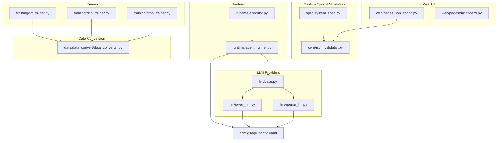
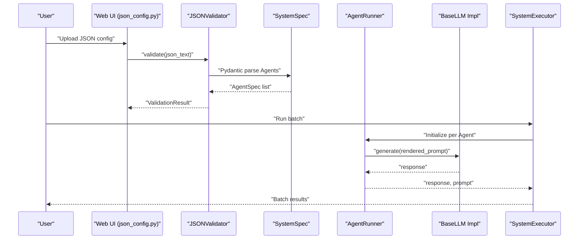
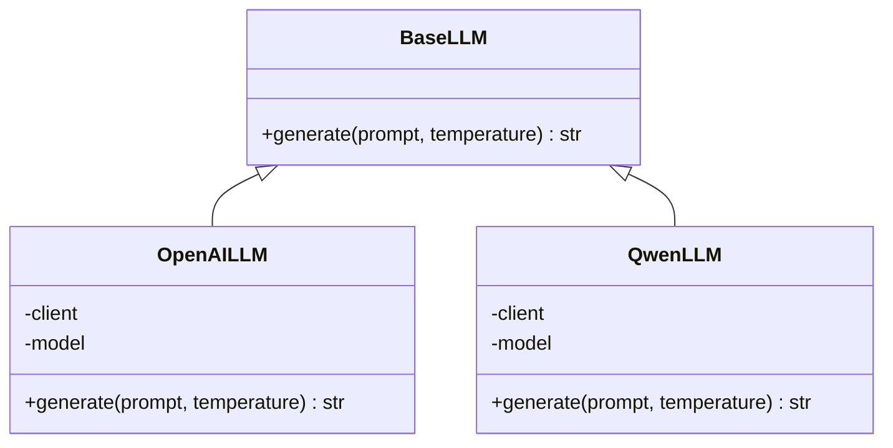
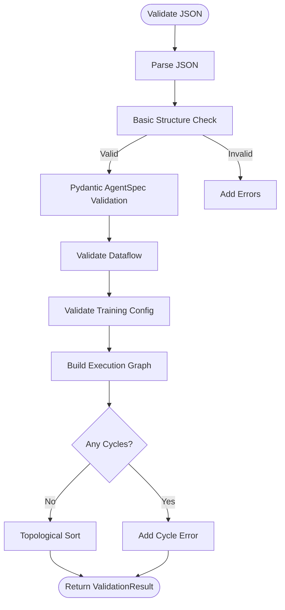
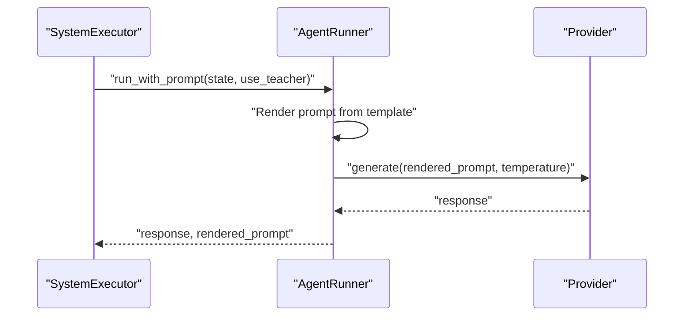
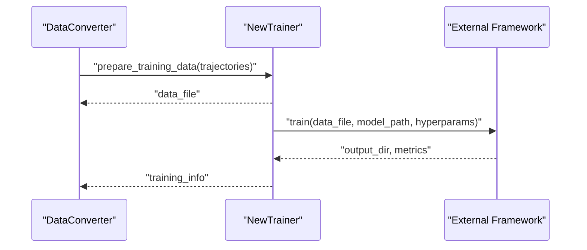
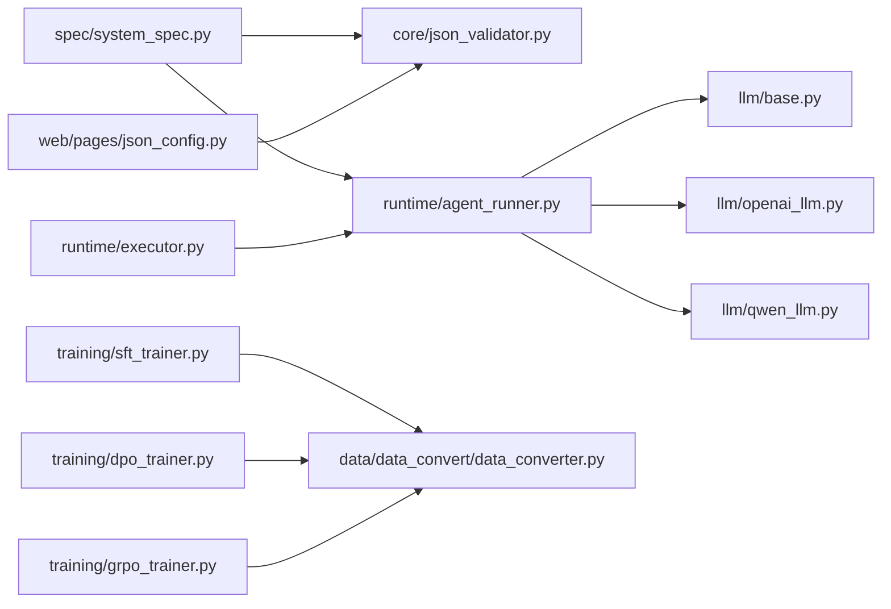

# Extension Development and Customization

<cite>
**Referenced Files in This Document**
- [base.py](file://llm/base.py)
- [openai_llm.py](file://llm/openai_llm.py)
- [qwen_llm.py](file://llm/qwen_llm.py)
- [system_spec.py](file://spec/system_spec.py)
- [json_validator.py](file://core/json_validator.py)
- [sft_trainer.py](file://training/sft_trainer.py)
- [dpo_trainer.py](file://training/dpo_trainer.py)
- [grpo_trainer.py](file://training/grpo_trainer.py)
- [data_converter.py](file://data/data_convert/data_converter.py)
- [api_config.yaml](file://configs/api_config.yaml)
- [agent_runner.py](file://runtime/agent_runner.py)
- [executor.py](file://runtime/executor.py)
- [json_config.py](file://web/pages/json_config.py)
- [dashboard.py](file://web/pages/dashboard.py)
</cite>

## Table of Contents
1. [Introduction](#introduction)
2. [Project Structure](#project-structure)
3. [Core Components](#core-components)
4. [Architecture Overview](#architecture-overview)
5. [Detailed Component Analysis](#detailed-component-analysis)
6. [Dependency Analysis](#dependency-analysis)
7. [Performance Considerations](#performance-considerations)
8. [Troubleshooting Guide](#troubleshooting-guide)
9. [Conclusion](#conclusion)
10. [Appendices](#appendices)

## Introduction
This document provides a comprehensive guide for developing extensions and customizing the system. It focuses on:
- Pluggable LLM provider architecture and how to implement new providers
- Extending system specifications via JSON schema validation
- Developing custom agent types and integrating new training methodologies
- Adding new data export formats and plugin development patterns
- Managing configuration for extensions and maintaining backward compatibility
- Contributing new features while upholding code quality standards

## Project Structure
The repository follows a modular structure:
- LLM providers under llm/
- System specification and validation under spec/ and core/
- Runtime orchestration under runtime/
- Training integrations under training/
- Data conversion utilities under data/data_convert/
- Web UI under web/pages/
- Configuration under configs/

**Diagram sources**
- [base.py:1-6](file://llm/base.py#L1-L6)
- [openai_llm.py:1-49](file://llm/openai_llm.py#L1-L49)
- [qwen_llm.py:1-51](file://llm/qwen_llm.py#L1-L51)
- [system_spec.py:1-114](file://spec/system_spec.py#L1-L114)
- [json_validator.py:1-347](file://core/json_validator.py#L1-L347)
- [agent_runner.py:1-68](file://runtime/agent_runner.py#L1-L68)
- [executor.py:1-132](file://runtime/executor.py#L1-L132)
- [sft_trainer.py:1-263](file://training/sft_trainer.py#L1-L263)
- [dpo_trainer.py:1-320](file://training/dpo_trainer.py#L1-L320)
- [grpo_trainer.py:1-385](file://training/grpo_trainer.py#L1-L385)
- [data_converter.py:1-99](file://data/data_convert/data_converter.py#L1-L99)
- [api_config.yaml:1-9](file://configs/api_config.yaml#L1-L9)
- [json_config.py:1-377](file://web/pages/json_config.py#L1-L377)
- [dashboard.py:1-140](file://web/pages/dashboard.py#L1-L140)

**Section sources**
- [base.py:1-6](file://llm/base.py#L1-L6)
- [system_spec.py:1-114](file://spec/system_spec.py#L1-L114)
- [json_validator.py:1-347](file://core/json_validator.py#L1-L347)
- [agent_runner.py:1-68](file://runtime/agent_runner.py#L1-L68)
- [executor.py:1-132](file://runtime/executor.py#L1-L132)
- [sft_trainer.py:1-263](file://training/sft_trainer.py#L1-L263)
- [dpo_trainer.py:1-320](file://training/dpo_trainer.py#L1-L320)
- [grpo_trainer.py:1-385](file://training/grpo_trainer.py#L1-L385)
- [data_converter.py:1-99](file://data/data_convert/data_converter.py#L1-L99)
- [api_config.yaml:1-9](file://configs/api_config.yaml#L1-L9)
- [json_config.py:1-377](file://web/pages/json_config.py#L1-L377)
- [dashboard.py:1-140](file://web/pages/dashboard.py#L1-L140)

## Core Components
- BaseLLM interface defines the contract for LLM providers.
- OpenAILLM and QwenLLM demonstrate provider implementations with configuration loading and HTTP client setup.
- SystemSpec and JSONValidator define the schema and validation pipeline for system configurations.
- AgentRunner and SystemExecutor orchestrate agent execution and two-phase training data generation.
- Training modules integrate external frameworks via command-line or API.
- Data converter transforms rollouts into target framework formats.
- Web UI pages provide configuration validation and visualization.

**Section sources**
- [base.py:1-6](file://llm/base.py#L1-L6)
- [openai_llm.py:1-49](file://llm/openai_llm.py#L1-L49)
- [qwen_llm.py:1-51](file://llm/qwen_llm.py#L1-L51)
- [system_spec.py:1-114](file://spec/system_spec.py#L1-L114)
- [json_validator.py:1-347](file://core/json_validator.py#L1-L347)
- [agent_runner.py:1-68](file://runtime/agent_runner.py#L1-L68)
- [executor.py:1-132](file://runtime/executor.py#L1-L132)
- [sft_trainer.py:1-263](file://training/sft_trainer.py#L1-L263)
- [dpo_trainer.py:1-320](file://training/dpo_trainer.py#L1-L320)
- [grpo_trainer.py:1-385](file://training/grpo_trainer.py#L1-L385)
- [data_converter.py:1-99](file://data/data_convert/data_converter.py#L1-L99)
- [json_config.py:1-377](file://web/pages/json_config.py#L1-L377)

## Architecture Overview
The system is designed around a pluggable LLM provider pattern, validated system specifications, and extensible training pipelines.

**Diagram sources**
- [json_config.py:180-206](file://web/pages/json_config.py#L180-L206)
- [json_validator.py:43-82](file://core/json_validator.py#L43-L82)
- [system_spec.py:103-114](file://spec/system_spec.py#L103-L114)
- [agent_runner.py:33-60](file://runtime/agent_runner.py#L33-L60)
- [executor.py:16-132](file://runtime/executor.py#L16-L132)

## Detailed Component Analysis

### LLM Provider Pluggable Architecture
- Contract: BaseLLM defines the generate method signature.
- Implementations: OpenAILLM and QwenLLM show how to load configuration from YAML, construct HTTP clients, and call provider APIs.
- Extension points:
  - Add new provider class inheriting BaseLLM
  - Load configuration from api_config.yaml or environment
  - Support provider-specific parameters and error handling

**Diagram sources**
- [base.py:3-6](file://llm/base.py#L3-L6)
- [openai_llm.py:7-49](file://llm/openai_llm.py#L7-L49)
- [qwen_llm.py:7-51](file://llm/qwen_llm.py#L7-L51)

Implementation guidelines for custom LLM providers:
- Inherit BaseLLM and implement generate with provider-specific logic
- Load credentials and base URLs from api_config.yaml
- Use explicit HTTP client configuration to avoid encoding issues
- Support optional temperature parameter
- Raise clear exceptions for invalid inputs or provider errors

**Section sources**
- [base.py:1-6](file://llm/base.py#L1-L6)
- [openai_llm.py:1-49](file://llm/openai_llm.py#L1-L49)
- [qwen_llm.py:1-51](file://llm/qwen_llm.py#L1-L51)
- [api_config.yaml:1-9](file://configs/api_config.yaml#L1-L9)

### Extending System Specifications and JSON Schema Validation
- SystemSpec defines the schema for agents, training, IO mappings, and model/provider configuration.
- JSONValidator performs:
  - JSON parsing and basic structure checks
  - Pydantic validation via AgentSpec
  - Dataflow validation (inputs/outputs, user references)
  - Training configuration validation (mode, ground truth presence)
  - Execution graph construction and cycle detection
  - Dataflow graph generation for visualization

**Diagram sources**
- [json_validator.py:43-82](file://core/json_validator.py#L43-L82)
- [json_validator.py:181-267](file://core/json_validator.py#L181-L267)

Guidelines for extending the schema:
- Add new Pydantic models for new configuration fields
- Extend AgentSpec or create new top-level models
- Update JSONValidator to incorporate new checks
- Ensure backward compatibility by using Optional fields and defaults
- Add tests validating new schema constructs

**Section sources**
- [system_spec.py:1-114](file://spec/system_spec.py#L1-L114)
- [json_validator.py:1-347](file://core/json_validator.py#L1-L347)

### Developing Custom Agent Types
AgentRunner selects provider implementations based on agent configuration and temperature. To add a new agent type:
- Define new fields in AgentSpec (e.g., specialized prompts, IO mappings)
- Extend AgentRunner to support new provider selection logic
- Ensure SystemExecutor respects new agent capabilities during execution
- Update JSON schema and validator accordingly

**Diagram sources**
- [agent_runner.py:33-60](file://runtime/agent_runner.py#L33-L60)
- [executor.py:16-132](file://runtime/executor.py#L16-L132)

**Section sources**
- [agent_runner.py:1-68](file://runtime/agent_runner.py#L1-L68)
- [executor.py:1-132](file://runtime/executor.py#L1-L132)

### Integrating New Training Methodologies
The training module integrates external frameworks:
- SFTTrainer: Converts trajectories to SFT format and launches training via ms-swift
- DPOTrainer: Prepares preference pairs and runs DPO training
- GRPOTrainer: Computes rewards and runs GRPO training via verl

To add a new training methodology:
- Create a new Trainer class with prepare_* and train methods
- Define data preparation logic and output formats
- Integrate with external framework CLI/API
- Support hyperparameter configuration and model type inference
- Provide training script generation and result reporting

**Diagram sources**
- [data_converter.py:10-82](file://data/data_convert/data_converter.py#L10-L82)
- [sft_trainer.py:16-140](file://training/sft_trainer.py#L16-L140)
- [dpo_trainer.py:15-190](file://training/dpo_trainer.py#L15-L190)
- [grpo_trainer.py:15-266](file://training/grpo_trainer.py#L15-L266)

**Section sources**
- [sft_trainer.py:1-263](file://training/sft_trainer.py#L1-L263)
- [dpo_trainer.py:1-320](file://training/dpo_trainer.py#L1-L320)
- [grpo_trainer.py:1-385](file://training/grpo_trainer.py#L1-L385)
- [data_converter.py:1-99](file://data/data_convert/data_converter.py#L1-L99)

### Extending Data Export Formats
The data converter supports multiple target frameworks:
- swift_sft: emits messages-based format
- swift_dpo: emits query/chosen/rejected triples
- verl_grpo: emits prompt-only entries

To add a new export format:
- Extend convert_data with a new target_framework branch
- Emit records conforming to the target framework’s expectations
- Write output to data/rollouts/ with appropriate naming
- Ensure robust parsing of input records and graceful skipping of malformed lines

**Section sources**
- [data_converter.py:10-82](file://data/data_convert/data_converter.py#L10-L82)

### Plugin Development Patterns and Configuration Management
- Configuration loading: Providers load api_config.yaml from predictable locations
- Web UI integration: JSON configuration page validates and visualizes system specs
- Dashboard: Provides overview statistics and quick actions

Patterns:
- Centralized configuration via YAML with fallback paths
- UI-driven validation and visualization to catch schema errors early
- Modular components (providers, trainers, validators) that can be extended independently

**Section sources**
- [openai_llm.py:8-41](file://llm/openai_llm.py#L8-L41)
- [qwen_llm.py:8-38](file://llm/qwen_llm.py#L8-L38)
- [json_config.py:180-206](file://web/pages/json_config.py#L180-L206)
- [dashboard.py:12-25](file://web/pages/dashboard.py#L12-L25)

### Maintaining Backward Compatibility
- SystemSpec includes compatibility fields (e.g., model_provider, temperature) alongside modern fields
- JSONValidator adds warnings for deprecated usage while preserving behavior
- Training modes are constrained to supported values ('sft', 'dpo', 'grpo')
- Execution graph ensures deterministic ordering via topological sort

Recommendations:
- Keep optional fields with sensible defaults
- Add deprecation notices and migration paths
- Preserve existing JSON keys and aliases where possible

**Section sources**
- [system_spec.py:86-96](file://spec/system_spec.py#L86-L96)
- [json_validator.py:218-241](file://core/json_validator.py#L218-L241)
- [executor.py:12-132](file://runtime/executor.py#L12-L132)

### Contributing New Features and Code Quality Standards
- Follow the established patterns: BaseLLM for providers, Pydantic models for schemas, JSONValidator for validation
- Keep changes localized to new modules or small additions to existing ones
- Add tests for new validation rules and training flows
- Document new configuration options and schema extensions
- Maintain consistent error messages and logging

[No sources needed since this section provides general guidance]

## Dependency Analysis
The following diagram highlights key dependencies among major components:

**Diagram sources**
- [system_spec.py:1-114](file://spec/system_spec.py#L1-L114)
- [json_validator.py:1-347](file://core/json_validator.py#L1-L347)
- [agent_runner.py:1-68](file://runtime/agent_runner.py#L1-L68)
- [executor.py:1-132](file://runtime/executor.py#L1-L132)
- [sft_trainer.py:1-263](file://training/sft_trainer.py#L1-L263)
- [dpo_trainer.py:1-320](file://training/dpo_trainer.py#L1-L320)
- [grpo_trainer.py:1-385](file://training/grpo_trainer.py#L1-L385)
- [data_converter.py:1-99](file://data/data_convert/data_converter.py#L1-L99)
- [json_config.py:1-377](file://web/pages/json_config.py#L1-L377)

**Section sources**
- [system_spec.py:1-114](file://spec/system_spec.py#L1-L114)
- [json_validator.py:1-347](file://core/json_validator.py#L1-L347)
- [agent_runner.py:1-68](file://runtime/agent_runner.py#L1-L68)
- [executor.py:1-132](file://runtime/executor.py#L1-L132)
- [sft_trainer.py:1-263](file://training/sft_trainer.py#L1-L263)
- [dpo_trainer.py:1-320](file://training/dpo_trainer.py#L1-L320)
- [grpo_trainer.py:1-385](file://training/grpo_trainer.py#L1-L385)
- [data_converter.py:1-99](file://data/data_convert/data_converter.py#L1-L99)
- [json_config.py:1-377](file://web/pages/json_config.py#L1-L377)

## Performance Considerations
- Provider HTTP clients: Explicitly configure timeouts and headers to avoid connection overhead and encoding issues.
- Training data preparation: Batch write JSONL files to reduce I/O overhead.
- Validation: Early exit on parse failures; minimize repeated validations.
- Execution: Topological sorting ensures efficient execution order; avoid redundant computations.

[No sources needed since this section provides general guidance]

## Troubleshooting Guide
Common issues and resolutions:
- JSON validation errors: Use the web UI to validate configurations and inspect errors/warnings.
- Provider configuration problems: Verify api_config.yaml paths and credentials; ensure base URLs are correct.
- Encoding errors in provider clients: Confirm HTTP client headers and timeouts are set as shown in provider implementations.
- Training failures: Check generated training scripts and external framework logs; confirm model type inference matches installed libraries.
- Data conversion errors: Ensure input files are valid JSONL and contain expected keys.

**Section sources**
- [json_config.py:180-206](file://web/pages/json_config.py#L180-L206)
- [openai_llm.py:25-41](file://llm/openai_llm.py#L25-L41)
- [qwen_llm.py:24-38](file://llm/qwen_llm.py#L24-L38)
- [sft_trainer.py:252-263](file://training/sft_trainer.py#L252-L263)
- [dpo_trainer.py:309-320](file://training/dpo_trainer.py#L309-L320)
- [grpo_trainer.py:374-385](file://training/grpo_trainer.py#L374-L385)
- [data_converter.py:20-30](file://data/data_convert/data_converter.py#L20-L30)

## Conclusion
The system offers a robust foundation for extension and customization:
- A clean BaseLLM interface enables easy addition of new LLM providers
- A strongly typed schema and validator ensure reliable configuration management
- Modular training integrations support diverse methodologies
- Web UI and dashboard streamline validation, visualization, and operational oversight
By following the patterns and guidelines outlined here, contributors can extend the platform while maintaining backward compatibility and code quality.

## Appendices

### Example: Creating a Custom LLM Provider
Steps:
- Create a new provider class inheriting BaseLLM
- Implement generate with provider-specific logic
- Load configuration from api_config.yaml
- Configure HTTP client with explicit headers/timeouts
- Register provider selection in AgentRunner if needed

**Section sources**
- [base.py:3-6](file://llm/base.py#L3-L6)
- [openai_llm.py:8-49](file://llm/openai_llm.py#L8-L49)
- [qwen_llm.py:8-51](file://llm/qwen_llm.py#L8-L51)
- [agent_runner.py:15-31](file://runtime/agent_runner.py#L15-L31)

### Example: Extending JSON Schema Validation
Steps:
- Add new Pydantic models in system_spec.py
- Update JSONValidator to incorporate new checks
- Add tests covering new schema constructs
- Maintain backward compatibility with Optional fields

**Section sources**
- [system_spec.py:1-114](file://spec/system_spec.py#L1-L114)
- [json_validator.py:181-267](file://core/json_validator.py#L181-L267)

### Example: Adding a New Data Export Format
Steps:
- Extend data_converter.py with a new target framework branch
- Emit records conforming to the target framework
- Write output to data/rollouts/ with clear naming
- Test with representative JSONL inputs

**Section sources**
- [data_converter.py:10-82](file://data/data_convert/data_converter.py#L10-L82)