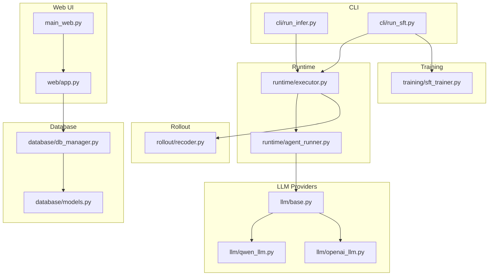
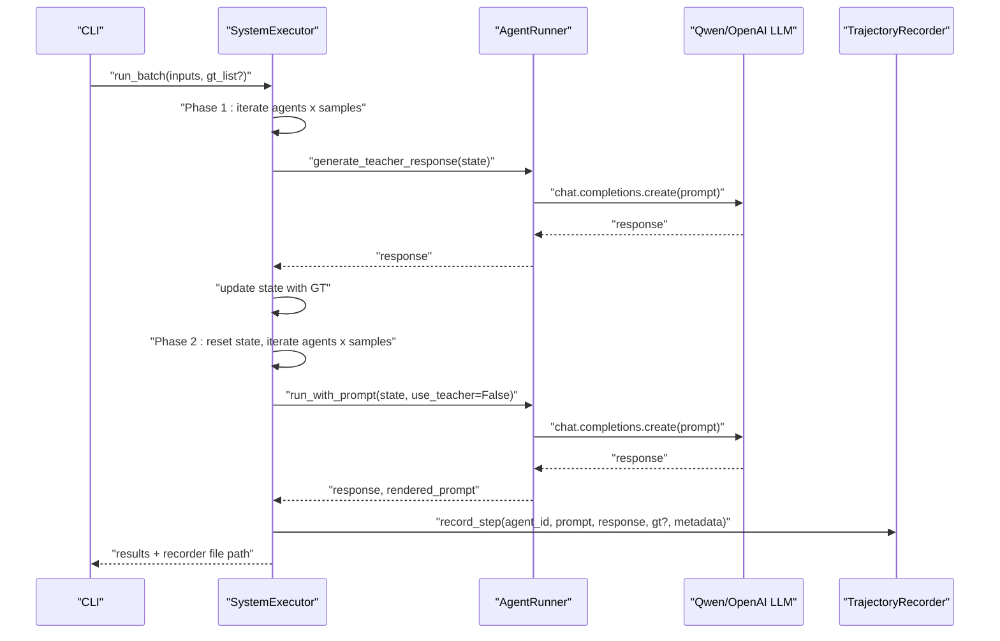
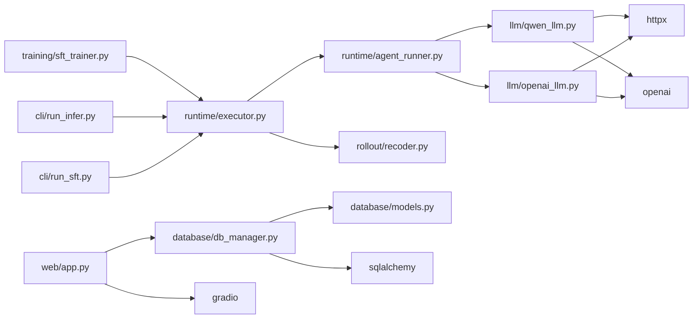
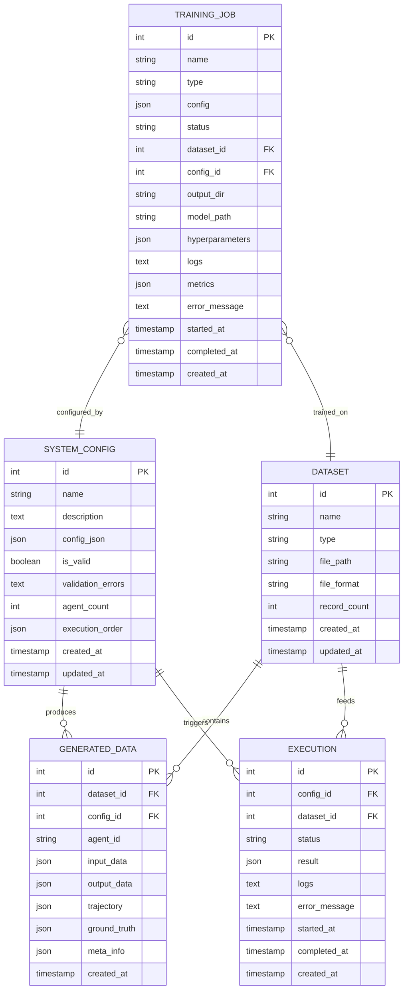

# Performance Optimization and Scaling

<cite>
**Referenced Files in This Document**
- [main_web.py](file://main_web.py)
- [web/app.py](file://web/app.py)
- [runtime/executor.py](file://runtime/executor.py)
- [runtime/agent_runner.py](file://runtime/agent_runner.py)
- [rollout/recoder.py](file://rollout/recoder.py)
- [database/db_manager.py](file://database/db_manager.py)
- [database/models.py](file://database/models.py)
- [training/sft_trainer.py](file://training/sft_trainer.py)
- [cli/run_infer.py](file://cli/run_infer.py)
- [cli/run_sft.py](file://cli/run_sft.py)
- [llm/base.py](file://llm/base.py)
- [llm/qwen_llm.py](file://llm/qwen_llm.py)
- [llm/openai_llm.py](file://llm/openai_llm.py)
- [requirements.txt](file://requirements.txt)
</cite>

## Table of Contents
1. [Introduction](#introduction)
2. [Project Structure](#project-structure)
3. [Core Components](#core-components)
4. [Architecture Overview](#architecture-overview)
5. [Detailed Component Analysis](#detailed-component-analysis)
6. [Dependency Analysis](#dependency-analysis)
7. [Performance Considerations](#performance-considerations)
8. [Troubleshooting Guide](#troubleshooting-guide)
9. [Conclusion](#conclusion)
10. [Appendices](#appendices)

## Introduction
This document focuses on performance optimization and scaling strategies for large-scale multi-agent systems built with this repository. It covers memory management, batch processing, parallel execution patterns, database query optimization, connection pooling, caching strategies, profiling and bottleneck identification, resource monitoring, horizontal scaling, distributed execution, and load balancing. Concrete tuning examples are provided for different workload patterns and system configurations.

## Project Structure
The system is organized around:
- CLI entrypoints for batch inference and SFT distillation
- Runtime execution engine for multi-agent orchestration
- LLM providers abstraction and concrete implementations
- Rollout trajectory recording and dataset assembly
- Web UI for configuration, execution, and training management
- Database layer for persistence and state tracking
- Training integrations for SFT

**Diagram sources**
- [cli/run_infer.py:1-46](file://cli/run_infer.py#L1-L46)
- [cli/run_sft.py:1-117](file://cli/run_sft.py#L1-L117)
- [runtime/executor.py:1-132](file://runtime/executor.py#L1-L132)
- [runtime/agent_runner.py:1-68](file://runtime/agent_runner.py#L1-L68)
- [llm/base.py:1-6](file://llm/base.py#L1-L6)
- [llm/qwen_llm.py:1-51](file://llm/qwen_llm.py#L1-L51)
- [llm/openai_llm.py:1-49](file://llm/openai_llm.py#L1-L49)
- [rollout/recoder.py:1-122](file://rollout/recoder.py#L1-L122)
- [web/app.py:1-173](file://web/app.py#L1-L173)
- [main_web.py:1-158](file://main_web.py#L1-L158)
- [database/db_manager.py:1-347](file://database/db_manager.py#L1-L347)
- [database/models.py:1-123](file://database/models.py#L1-L123)
- [training/sft_trainer.py:1-263](file://training/sft_trainer.py#L1-L263)

**Section sources**
- [main_web.py:1-158](file://main_web.py#L1-L158)
- [web/app.py:1-173](file://web/app.py#L1-L173)
- [runtime/executor.py:1-132](file://runtime/executor.py#L1-L132)
- [runtime/agent_runner.py:1-68](file://runtime/agent_runner.py#L1-L68)
- [rollout/recoder.py:1-122](file://rollout/recoder.py#L1-L122)
- [database/db_manager.py:1-347](file://database/db_manager.py#L1-L347)
- [database/models.py:1-123](file://database/models.py#L1-L123)
- [training/sft_trainer.py:1-263](file://training/sft_trainer.py#L1-L263)
- [cli/run_infer.py:1-46](file://cli/run_infer.py#L1-L46)
- [cli/run_sft.py:1-117](file://cli/run_sft.py#L1-L117)
- [llm/base.py:1-6](file://llm/base.py#L1-L6)
- [llm/qwen_llm.py:1-51](file://llm/qwen_llm.py#L1-L51)
- [llm/openai_llm.py:1-49](file://llm/openai_llm.py#L1-L49)
- [requirements.txt:1-19](file://requirements.txt#L1-L19)

## Core Components
- SystemExecutor orchestrates multi-agent runs with two-phase pipeline: teacher-generated ground truths followed by student execution and trajectory recording.
- AgentRunner encapsulates LLM provider selection and prompt rendering via Jinja2 templates.
- TrajectoryRecorder persists rollout steps to JSONL and supports assembling datasets for SFT.
- DatabaseManager provides SQLAlchemy-backed CRUD with explicit session lifecycle and table creation.
- SFTTrainer integrates external training framework and prepares training data.
- Web UI and CLI provide entry points for local execution and remote deployment.

Key performance-relevant responsibilities:
- Batch orchestration and state reuse across agents
- Prompt rendering and LLM generation throughput
- Disk I/O for trajectory and dataset assembly
- Database transaction boundaries and query patterns
- Training command preparation and process spawning

**Section sources**
- [runtime/executor.py:9-132](file://runtime/executor.py#L9-L132)
- [runtime/agent_runner.py:10-68](file://runtime/agent_runner.py#L10-L68)
- [rollout/recoder.py:8-122](file://rollout/recoder.py#L8-L122)
- [database/db_manager.py:11-347](file://database/db_manager.py#L11-L347)
- [training/sft_trainer.py:9-263](file://training/sft_trainer.py#L9-L263)
- [web/app.py:20-173](file://web/app.py#L20-L173)
- [cli/run_infer.py:8-46](file://cli/run_infer.py#L8-L46)
- [cli/run_sft.py:17-117](file://cli/run_sft.py#L17-L117)

## Architecture Overview
The runtime pipeline executes agents sequentially across an execution order, generating ground truths in Phase 1 and student outputs in Phase 2. LLM calls are performed per sample and per agent. Trajectories are recorded incrementally to disk. The Web UI and CLI coordinate execution and training.

**Diagram sources**
- [runtime/executor.py:16-132](file://runtime/executor.py#L16-L132)
- [runtime/agent_runner.py:33-68](file://runtime/agent_runner.py#L33-L68)
- [llm/qwen_llm.py:40-51](file://llm/qwen_llm.py#L40-L51)
- [llm/openai_llm.py:43-49](file://llm/openai_llm.py#L43-L49)
- [rollout/recoder.py:15-42](file://rollout/recoder.py#L15-L42)

## Detailed Component Analysis

### SystemExecutor: Batch Execution and Two-Phase Pipeline
- Iterates agents in deterministic order and per-sample state.
- Phase 1: optional teacher generation updates state for downstream agents.
- Phase 2: student execution with trajectory recording and metadata.
- Memory: maintains per-batch state lists; resetting state between phases avoids cross-contamination.

Optimization opportunities:
- Parallelize independent agent runs within a sample (current loop is sequential).
- Batch LLM calls per agent per sample to reduce overhead.
- Reuse rendered prompts across runs to avoid repeated Jinja2 rendering.

**Section sources**
- [runtime/executor.py:16-132](file://runtime/executor.py#L16-L132)

### AgentRunner: LLM Abstraction and Prompt Rendering
- Selects provider (Qwen or OpenAI) based on agent spec.
- Renders Jinja2 templates with input context.
- Delegates generation to provider-specific client.

Optimization opportunities:
- Cache template renderings when inputs repeat.
- Reuse provider clients across runs.
- Tune temperature and prompt length to balance quality and latency.

**Section sources**
- [runtime/agent_runner.py:10-68](file://runtime/agent_runner.py#L10-L68)
- [llm/base.py:3-6](file://llm/base.py#L3-L6)
- [llm/qwen_llm.py:7-51](file://llm/qwen_llm.py#L7-L51)
- [llm/openai_llm.py:7-49](file://llm/openai_llm.py#L7-L49)

### TrajectoryRecorder: Disk I/O and Dataset Assembly
- Writes incremental JSONL records per step.
- Supports assembling SFT-ready datasets by sample aggregation.
- Converts to SWIFT-compatible format.

Optimization opportunities:
- Buffer writes to reduce fsync frequency.
- Assemble datasets in-memory and flush once per sample.
- Use streaming readers/writers for very large datasets.

**Section sources**
- [rollout/recoder.py:8-122](file://rollout/recoder.py#L8-L122)

### DatabaseManager: ORM Sessions and CRUD Operations
- Creates tables on initialization.
- Uses explicit sessions with try/finally close pattern.
- Provides CRUD for datasets, system configs, generated data, executions, and training jobs.

Optimization opportunities:
- Enable connection pooling via engine arguments.
- Add indexes on frequently queried columns (e.g., foreign keys).
- Use bulk inserts for large batches of generated data.
- Paginate queries for large lists.

**Section sources**
- [database/db_manager.py:11-347](file://database/db_manager.py#L11-L347)
- [database/models.py:10-123](file://database/models.py#L10-L123)

### SFTTrainer: Training Command Preparation and Process Launch
- Prepares SFT training data from trajectories.
- Builds training commands with configurable hyperparameters.
- Integrates with external training framework via CLI/API.

Optimization opportunities:
- Streamline data preparation to avoid redundant conversions.
- Tune gradient accumulation and batch sizes for GPU memory.
- Use async subprocess launching for non-blocking training initiation.

**Section sources**
- [training/sft_trainer.py:9-263](file://training/sft_trainer.py#L9-L263)

### Web UI and CLI Entrypoints
- Web app initializes DatabaseManager and routes pages.
- CLI scripts load specs, inputs, and trigger execution/training.

Optimization opportunities:
- Use async workers for long-running tasks in Web UI.
- Implement queueing and progress tracking for executions/jobs.
- Add health checks and graceful shutdown hooks.

**Section sources**
- [web/app.py:11-173](file://web/app.py#L11-L173)
- [main_web.py:73-154](file://main_web.py#L73-L154)
- [cli/run_infer.py:8-46](file://cli/run_infer.py#L8-L46)
- [cli/run_sft.py:17-117](file://cli/run_sft.py#L17-L117)

## Dependency Analysis
External libraries and their roles:
- httpx: HTTP client for OpenAI SDK with timeouts and headers.
- openai: Chat completions client.
- sqlalchemy: ORM and engine for SQLite.
- pydantic: Data models for system/spec definitions.
- networkx, jinja2, numpy: Supporting libraries for graph, templating, and math.
- gradio: Web UI framework.

**Diagram sources**
- [runtime/executor.py:1-132](file://runtime/executor.py#L1-L132)
- [runtime/agent_runner.py:1-68](file://runtime/agent_runner.py#L1-L68)
- [llm/qwen_llm.py:1-51](file://llm/qwen_llm.py#L1-L51)
- [llm/openai_llm.py:1-49](file://llm/openai_llm.py#L1-L49)
- [rollout/recoder.py:1-122](file://rollout/recoder.py#L1-L122)
- [web/app.py:1-173](file://web/app.py#L1-L173)
- [database/db_manager.py:1-347](file://database/db_manager.py#L1-L347)
- [database/models.py:1-123](file://database/models.py#L1-L123)
- [training/sft_trainer.py:1-263](file://training/sft_trainer.py#L1-L263)
- [cli/run_infer.py:1-46](file://cli/run_infer.py#L1-L46)
- [cli/run_sft.py:1-117](file://cli/run_sft.py#L1-L117)
- [requirements.txt:1-19](file://requirements.txt#L1-L19)

**Section sources**
- [requirements.txt:1-19](file://requirements.txt#L1-L19)

## Performance Considerations

### Memory Management Strategies
- Minimize deep copies of large state dictionaries; pass references where safe.
- Reset batch state between phases to prevent accumulation of intermediate data.
- Avoid storing full trajectories in memory beyond immediate needs; stream to disk.
- Use generators for large JSONL reads/writes.

**Section sources**
- [runtime/executor.py:79-81](file://runtime/executor.py#L79-L81)
- [rollout/recoder.py:38-39](file://rollout/recoder.py#L38-L39)

### Batch Processing Optimizations
- Group samples per agent and issue batched LLM requests where supported by provider SDKs.
- Pre-render prompts once per agent per batch to reduce Jinja2 overhead.
- Use thread/process pools to parallelize independent agent runs within a sample.

**Section sources**
- [runtime/executor.py:16-132](file://runtime/executor.py#L16-L132)
- [runtime/agent_runner.py:33-60](file://runtime/agent_runner.py#L33-L60)

### Parallel Execution Patterns
- Parallelize across samples for the same agent.
- Parallelize across agents when execution order allows it.
- Use asyncio for I/O-bound LLM calls; consider concurrent.futures for CPU-bound preprocessing.

[No sources needed since this section provides general guidance]

### Database Query Optimization, Connection Pooling, and Caching
- Enable connection pooling via engine arguments to reuse connections efficiently.
- Add indexes on foreign keys and frequently filtered columns (e.g., dataset_id, config_id).
- Use bulk insert APIs for GeneratedData to reduce transaction overhead.
- Cache small lookup tables (e.g., dataset metadata) in memory with invalidation on updates.

**Section sources**
- [database/db_manager.py:21-22](file://database/db_manager.py#L21-L22)
- [database/models.py:36-48](file://database/models.py#L36-L48)
- [database/models.py:82-93](file://database/models.py#L82-L93)
- [database/models.py:104-119](file://database/models.py#L104-L119)

### Caching Strategies
- Prompt template cache keyed by template hash and input keys.
- LLM response cache for identical prompts and temperatures (with appropriate invalidation).
- In-memory cache for small datasets and system configs.

[No sources needed since this section provides general guidance]

### Profiling Techniques and Bottleneck Identification
- Use cProfile or py-spy to profile hotspots in executor loops and LLM calls.
- Measure per-sample latency and variance to detect outliers.
- Instrument trajectory recording and database writes to identify I/O bottlenecks.

[No sources needed since this section provides general guidance]

### Resource Utilization Monitoring
- Track CPU, memory, and disk I/O during batch runs.
- Monitor LLM API latency and token throughput.
- Observe database query durations and pool utilization.

[No sources needed since this section provides general guidance]

### Horizontal Scaling Approaches and Distributed Execution
- Stateless agents can be scaled horizontally behind a load balancer.
- Queue-based distribution of samples to worker nodes.
- Shared database for coordination; consider sharding by dataset_id or config_id.

[No sources needed since this section provides general guidance]

### Load Balancing Considerations
- Distribute samples across workers proportionally to capacity.
- Use sticky sessions only if stateful; otherwise round-robin or least-connections.
- Implement health checks and circuit breakers for LLM providers.

[No sources needed since this section provides general guidance]

### Concrete Examples of Performance Tuning

- Small batch, low-latency requirement:
  - Reduce batch_size and gradient_accumulation_steps.
  - Enable connection pooling and index lookups.
  - Use prompt caching and pre-rendered templates.

- Large batch, throughput-focused:
  - Increase batch_size and gradient_accumulation_steps.
  - Use buffered writes for trajectory files.
  - Parallelize agent execution across CPU cores.

- Mixed workloads:
  - Separate teacher and student phases onto different queues.
  - Use async workers for Web UI and CLI to keep UI responsive.

[No sources needed since this section provides general guidance]

## Troubleshooting Guide
Common issues and mitigations:
- Encoding errors in LLM client headers: ensure ASCII-compatible User-Agent and Accept headers.
- SQLite contention under heavy writes: enable WAL mode and connection pooling; consider separate write workers.
- Long-running training blocking UI: run training in background processes with progress reporting.

**Section sources**
- [llm/qwen_llm.py:24-38](file://llm/qwen_llm.py#L24-L38)
- [llm/openai_llm.py:25-41](file://llm/openai_llm.py#L25-L41)
- [database/db_manager.py:21-22](file://database/db_manager.py#L21-L22)

## Conclusion
By focusing on batch orchestration, LLM call batching, disk I/O buffering, database connection pooling, and parallel execution, this system can scale effectively. Adopting structured profiling, monitoring, and load-balanced distributed execution further improves reliability and throughput for large-scale multi-agent deployments.

## Appendices

### Appendix A: Key Data Models and Relationships

**Diagram sources**
- [database/models.py:10-123](file://database/models.py#L10-L123)