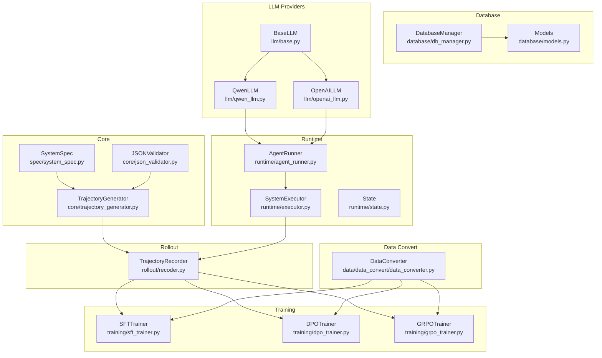
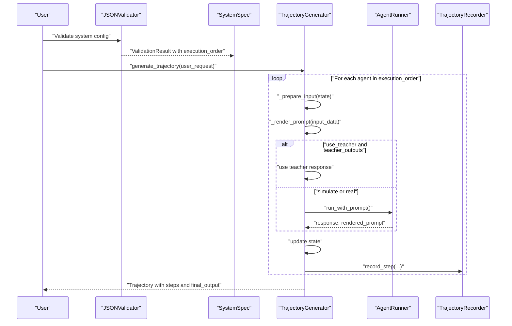
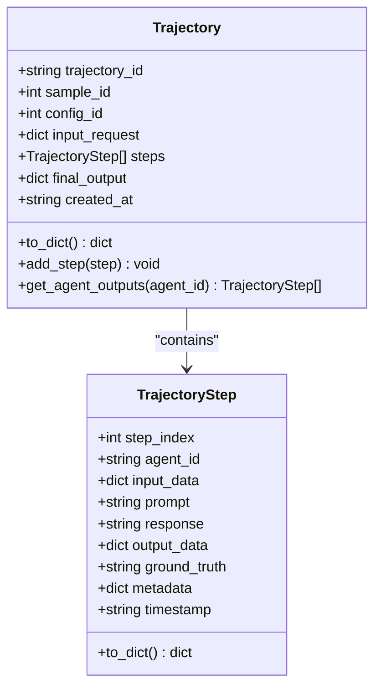
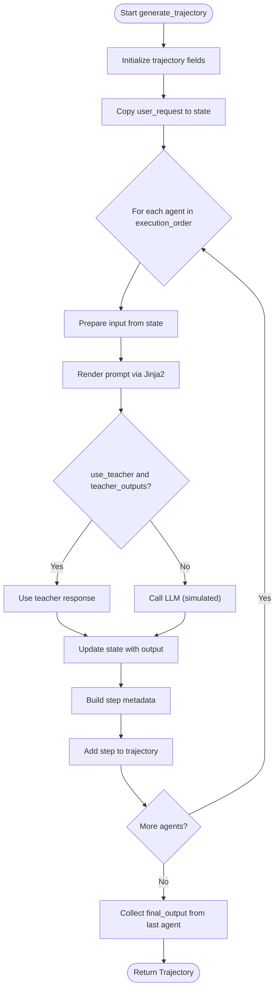
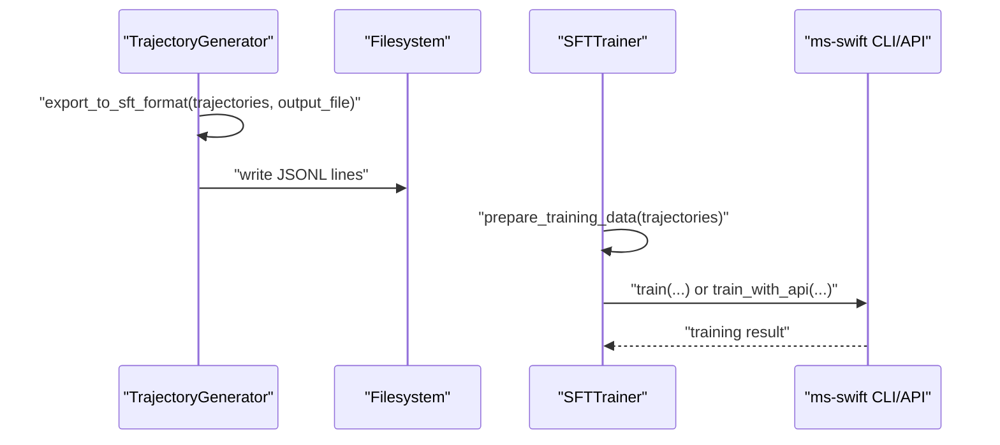
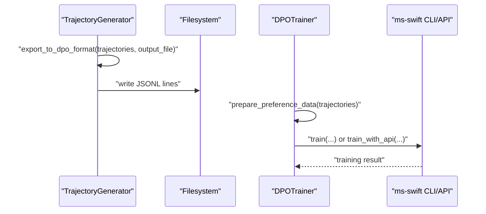
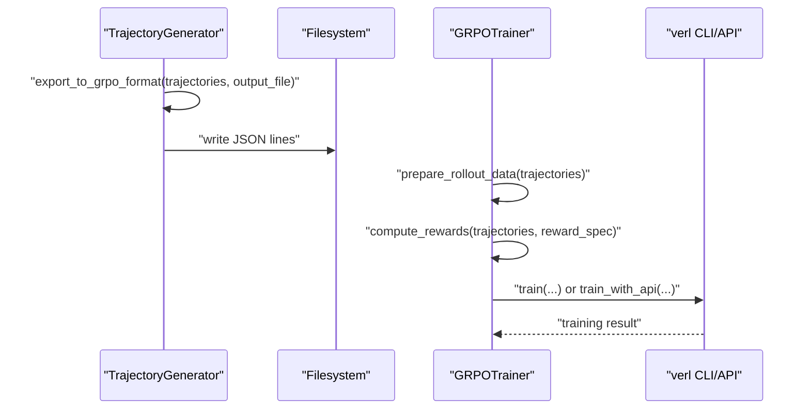
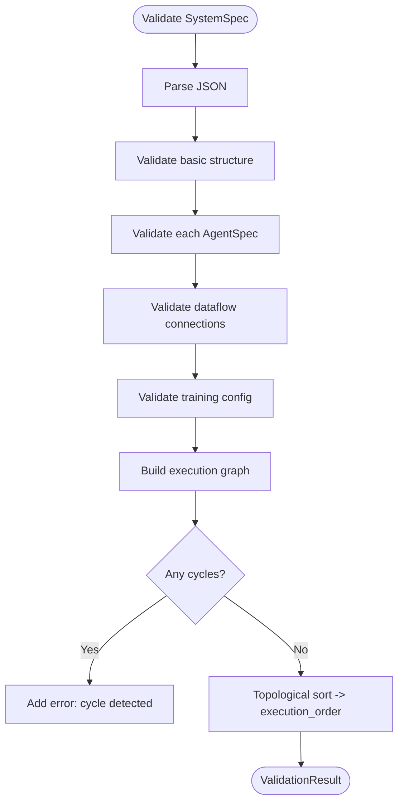
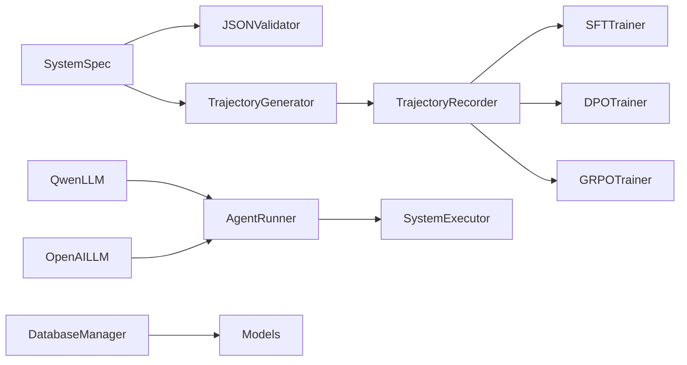
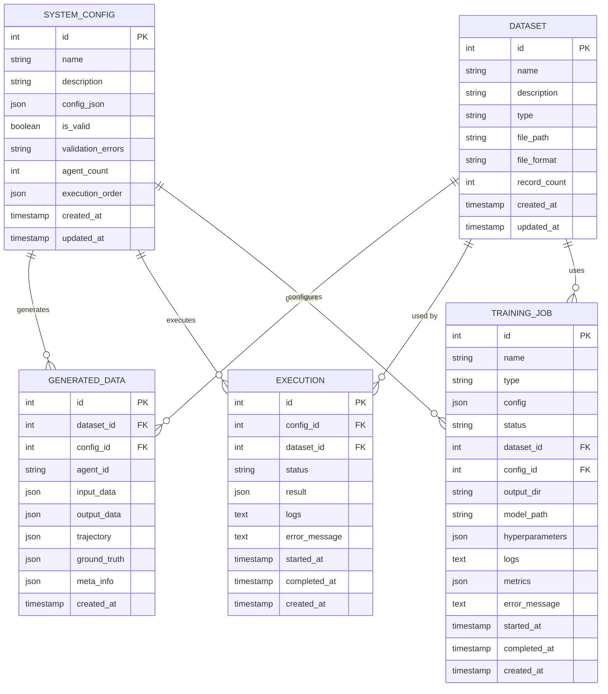

# Trajectory Generation and Data Export

<cite>
**Referenced Files in This Document**
- [trajectory_generator.py](file://core/trajectory_generator.py)
- [json_validator.py](file://core/json_validator.py)
- [system_spec.py](file://spec/system_spec.py)
- [agent_runner.py](file://runtime/agent_runner.py)
- [executor.py](file://runtime/executor.py)
- [state.py](file://runtime/state.py)
- [recoder.py](file://rollout/recoder.py)
- [sft_trainer.py](file://training/sft_trainer.py)
- [dpo_trainer.py](file://training/dpo_trainer.py)
- [grpo_trainer.py](file://training/grpo_trainer.py)
- [data_converter.py](file://data/data_convert/data_converter.py)
- [db_manager.py](file://database/db_manager.py)
- [models.py](file://database/models.py)
- [qwen_llm.py](file://llm/qwen_llm.py)
- [openai_llm.py](file://llm/openai_llm.py)
- [base.py](file://llm/base.py)
</cite>

## Table of Contents
1. [Introduction](#introduction)
2. [Project Structure](#project-structure)
3. [Core Components](#core-components)
4. [Architecture Overview](#architecture-overview)
5. [Detailed Component Analysis](#detailed-component-analysis)
6. [Dependency Analysis](#dependency-analysis)
7. [Performance Considerations](#performance-considerations)
8. [Troubleshooting Guide](#troubleshooting-guide)
9. [Conclusion](#conclusion)
10. [Appendices](#appendices)

## Introduction
This document explains the trajectory generation and data export pipeline for multi-agent systems. It covers the TrajectoryGenerator class, the TrajectoryStep and Trajectory data structures, single-input and batch trajectory generation, and the export formats for SFT (Supervised Fine-Tuning), DPO (Direct Preference Optimization), and GRPO (Generative Reward Policy Optimization). It also documents statistical analysis and validation processes, and shows how to integrate with the ms-swift training framework and the verl GRPO training stack. Practical examples demonstrate generating trajectories from multi-agent configurations, exporting training data, and preparing datasets for downstream training.

## Project Structure
The trajectory generation and export functionality spans several modules:
- Core data structures and generation logic live in core/trajectory_generator.py and core/json_validator.py, with system configuration defined in spec/system_spec.py.
- Runtime execution and LLM integration are handled in runtime/agent_runner.py and runtime/executor.py, with state management in runtime/state.py.
- Trajectory recording and conversion utilities are in rollout/recoder.py.
- Training integrations for SFT, DPO, and GRPO are in training/sft_trainer.py, training/dpo_trainer.py, and training/grpo_trainer.py respectively.
- Data conversion utilities for external frameworks are in data/data_convert/data_converter.py.
- Database persistence for datasets, generated data, and training jobs is in database/db_manager.py and database/models.py.
- LLM providers are implemented in llm/qwen_llm.py, llm/openai_llm.py, and llm/base.py.

**Diagram sources**
- [trajectory_generator.py:58-353](file://core/trajectory_generator.py#L58-L353)
- [json_validator.py:37-347](file://core/json_validator.py#L37-L347)
- [system_spec.py:100-114](file://spec/system_spec.py#L100-L114)
- [agent_runner.py:10-68](file://runtime/agent_runner.py#L10-L68)
- [executor.py:9-132](file://runtime/executor.py#L9-L132)
- [state.py:1-8](file://runtime/state.py#L1-L8)
- [recoder.py:8-122](file://rollout/recoder.py#L8-L122)
- [sft_trainer.py:9-263](file://training/sft_trainer.py#L9-L263)
- [dpo_trainer.py:8-320](file://training/dpo_trainer.py#L8-L320)
- [grpo_trainer.py:8-385](file://training/grpo_trainer.py#L8-L385)
- [data_converter.py:10-99](file://data/data_convert/data_converter.py#L10-L99)
- [db_manager.py:11-347](file://database/db_manager.py#L11-L347)
- [models.py:10-123](file://database/models.py#L10-L123)
- [qwen_llm.py:7-51](file://llm/qwen_llm.py#L7-L51)
- [openai_llm.py:7-49](file://llm/openai_llm.py#L7-L49)
- [base.py:3-6](file://llm/base.py#L3-L6)

**Section sources**
- [trajectory_generator.py:1-353](file://core/trajectory_generator.py#L1-L353)
- [json_validator.py:1-347](file://core/json_validator.py#L1-L347)
- [system_spec.py:1-114](file://spec/system_spec.py#L1-L114)
- [agent_runner.py:1-68](file://runtime/agent_runner.py#L1-L68)
- [executor.py:1-132](file://runtime/executor.py#L1-L132)
- [state.py:1-8](file://runtime/state.py#L1-L8)
- [recoder.py:1-122](file://rollout/recoder.py#L1-L122)
- [sft_trainer.py:1-263](file://training/sft_trainer.py#L1-L263)
- [dpo_trainer.py:1-320](file://training/dpo_trainer.py#L1-L320)
- [grpo_trainer.py:1-385](file://training/grpo_trainer.py#L1-L385)
- [data_converter.py:1-99](file://data/data_convert/data_converter.py#L1-L99)
- [db_manager.py:1-347](file://database/db_manager.py#L1-L347)
- [models.py:1-123](file://database/models.py#L1-L123)
- [qwen_llm.py:1-51](file://llm/qwen_llm.py#L1-L51)
- [openai_llm.py:1-49](file://llm/openai_llm.py#L1-L49)
- [base.py:1-6](file://llm/base.py#L1-L6)

## Core Components
- TrajectoryStep: Represents a single step in a trajectory with indices, agent identity, input/output data, prompt, response, optional ground truth, metadata, and timestamp.
- Trajectory: Encapsulates a full execution trace with trajectory_id, sample_id, config_id, input_request, ordered steps, final_output, and creation timestamp. Provides helpers to add steps and extract agent outputs.
- TrajectoryGenerator: Orchestrates single and batch trajectory generation, renders prompts via Jinja2 templates, optionally uses teacher outputs, collects final outputs, exports to SFT/DPO/GRPO formats, and computes statistics.

Key responsibilities:
- Single-input generation: Builds state from user_request, iterates agents in validated execution order, prepares inputs, renders prompts, optionally uses teacher outputs, updates state, and records steps.
- Batch generation: Iterates user_requests and delegates to single-input generation.
- Export formats: Converts trajectories to SFT (JSONL with instruction/output), DPO (JSONL with chosen/rejected pairs), and GRPO (JSON with full trajectory and steps).
- Statistics: Aggregates counts, average steps per trajectory, agents involved, and presence of ground truth.

**Section sources**
- [trajectory_generator.py:11-56](file://core/trajectory_generator.py#L11-L56)
- [trajectory_generator.py:58-178](file://core/trajectory_generator.py#L58-L178)
- [trajectory_generator.py:217-353](file://core/trajectory_generator.py#L217-L353)

## Architecture Overview
The system validates the multi-agent configuration, determines execution order, and executes agents sequentially. For each step, it renders a prompt, optionally uses a teacher model for ground truth, and records trajectory steps. Trajectories can be exported to training-ready formats and integrated with ms-swift or verl.

**Diagram sources**
- [json_validator.py:43-82](file://core/json_validator.py#L43-L82)
- [system_spec.py:100-114](file://spec/system_spec.py#L100-L114)
- [trajectory_generator.py:73-154](file://core/trajectory_generator.py#L73-L154)
- [agent_runner.py:33-60](file://runtime/agent_runner.py#L33-L60)
- [recoder.py:15-42](file://rollout/recoder.py#L15-L42)

## Detailed Component Analysis

### Trajectory Data Structures

**Diagram sources**
- [trajectory_generator.py:11-56](file://core/trajectory_generator.py#L11-L56)

**Section sources**
- [trajectory_generator.py:11-56](file://core/trajectory_generator.py#L11-L56)

### Trajectory Generation Process
- Single-input generation:
  - Initializes trajectory_id, sample_id, config_id, and copies user_request.
  - Iterates agents in validated execution order.
  - Prepares input from state, renders prompt, optionally uses teacher outputs, updates state, and records a step with metadata.
  - Collects final output from the last agent’s output keys.
- Batch generation:
  - Iterates user_requests and calls single-input generator for each.

**Diagram sources**
- [trajectory_generator.py:73-154](file://core/trajectory_generator.py#L73-L154)
- [trajectory_generator.py:180-215](file://core/trajectory_generator.py#L180-L215)

**Section sources**
- [trajectory_generator.py:73-154](file://core/trajectory_generator.py#L73-L154)
- [trajectory_generator.py:180-215](file://core/trajectory_generator.py#L180-L215)

### Export Formats and Integrations

#### SFT (Supervised Fine-Tuning)
- Export format: JSONL with fields instruction, input, output, history, system, metadata.
- TrajectoryGenerator export: Filters steps with ground_truth and writes JSONL.
- ms-swift integration: SFTTrainer can prepare training data and launch training via command-line or Python API.

**Diagram sources**
- [trajectory_generator.py:217-253](file://core/trajectory_generator.py#L217-L253)
- [sft_trainer.py:16-141](file://training/sft_trainer.py#L16-L141)

**Section sources**
- [trajectory_generator.py:217-253](file://core/trajectory_generator.py#L217-L253)
- [sft_trainer.py:16-141](file://training/sft_trainer.py#L16-L141)

#### DPO (Direct Preference Optimization)
- Export format: JSONL with fields instruction, input, chosen, rejected, metadata.
- TrajectoryGenerator export: Creates chosen/rejected pairs from ground_truth vs response when they differ.
- ms-swift integration: DPOTrainer prepares preference data and launches training via CLI or API.

**Diagram sources**
- [trajectory_generator.py:255-289](file://core/trajectory_generator.py#L255-L289)
- [dpo_trainer.py:15-190](file://training/dpo_trainer.py#L15-L190)

**Section sources**
- [trajectory_generator.py:255-289](file://core/trajectory_generator.py#L255-L289)
- [dpo_trainer.py:15-190](file://training/dpo_trainer.py#L15-L190)

#### GRPO (Generative Reward Policy Optimization)
- Export format: JSON with trajectory_id, input_request, steps (each with agent_id, prompt, response, ground_truth, metadata), final_output.
- TrajectoryGenerator export: Writes full trajectories as JSON.
- verl integration: GRPOTrainer prepares rollout data, computes rewards, and launches training via CLI or API.

**Diagram sources**
- [trajectory_generator.py:291-329](file://core/trajectory_generator.py#L291-L329)
- [grpo_trainer.py:15-266](file://training/grpo_trainer.py#L15-L266)

**Section sources**
- [trajectory_generator.py:291-329](file://core/trajectory_generator.py#L291-L329)
- [grpo_trainer.py:15-266](file://training/grpo_trainer.py#L15-L266)

### Statistical Analysis and Validation
- Statistics: Total trajectories, total steps, agents involved, average steps per trajectory, and number of steps with ground truth.
- Validation: JSONValidator parses and validates agent configurations, checks structure, agent uniqueness, input/output connections, training modes, and detects cyclic dependencies via topological sort.

**Diagram sources**
- [json_validator.py:43-82](file://core/json_validator.py#L43-L82)
- [json_validator.py:242-267](file://core/json_validator.py#L242-L267)

**Section sources**
- [trajectory_generator.py:331-352](file://core/trajectory_generator.py#L331-L352)
- [json_validator.py:43-82](file://core/json_validator.py#L43-L82)
- [json_validator.py:242-267](file://core/json_validator.py#L242-L267)

### Practical Examples

#### Example 1: Generating Trajectories from Multi-Agent Configurations
- Load a system configuration (agents, inputs/outputs, training), validate it, and instantiate TrajectoryGenerator.
- For each user request, call generate_trajectory to produce a Trajectory with ordered steps and final_output.
- Optionally call generate_batch for multiple requests.

**Section sources**
- [system_spec.py:100-114](file://spec/system_spec.py#L100-L114)
- [json_validator.py:43-82](file://core/json_validator.py#L43-L82)
- [trajectory_generator.py:73-178](file://core/trajectory_generator.py#L73-L178)

#### Example 2: Exporting Training Data
- Export to SFT: Use export_to_sft_format to write JSONL suitable for ms-swift SFT.
- Export to DPO: Use export_to_dpo_format to write JSONL with chosen/rejected pairs.
- Export to GRPO: Use export_to_grpo_format to write JSON with full trajectories.

**Section sources**
- [trajectory_generator.py:217-329](file://core/trajectory_generator.py#L217-L329)

#### Example 3: Integrating with ms-swift Training Framework
- SFT: Use SFTTrainer.prepare_training_data to convert trajectories to SFT JSONL, then call train or train_with_api.
- DPO: Use DPOTrainer.prepare_preference_data to convert trajectories to DPO JSONL, then call train or train_with_api.

**Section sources**
- [sft_trainer.py:16-141](file://training/sft_trainer.py#L16-L141)
- [dpo_trainer.py:15-190](file://training/dpo_trainer.py#L15-L190)

#### Example 4: Using the Data Converter Utility
- Convert existing datasets to multiple target frameworks (swift_sft, swift_dpo, verl_grpo) using data/data_convert/data_converter.py.

**Section sources**
- [data_converter.py:10-99](file://data/data_convert/data_converter.py#L10-L99)

## Dependency Analysis
- Coupling:
  - TrajectoryGenerator depends on SystemSpec and JSONValidator for configuration and execution order.
  - Runtime components (AgentRunner, SystemExecutor) provide LLM integration and stateful execution.
  - TrajectoryRecorder persists intermediate steps compatible with SFT training.
  - Training modules (SFTTrainer, DPOTrainer, GRPOTrainer) consume trajectories and integrate with external frameworks.
- Cohesion:
  - Core modules encapsulate generation and validation logic.
  - Training modules encapsulate framework-specific preparation and launching.
- External dependencies:
  - ms-swift for SFT/DPO training.
  - verl for GRPO training.
  - NetworkX for dependency graph analysis.
  - SQLAlchemy for persistence.

**Diagram sources**
- [system_spec.py:100-114](file://spec/system_spec.py#L100-L114)
- [json_validator.py:37-82](file://core/json_validator.py#L37-L82)
- [trajectory_generator.py:58-178](file://core/trajectory_generator.py#L58-L178)
- [recoder.py:8-42](file://rollout/recoder.py#L8-L42)
- [agent_runner.py:10-68](file://runtime/agent_runner.py#L10-L68)
- [executor.py:9-132](file://runtime/executor.py#L9-L132)
- [sft_trainer.py:9-141](file://training/sft_trainer.py#L9-L141)
- [dpo_trainer.py:8-190](file://training/dpo_trainer.py#L8-L190)
- [grpo_trainer.py:8-266](file://training/grpo_trainer.py#L8-L266)
- [db_manager.py:11-347](file://database/db_manager.py#L11-L347)
- [models.py:10-123](file://database/models.py#L10-L123)
- [qwen_llm.py:7-51](file://llm/qwen_llm.py#L7-L51)
- [openai_llm.py:7-49](file://llm/openai_llm.py#L7-L49)

**Section sources**
- [system_spec.py:100-114](file://spec/system_spec.py#L100-L114)
- [json_validator.py:37-82](file://core/json_validator.py#L37-L82)
- [trajectory_generator.py:58-178](file://core/trajectory_generator.py#L58-L178)
- [recoder.py:8-42](file://rollout/recoder.py#L8-L42)
- [agent_runner.py:10-68](file://runtime/agent_runner.py#L10-L68)
- [executor.py:9-132](file://runtime/executor.py#L9-L132)
- [sft_trainer.py:9-141](file://training/sft_trainer.py#L9-L141)
- [dpo_trainer.py:8-190](file://training/dpo_trainer.py#L8-L190)
- [grpo_trainer.py:8-266](file://training/grpo_trainer.py#L8-L266)
- [db_manager.py:11-347](file://database/db_manager.py#L11-L347)
- [models.py:10-123](file://database/models.py#L10-L123)
- [qwen_llm.py:7-51](file://llm/qwen_llm.py#L7-L51)
- [openai_llm.py:7-49](file://llm/openai_llm.py#L7-L49)

## Performance Considerations
- Prompt rendering uses Jinja2 templates; keep templates concise to minimize overhead.
- Batch generation loops sequentially; consider parallelizing independent requests while preserving deterministic execution order per trajectory.
- Export operations write JSONL incrementally; ensure disk I/O is not a bottleneck by batching writes or using SSD storage.
- Training integrations spawn external processes; manage resource usage and avoid concurrent heavy runs.
- Validation builds a directed graph; for very large agent sets, optimize graph construction and cycle detection.

[No sources needed since this section provides general guidance]

## Troubleshooting Guide
Common issues and resolutions:
- Missing agent_id or invalid structure in configuration: JSONValidator reports missing fields and duplicates; fix the JSON schema.
- Cyclic dependencies in agent dataflow: Validator detects cycles; restructure agent inputs/outputs to form a DAG.
- No ground truth for SFT: Validator warns about missing ground_truth configuration; configure training.ground_truth accordingly.
- Encoding errors when calling LLM APIs: LLM providers set explicit HTTP client headers to avoid encoding issues; ensure environment locales are compatible.
- ms-swift or verl not installed: Training integrations return error messages indicating missing packages; install the required frameworks.

**Section sources**
- [json_validator.py:124-157](file://core/json_validator.py#L124-L157)
- [json_validator.py:256-266](file://core/json_validator.py#L256-L266)
- [json_validator.py:232-241](file://core/json_validator.py#L232-L241)
- [qwen_llm.py:40-51](file://llm/qwen_llm.py#L40-L51)
- [openai_llm.py:43-49](file://llm/openai_llm.py#L43-L49)
- [sft_trainer.py:210-219](file://training/sft_trainer.py#L210-L219)
- [dpo_trainer.py:267-276](file://training/dpo_trainer.py#L267-L276)
- [grpo_trainer.py:332-341](file://training/grpo_trainer.py#L332-L341)

## Conclusion
The trajectory generation pipeline integrates configuration validation, multi-agent execution, and structured data export tailored for SFT, DPO, and GRPO training. With built-in statistics and validation, it supports robust experimentation and scalable data preparation. Integrations with ms-swift and verl streamline end-to-end training workflows from trajectory collection to model fine-tuning.

[No sources needed since this section summarizes without analyzing specific files]

## Appendices

### Appendix A: Data Models Overview

**Diagram sources**
- [models.py:10-123](file://database/models.py#L10-L123)

**Section sources**
- [models.py:10-123](file://database/models.py#L10-L123)
- [db_manager.py:11-347](file://database/db_manager.py#L11-L347)