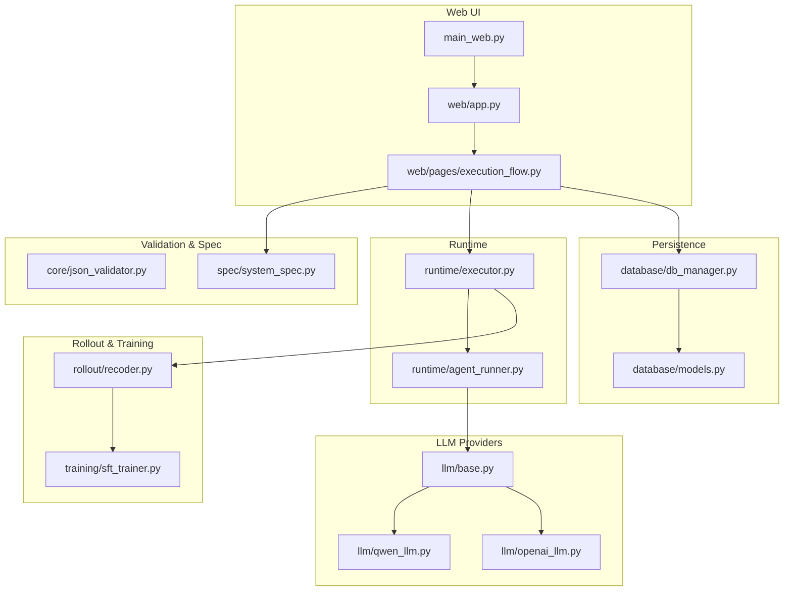
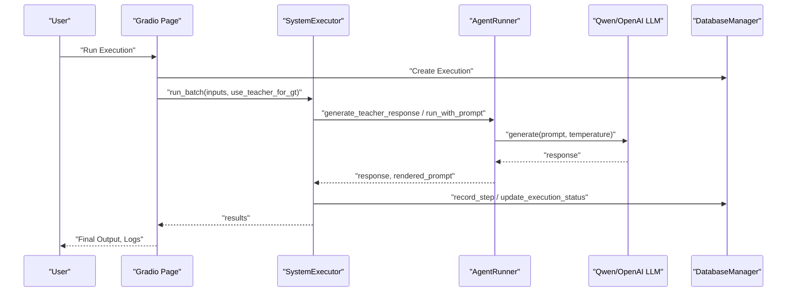
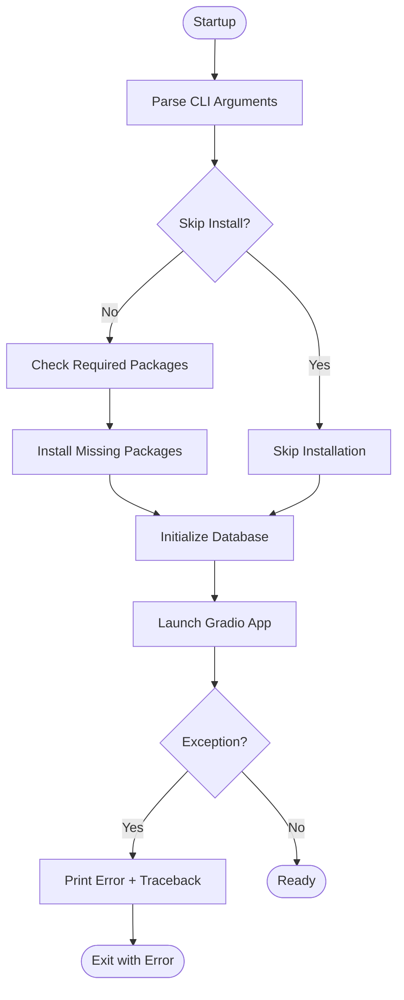
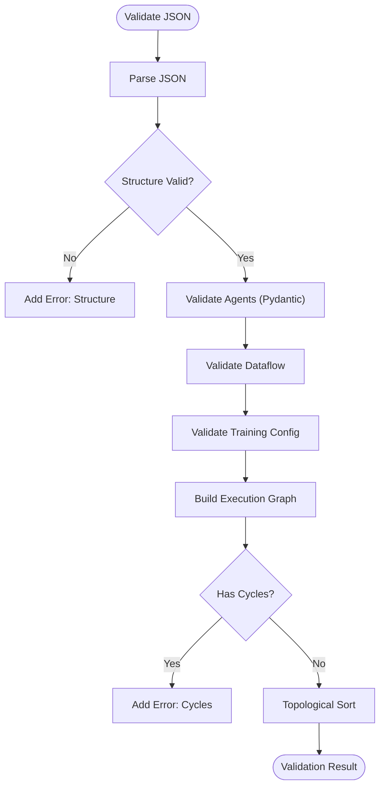
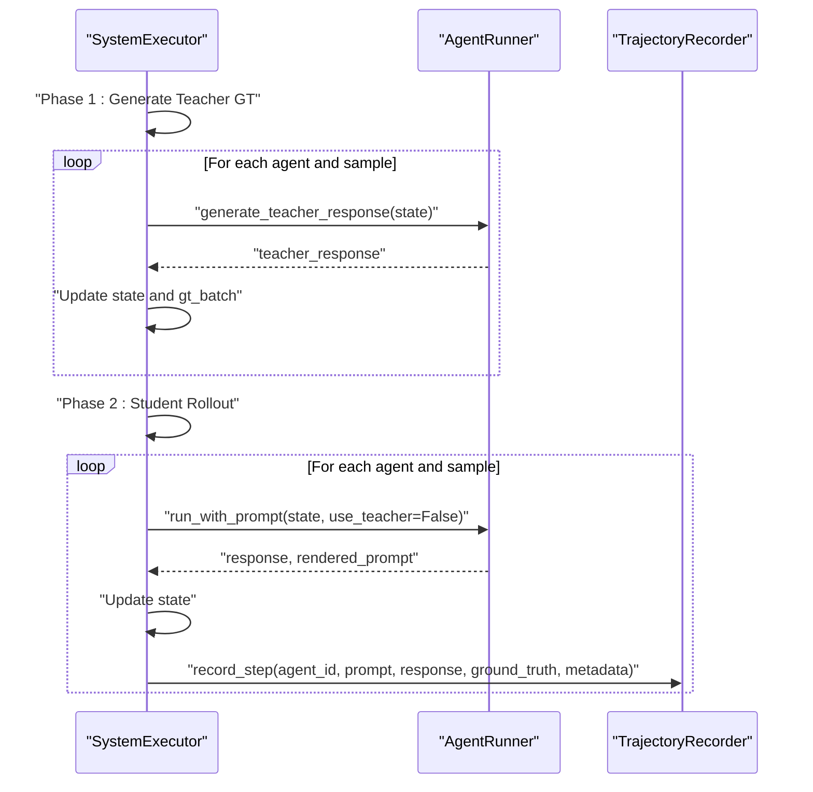
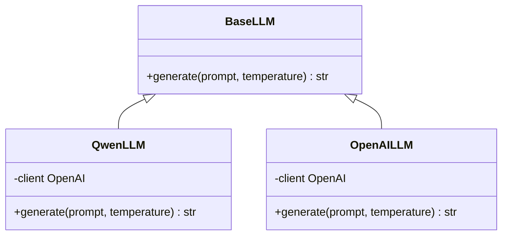
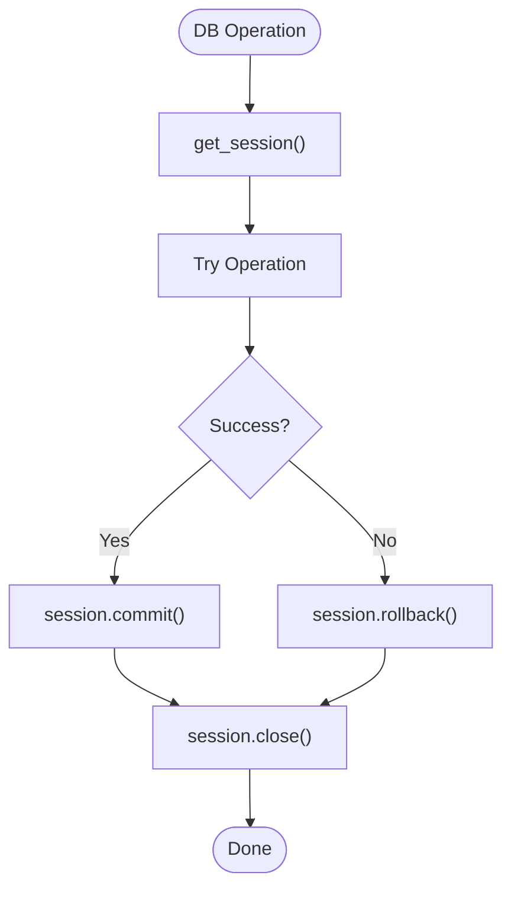

# Troubleshooting and Debugging

<cite>
**Referenced Files in This Document**
- [main_web.py](file://main_web.py)
- [web/app.py](file://web/app.py)
- [web/pages/execution_flow.py](file://web/pages/execution_flow.py)
- [runtime/agent_runner.py](file://runtime/agent_runner.py)
- [runtime/executor.py](file://runtime/executor.py)
- [spec/system_spec.py](file://spec/system_spec.py)
- [core/json_validator.py](file://core/json_validator.py)
- [database/db_manager.py](file://database/db_manager.py)
- [database/models.py](file://database/models.py)
- [rollout/recoder.py](file://rollout/recoder.py)
- [llm/base.py](file://llm/base.py)
- [llm/qwen_llm.py](file://llm/qwen_llm.py)
- [llm/openai_llm.py](file://llm/openai_llm.py)
- [training/sft_trainer.py](file://training/sft_trainer.py)
</cite>

## Table of Contents
1. [Introduction](#introduction)
2. [Project Structure](#project-structure)
3. [Core Components](#core-components)
4. [Architecture Overview](#architecture-overview)
5. [Detailed Component Analysis](#detailed-component-analysis)
6. [Dependency Analysis](#dependency-analysis)
7. [Performance Considerations](#performance-considerations)
8. [Troubleshooting Guide](#troubleshooting-guide)
9. [Conclusion](#conclusion)
10. [Appendices](#appendices)

## Introduction
This document provides a comprehensive troubleshooting and debugging guide for the multi-agent system. It focuses on diagnosing and resolving common issues across configuration validation, runtime execution, LLM provider integration, database connectivity, and training pipeline. It also outlines logging strategies, error tracking, and diagnostic workflows to systematically identify root causes, reproduce issues, and apply fixes.

## Project Structure
The system is organized around a Web UI (Gradio), configuration validation, runtime execution, LLM providers, database persistence, and training orchestration. Key areas for debugging include:
- Web application lifecycle and dependency installation
- Configuration parsing and validation
- Runtime execution phases and state transitions
- LLM provider client initialization and generation
- Database sessions and transactions
- Trajectory recording and training data assembly

**Diagram sources**
- [main_web.py:73-157](file://main_web.py#L73-L157)
- [web/app.py:20-173](file://web/app.py#L20-L173)
- [web/pages/execution_flow.py:9-275](file://web/pages/execution_flow.py#L9-L275)
- [spec/system_spec.py:100-114](file://spec/system_spec.py#L100-L114)
- [runtime/executor.py:9-132](file://runtime/executor.py#L9-L132)
- [runtime/agent_runner.py:10-68](file://runtime/agent_runner.py#L10-L68)
- [llm/base.py:3-6](file://llm/base.py#L3-L6)
- [llm/qwen_llm.py:7-51](file://llm/qwen_llm.py#L7-L51)
- [llm/openai_llm.py:7-49](file://llm/openai_llm.py#L7-L49)
- [database/db_manager.py:11-347](file://database/db_manager.py#L11-L347)
- [database/models.py:10-123](file://database/models.py#L10-L123)
- [rollout/recoder.py:8-122](file://rollout/recoder.py#L8-L122)
- [training/sft_trainer.py:9-263](file://training/sft_trainer.py#L9-L263)

**Section sources**
- [main_web.py:73-157](file://main_web.py#L73-L157)
- [web/app.py:20-173](file://web/app.py#L20-L173)
- [web/pages/execution_flow.py:9-275](file://web/pages/execution_flow.py#L9-L275)
- [spec/system_spec.py:100-114](file://spec/system_spec.py#L100-L114)
- [runtime/executor.py:9-132](file://runtime/executor.py#L9-L132)
- [runtime/agent_runner.py:10-68](file://runtime/agent_runner.py#L10-L68)
- [llm/base.py:3-6](file://llm/base.py#L3-L6)
- [llm/qwen_llm.py:7-51](file://llm/qwen_llm.py#L7-L51)
- [llm/openai_llm.py:7-49](file://llm/openai_llm.py#L7-L49)
- [database/db_manager.py:11-347](file://database/db_manager.py#L11-L347)
- [database/models.py:10-123](file://database/models.py#L10-L123)
- [rollout/recoder.py:8-122](file://rollout/recoder.py#L8-L122)
- [training/sft_trainer.py:9-263](file://training/sft_trainer.py#L9-L263)

## Core Components
- Web application bootstrap and dependency checks
- Configuration validation and execution order inference
- System executor orchestrating two-phase execution (teacher GT generation, student rollout)
- Agent runner managing LLM provider selection and prompt rendering
- LLM providers encapsulating client initialization and generation
- Database manager handling CRUD operations and transactional updates
- Trajectory recorder persisting rollout steps and assembling datasets
- Training integrations for SFT workflows

Key debugging touchpoints:
- Web startup and dependency installation
- Validation result reporting and execution order
- Executor phase boundaries and per-sample error propagation
- LLM client initialization and error surfacing
- Database session lifecycle and commit/rollback behavior
- Recorder file writes and dataset assembly

**Section sources**
- [main_web.py:19-61](file://main_web.py#L19-L61)
- [core/json_validator.py:37-82](file://core/json_validator.py#L37-L82)
- [runtime/executor.py:16-132](file://runtime/executor.py#L16-L132)
- [runtime/agent_runner.py:33-68](file://runtime/agent_runner.py#L33-L68)
- [llm/qwen_llm.py:8-38](file://llm/qwen_llm.py#L8-L38)
- [llm/openai_llm.py:8-41](file://llm/openai_llm.py#L8-L41)
- [database/db_manager.py:31-347](file://database/db_manager.py#L31-L347)
- [rollout/recoder.py:15-96](file://rollout/recoder.py#L15-L96)
- [training/sft_trainer.py:59-220](file://training/sft_trainer.py#L59-L220)

## Architecture Overview
The system follows a layered architecture:
- Presentation layer: Gradio app and page handlers
- Orchestration layer: System specification, validation, and executor
- Execution layer: Agent runner and LLM providers
- Persistence layer: SQLAlchemy ORM with SQLite
- Training layer: SFT trainer integrating external tools

**Diagram sources**
- [web/pages/execution_flow.py:116-224](file://web/pages/execution_flow.py#L116-L224)
- [runtime/executor.py:16-132](file://runtime/executor.py#L16-L132)
- [runtime/agent_runner.py:33-68](file://runtime/agent_runner.py#L33-L68)
- [llm/qwen_llm.py:40-51](file://llm/qwen_llm.py#L40-L51)
- [llm/openai_llm.py:43-49](file://llm/openai_llm.py#L43-L49)
- [database/db_manager.py:205-244](file://database/db_manager.py#L205-L244)

## Detailed Component Analysis

### Web Application Startup and Dependencies
Common issues:
- Missing or incompatible packages during startup
- Dependency installation failures
- Port/host/share option misconfiguration
- Uncaught exceptions leading to early termination

Debugging techniques:
- Enable debug flag to print full stack traces
- Verify dependency installation paths and optional packages
- Confirm database initialization completes before launching the app

**Diagram sources**
- [main_web.py:73-157](file://main_web.py#L73-L157)

**Section sources**
- [main_web.py:19-61](file://main_web.py#L19-L61)
- [main_web.py:139-153](file://main_web.py#L139-L153)

### Configuration Validation and Execution Order
Common issues:
- Invalid JSON structure or missing keys
- Duplicate agent IDs
- Invalid training modes or missing ground truth for SFT
- Circular dependencies detected via execution graph
- Dataflow mismatches (missing upstream outputs)

Debugging techniques:
- Inspect ValidationResult for errors and warnings
- Review inferred execution order and agent inputs/outputs
- Validate training configuration and dataflow graph

**Diagram sources**
- [core/json_validator.py:43-82](file://core/json_validator.py#L43-L82)
- [core/json_validator.py:242-267](file://core/json_validator.py#L242-L267)

**Section sources**
- [core/json_validator.py:37-82](file://core/json_validator.py#L37-L82)
- [core/json_validator.py:159-180](file://core/json_validator.py#L159-L180)
- [core/json_validator.py:181-217](file://core/json_validator.py#L181-L217)
- [core/json_validator.py:218-241](file://core/json_validator.py#L218-L241)
- [core/json_validator.py:242-267](file://core/json_validator.py#L242-L267)

### Runtime Execution Phases and State Management
Common issues:
- Missing state keys for agent input mapping
- Exceptions during teacher or student generation
- Incorrect reset of batch state between phases
- Recording failures or missing ground truth keys

Debugging techniques:
- Log per-sample progress and errors
- Verify teacher GT generation and student rollout separately
- Ensure state updates occur before dependent agents run
- Confirm trajectory recording metadata alignment

**Diagram sources**
- [runtime/executor.py:16-132](file://runtime/executor.py#L16-L132)
- [runtime/agent_runner.py:33-68](file://runtime/agent_runner.py#L33-L68)
- [rollout/recoder.py:15-42](file://rollout/recoder.py#L15-L42)

**Section sources**
- [runtime/executor.py:16-132](file://runtime/executor.py#L16-L132)
- [runtime/agent_runner.py:33-68](file://runtime/agent_runner.py#L33-L68)
- [rollout/recoder.py:15-42](file://rollout/recoder.py#L15-L42)

### LLM Provider Integration
Common issues:
- API key or base URL misconfiguration
- Network timeouts or encoding errors
- Client initialization failures
- Provider mismatch in agent spec

Debugging techniques:
- Verify YAML config loading and fallback paths
- Check HTTP client headers and timeouts
- Capture and surface provider-specific errors
- Validate provider selection in agent runner

**Diagram sources**
- [llm/base.py:3-6](file://llm/base.py#L3-L6)
- [llm/qwen_llm.py:7-51](file://llm/qwen_llm.py#L7-L51)
- [llm/openai_llm.py:7-49](file://llm/openai_llm.py#L7-L49)

**Section sources**
- [llm/qwen_llm.py:8-38](file://llm/qwen_llm.py#L8-L38)
- [llm/openai_llm.py:8-41](file://llm/openai_llm.py#L8-L41)
- [runtime/agent_runner.py:14-31](file://runtime/agent_runner.py#L14-L31)

### Database Connectivity and Transactions
Common issues:
- Database path creation or permission errors
- Session lifecycle mistakes (leaked sessions)
- Transaction commit/rollback anomalies
- Schema mismatch after updates

Debugging techniques:
- Confirm database path and table creation
- Wrap operations in try/finally blocks to close sessions
- Track status transitions and timestamps
- Validate foreign key relationships and JSON column usage

**Diagram sources**
- [database/db_manager.py:31-347](file://database/db_manager.py#L31-L347)
- [database/models.py:10-123](file://database/models.py#L10-L123)

**Section sources**
- [database/db_manager.py:14-29](file://database/db_manager.py#L14-L29)
- [database/db_manager.py:41-56](file://database/db_manager.py#L41-L56)
- [database/db_manager.py:205-244](file://database/db_manager.py#L205-L244)

### Trajectory Recording and Dataset Assembly
Common issues:
- File write failures or encoding errors
- Missing ground truth or metadata fields
- Incorrect grouping by sample_id
- Output file naming collisions

Debugging techniques:
- Verify output directory creation and file paths
- Ensure ground_truth and loss_weight are present when applicable
- Validate assembled dataset structure for downstream training

**Section sources**
- [rollout/recoder.py:8-42](file://rollout/recoder.py#L8-L42)
- [rollout/recoder.py:44-96](file://rollout/recoder.py#L44-L96)
- [rollout/recoder.py:98-122](file://rollout/recoder.py#L98-L122)

### Training Pipeline Integration
Common issues:
- ms-swift not installed or import errors
- Incorrect model type inference
- Hyperparameter conflicts
- Command construction failures

Debugging techniques:
- Catch ImportError and return actionable messages
- Log constructed command and output directory
- Validate model path and infer model_type reliably

**Section sources**
- [training/sft_trainer.py:152-220](file://training/sft_trainer.py#L152-L220)
- [training/sft_trainer.py:221-251](file://training/sft_trainer.py#L221-L251)

## Dependency Analysis
- Web app depends on database initialization and page handlers
- Execution page depends on system spec and executor
- Executor depends on agent runner and recorder
- Agent runner depends on LLM providers and Jinja2 templates
- Database manager depends on SQLAlchemy ORM and models
- Trainer depends on external tools and filesystem

Potential circular dependencies:
- None observed among the listed modules

External dependencies:
- Gradio, SQLAlchemy, Pydantic, NetworkX, Jinja2, PyYAML, httpx, OpenAI SDK, numpy

**Section sources**
- [web/pages/execution_flow.py:116-170](file://web/pages/execution_flow.py#L116-L170)
- [runtime/executor.py:9-15](file://runtime/executor.py#L9-L15)
- [runtime/agent_runner.py:2-7](file://runtime/agent_runner.py#L2-L7)
- [database/db_manager.py:8](file://database/db_manager.py#L8)
- [training/sft_trainer.py:4](file://training/sft_trainer.py#L4)

## Performance Considerations
- Minimize synchronous long-running operations in UI callbacks; consider async execution for heavy workloads
- Batch database writes and avoid frequent commits
- Limit log verbosity in production to reduce I/O overhead
- Use topological sorting to optimize agent execution order and avoid redundant recomputation

## Troubleshooting Guide

### Configuration Issues
Symptoms:
- Validation errors indicating missing fields or invalid types
- Warnings about duplicate keys or ambiguous outputs
- Detected cycles in execution graph

Remediation:
- Review ValidationResult for precise error messages
- Fix agent_id uniqueness and required fields
- Adjust dataflow mappings to resolve dangling inputs
- Break cycles by removing or reworking input dependencies

**Section sources**
- [core/json_validator.py:124-157](file://core/json_validator.py#L124-L157)
- [core/json_validator.py:181-217](file://core/json_validator.py#L181-L217)
- [core/json_validator.py:218-241](file://core/json_validator.py#L218-L241)
- [core/json_validator.py:257-266](file://core/json_validator.py#L257-L266)

### Dependency Resolution Errors
Symptoms:
- Import errors for ms-swift or missing packages
- Dependency installation failures during startup

Remediation:
- Use the no-install flag to bypass automatic installation
- Manually install required packages and optional training libraries
- Re-run with debug flag to capture stack traces

**Section sources**
- [main_web.py:19-61](file://main_web.py#L19-L61)
- [main_web.py:139-153](file://main_web.py#L139-L153)
- [training/sft_trainer.py:210-219](file://training/sft_trainer.py#L210-L219)

### Runtime Exceptions During Execution
Symptoms:
- KeyError for missing state keys
- RuntimeError when teacher model is not configured
- Exceptions raised inside loops for individual samples

Remediation:
- Ensure all input mappings are satisfied by state
- Configure teacher model when required by agent spec
- Wrap per-sample execution with try/catch and log sample index

**Section sources**
- [runtime/agent_runner.py:39-40](file://runtime/agent_runner.py#L39-L40)
- [runtime/agent_runner.py:64-67](file://runtime/agent_runner.py#L64-L67)
- [runtime/executor.py:64-67](file://runtime/executor.py#L64-L67)
- [runtime/executor.py:125-127](file://runtime/executor.py#L125-L127)

### Logging Strategies and Error Tracking
- Web startup: print startup messages and handle keyboard interrupts gracefully
- Execution page: maintain a log buffer and update UI progressively
- Database operations: track status transitions and timestamps
- Training: log constructed commands and output directories

**Section sources**
- [main_web.py:139-153](file://main_web.py#L139-L153)
- [web/pages/execution_flow.py:150-178](file://web/pages/execution_flow.py#L150-L178)
- [database/db_manager.py:221-244](file://database/db_manager.py#L221-L244)
- [training/sft_trainer.py:125-140](file://training/sft_trainer.py#L125-L140)

### Database Connectivity and Transaction Failures
Symptoms:
- Database path creation errors
- Session leaks or uncommitted transactions
- Status update anomalies

Remediation:
- Verify database path exists and is writable
- Ensure every session acquisition is paired with a close
- Use atomic updates and handle rollback on failure

**Section sources**
- [database/db_manager.py:14-29](file://database/db_manager.py#L14-L29)
- [database/db_manager.py:41-56](file://database/db_manager.py#L41-L56)
- [database/db_manager.py:221-244](file://database/db_manager.py#L221-L244)

### Data Consistency Problems
Symptoms:
- Inconsistent state after teacher GT generation
- Missing ground truth in trajectory records
- Incorrect assembled dataset structure

Remediation:
- Reset batch state before student phase
- Ensure ground truth keys match training configuration
- Validate assembled dataset fields before saving

**Section sources**
- [runtime/executor.py:80-81](file://runtime/executor.py#L80-L81)
- [runtime/executor.py:107-123](file://runtime/executor.py#L107-L123)
- [rollout/recoder.py:62-85](file://rollout/recoder.py#L62-L85)

### LLM Provider Integration Issues
Symptoms:
- API key or base URL errors
- Encoding errors in prompt/response
- Client initialization failures

Remediation:
- Confirm YAML config presence and readable encoding
- Set explicit HTTP client headers and timeouts
- Validate provider selection and model names

**Section sources**
- [llm/qwen_llm.py:13-17](file://llm/qwen_llm.py#L13-L17)
- [llm/qwen_llm.py:49-51](file://llm/qwen_llm.py#L49-L51)
- [llm/openai_llm.py:14-18](file://llm/openai_llm.py#L14-L18)
- [runtime/agent_runner.py:14-31](file://runtime/agent_runner.py#L14-L31)

### Complex Multi-Agent Workflow Debugging
Systematic approach:
1. Validate configuration and execution order
2. Run teacher GT generation phase independently
3. Inspect state updates and recorded GT
4. Execute student rollout with trajectory recording
5. Review logs and UI status for each sample
6. Assemble and inspect SFT dataset

**Section sources**
- [core/json_validator.py:78-82](file://core/json_validator.py#L78-L82)
- [runtime/executor.py:32-68](file://runtime/executor.py#L32-L68)
- [runtime/executor.py:75-132](file://runtime/executor.py#L75-L132)
- [rollout/recoder.py:44-96](file://rollout/recoder.py#L44-L96)

### Reproducing Issues and Root Cause Analysis
- Use minimal reproducible configuration and dataset
- Enable debug mode and capture full stack traces
- Isolate phases (validation, teacher GT, student rollout)
- Compare expected vs. actual state keys and outputs
- Verify database status transitions and logs

**Section sources**
- [main_web.py:150-152](file://main_web.py#L150-L152)
- [web/pages/execution_flow.py:221-223](file://web/pages/execution_flow.py#L221-L223)
- [runtime/executor.py:64-67](file://runtime/executor.py#L64-L67)
- [runtime/executor.py:125-127](file://runtime/executor.py#L125-L127)

## Conclusion
Effective troubleshooting of the multi-agent system requires disciplined validation, clear logging, and structured isolation of components. By leveraging the built-in validation, execution phases, database status tracking, and LLM provider diagnostics, most issues can be quickly identified and resolved. Adopt the systematic approaches outlined here to minimize downtime and improve reliability.

## Appendices

### Quick Reference: Common Error Categories and Fixes
- Configuration: review ValidationResult; fix missing fields and cycles
- Dependencies: install required packages; handle ms-swift availability
- Runtime: ensure state keys; configure teacher model; catch per-sample errors
- Database: verify path and sessions; atomic updates
- LLM: confirm config files and client headers; validate provider selection
- Training: log commands; verify model type inference

[No sources needed since this section provides general guidance]