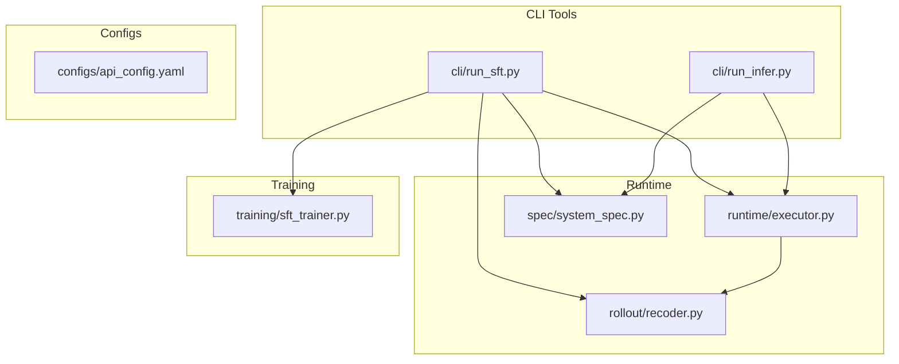
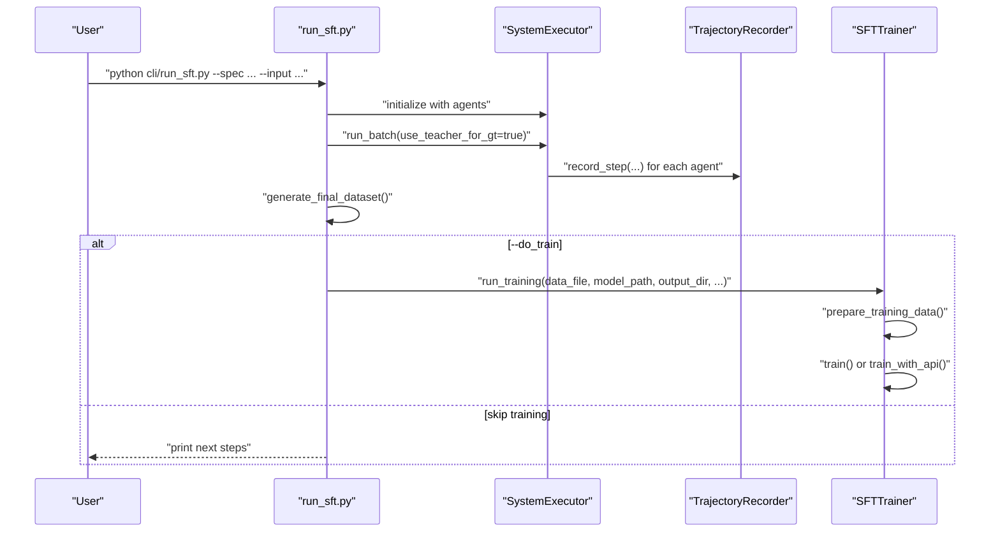
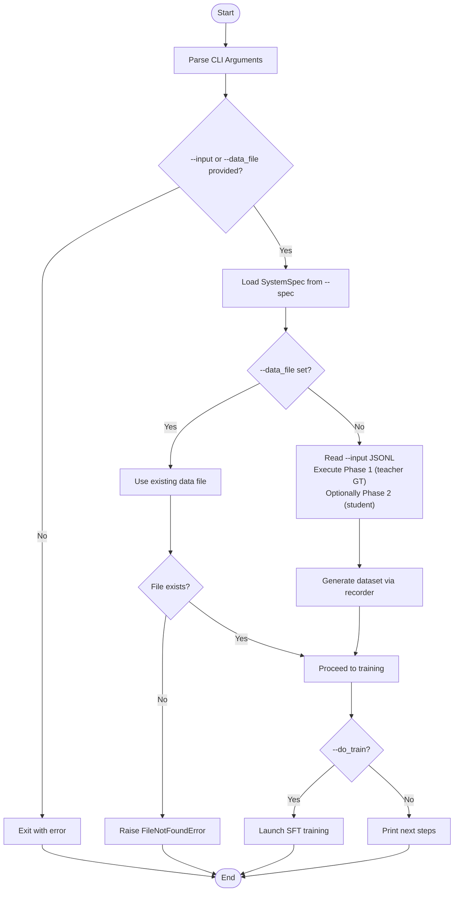
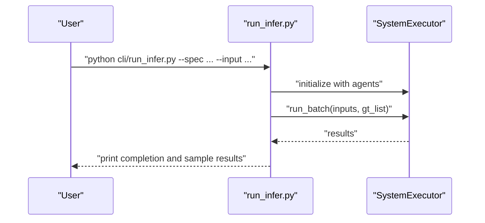
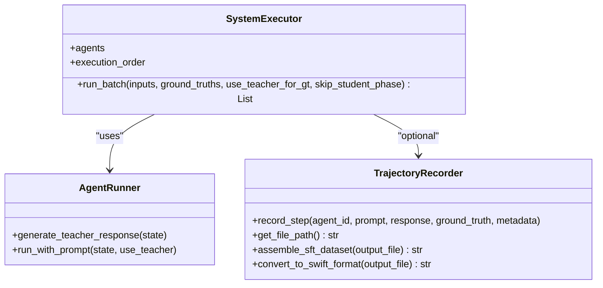
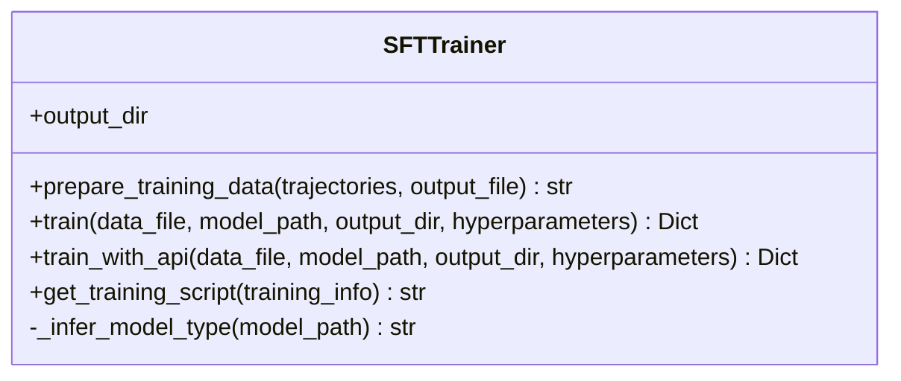
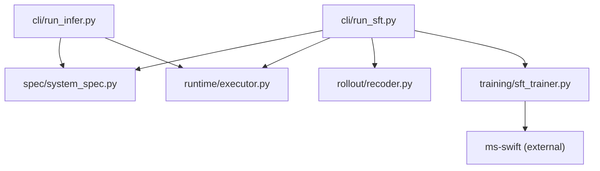

# Command-Line Interface

<cite>
**Referenced Files in This Document**
- [run_sft.py](file://cli/run_sft.py)
- [run_infer.py](file://cli/run_infer.py)
- [sft_trainer.py](file://training/sft_trainer.py)
- [executor.py](file://runtime/executor.py)
- [system_spec.py](file://spec/system_spec.py)
- [recoder.py](file://rollout/recoder.py)
- [api_config.yaml](file://configs/api_config.yaml)
- [使用流程.txt](file://使用流程.txt)
</cite>

## Table of Contents
1. [Introduction](#introduction)
2. [Project Structure](#project-structure)
3. [Core Components](#core-components)
4. [Architecture Overview](#architecture-overview)
5. [Detailed Component Analysis](#detailed-component-analysis)
6. [Dependency Analysis](#dependency-analysis)
7. [Performance Considerations](#performance-considerations)
8. [Troubleshooting Guide](#troubleshooting-guide)
9. [Conclusion](#conclusion)
10. [Appendices](#appendices)

## Introduction
This document provides a comprehensive command-line interface (CLI) guide for the multi-agent system builder. It covers:
- CLI tool reference for SFT training and inference
- Parameter explanations, usage examples, and automation patterns
- Batch processing capabilities and integration with the training framework
- Practical workflows for scripting, continuous integration, and production deployment
- Argument parsing, error handling, and debugging techniques

## Project Structure
The CLI tools reside under the cli/ directory and integrate with runtime, spec, rollout, and training modules. The primary executables are:
- SFT training runner: cli/run_sft.py
- Inference runner: cli/run_infer.py

**Diagram sources**
- [run_sft.py:17-117](file://cli/run_sft.py#L17-L117)
- [run_infer.py:8-46](file://cli/run_infer.py#L8-L46)
- [executor.py:9-132](file://runtime/executor.py#L9-L132)
- [system_spec.py:100-114](file://spec/system_spec.py#L100-L114)
- [recoder.py:8-122](file://rollout/recoder.py#L8-L122)
- [sft_trainer.py:9-263](file://training/sft_trainer.py#L9-L263)

**Section sources**
- [run_sft.py:17-117](file://cli/run_sft.py#L17-L117)
- [run_infer.py:8-46](file://cli/run_infer.py#L8-L46)

## Core Components
- SFT Training CLI (cli/run_sft.py): orchestrates data collection via a two-phase process (teacher-generated ground truth, student execution with trajectory recording), optionally triggers SFT training via ms-swift integration.
- Inference CLI (cli/run_infer.py): runs batch inference using the multi-agent system specification and optional ground-truth comparison.
- Runtime Executor (runtime/executor.py): executes agents in order, supports teacher/student phases, and records trajectories.
- System Specification (spec/system_spec.py): defines agent configuration, training, and IO mappings.
- Trajectory Recorder (rollout/recoder.py): persists rollout logs and converts them to training-ready datasets.
- SFT Trainer (training/sft_trainer.py): prepares training data and launches ms-swift SFT training with automatic model-type detection and hardware-aware defaults.

**Section sources**
- [run_sft.py:17-117](file://cli/run_sft.py#L17-L117)
- [run_infer.py:8-46](file://cli/run_infer.py#L8-L46)
- [executor.py:9-132](file://runtime/executor.py#L9-L132)
- [system_spec.py:77-114](file://spec/system_spec.py#L77-L114)
- [recoder.py:8-122](file://rollout/recoder.py#L8-L122)
- [sft_trainer.py:9-263](file://training/sft_trainer.py#L9-L263)

## Architecture Overview
The CLI tools parse arguments, load the system specification, and delegate execution to the runtime and training modules. The SFT pipeline includes:
- Phase 1: Teacher model generates ground truth for each agent’s output keys
- Phase 2: Student model executes, records steps with optional ground truth for supervised fine-tuning
- Optional training: ms-swift SFT launcher with automatic model-type inference and hardware detection

**Diagram sources**
- [run_sft.py:72-114](file://cli/run_sft.py#L72-L114)
- [executor.py:16-132](file://runtime/executor.py#L16-L132)
- [recoder.py:44-96](file://rollout/recoder.py#L44-L96)
- [sft_trainer.py:59-220](file://training/sft_trainer.py#L59-L220)

## Detailed Component Analysis

### SFT Training CLI (cli/run_sft.py)
- Purpose: Automate the SFT pipeline end-to-end with optional training invocation.
- Key parameters:
  - --spec: Path to system specification JSON
  - --input: Path to raw dataset (JSONL with user_request)
  - --output_dir: Output directory for trained model artifacts
  - --do_train: Enable SFT training after data collection
  - --lr: Learning rate for training
  - --batch_size: Per-device batch size
  - --epochs: Number of training epochs
  - --teacher_only: Generate ground truth only (skip student phase and training)
  - --data_file: Use an existing training data file (skip data collection)
- Behavior:
  - Validates presence of either --input or --data_file
  - Loads SystemSpec and initializes agents
  - Executes Phase 1 (teacher GT generation) and optional Phase 2 (student execution with trajectory recording)
  - Generates final dataset and optionally starts SFT training
- Error handling:
  - Raises explicit errors for missing data files
  - Prints actionable guidance when skipping training

**Diagram sources**
- [run_sft.py:17-117](file://cli/run_sft.py#L17-L117)

**Section sources**
- [run_sft.py:17-117](file://cli/run_sft.py#L17-L117)

### Inference CLI (cli/run_infer.py)
- Purpose: Run batch inference with optional ground-truth comparison.
- Key parameters:
  - --spec: Path to system specification JSON
  - --input: Path to input JSONL file
  - --gt: Optional path to ground-truth JSONL file
- Behavior:
  - Loads SystemSpec and agents
  - Reads inputs and optional ground truths
  - Executes batch inference via SystemExecutor
  - Outputs completion status and sample results

**Diagram sources**
- [run_infer.py:8-46](file://cli/run_infer.py#L8-L46)
- [executor.py:16-37](file://runtime/executor.py#L16-L37)

**Section sources**
- [run_infer.py:8-46](file://cli/run_infer.py#L8-L46)

### Runtime Executor (runtime/executor.py)
- Two-phase execution:
  - Phase 1: Teacher model generates ground truth for each agent’s configured output keys and updates batch state
  - Phase 2: Student model executes, records steps with optional ground truth, and optionally saves trajectory data
- Supports skipping student phase for pure teacher GT generation
- Records trajectory steps with metadata for downstream training

**Diagram sources**
- [executor.py:9-132](file://runtime/executor.py#L9-L132)
- [recoder.py:8-122](file://rollout/recoder.py#L8-L122)

**Section sources**
- [executor.py:16-132](file://runtime/executor.py#L16-L132)

### SFT Trainer (training/sft_trainer.py)
- Converts recorded trajectories into SFT training data
- Launches ms-swift SFT training with:
  - Automatic model-type inference from model path
  - Hardware-aware defaults (CPU/GPU detection, flash attention toggling)
  - Configurable hyperparameters with sensible defaults
- Provides both command-line and API-based training modes

**Diagram sources**
- [sft_trainer.py:9-263](file://training/sft_trainer.py#L9-L263)

**Section sources**
- [sft_trainer.py:59-220](file://training/sft_trainer.py#L59-L220)

### System Specification (spec/system_spec.py)
- Defines agent configuration, training settings, IO mappings, and model/teacher model configurations
- Provides helper methods to load from JSON and construct typed objects

**Section sources**
- [system_spec.py:77-114](file://spec/system_spec.py#L77-L114)

### Trajectory Recorder (rollout/recoder.py)
- Persists rollout logs in JSONL format
- Assembles SFT datasets and converts to SWIFT-compatible formats
- Adds ground truth and loss weights for training

**Section sources**
- [recoder.py:44-122](file://rollout/recoder.py#L44-L122)

## Dependency Analysis
- CLI tools depend on SystemSpec for agent configuration and on SystemExecutor for execution
- SFT CLI integrates with TrajectoryRecorder for dataset generation and with SFTTrainer for training
- SFTTrainer depends on ms-swift for training and performs model-type inference and hardware detection

**Diagram sources**
- [run_sft.py:12-14](file://cli/run_sft.py#L12-L14)
- [run_infer.py:4-5](file://cli/run_infer.py#L4-L5)
- [sft_trainer.py:102-147](file://training/sft_trainer.py#L102-L147)

**Section sources**
- [run_sft.py:12-14](file://cli/run_sft.py#L12-L14)
- [run_infer.py:4-5](file://cli/run_infer.py#L4-L5)
- [sft_trainer.py:102-147](file://training/sft_trainer.py#L102-L147)

## Performance Considerations
- Batch processing: Both CLI tools read JSONL line-by-line and process inputs in batches; ensure adequate memory for large datasets
- GPU/CPU detection: SFTTrainer detects CUDA availability and adjusts training flags accordingly
- Logging and saving frequency: Defaults are tuned for balanced progress monitoring and disk usage
- Model-type inference: Automatic inference reduces manual configuration but may require correct model path naming conventions

[No sources needed since this section provides general guidance]

## Troubleshooting Guide
Common issues and resolutions:
- Missing training data file: Ensure --data_file exists or provide --input for data collection
- No training flag: If --do_train is omitted, the tool prints guidance for proceeding with training
- ms-swift not installed: API mode falls back to command-line mode; install ms-swift for API-based training
- GPU detection: If CUDA is unavailable, training runs on CPU with appropriate flags
- Argument validation: The CLI validates required parameters and prints helpful error messages

**Section sources**
- [run_sft.py:32-34](file://cli/run_sft.py#L32-L34)
- [run_sft.py:51-53](file://cli/run_sft.py#L51-L53)
- [run_sft.py:90-114](file://cli/run_sft.py#L90-L114)
- [sft_trainer.py:210-219](file://training/sft_trainer.py#L210-L219)
- [sft_trainer.py:150-161](file://training/sft_trainer.py#L150-L161)

## Conclusion
The CLI tools provide a streamlined workflow for multi-agent system inference and SFT training. They support batch processing, flexible data collection, and integration with ms-swift for scalable training. By leveraging system specifications and trajectory recording, users can automate end-to-end pipelines suitable for development, CI, and production environments.

[No sources needed since this section summarizes without analyzing specific files]

## Appendices

### CLI Reference

- SFT Training CLI (cli/run_sft.py)
  - Required
    - --spec: Path to system specification JSON
    - One of:
      - --input: Path to raw dataset JSONL (contains user_request)
      - --data_file: Path to existing training data file
  - Optional
    - --output_dir: Output directory for trained model (default: ./sft_output)
    - --do_train: Enable SFT training after data collection
    - --lr: Learning rate (default: 2e-5)
    - --batch_size: Batch size (default: 4)
    - --epochs: Number of epochs (default: 3)
    - --teacher_only: Generate ground truth only (skip student phase and training)
  - Behavior
    - Validates inputs and loads SystemSpec
    - Executes Phase 1 (teacher GT) and optional Phase 2 (student with trajectory recording)
    - Generates final dataset and optionally starts SFT training

- Inference CLI (cli/run_infer.py)
  - Required
    - --spec: Path to system specification JSON
    - --input: Path to input JSONL file
  - Optional
    - --gt: Path to ground-truth JSONL file
  - Behavior
    - Loads SystemSpec and agents
    - Runs batch inference and prints results

**Section sources**
- [run_sft.py:18-28](file://cli/run_sft.py#L18-L28)
- [run_infer.py:9-12](file://cli/run_infer.py#L9-L12)

### Usage Examples and Automation Patterns

- Complete SFT pipeline (data generation + training)
  - Example command and workflow reference:
    - [使用流程.txt:11-18](file://使用流程.txt#L11-L18)

- Generate only ground truth (no training)
  - Example command and workflow reference:
    - [使用流程.txt:20-24](file://使用流程.txt#L20-L24)

- Use existing training data for training
  - Example command and workflow reference:
    - [使用流程.txt:26-30](file://使用流程.txt#L26-L30)

- Continuous Integration (CI) pattern
  - Steps
    - Prepare dataset and system specification
    - Run SFT CLI with --do_train and CI-friendly flags
    - Archive training artifacts from output_dir
  - Notes
    - Use --lr, --batch_size, --epochs to tune CI runs
    - Ensure ms-swift is installed or rely on command-line fallback

- Production deployment pattern
  - Steps
    - Generate ground truth with --teacher_only
    - Convert trajectories to training format
    - Launch training with persistent output_dir
    - Deploy trained model via your serving stack

**Section sources**
- [使用流程.txt:11-30](file://使用流程.txt#L11-L30)

### Debugging Techniques
- Enable verbose logging: Use the built-in print statements in CLI and executor modules
- Inspect generated datasets: Review the final dataset file produced by the trajectory recorder
- Verify model-type inference: Ensure model path naming aligns with supported patterns for automatic inference
- Check hardware detection: Confirm GPU availability and adjust flags if needed

**Section sources**
- [executor.py:34-68](file://runtime/executor.py#L34-L68)
- [executor.py:75-127](file://runtime/executor.py#L75-L127)
- [recoder.py:44-96](file://rollout/recoder.py#L44-L96)
- [sft_trainer.py:221-250](file://training/sft_trainer.py#L221-L250)
- [sft_trainer.py:150-161](file://training/sft_trainer.py#L150-L161)