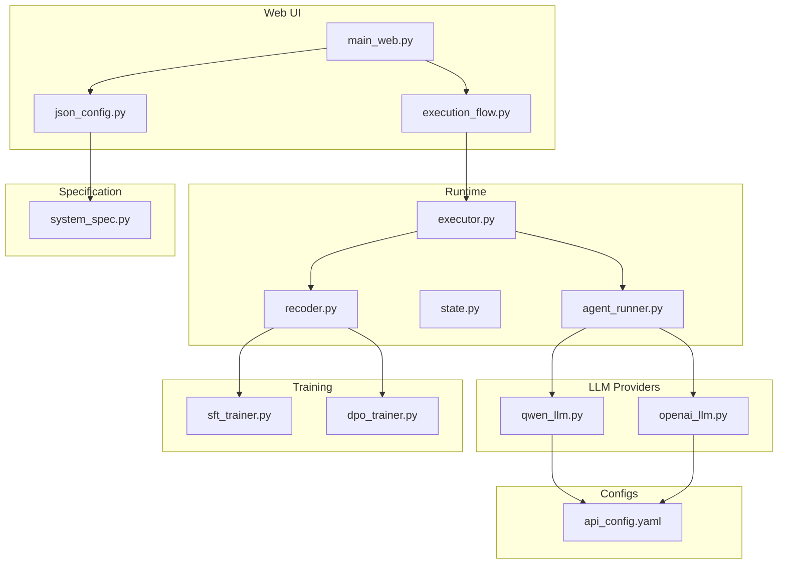
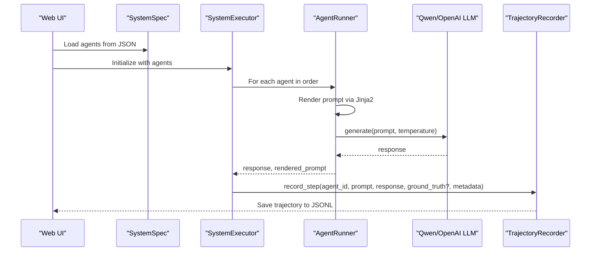
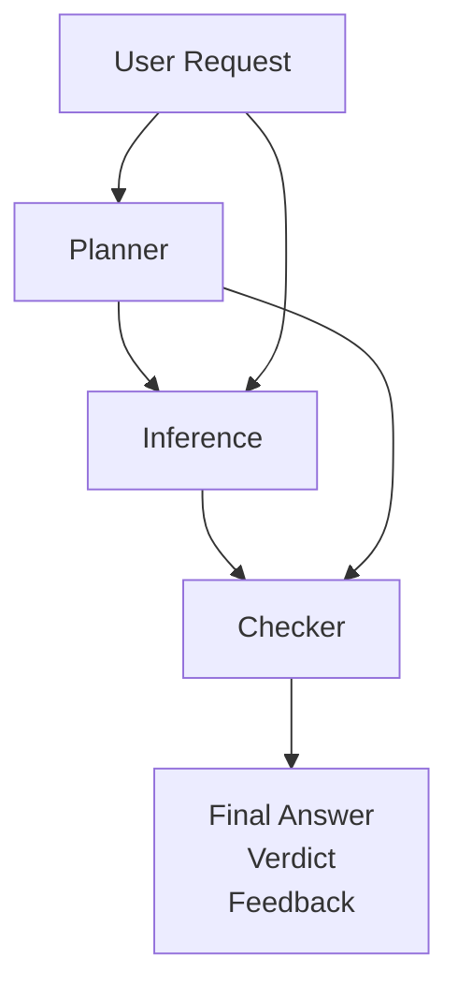
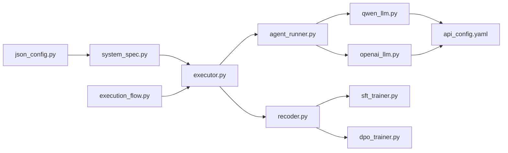

# Configuration Examples and Templates

<cite>
**Referenced Files in This Document**
- [main_web.py](file://main_web.py)
- [api_config.yaml](file://configs/api_config.yaml)
- [system_spec.py](file://spec/system_spec.py)
- [agent_runner.py](file://runtime/agent_runner.py)
- [executor.py](file://runtime/executor.py)
- [state.py](file://runtime/state.py)
- [qwen_llm.py](file://llm/qwen_llm.py)
- [openai_llm.py](file://llm/openai_llm.py)
- [json_config.py](file://web/pages/json_config.py)
- [execution_flow.py](file://web/pages/execution_flow.py)
- [recoder.py](file://rollout/recoder.py)
- [sft_trainer.py](file://training/sft_trainer.py)
- [dpo_trainer.py](file://training/dpo_trainer.py)
- [system_sft_config.json](file://examples/system_sft_config.json)
</cite>

## Table of Contents
1. [Introduction](#introduction)
2. [Project Structure](#project-structure)
3. [Core Components](#core-components)
4. [Architecture Overview](#architecture-overview)
5. [Detailed Component Analysis](#detailed-component-analysis)
6. [Dependency Analysis](#dependency-analysis)
7. [Performance Considerations](#performance-considerations)
8. [Troubleshooting Guide](#troubleshooting-guide)
9. [Conclusion](#conclusion)
10. [Appendices](#appendices)

## Introduction
This document provides comprehensive configuration examples and templates for building multi-agent systems. It covers simple linear workflows, branching scenarios, parallel processing, and complex multi-step pipelines. It also documents template patterns for agent types, input/output configurations, and training setups, along with step-by-step walkthroughs and best practices. Advanced patterns such as conditional execution, dynamic routing, and iterative workflows are explained conceptually, with guidance on how to adapt the provided configuration schema to support them.

## Project Structure
The project centers around a declarative configuration schema that defines agents, their inputs/outputs, prompts, and training behavior. The runtime executes these configurations in two phases: teacher-generated ground truths followed by student execution and trajectory recording for downstream training.

**Diagram sources**
- [main_web.py:1-158](file://main_web.py#L1-L158)
- [json_config.py:1-377](file://web/pages/json_config.py#L1-L377)
- [execution_flow.py:1-275](file://web/pages/execution_flow.py#L1-L275)
- [executor.py:1-132](file://runtime/executor.py#L1-L132)
- [agent_runner.py:1-68](file://runtime/agent_runner.py#L1-L68)
- [state.py:1-8](file://runtime/state.py#L1-L8)
- [recoder.py:1-122](file://rollout/recoder.py#L1-L122)
- [system_spec.py:1-114](file://spec/system_spec.py#L1-L114)
- [qwen_llm.py:1-51](file://llm/qwen_llm.py#L1-L51)
- [openai_llm.py:1-49](file://llm/openai_llm.py#L1-L49)
- [api_config.yaml:1-9](file://configs/api_config.yaml#L1-L9)
- [sft_trainer.py:1-263](file://training/sft_trainer.py#L1-L263)
- [dpo_trainer.py:1-320](file://training/dpo_trainer.py#L1-L320)

**Section sources**
- [main_web.py:1-158](file://main_web.py#L1-L158)
- [system_spec.py:1-114](file://spec/system_spec.py#L1-L114)

## Core Components
- SystemSpec and AgentSpec define the configuration schema for multi-agent systems, including input/output mappings, prompts, model providers, and training configuration.
- AgentRunner encapsulates LLM invocation with Jinja2 templating and supports both student and teacher models.
- SystemExecutor orchestrates two-phase execution: teacher-generated ground truths, followed by student execution and trajectory recording.
- TrajectoryRecorder persists execution steps for downstream training.
- Web UI pages provide JSON configuration upload/validation, visualization, and execution flow controls.

Key configuration elements:
- agent_id: Unique identifier for each agent.
- model/provider: Student model selection and provider.
- instruction_prompt/prompt_template: Jinja2 template for generating prompts.
- input: List of IOMapping entries specifying data sources and keys.
- output: List of OutputMapping entries specifying destinations (other agents or user).
- training: Optional block enabling SFT/DPO training and ground-truth generation.
- teacher_model: Optional block enabling teacher model for ground-truth generation.

**Section sources**
- [system_spec.py:61-114](file://spec/system_spec.py#L61-L114)
- [agent_runner.py:10-68](file://runtime/agent_runner.py#L10-L68)
- [executor.py:9-132](file://runtime/executor.py#L9-L132)
- [recoder.py:8-122](file://rollout/recoder.py#L8-L122)
- [json_config.py:18-377](file://web/pages/json_config.py#L18-L377)
- [execution_flow.py:9-275](file://web/pages/execution_flow.py#L9-L275)

## Architecture Overview
The system follows a configuration-driven execution pipeline with a clear separation between configuration definition, runtime execution, and training data preparation.

**Diagram sources**
- [execution_flow.py:116-223](file://web/pages/execution_flow.py#L116-L223)
- [executor.py:16-132](file://runtime/executor.py#L16-L132)
- [agent_runner.py:33-68](file://runtime/agent_runner.py#L33-L68)
- [qwen_llm.py:40-51](file://llm/qwen_llm.py#L40-L51)
- [openai_llm.py:43-49](file://llm/openai_llm.py#L43-L49)
- [recoder.py:15-42](file://rollout/recoder.py#L15-L42)

## Detailed Component Analysis

### Configuration Schema and Template Patterns
- AgentSpec: Defines agent identity, model/provider, instruction prompt, input/output mappings, optional training, and optional teacher model.
- IOMapping: Connects upstream data sources (user or other agents) to current agent inputs.
- OutputMapping: Routes current agent outputs to downstream agents or to the user.
- TrainingConfig: Enables SFT/DPO training, dataset mapping, ground-truth configuration, loss weighting, and training parameters.

Template patterns:
- Linear workflow: Chain agents sequentially with explicit input/output keys.
- Branching: Use multiple OutputMapping targets to fan out to different agents.
- Parallel processing: Define multiple agents with shared inputs and independent outputs.
- Conditional execution: Use agent output to drive routing decisions in downstream agents (conceptual pattern).
- Dynamic routing: Use agent output to select among multiple candidate downstream agents (conceptual pattern).
- Iterative workflows: Use agent outputs as inputs to the same or earlier agents (conceptual pattern).

**Section sources**
- [system_spec.py:61-114](file://spec/system_spec.py#L61-L114)

### Linear Workflow Example Walkthrough
This example demonstrates a three-agent pipeline: planner, inference, and checker.

Step-by-step:
1. Planner receives user_request from the user and emits a plan.
2. Inference consumes user_request and plan to produce a draft answer.
3. Checker validates the draft answer against the original request and emits final_answer, verdict, and feedback.

**Diagram sources**
- [json_config.py:37-90](file://web/pages/json_config.py#L37-L90)

**Section sources**
- [json_config.py:37-90](file://web/pages/json_config.py#L37-L90)

### Branching Scenario Template
Define multiple OutputMapping targets to route outputs to different agents. For example, a summarizer could branch to both a sentiment analyzer and a keyword extractor.

Template pattern:
- OutputMapping with multiple OutputMappingTarget entries targeting distinct agents.

**Section sources**
- [system_spec.py:56-59](file://spec/system_spec.py#L56-L59)

### Parallel Processing Pattern
Create independent agents that consume the same inputs. Use separate output keys and route each to different consumers.

Template pattern:
- Shared IOMapping sources with independent OutputMapping definitions.

**Section sources**
- [system_spec.py:77-84](file://spec/system_spec.py#L77-L84)

### Complex Multi-Step Pipeline
Combine linear chaining, branching, and iterative steps. For example:
- A supervisor agent orchestrates multiple worker agents.
- Worker outputs feed into a synthesis agent.
- The synthesis agent iteratively refines outputs until a convergence condition is met.

Template pattern:
- Use OutputMapping keys to connect agents across multiple stages.
- Implement convergence checks in downstream agents to control iteration.

**Section sources**
- [system_spec.py:77-84](file://spec/system_spec.py#L77-L84)

### Training Setup Templates
Two-phase execution:
- Phase 1: Teacher model generates ground truths for agents configured with teacher_model.
- Phase 2: Student model executes, and trajectories are recorded for training.

SFT training:
- TrajectoryRecorder writes JSONL suitable for supervised fine-tuning.
- SFTTrainer converts trajectories to training-ready format and prepares SWIFT commands.

DPO training:
- Preference pairs are constructed from trajectories where responses differ from ground truths.
- DPOTrainer prepares DPO datasets and SWIFT commands.

**Section sources**
- [executor.py:16-132](file://runtime/executor.py#L16-L132)
- [recoder.py:15-42](file://rollout/recoder.py#L15-L42)
- [sft_trainer.py:16-141](file://training/sft_trainer.py#L16-L141)
- [dpo_trainer.py:15-190](file://training/dpo_trainer.py#L15-L190)

### API Configuration and Provider Selection
- api_config.yaml stores provider credentials and model settings for Qwen and OpenAI.
- AgentRunner selects the appropriate provider based on model_provider and teacher_model.provider.
- LLM clients are initialized with robust HTTP client settings to avoid encoding issues.

**Section sources**
- [api_config.yaml:1-9](file://configs/api_config.yaml#L1-L9)
- [agent_runner.py:14-31](file://runtime/agent_runner.py#L14-L31)
- [qwen_llm.py:8-38](file://llm/qwen_llm.py#L8-L38)
- [openai_llm.py:7-41](file://llm/openai_llm.py#L7-L41)

### Web UI Integration and Execution Flow
- JSON configuration page allows uploading, validating, saving, and visualizing system configurations.
- Execution flow page runs the selected configuration against a dataset, displays logs, and shows results and trajectory details.
- The runtime integrates with the recorder to persist training data.

**Section sources**
- [json_config.py:18-377](file://web/pages/json_config.py#L18-L377)
- [execution_flow.py:116-275](file://web/pages/execution_flow.py#L116-L275)

## Dependency Analysis
The runtime depends on the configuration schema and LLM providers. The web UI depends on the runtime and database-backed persistence.

**Diagram sources**
- [system_spec.py:100-114](file://spec/system_spec.py#L100-L114)
- [executor.py:9-15](file://runtime/executor.py#L9-L15)
- [agent_runner.py:3-6](file://runtime/agent_runner.py#L3-L6)
- [qwen_llm.py:1-51](file://llm/qwen_llm.py#L1-L51)
- [openai_llm.py:1-49](file://llm/openai_llm.py#L1-L49)
- [api_config.yaml:1-9](file://configs/api_config.yaml#L1-L9)
- [recoder.py:1-122](file://rollout/recoder.py#L1-L122)
- [sft_trainer.py:1-263](file://training/sft_trainer.py#L1-L263)
- [dpo_trainer.py:1-320](file://training/dpo_trainer.py#L1-L320)
- [json_config.py:1-377](file://web/pages/json_config.py#L1-L377)
- [execution_flow.py:1-275](file://web/pages/execution_flow.py#L1-L275)

**Section sources**
- [system_spec.py:100-114](file://spec/system_spec.py#L100-L114)
- [executor.py:9-15](file://runtime/executor.py#L9-L15)
- [agent_runner.py:3-6](file://runtime/agent_runner.py#L3-L6)
- [qwen_llm.py:1-51](file://llm/qwen_llm.py#L1-L51)
- [openai_llm.py:1-49](file://llm/openai_llm.py#L1-L49)
- [api_config.yaml:1-9](file://configs/api_config.yaml#L1-L9)
- [recoder.py:1-122](file://rollout/recoder.py#L1-L122)
- [sft_trainer.py:1-263](file://training/sft_trainer.py#L1-L263)
- [dpo_trainer.py:1-320](file://training/dpo_trainer.py#L1-L320)
- [json_config.py:1-377](file://web/pages/json_config.py#L1-L377)
- [execution_flow.py:1-275](file://web/pages/execution_flow.py#L1-L275)

## Performance Considerations
- Temperature tuning: Adjust agent temperature per task sensitivity.
- Batch execution: The executor processes inputs as a batch; ensure memory alignment with batch_size and model capacity.
- Ground truth generation: Teacher phase can be expensive; consider skipping student phase when only GT is needed.
- Trajectory recording: Writing JSONL incrementally reduces memory overhead during long executions.

[No sources needed since this section provides general guidance]

## Troubleshooting Guide
Common issues and resolutions:
- Missing keys in state: Ensure all IOMapping keys exist in the input state; otherwise, a KeyError is raised during agent execution.
- Encoding errors with LLM clients: The LLM implementations set explicit HTTP client headers to avoid encoding issues.
- Teacher model not configured: Attempting to generate teacher responses without a teacher model raises a runtime error.
- Web UI dependency installation: The launcher checks and installs required packages automatically; use debug mode to inspect exceptions.

**Section sources**
- [agent_runner.py:39-41](file://runtime/agent_runner.py#L39-L41)
- [agent_runner.py:65-68](file://runtime/agent_runner.py#L65-L68)
- [qwen_llm.py:49-51](file://llm/qwen_llm.py#L49-L51)
- [main_web.py:19-61](file://main_web.py#L19-L61)

## Conclusion
This guide outlined configuration patterns and templates for multi-agent systems, demonstrated by a linear workflow and extended to branching, parallelism, and iterative designs. It described the two-phase execution pipeline, training data preparation, and Web UI integration. By leveraging the provided schema and templates, teams can rapidly prototype and scale complex multi-agent systems while maintaining clarity and reproducibility.

[No sources needed since this section summarizes without analyzing specific files]

## Appendices

### Downloadable Templates
- System configuration template for SFT: [system_sft_config.json](file://examples/system_sft_config.json)

Best practice guidelines:
- Keep agent responsibilities focused and orthogonal.
- Use explicit output keys and clear routing to avoid ambiguous data dependencies.
- Prefer teacher-generated ground truths for supervised tasks; leverage DPO for preference modeling.
- Validate configurations using the Web UI before running large-scale executions.
- Modularize prompts and reuse templates across agents to maintain consistency.

[No sources needed since this section provides general guidance]