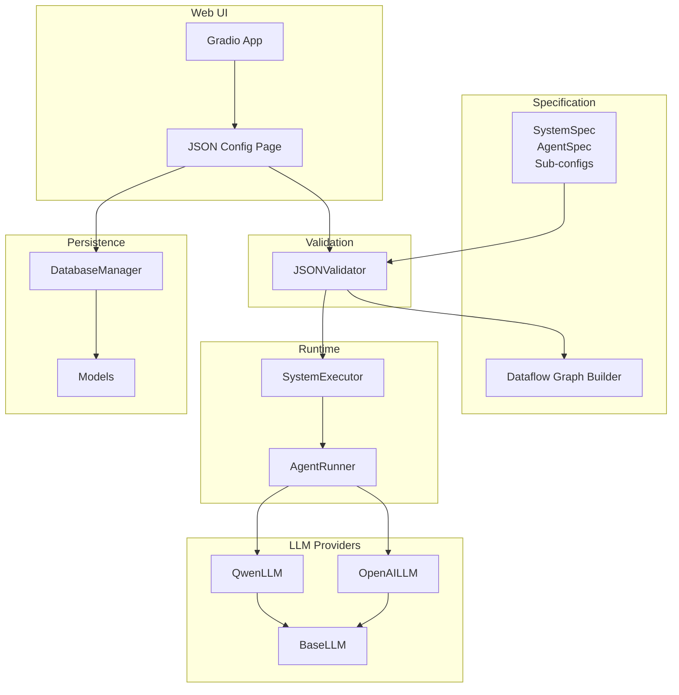
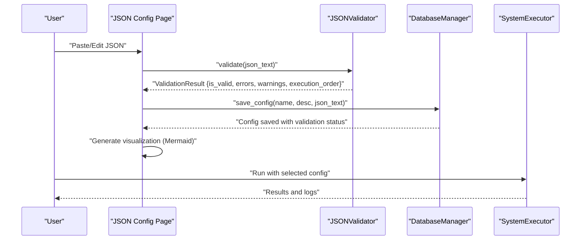
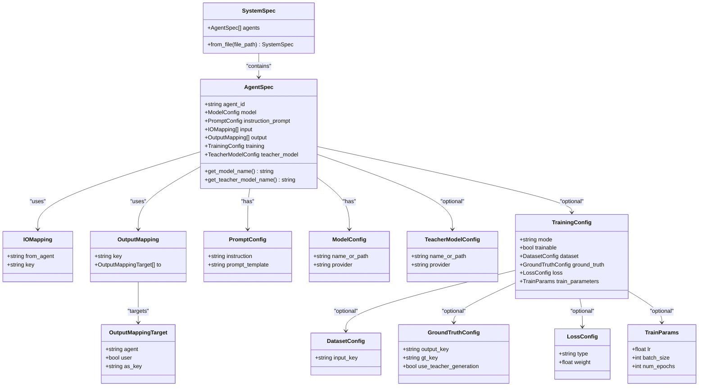
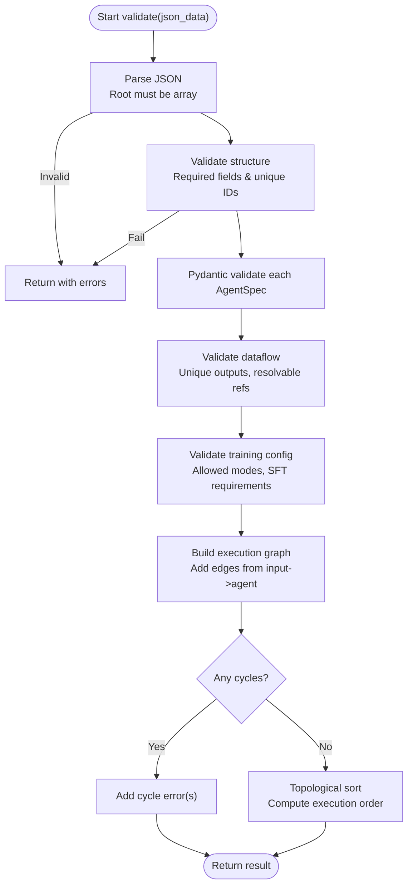
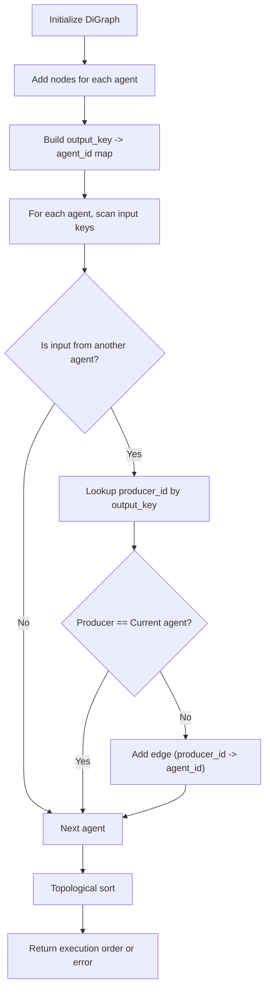
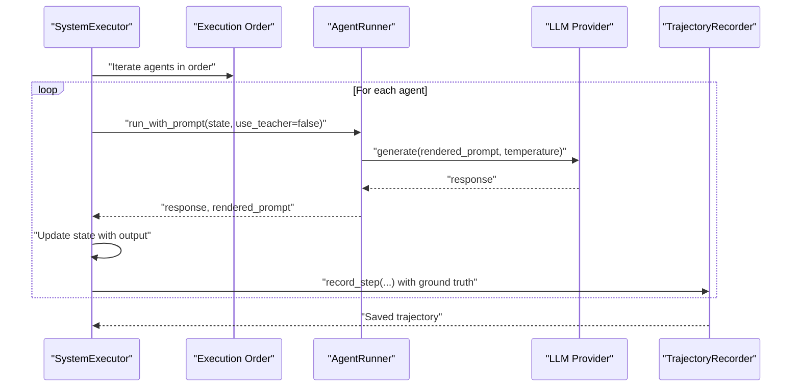
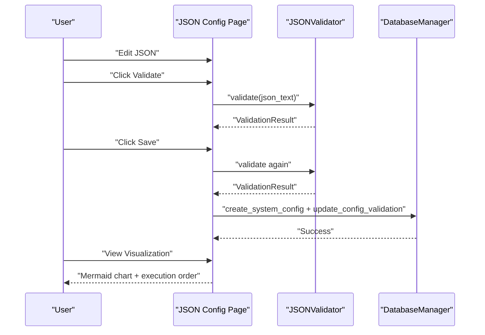
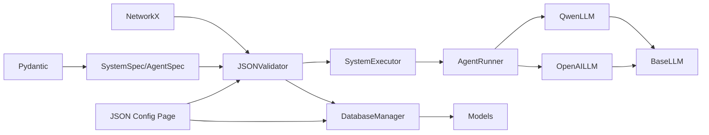

# Configuration Management

<cite>
**Referenced Files in This Document**
- [system_spec.py](file://spec/system_spec.py)
- [dataflow_graph.py](file://spec/dataflow_graph.py)
- [json_validator.py](file://core/json_validator.py)
- [json_config.py](file://web/pages/json_config.py)
- [app.py](file://web/app.py)
- [db_manager.py](file://database/db_manager.py)
- [models.py](file://database/models.py)
- [executor.py](file://runtime/executor.py)
- [agent_runner.py](file://runtime/agent_runner.py)
- [qwen_llm.py](file://llm/qwen_llm.py)
- [openai_llm.py](file://llm/openai_llm.py)
- [base.py](file://llm/base.py)
</cite>

## Table of Contents
1. [Introduction](#introduction)
2. [Project Structure](#project-structure)
3. [Core Components](#core-components)
4. [Architecture Overview](#architecture-overview)
5. [Detailed Component Analysis](#detailed-component-analysis)
6. [Dependency Analysis](#dependency-analysis)
7. [Performance Considerations](#performance-considerations)
8. [Troubleshooting Guide](#troubleshooting-guide)
9. [Conclusion](#conclusion)
10. [Appendices](#appendices)

## Introduction
This document explains the configuration management system for a JSON-based multi-agent workflow. It covers how configurations are defined, validated, and executed, including schema validation, dependency graph construction, and execution order determination. It also documents the SystemSpec class structure, validation rules, error handling, and the dataflow graph used to analyze agent dependencies. Practical examples, common patterns, best practices, and troubleshooting guidance are included to help you author robust multi-agent systems.

## Project Structure
The configuration management system spans several modules:
- Specification models define the schema and validation rules for agents and system-level configuration.
- A JSON validator performs structural checks, Pydantic-based validation, dataflow verification, training configuration checks, and execution graph analysis.
- A runtime executor orchestrates two-phase execution (teacher-generated ground truth, then student execution) according to the computed execution order.
- A web interface provides editing, validation, saving, and visualization of configurations.
- A database persists configurations, validation results, and execution/training records.

**Diagram sources**
- [system_spec.py:100-114](file://spec/system_spec.py#L100-L114)
- [dataflow_graph.py:6-32](file://spec/dataflow_graph.py#L6-L32)
- [json_validator.py:37-82](file://core/json_validator.py#L37-L82)
- [executor.py:9-132](file://runtime/executor.py#L9-L132)
- [agent_runner.py:10-68](file://runtime/agent_runner.py#L10-L68)
- [json_config.py:8-377](file://web/pages/json_config.py#L8-L377)
- [app.py:20-173](file://web/app.py#L20-L173)
- [db_manager.py:11-347](file://database/db_manager.py#L11-L347)
- [models.py:54-123](file://database/models.py#L54-L123)
- [qwen_llm.py:7-51](file://llm/qwen_llm.py#L7-L51)
- [openai_llm.py:7-49](file://llm/openai_llm.py#L7-L49)
- [base.py:3-6](file://llm/base.py#L3-L6)

**Section sources**
- [system_spec.py:100-114](file://spec/system_spec.py#L100-L114)
- [json_validator.py:37-82](file://core/json_validator.py#L37-L82)
- [executor.py:9-132](file://runtime/executor.py#L9-L132)
- [json_config.py:8-377](file://web/pages/json_config.py#L8-L377)
- [app.py:20-173](file://web/app.py#L20-L173)
- [db_manager.py:11-347](file://database/db_manager.py#L11-L347)
- [models.py:54-123](file://database/models.py#L54-L123)

## Core Components
- SystemSpec: Defines the top-level configuration structure and provides a constructor to load from a JSON file.
- AgentSpec: Describes each agent’s identity, model, prompts, input/output mappings, optional training configuration, and optional teacher model.
- Sub-configs: IOMapping, OutputMappingTarget, OutputMapping, PromptConfig, ModelConfig, TeacherModelConfig, TrainingConfig, TrainParams, DatasetConfig, GroundTruthConfig, LossConfig.
- JSONValidator: Performs parsing, structural checks, Pydantic validation, dataflow checks, training config checks, and execution graph analysis.
- Dataflow Graph Builder: Constructs a directed graph from agent input/output dependencies and computes a topological order.
- SystemExecutor: Executes the system in two phases (teacher GT generation, then student execution) respecting the computed order.
- AgentRunner: Runs individual agents using either student or teacher models, rendering prompts and generating responses.
- Web UI: Provides a Gradio-based editor with validation, saving, and visualization.
- Database: Stores configurations, validation outcomes, execution logs, and training jobs.

**Section sources**
- [system_spec.py:77-114](file://spec/system_spec.py#L77-L114)
- [json_validator.py:37-347](file://core/json_validator.py#L37-L347)
- [dataflow_graph.py:6-32](file://spec/dataflow_graph.py#L6-L32)
- [executor.py:9-132](file://runtime/executor.py#L9-L132)
- [agent_runner.py:10-68](file://runtime/agent_runner.py#L10-L68)
- [json_config.py:8-377](file://web/pages/json_config.py#L8-L377)
- [db_manager.py:90-156](file://database/db_manager.py#L90-L156)
- [models.py:54-123](file://database/models.py#L54-L123)

## Architecture Overview
The configuration lifecycle:
- Author JSON configuration in the web UI or external editor.
- Validate via JSONValidator: parse JSON, check structure, validate each AgentSpec, verify dataflow, training config, and compute execution order.
- Persist valid configurations with validation results to the database.
- Visualize dataflow and execution order in the UI.
- Execute using SystemExecutor, which respects the computed order and runs two phases (teacher GT generation, then student execution).

**Diagram sources**
- [json_validator.py:43-82](file://core/json_validator.py#L43-L82)
- [json_config.py:181-243](file://web/pages/json_config.py#L181-L243)
- [db_manager.py:92-124](file://database/db_manager.py#L92-L124)
- [executor.py:16-132](file://runtime/executor.py#L16-L132)

## Detailed Component Analysis

### SystemSpec and AgentSpec Schema
SystemSpec holds a list of AgentSpec entries. Each AgentSpec defines:
- Identity: agent_id
- Model: provider and model name
- Instruction prompt: instruction and template
- Input mappings: list of IOMapping entries specifying source agent or user and keys
- Output mappings: list of OutputMapping entries with targets (other agents or user)
- Optional training configuration and teacher model

Key validation rules enforced by Pydantic and JSONValidator:
- Required fields per agent: agent_id, model, instruction_prompt, input, output
- Unique agent_id across the configuration
- Output keys must be unique within the system (warning if duplicated)
- Input references must resolve to existing agents or be “user”
- Output targets must resolve to existing agents or go to “user”
- Training mode must be one of supported modes; SFT requires ground truth configuration

**Diagram sources**
- [system_spec.py:77-114](file://spec/system_spec.py#L77-L114)

**Section sources**
- [system_spec.py:77-114](file://spec/system_spec.py#L77-L114)

### JSON Validation Pipeline
The JSONValidator orchestrates a multi-stage validation pipeline:
- Parse JSON: accept string or parsed object; ensure root is an array of agents
- Structural validation: check presence of required fields and uniqueness of agent_id
- Pydantic validation: convert each agent to AgentSpec and collect input/output keys
- Dataflow validation: ensure output keys are unique, input references resolve, and output targets resolve
- Training configuration validation: enforce allowed modes and SFT-specific requirements
- Execution graph construction: build a directed graph from input dependencies, detect cycles, and compute topological order

**Diagram sources**
- [json_validator.py:43-82](file://core/json_validator.py#L43-L82)
- [json_validator.py:124-158](file://core/json_validator.py#L124-L158)
- [json_validator.py:159-180](file://core/json_validator.py#L159-L180)
- [json_validator.py:181-217](file://core/json_validator.py#L181-L217)
- [json_validator.py:218-241](file://core/json_validator.py#L218-L241)
- [json_validator.py:242-267](file://core/json_validator.py#L242-L267)

**Section sources**
- [json_validator.py:37-347](file://core/json_validator.py#L37-L347)

### Dataflow Graph Construction and Execution Order
The dataflow graph builder constructs a directed acyclic graph (DAG) from agent input dependencies:
- Nodes represent agent IDs
- Edges represent dependencies: if agent B reads a key produced by agent A, add an edge from A to B
- Topological sorting yields a valid execution order; cycles are reported as errors

**Diagram sources**
- [dataflow_graph.py:6-32](file://spec/dataflow_graph.py#L6-L32)

**Section sources**
- [dataflow_graph.py:6-32](file://spec/dataflow_graph.py#L6-L32)

### Runtime Execution Orchestration
SystemExecutor coordinates two-phase execution:
- Phase 1 (teacher): for agents with a teacher model, generate ground truth and inject into shared state for downstream consumers
- Phase 2 (student): reset state, run student models, render prompts, collect trajectories, and optionally record to disk

**Diagram sources**
- [executor.py:16-132](file://runtime/executor.py#L16-L132)
- [agent_runner.py:33-68](file://runtime/agent_runner.py#L33-L68)
- [qwen_llm.py:40-51](file://llm/qwen_llm.py#L40-L51)
- [openai_llm.py:43-49](file://llm/openai_llm.py#L43-L49)
- [base.py:3-6](file://llm/base.py#L3-L6)

**Section sources**
- [executor.py:9-132](file://runtime/executor.py#L9-L132)
- [agent_runner.py:10-68](file://runtime/agent_runner.py#L10-L68)
- [qwen_llm.py:7-51](file://llm/qwen_llm.py#L7-L51)
- [openai_llm.py:7-49](file://llm/openai_llm.py#L7-L49)
- [base.py:3-6](file://llm/base.py#L3-L6)

### Web UI: Editing, Validation, Saving, Visualization
The JSON configuration page provides:
- A JSON editor preloaded with a multi-agent example
- Real-time validation with status, errors, warnings, and computed execution order
- Saving validated configurations to the database with validation metadata
- Visualization of the dataflow graph as Mermaid code and rendered preview

**Diagram sources**
- [json_config.py:181-243](file://web/pages/json_config.py#L181-L243)
- [json_validator.py:43-82](file://core/json_validator.py#L43-L82)
- [db_manager.py:92-124](file://database/db_manager.py#L92-L124)

**Section sources**
- [json_config.py:8-377](file://web/pages/json_config.py#L8-L377)
- [app.py:20-173](file://web/app.py#L20-L173)
- [db_manager.py:90-156](file://database/db_manager.py#L90-L156)
- [models.py:54-123](file://database/models.py#L54-L123)

## Dependency Analysis
- Specification depends on Pydantic for schema enforcement.
- Validator depends on NetworkX for graph construction and cycle detection.
- Executor depends on AgentRunner, which depends on LLM providers.
- Web UI depends on the validator and database manager.
- Database models persist configuration state and execution/training metadata.

**Diagram sources**
- [system_spec.py:2-4](file://spec/system_spec.py#L2-L4)
- [json_validator.py:3-6](file://core/json_validator.py#L3-L6)
- [executor.py:4-6](file://runtime/executor.py#L4-L6)
- [agent_runner.py:3-6](file://runtime/agent_runner.py#L3-L6)
- [qwen_llm.py:5](file://llm/qwen_llm.py#L5)
- [openai_llm.py:5](file://llm/openai_llm.py#L5)
- [base.py:3-6](file://llm/base.py#L3-L6)
- [json_config.py:5](file://web/pages/json_config.py#L5)
- [db_manager.py:8](file://database/db_manager.py#L8)
- [models.py:2-6](file://database/models.py#L2-L6)

**Section sources**
- [system_spec.py:2-4](file://spec/system_spec.py#L2-L4)
- [json_validator.py:3-6](file://core/json_validator.py#L3-L6)
- [executor.py:4-6](file://runtime/executor.py#L4-L6)
- [agent_runner.py:3-6](file://runtime/agent_runner.py#L3-L6)
- [json_config.py:5](file://web/pages/json_config.py#L5)
- [db_manager.py:8](file://database/db_manager.py#L8)
- [models.py:2-6](file://database/models.py#L2-L6)

## Performance Considerations
- Prefer minimal and clear output keys to reduce ambiguity and warnings.
- Keep agent graphs acyclic to avoid expensive cycle detection and to ensure deterministic execution order.
- Limit deep nesting of prompt templates to improve readability and reduce rendering overhead.
- Use appropriate batch sizes and temperatures for LLM calls to balance quality and latency.
- Persist and reuse validated configurations to avoid repeated validation overhead.

## Troubleshooting Guide
Common validation errors and resolutions:
- JSON parsing failures: ensure syntactic correctness and that the root element is an array.
- Missing required fields: add agent_id, model, instruction_prompt, input, output for each agent.
- Duplicate agent_id: ensure each agent_id is unique.
- Unresolved input references: confirm that from_agent matches an existing agent_id or is “user”.
- Unresolved output targets: confirm that any targeted agent exists.
- Training mode invalid: set mode to one of supported values; configure ground truth for SFT.
- Cycle detected in execution graph: restructure agents so dependencies form a DAG.

Debugging techniques:
- Use the web UI’s validation tab to inspect errors and warnings.
- Inspect the computed execution order to verify expected sequencing.
- Generate the dataflow visualization to confirm edges and nodes.
- Review saved configurations in the database for validation status and execution order.

**Section sources**
- [json_validator.py:124-158](file://core/json_validator.py#L124-L158)
- [json_validator.py:181-217](file://core/json_validator.py#L181-L217)
- [json_validator.py:218-241](file://core/json_validator.py#L218-L241)
- [json_validator.py:242-267](file://core/json_validator.py#L242-L267)
- [json_config.py:181-206](file://web/pages/json_config.py#L181-L206)

## Conclusion
The configuration management system provides a robust, schema-driven approach to defining multi-agent workflows. By combining Pydantic-based validation, explicit dataflow analysis, and a two-phase execution engine, it ensures correctness, clarity, and reproducibility. The web UI streamlines authoring, validation, persistence, and visualization, while the database enables long-term tracking of configurations and outcomes.

## Appendices

### Example Configuration Patterns
- Linear chain: one agent produces an output consumed by the next.
- Fan-out: one agent produces multiple outputs consumed by different downstream agents.
- Feedback loops: avoid cycles; if iterative refinement is needed, refactor into separate stages or use iterative execution outside the DAG.
- Mixed data sources: combine user inputs and inter-agent outputs using “from”: “user” and “from”: “<agent_id>”.

### Best Practices
- Keep agent responsibilities small and focused.
- Use descriptive agent_id and output_key names.
- Centralize shared prompts and templates to minimize duplication.
- Validate early and often using the web UI.
- Document training modes and ground truth keys for SFT.

### Templates and Examples
- Multi-step planner-inference-checker workflow with user input and final user-facing outputs.
- Teacher-student pair where the teacher generates ground truth for SFT and the student executes for training data collection.

[No sources needed since this section provides general guidance]