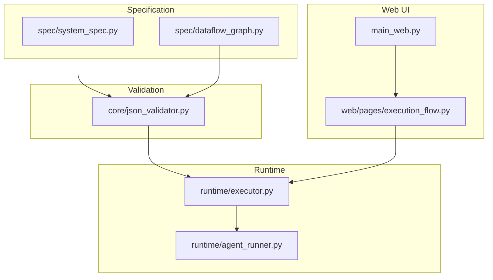
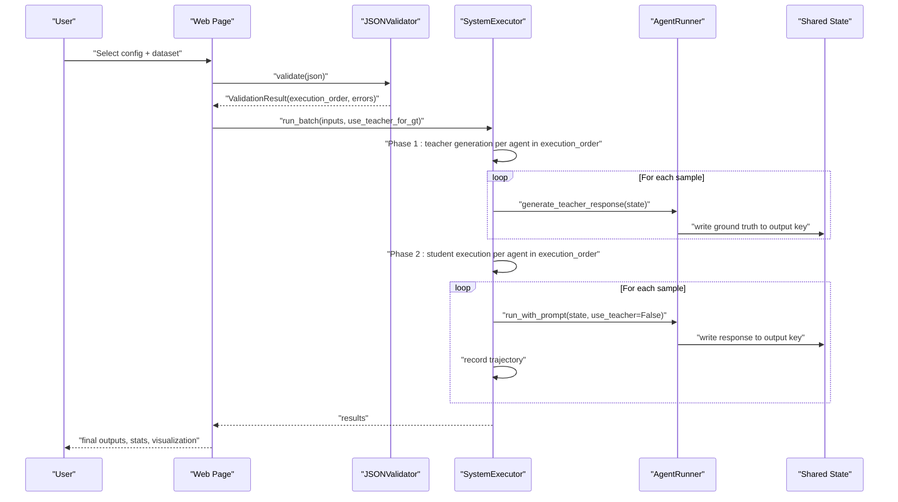
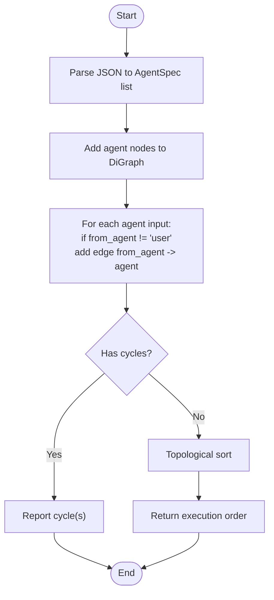
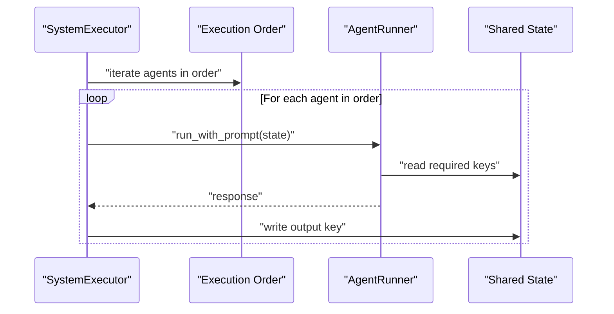
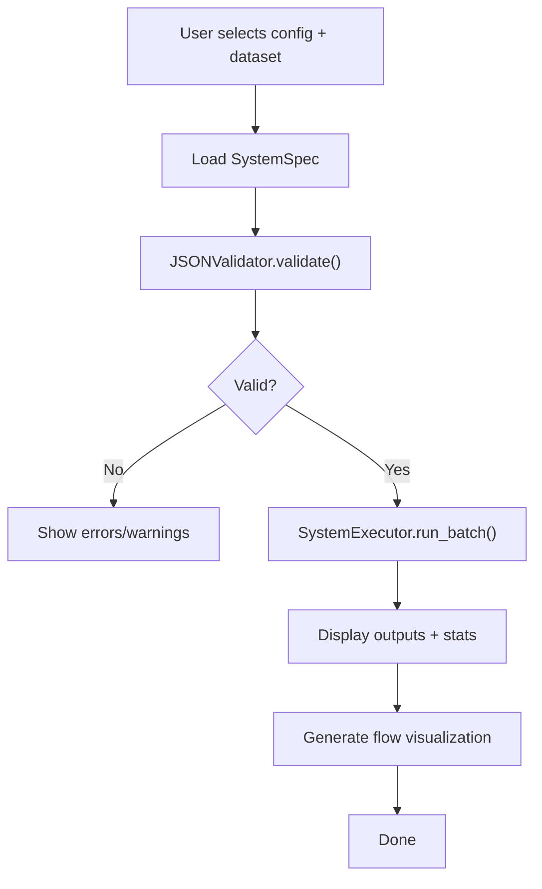

# Dataflow Graph Construction and Dependency Analysis

<cite>
**Referenced Files in This Document**
- [dataflow_graph.py](file://spec/dataflow_graph.py)
- [json_validator.py](file://core/json_validator.py)
- [system_spec.py](file://spec/system_spec.py)
- [executor.py](file://runtime/executor.py)
- [agent_runner.py](file://runtime/agent_runner.py)
- [execution_flow.py](file://web/pages/execution_flow.py)
- [main_web.py](file://main_web.py)
</cite>

## Table of Contents
1. [Introduction](#introduction)
2. [Project Structure](#project-structure)
3. [Core Components](#core-components)
4. [Architecture Overview](#architecture-overview)
5. [Detailed Component Analysis](#detailed-component-analysis)
6. [Dependency Analysis](#dependency-analysis)
7. [Performance Considerations](#performance-considerations)
8. [Troubleshooting Guide](#troubleshooting-guide)
9. [Conclusion](#conclusion)
10. [Appendices](#appendices)

## Introduction
This document explains how the system constructs a directed acyclic graph (DAG) from agent configurations to analyze dependencies among agents. It documents the algorithm for detecting circular dependencies using NetworkX, deriving an execution order via topological sorting, and validating data flow correctness. It also describes the graph representation format, node types (agents, user inputs, outputs), and edge relationships. Practical examples illustrate complex dependency scenarios, strategies for resolving dependencies, and guidance for visualizing and designing efficient agent workflows.

## Project Structure
The relevant parts of the codebase for dataflow graph construction and dependency analysis are organized as follows:
- Specification models define the configuration schema for agents and system-level configuration.
- Validation logic builds a dependency graph and checks for cycles while collecting execution order.
- Runtime execution enforces the computed order and updates shared state across agents.
- Web UI integrates validation, visualization, and execution orchestration.

**Diagram sources**
- [system_spec.py:100-114](file://spec/system_spec.py#L100-L114)
- [dataflow_graph.py:6-32](file://spec/dataflow_graph.py#L6-L32)
- [json_validator.py:37-82](file://core/json_validator.py#L37-L82)
- [executor.py:9-132](file://runtime/executor.py#L9-L132)
- [agent_runner.py:10-68](file://runtime/agent_runner.py#L10-L68)
- [execution_flow.py:9-275](file://web/pages/execution_flow.py#L9-L275)
- [main_web.py:73-158](file://main_web.py#L73-L158)

**Section sources**
- [system_spec.py:100-114](file://spec/system_spec.py#L100-L114)
- [json_validator.py:37-82](file://core/json_validator.py#L37-L82)
- [executor.py:9-132](file://runtime/executor.py#L9-L132)
- [execution_flow.py:9-275](file://web/pages/execution_flow.py#L9-L275)
- [main_web.py:73-158](file://main_web.py#L73-L158)

## Core Components
- SystemSpec and AgentSpec define the configuration schema for agents and their inputs/outputs, training, and model settings.
- JSONValidator validates configuration structure, dataflow connectivity, training modes, and constructs a dependency graph to detect cycles and compute an execution order.
- Dataflow graph builder (in spec/dataflow_graph.py) provides a simplified phase-1 algorithm for building a DAG and computing an execution order.
- SystemExecutor orchestrates two-phase execution (teacher-generated ground truths, then student execution) and updates shared state according to the execution order.
- AgentRunner executes prompts and returns responses, ensuring required keys exist in shared state.
- Web execution page wires configuration selection, dataset loading, execution, and visualization.

Key responsibilities:
- Build a directed graph from agent input/output mappings.
- Detect cycles and produce a topological order.
- Enforce execution order during runtime.
- Validate dataflow correctness and report actionable errors.

**Section sources**
- [system_spec.py:77-114](file://spec/system_spec.py#L77-L114)
- [json_validator.py:37-347](file://core/json_validator.py#L37-L347)
- [dataflow_graph.py:6-32](file://spec/dataflow_graph.py#L6-L32)
- [executor.py:9-132](file://runtime/executor.py#L9-L132)
- [agent_runner.py:10-68](file://runtime/agent_runner.py#L10-L68)
- [execution_flow.py:9-275](file://web/pages/execution_flow.py#L9-L275)

## Architecture Overview
The system transforms JSON configurations into a validated dependency graph and a deterministic execution order. Execution proceeds in two phases: teacher-generated ground truths, followed by student execution with trajectory recording.

**Diagram sources**
- [execution_flow.py:116-219](file://web/pages/execution_flow.py#L116-L219)
- [json_validator.py:37-82](file://core/json_validator.py#L37-L82)
- [executor.py:16-132](file://runtime/executor.py#L16-L132)
- [agent_runner.py:33-68](file://runtime/agent_runner.py#L33-L68)

## Detailed Component Analysis

### Dataflow Graph Construction and Topological Sorting
The system constructs a directed graph where:
- Nodes represent agents and special terminal nodes for user inputs and final outputs.
- Edges represent data dependencies: an edge from agent A to agent B exists if B’s input comes from A’s output.

Two implementations exist:
- A simplified phase-1 algorithm that builds edges based on output_key-to-agent mapping and performs topological sort.
- A robust validator that builds edges from explicit input.from_agent references and detects cycles using NetworkX.

Algorithm steps:
1. Parse configuration into AgentSpec instances.
2. Build a directed graph:
   - Add nodes for each agent.
   - For each agent input with a non-user source, add an edge from the referenced agent to the current agent.
3. Detect cycles:
   - Compute strongly connected components or enumerate simple cycles.
   - If cycles found, report them; otherwise, compute a topological order.
4. Return execution order and collect node-edge metadata for visualization.

**Diagram sources**
- [json_validator.py:242-267](file://core/json_validator.py#L242-L267)
- [dataflow_graph.py:6-32](file://spec/dataflow_graph.py#L6-L32)

**Section sources**
- [json_validator.py:242-267](file://core/json_validator.py#L242-L267)
- [dataflow_graph.py:6-32](file://spec/dataflow_graph.py#L6-L32)

### Graph Representation and Node Types
The validator constructs a normalized graph suitable for visualization:
- Node types:
  - Agent nodes: labeled by agent_id.
  - User input node: labeled “User Input”.
  - Final output node: labeled “Final Output”.
- Edge types:
  - From agent to agent: labeled with the key or transformed key mapping.
  - From user to agent: labeled with the key.
  - From agent to final output: labeled with the key.

This representation supports:
- Human-readable dependency inspection.
- Automated layout and rendering in UI components.

**Section sources**
- [json_validator.py:268-346](file://core/json_validator.py#L268-L346)

### Runtime Execution Order Enforcement
The runtime enforces the validated execution order:
- Two-phase execution:
  - Phase 1: For agents with teacher models, generate ground truths and update shared state.
  - Phase 2: Run student models, update shared state, and optionally record trajectories.
- Shared state semantics:
  - Each agent writes its output to a designated key in the shared state.
  - Subsequent agents read from the same key, enabling pipeline-style workflows.

**Diagram sources**
- [executor.py:16-132](file://runtime/executor.py#L16-L132)
- [agent_runner.py:33-68](file://runtime/agent_runner.py#L33-L68)

**Section sources**
- [executor.py:16-132](file://runtime/executor.py#L16-L132)
- [agent_runner.py:33-68](file://runtime/agent_runner.py#L33-L68)

### Web UI Integration and Visualization
The web page:
- Loads a selected system configuration and dataset.
- Validates the configuration and displays execution statistics.
- Executes the system and renders a simple flow visualization.
- Provides tabs for final outputs, execution statistics, trajectory steps, and a flow diagram.

**Diagram sources**
- [execution_flow.py:116-219](file://web/pages/execution_flow.py#L116-L219)
- [json_validator.py:37-82](file://core/json_validator.py#L37-L82)
- [executor.py:16-132](file://runtime/executor.py#L16-L132)

**Section sources**
- [execution_flow.py:9-275](file://web/pages/execution_flow.py#L9-L275)
- [main_web.py:73-158](file://main_web.py#L73-L158)

## Dependency Analysis
This section documents how the system detects and resolves dependencies, including cycle detection, topological ordering, and data flow validation.

- Dependency graph construction:
  - Edges originate from an agent’s input when the source is another agent (not user).
  - Output-to-input key mapping is used to connect producers to consumers.
- Cycle detection:
  - Uses NetworkX to enumerate simple cycles and report them to users.
- Topological sorting:
  - Produces a valid execution order if no cycles are present.
- Data flow validation:
  - Ensures each input references an existing agent or the user.
  - Warns on ambiguous output keys and reports invalid targets.

Common scenarios:
- Linear chain: A → B → C; straightforward execution order.
- Fan-in: B ← A, C ← A; A runs first, then B and C in any order compatible with topological constraints.
- Feedback loops: C ← B ← A ← C; detected as cycles and reported as invalid.
- Orphaned agents: Agents with no incoming edges but no special “start” designation; they are still scheduled after all dependencies resolve.
- Missing connections: Inputs referencing non-existent agents or keys; flagged as errors.

Resolution strategies:
- Break cycles by removing or reworking edges.
- Introduce intermediate agents to split feedback.
- Ensure every agent’s input keys are satisfied by prior agents or user input.
- Normalize output keys to avoid ambiguity.

**Section sources**
- [json_validator.py:181-217](file://core/json_validator.py#L181-L217)
- [json_validator.py:242-267](file://core/json_validator.py#L242-L267)
- [dataflow_graph.py:17-26](file://spec/dataflow_graph.py#L17-L26)

## Performance Considerations
- Graph construction cost:
  - O(A + I) to add nodes and edges, where A is the number of agents and I is total inputs.
- Cycle detection:
  - Simple cycles enumeration can be expensive; prefer topological sort for large graphs.
- Runtime execution:
  - Two-phase execution doubles the number of agent runs; consider batching and caching where appropriate.
- Memory:
  - Shared state grows with the number of samples and outputs; manage lifecycle carefully.

[No sources needed since this section provides general guidance]

## Troubleshooting Guide
Common dependency issues and resolutions:
- Circular dependencies:
  - Symptom: Validation reports a cycle.
  - Resolution: Remove one edge in the cycle or restructure workflow.
- Missing connections:
  - Symptom: Errors indicating an input references a non-existent agent or key.
  - Resolution: Fix agent_id spelling, ensure output keys match, or set source to user.
- Orphaned agents:
  - Symptom: Agent appears with no incoming edges.
  - Resolution: Connect upstream or remove if unnecessary.
- Ambiguous output keys:
  - Symptom: Warnings about duplicate output keys.
  - Resolution: Rename output keys to be unique per agent.

Operational tips:
- Validate configurations before execution to catch issues early.
- Use the execution order from validation to guide configuration design.
- Visualize the dependency graph to confirm expected relationships.

**Section sources**
- [json_validator.py:181-217](file://core/json_validator.py#L181-L217)
- [json_validator.py:242-267](file://core/json_validator.py#L242-L267)

## Conclusion
The system provides a robust framework for constructing dataflow graphs from agent configurations, validating dependencies, and enforcing a safe execution order. By leveraging NetworkX for cycle detection and topological sorting, and by maintaining a clear separation between validation and runtime execution, it enables reliable multi-agent workflows. Proper configuration design—avoiding cycles, ensuring connectivity, and normalizing keys—leads to efficient and maintainable agent pipelines.

[No sources needed since this section summarizes without analyzing specific files]

## Appendices

### Configuration Schema Highlights
- AgentSpec defines agent_id, model/provider, instruction prompt, input/output mappings, optional training and teacher model settings.
- IOMapping and OutputMapping define how agents consume inputs and distribute outputs.
- SystemSpec aggregates a list of agents.

These models underpin both validation and runtime execution.

**Section sources**
- [system_spec.py:77-114](file://spec/system_spec.py#L77-L114)