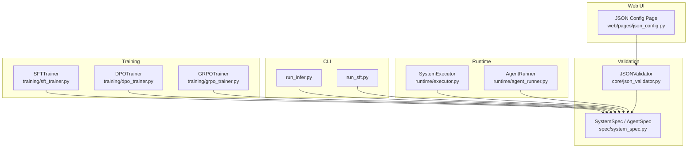
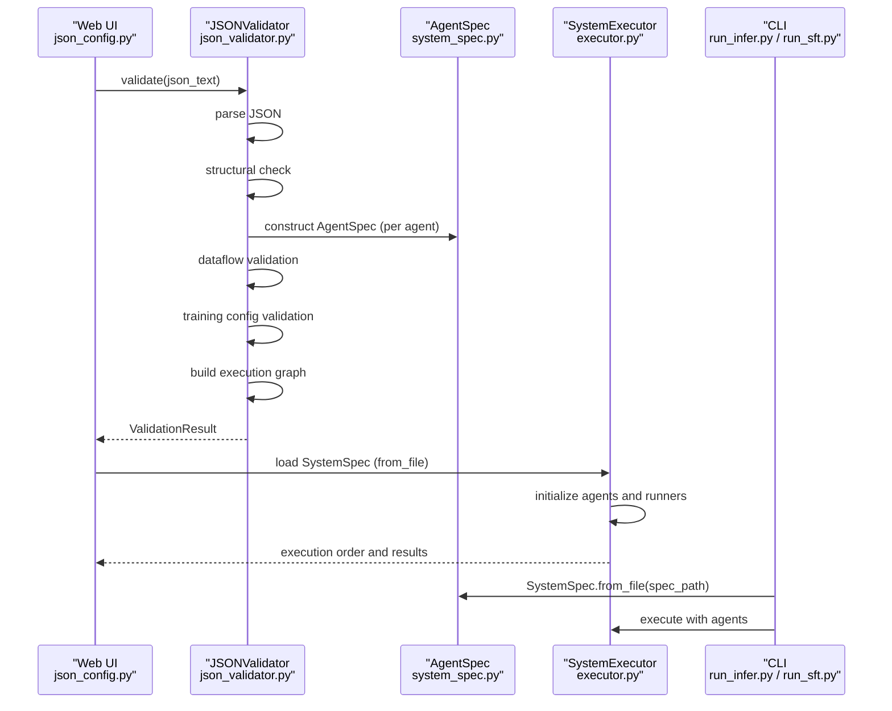
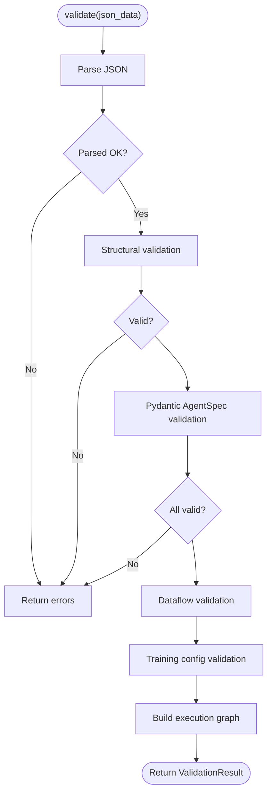
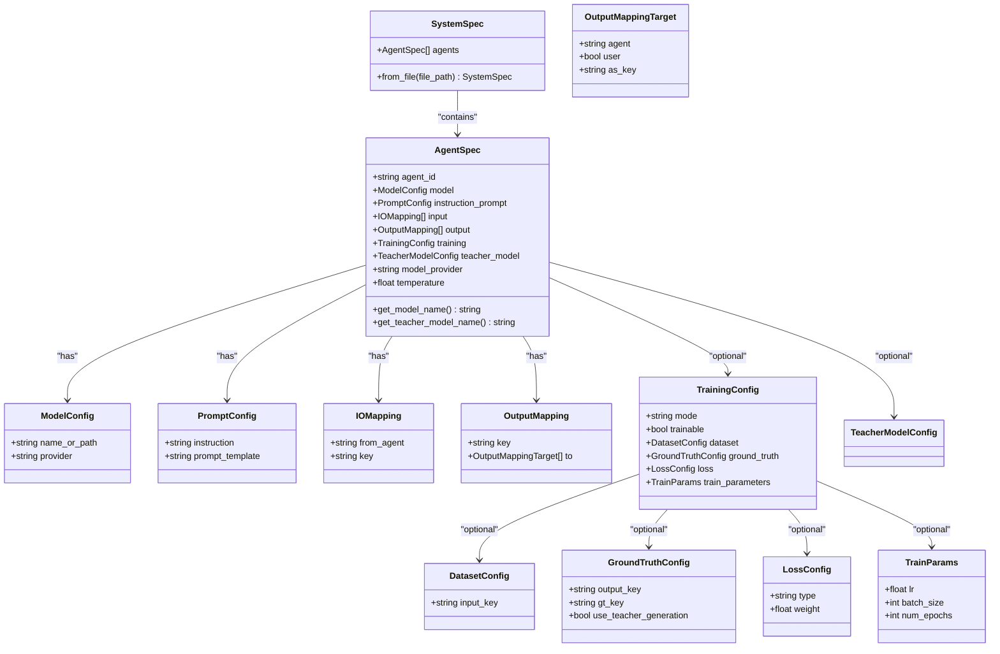
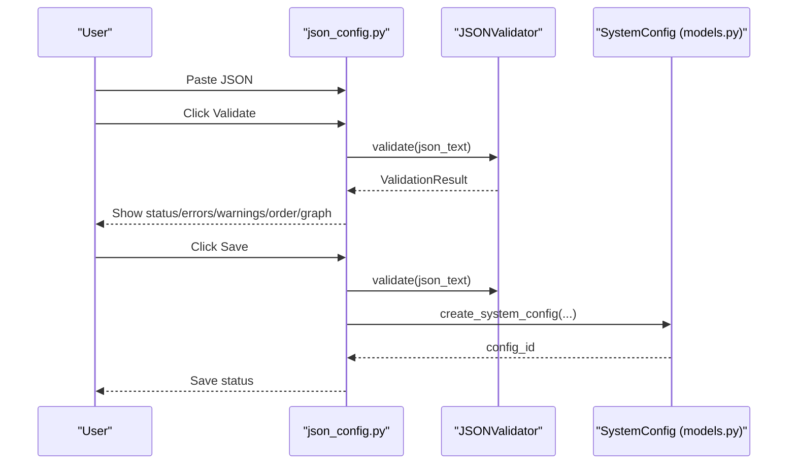
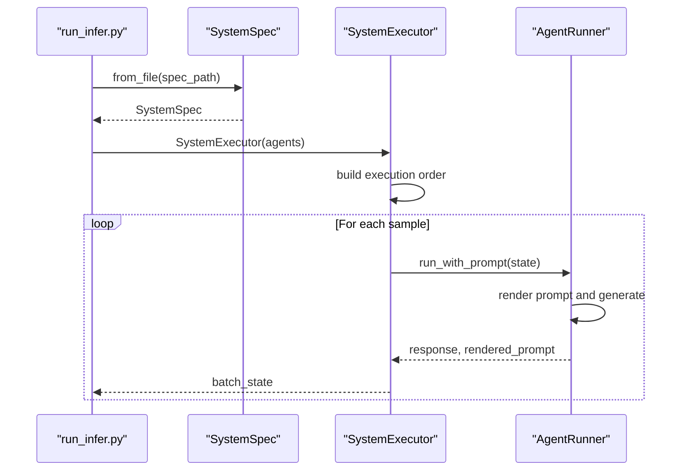
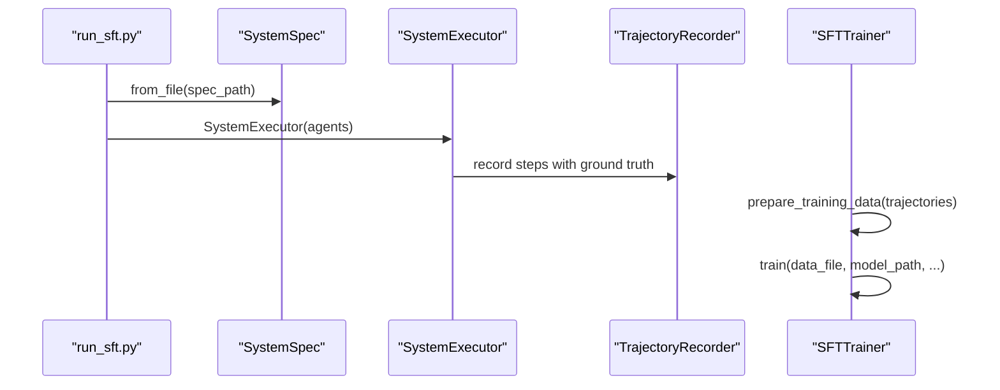
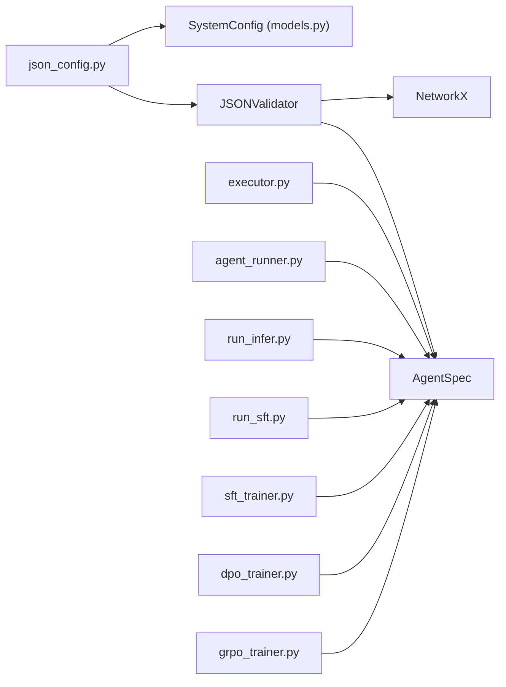
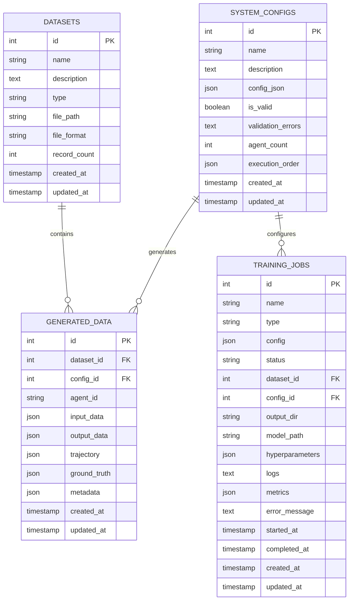

# JSON Schema and Validation Rules

<cite>
**Referenced Files in This Document**
- [json_validator.py](file://core/json_validator.py)
- [system_spec.py](file://spec/system_spec.py)
- [json_config.py](file://web/pages/json_config.py)
- [executor.py](file://runtime/executor.py)
- [agent_runner.py](file://runtime/agent_runner.py)
- [models.py](file://database/models.py)
- [run_infer.py](file://cli/run_infer.py)
- [run_sft.py](file://cli/run_sft.py)
- [sft_trainer.py](file://training/sft_trainer.py)
- [dpo_trainer.py](file://training/dpo_trainer.py)
- [grpo_trainer.py](file://training/grpo_trainer.py)
</cite>

## Table of Contents
1. [Introduction](#introduction)
2. [Project Structure](#project-structure)
3. [Core Components](#core-components)
4. [Architecture Overview](#architecture-overview)
5. [Detailed Component Analysis](#detailed-component-analysis)
6. [Dependency Analysis](#dependency-analysis)
7. [Performance Considerations](#performance-considerations)
8. [Troubleshooting Guide](#troubleshooting-guide)
9. [Conclusion](#conclusion)
10. [Appendices](#appendices)

## Introduction
This document defines the JSON schema and validation rules for configuring multi-agent systems. It explains the complete configuration structure, mandatory and optional fields, Pydantic-based validation, and the six-phase validation pipeline: JSON parsing, structural validation, agent-level validation, dataflow validation, training configuration validation, and execution graph analysis. It also provides examples of valid and invalid configurations, common error messages, and troubleshooting guidance.

## Project Structure
The validation and configuration pipeline spans several modules:
- Core validation: JSON parsing, structural checks, agent-level Pydantic validation, dataflow and training checks, execution graph analysis
- Specification models: Pydantic models that define the canonical schema for agents, prompts, models, IO mappings, and training
- Web UI: Interactive editor and validator for JSON configurations
- Runtime: Executes the system using validated configurations
- CLI: Loads validated configurations for inference and training
- Training: Converts trajectories into training datasets and launches training jobs

**Diagram sources**
- [json_validator.py:37-82](file://core/json_validator.py#L37-L82)
- [system_spec.py:77-114](file://spec/system_spec.py#L77-L114)
- [json_config.py:8-377](file://web/pages/json_config.py#L8-L377)
- [executor.py:9-132](file://runtime/executor.py#L9-L132)
- [agent_runner.py:10-68](file://runtime/agent_runner.py#L10-L68)
- [run_infer.py:8-46](file://cli/run_infer.py#L8-L46)
- [run_sft.py:17-117](file://cli/run_sft.py#L17-L117)
- [sft_trainer.py:9-263](file://training/sft_trainer.py#L9-L263)
- [dpo_trainer.py:8-320](file://training/dpo_trainer.py#L8-L320)
- [grpo_trainer.py:8-385](file://training/grpo_trainer.py#L8-L385)

**Section sources**
- [json_validator.py:37-82](file://core/json_validator.py#L37-L82)
- [system_spec.py:77-114](file://spec/system_spec.py#L77-L114)
- [json_config.py:8-377](file://web/pages/json_config.py#L8-L377)

## Core Components
This section defines the JSON schema and validation rules for the multi-agent configuration.

### JSON Configuration Structure
The root is a JSON array of Agent objects. Each Agent requires:
- agent_id: string, unique identifier
- model: object with name_or_path and provider
- instruction_prompt: object with instruction and prompt_template
- input: array of I/O mappings
- output: array of output mappings

Optional fields:
- training: training configuration (mode, dataset, ground_truth, loss, train_parameters)
- teacher_model: teacher model configuration (name_or_path, provider)
- model_provider: string (legacy compatibility)
- temperature: number (default 0.7)

Data types and constraints:
- agent_id must be unique across agents
- model.name_or_path is required
- model.provider defaults to a supported provider if omitted
- instruction_prompt.instruction and instruction_prompt.prompt_template are required
- input.from must reference either "user" or another agent_id
- input.key must be resolvable in runtime state
- output.key must be unique per agent; output.to targets must reference existing agent_ids or user
- training.mode must be one of "sft", "dpo", "grpo"
- SFT requires ground_truth.output_key and ground_truth.gt_key
- temperature must be numeric

**Section sources**
- [json_validator.py:124-157](file://core/json_validator.py#L124-L157)
- [system_spec.py:77-96](file://spec/system_spec.py#L77-L96)

### Pydantic-Based Validation (AgentSpec)
AgentSpec and nested models enforce:
- Required fields and aliases (e.g., "from" -> from_agent)
- Type constraints (strings, numbers, booleans)
- Enum-like constraints (training.mode)
- Nested object validation (ModelConfig, PromptConfig, IOMapping, OutputMapping, TrainingConfig)

Validation occurs during construction of AgentSpec instances. Errors propagate as validation failures.

**Section sources**
- [system_spec.py:77-96](file://spec/system_spec.py#L77-L96)
- [system_spec.py:62-84](file://spec/system_spec.py#L62-L84)

### Validation Phases
1) JSON parsing: Accepts JSON string or parsed object; ensures root is an array
2) Structural validation: Checks presence of mandatory fields and uniqueness of agent_id
3) Agent-level validation: Constructs AgentSpec for each agent; records agent inputs/outputs
4) Dataflow validation: Ensures input references exist; detects duplicate output keys; validates output targets
5) Training configuration validation: Validates training.mode and SFT-specific requirements
6) Execution graph analysis: Builds directed graph from input dependencies; detects cycles; computes topological order

**Section sources**
- [json_validator.py:43-82](file://core/json_validator.py#L43-L82)
- [json_validator.py:99-123](file://core/json_validator.py#L99-L123)
- [json_validator.py:124-157](file://core/json_validator.py#L124-L157)
- [json_validator.py:159-179](file://core/json_validator.py#L159-L179)
- [json_validator.py:181-217](file://core/json_validator.py#L181-L217)
- [json_validator.py:218-241](file://core/json_validator.py#L218-L241)
- [json_validator.py:242-266](file://core/json_validator.py#L242-L266)

## Architecture Overview
The validation pipeline integrates with the web UI, runtime, CLI, and training subsystems.

**Diagram sources**
- [json_config.py:181-205](file://web/pages/json_config.py#L181-L205)
- [json_validator.py:43-82](file://core/json_validator.py#L43-L82)
- [system_spec.py:100-108](file://spec/system_spec.py#L100-L108)
- [executor.py:9-132](file://runtime/executor.py#L9-L132)
- [run_infer.py:15-16](file://cli/run_infer.py#L15-L16)
- [run_sft.py:37-38](file://cli/run_sft.py#L37-L38)

## Detailed Component Analysis

### JSONValidator
Responsibilities:
- Parse JSON (string or object)
- Structural checks (root array, mandatory fields, unique agent_id)
- Pydantic validation per AgentSpec
- Dataflow validation (inputs, outputs, targets)
- Training configuration validation (modes, SFT requirements)
- Execution graph analysis (cycles, topo sort)

Key behaviors:
- Aggregates errors and warnings
- Records agent inputs/outputs for diagnostics
- Produces execution order for runtime

**Diagram sources**
- [json_validator.py:43-82](file://core/json_validator.py#L43-L82)
- [json_validator.py:99-123](file://core/json_validator.py#L99-L123)
- [json_validator.py:124-157](file://core/json_validator.py#L124-L157)
- [json_validator.py:159-179](file://core/json_validator.py#L159-L179)
- [json_validator.py:181-217](file://core/json_validator.py#L181-L217)
- [json_validator.py:218-241](file://core/json_validator.py#L218-L241)
- [json_validator.py:242-266](file://core/json_validator.py#L242-L266)

**Section sources**
- [json_validator.py:37-82](file://core/json_validator.py#L37-L82)
- [json_validator.py:99-123](file://core/json_validator.py#L99-L123)
- [json_validator.py:124-157](file://core/json_validator.py#L124-L157)
- [json_validator.py:159-179](file://core/json_validator.py#L159-L179)
- [json_validator.py:181-217](file://core/json_validator.py#L181-L217)
- [json_validator.py:218-241](file://core/json_validator.py#L218-L241)
- [json_validator.py:242-266](file://core/json_validator.py#L242-L266)

### SystemSpec and AgentSpec
Defines the canonical schema and validation rules enforced by Pydantic.

**Diagram sources**
- [system_spec.py:77-114](file://spec/system_spec.py#L77-L114)

**Section sources**
- [system_spec.py:77-114](file://spec/system_spec.py#L77-L114)

### Web UI Integration (JSON Config Page)
The web page provides:
- JSON editor with a valid example
- Validation button invoking JSONValidator
- Results display: status, errors, warnings, execution order
- Dataflow graph visualization generator
- Save/load/delete/view configuration entries stored in the database

**Diagram sources**
- [json_config.py:181-242](file://web/pages/json_config.py#L181-L242)
- [json_validator.py:43-82](file://core/json_validator.py#L43-L82)
- [models.py:54-74](file://database/models.py#L54-L74)

**Section sources**
- [json_config.py:8-377](file://web/pages/json_config.py#L8-L377)
- [models.py:54-74](file://database/models.py#L54-L74)

### Runtime Execution and Validation Alignment
Runtime loads SystemSpec from file and executes agents in the computed order. AgentRunner enforces that all input keys referenced in IOMapping are present in the current state, raising clear errors otherwise.

**Diagram sources**
- [run_infer.py:15-16](file://cli/run_infer.py#L15-L16)
- [executor.py:9-132](file://runtime/executor.py#L9-L132)
- [agent_runner.py:33-60](file://runtime/agent_runner.py#L33-L60)

**Section sources**
- [run_infer.py:8-46](file://cli/run_infer.py#L8-L46)
- [executor.py:9-132](file://runtime/executor.py#L9-L132)
- [agent_runner.py:33-60](file://runtime/agent_runner.py#L33-L60)

### Training Pipeline and Validation
Training modules convert trajectories into datasets and launch training jobs. They rely on validated configurations to ensure correct model paths, dataset formats, and reward specifications.

**Diagram sources**
- [run_sft.py:37-107](file://cli/run_sft.py#L37-L107)
- [executor.py:16-132](file://runtime/executor.py#L16-L132)
- [sft_trainer.py:16-140](file://training/sft_trainer.py#L16-L140)

**Section sources**
- [run_sft.py:17-117](file://cli/run_sft.py#L17-L117)
- [sft_trainer.py:9-263](file://training/sft_trainer.py#L9-L263)

## Dependency Analysis
- JSONValidator depends on Pydantic models (AgentSpec, nested models) and NetworkX for graph analysis
- Web UI depends on JSONValidator and database models for persistence
- Runtime depends on SystemSpec and AgentRunner for execution
- CLI depends on SystemSpec and runtime for inference/training
- Training modules depend on SystemSpec and runtime-generated trajectories

**Diagram sources**
- [json_validator.py:37-82](file://core/json_validator.py#L37-L82)
- [system_spec.py:77-114](file://spec/system_spec.py#L77-L114)
- [json_config.py:8-377](file://web/pages/json_config.py#L8-L377)
- [models.py:54-74](file://database/models.py#L54-L74)
- [executor.py:9-132](file://runtime/executor.py#L9-L132)
- [agent_runner.py:10-68](file://runtime/agent_runner.py#L10-L68)
- [run_infer.py:8-46](file://cli/run_infer.py#L8-L46)
- [run_sft.py:17-117](file://cli/run_sft.py#L17-L117)
- [sft_trainer.py:9-263](file://training/sft_trainer.py#L9-L263)
- [dpo_trainer.py:8-320](file://training/dpo_trainer.py#L8-L320)
- [grpo_trainer.py:8-385](file://training/grpo_trainer.py#L8-L385)

**Section sources**
- [json_validator.py:37-82](file://core/json_validator.py#L37-L82)
- [system_spec.py:77-114](file://spec/system_spec.py#L77-L114)
- [json_config.py:8-377](file://web/pages/json_config.py#L8-L377)
- [models.py:54-74](file://database/models.py#L54-L74)
- [executor.py:9-132](file://runtime/executor.py#L9-L132)
- [agent_runner.py:10-68](file://runtime/agent_runner.py#L10-L68)
- [run_infer.py:8-46](file://cli/run_infer.py#L8-L46)
- [run_sft.py:17-117](file://cli/run_sft.py#L17-L117)
- [sft_trainer.py:9-263](file://training/sft_trainer.py#L9-L263)
- [dpo_trainer.py:8-320](file://training/dpo_trainer.py#L8-L320)
- [grpo_trainer.py:8-385](file://training/grpo_trainer.py#L8-L385)

## Performance Considerations
- Validation complexity is linear in the number of agents and I/O mappings
- Graph analysis uses NetworkX topological sort; cycles are detected via simple cycles enumeration
- Pydantic validation is efficient but can be slowed by deeply nested structures or large prompt templates
- Recommendations:
  - Keep prompt_template concise
  - Limit the number of output mappings per agent
  - Avoid deep nesting in training configuration objects
  - Use unique agent_id values to speed up graph building

## Troubleshooting Guide
Common validation errors and their meanings:
- Root element must be an array: The JSON must be a list of agents
- Agent list cannot be empty: Provide at least one agent
- Missing field in agent: agent_id, model, instruction_prompt, input, output are required
- Duplicate agent_id: Ensure each agent_id is unique
- Agent validation failed: One or more nested fields failed Pydantic validation
- Input references non-existent agent: An input.from references an agent not present in the configuration
- Output key defined by multiple agents: Avoid duplicate output keys across agents
- Output target points to non-existent agent: An output.to.agent does not match any agent_id
- Invalid training mode: training.mode must be "sft", "dpo", or "grpo"
- SFT requires ground_truth: When mode is "sft", ground_truth.output_key and ground_truth.gt_key must be provided
- Cycle detected in execution graph: There is a circular dependency among agents
- Execution graph analysis failed: Unexpected error while computing the graph

Common runtime errors:
- Missing key in state for agent: An input.key referenced by an agent is not present in the current state
- Teacher model not configured: Attempting to generate ground truth without a teacher model configured

Best practices:
- Start with a minimal working configuration and add complexity gradually
- Validate early and often using the web UI
- Use unique, descriptive agent_id values
- Keep input/output keys explicit and consistent
- For SFT, ensure ground_truth mapping aligns with the agent’s output key
- Verify that all agents referenced in input/from exist
- Confirm training mode matches your intended workflow

**Section sources**
- [json_validator.py:99-123](file://core/json_validator.py#L99-L123)
- [json_validator.py:124-157](file://core/json_validator.py#L124-L157)
- [json_validator.py:159-179](file://core/json_validator.py#L159-L179)
- [json_validator.py:181-217](file://core/json_validator.py#L181-L217)
- [json_validator.py:218-241](file://core/json_validator.py#L218-L241)
- [json_validator.py:242-266](file://core/json_validator.py#L242-L266)
- [agent_runner.py:33-60](file://runtime/agent_runner.py#L33-L60)

## Conclusion
The JSON schema and validation pipeline provide a robust foundation for multi-agent system configuration. By enforcing strict structural and semantic rules, leveraging Pydantic for type safety, and validating dataflow and training configurations, the system ensures reliable execution and training. Use the web UI for iterative development, validate frequently, and follow the troubleshooting guidance to resolve issues quickly.

## Appendices

### Example: Valid Configuration
- Root is a JSON array containing at least one Agent
- Each Agent includes agent_id, model, instruction_prompt, input, output
- Optional training and teacher_model blocks conform to schema
- No duplicate agent_id
- No missing required fields
- No cycles in execution graph

### Example: Invalid Configuration
- Root is an object instead of an array
- Missing agent_id or model or instruction_prompt or input or output
- Duplicate agent_id
- input.from references a non-existent agent
- output.to.agent references a non-existent agent
- training.mode is not "sft", "dpo", or "grpo"
- training.mode is "sft" but ground_truth is missing
- Execution graph contains cycles

### Data Model for Stored Configurations

**Diagram sources**
- [models.py:54-123](file://database/models.py#L54-L123)