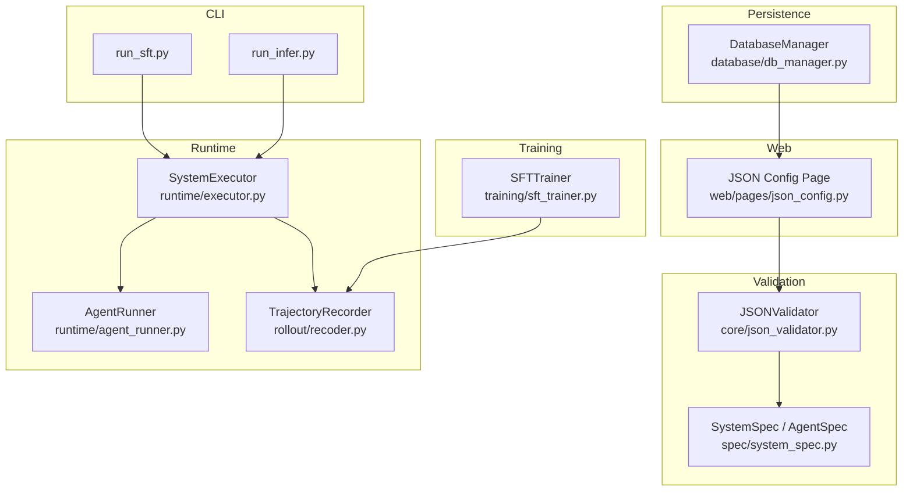
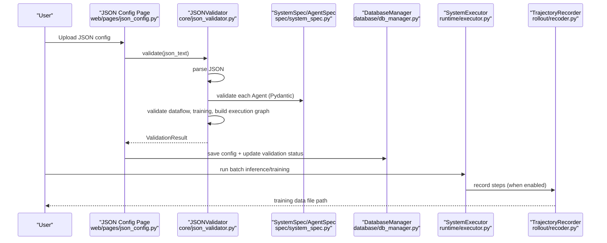
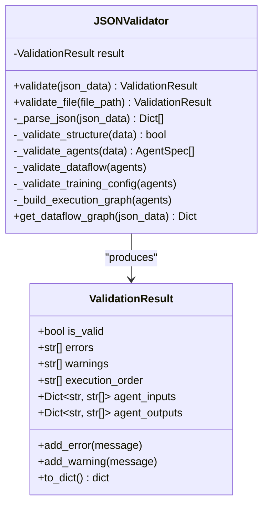
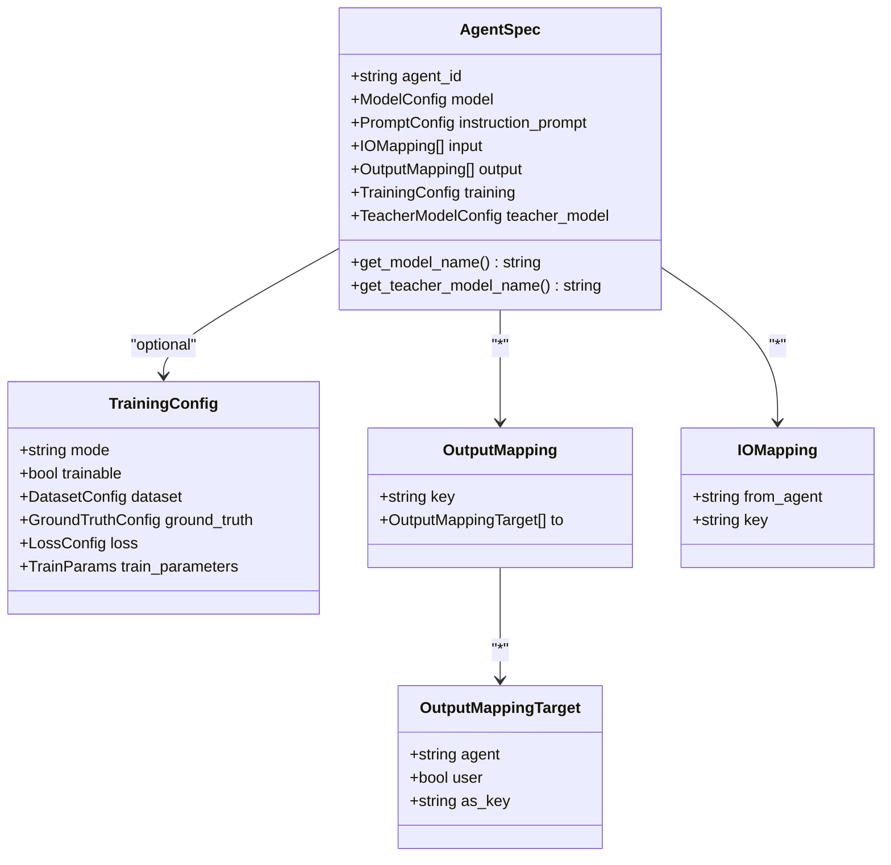
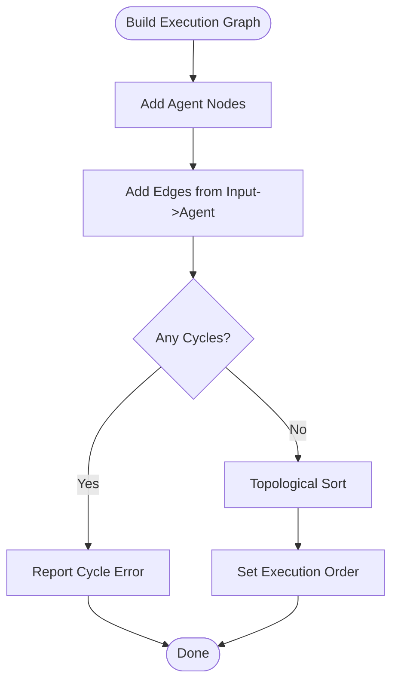
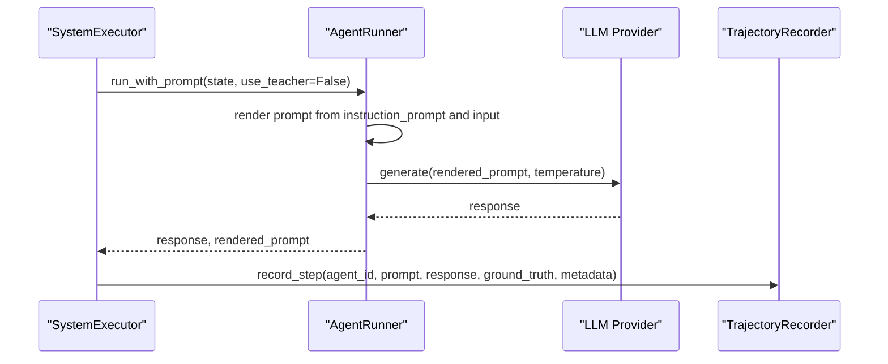
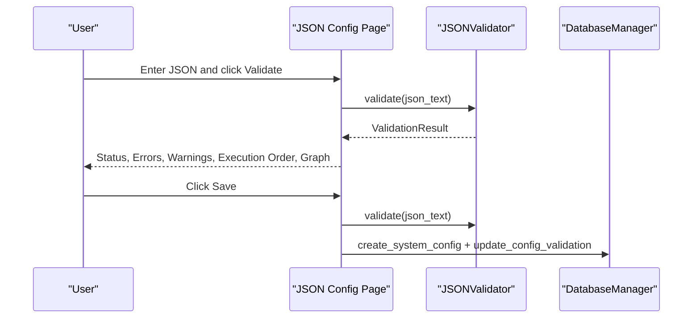
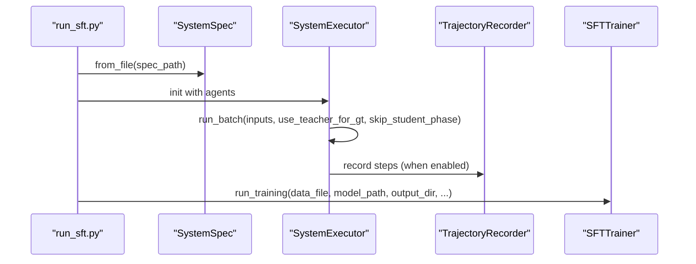
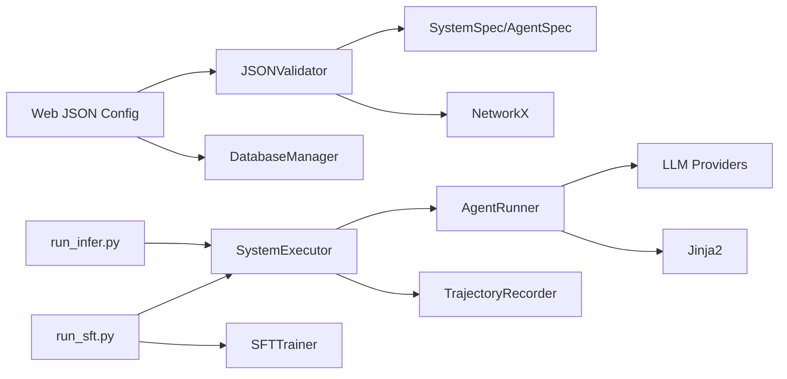

# Troubleshooting and Error Resolution

<cite>
**Referenced Files in This Document**
- [json_validator.py](file://core/json_validator.py)
- [system_spec.py](file://spec/system_spec.py)
- [dataflow_graph.py](file://spec/dataflow_graph.py)
- [agent_runner.py](file://runtime/agent_runner.py)
- [executor.py](file://runtime/executor.py)
- [json_config.py](file://web/pages/json_config.py)
- [db_manager.py](file://database/db_manager.py)
- [run_infer.py](file://cli/run_infer.py)
- [run_sft.py](file://cli/run_sft.py)
- [sft_trainer.py](file://training/sft_trainer.py)
- [recoder.py](file://rollout/recoder.py)
- [api_config.yaml](file://configs/api_config.yaml)
</cite>

## Table of Contents
1. [Introduction](#introduction)
2. [Project Structure](#project-structure)
3. [Core Components](#core-components)
4. [Architecture Overview](#architecture-overview)
5. [Detailed Component Analysis](#detailed-component-analysis)
6. [Dependency Analysis](#dependency-analysis)
7. [Performance Considerations](#performance-considerations)
8. [Troubleshooting Guide](#troubleshooting-guide)
9. [Conclusion](#conclusion)
10. [Appendices](#appendices)

## Introduction
This document provides a comprehensive troubleshooting guide for configuration validation errors in a multi-agent system. It covers common error categories (JSON parsing errors, structural validation failures, agent validation errors, dataflow inconsistencies, and dependency issues), systematic debugging approaches, error message interpretation, step-by-step resolution procedures, and performance considerations for large configurations. It also includes diagnostic tools and techniques for validating complex multi-agent workflows, with emphasis on incremental validation and configuration testing.

## Project Structure
The configuration validation pipeline spans several modules:
- Validation: core JSON validator and Pydantic-based agent specification
- Runtime: agent execution and trajectory recording
- Web: GUI for uploading, validating, and visualizing configurations
- CLI: command-line tools for inference and distillation-based SFT
- Training: SFT trainer integrating with external training framework
- Database: persistence of validated configurations and execution metadata

**Diagram sources**
- [json_validator.py:37-82](file://core/json_validator.py#L37-L82)
- [system_spec.py:77-101](file://spec/system_spec.py#L77-L101)
- [agent_runner.py:10-61](file://runtime/agent_runner.py#L10-L61)
- [executor.py:9-132](file://runtime/executor.py#L9-L132)
- [json_config.py:8-377](file://web/pages/json_config.py#L8-L377)
- [db_manager.py:11-347](file://database/db_manager.py#L11-L347)
- [run_infer.py:8-46](file://cli/run_infer.py#L8-L46)
- [run_sft.py:17-117](file://cli/run_sft.py#L17-L117)
- [sft_trainer.py:9-263](file://training/sft_trainer.py#L9-L263)
- [recoder.py:8-122](file://rollout/recoder.py#L8-L122)

**Section sources**
- [json_validator.py:37-82](file://core/json_validator.py#L37-L82)
- [system_spec.py:77-101](file://spec/system_spec.py#L77-L101)
- [json_config.py:8-377](file://web/pages/json_config.py#L8-L377)
- [db_manager.py:11-347](file://database/db_manager.py#L11-L347)
- [executor.py:9-132](file://runtime/executor.py#L9-L132)
- [agent_runner.py:10-61](file://runtime/agent_runner.py#L10-L61)
- [run_infer.py:8-46](file://cli/run_infer.py#L8-L46)
- [run_sft.py:17-117](file://cli/run_sft.py#L17-L117)
- [sft_trainer.py:9-263](file://training/sft_trainer.py#L9-L263)
- [recoder.py:8-122](file://rollout/recoder.py#L8-L122)

## Core Components
- JSONValidator: Parses JSON, validates structure, validates each Agent via Pydantic, checks dataflow connections, validates training configuration, builds execution graph, detects cycles, and computes execution order.
- SystemSpec and AgentSpec: Define the schema for configuration validation using Pydantic models.
- Web JSON Config Page: Provides UI for uploading, validating, saving, and visualizing configurations.
- Database Manager: Stores validated configurations and execution metadata.
- Runtime Executor and Agent Runner: Execute agents, render prompts, and record trajectories.
- CLI Tools: Provide batch inference and distillation-based SFT workflows.
- SFT Trainer: Converts trajectories to training-ready datasets and prepares training commands.

Key responsibilities:
- Validation: JSON parsing, structural checks, agent schema validation, dataflow consistency, training config checks, cycle detection, execution order computation.
- Runtime: Prompt rendering, model selection, state propagation, trajectory recording.
- Persistence: Storing validation results and execution metadata.
- Training: Preparing datasets and launching training.

**Section sources**
- [json_validator.py:37-347](file://core/json_validator.py#L37-L347)
- [system_spec.py:77-114](file://spec/system_spec.py#L77-L114)
- [json_config.py:8-377](file://web/pages/json_config.py#L8-L377)
- [db_manager.py:90-156](file://database/db_manager.py#L90-L156)
- [executor.py:9-132](file://runtime/executor.py#L9-L132)
- [agent_runner.py:10-61](file://runtime/agent_runner.py#L10-L61)
- [run_infer.py:8-46](file://cli/run_infer.py#L8-L46)
- [run_sft.py:17-117](file://cli/run_sft.py#L17-L117)
- [sft_trainer.py:9-263](file://training/sft_trainer.py#L9-L263)
- [recoder.py:8-122](file://rollout/recoder.py#L8-L122)

## Architecture Overview
The validation and execution flow integrates web, CLI, runtime, and training components.

**Diagram sources**
- [json_config.py:181-242](file://web/pages/json_config.py#L181-L242)
- [json_validator.py:43-82](file://core/json_validator.py#L43-L82)
- [system_spec.py:77-114](file://spec/system_spec.py#L77-L114)
- [db_manager.py:92-123](file://database/db_manager.py#L92-L123)
- [executor.py:16-132](file://runtime/executor.py#L16-L132)
- [recoder.py:15-42](file://rollout/recoder.py#L15-L42)

## Detailed Component Analysis

### JSON Validator and Validation Results
The validator performs:
- JSON parsing with robust error reporting
- Structural checks for required fields and uniqueness
- Pydantic-based agent validation
- Dataflow validation (input/output mapping, cross-agent references)
- Training configuration validation (mode and required fields)
- Execution graph construction and cycle detection
- Execution order computation via topological sort

**Diagram sources**
- [json_validator.py:9-34](file://core/json_validator.py#L9-L34)
- [json_validator.py:37-347](file://core/json_validator.py#L37-L347)

**Section sources**
- [json_validator.py:37-347](file://core/json_validator.py#L37-L347)

### System Specification Models
Pydantic models define the schema for configuration validation:
- AgentSpec: agent_id, model, instruction_prompt, input/output mappings, optional training and teacher_model
- TrainingConfig: mode, dataset, ground_truth, loss, train_parameters
- OutputMapping and OutputMappingTarget: define output destinations (agent or user)
- IOMapping: defines input source (user or another agent) and key

**Diagram sources**
- [system_spec.py:77-114](file://spec/system_spec.py#L77-L114)

**Section sources**
- [system_spec.py:7-114](file://spec/system_spec.py#L7-L114)

### Dataflow Graph Construction and Cycle Detection
The validator constructs a directed graph from input/output mappings and detects cycles via NetworkX. It also computes an execution order using topological sorting.

**Diagram sources**
- [json_validator.py:242-267](file://core/json_validator.py#L242-L267)

**Section sources**
- [json_validator.py:242-267](file://core/json_validator.py#L242-L267)

### Runtime Execution and Prompt Rendering
AgentRunner renders prompts and selects models (student or teacher). SystemExecutor orchestrates two-phase execution (Phase 1: teacher-generated ground truth; Phase 2: student execution with trajectory recording).

**Diagram sources**
- [agent_runner.py:33-60](file://runtime/agent_runner.py#L33-L60)
- [executor.py:16-132](file://runtime/executor.py#L16-L132)
- [recoder.py:15-42](file://rollout/recoder.py#L15-L42)

**Section sources**
- [agent_runner.py:10-61](file://runtime/agent_runner.py#L10-L61)
- [executor.py:16-132](file://runtime/executor.py#L16-L132)
- [recoder.py:8-122](file://rollout/recoder.py#L8-L122)

### Web UI Validation and Visualization
The web page provides:
- JSON editor and validator button
- Real-time validation status, errors, warnings, and execution order
- Dataflow graph visualization and Mermaid code generation
- Save to database with validation status persisted

**Diagram sources**
- [json_config.py:181-242](file://web/pages/json_config.py#L181-L242)
- [json_validator.py:43-82](file://core/json_validator.py#L43-L82)
- [db_manager.py:92-123](file://database/db_manager.py#L92-L123)

**Section sources**
- [json_config.py:8-377](file://web/pages/json_config.py#L8-L377)
- [db_manager.py:90-156](file://database/db_manager.py#L90-L156)

### CLI Inference and Distillation-Based SFT
CLI tools support:
- Batch inference with multi-agent system
- Distillation-based SFT pipeline with teacher/student phases and trajectory recording

**Diagram sources**
- [run_sft.py:36-117](file://cli/run_sft.py#L36-L117)
- [executor.py:16-132](file://runtime/executor.py#L16-L132)
- [recoder.py:44-96](file://rollout/recoder.py#L44-L96)
- [sft_trainer.py:59-140](file://training/sft_trainer.py#L59-L140)

**Section sources**
- [run_infer.py:8-46](file://cli/run_infer.py#L8-L46)
- [run_sft.py:17-117](file://cli/run_sft.py#L17-L117)
- [executor.py:16-132](file://runtime/executor.py#L16-L132)
- [recoder.py:44-96](file://rollout/recoder.py#L44-L96)
- [sft_trainer.py:59-140](file://training/sft_trainer.py#L59-L140)

## Dependency Analysis
- Validation depends on Pydantic models and NetworkX for cycle detection.
- Runtime depends on LLM providers and Jinja2 templates for prompt rendering.
- Web UI depends on the validator and database manager.
- CLI tools depend on SystemSpec and SystemExecutor.
- Training depends on trajectory recorder and external training framework.

**Diagram sources**
- [json_validator.py:3-6](file://core/json_validator.py#L3-L6)
- [system_spec.py:2-4](file://spec/system_spec.py#L2-L4)
- [agent_runner.py:2-6](file://runtime/agent_runner.py#L2-L6)
- [executor.py:2-6](file://runtime/executor.py#L2-L6)
- [json_config.py:2-5](file://web/pages/json_config.py#L2-L5)
- [db_manager.py:6-8](file://database/db_manager.py#L6-L8)
- [run_sft.py:12-14](file://cli/run_sft.py#L12-L14)
- [sft_trainer.py:4-5](file://training/sft_trainer.py#L4-L5)

**Section sources**
- [json_validator.py:3-6](file://core/json_validator.py#L3-L6)
- [system_spec.py:2-4](file://spec/system_spec.py#L2-L4)
- [agent_runner.py:2-6](file://runtime/agent_runner.py#L2-L6)
- [executor.py:2-6](file://runtime/executor.py#L2-L6)
- [json_config.py:2-5](file://web/pages/json_config.py#L2-L5)
- [db_manager.py:6-8](file://database/db_manager.py#L6-L8)
- [run_sft.py:12-14](file://cli/run_sft.py#L12-L14)
- [sft_trainer.py:4-5](file://training/sft_trainer.py#L4-L5)

## Performance Considerations
- Large configurations: Prefer incremental validation by splitting the agent list and validating subsets to reduce memory and CPU usage during parsing and graph construction.
- Dataflow graph complexity: For very large graphs, consider pre-filtering agents and validating only connected components relevant to the current workflow.
- Execution order computation: Topological sorting is efficient but still sensitive to graph size; cache results when re-validating similar configurations.
- CLI batch runs: Stream input files and process in chunks to avoid loading entire datasets into memory.
- Training data conversion: Convert trajectories incrementally and write to disk in batches to manage I/O overhead.

[No sources needed since this section provides general guidance]

## Troubleshooting Guide

### Common Validation Error Categories and Resolution Strategies

- JSON Parsing Errors
  - Symptoms: Immediate failure with parsing error messages; validation stops early.
  - Root causes: Malformed JSON, encoding issues, unexpected data types.
  - Interpretation: Look for messages indicating JSON decode errors or invalid root element type.
  - Resolution:
    - Validate JSON syntax using an external linter or IDE.
    - Ensure the root element is an array of agent objects.
    - Confirm UTF-8 encoding and remove hidden characters.
    - Use the web UI’s validator to isolate problematic sections.
  - Diagnostic tools:
    - Web UI “Upload and Validate” tab for immediate feedback.
    - CLI JSON linters or online validators.
  - Corrective actions:
    - Fix syntax errors, adjust encoding, and re-upload.
    - Split large JSON into smaller chunks and validate iteratively.

- Structural Validation Failures
  - Symptoms: Missing required fields per agent; duplicate agent_id.
  - Root causes: Omitting agent_id, model, instruction_prompt, input, or output; repeated agent identifiers.
  - Interpretation: Error messages specify missing keys and duplicate IDs.
  - Resolution:
    - Add missing fields for each agent.
    - Ensure each agent_id is unique.
    - Align input/output arrays with declared keys.
  - Diagnostic tools:
    - Web UI validation status and error list.
    - Incremental validation by commenting out agents.
  - Corrective actions:
    - Populate required fields.
    - Rename duplicates to unique identifiers.

- Agent Validation Errors (Pydantic)
  - Symptoms: Agent-specific validation failures reported with detailed messages.
  - Root causes: Incorrect types for model/provider, invalid prompt fields, malformed I/O mappings.
  - Interpretation: Messages originate from Pydantic model validation.
  - Resolution:
    - Correct model provider and name_or_path.
    - Fix instruction_prompt fields and prompt_template.
    - Verify IOMapping.from and IOMapping.key values.
  - Diagnostic tools:
    - Web UI shows per-agent error messages.
    - Validate one agent at a time to narrow down issues.
  - Corrective actions:
    - Adjust model/provider fields.
    - Rectify prompt configuration.
    - Fix input/output mapping keys.

- Dataflow Inconsistencies
  - Symptoms: Errors referencing non-existent agents or keys; warnings about shared output keys.
  - Root causes: Input references to undefined agents; output keys reused across agents.
  - Interpretation: Errors indicate invalid from_agent or target agent; warnings highlight potential conflicts.
  - Resolution:
    - Replace invalid from_agent values with existing agent_id or “user”.
    - Remove or rename conflicting output keys.
    - Ensure output.to targets exist in agent list.
  - Diagnostic tools:
    - Web UI execution order and dataflow graph.
    - Use get_dataflow_graph to visualize connections.
  - Corrective actions:
    - Align input references with actual agent outputs.
    - Normalize output keys to be unique per agent.

- Dependency Issues (Cycles and Execution Order)
  - Symptoms: Cycle dependency errors; inability to compute execution order.
  - Root causes: Circular input/output dependencies among agents.
  - Interpretation: Cycle detection reports the loop; topological sort fails.
  - Resolution:
    - Break cycles by removing or reworking edges.
    - Reorder agents so dependencies are acyclic.
  - Diagnostic tools:
    - Execution order computed by validator; cycle messages indicate loops.
  - Corrective actions:
    - Modify agent interdependencies to form a DAG.
    - Introduce intermediate agents or buffers if needed.

- Training Configuration Issues
  - Symptoms: Errors about unsupported training modes or missing ground_truth for SFT.
  - Root causes: Invalid mode values; missing required fields for selected mode.
  - Interpretation: Mode must be one of supported values; SFT requires ground_truth configuration.
  - Resolution:
    - Set mode to supported values.
    - Provide ground_truth configuration for SFT.
  - Diagnostic tools:
    - Web UI warnings and errors for training config.
  - Corrective actions:
    - Adjust mode and add required fields.

- Validation Warning Messages
  - Implications: Warnings indicate potential issues (e.g., shared output keys, training detected) that may affect behavior or require attention.
  - Actions: Review warnings and resolve conflicts (e.g., normalize output keys) or confirm training expectations.

**Section sources**
- [json_validator.py:99-122](file://core/json_validator.py#L99-L122)
- [json_validator.py:124-157](file://core/json_validator.py#L124-L157)
- [json_validator.py:159-179](file://core/json_validator.py#L159-L179)
- [json_validator.py:181-217](file://core/json_validator.py#L181-L217)
- [json_validator.py:218-241](file://core/json_validator.py#L218-L241)
- [json_validator.py:242-267](file://core/json_validator.py#L242-L267)
- [json_config.py:181-206](file://web/pages/json_config.py#L181-L206)

### Step-by-Step Troubleshooting Procedures

- Procedure: JSON Parsing Failure
  1. Copy the JSON into a linter or validator.
  2. Confirm root is an array.
  3. Fix syntax errors and re-validate.
  4. If successful, proceed to structural validation.

- Procedure: Structural Validation Failure
  1. Inspect each agent for missing fields.
  2. Ensure agent_id uniqueness.
  3. Re-validate after corrections.

- Procedure: Agent Validation Error
  1. Focus on the reported agent.
  2. Correct model/provider and prompt fields.
  3. Fix I/O mappings.
  4. Re-validate.

- Procedure: Dataflow Inconsistency
  1. Review input.from_agent and output.to references.
  2. Replace invalid references with existing agent IDs or “user”.
  3. Resolve shared output keys.
  4. Re-validate and inspect dataflow graph.

- Procedure: Dependency Issue (Cycle)
  1. Identify the reported cycle.
  2. Remove or rewire edges to break the cycle.
  3. Re-run validation and confirm execution order.

- Procedure: Training Configuration Issue
  1. Verify mode is supported.
  2. Provide required fields for the chosen mode.
  3. Re-validate and confirm warnings are addressed.

**Section sources**
- [json_validator.py:99-122](file://core/json_validator.py#L99-L122)
- [json_validator.py:124-157](file://core/json_validator.py#L124-L157)
- [json_validator.py:159-179](file://core/json_validator.py#L159-L179)
- [json_validator.py:181-217](file://core/json_validator.py#L181-L217)
- [json_validator.py:218-241](file://core/json_validator.py#L218-L241)
- [json_validator.py:242-267](file://core/json_validator.py#L242-L267)

### Error Message Interpretation Guide
- JSON parsing errors: Indicate malformed JSON or wrong root type; fix syntax and structure.
- Structural errors: Highlight missing required fields or duplicate IDs; add or rename accordingly.
- Agent validation errors: Point to specific model/prompt/I/O misconfiguration; correct fields.
- Dataflow errors: Reference invalid agent IDs or keys; align references and keys.
- Cycle errors: Report loops in dependencies; break cycles.
- Training errors: Indicate unsupported mode or missing fields; set valid mode and provide required fields.

**Section sources**
- [json_validator.py:99-122](file://core/json_validator.py#L99-L122)
- [json_validator.py:124-157](file://core/json_validator.py#L124-L157)
- [json_validator.py:159-179](file://core/json_validator.py#L159-L179)
- [json_validator.py:181-217](file://core/json_validator.py#L181-L217)
- [json_validator.py:218-241](file://core/json_validator.py#L218-L241)
- [json_validator.py:242-267](file://core/json_validator.py#L242-L267)

### Diagnostic Tools and Techniques
- Web UI:
  - Use the “Upload and Validate” tab to validate and visualize results.
  - View execution order and dataflow graph to spot issues.
  - Save validated configurations to persist validation status.
- CLI:
  - Use run_infer.py for batch inference validation.
  - Use run_sft.py for end-to-end distillation pipeline validation.
- Incremental Validation:
  - Validate subsets of agents to localize issues.
  - Temporarily disable training blocks to focus on dataflow.
- Configuration Testing:
  - Start with minimal working configuration and add complexity gradually.
  - Test each new agent independently before connecting dataflow.

**Section sources**
- [json_config.py:8-377](file://web/pages/json_config.py#L8-L377)
- [run_infer.py:8-46](file://cli/run_infer.py#L8-L46)
- [run_sft.py:17-117](file://cli/run_sft.py#L17-L117)

### Performance Considerations for Large Configurations
- Incremental validation: Validate agent groups separately.
- Streaming I/O: Process large input files in chunks.
- Graph optimization: Pre-filter agents and validate only connected components.
- Caching: Reuse validation results when configuration variants are similar.

**Section sources**
- [json_validator.py:242-267](file://core/json_validator.py#L242-L267)
- [executor.py:16-132](file://runtime/executor.py#L16-L132)

## Conclusion
This guide provides a structured approach to diagnosing and resolving configuration validation errors across JSON parsing, structural validation, agent schema validation, dataflow consistency, and dependency issues. By leveraging the built-in validator, web UI, CLI tools, and runtime diagnostics, teams can efficiently identify root causes, interpret error messages, and apply targeted corrective actions. For large configurations, adopt incremental validation and streaming techniques to maintain performance and reliability.

[No sources needed since this section summarizes without analyzing specific files]

## Appendices

### Appendix A: Example Configuration References
- Example configuration file path: examples/system_sft_config.json
- API configuration file path: configs/api_config.yaml

**Section sources**
- [api_config.yaml:1-9](file://configs/api_config.yaml#L1-L9)