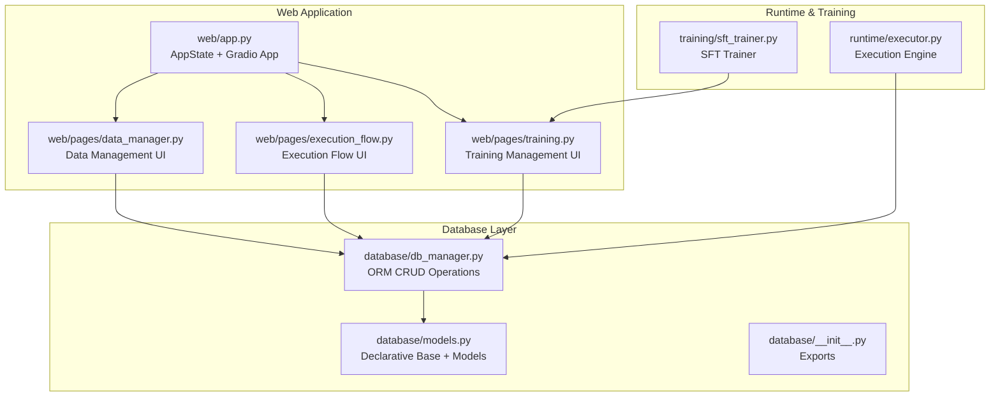
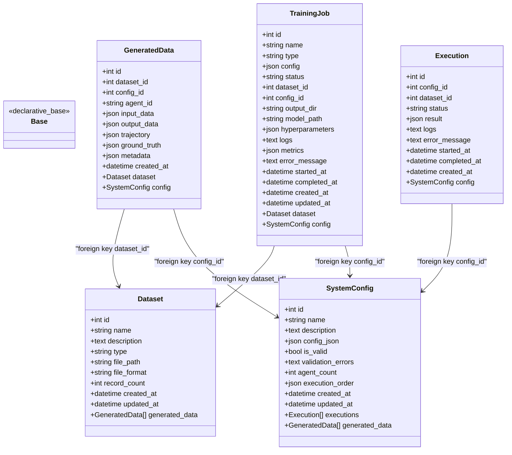
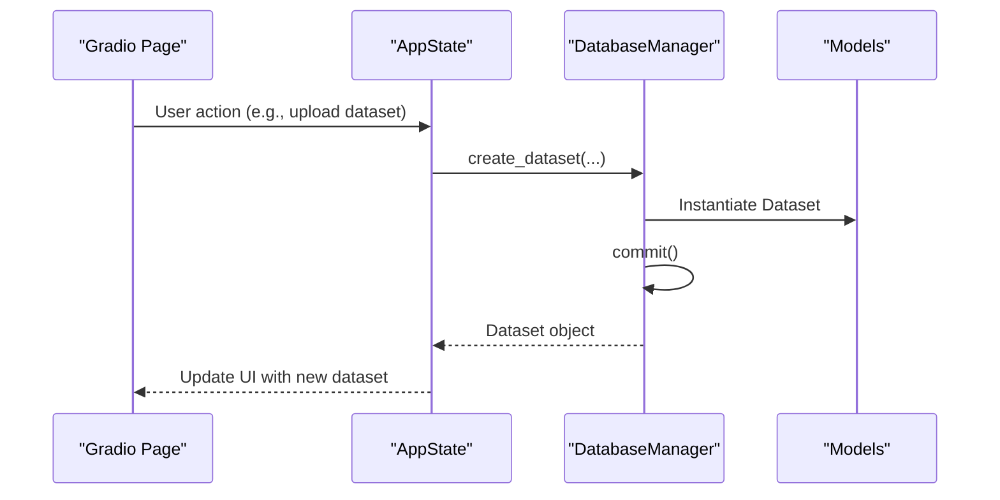
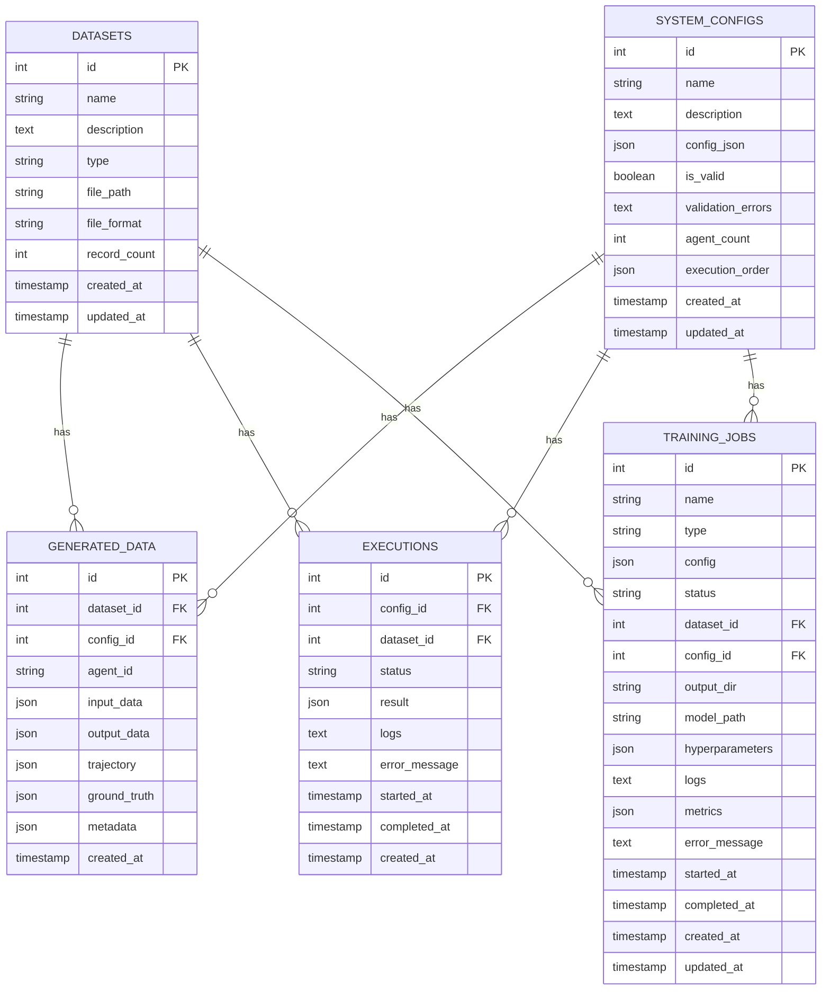

# Data Models

<cite>
**Referenced Files in This Document**
- [database/models.py](file://database/models.py)
- [database/db_manager.py](file://database/db_manager.py)
- [database/__init__.py](file://database/__init__.py)
- [web/pages/data_manager.py](file://web/pages/data_manager.py)
- [web/pages/execution_flow.py](file://web/pages/execution_flow.py)
- [web/pages/training.py](file://web/pages/training.py)
- [web/app.py](file://web/app.py)
- [runtime/executor.py](file://runtime/executor.py)
- [training/sft_trainer.py](file://training/sft_trainer.py)
</cite>

## Table of Contents
1. [Introduction](#introduction)
2. [Project Structure](#project-structure)
3. [Core Components](#core-components)
4. [Architecture Overview](#architecture-overview)
5. [Detailed Component Analysis](#detailed-component-analysis)
6. [Dependency Analysis](#dependency-analysis)
7. [Performance Considerations](#performance-considerations)
8. [Troubleshooting Guide](#troubleshooting-guide)
9. [Conclusion](#conclusion)

## Introduction
This document provides comprehensive data model documentation for the SQLAlchemy ORM models used in the project. It covers the declarative base pattern, entity definitions, field specifications, constraints, relationships, and indexing strategies. It also explains how these models integrate with the database layer and the broader application, and includes entity relationship diagrams and sample data structures.

## Project Structure
The data model layer is organized under the database package and integrates with the web application and runtime/training modules.

**Diagram sources**
- [database/models.py:1-123](file://database/models.py#L1-L123)
- [database/db_manager.py:1-347](file://database/db_manager.py#L1-L347)
- [database/__init__.py:1-14](file://database/__init__.py#L1-L14)
- [web/app.py:1-173](file://web/app.py#L1-L173)
- [web/pages/data_manager.py:1-310](file://web/pages/data_manager.py#L1-L310)
- [web/pages/execution_flow.py:1-275](file://web/pages/execution_flow.py#L1-L275)
- [web/pages/training.py:1-553](file://web/pages/training.py#L1-L553)
- [runtime/executor.py:1-132](file://runtime/executor.py#L1-L132)
- [training/sft_trainer.py:1-263](file://training/sft_trainer.py#L1-L263)

**Section sources**
- [database/models.py:1-123](file://database/models.py#L1-L123)
- [database/db_manager.py:1-347](file://database/db_manager.py#L1-L347)
- [database/__init__.py:1-14](file://database/__init__.py#L1-L14)
- [web/app.py:11-18](file://web/app.py#L11-L18)

## Core Components
This section documents each entity and its fields, constraints, and relationships.

- Dataset
  - Purpose: Stores uploaded datasets with metadata and file references.
  - Fields:
    - id: Integer, primary key, autoincrement.
    - name: String(255), not null.
    - description: Text, nullable.
    - type: String(50), not null; values include test, train, validation.
    - file_path: String(500), not null; filesystem path to the dataset file.
    - file_format: String(20), not null; values include json, jsonl.
    - record_count: Integer, default 0.
    - created_at: DateTime, default now.
    - updated_at: DateTime, default now, on update now.
  - Relationships:
    - One-to-many with GeneratedData via dataset_id.
  - Constraints:
    - Primary key on id.
    - Not null constraints on name, type, file_path, file_format.
  - Indexing:
    - No explicit indexes defined; consider adding indexes on type, file_format, created_at for filtering and sorting.

- GeneratedData
  - Purpose: Stores trajectory and auxiliary data produced during execution or training.
  - Fields:
    - id: Integer, primary key, autoincrement.
    - dataset_id: Integer, foreign key to datasets.id, nullable.
    - config_id: Integer, foreign key to system_configs.id, nullable.
    - agent_id: String(100), not null.
    - input_data: JSON, nullable.
    - output_data: JSON, nullable.
    - trajectory: JSON, not null; stores the full execution trajectory.
    - ground_truth: JSON, nullable; ground truth for supervised fine-tuning.
    - metadata: JSON, nullable; extra metadata.
    - created_at: DateTime, default now.
  - Relationships:
    - Many-to-one with Dataset via dataset_id.
    - Many-to-one with SystemConfig via config_id.
  - Constraints:
    - Primary key on id.
    - Not null constraint on trajectory.
    - Foreign keys dataset_id and config_id reference datasets.id and system_configs.id respectively.
  - Indexing:
    - No explicit indexes defined; consider indexes on dataset_id, config_id, agent_id for filtering.

- SystemConfig
  - Purpose: Stores validated system configurations as JSON, plus metadata and validation status.
  - Fields:
    - id: Integer, primary key, autoincrement.
    - name: String(255), not null.
    - description: Text, nullable.
    - config_json: JSON, not null; the full configuration.
    - is_valid: Boolean, default false; whether the configuration passed validation.
    - validation_errors: Text, nullable; validation error messages.
    - agent_count: Integer, default 0; derived from configuration.
    - execution_order: JSON, nullable; order of agent execution.
    - created_at: DateTime, default now.
    - updated_at: DateTime, default now, on update now.
  - Relationships:
    - One-to-many with Execution via config_id.
    - One-to-many with GeneratedData via config_id.
  - Constraints:
    - Primary key on id.
    - Not null constraint on name and config_json.
    - Not null constraint on is_valid (default false).
  - Indexing:
    - No explicit indexes defined; consider indexes on is_valid, created_at for filtering and sorting.

- Execution
  - Purpose: Tracks execution runs of a SystemConfig against a Dataset.
  - Fields:
    - id: Integer, primary key, autoincrement.
    - config_id: Integer, foreign key to system_configs.id, not null.
    - dataset_id: Integer, foreign key to datasets.id, nullable.
    - status: String(50), default pending; values include pending, running, completed, failed.
    - result: JSON, nullable; execution results.
    - logs: Text, nullable; execution logs.
    - error_message: Text, nullable; error message if failed.
    - started_at: DateTime, nullable.
    - completed_at: DateTime, nullable.
    - created_at: DateTime, default now.
  - Relationships:
    - Many-to-one with SystemConfig via config_id.
  - Constraints:
    - Primary key on id.
    - Not null constraint on config_id.
    - Foreign key config_id references system_configs.id.
  - Indexing:
    - No explicit indexes defined; consider indexes on config_id, status, created_at.

- TrainingJob
  - Purpose: Tracks training tasks for SFT, DPO, and GRPO.
  - Fields:
    - id: Integer, primary key, autoincrement.
    - name: String(255), not null.
    - type: String(50), not null; values include sft, dpo, grpo.
    - config: JSON, not null; training configuration.
    - status: String(50), default pending; values include pending, running, completed, failed, stopped.
    - dataset_id: Integer, foreign key to datasets.id, nullable.
    - config_id: Integer, foreign key to system_configs.id, nullable.
    - output_dir: String(500), nullable; output directory for trained model artifacts.
    - model_path: String(500), nullable; path to the model used or produced.
    - hyperparameters: JSON, nullable; hyperparameters used for training.
    - logs: Text, nullable; training logs.
    - metrics: JSON, nullable; training metrics.
    - error_message: Text, nullable; error message if failed/stopped.
    - started_at: DateTime, nullable.
    - completed_at: DateTime, nullable.
    - created_at: DateTime, default now.
    - updated_at: DateTime, default now, on update now.
  - Relationships:
    - Many-to-one with Dataset via dataset_id.
    - Many-to-one with SystemConfig via config_id.
  - Constraints:
    - Primary key on id.
    - Not null constraints on name, type, config.
    - Foreign keys dataset_id and config_id reference datasets.id and system_configs.id respectively.
  - Indexing:
    - No explicit indexes defined; consider indexes on type, status, dataset_id, config_id, created_at.

**Section sources**
- [database/models.py:10-29](file://database/models.py#L10-L29)
- [database/models.py:31-52](file://database/models.py#L31-L52)
- [database/models.py:54-75](file://database/models.py#L54-L75)
- [database/models.py:77-97](file://database/models.py#L77-L97)
- [database/models.py:99-123](file://database/models.py#L99-L123)

## Architecture Overview
The data models are defined using SQLAlchemy’s declarative base and are consumed by the DatabaseManager for CRUD operations. The web application pages interact with the DatabaseManager to persist and retrieve data.

**Diagram sources**
- [database/models.py:7-123](file://database/models.py#L7-L123)

**Section sources**
- [database/models.py:7-123](file://database/models.py#L7-L123)

## Detailed Component Analysis

### Declarative Base Pattern
- The Base is created using SQLAlchemy’s declarative_base and is used by all models.
- All models inherit from Base and define their table schema and relationships.
- The Base is exported via database/__init__.py for convenient imports across the application.

**Section sources**
- [database/models.py:7](file://database/models.py#L7)
- [database/__init__.py:2-13](file://database/__init__.py#L2-L13)

### Dataset Entity
- Purpose: Centralized storage of datasets with metadata and file references.
- Typical use cases:
  - Data upload and listing in the UI.
  - Filtering datasets by type or creation date.
  - Previewing dataset content.
- Sample data structure (conceptual):
  - id: 1
  - name: "Sample Train Set"
  - type: "train"
  - file_format: "jsonl"
  - record_count: 1000
  - created_at: "2025-01-01T10:00:00Z"
  - updated_at: "2025-01-01T10:00:00Z"

**Section sources**
- [database/models.py:10-29](file://database/models.py#L10-L29)
- [web/pages/data_manager.py:48-79](file://web/pages/data_manager.py#L48-L79)

### GeneratedData Entity
- Purpose: Stores trajectories and auxiliary data produced during execution or training.
- Typical use cases:
  - Filtering generated data by config or dataset.
  - Exporting training data for downstream training.
  - Viewing trajectory details.
- Sample data structure (conceptual):
  - id: 101
  - dataset_id: 1
  - config_id: 5
  - agent_id: "agent_a"
  - trajectory: { steps: [...], metadata: {...} }
  - ground_truth: { ... }
  - metadata: { phase: "distillation", loss_weight: 1.0 }
  - created_at: "2025-01-01T11:00:00Z"

**Section sources**
- [database/models.py:31-52](file://database/models.py#L31-L52)
- [web/pages/data_manager.py:80-133](file://web/pages/data_manager.py#L80-L133)

### SystemConfig Entity
- Purpose: Stores validated system configurations as JSON, plus metadata and validation status.
- Typical use cases:
  - Selecting valid configurations for execution or training.
  - Tracking validation results and execution order.
- Sample data structure (conceptual):
  - id: 5
  - name: "Default Config"
  - is_valid: true
  - agent_count: 3
  - execution_order: ["agent_a", "agent_b", "agent_c"]
  - created_at: "2025-01-01T09:00:00Z"
  - updated_at: "2025-01-01T09:00:00Z"

**Section sources**
- [database/models.py:54-75](file://database/models.py#L54-L75)
- [web/pages/execution_flow.py:20-46](file://web/pages/execution_flow.py#L20-L46)
- [web/pages/training.py:28-40](file://web/pages/training.py#L28-L40)

### Execution Entity
- Purpose: Tracks execution runs of a SystemConfig against a Dataset.
- Typical use cases:
  - Starting an execution run.
  - Updating status and logs during execution.
  - Listing executions for a given configuration.
- Sample data structure (conceptual):
  - id: 201
  - config_id: 5
  - dataset_id: 1
  - status: "running"
  - started_at: "2025-01-01T12:00:00Z"
  - created_at: "2025-01-01T12:00:00Z"

**Section sources**
- [database/models.py:77-97](file://database/models.py#L77-L97)
- [web/pages/execution_flow.py:116-224](file://web/pages/execution_flow.py#L116-L224)

### TrainingJob Entity
- Purpose: Tracks training tasks for SFT, DPO, and GRPO.
- Typical use cases:
  - Creating training jobs with hyperparameters.
  - Updating status, logs, metrics, and output directories.
  - Listing and viewing training jobs.
- Sample data structure (conceptual):
  - id: 301
  - name: "SFT Job 1"
  - type: "sft"
  - status: "running"
  - dataset_id: 1
  - config_id: 5
  - hyperparameters: { lr: 2e-5, batch_size: 4, epochs: 3 }
  - started_at: "2025-01-01T13:00:00Z"
  - created_at: "2025-01-01T13:00:00Z"

**Section sources**
- [database/models.py:99-123](file://database/models.py#L99-L123)
- [web/pages/training.py:254-486](file://web/pages/training.py#L254-L486)

### Database Integration and Usage
- DatabaseManager encapsulates SQLAlchemy engine creation, session management, and CRUD operations for all models.
- The web application initializes a DatabaseManager instance in AppState and passes it to page handlers.
- Pages interact with DatabaseManager to create, update, and query entities.

**Diagram sources**
- [web/pages/data_manager.py:135-179](file://web/pages/data_manager.py#L135-L179)
- [database/db_manager.py:37-56](file://database/db_manager.py#L37-L56)
- [web/app.py:11-18](file://web/app.py#L11-L18)

**Section sources**
- [database/db_manager.py:11-34](file://database/db_manager.py#L11-L34)
- [web/app.py:11-18](file://web/app.py#L11-L18)
- [web/pages/data_manager.py:135-179](file://web/pages/data_manager.py#L135-L179)

## Dependency Analysis
The following diagram shows the relationships among entities and how they connect via foreign keys.

**Diagram sources**
- [database/models.py:10-123](file://database/models.py#L10-L123)

**Section sources**
- [database/models.py:10-123](file://database/models.py#L10-L123)

## Performance Considerations
- Indexing:
  - Consider adding indexes on frequently filtered/sorted columns:
    - Dataset: type, file_format, created_at.
    - GeneratedData: dataset_id, config_id, agent_id, created_at.
    - SystemConfig: is_valid, created_at.
    - Execution: config_id, status, created_at.
    - TrainingJob: type, status, dataset_id, config_id, created_at.
- Query patterns:
  - Prefer filtering by foreign keys and timestamps.
  - Use ordering by created_at for pagination.
- Storage:
  - JSON fields store large payloads; consider partitioning or archiving old records.
- Concurrency:
  - Use sessions per operation and close them promptly to avoid connection leaks.

[No sources needed since this section provides general guidance]

## Troubleshooting Guide
- Validation failures:
  - SystemConfig stores validation_errors; inspect this field to diagnose configuration issues.
- Execution errors:
  - Execution logs and error_message capture runtime errors; check these when status is failed.
- Training errors:
  - TrainingJob logs and error_message capture training errors; check these when status is failed or stopped.
- Data integrity:
  - Ensure foreign keys are set consistently; missing dataset_id or config_id can cause orphaned records.

**Section sources**
- [database/models.py:58-67](file://database/models.py#L58-L67)
- [database/models.py:84-89](file://database/models.py#L84-L89)
- [database/models.py:107-115](file://database/models.py#L107-L115)

## Conclusion
The data model layer uses a clean declarative base pattern with clear entity definitions and relationships. The DatabaseManager centralizes ORM operations, while the web application pages leverage these models to manage datasets, configurations, executions, and training jobs. Adding targeted indexes and following the recommended query patterns will improve performance. The JSON fields provide flexibility for storing complex configurations and trajectories, enabling the platform to support diverse multi-agent workflows.