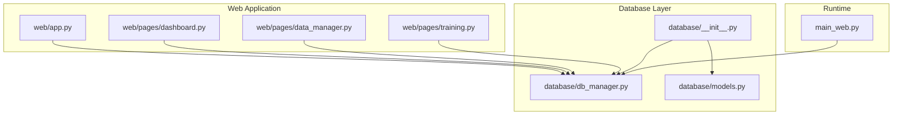
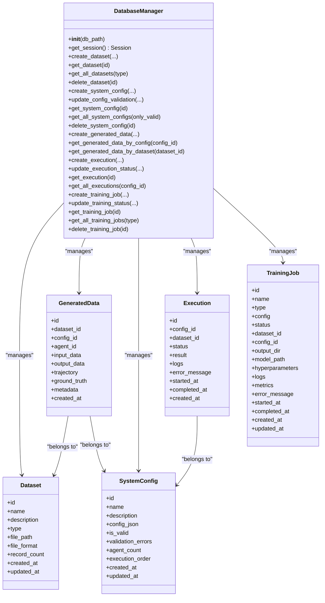
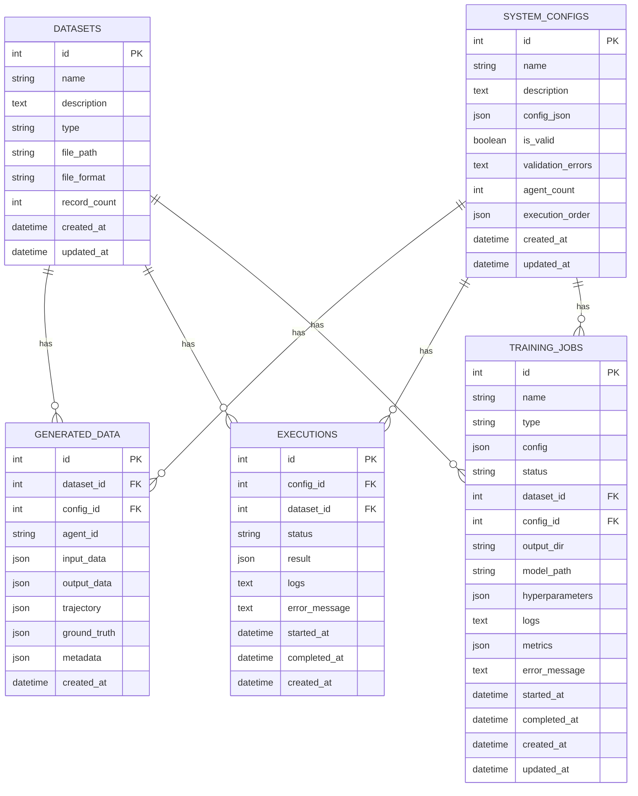
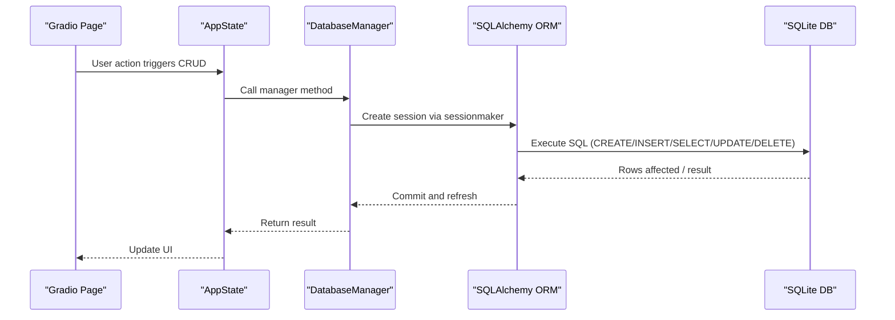
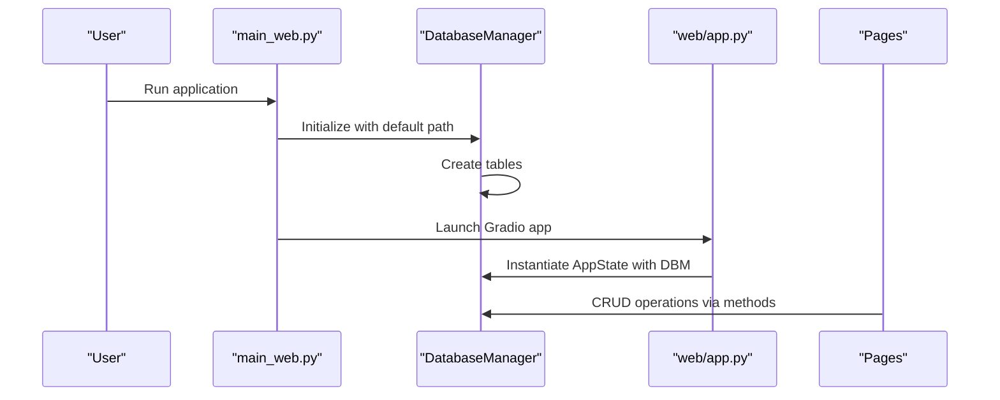
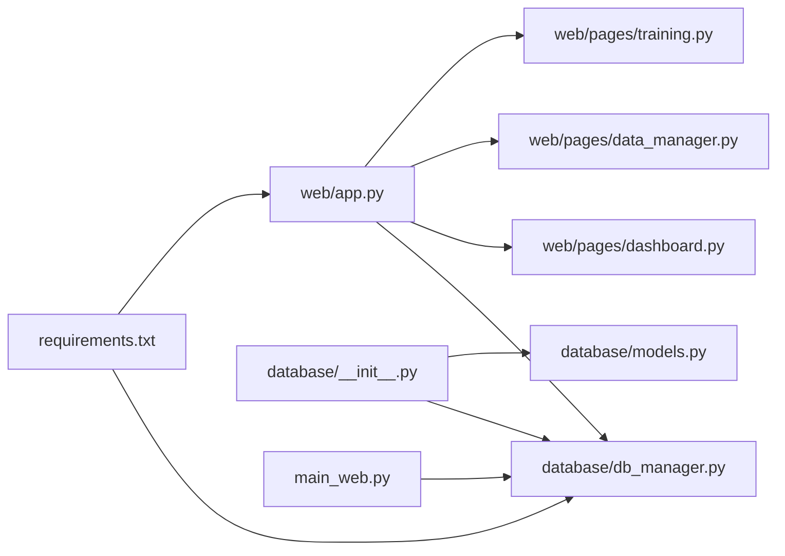
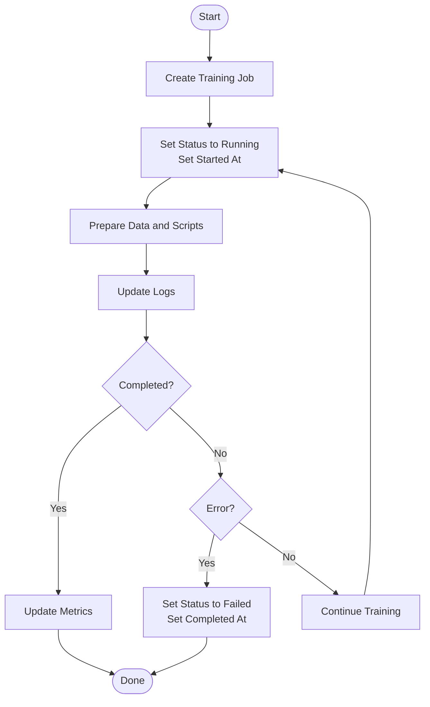

# Database Design

<cite>
**Referenced Files in This Document**
- [database/__init__.py](file://database/__init__.py)
- [database/db_manager.py](file://database/db_manager.py)
- [database/models.py](file://database/models.py)
- [web/app.py](file://web/app.py)
- [web/pages/dashboard.py](file://web/pages/dashboard.py)
- [web/pages/data_manager.py](file://web/pages/data_manager.py)
- [web/pages/training.py](file://web/pages/training.py)
- [main_web.py](file://main_web.py)
- [requirements.txt](file://requirements.txt)
</cite>

## Table of Contents
1. [Introduction](#introduction)
2. [Project Structure](#project-structure)
3. [Core Components](#core-components)
4. [Architecture Overview](#architecture-overview)
5. [Detailed Component Analysis](#detailed-component-analysis)
6. [Dependency Analysis](#dependency-analysis)
7. [Performance Considerations](#performance-considerations)
8. [Troubleshooting Guide](#troubleshooting-guide)
9. [Conclusion](#conclusion)
10. [Appendices](#appendices)

## Introduction
This document describes the database design and management system for the multi-agent system builder. It covers the entity relationship model, schema documentation, CRUD operations, SQLAlchemy ORM integration, database initialization and connection management, and operational patterns for configurations, executions, training jobs, and related entities. It also includes diagrams, sample data structures, query optimization strategies, transaction management, and production deployment considerations.

## Project Structure
The database layer is encapsulated under the database package and integrates with the web application via a shared DatabaseManager singleton. The web application initializes the database during startup and exposes CRUD operations through Gradio pages.

**Diagram sources**
- [web/app.py:1-173](file://web/app.py#L1-L173)
- [database/__init__.py:1-14](file://database/__init__.py#L1-L14)
- [database/db_manager.py:1-347](file://database/db_manager.py#L1-L347)
- [database/models.py:1-123](file://database/models.py#L1-L123)
- [main_web.py:63-70](file://main_web.py#L63-L70)

**Section sources**
- [database/__init__.py:1-14](file://database/__init__.py#L1-L14)
- [database/db_manager.py:14-29](file://database/db_manager.py#L14-L29)
- [web/app.py:11-25](file://web/app.py#L11-L25)
- [main_web.py:63-70](file://main_web.py#L63-L70)

## Core Components
- DatabaseManager: Centralized manager for SQLite engine creation, table initialization, and CRUD operations for datasets, system configurations, generated data, executions, and training jobs.
- Data Models: SQLAlchemy declarative models for datasets, generated data, system configurations, executions, and training jobs with relationships and JSON fields for flexible configuration and payload storage.
- Web Integration: Gradio-based pages consume DatabaseManager to present CRUD UIs and orchestrate training job lifecycle updates.

Key responsibilities:
- Initialization: Creates SQLite database file and tables on first run.
- Sessions: Provides per-operation sessions with explicit close semantics.
- CRUD: Implements create, read, update, and delete operations for each entity.
- Status Tracking: Execution and training job statuses are updated with timestamps and structured logs/metrics.

**Section sources**
- [database/db_manager.py:11-347](file://database/db_manager.py#L11-L347)
- [database/models.py:10-123](file://database/models.py#L10-L123)
- [web/app.py:11-25](file://web/app.py#L11-L25)

## Architecture Overview
The system uses a local SQLite database with SQLAlchemy ORM. The web application initializes the database at startup and maintains a global DatabaseManager instance for all pages. CRUD operations are performed through the manager’s methods, which handle session creation, commit, and cleanup.

**Diagram sources**
- [database/db_manager.py:11-347](file://database/db_manager.py#L11-L347)
- [database/models.py:10-123](file://database/models.py#L10-L123)

## Detailed Component Analysis

### Entity Relationship Diagram
The ER model centers around datasets and system configurations, with generated data linking both datasets and configurations. Executions track runs of configurations, and training jobs capture training tasks with status and metrics.

**Diagram sources**
- [database/models.py:10-123](file://database/models.py#L10-L123)

### Schema Documentation

- Datasets
  - Purpose: Store uploaded test/train/validation datasets with metadata and file paths.
  - Fields: id, name, description, type, file_path, file_format, record_count, created_at, updated_at.
  - Relationships: One-to-many with GeneratedData.

- GeneratedData
  - Purpose: Persist agent-generated trajectories and related payloads.
  - Fields: id, dataset_id, config_id, agent_id, input_data, output_data, trajectory, ground_truth, metadata, created_at.
  - Relationships: Belongs to Dataset and SystemConfig.

- SystemConfig
  - Purpose: Store validated JSON configuration for the multi-agent system.
  - Fields: id, name, description, config_json, is_valid, validation_errors, agent_count, execution_order, created_at, updated_at.
  - Relationships: One-to-many with Executions and GeneratedData.

- Executions
  - Purpose: Track runs of a SystemConfig against a Dataset.
  - Fields: id, config_id, dataset_id, status, result, logs, error_message, started_at, completed_at, created_at.
  - Relationships: Belongs to SystemConfig.

- TrainingJobs
  - Purpose: Track training tasks (SFT/DPO/GRPO) with status, logs, metrics, and hyperparameters.
  - Fields: id, name, type, config, status, dataset_id, config_id, output_dir, model_path, hyperparameters, logs, metrics, error_message, started_at, completed_at, created_at, updated_at.
  - Relationships: Belongs to Dataset and SystemConfig.

**Section sources**
- [database/models.py:10-123](file://database/models.py#L10-L123)

### CRUD Operation Implementations

- Datasets
  - Create: [database/db_manager.py:37-56](file://database/db_manager.py#L37-L56)
  - Read: [database/db_manager.py:58-64](file://database/db_manager.py#L58-L64), [database/db_manager.py:66-75](file://database/db_manager.py#L66-L75)
  - Delete: [database/db_manager.py:77-88](file://database/db_manager.py#L77-L88)

- SystemConfig
  - Create: [database/db_manager.py:92-108](file://database/db_manager.py#L92-L108)
  - Validation update: [database/db_manager.py:110-123](file://database/db_manager.py#L110-L123)
  - Read: [database/db_manager.py:125-131](file://database/db_manager.py#L125-L131), [database/db_manager.py:133-142](file://database/db_manager.py#L133-L142)
  - Delete: [database/db_manager.py:144-155](file://database/db_manager.py#L144-L155)

- GeneratedData
  - Create: [database/db_manager.py:159-181](file://database/db_manager.py#L159-L181)
  - Read by config: [database/db_manager.py:183-189](file://database/db_manager.py#L183-L189)
  - Read by dataset: [database/db_manager.py:193-199](file://database/db_manager.py#L193-L199)

- Executions
  - Create: [database/db_manager.py:205-219](file://database/db_manager.py#L205-L219)
  - Update status: [database/db_manager.py:221-244](file://database/db_manager.py#L221-L244)
  - Read: [database/db_manager.py:246-252](file://database/db_manager.py#L246-L252), [database/db_manager.py:254-263](file://database/db_manager.py#L254-L263)

- TrainingJobs
  - Create: [database/db_manager.py:267-286](file://database/db_manager.py#L267-L286)
  - Update status: [database/db_manager.py:288-314](file://database/db_manager.py#L288-L314)
  - Read: [database/db_manager.py:316-322](file://database/db_manager.py#L316-L322), [database/db_manager.py:324-333](file://database/db_manager.py#L324-L333)
  - Delete: [database/db_manager.py:335-346](file://database/db_manager.py#L335-L346)

**Section sources**
- [database/db_manager.py:37-346](file://database/db_manager.py#L37-L346)

### SQLAlchemy ORM Integration and Connection Management
- Engine and Session: SQLite engine configured with echo disabled; session factory bound to the engine.
- Table Creation: Base metadata is created upon initialization.
- Session Lifecycle: Each CRUD method opens a session, performs operations, commits, and closes the session in a finally block to ensure cleanup.

**Diagram sources**
- [database/db_manager.py:14-33](file://database/db_manager.py#L14-L33)
- [database/db_manager.py:31-33](file://database/db_manager.py#L31-L33)

**Section sources**
- [database/db_manager.py:14-33](file://database/db_manager.py#L14-L33)
- [database/db_manager.py:31-33](file://database/db_manager.py#L31-L33)

### Database Initialization and Startup
- main_web.py initializes the database at startup and prints a success message.
- web/app.py creates an AppState with a DatabaseManager instance shared across pages.

**Diagram sources**
- [main_web.py:63-70](file://main_web.py#L63-L70)
- [web/app.py:11-25](file://web/app.py#L11-L25)

**Section sources**
- [main_web.py:63-70](file://main_web.py#L63-L70)
- [web/app.py:11-25](file://web/app.py#L11-L25)

### Data Persistence Patterns and Transaction Management
- Per-call transactions: Each method wraps operations in a single session with commit and close in a finally block.
- Timestamps: started_at and completed_at are set when status transitions to running/completed/failed/stopped.
- JSON fields: Flexible storage for complex payloads (config_json, input_data, output_data, trajectory, ground_truth, hyperparameters, metrics).

**Section sources**
- [database/db_manager.py:221-244](file://database/db_manager.py#L221-L244)
- [database/db_manager.py:288-314](file://database/db_manager.py#L288-L314)

### Sample Data Structures
- Dataset
  - Example keys: name, type, file_path, file_format, record_count
- GeneratedData
  - Example keys: agent_id, input_data, output_data, trajectory, ground_truth, metadata
- SystemConfig
  - Example keys: name, config_json, is_valid, validation_errors, agent_count, execution_order
- Execution
  - Example keys: status, result, logs, error_message, started_at, completed_at
- TrainingJob
  - Example keys: name, type, config, status, hyperparameters, logs, metrics, output_dir, model_path

**Section sources**
- [database/models.py:10-123](file://database/models.py#L10-L123)

### Query Optimization Strategies
- Indexing: Add indexes on frequently filtered columns (e.g., dataset_id, config_id, status, created_at) to improve query performance.
- Pagination: Limit result sets (as seen in UI filters) to reduce memory overhead.
- Selective fields: Use column selection for read-heavy operations to minimize payload size.
- Batch operations: For bulk inserts/updates, consider bulk operations to reduce round-trips.

[No sources needed since this section provides general guidance]

### Backup Procedures
- SQLite backup: Copy the app.db file while the application is stopped to ensure consistency.
- Version control: Track schema changes via migration tools (see Migration Strategies).
- Export data: Use UI pages to export datasets and training artifacts for offsite storage.

[No sources needed since this section provides general guidance]

### Migration Strategies
- Alembic: Integrate Alembic for versioned migrations to evolve schema safely across releases.
- Backward compatibility: Maintain backward-compatible JSON fields and avoid breaking changes to existing columns.
- Dry-run: Test migrations on staging environments before applying to production.

[No sources needed since this section provides general guidance]

## Dependency Analysis
The web application depends on DatabaseManager for all persistence operations. DatabaseManager depends on SQLAlchemy ORM and the data models. The application startup flow ensures the database is initialized before serving requests.

**Diagram sources**
- [requirements.txt:13-14](file://requirements.txt#L13-L14)
- [web/app.py:1-173](file://web/app.py#L1-L173)
- [database/__init__.py:1-14](file://database/__init__.py#L1-L14)
- [database/db_manager.py:1-347](file://database/db_manager.py#L1-L347)
- [database/models.py:1-123](file://database/models.py#L1-L123)
- [main_web.py:63-70](file://main_web.py#L63-L70)

**Section sources**
- [requirements.txt:13-14](file://requirements.txt#L13-L14)
- [web/app.py:1-173](file://web/app.py#L1-L173)
- [database/__init__.py:1-14](file://database/__init__.py#L1-L14)
- [database/db_manager.py:1-347](file://database/db_manager.py#L1-L347)
- [database/models.py:1-123](file://database/models.py#L1-L123)
- [main_web.py:63-70](file://main_web.py#L63-L70)

## Performance Considerations
- SQLite limitations: For high concurrency or large-scale workloads, consider migrating to PostgreSQL/MySQL with connection pooling.
- JSON field indexing: SQLite does not support indexes on JSON fields; consider flattening critical fields if performance becomes a bottleneck.
- Session reuse: In long-running processes, reuse sessions judiciously and avoid holding connections open unnecessarily.
- Logging and metrics: Store logs and metrics efficiently; consider rotating logs and archiving old entries.

[No sources needed since this section provides general guidance]

## Troubleshooting Guide
Common issues and resolutions:
- Database not initialized: Ensure main_web.py runs to initialize tables before accessing pages.
- Session errors: Verify that each CRUD method completes with a close; avoid long-lived sessions.
- JSON parsing errors: Validate JSON payloads before storing; handle malformed JSON gracefully.
- Training job stuck: Check status transitions and timestamps; ensure logs capture errors.

**Section sources**
- [main_web.py:63-70](file://main_web.py#L63-L70)
- [database/db_manager.py:31-33](file://database/db_manager.py#L31-L33)

## Conclusion
The database design uses a clean separation between the web UI and the persistence layer, with SQLAlchemy ORM providing straightforward CRUD operations. The system is suitable for development and small-scale production scenarios. For larger deployments, consider migrating to a robust RDBMS, adding migrations, and implementing monitoring and backup procedures.

[No sources needed since this section summarizes without analyzing specific files]

## Appendices

### Appendix A: CRUD Flow for Training Jobs

**Diagram sources**
- [database/db_manager.py:267-314](file://database/db_manager.py#L267-L314)
- [web/pages/training.py:254-485](file://web/pages/training.py#L254-L485)