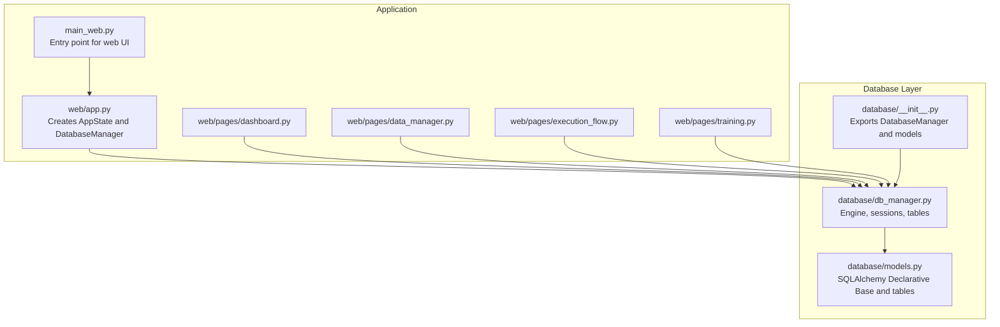
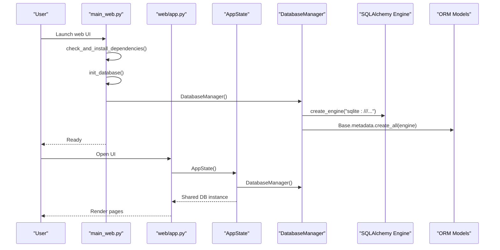
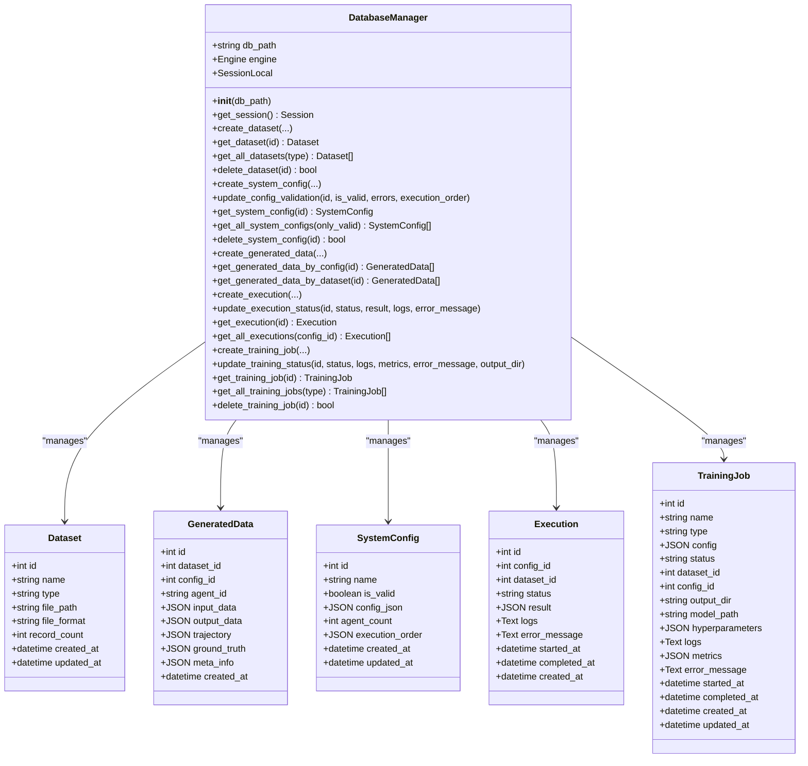
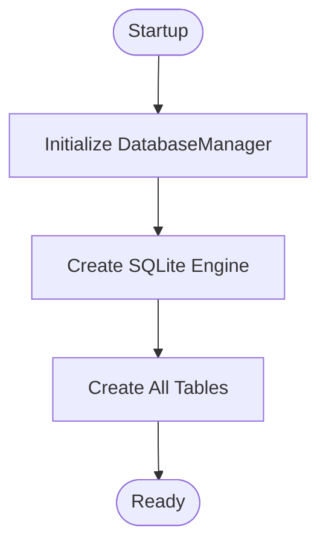
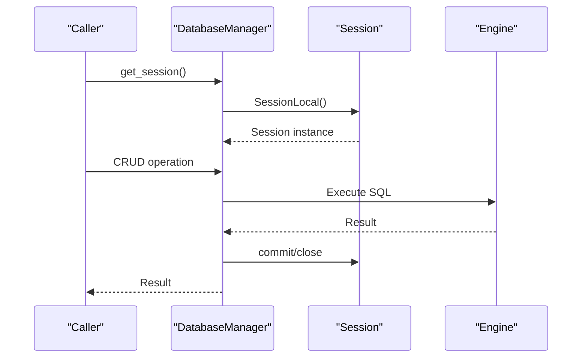
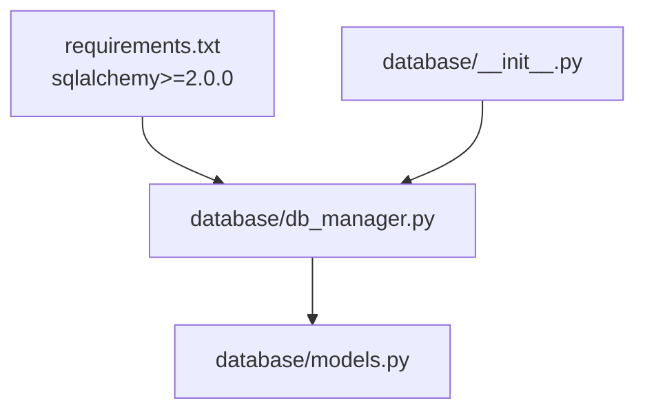

# Database Initialization

<cite>
**Referenced Files in This Document**
- [database/db_manager.py](file://database/db_manager.py)
- [database/models.py](file://database/models.py)
- [database/__init__.py](file://database/__init__.py)
- [web/app.py](file://web/app.py)
- [main_web.py](file://main_web.py)
- [web/pages/dashboard.py](file://web/pages/dashboard.py)
- [web/pages/data_manager.py](file://web/pages/data_manager.py)
- [web/pages/execution_flow.py](file://web/pages/execution_flow.py)
- [web/pages/training.py](file://web/pages/training.py)
- [configs/api_config.yaml](file://configs/api_config.yaml)
- [requirements.txt](file://requirements.txt)
</cite>

## Table of Contents
1. [Introduction](#introduction)
2. [Project Structure](#project-structure)
3. [Core Components](#core-components)
4. [Architecture Overview](#architecture-overview)
5. [Detailed Component Analysis](#detailed-component-analysis)
6. [Dependency Analysis](#dependency-analysis)
7. [Performance Considerations](#performance-considerations)
8. [Troubleshooting Guide](#troubleshooting-guide)
9. [Conclusion](#conclusion)
10. [Appendices](#appendices)

## Introduction
This document explains how the application initializes and manages its database. It covers the database engine configuration, connection handling, schema creation, and the lifecycle of the database manager. It also documents how the database integrates with the web application and training/execution flows, and provides guidance for environment-specific setup, backup/restore, maintenance, monitoring, and security.

## Project Structure
The database layer consists of a single SQLite database managed by SQLAlchemy ORM. The database is initialized automatically when the application starts, and the database manager exposes CRUD APIs for datasets, system configurations, generated trajectories, execution records, and training jobs.

**Diagram sources**
- [web/app.py:11-25](file://web/app.py#L11-L25)
- [main_web.py:63-70](file://main_web.py#L63-L70)
- [database/__init__.py:1-14](file://database/__init__.py#L1-L14)
- [database/db_manager.py:14-29](file://database/db_manager.py#L14-L29)
- [database/models.py:7-123](file://database/models.py#L7-L123)

**Section sources**
- [database/db_manager.py:14-29](file://database/db_manager.py#L14-L29)
- [database/models.py:7-123](file://database/models.py#L7-L123)
- [database/__init__.py:1-14](file://database/__init__.py#L1-L14)
- [web/app.py:11-25](file://web/app.py#L11-L25)
- [main_web.py:63-70](file://main_web.py#L63-L70)

## Core Components
- DatabaseManager: Central class that creates the SQLite engine, sets up sessions, and initializes tables. It provides methods to manage datasets, system configurations, generated data, executions, and training jobs.
- Declarative models: Define tables for datasets, generated data, system configurations, executions, and training jobs.
- Application integration: The web application constructs a global state containing a DatabaseManager instance and uses it across pages.

Key responsibilities:
- Engine and session creation
- Automatic schema initialization
- CRUD operations for all entities
- Status updates with timestamps

**Section sources**
- [database/db_manager.py:11-347](file://database/db_manager.py#L11-L347)
- [database/models.py:10-123](file://database/models.py#L10-L123)
- [web/app.py:11-25](file://web/app.py#L11-L25)

## Architecture Overview
The application uses a local SQLite database. On startup, the main entry point initializes the database manager, which creates the SQLite engine and ensures all tables exist. Pages in the web UI access the shared DatabaseManager instance to persist and retrieve data.

**Diagram sources**
- [main_web.py:63-70](file://main_web.py#L63-L70)
- [database/db_manager.py:14-29](file://database/db_manager.py#L14-L29)
- [web/app.py:11-25](file://web/app.py#L11-L25)

## Detailed Component Analysis

### DatabaseManager Implementation
The DatabaseManager encapsulates:
- Engine creation with SQLite
- Session factory
- Automatic table creation via Base.metadata.create_all
- CRUD methods for datasets, system configurations, generated data, executions, and training jobs
- Timestamped status updates for executions and training jobs

**Diagram sources**
- [database/db_manager.py:11-347](file://database/db_manager.py#L11-L347)
- [database/models.py:10-123](file://database/models.py#L10-L123)

**Section sources**
- [database/db_manager.py:11-347](file://database/db_manager.py#L11-L347)
- [database/models.py:10-123](file://database/models.py#L10-L123)

### Schema and Table Initialization
- The engine is created with a SQLite URL pointing to a local file path.
- The Base metadata is used to create all tables defined in models.
- The database path defaults to a local data directory under the project root.

**Diagram sources**
- [database/db_manager.py:14-29](file://database/db_manager.py#L14-L29)

**Section sources**
- [database/db_manager.py:14-29](file://database/db_manager.py#L14-L29)

### Connection Management and Lifecycle
- Sessions are created per operation using a local session maker bound to the engine.
- Each method opens a session, performs the operation, commits, and closes the session.
- The engine persists for the lifetime of the DatabaseManager instance.

**Diagram sources**
- [database/db_manager.py:31-33](file://database/db_manager.py#L31-L33)
- [database/db_manager.py:41-56](file://database/db_manager.py#L41-L56)

**Section sources**
- [database/db_manager.py:31-33](file://database/db_manager.py#L31-L33)
- [database/db_manager.py:41-56](file://database/db_manager.py#L41-L56)

### Environment-Specific Settings and Setup
- Default database path: A local SQLite file located under a data directory in the project root.
- No explicit environment variable overrides are present in the codebase for the database path.
- The web UI entry point initializes the database during startup.

Setup steps:
- Install dependencies as defined in requirements.
- Launch the web UI; the database is initialized automatically.
- The application does not require a separate database service or credentials.

Environment guidance:
- Development: Use the default SQLite path for simplicity.
- Staging/Production: The current implementation uses a local file. To migrate to a remote database, adjust the engine URL and connection parameters accordingly.

**Section sources**
- [database/db_manager.py:14-21](file://database/db_manager.py#L14-L21)
- [main_web.py:63-70](file://main_web.py#L63-L70)
- [requirements.txt:1-19](file://requirements.txt#L1-L19)

### Backup and Restore Procedures
Current state:
- The application stores all data in a single SQLite file.
- There are no built-in backup or restore commands in the codebase.

Recommended procedure:
- Stop the application.
- Copy the SQLite database file to a safe location for backup.
- To restore, replace the database file with the backup copy and restart the application.

Note: This is a manual process and not automated by the application.

**Section sources**
- [database/db_manager.py:14-21](file://database/db_manager.py#L14-L21)

### Maintenance Tasks
- The application does not include dedicated maintenance scripts.
- Periodic cleanup of old execution and training job records can be performed by adding queries to remove stale entries.

**Section sources**
- [database/db_manager.py:205-263](file://database/db_manager.py#L205-L263)
- [database/db_manager.py:267-333](file://database/db_manager.py#L267-L333)

### Monitoring Strategies
- The application surfaces counts and statuses on the dashboard page.
- Training and execution pages display progress and logs.
- For deeper monitoring, integrate external tools to track file sizes, disk usage, and application logs.

**Section sources**
- [web/pages/dashboard.py:12-25](file://web/pages/dashboard.py#L12-L25)
- [web/pages/training.py:254-338](file://web/pages/training.py#L254-L338)
- [web/pages/execution_flow.py:116-223](file://web/pages/execution_flow.py#L116-L223)

### Security Considerations
- Connection encryption: The current SQLite engine URL does not specify SSL/TLS parameters. Encryption depends on filesystem-level protections.
- Credential management: No credentials are required for SQLite. Ensure file permissions restrict access to the database file.
- API keys: The configuration file contains API keys for external providers. Treat this file as sensitive and avoid committing it to version control.

**Section sources**
- [database/db_manager.py:21](file://database/db_manager.py#L21)
- [configs/api_config.yaml:1-9](file://configs/api_config.yaml#L1-L9)

## Dependency Analysis
The database layer depends on SQLAlchemy for ORM and engine management. The web application depends on the database module for persistence.

**Diagram sources**
- [requirements.txt:13-14](file://requirements.txt#L13-L14)
- [database/__init__.py:1-14](file://database/__init__.py#L1-L14)
- [database/db_manager.py:6-8](file://database/db_manager.py#L6-L8)

**Section sources**
- [requirements.txt:13-14](file://requirements.txt#L13-L14)
- [database/__init__.py:1-14](file://database/__init__.py#L1-L14)
- [database/db_manager.py:6-8](file://database/db_manager.py#L6-L8)

## Performance Considerations
- SQLite is lightweight and suitable for development and small-scale workloads.
- For higher concurrency or larger datasets, consider migrating to a client-server database with connection pooling and optimized indexing.
- The application currently uses a single engine/session factory; no explicit pool configuration is present.

[No sources needed since this section provides general guidance]

## Troubleshooting Guide
Common issues and resolutions:
- Database not found or permission denied:
  - Verify the database file path exists and is writable.
  - Check file permissions on the database file and parent directory.
- Startup fails due to missing tables:
  - Ensure the application initializes the database manager during startup.
  - Confirm that table creation runs successfully.
- Session errors:
  - Ensure each operation properly commits and closes the session.
  - Avoid long-lived sessions to prevent memory growth.

**Section sources**
- [database/db_manager.py:14-29](file://database/db_manager.py#L14-L29)
- [database/db_manager.py:41-56](file://database/db_manager.py#L41-L56)

## Conclusion
The application uses a straightforward SQLite-based persistence layer with automatic schema initialization and a centralized DatabaseManager for all database operations. The web UI integrates the database seamlessly across pages. For production deployments, consider migrating to a more robust database engine, enabling encryption, and establishing automated backup and monitoring procedures.

[No sources needed since this section summarizes without analyzing specific files]

## Appendices

### Setup Instructions by Environment
- Development
  - Install dependencies from requirements.
  - Run the web UI; the database initializes automatically.
- Staging
  - Same as development; ensure the data directory is writable.
- Production
  - Same as development; ensure file permissions and backups are in place.
  - Consider migrating to a client-server database for scalability and reliability.

**Section sources**
- [requirements.txt:1-19](file://requirements.txt#L1-L19)
- [main_web.py:63-70](file://main_web.py#L63-L70)

### API Surface for Database Operations
- Datasets: create, read, list, delete
- SystemConfig: create, update validation, read, list, delete
- GeneratedData: create, filter by config/dataset
- Execution: create, update status with timestamps, read, list
- TrainingJob: create, update status with timestamps, read, list, delete

**Section sources**
- [database/db_manager.py:37-56](file://database/db_manager.py#L37-L56)
- [database/db_manager.py:110-155](file://database/db_manager.py#L110-L155)
- [database/db_manager.py:159-201](file://database/db_manager.py#L159-L201)
- [database/db_manager.py:205-263](file://database/db_manager.py#L205-L263)
- [database/db_manager.py:267-346](file://database/db_manager.py#L267-L346)