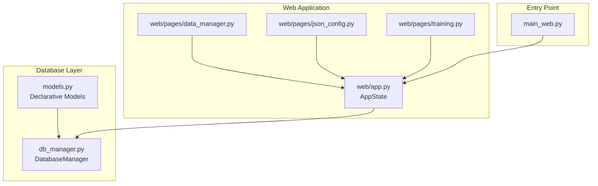
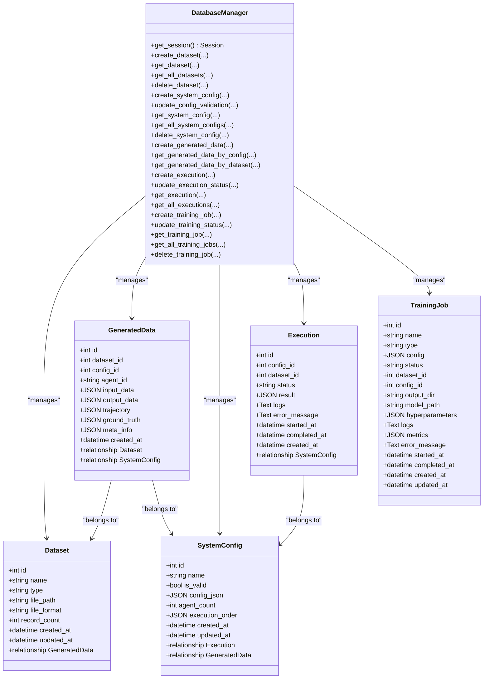
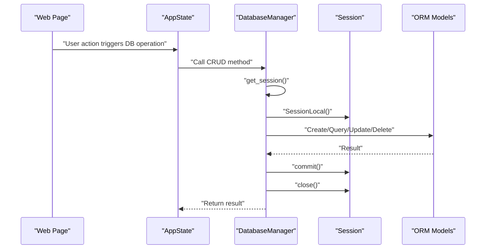
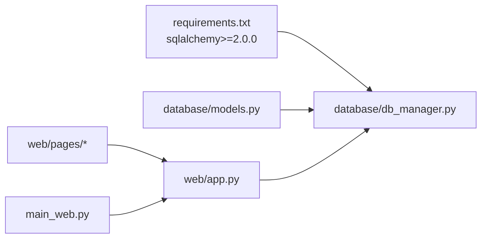

# Database Operations

<cite>
**Referenced Files in This Document**
- [db_manager.py](file://database/db_manager.py)
- [models.py](file://database/models.py)
- [__init__.py](file://database/__init__.py)
- [requirements.txt](file://requirements.txt)
- [app.py](file://web/app.py)
- [data_manager.py](file://web/pages/data_manager.py)
- [json_config.py](file://web/pages/json_config.py)
- [training.py](file://web/pages/training.py)
- [main_web.py](file://main_web.py)
- [test_system.py](file://test_system.py)
</cite>

## Table of Contents
1. [Introduction](#introduction)
2. [Project Structure](#project-structure)
3. [Core Components](#core-components)
4. [Architecture Overview](#architecture-overview)
5. [Detailed Component Analysis](#detailed-component-analysis)
6. [Dependency Analysis](#dependency-analysis)
7. [Performance Considerations](#performance-considerations)
8. [Troubleshooting Guide](#troubleshooting-guide)
9. [Conclusion](#conclusion)

## Introduction
This document explains the database operation implementations and ORM patterns used in the project. It covers CRUD operations for all entities, session management, transactions, and SQLite-backed persistence. It also documents query patterns, relationship traversals, and operational guidance for production-grade performance and reliability.

## Project Structure
The database layer is encapsulated under the database package with two primary modules:
- database/models.py: SQLAlchemy declarative models and relationships
- database/db_manager.py: Centralized DatabaseManager with CRUD methods per entity

The web application initializes a DatabaseManager instance and exposes CRUD operations through page handlers.

**Diagram sources**
- [models.py:1-123](file://database/models.py#L1-L123)
- [db_manager.py:1-347](file://database/db_manager.py#L1-L347)
- [app.py:11-173](file://web/app.py#L11-L173)
- [data_manager.py:1-310](file://web/pages/data_manager.py#L1-L310)
- [json_config.py:1-377](file://web/pages/json_config.py#L1-L377)
- [training.py:1-553](file://web/pages/training.py#L1-L553)
- [main_web.py:63-70](file://main_web.py#L63-L70)

**Section sources**
- [models.py:1-123](file://database/models.py#L1-L123)
- [db_manager.py:1-347](file://database/db_manager.py#L1-L347)
- [app.py:11-173](file://web/app.py#L11-L173)
- [main_web.py:63-70](file://main_web.py#L63-L70)

## Core Components
- DatabaseManager: Central class managing engine, sessions, and CRUD operations for all entities.
- Declarative Models: Dataset, GeneratedData, SystemConfig, Execution, TrainingJob with relationships.
- Web Pages: Use DatabaseManager to persist and retrieve data for UI interactions.

Key capabilities:
- Create, read, update, delete operations for each entity
- Relationship traversal via SQLAlchemy relationships
- Ordered queries with filtering and ordering
- Basic transaction semantics via per-operation commit/close

**Section sources**
- [db_manager.py:11-347](file://database/db_manager.py#L11-L347)
- [models.py:10-122](file://database/models.py#L10-L122)
- [app.py:11-173](file://web/app.py#L11-L173)

## Architecture Overview
The application uses a straightforward ORM architecture:
- SQLAlchemy engine configured for SQLite
- Session factory per process
- Per-operation session lifecycle (open, use, commit, close)
- Entity relationships defined via foreign keys and relationship()

**Diagram sources**
- [db_manager.py:11-347](file://database/db_manager.py#L11-L347)
- [models.py:10-122](file://database/models.py#L10-L122)

## Detailed Component Analysis

### DatabaseManager: Session Management and Transactions
- Engine creation with SQLite URI and echo disabled
- Session factory bound to the engine
- Per-operation session lifecycle:
  - Open via get_session()
  - Perform add/query/update/delete
  - Commit or handle exceptions
  - Close session in finally block
- No explicit transaction context manager; each operation is a discrete transaction

**Diagram sources**
- [db_manager.py:31-347](file://database/db_manager.py#L31-L347)
- [app.py:11-173](file://web/app.py#L11-L173)

**Section sources**
- [db_manager.py:14-34](file://database/db_manager.py#L14-L34)
- [db_manager.py:41-56](file://database/db_manager.py#L41-L56)
- [db_manager.py:113-123](file://database/db_manager.py#L113-L123)
- [db_manager.py:190-201](file://database/db_manager.py#L190-L201)
- [db_manager.py:225-244](file://database/db_manager.py#L225-L244)
- [db_manager.py:318-333](file://database/db_manager.py#L318-L333)

### Entities and Relationships

#### Dataset
- Purpose: Track uploaded datasets with metadata
- CRUD: create, read by id, list with optional type filter, delete
- Ordering: newest first by created_at

**Section sources**
- [models.py:10-28](file://database/models.py#L10-L28)
- [db_manager.py:37-56](file://database/db_manager.py#L37-L56)
- [db_manager.py:58-75](file://database/db_manager.py#L58-L75)
- [db_manager.py:77-88](file://database/db_manager.py#L77-L88)

#### SystemConfig
- Purpose: Store validated JSON configurations with validation metadata
- CRUD: create, read by id, list with optional validity filter, delete
- Validation updates: update_config_validation sets is_valid, validation_errors, execution_order

**Section sources**
- [models.py:54-74](file://database/models.py#L54-L74)
- [db_manager.py:92-108](file://database/db_manager.py#L92-L108)
- [db_manager.py:110-123](file://database/db_manager.py#L110-L123)
- [db_manager.py:125-142](file://database/db_manager.py#L125-L142)
- [db_manager.py:144-155](file://database/db_manager.py#L144-L155)

#### GeneratedData
- Purpose: Persist trajectories and intermediate outputs linked to datasets and configs
- CRUD: create, list by config_id or dataset_id, ordered by created_at desc
- JSON fields support flexible storage of inputs, outputs, trajectories, ground truth, and metadata

**Section sources**
- [models.py:31-51](file://database/models.py#L31-L51)
- [db_manager.py:159-181](file://database/db_manager.py#L159-L181)
- [db_manager.py:183-201](file://database/db_manager.py#L183-L201)

#### Execution
- Purpose: Track execution runs of a SystemConfig against optional Dataset
- CRUD: create with initial status pending, update status with timestamps, read by id, list by config_id
- Status transitions: pending -> running -> completed/failed with timestamps

**Section sources**
- [models.py:77-96](file://database/models.py#L77-L96)
- [db_manager.py:205-219](file://database/db_manager.py#L205-L219)
- [db_manager.py:221-244](file://database/db_manager.py#L221-L244)
- [db_manager.py:246-263](file://database/db_manager.py#L246-L263)

#### TrainingJob
- Purpose: Track training tasks (SFT/DPO/GRPO) with hyperparameters and metrics
- CRUD: create with initial status pending, update status with logs/metrics/error, read by id, list by type
- Status transitions: pending -> running -> completed/failed/stopped with timestamps

**Section sources**
- [models.py:99-122](file://database/models.py#L99-L122)
- [db_manager.py:267-286](file://database/db_manager.py#L267-L286)
- [db_manager.py:288-314](file://database/db_manager.py#L288-L314)
- [db_manager.py:316-333](file://database/db_manager.py#L316-L333)
- [db_manager.py:335-346](file://database/db_manager.py#L335-L346)

### Query Patterns and Relationship Traversals
- Filtering and ordering:
  - Dataset: optional type filter, order by created_at desc
  - SystemConfig: optional is_valid filter, order by created_at desc
  - GeneratedData: filter by config_id or dataset_id, order by created_at desc
  - Execution: optional config_id filter, order by created_at desc
  - TrainingJob: optional type filter, order by created_at desc
- Relationship traversal:
  - GeneratedData.dataset and GeneratedData.config via ForeignKey relationships
  - SystemConfig.executions and SystemConfig.generated_data
  - Execution.config via ForeignKey relationship

**Section sources**
- [db_manager.py:66-75](file://database/db_manager.py#L66-L75)
- [db_manager.py:133-142](file://database/db_manager.py#L133-L142)
- [db_manager.py:183-201](file://database/db_manager.py#L183-L201)
- [db_manager.py:254-263](file://database/db_manager.py#L254-L263)
- [db_manager.py:324-333](file://database/db_manager.py#L324-L333)
- [models.py:24-25](file://database/models.py#L24-L25)
- [models.py:47-48](file://database/models.py#L47-L48)
- [models.py:69-71](file://database/models.py#L69-L71)
- [models.py:93](file://database/models.py#L93)

### Bulk Operations and Batch Processing
- The current implementation performs per-record operations (create_dataset, create_system_config, create_generated_data, create_training_job).
- There is no explicit bulk insert API exposed in DatabaseManager. For high-volume inserts, consider using bulk operations at the SQLAlchemy level (e.g., bulk_insert_mappings) to reduce overhead.

**Section sources**
- [db_manager.py:37-56](file://database/db_manager.py#L37-L56)
- [db_manager.py:92-108](file://database/db_manager.py#L92-L108)
- [db_manager.py:159-181](file://database/db_manager.py#L159-L181)
- [db_manager.py:267-286](file://database/db_manager.py#L267-L286)

### Complex Queries and Joins
- The current codebase does not implement explicit JOINs in DatabaseManager methods.
- Relationships are accessed via ORM attributes (e.g., GeneratedData.dataset, SystemConfig.generated_data), which trigger lazy loading or joined loads depending on usage.
- For advanced analytics or reporting, consider adding explicit join-based queries to retrieve cross-entity summaries.

**Section sources**
- [models.py:24-25](file://database/models.py#L24-L25)
- [models.py:47-48](file://database/models.py#L47-L48)
- [models.py:69-71](file://database/models.py#L69-L71)
- [models.py:93](file://database/models.py#L93)

### Error Handling Strategies
- Per-operation try/finally ensures session closure even on exceptions.
- Validation and conversion errors are surfaced to callers (e.g., JSON parsing failures in web pages).
- No centralized retry mechanism is implemented in DatabaseManager.

**Section sources**
- [db_manager.py:41-56](file://database/db_manager.py#L41-L56)
- [db_manager.py:113-123](file://database/db_manager.py#L113-L123)
- [db_manager.py:190-201](file://database/db_manager.py#L190-L201)
- [db_manager.py:225-244](file://database/db_manager.py#L225-L244)
- [db_manager.py:318-333](file://database/db_manager.py#L318-L333)

### Database Connectivity Issues
- SQLite path defaults to a local file under the data directory.
- No built-in retry or reconnection logic; failures surface as SQLAlchemy exceptions.

**Section sources**
- [db_manager.py:14-21](file://database/db_manager.py#L14-L21)

## Dependency Analysis
- External dependencies:
  - SQLAlchemy >= 2.0.0 for ORM and engine
  - Python runtime for SQLite driver
- Internal dependencies:
  - web pages depend on DatabaseManager for persistence
  - main_web.py initializes DatabaseManager during startup

**Diagram sources**
- [requirements.txt:14](file://requirements.txt#L14)
- [db_manager.py:6-8](file://database/db_manager.py#L6-L8)
- [app.py:8](file://web/app.py#L8)
- [main_web.py:65-70](file://main_web.py#L65-L70)

**Section sources**
- [requirements.txt:14](file://requirements.txt#L14)
- [db_manager.py:6-8](file://database/db_manager.py#L6-L8)
- [app.py:8](file://web/app.py#L8)
- [main_web.py:65-70](file://main_web.py#L65-L70)

## Performance Considerations
- Current implementation:
  - Single SQLite file per installation
  - Per-operation commits and closes
  - No explicit connection pooling or transaction batching
- Recommendations for production:
  - Enable WAL mode for improved concurrency
  - Consider connection pooling (e.g., pool_size, max_overflow) for higher throughput
  - Add indexes on frequently filtered columns (e.g., dataset_id, config_id, status)
  - Use bulk operations for high-volume inserts
  - Consider partitioning or separate tables for large GeneratedData sets
  - Monitor slow queries and add EXPLAIN QUERY PLAN analysis

[No sources needed since this section provides general guidance]

## Troubleshooting Guide
Common issues and remedies:
- Database initialization failure:
  - Verify SQLite file path and permissions
  - Ensure the data directory exists or is creatable
- Operational errors:
  - Inspect exceptions raised by SQLAlchemy operations
  - Confirm entity existence before updates/deletes
- Data validation errors:
  - Validate JSON configuration before saving
  - Check for duplicate agent_id and missing required fields

**Section sources**
- [db_manager.py:14-21](file://database/db_manager.py#L14-L21)
- [db_manager.py:41-56](file://database/db_manager.py#L41-L56)
- [db_manager.py:113-123](file://database/db_manager.py#L113-L123)
- [db_manager.py:190-201](file://database/db_manager.py#L190-L201)
- [db_manager.py:225-244](file://database/db_manager.py#L225-L244)
- [db_manager.py:318-333](file://database/db_manager.py#L318-L333)

## Conclusion
The project implements a clean, straightforward ORM layer using SQLAlchemy with SQLite. DatabaseManager centralizes CRUD operations and maintains per-operation transaction semantics. The web application integrates these operations seamlessly across pages. For production deployments, consider enabling WAL, connection pooling, targeted indexing, and bulk operations to improve throughput and reliability.