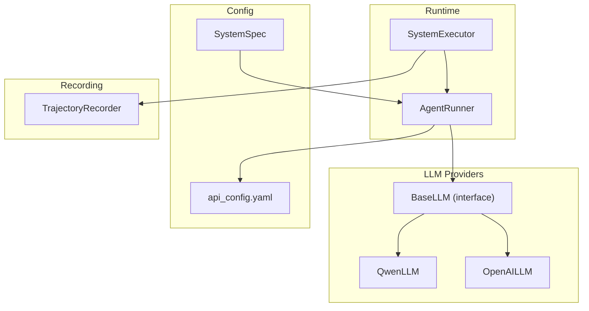
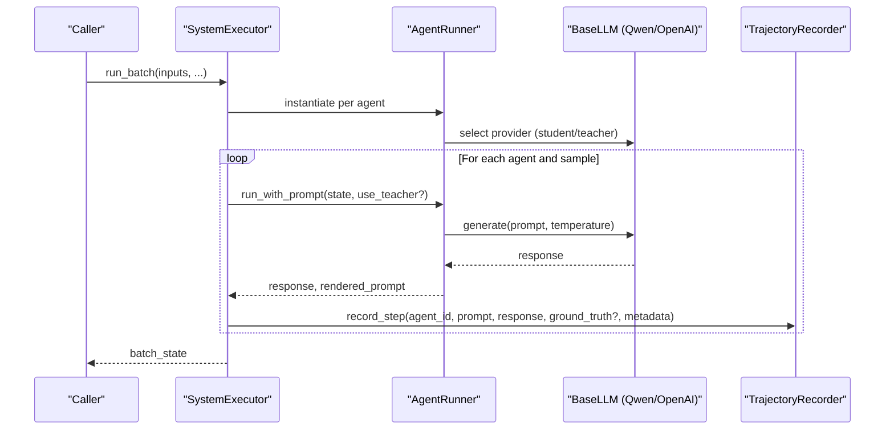
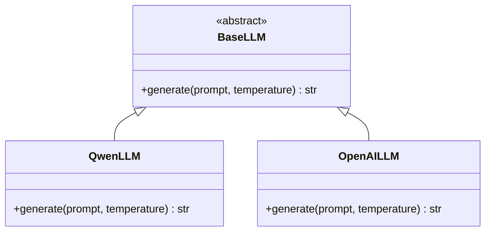
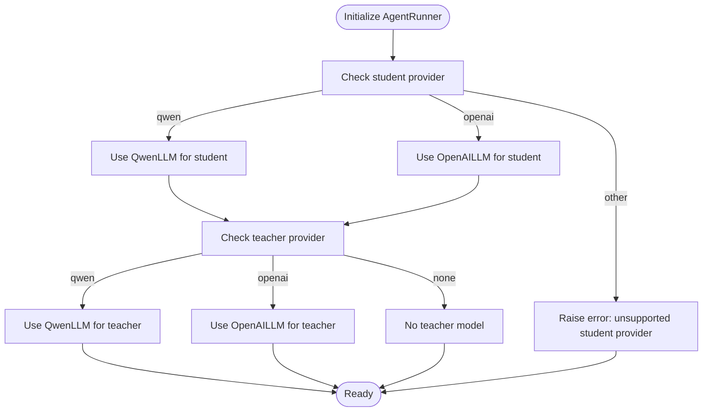
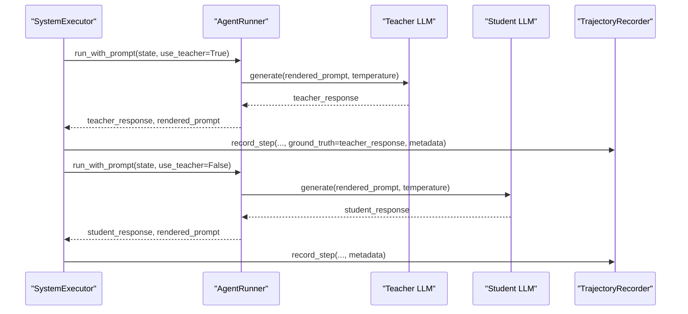
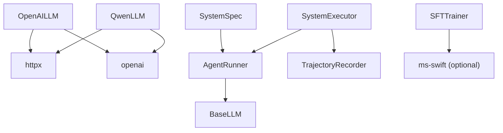

# LLM Provider Integration

<cite>
**Referenced Files in This Document**
- [llm/base.py](file://llm/base.py)
- [llm/openai_llm.py](file://llm/openai_llm.py)
- [llm/qwen_llm.py](file://llm/qwen_llm.py)
- [configs/api_config.yaml](file://configs/api_config.yaml)
- [runtime/agent_runner.py](file://runtime/agent_runner.py)
- [runtime/executor.py](file://runtime/executor.py)
- [spec/system_spec.py](file://spec/system_spec.py)
- [rollout/recoder.py](file://rollout/recoder.py)
- [requirements.txt](file://requirements.txt)
- [training/sft_trainer.py](file://training/sft_trainer.py)
</cite>

## Table of Contents
1. [Introduction](#introduction)
2. [Project Structure](#project-structure)
3. [Core Components](#core-components)
4. [Architecture Overview](#architecture-overview)
5. [Detailed Component Analysis](#detailed-component-analysis)
6. [Dependency Analysis](#dependency-analysis)
7. [Performance Considerations](#performance-considerations)
8. [Troubleshooting Guide](#troubleshooting-guide)
9. [Conclusion](#conclusion)
10. [Appendices](#appendices)

## Introduction
This document describes the LLM provider integration system, focusing on the BaseLLM interface design, a pluggable provider architecture, and guidelines for developing custom providers. It explains the Qwen and OpenAI integrations, API configuration management, credential handling, provider selection mechanisms, fallback strategies, and performance optimization techniques. It also covers configuration examples, authentication setup, rate limiting considerations, provider-specific features and limitations, migration strategies, and extension guidelines for adding new LLM providers.

## Project Structure
The LLM integration resides under the llm package and integrates with runtime orchestration, configuration, and rollout recording. The system supports two providers (Qwen and OpenAI) via a shared BaseLLM interface and selects providers based on agent configuration.

**Diagram sources**
- [llm/base.py:1-6](file://llm/base.py#L1-L6)
- [llm/qwen_llm.py:1-51](file://llm/qwen_llm.py#L1-L51)
- [llm/openai_llm.py:1-49](file://llm/openai_llm.py#L1-L49)
- [runtime/agent_runner.py:1-68](file://runtime/agent_runner.py#L1-L68)
- [runtime/executor.py:1-132](file://runtime/executor.py#L1-L132)
- [spec/system_spec.py:77-97](file://spec/system_spec.py#L77-L97)
- [configs/api_config.yaml:1-9](file://configs/api_config.yaml#L1-L9)
- [rollout/recoder.py:1-122](file://rollout/recoder.py#L1-L122)

**Section sources**
- [llm/base.py:1-6](file://llm/base.py#L1-L6)
- [llm/qwen_llm.py:1-51](file://llm/qwen_llm.py#L1-L51)
- [llm/openai_llm.py:1-49](file://llm/openai_llm.py#L1-L49)
- [runtime/agent_runner.py:1-68](file://runtime/agent_runner.py#L1-L68)
- [runtime/executor.py:1-132](file://runtime/executor.py#L1-L132)
- [spec/system_spec.py:77-97](file://spec/system_spec.py#L77-L97)
- [configs/api_config.yaml:1-9](file://configs/api_config.yaml#L1-L9)
- [rollout/recoder.py:1-122](file://rollout/recoder.py#L1-L122)

## Core Components
- BaseLLM: Defines the provider-agnostic interface with a single method for generating text given a prompt and temperature.
- QwenLLM: Implements BaseLLM using the OpenAI-compatible client with explicit HTTP client configuration and robust credential loading from YAML.
- OpenAILLM: Mirrors QwenLLM’s design for OpenAI’s official API, ensuring consistent behavior and configuration.
- AgentRunner: Selects and instantiates the appropriate provider for student and teacher models based on agent configuration.
- SystemExecutor: Orchestrates multi-agent execution, supports two-phase generation (teacher GT, then student execution), and records trajectories.
- TrajectoryRecorder: Writes step-wise trajectories to JSONL and supports assembling SFT datasets.
- SystemSpec: Describes agent configuration, including provider selection, model names, prompts, IO mappings, and training metadata.
- api_config.yaml: Centralized credentials and endpoint configuration for providers.

Key implementation patterns:
- Provider selection is driven by agent configuration fields (provider identifiers and model names).
- Both providers share a similar initialization pattern: locate configuration file, parse YAML, extract credentials and base URL, construct an HTTP client with explicit headers and timeouts, and initialize the OpenAI client with the custom HTTP client.
- Temperature is passed through to the provider’s completion API.

**Section sources**
- [llm/base.py:1-6](file://llm/base.py#L1-L6)
- [llm/qwen_llm.py:7-38](file://llm/qwen_llm.py#L7-L38)
- [llm/openai_llm.py:7-41](file://llm/openai_llm.py#L7-L41)
- [runtime/agent_runner.py:10-32](file://runtime/agent_runner.py#L10-L32)
- [runtime/executor.py:9-132](file://runtime/executor.py#L9-L132)
- [rollout/recoder.py:8-42](file://rollout/recoder.py#L8-L42)
- [spec/system_spec.py:77-97](file://spec/system_spec.py#L77-L97)
- [configs/api_config.yaml:1-9](file://configs/api_config.yaml#L1-L9)

## Architecture Overview
The system separates concerns across configuration, provider abstraction, runtime orchestration, and data recording. AgentRunner encapsulates provider selection and invocation, while SystemExecutor coordinates multi-agent workflows and trajectory recording.

**Diagram sources**
- [runtime/executor.py:16-132](file://runtime/executor.py#L16-L132)
- [runtime/agent_runner.py:33-60](file://runtime/agent_runner.py#L33-L60)
- [llm/base.py:3-6](file://llm/base.py#L3-L6)
- [rollout/recoder.py:15-42](file://rollout/recoder.py#L15-L42)

## Detailed Component Analysis

### BaseLLM Interface Design
- Purpose: Provide a uniform contract for all LLM providers.
- Method: generate(prompt, temperature) -> str.
- Benefits: Enables pluggable provider architecture and simplifies switching between providers.

**Diagram sources**
- [llm/base.py:3-6](file://llm/base.py#L3-L6)
- [llm/qwen_llm.py:40-49](file://llm/qwen_llm.py#L40-L49)
- [llm/openai_llm.py:43-49](file://llm/openai_llm.py#L43-L49)

**Section sources**
- [llm/base.py:1-6](file://llm/base.py#L1-L6)

### Qwen Integration Implementation
- Configuration loading: Resolves api_config.yaml location relative to provider module and project root.
- Credential extraction: Reads provider-specific keys, base URLs, and model names.
- HTTP client: Uses httpx to configure redirects, timeouts, and explicit headers to avoid encoding issues.
- Client initialization: Creates an OpenAI client with the custom HTTP client.
- Generation: Calls chat.completions with role-based messages and temperature.

Provider-specific features and limitations:
- Compatible with OpenAI-style APIs via DashScope base URL.
- Robust error handling includes detection of encoding-related exceptions.

**Section sources**
- [llm/qwen_llm.py:7-38](file://llm/qwen_llm.py#L7-L38)
- [llm/qwen_llm.py:40-51](file://llm/qwen_llm.py#L40-L51)
- [configs/api_config.yaml:1-4](file://configs/api_config.yaml#L1-L4)

### OpenAI Integration Implementation
- Configuration loading: Mirrors Qwen’s approach for locating api_config.yaml.
- Credential extraction: Reads OpenAI-specific keys, base URLs, and model names.
- HTTP client: Explicitly sets headers and timeouts to prevent header encoding errors caused by environment variables.
- Client initialization: Initializes OpenAI client with the custom HTTP client.
- Generation: Submits a user message and retrieves the assistant’s reply.

Provider-specific features and limitations:
- Uses OpenAI’s official SDK and base URL.
- Same robust HTTP client pattern as Qwen.

**Section sources**
- [llm/openai_llm.py:7-41](file://llm/openai_llm.py#L7-L41)
- [llm/openai_llm.py:43-49](file://llm/openai_llm.py#L43-L49)
- [configs/api_config.yaml:6-9](file://configs/api_config.yaml#L6-L9)

### Provider Selection Mechanism
AgentRunner selects providers based on agent configuration:
- Student model provider: Uses agent_spec.model_provider or defaults to “qwen”.
- Teacher model provider: Uses agent_spec.teacher_model.provider or defaults to “qwen”.
- Unsupported provider raises a clear error.

**Diagram sources**
- [runtime/agent_runner.py:14-31](file://runtime/agent_runner.py#L14-L31)

**Section sources**
- [runtime/agent_runner.py:10-32](file://runtime/agent_runner.py#L10-L32)
- [spec/system_spec.py:77-97](file://spec/system_spec.py#L77-L97)

### Fallback Strategies
- Provider selection fails fast with explicit errors for unsupported providers.
- HTTP client configuration avoids silent failures due to environment variable encoding issues.
- No built-in retry or circuit breaker logic exists in the current implementation; consider adding retries around provider calls if needed.

**Section sources**
- [runtime/agent_runner.py:19-20](file://runtime/agent_runner.py#L19-L20)
- [runtime/agent_runner.py:30-31](file://runtime/agent_runner.py#L30-L31)
- [llm/qwen_llm.py:48-51](file://llm/qwen_llm.py#L48-L51)
- [llm/openai_llm.py:25-35](file://llm/openai_llm.py#L25-L35)

### API Configuration Management and Credential Handling
- Centralized configuration: api_config.yaml holds provider credentials, base URLs, and default models.
- Robust loading: Provider constructors resolve configuration file path from both project root and module-relative locations.
- HTTP client hardening: Explicit headers and timeouts reduce environment-related failures.

Configuration keys:
- qwen.api_key, qwen.base_url, qwen.model
- openai.api_key, openai.base_url, openai.model

**Section sources**
- [configs/api_config.yaml:1-9](file://configs/api_config.yaml#L1-L9)
- [llm/qwen_llm.py:8-22](file://llm/qwen_llm.py#L8-L22)
- [llm/openai_llm.py:8-23](file://llm/openai_llm.py#L8-L23)
- [llm/qwen_llm.py:24-38](file://llm/qwen_llm.py#L24-L38)
- [llm/openai_llm.py:25-41](file://llm/openai_llm.py#L25-L41)

### Two-Phase Execution and Trajectory Recording
- Phase 1 (Ground Truth): Optional generation of teacher outputs to seed training data.
- Phase 2 (Student Execution): Runs student models, updates state, and records trajectories.
- Recording: Writes JSONL entries with messages, optional ground truth, and metadata including loss weight.

**Diagram sources**
- [runtime/executor.py:32-123](file://runtime/executor.py#L32-L123)
- [runtime/agent_runner.py:33-60](file://runtime/agent_runner.py#L33-L60)
- [rollout/recoder.py:15-42](file://rollout/recoder.py#L15-L42)

**Section sources**
- [runtime/executor.py:16-132](file://runtime/executor.py#L16-L132)
- [runtime/agent_runner.py:33-60](file://runtime/agent_runner.py#L33-L60)
- [rollout/recoder.py:15-42](file://rollout/recoder.py#L15-L42)

### Migration Strategies Between Providers
- Swap provider by changing agent configuration fields (provider identifiers).
- Keep model names aligned across providers where possible to minimize prompt tuning differences.
- Verify base URLs and credentials in api_config.yaml match the target provider’s requirements.
- Retain the same temperature and prompt rendering logic to maintain behavioral consistency.

**Section sources**
- [spec/system_spec.py:77-97](file://spec/system_spec.py#L77-L97)
- [configs/api_config.yaml:1-9](file://configs/api_config.yaml#L1-L9)

### Extending the System with New LLM Providers
To add a new provider:
- Implement a new class inheriting from BaseLLM and define generate(prompt, temperature) -> str.
- Load configuration from api_config.yaml similarly to existing providers.
- Initialize an HTTP client with explicit headers/timeouts and create the provider’s client.
- Integrate the new provider in AgentRunner by adding a new branch for the provider identifier.
- Ensure consistent error handling and logging.

Guidelines:
- Mirror the HTTP client construction pattern used by QwenLLM and OpenAILLM.
- Use the same configuration layout in api_config.yaml for consistency.
- Keep provider-specific differences minimal to preserve portability.

**Section sources**
- [llm/base.py:3-6](file://llm/base.py#L3-L6)
- [llm/qwen_llm.py:7-38](file://llm/qwen_llm.py#L7-L38)
- [llm/openai_llm.py:7-41](file://llm/openai_llm.py#L7-L41)
- [runtime/agent_runner.py:14-31](file://runtime/agent_runner.py#L14-L31)
- [configs/api_config.yaml:1-9](file://configs/api_config.yaml#L1-L9)

## Dependency Analysis
External dependencies relevant to LLM integration:
- httpx: Used to construct a robust HTTP client with explicit headers and timeouts.
- openai: Used to call provider APIs via a unified client interface.
- pydantic: Validates agent and system configuration structures.
- networkx: Supports building execution order from agent dependencies.
- ms-swift: Optional training framework integration for SFT.

**Diagram sources**
- [llm/qwen_llm.py:24-38](file://llm/qwen_llm.py#L24-L38)
- [llm/openai_llm.py:25-41](file://llm/openai_llm.py#L25-L41)
- [runtime/agent_runner.py:4-6](file://runtime/agent_runner.py#L4-L6)
- [runtime/executor.py:1-7](file://runtime/executor.py#L1-L7)
- [rollout/recoder.py:1-6](file://rollout/recoder.py#L1-L6)
- [spec/system_spec.py:2-4](file://spec/system_spec.py#L2-L4)
- [training/sft_trainer.py:16-18](file://training/sft_trainer.py#L16-L18)
- [requirements.txt:1-19](file://requirements.txt#L1-L19)

**Section sources**
- [requirements.txt:1-19](file://requirements.txt#L1-L19)
- [llm/qwen_llm.py:24-38](file://llm/qwen_llm.py#L24-L38)
- [llm/openai_llm.py:25-41](file://llm/openai_llm.py#L25-L41)
- [runtime/agent_runner.py:4-6](file://runtime/agent_runner.py#L4-L6)
- [runtime/executor.py:1-7](file://runtime/executor.py#L1-L7)
- [rollout/recoder.py:1-6](file://rollout/recoder.py#L1-L6)
- [spec/system_spec.py:2-4](file://spec/system_spec.py#L2-L4)
- [training/sft_trainer.py:16-18](file://training/sft_trainer.py#L16-L18)

## Performance Considerations
- HTTP client configuration: Using httpx with explicit headers and timeouts reduces overhead and avoids environment-induced failures.
- Timeout and redirect policies: Balanced defaults support reliable network behavior.
- Batch execution: SystemExecutor processes agents sequentially but maintains state per sample; consider parallelization at the sample level if provider latency permits.
- Logging and tracing: Add structured logging around provider calls to measure latency and error rates.

[No sources needed since this section provides general guidance]

## Troubleshooting Guide
Common issues and resolutions:
- Encoding errors in headers: Explicit HTTP client configuration prevents issues caused by environment variables containing non-ASCII characters.
- Unsupported provider: Errors are raised early during provider selection; verify agent configuration provider fields.
- Missing configuration file: Providers resolve api_config.yaml from multiple locations; ensure the file exists and is readable.
- Rate limiting and quotas: Not handled in code; consider adding retry/backoff and quota monitoring at the caller level.

**Section sources**
- [llm/qwen_llm.py:24-38](file://llm/qwen_llm.py#L24-L38)
- [llm/openai_llm.py:25-41](file://llm/openai_llm.py#L25-L41)
- [runtime/agent_runner.py:19-20](file://runtime/agent_runner.py#L19-L20)
- [runtime/agent_runner.py:30-31](file://runtime/agent_runner.py#L30-L31)
- [llm/qwen_llm.py:48-51](file://llm/qwen_llm.py#L48-L51)

## Conclusion
The LLM provider integration system offers a clean, extensible architecture centered on BaseLLM. Qwen and OpenAI are supported via consistent initialization patterns, centralized configuration, and robust HTTP clients. AgentRunner and SystemExecutor coordinate provider selection and execution, while TrajectoryRecorder captures training-ready data. The design facilitates easy migration between providers and straightforward addition of new providers.

[No sources needed since this section summarizes without analyzing specific files]

## Appendices

### Configuration Examples
- api_config.yaml: Contains provider credentials, base URLs, and default models for both Qwen and OpenAI.

**Section sources**
- [configs/api_config.yaml:1-9](file://configs/api_config.yaml#L1-L9)

### Authentication Setup
- Place provider credentials and base URLs in api_config.yaml.
- Ensure the configuration file is accessible from provider modules.

**Section sources**
- [llm/qwen_llm.py:8-22](file://llm/qwen_llm.py#L8-L22)
- [llm/openai_llm.py:8-23](file://llm/openai_llm.py#L8-L23)

### Rate Limiting Considerations
- No built-in rate limiting or retry logic exists in the current implementation.
- Recommended: Add provider-side throttling, exponential backoff, and circuit breakers at the call site.

[No sources needed since this section provides general guidance]

### Provider-Specific Features and Limitations
- Qwen: Compatible with OpenAI-style APIs via DashScope base URL; robust error handling for encoding issues.
- OpenAI: Official SDK usage; same HTTP client hardening as Qwen.

**Section sources**
- [configs/api_config.yaml:1-4](file://configs/api_config.yaml#L1-L4)
- [configs/api_config.yaml:6-9](file://configs/api_config.yaml#L6-L9)
- [llm/qwen_llm.py:40-51](file://llm/qwen_llm.py#L40-L51)
- [llm/openai_llm.py:43-49](file://llm/openai_llm.py#L43-L49)

### Migration Between Providers
- Update agent configuration provider fields.
- Align base URLs and credentials in api_config.yaml.
- Retain prompt templates and temperature settings.

**Section sources**
- [spec/system_spec.py:77-97](file://spec/system_spec.py#L77-L97)
- [configs/api_config.yaml:1-9](file://configs/api_config.yaml#L1-L9)

### Extension Guidelines for New Providers
- Implement BaseLLM.generate.
- Load configuration and initialize HTTP client and provider client.
- Register provider in AgentRunner.

**Section sources**
- [llm/base.py:3-6](file://llm/base.py#L3-L6)
- [llm/qwen_llm.py:7-38](file://llm/qwen_llm.py#L7-L38)
- [llm/openai_llm.py:7-41](file://llm/openai_llm.py#L7-L41)
- [runtime/agent_runner.py:14-31](file://runtime/agent_runner.py#L14-L31)