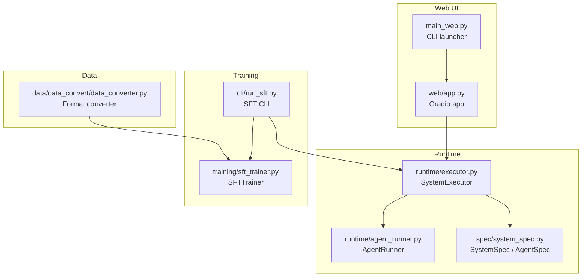
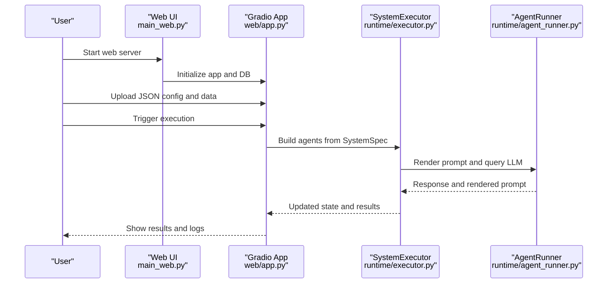
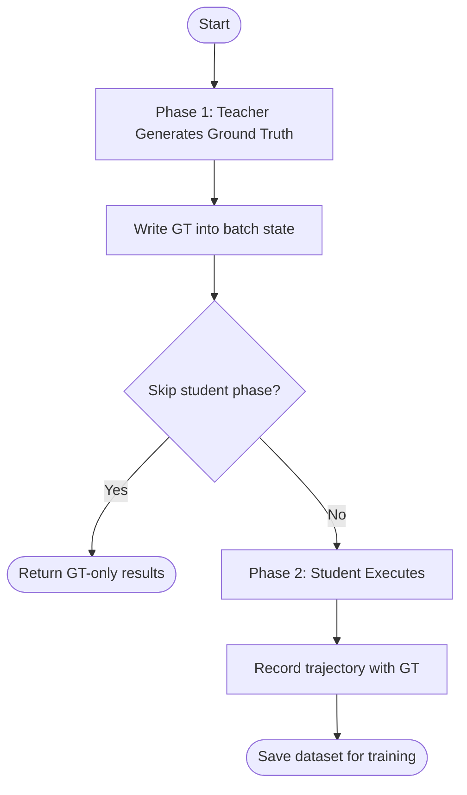
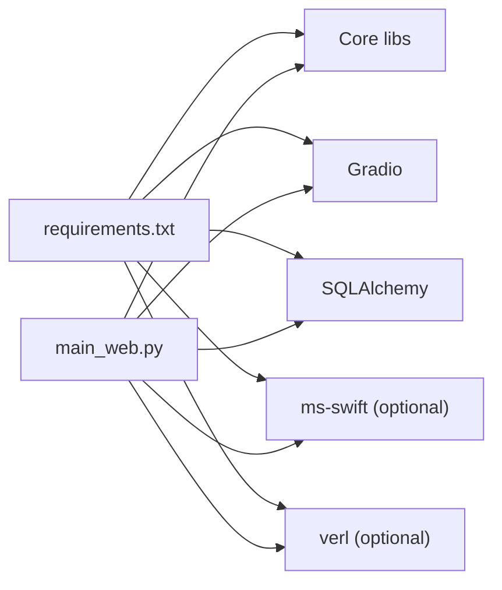

# Getting Started

<cite>
**Referenced Files in This Document**
- [requirements.txt](file://requirements.txt)
- [main_web.py](file://main_web.py)
- [说明文档.txt](file://说明文档.txt)
- [使用流程.txt](file://使用流程.txt)
- [web/app.py](file://web/app.py)
- [cli/run_sft.py](file://cli/run_sft.py)
- [cli/run_infer.py](file://cli/run_infer.py)
- [runtime/executor.py](file://runtime/executor.py)
- [runtime/agent_runner.py](file://runtime/agent_runner.py)
- [spec/system_spec.py](file://spec/system_spec.py)
- [training/sft_trainer.py](file://training/sft_trainer.py)
- [data/data_convert/data_converter.py](file://data/data_convert/data_converter.py)
</cite>

## Table of Contents
1. [Introduction](#introduction)
2. [Project Structure](#project-structure)
3. [Core Components](#core-components)
4. [Architecture Overview](#architecture-overview)
5. [Detailed Component Analysis](#detailed-component-analysis)
6. [Dependency Analysis](#dependency-analysis)
7. [Performance Considerations](#performance-considerations)
8. [Troubleshooting Guide](#troubleshooting-guide)
9. [Conclusion](#conclusion)
10. [Appendices](#appendices)

## Introduction
This guide helps you quickly set up and use the Multi-Agent System Builder. You will:
- Prepare a Python environment and install dependencies
- Create your first JSON configuration
- Launch the web interface and run basic inference
- Understand the end-to-end workflow from JSON to execution
- Explore developer tools for SFT and inference
- Troubleshoot common setup issues

## Project Structure
At a high level, the project consists of:
- Web UI entry and pages for configuration, execution, and training
- Runtime engine that executes multi-agent systems defined by JSON
- CLI tools for SFT and batch inference
- Training integrations and data conversion utilities

**Diagram sources**
- [main_web.py:73-157](file://main_web.py#L73-L157)
- [web/app.py:20-173](file://web/app.py#L20-L173)
- [runtime/executor.py:9-132](file://runtime/executor.py#L9-L132)
- [runtime/agent_runner.py:10-68](file://runtime/agent_runner.py#L10-L68)
- [spec/system_spec.py:100-114](file://spec/system_spec.py#L100-L114)
- [training/sft_trainer.py:9-263](file://training/sft_trainer.py#L9-L263)
- [cli/run_sft.py:17-117](file://cli/run_sft.py#L17-L117)
- [data/data_convert/data_converter.py:10-99](file://data/data_convert/data_converter.py#L10-L99)

**Section sources**
- [main_web.py:19-61](file://main_web.py#L19-L61)
- [web/app.py:20-173](file://web/app.py#L20-L173)
- [requirements.txt:1-19](file://requirements.txt#L1-L19)

## Core Components
- SystemSpec and AgentSpec define the multi-agent system from JSON, including prompts, inputs/outputs, and training configuration.
- SystemExecutor orchestrates execution in two phases for distillation-style SFT: teacher-generated ground truth, then student execution with trajectory recording.
- AgentRunner renders prompts via Jinja2 and queries LLM providers (Qwen/OpenAI).
- SFTTrainer integrates with ms-swift to run supervised fine-tuning.
- CLI tools provide batch inference and SFT workflows.

**Section sources**
- [spec/system_spec.py:77-114](file://spec/system_spec.py#L77-L114)
- [runtime/executor.py:9-132](file://runtime/executor.py#L9-L132)
- [runtime/agent_runner.py:10-68](file://runtime/agent_runner.py#L10-L68)
- [training/sft_trainer.py:9-263](file://training/sft_trainer.py#L9-L263)
- [cli/run_sft.py:17-117](file://cli/run_sft.py#L17-L117)
- [cli/run_infer.py:8-46](file://cli/run_infer.py#L8-L46)

## Architecture Overview
The system is designed around a JSON-defined multi-agent pipeline. The runtime builds a directed execution graph from the JSON, resolves inputs from upstream agents and global state, and records trajectories for training.

**Diagram sources**
- [main_web.py:73-157](file://main_web.py#L73-L157)
- [web/app.py:20-173](file://web/app.py#L20-L173)
- [runtime/executor.py:16-132](file://runtime/executor.py#L16-L132)
- [runtime/agent_runner.py:33-68](file://runtime/agent_runner.py#L33-L68)

## Detailed Component Analysis

### Installation and Environment Setup
- Install dependencies from requirements.txt using pip.
- The web launcher can optionally check and install missing packages automatically, and initialize the database.

Steps:
1. Create and activate a Python virtual environment.
2. Install dependencies: pip install -r requirements.txt
3. Optionally run the web launcher to check/install packages and initialize the database.

Verification:
- Confirm imports for required packages succeed in Python.
- On first run, the web launcher initializes the database and prints a success message.

**Section sources**
- [requirements.txt:1-19](file://requirements.txt#L1-L19)
- [main_web.py:19-70](file://main_web.py#L19-L70)

### Creating Your First JSON Configuration
- The JSON defines agents, their instruction prompts, input/output mappings, and optional training configuration.
- A canonical pattern is plan-inference-check: three agents connected in sequence, with outputs flowing into downstream agents and final outputs returned to the user.

Quick reference:
- Define agent_id, model, instruction_prompt, input mappings, and output mappings.
- For plan-inference-check, connect planner → infer → checker, and route final_answer to the user.

Example guidance:
- See the plan-inference-check example in the documentation file for structure and keys.

**Section sources**
- [说明文档.txt:46-107](file://说明文档.txt#L46-L107)
- [spec/system_spec.py:77-114](file://spec/system_spec.py#L77-L114)

### Launching the Web Interface
- Use the web launcher with optional host/port/share flags.
- The launcher checks dependencies, initializes the database, and starts the Gradio app.

Usage:
- python main_web.py [--host 0.0.0.0] [--port 7860] [--share] [--debug]

What happens:
- Dependency check and optional installation
- Database initialization
- App launch with navigation between Dashboard, Data Manager, Configuration, Execution, and Training

**Section sources**
- [main_web.py:73-157](file://main_web.py#L73-L157)
- [web/app.py:20-173](file://web/app.py#L20-L173)

### Running Basic Inference
- Use the inference CLI to run batch inference with your JSON configuration and input dataset.
- The executor runs agents in order, rendering prompts and collecting outputs into state.

Command:
- python cli/run_infer.py --spec PATH_TO_JSON --input INPUT_JSONL [--gt GT_JSONL]

What it does:
- Loads SystemSpec from JSON
- Reads input samples
- Executes SystemExecutor.run_batch
- Prints completion and saves state

**Section sources**
- [cli/run_infer.py:8-46](file://cli/run_infer.py#L8-L46)
- [runtime/executor.py:16-132](file://runtime/executor.py#L16-L132)

### Understanding the Two-Phase Distillation SFT Workflow
- Phase 1: Teacher model generates ground truth for each agent’s output field.
- Phase 2: Student model executes, and trajectories (including ground truth) are recorded for training.

**Diagram sources**
- [runtime/executor.py:16-132](file://runtime/executor.py#L16-L132)

**Section sources**
- [runtime/executor.py:16-132](file://runtime/executor.py#L16-L132)

### Developer Tools: SFT and Inference CLI
- SFT CLI:
  - Supports loading system spec, generating ground truth, converting trajectories to training data, and launching training via ms-swift.
  - Can accept pre-existing training data or generate it automatically.

- Inference CLI:
  - Runs batch inference with optional ground truth comparison and trajectory recording.

Commands:
- SFT: python cli/run_sft.py --spec SPEC.json --input DATASET.jsonl [--do_train] [--lr LR] [--batch_size N] [--epochs E]
- Inference: python cli/run_infer.py --spec SPEC.json --input INPUT.jsonl [--gt GT.jsonl]

**Section sources**
- [cli/run_sft.py:17-117](file://cli/run_sft.py#L17-L117)
- [cli/run_infer.py:8-46](file://cli/run_infer.py#L8-L46)
- [training/sft_trainer.py:59-140](file://training/sft_trainer.py#L59-L140)

### Data Conversion for Training
- Convert generated trajectories into formats suitable for SWIFT SFT, SWIFT DPO, and VERL GRPO.
- The converter writes outputs under data/rollouts/.

Command:
- python data/data_convert/data_converter.py

Outputs:
- swift_sft_format.jsonl
- swift_dpo_format.jsonl
- verl_grpo_format.jsonl

**Section sources**
- [data/data_convert/data_converter.py:10-99](file://data/data_convert/data_converter.py#L10-L99)

## Dependency Analysis
The project relies on:
- Core: pydantic, networkx, jinja2, PyYAML, httpx, openai, numpy
- Web UI: gradio
- Database: sqlalchemy
- Optional training: ms-swift (for API), verl (for GRPO)

**Diagram sources**
- [requirements.txt:1-19](file://requirements.txt#L1-L19)
- [main_web.py:19-61](file://main_web.py#L19-L61)

**Section sources**
- [requirements.txt:1-19](file://requirements.txt#L1-L19)
- [main_web.py:19-61](file://main_web.py#L19-L61)

## Performance Considerations
- Batch inference and training benefit from larger batch sizes and appropriate gradient accumulation.
- Use FP16 and cosine scheduling for efficient training.
- Keep prompts concise and avoid excessive context length to reduce latency.
- Prefer local storage for datasets and outputs to minimize I/O overhead.

[No sources needed since this section provides general guidance]

## Troubleshooting Guide
Common issues and fixes:
- Missing dependencies
  - Install with pip install -r requirements.txt
  - Alternatively, run the web launcher with --no-install to skip automatic installs and handle manually
- Import errors for ms-swift or verl
  - These are optional; the system falls back to command-line training if not installed
- Database initialization failures
  - Ensure write permissions in the working directory; the launcher prints the database path on success
- LLM provider configuration
  - AgentRunner supports Qwen and OpenAI providers; confirm model names and provider fields match your setup
- Web app not starting
  - Try different host/port or use --share to expose locally
- SFT training not launching
  - Verify swift binary availability or use ms-swift Python API if installed

Verification steps:
- Run a small inference job with a minimal JSON and tiny dataset
- Confirm trajectory recording and dataset generation
- Check that the web UI loads pages and connects to the database

**Section sources**
- [main_web.py:19-70](file://main_web.py#L19-L70)
- [runtime/agent_runner.py:14-31](file://runtime/agent_runner.py#L14-L31)
- [training/sft_trainer.py:152-219](file://training/sft_trainer.py#L152-L219)

## Conclusion
You now have the essentials to install the system, define a multi-agent configuration, run inference via CLI or the web UI, and prepare for SFT using the provided tools. Start with the plan-inference-check example, iterate on JSON structure, and leverage the CLI and web interface to validate your setup.

[No sources needed since this section summarizes without analyzing specific files]

## Appendices

### Quick Start Checklist
- [ ] Install dependencies from requirements.txt
- [ ] Prepare a JSON configuration (e.g., plan-inference-check)
- [ ] Launch the web UI and initialize database
- [ ] Run batch inference with cli/run_infer.py
- [ ] Generate training data and run SFT via cli/run_sft.py
- [ ] Convert formats for SWIFT/VERL if needed

### Example Reference
- Plan-inference-check example structure and guidance are documented in the project documentation file.

**Section sources**
- [说明文档.txt:46-107](file://说明文档.txt#L46-L107)