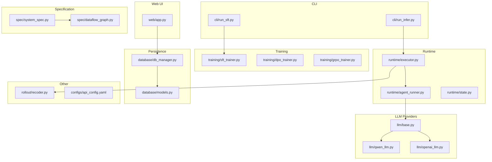
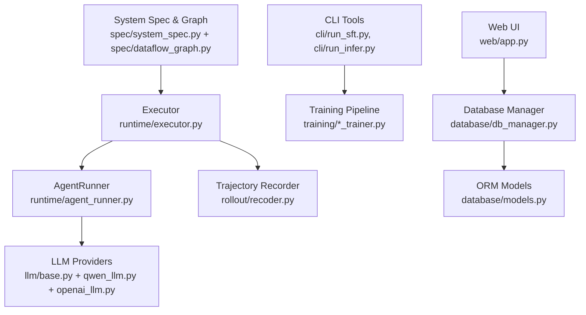
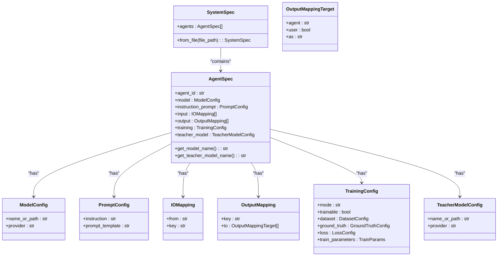
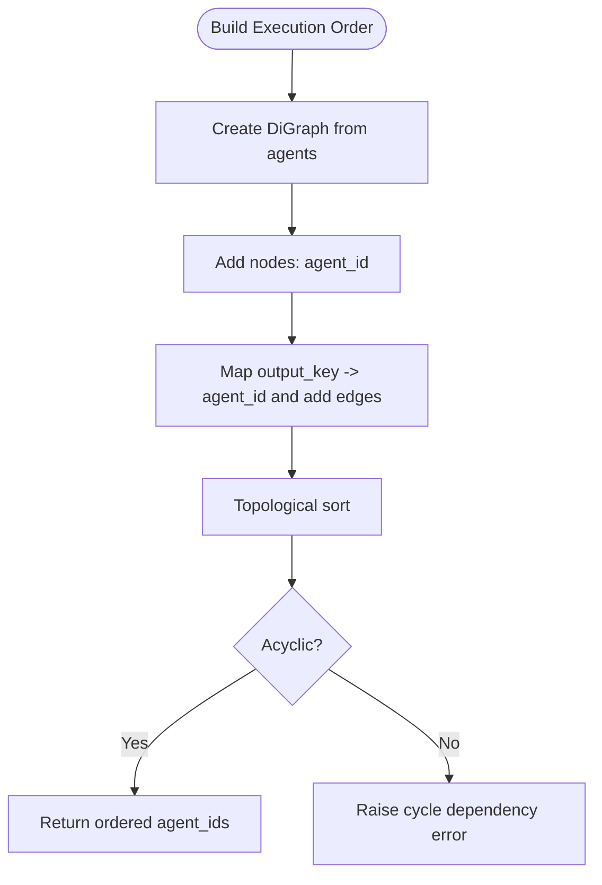
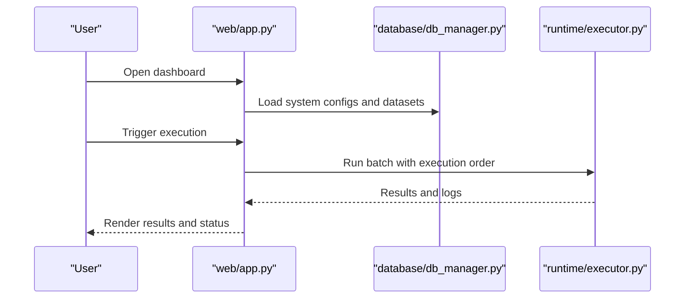
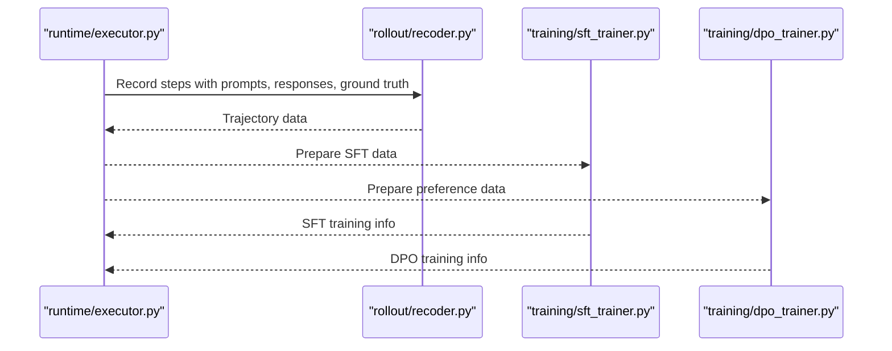
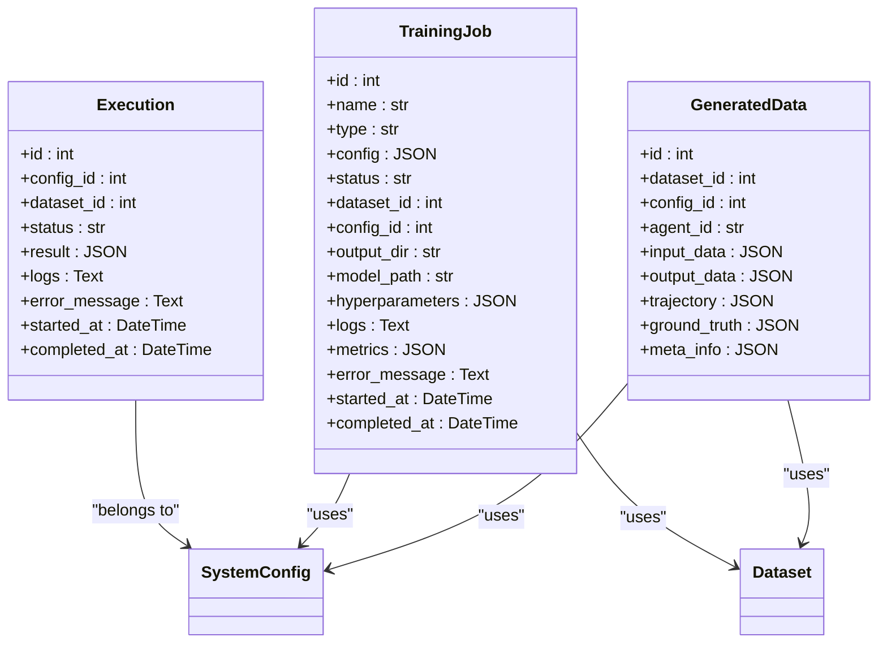
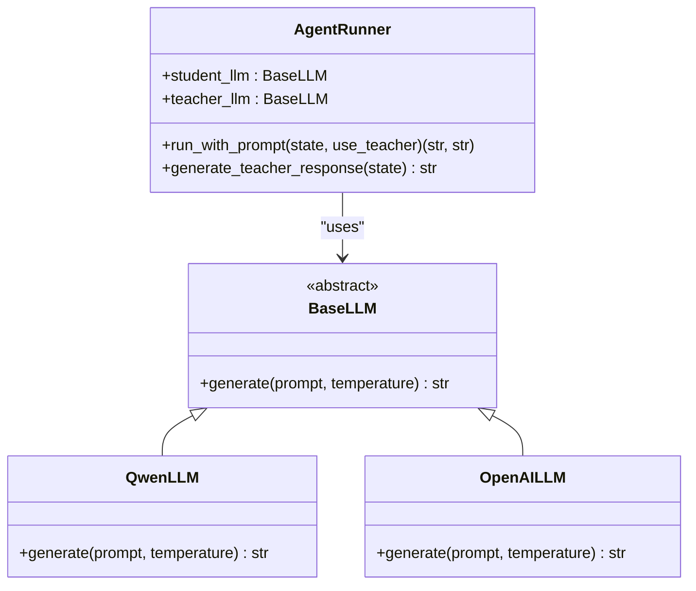
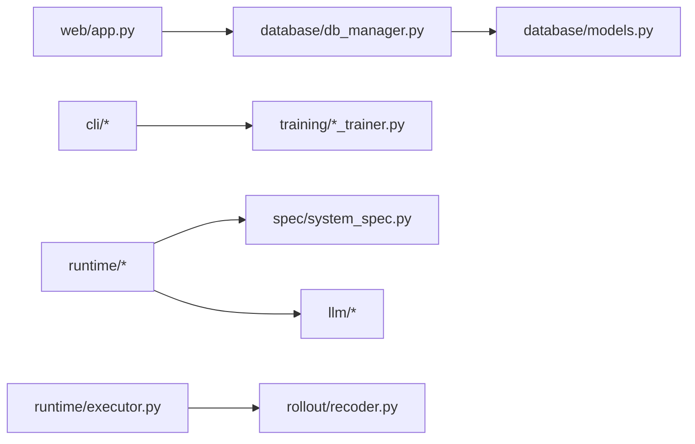

# Key Features

<cite>
**Referenced Files in This Document**
- [main_web.py](file://main_web.py)
- [web/app.py](file://web/app.py)
- [cli/run_sft.py](file://cli/run_sft.py)
- [cli/run_infer.py](file://cli/run_infer.py)
- [spec/system_spec.py](file://spec/system_spec.py)
- [spec/dataflow_graph.py](file://spec/dataflow_graph.py)
- [runtime/executor.py](file://runtime/executor.py)
- [runtime/agent_runner.py](file://runtime/agent_runner.py)
- [runtime/state.py](file://runtime/state.py)
- [llm/base.py](file://llm/base.py)
- [llm/qwen_llm.py](file://llm/qwen_llm.py)
- [llm/openai_llm.py](file://llm/openai_llm.py)
- [training/sft_trainer.py](file://training/sft_trainer.py)
- [training/dpo_trainer.py](file://training/dpo_trainer.py)
- [training/grpo_trainer.py](file://training/grpo_trainer.py)
- [database/db_manager.py](file://database/db_manager.py)
- [database/models.py](file://database/models.py)
- [rollout/recoder.py](file://rollout/recoder.py)
- [configs/api_config.yaml](file://configs/api_config.yaml)
</cite>

## Table of Contents
1. [Introduction](#introduction)
2. [Project Structure](#project-structure)
3. [Core Components](#core-components)
4. [Architecture Overview](#architecture-overview)
5. [Detailed Component Analysis](#detailed-component-analysis)
6. [Dependency Analysis](#dependency-analysis)
7. [Performance Considerations](#performance-considerations)
8. [Troubleshooting Guide](#troubleshooting-guide)
9. [Conclusion](#conclusion)
10. [Appendices](#appendices)

## Introduction
This document presents the key features of the Multi-Agent System Builder, focusing on:
- JSON-based multi-agent configuration that eliminates custom glue code
- Automatic dependency validation and execution ordering via NetworkX graph algorithms
- Dual-interface approach: a web-based dashboard for non-technical users and CLI tools for developers
- Integrated training pipeline supporting SFT, DPO, and GRPO methodologies
- Real-time execution monitoring and logging
- Database-backed persistence for configurations and training data
- Pluggable LLM provider architecture supporting Qwen and OpenAI integrations

## Project Structure
The project is organized into feature-focused packages:
- web: Gradio-based dashboard with navigation and page components
- cli: Developer CLI tools for training and inference
- spec: System specification models and dataflow graph builder
- runtime: Agent execution engine and state management
- llm: Pluggable LLM providers (Qwen, OpenAI)
- training: Training pipeline modules (SFT, DPO, GRPO)
- database: SQLAlchemy models and manager for persistence
- rollout: Trajectory recording for training data preparation
- configs: Provider configuration file

**Diagram sources**
- [web/app.py:1-173](file://web/app.py#L1-L173)
- [cli/run_sft.py](file://cli/run_sft.py)
- [cli/run_infer.py](file://cli/run_infer.py)
- [spec/system_spec.py:1-114](file://spec/system_spec.py#L1-L114)
- [spec/dataflow_graph.py:1-32](file://spec/dataflow_graph.py#L1-L32)
- [runtime/executor.py:1-132](file://runtime/executor.py#L1-L132)
- [runtime/agent_runner.py:1-68](file://runtime/agent_runner.py#L1-L68)
- [runtime/state.py:1-8](file://runtime/state.py#L1-L8)
- [llm/base.py:1-6](file://llm/base.py#L1-L6)
- [llm/qwen_llm.py:1-51](file://llm/qwen_llm.py#L1-L51)
- [llm/openai_llm.py:1-49](file://llm/openai_llm.py#L1-L49)
- [training/sft_trainer.py:1-263](file://training/sft_trainer.py#L1-L263)
- [training/dpo_trainer.py:1-320](file://training/dpo_trainer.py#L1-L320)
- [training/grpo_trainer.py](file://training/grpo_trainer.py)
- [database/db_manager.py:1-347](file://database/db_manager.py#L1-L347)
- [database/models.py:1-123](file://database/models.py#L1-L123)
- [rollout/recoder.py](file://rollout/recoder.py)
- [configs/api_config.yaml](file://configs/api_config.yaml)

**Section sources**
- [main_web.py:1-158](file://main_web.py#L1-L158)
- [web/app.py:1-173](file://web/app.py#L1-L173)

## Core Components
- JSON-based system specification: Strongly-typed models define agents, prompts, IO mappings, training, and teacher models. The system loads configurations from JSON and validates them against Pydantic models.
- Execution engine: Two-phase execution (Phase 1: teacher generates ground truth; Phase 2: student runs and records trajectories) with optional trajectory recording for downstream training.
- LLM provider abstraction: Base interface plus Qwen and OpenAI implementations; provider selection is configurable per agent and teacher model.
- Training pipeline: SFT and DPO trainers integrate with ms-swift; GRPO trainer module exists conceptually. Data preparation converts trajectories into training-ready formats.
- Persistence: SQLite-backed ORM models for datasets, system configs, generated trajectories, executions, and training jobs.
- Web dashboard: Navigation among dashboard, data management, JSON config editor, execution flow, and training management pages.
- CLI tools: Dedicated scripts for SFT training and inference execution.

**Section sources**
- [spec/system_spec.py:1-114](file://spec/system_spec.py#L1-L114)
- [runtime/executor.py:1-132](file://runtime/executor.py#L1-L132)
- [runtime/agent_runner.py:1-68](file://runtime/agent_runner.py#L1-L68)
- [llm/base.py:1-6](file://llm/base.py#L1-L6)
- [llm/qwen_llm.py:1-51](file://llm/qwen_llm.py#L1-L51)
- [llm/openai_llm.py:1-49](file://llm/openai_llm.py#L1-L49)
- [training/sft_trainer.py:1-263](file://training/sft_trainer.py#L1-L263)
- [training/dpo_trainer.py:1-320](file://training/dpo_trainer.py#L1-L320)
- [database/db_manager.py:1-347](file://database/db_manager.py#L1-L347)
- [database/models.py:1-123](file://database/models.py#L1-L123)
- [web/app.py:1-173](file://web/app.py#L1-L173)
- [cli/run_sft.py](file://cli/run_sft.py)
- [cli/run_infer.py](file://cli/run_infer.py)

## Architecture Overview
The system separates concerns across specification, runtime, LLM providers, training, persistence, and presentation layers. The web UI orchestrates database-backed workflows, while CLI tools target developer-centric automation.

**Diagram sources**
- [web/app.py:1-173](file://web/app.py#L1-L173)
- [database/db_manager.py:1-347](file://database/db_manager.py#L1-L347)
- [cli/run_sft.py](file://cli/run_sft.py)
- [cli/run_infer.py](file://cli/run_infer.py)
- [runtime/executor.py:1-132](file://runtime/executor.py#L1-L132)
- [runtime/agent_runner.py:1-68](file://runtime/agent_runner.py#L1-L68)
- [llm/base.py:1-6](file://llm/base.py#L1-L6)
- [llm/qwen_llm.py:1-51](file://llm/qwen_llm.py#L1-L51)
- [llm/openai_llm.py:1-49](file://llm/openai_llm.py#L1-L49)
- [training/sft_trainer.py:1-263](file://training/sft_trainer.py#L1-L263)
- [training/dpo_trainer.py:1-320](file://training/dpo_trainer.py#L1-L320)
- [database/models.py:1-123](file://database/models.py#L1-L123)

## Detailed Component Analysis

### JSON-Based Multi-Agent Configuration
- Defines agents with model/provider, instruction prompt, input/output mappings, optional training and teacher model configuration.
- Provides a loader to instantiate strongly-typed agent specs from JSON.
- Enables non-programmers to define systems via JSON without writing glue code.

**Diagram sources**
- [spec/system_spec.py:1-114](file://spec/system_spec.py#L1-L114)

**Section sources**
- [spec/system_spec.py:1-114](file://spec/system_spec.py#L1-L114)

### Automatic Dependency Validation and Execution Ordering
- Builds a directed acyclic graph (DAG) from agent output keys and input dependencies.
- Uses NetworkX topological sort to derive safe execution order.
- Detects cycles and raises explicit errors to prevent invalid configurations.

**Diagram sources**
- [spec/dataflow_graph.py:1-32](file://spec/dataflow_graph.py#L1-L32)

**Section sources**
- [spec/dataflow_graph.py:1-32](file://spec/dataflow_graph.py#L1-L32)

### Dual-Interface Approach: Web Dashboard and CLI
- Web UI: Centralized navigation among dashboard, data management, JSON configuration editor, execution flow, and training management. Pages are composed in a single app factory.
- CLI: Separate scripts for SFT training and inference execution, enabling automation and developer workflows.

**Diagram sources**
- [web/app.py:1-173](file://web/app.py#L1-L173)
- [database/db_manager.py:1-347](file://database/db_manager.py#L1-L347)
- [runtime/executor.py:1-132](file://runtime/executor.py#L1-L132)

**Section sources**
- [web/app.py:1-173](file://web/app.py#L1-L173)
- [main_web.py:1-158](file://main_web.py#L1-L158)
- [cli/run_sft.py](file://cli/run_sft.py)
- [cli/run_infer.py](file://cli/run_infer.py)

### Integrated Training Pipeline (SFT, DPO, GRPO)
- SFTTrainer: Converts trajectories to instruction-output pairs and prepares training commands/API calls using ms-swift.
- DPOTrainer: Prepares preference pairs (chosen/rejected) from trajectories or external pairs and supports ms-swift CLI/API.
- GRPOTrainer: Module present for future integration.

**Diagram sources**
- [runtime/executor.py:1-132](file://runtime/executor.py#L1-L132)
- [rollout/recoder.py](file://rollout/recoder.py)
- [training/sft_trainer.py:1-263](file://training/sft_trainer.py#L1-L263)
- [training/dpo_trainer.py:1-320](file://training/dpo_trainer.py#L1-L320)

**Section sources**
- [training/sft_trainer.py:1-263](file://training/sft_trainer.py#L1-L263)
- [training/dpo_trainer.py:1-320](file://training/dpo_trainer.py#L1-L320)
- [training/grpo_trainer.py](file://training/grpo_trainer.py)

### Real-Time Execution Monitoring and Logging
- Execution records track status, timestamps, logs, and errors.
- Training jobs persist status, logs, metrics, and outputs.
- The executor prints phase-specific progress and step-level logs during runs.

**Diagram sources**
- [database/models.py:1-123](file://database/models.py#L1-L123)
- [database/db_manager.py:1-347](file://database/db_manager.py#L1-L347)

**Section sources**
- [database/db_manager.py:1-347](file://database/db_manager.py#L1-L347)
- [database/models.py:1-123](file://database/models.py#L1-L123)
- [runtime/executor.py:1-132](file://runtime/executor.py#L1-L132)

### Database-Backed Persistence
- Stores datasets, system configurations, generated trajectories, executions, and training jobs.
- Provides CRUD operations and status updates for monitoring and auditing.

**Section sources**
- [database/db_manager.py:1-347](file://database/db_manager.py#L1-L347)
- [database/models.py:1-123](file://database/models.py#L1-L123)

### Pluggable LLM Provider Architecture
- Base interface defines a generate method.
- Qwen and OpenAI providers implement the interface, loading credentials and base URLs from a shared configuration file.
- AgentRunner selects provider dynamically based on agent configuration.

**Diagram sources**
- [llm/base.py:1-6](file://llm/base.py#L1-L6)
- [llm/qwen_llm.py:1-51](file://llm/qwen_llm.py#L1-L51)
- [llm/openai_llm.py:1-49](file://llm/openai_llm.py#L1-L49)
- [runtime/agent_runner.py:1-68](file://runtime/agent_runner.py#L1-L68)

**Section sources**
- [llm/base.py:1-6](file://llm/base.py#L1-L6)
- [llm/qwen_llm.py:1-51](file://llm/qwen_llm.py#L1-L51)
- [llm/openai_llm.py:1-49](file://llm/openai_llm.py#L1-L49)
- [runtime/agent_runner.py:1-68](file://runtime/agent_runner.py#L1-L68)
- [configs/api_config.yaml](file://configs/api_config.yaml)

### Practical Examples and Common Use Cases
- Non-technical user (Dashboard):
  - Upload and validate JSON configuration
  - Visualize execution flow and monitor runs
  - Manage datasets and training jobs
- Developer (CLI):
  - Run SFT training with prepared trajectories
  - Execute inference batches with teacher/student phases
- Both:
  - Switch providers (Qwen/OpenAI) per agent
  - Persist and audit runs and training jobs

[No sources needed since this section aggregates usage patterns without analyzing specific files]

## Dependency Analysis
The system exhibits layered cohesion with clear boundaries:
- Web UI depends on database manager and page components
- Runtime depends on specification and LLM providers
- Training pipeline depends on rollout outputs and external frameworks
- Persistence underpins all workflows

**Diagram sources**
- [web/app.py:1-173](file://web/app.py#L1-L173)
- [database/db_manager.py:1-347](file://database/db_manager.py#L1-L347)
- [runtime/executor.py:1-132](file://runtime/executor.py#L1-L132)
- [runtime/agent_runner.py:1-68](file://runtime/agent_runner.py#L1-L68)
- [spec/system_spec.py:1-114](file://spec/system_spec.py#L1-L114)
- [llm/base.py:1-6](file://llm/base.py#L1-L6)
- [llm/qwen_llm.py:1-51](file://llm/qwen_llm.py#L1-L51)
- [llm/openai_llm.py:1-49](file://llm/openai_llm.py#L1-L49)
- [training/sft_trainer.py:1-263](file://training/sft_trainer.py#L1-L263)
- [training/dpo_trainer.py:1-320](file://training/dpo_trainer.py#L1-L320)
- [database/models.py:1-123](file://database/models.py#L1-L123)

**Section sources**
- [web/app.py:1-173](file://web/app.py#L1-L173)
- [database/db_manager.py:1-347](file://database/db_manager.py#L1-L347)
- [runtime/executor.py:1-132](file://runtime/executor.py#L1-L132)
- [runtime/agent_runner.py:1-68](file://runtime/agent_runner.py#L1-L68)
- [spec/system_spec.py:1-114](file://spec/system_spec.py#L1-L114)
- [llm/base.py:1-6](file://llm/base.py#L1-L6)
- [llm/qwen_llm.py:1-51](file://llm/qwen_llm.py#L1-L51)
- [llm/openai_llm.py:1-49](file://llm/openai_llm.py#L1-L49)
- [training/sft_trainer.py:1-263](file://training/sft_trainer.py#L1-L263)
- [training/dpo_trainer.py:1-320](file://training/dpo_trainer.py#L1-L320)
- [database/models.py:1-123](file://database/models.py#L1-L123)

## Performance Considerations
- Two-phase execution ensures deterministic ground-truth generation before student training data collection.
- NetworkX-based ordering prevents redundant recomputation and avoids cycles.
- SQLite provides local persistence; consider migration to a robust RDBMS for high-throughput deployments.
- LLM calls are synchronous; consider batching and rate-limiting for production workloads.

[No sources needed since this section provides general guidance]

## Troubleshooting Guide
- Encoding errors in LLM clients: Both Qwen and OpenAI providers explicitly set HTTP client headers to avoid encoding issues originating from environment variables.
- Dependency installation: Web launcher checks and installs required packages automatically.
- Execution failures: Execution and training job records capture logs and error messages for diagnosis.
- Circular dependencies: Dataflow graph builder raises explicit errors when cycles are detected.

**Section sources**
- [llm/qwen_llm.py:1-51](file://llm/qwen_llm.py#L1-L51)
- [llm/openai_llm.py:1-49](file://llm/openai_llm.py#L1-L49)
- [main_web.py:1-158](file://main_web.py#L1-L158)
- [database/db_manager.py:1-347](file://database/db_manager.py#L1-L347)
- [spec/dataflow_graph.py:1-32](file://spec/dataflow_graph.py#L1-L32)

## Conclusion
The Multi-Agent System Builder offers a cohesive platform:
- JSON-first configuration eliminates glue code
- Automatic dependency validation ensures safe execution
- Dual interfaces serve both non-technical users and developers
- Integrated training pipeline supports modern alignment methods
- Robust persistence and monitoring enable reproducible workflows
- Pluggable LLM providers support diverse provider ecosystems

[No sources needed since this section summarizes without analyzing specific files]

## Appendices
- Example JSON configuration paths: [spec/system_spec.py:104-108](file://spec/system_spec.py#L104-L108)
- Provider configuration file: [configs/api_config.yaml](file://configs/api_config.yaml)
- CLI entry points: [cli/run_sft.py](file://cli/run_sft.py), [cli/run_infer.py](file://cli/run_infer.py)
- Web startup and dependencies: [main_web.py:19-61](file://main_web.py#L19-L61)

[No sources needed since this section lists references without analysis]