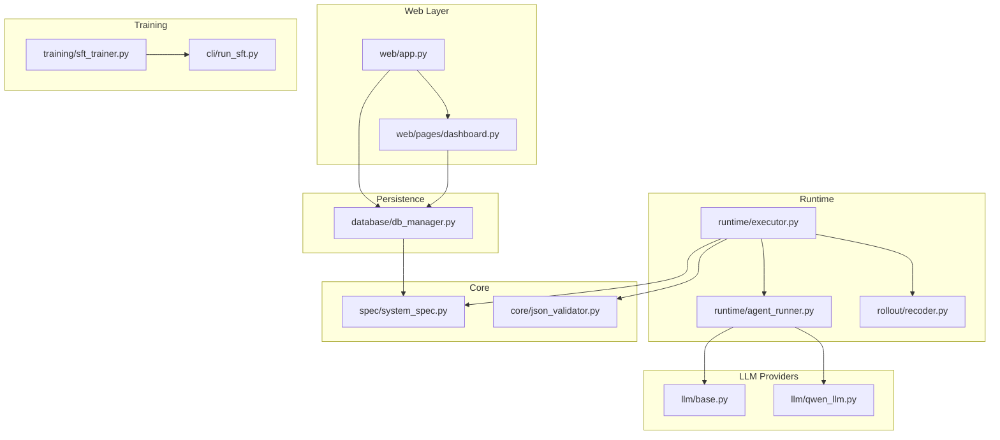
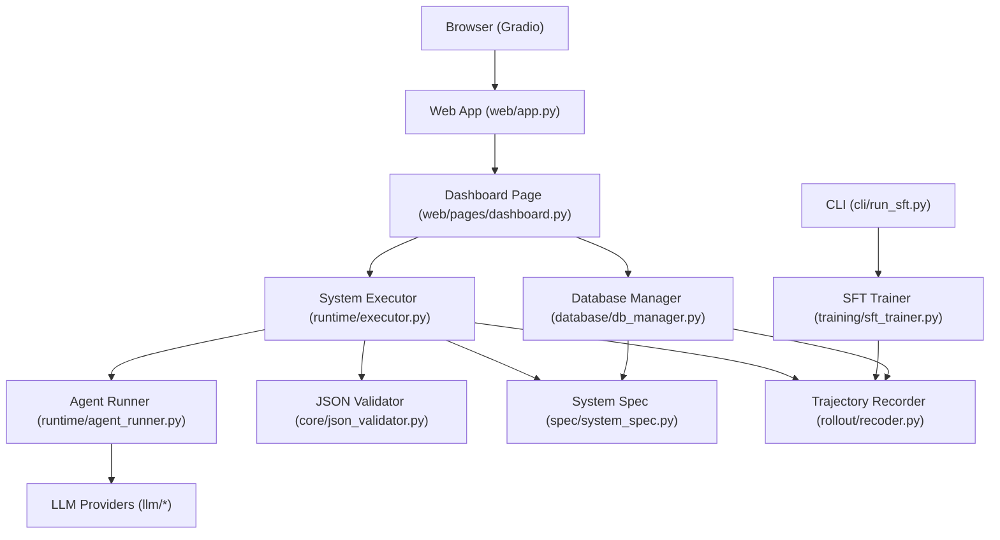
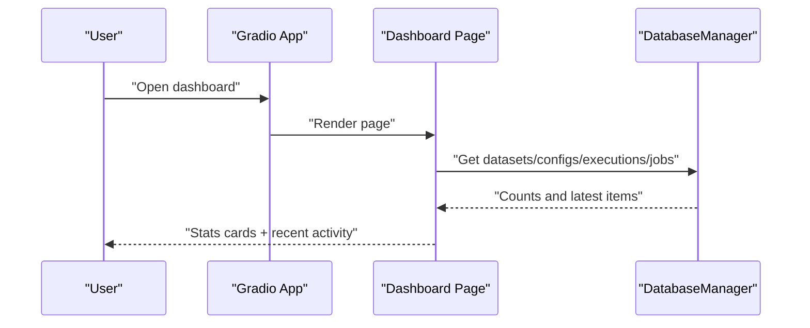
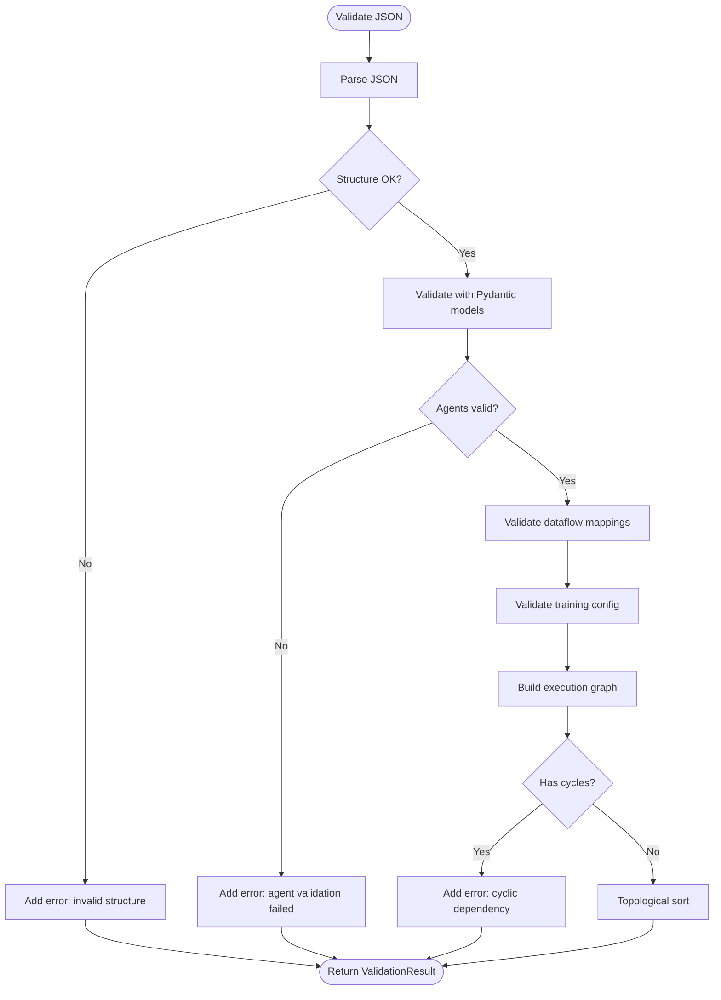
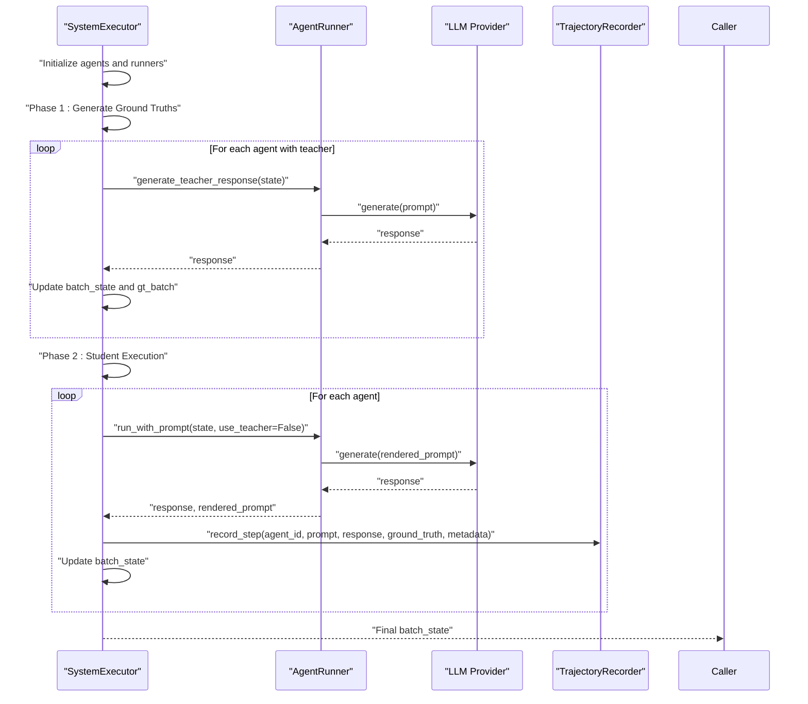
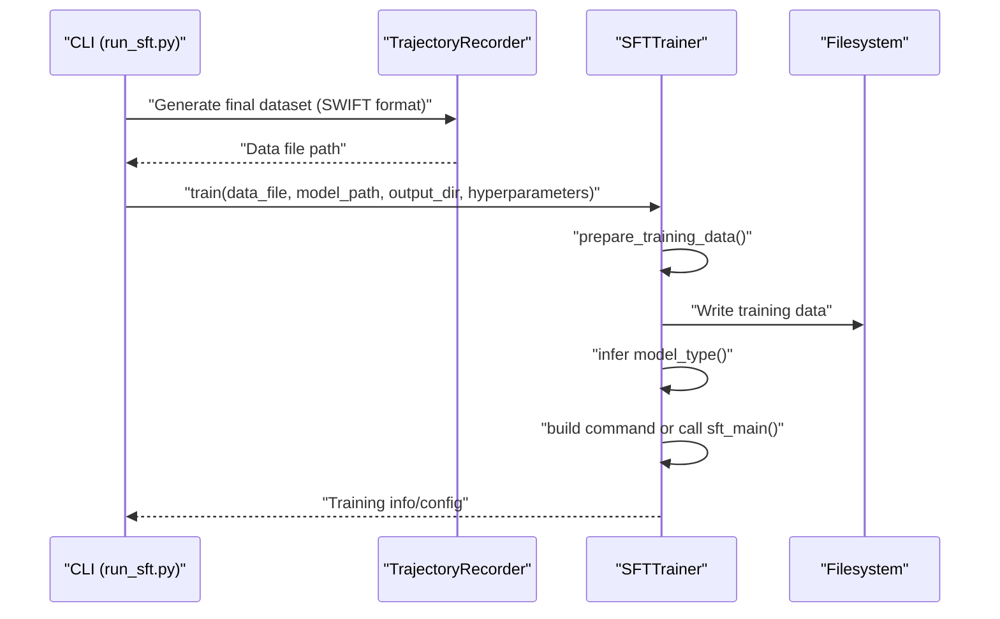
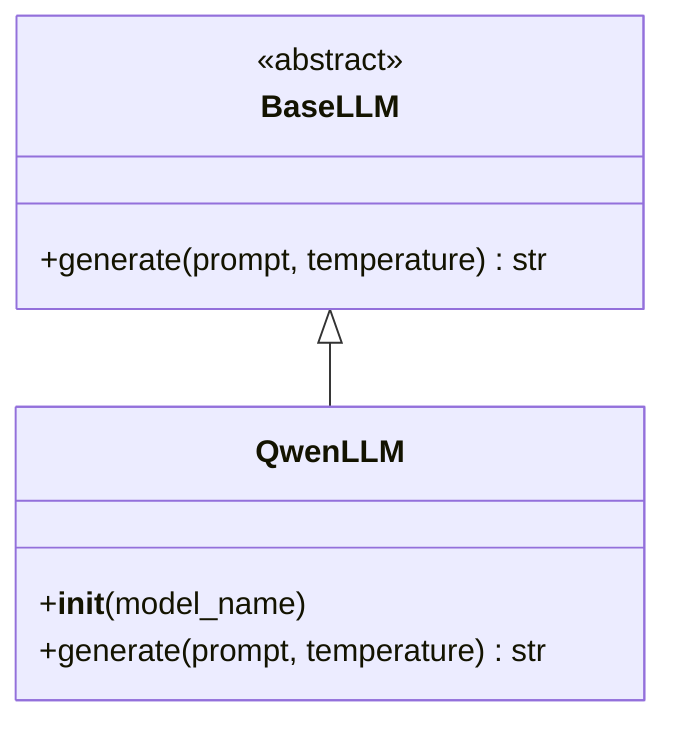
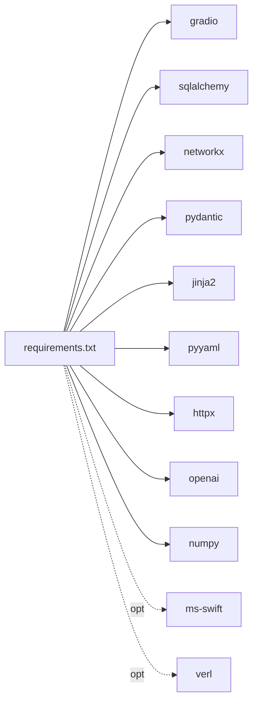

# Project Overview

<cite>
**Referenced Files in This Document**
- [main_web.py](file://main_web.py)
- [web/app.py](file://web/app.py)
- [web/pages/dashboard.py](file://web/pages/dashboard.py)
- [database/db_manager.py](file://database/db_manager.py)
- [spec/system_spec.py](file://spec/system_spec.py)
- [core/json_validator.py](file://core/json_validator.py)
- [runtime/executor.py](file://runtime/executor.py)
- [runtime/agent_runner.py](file://runtime/agent_runner.py)
- [rollout/recoder.py](file://rollout/recoder.py)
- [training/sft_trainer.py](file://training/sft_trainer.py)
- [cli/run_sft.py](file://cli/run_sft.py)
- [llm/base.py](file://llm/base.py)
- [llm/qwen_llm.py](file://llm/qwen_llm.py)
- [requirements.txt](file://requirements.txt)
- [说明文档.txt](file://说明文档.txt)
- [使用流程.txt](file://使用流程.txt)
</cite>

## Table of Contents
1. [Introduction](#introduction)
2. [Project Structure](#project-structure)
3. [Core Components](#core-components)
4. [Architecture Overview](#architecture-overview)
5. [Detailed Component Analysis](#detailed-component-analysis)
6. [Dependency Analysis](#dependency-analysis)
7. [Performance Considerations](#performance-considerations)
8. [Troubleshooting Guide](#troubleshooting-guide)
9. [Conclusion](#conclusion)
10. [Appendices](#appendices)

## Introduction
Multi-Agent System Builder is a full-stack application designed to let users define, validate, execute, and train multi-agent workflows entirely via JSON configurations. It targets two distinct audiences:
- Non-technical users who want a guided, web-based dashboard to upload data, manage configurations, visualize execution flows, and monitor training.
- Developers and researchers who need command-line tools for automation, scripting, and advanced training integrations.

Key capabilities include:
- Web-based dashboard for onboarding and daily operations
- Command-line tools for repeatable, automated workflows
- SQLite-backed persistence for datasets, configurations, executions, and training jobs
- Integrated training pipeline supporting system-level SFT and GRPO/DPO-style training
- Real-time execution monitoring and trajectory recording for reproducible research

The platform differs from traditional AI applications by treating the multi-agent system as a first-class system specification, enabling system-level supervision and reinforcement signals across agents and steps.

## Project Structure
The repository is organized into feature-focused packages:
- web: Gradio-based UI with modular pages (dashboard, data manager, JSON config editor, execution flow, training)
- database: SQLAlchemy models and manager for SQLite persistence
- spec: Pydantic models defining the system specification and agent schema
- core: Validation engine for JSON specs and dataflow graph construction
- runtime: Execution engine orchestrating agents, rendering prompts, and collecting trajectories
- rollout: Trajectory recorder for SFT/GRPO training data
- training: SFT trainer integrating with ms-swift
- cli: Command-line entry points for training automation
- llm: Pluggable LLM providers (Qwen/OpenAI-compatible)
- data: Storage for uploads and generated rollouts
- configs: API configuration for LLM providers

**Diagram sources**
- [web/app.py:1-173](file://web/app.py#L1-L173)
- [web/pages/dashboard.py:1-140](file://web/pages/dashboard.py#L1-L140)
- [runtime/executor.py:1-132](file://runtime/executor.py#L1-L132)
- [runtime/agent_runner.py:1-68](file://runtime/agent_runner.py#L1-L68)
- [rollout/recoder.py:1-122](file://rollout/recoder.py#L1-L122)
- [training/sft_trainer.py:1-263](file://training/sft_trainer.py#L1-L263)
- [cli/run_sft.py:1-117](file://cli/run_sft.py#L1-L117)
- [spec/system_spec.py:1-114](file://spec/system_spec.py#L1-L114)
- [core/json_validator.py:1-347](file://core/json_validator.py#L1-L347)
- [database/db_manager.py:1-347](file://database/db_manager.py#L1-L347)
- [llm/base.py:1-6](file://llm/base.py#L1-L6)
- [llm/qwen_llm.py:1-51](file://llm/qwen_llm.py#L1-L51)

**Section sources**
- [main_web.py:1-158](file://main_web.py#L1-L158)
- [web/app.py:1-173](file://web/app.py#L1-L173)
- [database/db_manager.py:1-347](file://database/db_manager.py#L1-L347)
- [spec/system_spec.py:1-114](file://spec/system_spec.py#L1-L114)
- [core/json_validator.py:1-347](file://core/json_validator.py#L1-L347)
- [runtime/executor.py:1-132](file://runtime/executor.py#L1-L132)
- [runtime/agent_runner.py:1-68](file://runtime/agent_runner.py#L1-L68)
- [rollout/recoder.py:1-122](file://rollout/recoder.py#L1-L122)
- [training/sft_trainer.py:1-263](file://training/sft_trainer.py#L1-L263)
- [cli/run_sft.py:1-117](file://cli/run_sft.py#L1-L117)
- [llm/base.py:1-6](file://llm/base.py#L1-L6)
- [llm/qwen_llm.py:1-51](file://llm/qwen_llm.py#L1-L51)
- [requirements.txt:1-19](file://requirements.txt#L1-L19)

## Core Components
- System Specification (Pydantic models): Defines agent schemas, I/O mappings, training configuration, and model/provider settings.
- JSON Validator: Validates structure, dataflow connectivity, training modes, and detects cyclic dependencies; produces execution order and dataflow graph.
- Runtime Executor: Orchestrates batch execution with two-phase distillation (teacher-generated ground truths, followed by student execution and trajectory recording).
- Agent Runner: Renders prompts using Jinja2 templates and invokes LLM providers (Qwen/OpenAI-compatible).
- Trajectory Recorder: Writes step-wise rollouts to JSONL for downstream training.
- Training Pipeline: Integrates with ms-swift for SFT; supports configurable hyperparameters and model-type inference.
- Web Dashboard: Provides navigation, statistics, and links to data/config/execution/training workflows.
- Database Manager: Centralized SQLite persistence for datasets, system configs, generated data, executions, and training jobs.

**Section sources**
- [spec/system_spec.py:1-114](file://spec/system_spec.py#L1-L114)
- [core/json_validator.py:1-347](file://core/json_validator.py#L1-L347)
- [runtime/executor.py:1-132](file://runtime/executor.py#L1-L132)
- [runtime/agent_runner.py:1-68](file://runtime/agent_runner.py#L1-L68)
- [rollout/recoder.py:1-122](file://rollout/recoder.py#L1-L122)
- [training/sft_trainer.py:1-263](file://training/sft_trainer.py#L1-L263)
- [web/pages/dashboard.py:1-140](file://web/pages/dashboard.py#L1-L140)
- [database/db_manager.py:1-347](file://database/db_manager.py#L1-L347)

## Architecture Overview
The system follows a layered architecture:
- Presentation: Gradio web app with modular pages
- Application: Orchestration of validation, execution, and training
- Domain: System specification and dataflow semantics
- Persistence: SQLite via SQLAlchemy ORM
- Integration: LLM providers and ms-swift training framework

**Diagram sources**
- [web/app.py:1-173](file://web/app.py#L1-L173)
- [web/pages/dashboard.py:1-140](file://web/pages/dashboard.py#L1-L140)
- [database/db_manager.py:1-347](file://database/db_manager.py#L1-L347)
- [runtime/executor.py:1-132](file://runtime/executor.py#L1-L132)
- [runtime/agent_runner.py:1-68](file://runtime/agent_runner.py#L1-L68)
- [core/json_validator.py:1-347](file://core/json_validator.py#L1-L347)
- [spec/system_spec.py:1-114](file://spec/system_spec.py#L1-L114)
- [rollout/recoder.py:1-122](file://rollout/recoder.py#L1-L122)
- [training/sft_trainer.py:1-263](file://training/sft_trainer.py#L1-L263)
- [cli/run_sft.py:1-117](file://cli/run_sft.py#L1-L117)
- [llm/base.py:1-6](file://llm/base.py#L1-L6)
- [llm/qwen_llm.py:1-51](file://llm/qwen_llm.py#L1-L51)

## Detailed Component Analysis

### Web Dashboard and Navigation
The dashboard aggregates system statistics, provides quick actions, and lists recent activities. It integrates with the database manager to fetch counts and statuses.

**Diagram sources**
- [web/pages/dashboard.py:1-140](file://web/pages/dashboard.py#L1-L140)
- [database/db_manager.py:1-347](file://database/db_manager.py#L1-L347)

**Section sources**
- [web/pages/dashboard.py:1-140](file://web/pages/dashboard.py#L1-L140)
- [database/db_manager.py:1-347](file://database/db_manager.py#L1-L347)

### JSON Validation and Dataflow Graph
The validator parses JSON, validates structure and agent schemas, checks dataflow connections, ensures training configuration correctness, and computes an execution order using topological sort. It also builds a dataflow graph for visualization.

**Diagram sources**
- [core/json_validator.py:1-347](file://core/json_validator.py#L1-L347)
- [spec/system_spec.py:1-114](file://spec/system_spec.py#L1-L114)

**Section sources**
- [core/json_validator.py:1-347](file://core/json_validator.py#L1-L347)
- [spec/system_spec.py:1-114](file://spec/system_spec.py#L1-L114)

### Two-Phase Distillation Execution
The executor runs a two-phase process aligned with SFT implementation guidelines:
- Phase 1: Teacher model generates ground truths for agents configured with a teacher model; updates batch state for subsequent agents.
- Phase 2: Student model executes, renders prompts, collects responses, and records trajectories with metadata and optional ground truths.

**Diagram sources**
- [runtime/executor.py:1-132](file://runtime/executor.py#L1-L132)
- [runtime/agent_runner.py:1-68](file://runtime/agent_runner.py#L1-L68)
- [rollout/recoder.py:1-122](file://rollout/recoder.py#L1-L122)

**Section sources**
- [runtime/executor.py:1-132](file://runtime/executor.py#L1-L132)
- [runtime/agent_runner.py:1-68](file://runtime/agent_runner.py#L1-L68)
- [rollout/recoder.py:1-122](file://rollout/recoder.py#L1-L122)

### SFT Training Integration with ms-swift
The SFT trainer prepares training data from recorded trajectories, infers model type from the model path, constructs a training command, and optionally runs via ms-swift Python API. It also saves a training configuration file.

**Diagram sources**
- [cli/run_sft.py:1-117](file://cli/run_sft.py#L1-L117)
- [rollout/recoder.py:1-122](file://rollout/recoder.py#L1-L122)
- [training/sft_trainer.py:1-263](file://training/sft_trainer.py#L1-L263)

**Section sources**
- [cli/run_sft.py:1-117](file://cli/run_sft.py#L1-L117)
- [training/sft_trainer.py:1-263](file://training/sft_trainer.py#L1-L263)
- [rollout/recoder.py:1-122](file://rollout/recoder.py#L1-L122)

### LLM Provider Abstraction
The LLM layer defines a base interface and implements Qwen-compatible provider using OpenAI client with HTTPX configuration. Agent runner selects provider based on configuration.

**Diagram sources**
- [llm/base.py:1-6](file://llm/base.py#L1-L6)
- [llm/qwen_llm.py:1-51](file://llm/qwen_llm.py#L1-L51)

**Section sources**
- [llm/base.py:1-6](file://llm/base.py#L1-L6)
- [llm/qwen_llm.py:1-51](file://llm/qwen_llm.py#L1-L51)

## Dependency Analysis
External dependencies include:
- Gradio for web UI
- SQLAlchemy for ORM
- NetworkX for graph analysis
- Pydantic for schema validation
- Jinja2 for prompt templating
- YAML for configuration
- httpx for HTTP client
- openai for LLM client
- numpy for numerical operations
- ms-swift for training (optional)
- verl for GRPO (optional)

**Diagram sources**
- [requirements.txt:1-19](file://requirements.txt#L1-L19)

**Section sources**
- [requirements.txt:1-19](file://requirements.txt#L1-L19)

## Performance Considerations
- Prompt rendering uses Jinja2 templates; keep templates concise to minimize overhead.
- Batch execution iterates through inputs sequentially; consider batching strategies for large datasets.
- Trajectory recording writes incrementally to JSONL; ensure sufficient disk I/O capacity.
- LLM calls are synchronous; introduce rate limiting or async patterns if scaling up.
- SQLite is suitable for development and moderate workloads; consider PostgreSQL for production-scale deployments.

## Troubleshooting Guide
Common issues and resolutions:
- Missing or invalid JSON configuration:
  - Validate with the built-in validator; check for missing keys, duplicate agent IDs, or invalid training modes.
- Cyclic dependencies in dataflow:
  - The validator detects cycles; adjust agent inputs/outputs to remove loops.
- LLM provider errors:
  - Verify API credentials and base URLs in configuration; ensure network connectivity.
- Training failures:
  - Confirm data file exists and matches expected format; check model type inference and hyperparameters.
- Web UI startup problems:
  - Dependencies are auto-installed; use debug flag to capture stack traces.

**Section sources**
- [core/json_validator.py:1-347](file://core/json_validator.py#L1-L347)
- [llm/qwen_llm.py:1-51](file://llm/qwen_llm.py#L1-L51)
- [training/sft_trainer.py:1-263](file://training/sft_trainer.py#L1-L263)
- [main_web.py:1-158](file://main_web.py#L1-L158)

## Conclusion
Multi-Agent System Builder streamlines the design, validation, execution, and training of multi-agent workflows through a unified JSON specification. Its dual-mode delivery (web dashboard and CLI) accommodates both rapid onboarding and advanced automation. By persisting artifacts and integrating with ms-swift, it enables reproducible, system-level training while maintaining simplicity for non-technical users.

## Appendices

### Technology Stack Overview
- Backend: Python (SQLAlchemy, Pydantic, NetworkX, Jinja2)
- Web UI: Gradio
- Persistence: SQLite
- LLM Clients: OpenAI-compatible (Qwen)
- Training: ms-swift (optional), verl (optional)
- Utilities: YAML, httpx, numpy

**Section sources**
- [requirements.txt:1-19](file://requirements.txt#L1-L19)

### Practical Use Cases
- Plan-infer-check workflows with system-level supervision
- Multi-step reasoning pipelines with intermediate supervision
- Human-AI collaboration systems with structured feedback loops
- Research-grade multi-agent reinforcement learning with trajectory logging

**Section sources**
- [说明文档.txt:1-370](file://说明文档.txt#L1-L370)

### Example Workflow Reference
- Prepare dataset and system configuration
- Run CLI SFT pipeline to generate ground truths and train models
- Monitor progress via web dashboard

**Section sources**
- [使用流程.txt:1-31](file://使用流程.txt#L1-L31)