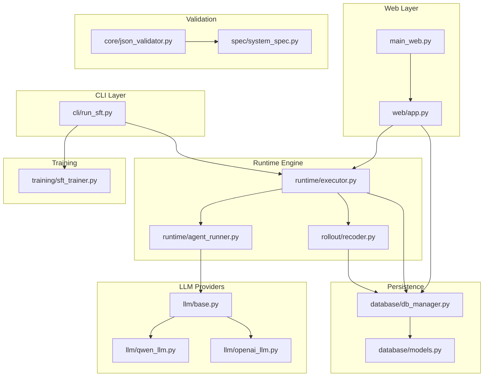
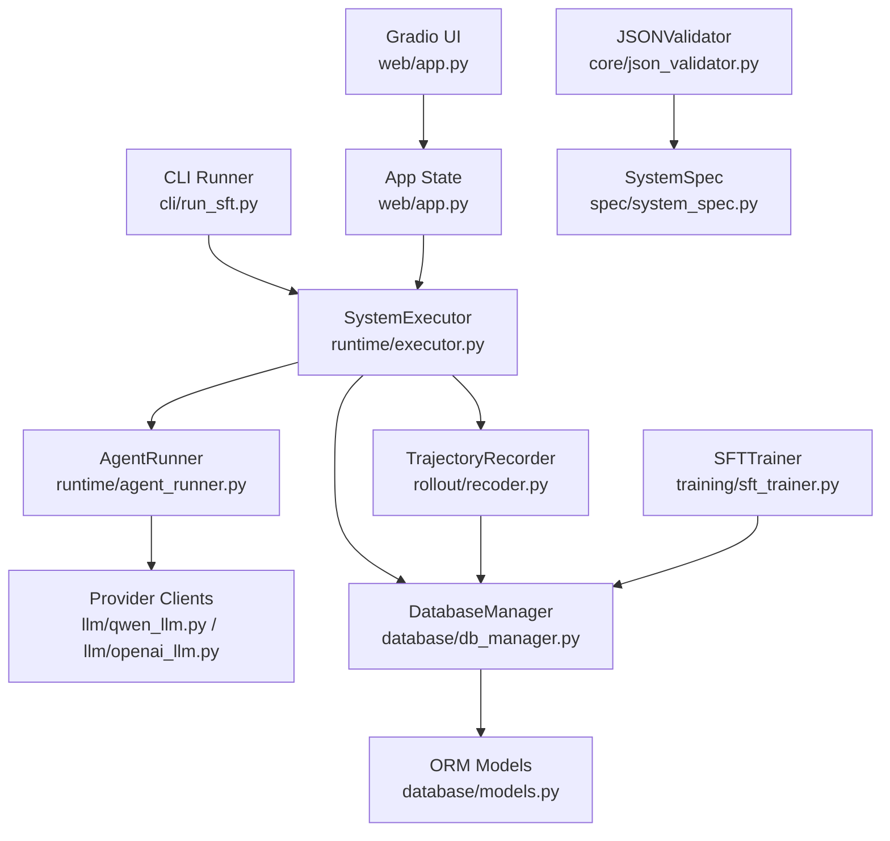
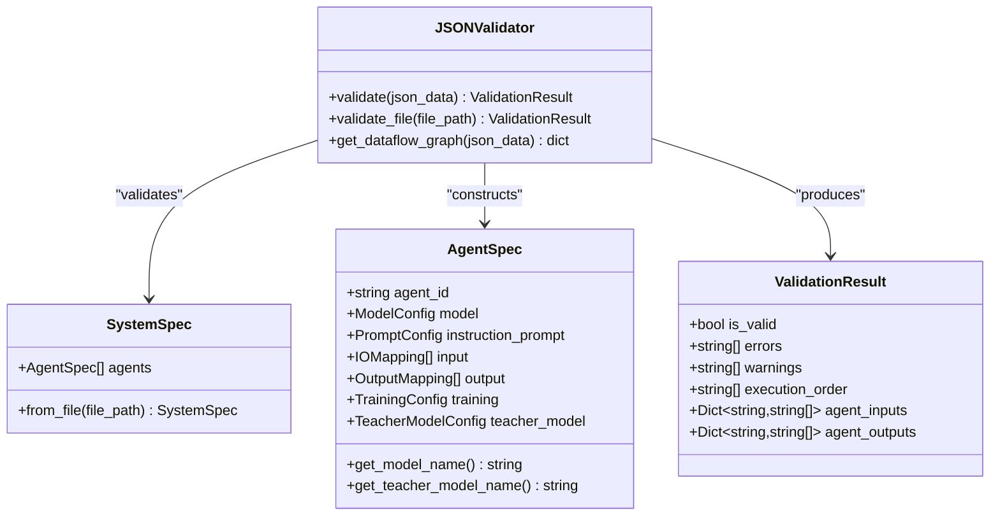
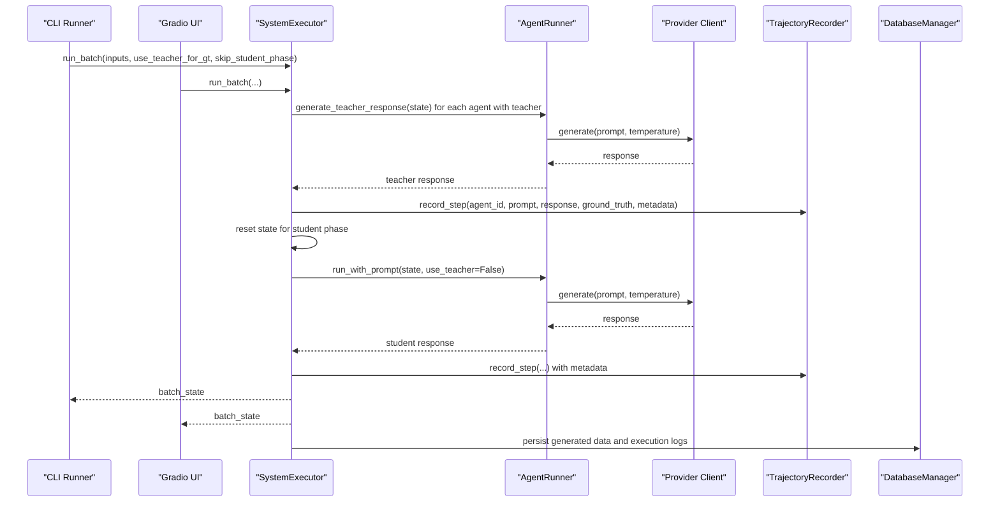
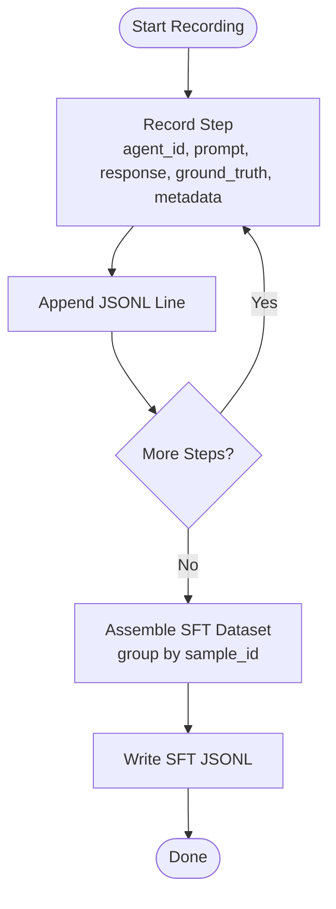
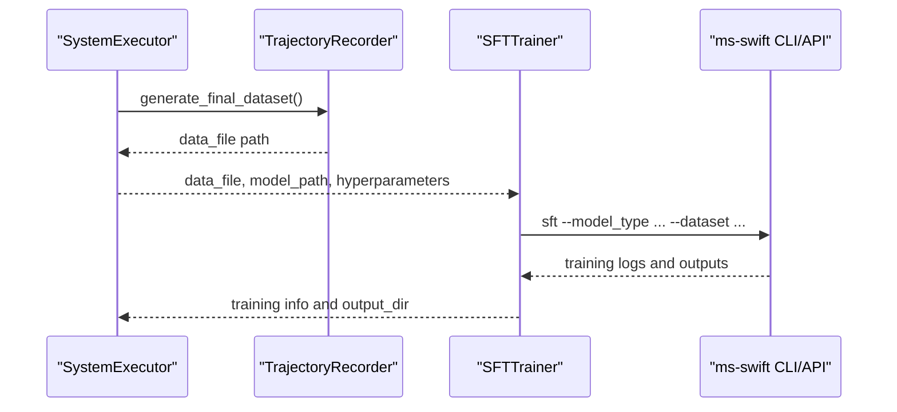
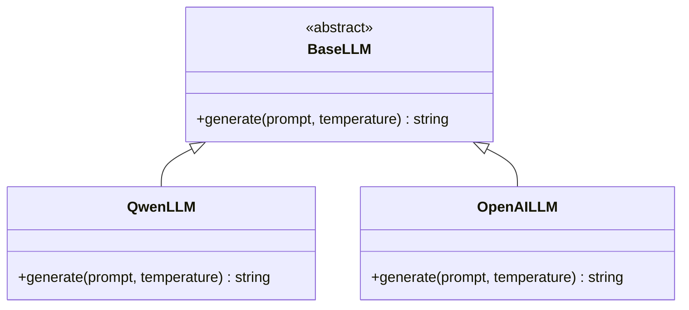
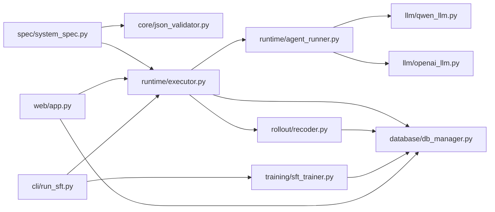

# System Architecture

<cite>
**Referenced Files in This Document**
- [main_web.py](file://main_web.py)
- [web/app.py](file://web/app.py)
- [cli/run_sft.py](file://cli/run_sft.py)
- [spec/system_spec.py](file://spec/system_spec.py)
- [core/json_validator.py](file://core/json_validator.py)
- [runtime/executor.py](file://runtime/executor.py)
- [runtime/agent_runner.py](file://runtime/agent_runner.py)
- [database/db_manager.py](file://database/db_manager.py)
- [database/models.py](file://database/models.py)
- [rollout/recoder.py](file://rollout/recoder.py)
- [training/sft_trainer.py](file://training/sft_trainer.py)
- [llm/base.py](file://llm/base.py)
- [llm/qwen_llm.py](file://llm/qwen_llm.py)
- [llm/openai_llm.py](file://llm/openai_llm.py)
</cite>

## Table of Contents
1. [Introduction](#introduction)
2. [Project Structure](#project-structure)
3. [Core Components](#core-components)
4. [Architecture Overview](#architecture-overview)
5. [Detailed Component Analysis](#detailed-component-analysis)
6. [Dependency Analysis](#dependency-analysis)
7. [Performance Considerations](#performance-considerations)
8. [Troubleshooting Guide](#troubleshooting-guide)
9. [Conclusion](#conclusion)

## Introduction
This document describes the architecture of the Multi-Agent System Builder, a full-stack application that combines:
- A web interface built with Gradio for configuration, execution, and training management
- Command-line tools for automation and batch processing
- A runtime engine for multi-agent orchestration and data collection
- A configuration validation subsystem
- A database manager for persistence and audit trails
- A training framework integrating with external libraries and LLM providers

The system supports a two-phase execution pipeline aligned with distillation-based SFT: Phase 1 generates ground truth via a teacher model, and Phase 2 executes students and collects trajectories for training. It also integrates with training frameworks (e.g., ms-swift) and external LLM providers (Qwen and OpenAI-compatible APIs).

## Project Structure
The repository is organized by functional layer:
- web/: Gradio-based UI with navigation and page components
- cli/: command-line scripts for automated workflows
- spec/: configuration schema and validation models
- core/: validation utilities and graph building
- runtime/: execution engine and agent runner
- database/: ORM models and repository-style persistence
- rollout/: trajectory recording and dataset assembly
- training/: trainer implementations for SFT/DPO/GRPO
- llm/: provider abstractions and adapters
- configs/: externalized provider credentials and endpoints

**Diagram sources**
- [main_web.py:73-157](file://main_web.py#L73-L157)
- [web/app.py:20-173](file://web/app.py#L20-L173)
- [cli/run_sft.py:17-117](file://cli/run_sft.py#L17-L117)
- [runtime/executor.py:9-132](file://runtime/executor.py#L9-L132)
- [runtime/agent_runner.py:10-68](file://runtime/agent_runner.py#L10-L68)
- [rollout/recoder.py:8-122](file://rollout/recoder.py#L8-L122)
- [spec/system_spec.py:100-114](file://spec/system_spec.py#L100-L114)
- [core/json_validator.py:37-347](file://core/json_validator.py#L37-L347)
- [database/db_manager.py:11-347](file://database/db_manager.py#L11-L347)
- [database/models.py:10-123](file://database/models.py#L10-L123)
- [training/sft_trainer.py:9-263](file://training/sft_trainer.py#L9-L263)
- [llm/base.py:1-6](file://llm/base.py#L1-L6)
- [llm/qwen_llm.py:7-51](file://llm/qwen_llm.py#L7-L51)
- [llm/openai_llm.py:7-49](file://llm/openai_llm.py#L7-L49)

**Section sources**
- [main_web.py:73-157](file://main_web.py#L73-L157)
- [web/app.py:20-173](file://web/app.py#L20-L173)

## Core Components
- SystemSpec: Defines the configuration schema for agents, prompts, I/O mappings, and training parameters using Pydantic models.
- JSONValidator: Validates configuration structure, dataflow connectivity, training modes, and detects cyclic dependencies using topological sorting.
- SystemExecutor: Orchestrates multi-agent execution in two phases (teacher GT generation and student execution), coordinates AgentRunner, and records trajectories.
- AgentRunner: Renders prompts using Jinja2 templates and invokes provider-specific LLM clients (Qwen/OpenAI) for student or teacher generation.
- DatabaseManager: Repository-style manager for datasets, system configs, generated trajectories, executions, and training jobs.
- TrajectoryRecorder: Writes rollout steps to JSONL and assembles datasets for downstream training.
- SFTTrainer: Converts trajectories to training-ready formats and launches training via ms-swift CLI/API.
- LLM Adapters: Provider abstractions implementing a common BaseLLM interface.

**Section sources**
- [spec/system_spec.py:100-114](file://spec/system_spec.py#L100-L114)
- [core/json_validator.py:37-347](file://core/json_validator.py#L37-L347)
- [runtime/executor.py:9-132](file://runtime/executor.py#L9-L132)
- [runtime/agent_runner.py:10-68](file://runtime/agent_runner.py#L10-L68)
- [database/db_manager.py:11-347](file://database/db_manager.py#L11-L347)
- [rollout/recoder.py:8-122](file://rollout/recoder.py#L8-L122)
- [training/sft_trainer.py:9-263](file://training/sft_trainer.py#L9-L263)
- [llm/base.py:1-6](file://llm/base.py#L1-L6)

## Architecture Overview
The system follows a layered architecture:
- Presentation Layer: Gradio app and CLI
- Orchestration Layer: Runtime engine and validators
- Persistence Layer: SQLAlchemy models and repository manager
- Integration Layer: LLM providers and training frameworks

**Diagram sources**
- [web/app.py:20-173](file://web/app.py#L20-L173)
- [cli/run_sft.py:17-117](file://cli/run_sft.py#L17-L117)
- [runtime/executor.py:9-132](file://runtime/executor.py#L9-L132)
- [runtime/agent_runner.py:10-68](file://runtime/agent_runner.py#L10-L68)
- [rollout/recoder.py:8-122](file://rollout/recoder.py#L8-L122)
- [database/db_manager.py:11-347](file://database/db_manager.py#L11-L347)
- [database/models.py:10-123](file://database/models.py#L10-L123)
- [training/sft_trainer.py:9-263](file://training/sft_trainer.py#L9-L263)
- [core/json_validator.py:37-347](file://core/json_validator.py#L37-L347)
- [spec/system_spec.py:100-114](file://spec/system_spec.py#L100-L114)

## Detailed Component Analysis

### SystemSpec and Configuration Validation
SystemSpec defines the canonical configuration schema for agents and training. JSONValidator performs:
- Structural checks (presence of required keys)
- Pydantic validation of each agent
- Dataflow verification (input/output mapping correctness)
- Training mode validation and requirements
- Topological sort to compute safe execution order and detect cycles

**Diagram sources**
- [spec/system_spec.py:100-114](file://spec/system_spec.py#L100-L114)
- [core/json_validator.py:37-347](file://core/json_validator.py#L37-L347)

**Section sources**
- [spec/system_spec.py:100-114](file://spec/system_spec.py#L100-L114)
- [core/json_validator.py:37-347](file://core/json_validator.py#L37-L347)

### Runtime Engine and Agent Execution
SystemExecutor orchestrates multi-agent execution:
- Phase 1: For agents with a teacher model, generate ground truth and propagate outputs to subsequent agents
- Phase 2: Run student models, collect prompts/responses, and record trajectories with optional ground truth and metadata
- AgentRunner renders prompts via Jinja2 and delegates to provider-specific LLM clients

**Diagram sources**
- [cli/run_sft.py:73-87](file://cli/run_sft.py#L73-L87)
- [runtime/executor.py:16-132](file://runtime/executor.py#L16-L132)
- [runtime/agent_runner.py:33-68](file://runtime/agent_runner.py#L33-L68)
- [rollout/recoder.py:15-42](file://rollout/recoder.py#L15-L42)
- [database/db_manager.py:159-181](file://database/db_manager.py#L159-L181)

**Section sources**
- [runtime/executor.py:16-132](file://runtime/executor.py#L16-L132)
- [runtime/agent_runner.py:33-68](file://runtime/agent_runner.py#L33-L68)
- [rollout/recoder.py:15-42](file://rollout/recoder.py#L15-L42)

### Data Recording and Dataset Assembly
TrajectoryRecorder writes per-step records to JSONL and can assemble SFT datasets or convert to SWIFT format. These artifacts are persisted via DatabaseManager.

**Diagram sources**
- [rollout/recoder.py:15-96](file://rollout/recoder.py#L15-L96)

**Section sources**
- [rollout/recoder.py:15-96](file://rollout/recoder.py#L15-L96)
- [database/db_manager.py:159-181](file://database/db_manager.py#L159-L181)

### Training Pipeline Integration
SFTTrainer converts trajectories to training-ready formats and either:
- Launches training via ms-swift CLI with constructed arguments
- Uses ms-swift Python API if available

**Diagram sources**
- [cli/run_sft.py:99-107](file://cli/run_sft.py#L99-L107)
- [training/sft_trainer.py:59-141](file://training/sft_trainer.py#L59-L141)

**Section sources**
- [training/sft_trainer.py:59-141](file://training/sft_trainer.py#L59-L141)
- [cli/run_sft.py:99-107](file://cli/run_sft.py#L99-L107)

### LLM Provider Abstractions
A simple Strategy pattern is used to select provider implementations at runtime:
- BaseLLM defines the interface
- QwenLLM and OpenAILLM implement provider-specific client initialization and generation

**Diagram sources**
- [llm/base.py:1-6](file://llm/base.py#L1-L6)
- [llm/qwen_llm.py:7-51](file://llm/qwen_llm.py#L7-L51)
- [llm/openai_llm.py:7-49](file://llm/openai_llm.py#L7-L49)

**Section sources**
- [llm/base.py:1-6](file://llm/base.py#L1-L6)
- [llm/qwen_llm.py:7-51](file://llm/qwen_llm.py#L7-L51)
- [llm/openai_llm.py:7-49](file://llm/openai_llm.py#L7-L49)

## Dependency Analysis
- Coupling: Runtime depends on spec and rollout; web and CLI depend on runtime and training; database manager encapsulates ORM operations.
- Cohesion: Each module focuses on a single responsibility (validation, execution, persistence, training).
- External integrations: LLM providers via OpenAI client; training via ms-swift; web via Gradio; persistence via SQLAlchemy.

**Diagram sources**
- [spec/system_spec.py:100-114](file://spec/system_spec.py#L100-L114)
- [core/json_validator.py:37-347](file://core/json_validator.py#L37-L347)
- [runtime/executor.py:9-132](file://runtime/executor.py#L9-L132)
- [runtime/agent_runner.py:10-68](file://runtime/agent_runner.py#L10-L68)
- [llm/qwen_llm.py:7-51](file://llm/qwen_llm.py#L7-L51)
- [llm/openai_llm.py:7-49](file://llm/openai_llm.py#L7-L49)
- [rollout/recoder.py:8-122](file://rollout/recoder.py#L8-L122)
- [database/db_manager.py:11-347](file://database/db_manager.py#L11-L347)
- [training/sft_trainer.py:9-263](file://training/sft_trainer.py#L9-L263)
- [web/app.py:20-173](file://web/app.py#L20-L173)
- [cli/run_sft.py:17-117](file://cli/run_sft.py#L17-L117)

**Section sources**
- [database/db_manager.py:11-347](file://database/db_manager.py#L11-L347)
- [database/models.py:10-123](file://database/models.py#L10-L123)

## Performance Considerations
- LLM latency: Batch and cache where possible; avoid redundant provider calls by reusing runners per agent.
- Disk I/O: TrajectoryRecorder writes incrementally; consider rotating output files for very large runs.
- Database transactions: Group related writes to reduce overhead; use sessions efficiently.
- Training throughput: Tune batch sizes and gradient accumulation; leverage ms-swift’s optimized training loop.

## Troubleshooting Guide
Common issues and resolutions:
- Missing provider credentials: Ensure api_config.yaml exists and contains provider-specific keys and base URLs.
- Encoding errors with LLM clients: Both QwenLLM and OpenAILLM initialize httpx clients with explicit headers to prevent encoding issues.
- Database initialization: DatabaseManager creates tables automatically; verify SQLite path and permissions.
- Training failures: Check ms-swift availability and model type inference; fallback to CLI mode if API is unavailable.

**Section sources**
- [llm/qwen_llm.py:13-38](file://llm/qwen_llm.py#L13-L38)
- [llm/openai_llm.py:14-41](file://llm/openai_llm.py#L14-L41)
- [database/db_manager.py:14-29](file://database/db_manager.py#L14-L29)
- [training/sft_trainer.py:152-219](file://training/sft_trainer.py#L152-L219)

## Conclusion
The Multi-Agent System Builder employs a clean, layered architecture with strong separation of concerns:
- SystemSpec and JSONValidator define and enforce configuration correctness
- SystemExecutor and AgentRunner implement a robust execution pipeline with provider abstraction
- TrajectoryRecorder and DatabaseManager provide reliable persistence and auditability
- SFTTrainer integrates external training frameworks seamlessly
- The web and CLI frontends expose consistent workflows for interactive and automated use

This design enables extensibility (new providers, training modes), maintainability (clear interfaces and repositories), and operability (observability via database and logs).