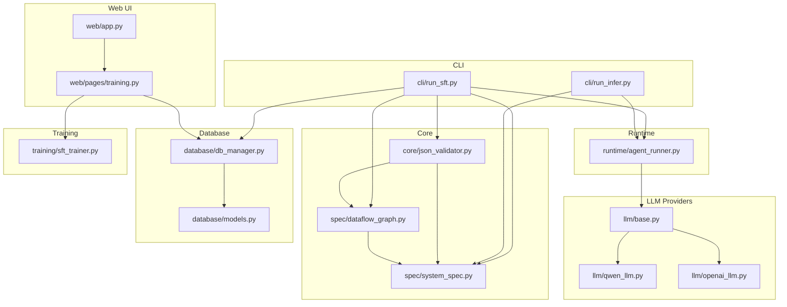
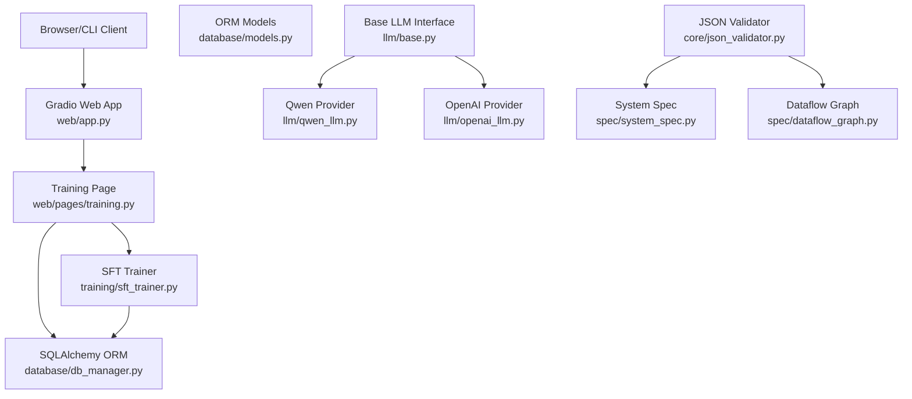
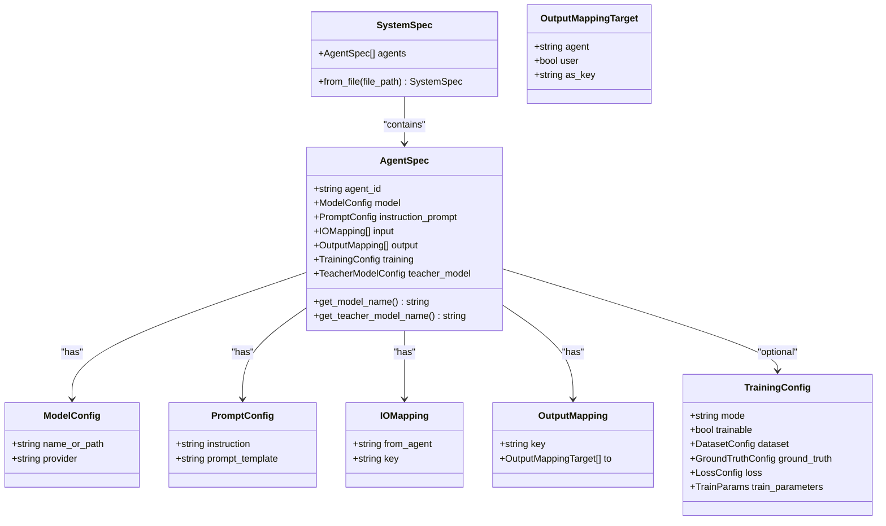
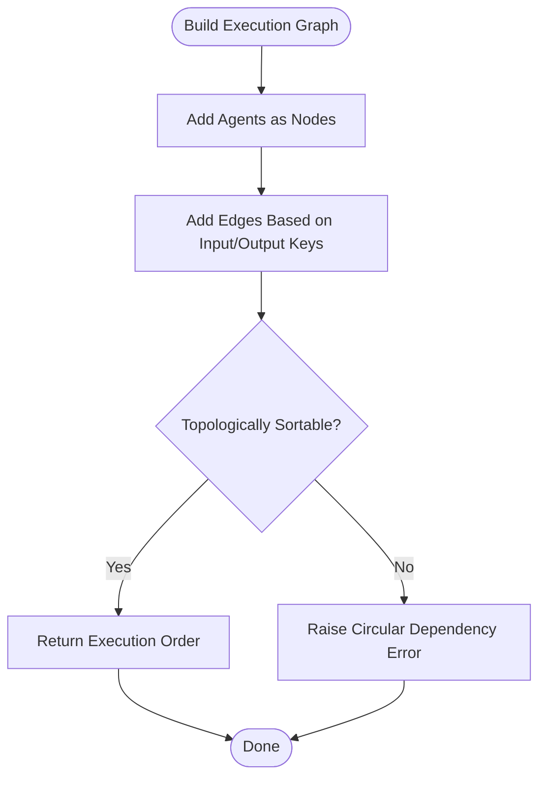
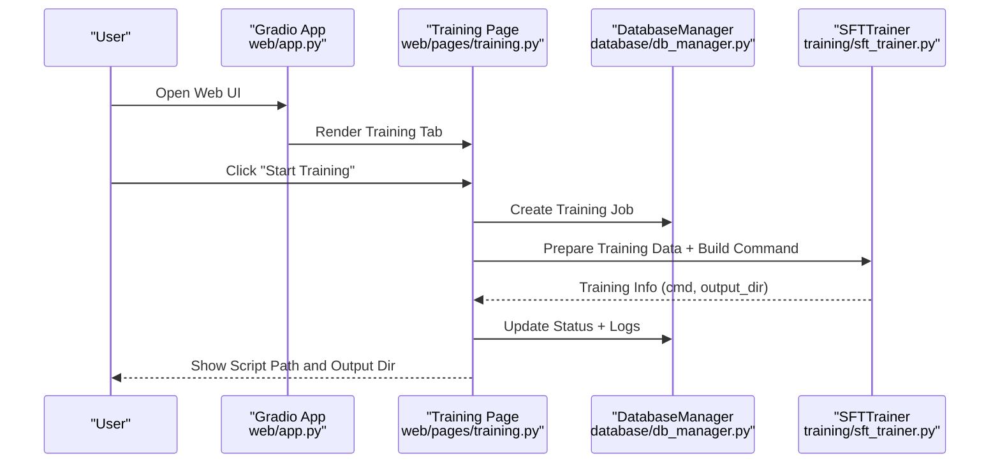
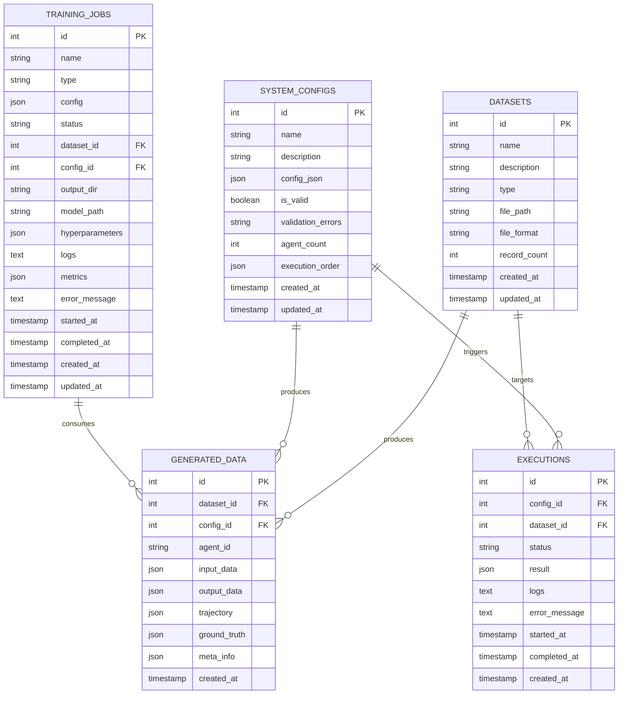
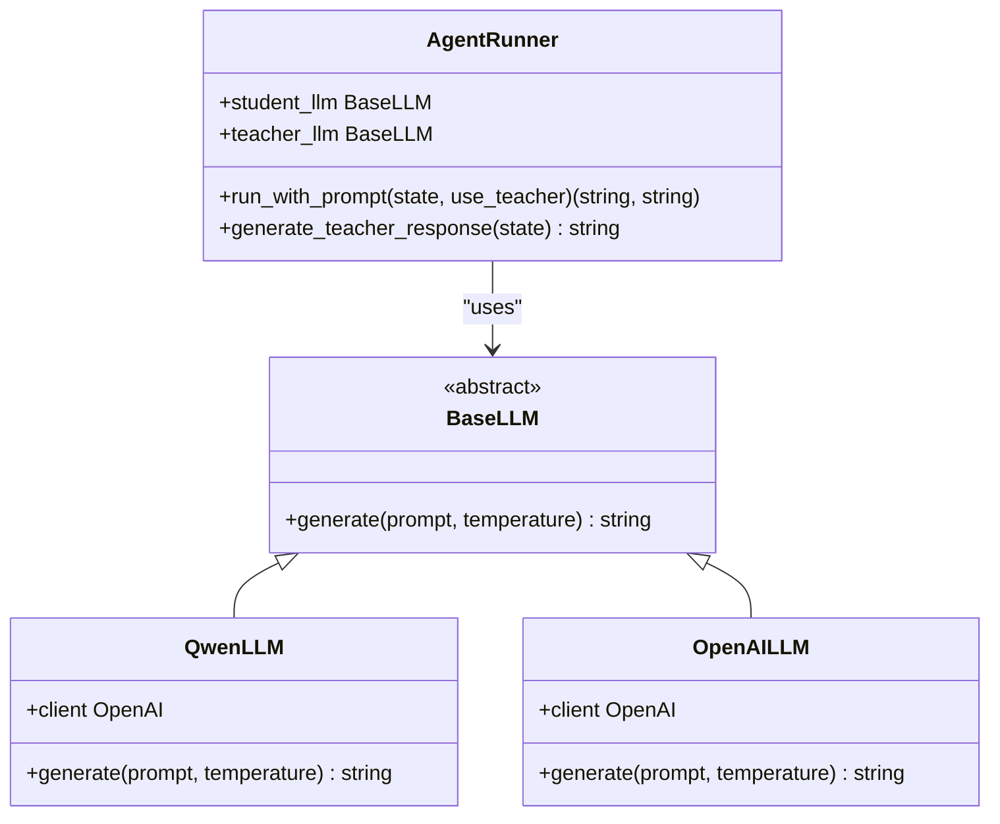
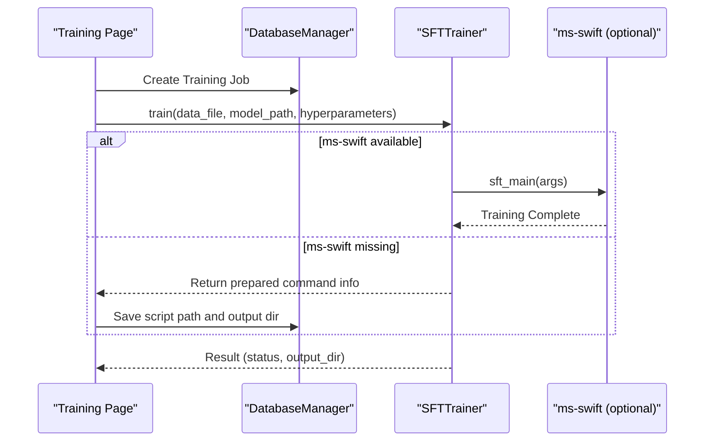
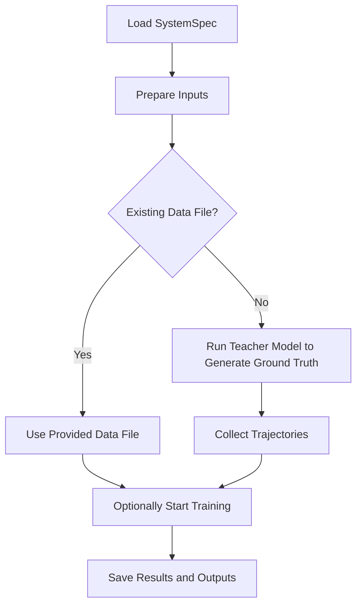
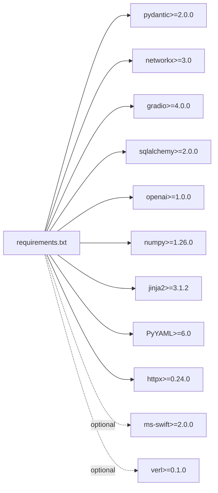

# Technology Stack

<cite>
**Referenced Files in This Document**
- [requirements.txt](file://requirements.txt)
- [main_web.py](file://main_web.py)
- [web/app.py](file://web/app.py)
- [database/db_manager.py](file://database/db_manager.py)
- [database/models.py](file://database/models.py)
- [llm/base.py](file://llm/base.py)
- [llm/qwen_llm.py](file://llm/qwen_llm.py)
- [llm/openai_llm.py](file://llm/openai_llm.py)
- [configs/api_config.yaml](file://configs/api_config.yaml)
- [spec/dataflow_graph.py](file://spec/dataflow_graph.py)
- [core/json_validator.py](file://core/json_validator.py)
- [spec/system_spec.py](file://spec/system_spec.py)
- [runtime/agent_runner.py](file://runtime/agent_runner.py)
- [training/sft_trainer.py](file://training/sft_trainer.py)
- [web/pages/training.py](file://web/pages/training.py)
- [cli/run_sft.py](file://cli/run_sft.py)
- [cli/run_infer.py](file://cli/run_infer.py)
</cite>

## Table of Contents
1. [Introduction](#introduction)
2. [Project Structure](#project-structure)
3. [Core Components](#core-components)
4. [Architecture Overview](#architecture-overview)
5. [Detailed Component Analysis](#detailed-component-analysis)
6. [Dependency Analysis](#dependency-analysis)
7. [Performance Considerations](#performance-considerations)
8. [Troubleshooting Guide](#troubleshooting-guide)
9. [Conclusion](#conclusion)
10. [Appendices](#appendices)

## Introduction
This document describes the technology stack used by the Multi-Agent System Builder. It covers core Python dependencies (Pydantic, NetworkX, Gradio, SQLAlchemy), optional ms-swift integration for distributed training, LLM provider integrations (Qwen and OpenAI-compatible APIs), web framework architecture via Gradio, version compatibility requirements, and integration points with external systems. It also documents development and deployment technologies across the application.

## Project Structure
The project is organized into feature-focused packages:
- CLI tools for training and inference
- Core validation and dataflow graph building
- Runtime execution engine for agents
- LLM providers abstraction and implementations
- Database ORM and persistence
- Web UI built with Gradio
- Training pipeline integration (including optional ms-swift)

**Diagram sources**
- [cli/run_sft.py:1-117](file://cli/run_sft.py#L1-L117)
- [cli/run_infer.py:1-46](file://cli/run_infer.py#L1-L46)
- [core/json_validator.py:1-347](file://core/json_validator.py#L1-L347)
- [spec/dataflow_graph.py:1-32](file://spec/dataflow_graph.py#L1-L32)
- [spec/system_spec.py:1-114](file://spec/system_spec.py#L1-L114)
- [runtime/agent_runner.py:1-68](file://runtime/agent_runner.py#L1-L68)
- [llm/base.py:1-6](file://llm/base.py#L1-L6)
- [llm/qwen_llm.py:1-51](file://llm/qwen_llm.py#L1-L51)
- [llm/openai_llm.py:1-49](file://llm/openai_llm.py#L1-L49)
- [database/db_manager.py:1-347](file://database/db_manager.py#L1-L347)
- [database/models.py:1-123](file://database/models.py#L1-L123)
- [web/app.py:1-173](file://web/app.py#L1-L173)
- [web/pages/training.py:1-553](file://web/pages/training.py#L1-L553)
- [training/sft_trainer.py:1-263](file://training/sft_trainer.py#L1-L263)

**Section sources**
- [requirements.txt:1-19](file://requirements.txt#L1-L19)
- [main_web.py:1-158](file://main_web.py#L1-L158)
- [web/app.py:1-173](file://web/app.py#L1-L173)

## Core Components
- Pydantic: Used for robust schema validation and data modeling across configuration structures and runtime specs.
- NetworkX: Utilized for dependency analysis and execution order computation via graph algorithms.
- Gradio: Provides the web interface for rapid prototyping and deployment of the platform.
- SQLAlchemy: Implements ORM for SQLite-backed persistence of datasets, configurations, execution records, and training jobs.

**Section sources**
- [spec/system_spec.py:1-114](file://spec/system_spec.py#L1-L114)
- [core/json_validator.py:1-347](file://core/json_validator.py#L1-L347)
- [spec/dataflow_graph.py:1-32](file://spec/dataflow_graph.py#L1-L32)
- [web/app.py:1-173](file://web/app.py#L1-L173)
- [database/db_manager.py:1-347](file://database/db_manager.py#L1-L347)
- [database/models.py:1-123](file://database/models.py#L1-L123)

## Architecture Overview
The system integrates CLI-driven workflows with a web UI. The CLI supports batch inference and SFT training, while the web UI provides a GUI for managing datasets, validating configurations, visualizing execution flows, and orchestrating training jobs. LLM providers are abstracted behind a common interface and configured via YAML. The database persists all artifacts and execution metadata.

**Diagram sources**
- [web/app.py:1-173](file://web/app.py#L1-L173)
- [web/pages/training.py:1-553](file://web/pages/training.py#L1-L553)
- [training/sft_trainer.py:1-263](file://training/sft_trainer.py#L1-L263)
- [database/db_manager.py:1-347](file://database/db_manager.py#L1-L347)
- [database/models.py:1-123](file://database/models.py#L1-L123)
- [llm/base.py:1-6](file://llm/base.py#L1-L6)
- [llm/qwen_llm.py:1-51](file://llm/qwen_llm.py#L1-L51)
- [llm/openai_llm.py:1-49](file://llm/openai_llm.py#L1-L49)
- [core/json_validator.py:1-347](file://core/json_validator.py#L1-L347)
- [spec/system_spec.py:1-114](file://spec/system_spec.py#L1-L114)
- [spec/dataflow_graph.py:1-32](file://spec/dataflow_graph.py#L1-L32)

## Detailed Component Analysis

### Pydantic-Based Schema Validation and Data Modeling
- Defines structured models for agent configuration, IO mappings, training parameters, and system specs.
- Validates JSON configuration files and computes execution order using graph algorithms.
- Produces detailed validation reports including errors, warnings, and execution order.

**Diagram sources**
- [spec/system_spec.py:1-114](file://spec/system_spec.py#L1-L114)

**Section sources**
- [spec/system_spec.py:1-114](file://spec/system_spec.py#L1-L114)
- [core/json_validator.py:1-347](file://core/json_validator.py#L1-L347)

### NetworkX-Based Dependency Analysis and Execution Order
- Builds a directed graph from agent IO dependencies.
- Detects cycles and computes a topological sort to derive safe execution order.

**Diagram sources**
- [spec/dataflow_graph.py:1-32](file://spec/dataflow_graph.py#L1-L32)
- [core/json_validator.py:242-266](file://core/json_validator.py#L242-L266)

**Section sources**
- [spec/dataflow_graph.py:1-32](file://spec/dataflow_graph.py#L1-L32)
- [core/json_validator.py:242-266](file://core/json_validator.py#L242-L266)

### Gradio Web Framework and Pages
- Central application bootstraps Gradio Blocks, defines navigation, and renders modular pages.
- Training page orchestrates SFT/DPO/GRPO job creation, status updates, and script generation.

**Diagram sources**
- [web/app.py:1-173](file://web/app.py#L1-L173)
- [web/pages/training.py:1-553](file://web/pages/training.py#L1-L553)
- [database/db_manager.py:267-347](file://database/db_manager.py#L267-L347)
- [training/sft_trainer.py:1-263](file://training/sft_trainer.py#L1-L263)

**Section sources**
- [web/app.py:1-173](file://web/app.py#L1-L173)
- [web/pages/training.py:1-553](file://web/pages/training.py#L1-L553)

### SQLAlchemy ORM and Database Models
- SQLite-backed ORM with declarative models for datasets, system configs, generated data, executions, and training jobs.
- DatabaseManager encapsulates engine/session lifecycle and CRUD operations.

**Diagram sources**
- [database/models.py:1-123](file://database/models.py#L1-L123)
- [database/db_manager.py:1-347](file://database/db_manager.py#L1-L347)

**Section sources**
- [database/models.py:1-123](file://database/models.py#L1-L123)
- [database/db_manager.py:1-347](file://database/db_manager.py#L1-L347)

### LLM Provider Integrations (Qwen and OpenAI-Compatible)
- Abstraction via BaseLLM with concrete implementations for Qwen and OpenAI-compatible providers.
- Configuration loaded from YAML with explicit HTTP client setup to avoid encoding issues.
- AgentRunner selects provider based on configuration and renders prompts using Jinja2 templates.

**Diagram sources**
- [llm/base.py:1-6](file://llm/base.py#L1-L6)
- [llm/qwen_llm.py:1-51](file://llm/qwen_llm.py#L1-L51)
- [llm/openai_llm.py:1-49](file://llm/openai_llm.py#L1-L49)
- [runtime/agent_runner.py:1-68](file://runtime/agent_runner.py#L1-L68)

**Section sources**
- [llm/base.py:1-6](file://llm/base.py#L1-L6)
- [llm/qwen_llm.py:1-51](file://llm/qwen_llm.py#L1-L51)
- [llm/openai_llm.py:1-49](file://llm/openai_llm.py#L1-L49)
- [runtime/agent_runner.py:1-68](file://runtime/agent_runner.py#L1-L68)
- [configs/api_config.yaml:1-9](file://configs/api_config.yaml#L1-L9)

### Optional ms-swift Integration for Distributed Training
- SFTTrainer supports both command-line invocation and Python API usage of ms-swift.
- When ms-swift is installed, training can be launched programmatically; otherwise, a shell script is generated for manual execution.
- Hyperparameters are mapped to SWIFT arguments and saved alongside training runs.

**Diagram sources**
- [web/pages/training.py:254-339](file://web/pages/training.py#L254-L339)
- [training/sft_trainer.py:142-220](file://training/sft_trainer.py#L142-L220)

**Section sources**
- [training/sft_trainer.py:1-263](file://training/sft_trainer.py#L1-L263)
- [web/pages/training.py:1-553](file://web/pages/training.py#L1-L553)

### CLI Workflows and Integration Points
- run_sft.py: Orchestrates data collection with teacher/student models and optional training via SWIFT.
- run_infer.py: Performs batch inference with optional ground-truth comparison.

**Diagram sources**
- [cli/run_sft.py:1-117](file://cli/run_sft.py#L1-L117)
- [cli/run_infer.py:1-46](file://cli/run_infer.py#L1-L46)

**Section sources**
- [cli/run_sft.py:1-117](file://cli/run_sft.py#L1-L117)
- [cli/run_infer.py:1-46](file://cli/run_infer.py#L1-L46)

## Dependency Analysis
- Core dependencies pinned in requirements.txt include Pydantic, NetworkX, Gradio, SQLAlchemy, OpenAI SDK, NumPy, Jinja2, PyYAML, and HTTPX.
- Optional ms-swift enables programmatic training; VERL is noted as an alternative for GRPO training.
- Version constraints ensure compatibility across components (e.g., Pydantic v2+, NetworkX v3+, Gradio v4+, SQLAlchemy v2+).

**Diagram sources**
- [requirements.txt:1-19](file://requirements.txt#L1-L19)

**Section sources**
- [requirements.txt:1-19](file://requirements.txt#L1-L19)

## Performance Considerations
- Prefer topological sorting for deterministic execution order to minimize re-execution overhead.
- Use SQLite for local development; consider migration to a production-grade database for concurrent workloads.
- Cache frequently accessed configuration and dataset metadata in memory during batch operations.
- Limit prompt sizes and batch sizes according to provider quotas and GPU memory constraints.

## Troubleshooting Guide
- Encoding errors with LLM providers: Explicit HTTP client configuration avoids system environment variable issues.
- Missing ms-swift: The system falls back to generating a shell script; install ms-swift for in-process training.
- Circular dependencies in configuration: Validation detects cycles and raises descriptive errors.
- Database initialization: Ensure the data directory exists and is writable; the manager creates tables automatically.

**Section sources**
- [llm/qwen_llm.py:24-51](file://llm/qwen_llm.py#L24-L51)
- [llm/openai_llm.py:25-41](file://llm/openai_llm.py#L25-L41)
- [training/sft_trainer.py:210-219](file://training/sft_trainer.py#L210-L219)
- [core/json_validator.py:257-266](file://core/json_validator.py#L257-L266)
- [database/db_manager.py:14-29](file://database/db_manager.py#L14-L29)

## Conclusion
The Multi-Agent System Builder leverages a cohesive stack: Pydantic for robust schema validation, NetworkX for dependency analysis, Gradio for a responsive web UI, and SQLAlchemy for persistent state. Optional ms-swift integration streamlines distributed training workflows. LLM provider abstractions support both Qwen and OpenAI-compatible APIs with resilient HTTP client configuration. Together, these technologies enable rapid prototyping, reliable validation, and scalable execution.

## Appendices

### Version Compatibility and Requirements
- Pydantic >= 2.0.0
- NetworkX >= 3.0
- Gradio >= 4.0.0
- SQLAlchemy >= 2.0.0
- OpenAI >= 1.0.0
- NumPy >= 1.26.0
- Jinja2 >= 3.1.2
- PyYAML >= 6.0
- HTTPX >= 0.24.0
- ms-swift >= 2.0.0 (optional)
- verl >= 0.1.0 (optional, for GRPO)

**Section sources**
- [requirements.txt:1-19](file://requirements.txt#L1-L19)

### Configuration Requirements and Authentication
- LLM providers configured via YAML with api_key, base_url, and model fields.
- HTTP client explicitly set to prevent header encoding issues.

**Section sources**
- [configs/api_config.yaml:1-9](file://configs/api_config.yaml#L1-L9)
- [llm/qwen_llm.py:24-38](file://llm/qwen_llm.py#L24-L38)
- [llm/openai_llm.py:25-41](file://llm/openai_llm.py#L25-L41)

### Development and Deployment Technologies
- Development: Python 3.x, pip, SQLite for local persistence.
- Deployment: Gradio server with configurable host/port/share; optional public tunneling; CLI tools for automation.

**Section sources**
- [main_web.py:73-154](file://main_web.py#L73-L154)
- [web/app.py:160-168](file://web/app.py#L160-L168)