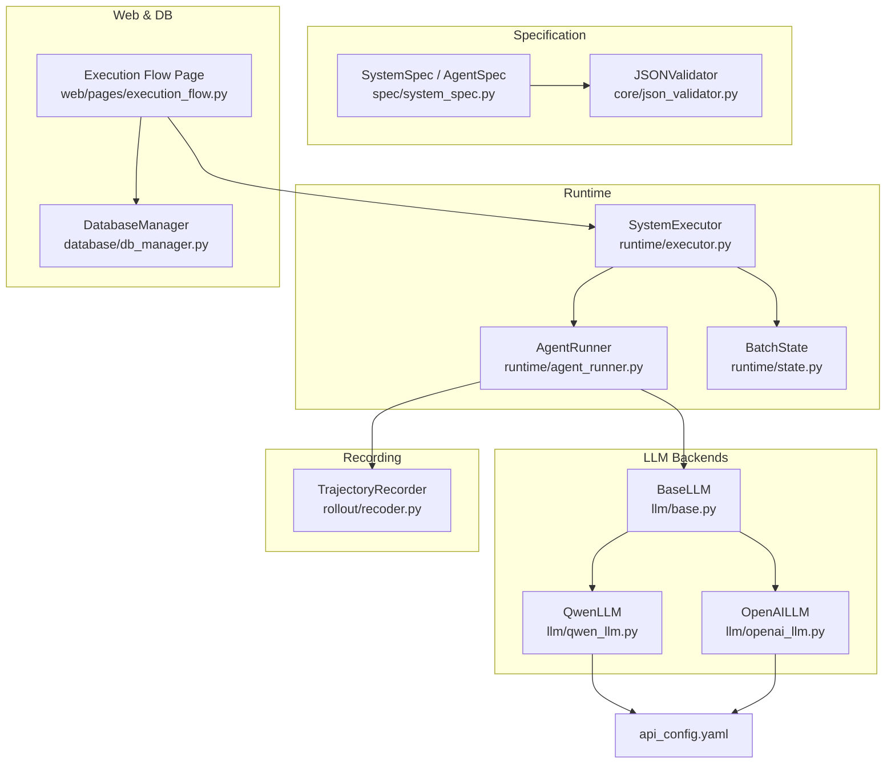
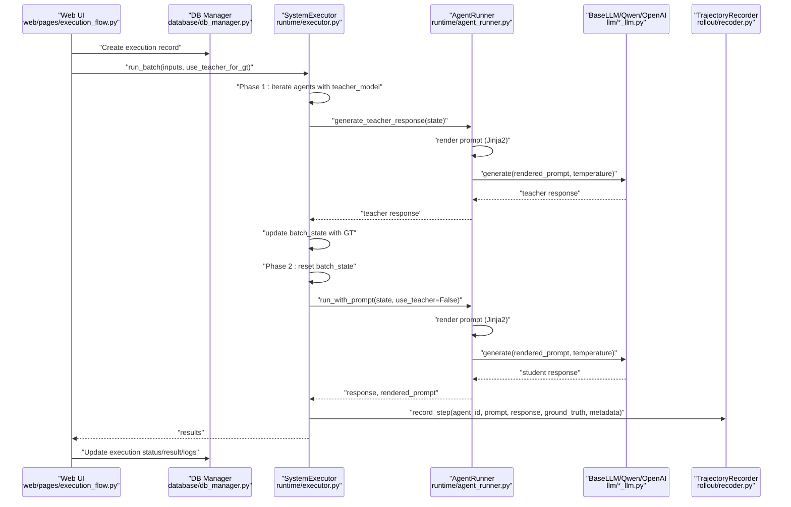
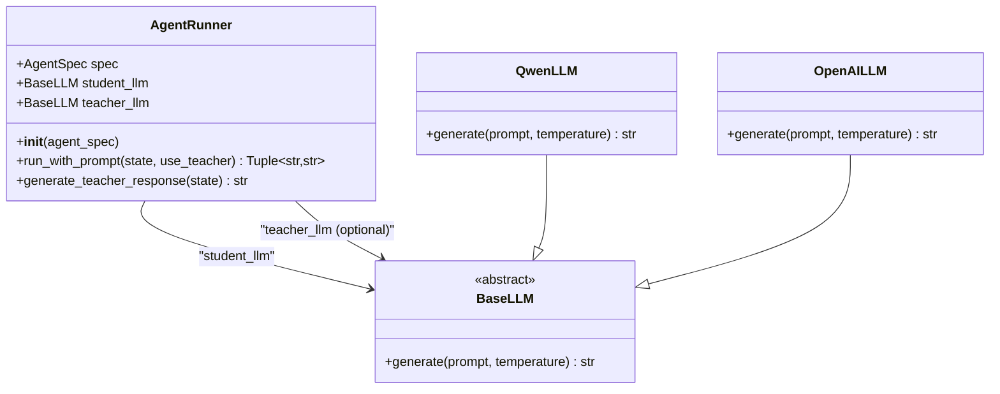
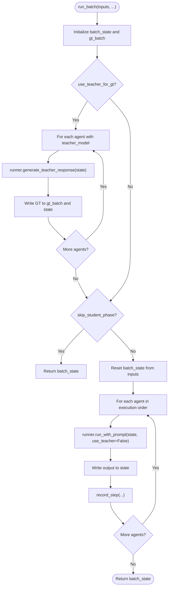
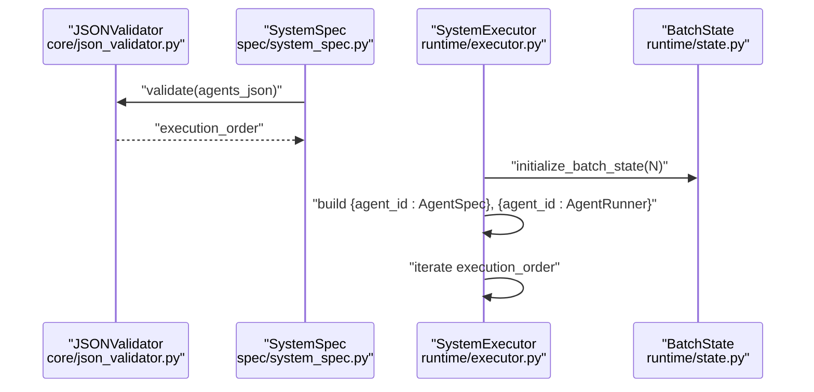
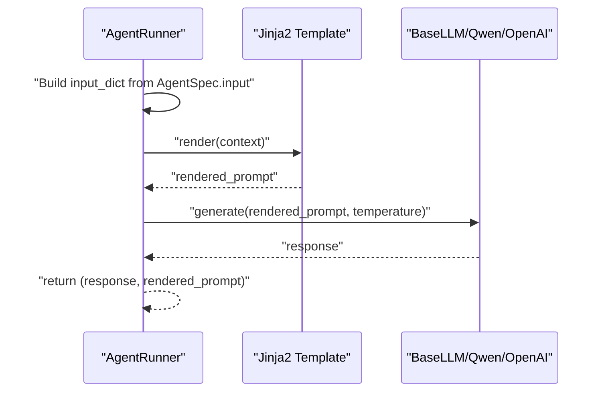
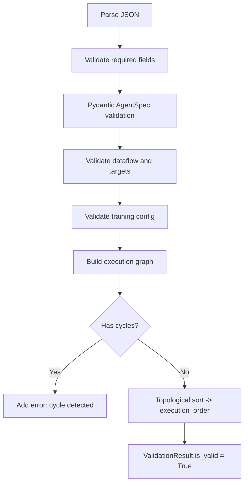
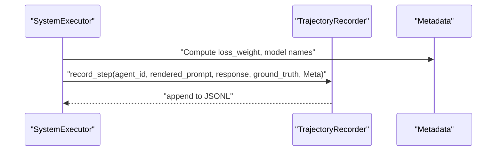
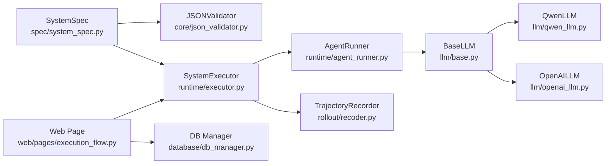

# Agent Lifecycle Management

<cite>
**Referenced Files in This Document**
- [runtime/agent_runner.py](file://runtime/agent_runner.py)
- [runtime/executor.py](file://runtime/executor.py)
- [runtime/state.py](file://runtime/state.py)
- [spec/system_spec.py](file://spec/system_spec.py)
- [llm/base.py](file://llm/base.py)
- [llm/qwen_llm.py](file://llm/qwen_llm.py)
- [llm/openai_llm.py](file://llm/openai_llm.py)
- [rollout/recoder.py](file://rollout/recoder.py)
- [core/json_validator.py](file://core/json_validator.py)
- [core/trajectory_generator.py](file://core/trajectory_generator.py)
- [web/pages/execution_flow.py](file://web/pages/execution_flow.py)
- [database/db_manager.py](file://database/db_manager.py)
- [configs/api_config.yaml](file://configs/api_config.yaml)
</cite>

## Table of Contents
1. [Introduction](#introduction)
2. [Project Structure](#project-structure)
3. [Core Components](#core-components)
4. [Architecture Overview](#architecture-overview)
5. [Detailed Component Analysis](#detailed-component-analysis)
6. [Dependency Analysis](#dependency-analysis)
7. [Performance Considerations](#performance-considerations)
8. [Troubleshooting Guide](#troubleshooting-guide)
9. [Conclusion](#conclusion)
10. [Appendices](#appendices)

## Introduction
This document explains agent lifecycle management within the runtime engine. It focuses on the AgentRunner class, agent initialization, state management, and execution coordination. It also covers the agent execution flow, prompt rendering, response processing, output handling, configuration validation, model selection logic, and execution state tracking. Practical examples, debugging techniques, performance monitoring approaches, agent isolation, resource management, and cleanup procedures are included to support both developers and operators.

## Project Structure
The runtime engine orchestrates multi-agent workflows with two distinct phases: teacher-phase (ground-truth generation) and student-phase (execution and trajectory recording). The system validates configurations, constructs agents, runs them in a deterministic order, and records trajectories for downstream training.

**Diagram sources**
- [runtime/agent_runner.py:1-68](file://runtime/agent_runner.py#L1-L68)
- [runtime/executor.py:1-132](file://runtime/executor.py#L1-L132)
- [runtime/state.py:1-8](file://runtime/state.py#L1-L8)
- [spec/system_spec.py:1-114](file://spec/system_spec.py#L1-L114)
- [core/json_validator.py:1-347](file://core/json_validator.py#L1-L347)
- [llm/base.py:1-6](file://llm/base.py#L1-L6)
- [llm/qwen_llm.py:1-51](file://llm/qwen_llm.py#L1-L51)
- [llm/openai_llm.py:1-49](file://llm/openai_llm.py#L1-L49)
- [rollout/recoder.py:1-122](file://rollout/recoder.py#L1-L122)
- [web/pages/execution_flow.py:1-275](file://web/pages/execution_flow.py#L1-L275)
- [database/db_manager.py:1-347](file://database/db_manager.py#L1-L347)
- [configs/api_config.yaml:1-9](file://configs/api_config.yaml#L1-L9)

**Section sources**
- [runtime/agent_runner.py:1-68](file://runtime/agent_runner.py#L1-L68)
- [runtime/executor.py:1-132](file://runtime/executor.py#L1-L132)
- [runtime/state.py:1-8](file://runtime/state.py#L1-L8)
- [spec/system_spec.py:1-114](file://spec/system_spec.py#L1-L114)
- [core/json_validator.py:1-347](file://core/json_validator.py#L1-L347)
- [llm/base.py:1-6](file://llm/base.py#L1-L6)
- [llm/qwen_llm.py:1-51](file://llm/qwen_llm.py#L1-L51)
- [llm/openai_llm.py:1-49](file://llm/openai_llm.py#L1-L49)
- [rollout/recoder.py:1-122](file://rollout/recoder.py#L1-L122)
- [web/pages/execution_flow.py:1-275](file://web/pages/execution_flow.py#L1-L275)
- [database/db_manager.py:1-347](file://database/db_manager.py#L1-L347)
- [configs/api_config.yaml:1-9](file://configs/api_config.yaml#L1-L9)

## Core Components
- AgentRunner: Initializes student and optional teacher LLMs based on AgentSpec, renders prompts via Jinja2, selects model for generation, and returns response plus rendered prompt.
- SystemExecutor: Coordinates batch execution across agents, orchestrating teacher-phase and student-phase, updating shared state, and optionally recording trajectories.
- BaseLLM and concrete LLMs: Abstraction and implementations for Qwen and OpenAI-compatible APIs with robust HTTP client configuration.
- TrajectoryRecorder: Writes per-step records to JSONL, supports assembling SFT datasets and converting to SWIFT format.
- SystemSpec and JSONValidator: Define agent schema, training config, and enforce dataflow and execution graph validation.
- BatchState: Lightweight container for global state across samples in batch mode.

**Section sources**
- [runtime/agent_runner.py:10-68](file://runtime/agent_runner.py#L10-L68)
- [runtime/executor.py:9-132](file://runtime/executor.py#L9-L132)
- [llm/base.py:3-6](file://llm/base.py#L3-L6)
- [llm/qwen_llm.py:7-51](file://llm/qwen_llm.py#L7-L51)
- [llm/openai_llm.py:7-49](file://llm/openai_llm.py#L7-L49)
- [rollout/recoder.py:8-122](file://rollout/recoder.py#L8-L122)
- [spec/system_spec.py:77-114](file://spec/system_spec.py#L77-L114)
- [core/json_validator.py:37-347](file://core/json_validator.py#L37-L347)
- [runtime/state.py:3-8](file://runtime/state.py#L3-L8)

## Architecture Overview
The runtime engine follows a two-phase pipeline:
- Phase 1 (Teacher): For agents with a teacher model configured, generate ground-truth outputs and inject them into the shared state for subsequent agents.
- Phase 2 (Student): Reinitialize state from inputs, run student models, collect outputs, and record trajectories for training.

**Diagram sources**
- [runtime/executor.py:16-132](file://runtime/executor.py#L16-L132)
- [runtime/agent_runner.py:33-68](file://runtime/agent_runner.py#L33-L68)
- [llm/base.py:3-6](file://llm/base.py#L3-L6)
- [llm/qwen_llm.py:40-51](file://llm/qwen_llm.py#L40-L51)
- [llm/openai_llm.py:43-49](file://llm/openai_llm.py#L43-L49)
- [rollout/recoder.py:15-42](file://rollout/recoder.py#L15-L42)
- [web/pages/execution_flow.py:116-224](file://web/pages/execution_flow.py#L116-L224)
- [database/db_manager.py:205-244](file://database/db_manager.py#L205-L244)

## Detailed Component Analysis

### AgentRunner: Initialization, Model Selection, Prompt Rendering, and Execution
- Initialization:
  - Selects student LLM based on agent_spec.model_provider ("qwen" or "openai").
  - Optionally initializes teacher LLM if agent_spec.teacher_model is present.
  - Raises explicit errors for unsupported providers.
- Prompt rendering:
  - Builds input_dict from AgentSpec.input mappings against the current state.
  - Renders instruction_prompt.prompt_template with Jinja2 using a context containing {"input": input_dict}.
- Model selection:
  - run_with_prompt chooses teacher LLM when use_teacher is True and a teacher is configured; otherwise uses the student LLM.
- Response processing:
  - Delegates generation to the selected LLM with temperature from AgentSpec.
  - Returns both the generated response and the rendered prompt for logging/training.

**Diagram sources**
- [runtime/agent_runner.py:10-68](file://runtime/agent_runner.py#L10-L68)
- [llm/base.py:3-6](file://llm/base.py#L3-L6)
- [llm/qwen_llm.py:7-51](file://llm/qwen_llm.py#L7-L51)
- [llm/openai_llm.py:7-49](file://llm/openai_llm.py#L7-L49)

**Section sources**
- [runtime/agent_runner.py:10-68](file://runtime/agent_runner.py#L10-L68)
- [llm/base.py:3-6](file://llm/base.py#L3-L6)
- [llm/qwen_llm.py:7-51](file://llm/qwen_llm.py#L7-L51)
- [llm/openai_llm.py:7-49](file://llm/openai_llm.py#L7-L49)

### SystemExecutor: Batch Execution, State Management, and Trajectory Recording
- Initialization:
  - Builds agent registry and runner instances keyed by agent_id.
  - Optionally enables trajectory recording.
- run_batch:
  - Phase 1 (Teacher):
    - Iterates agents in execution order.
    - For agents with teacher_model, generates ground-truth responses and updates both batch_state and gt_batch.
    - Prints per-sample progress and raises exceptions immediately on failure.
  - Phase 2 (Student):
    - Resets batch_state to original inputs to avoid leaking teacher outputs.
    - Runs student models, updates state, records trajectory steps with metadata (including loss_weight), and prints progress.
  - Returns final batch_state after completion.

**Diagram sources**
- [runtime/executor.py:16-132](file://runtime/executor.py#L16-L132)

**Section sources**
- [runtime/executor.py:9-132](file://runtime/executor.py#L9-L132)

### State Management and Batch Execution Order
- BatchState:
  - A list of dicts representing per-sample state.
  - initialize_batch_state creates N empty dicts for a batch size N.
- Execution order:
  - Determined by JSONValidator’s topological sort over agent input/output dependencies.
  - SystemExecutor stores execution_order and runners keyed by agent_id for deterministic iteration.

**Diagram sources**
- [core/json_validator.py:242-266](file://core/json_validator.py#L242-L266)
- [runtime/state.py:7-8](file://runtime/state.py#L7-L8)
- [runtime/executor.py:9-15](file://runtime/executor.py#L9-L15)

**Section sources**
- [runtime/state.py:3-8](file://runtime/state.py#L3-L8)
- [core/json_validator.py:242-266](file://core/json_validator.py#L242-L266)
- [runtime/executor.py:9-15](file://runtime/executor.py#L9-L15)

### Prompt Rendering and Response Processing
- Rendering:
  - AgentRunner builds context {"input": input_dict} and renders the Jinja2 template from AgentSpec.instruction_prompt.
- Response processing:
  - AgentRunner delegates generation to the selected LLM and returns both response and rendered prompt.
  - SystemExecutor writes the prompt and response to TrajectoryRecorder along with metadata and optional ground truth.

**Diagram sources**
- [runtime/agent_runner.py:33-60](file://runtime/agent_runner.py#L33-L60)

**Section sources**
- [runtime/agent_runner.py:33-60](file://runtime/agent_runner.py#L33-L60)

### Configuration Validation and Model Selection Logic
- Validation:
  - JSONValidator parses JSON, checks required fields, validates AgentSpec via Pydantic, ensures unique agent_id, verifies dataflow connections, validates training modes, and detects cyclic dependencies via topological sort.
- Model selection:
  - AgentRunner selects student LLM provider from AgentSpec.model_provider.
  - Teacher LLM provider defaults to "qwen" if unspecified in AgentSpec.teacher_model.
  - Unsupported providers raise explicit errors.

**Diagram sources**
- [core/json_validator.py:43-82](file://core/json_validator.py#L43-L82)
- [core/json_validator.py:181-266](file://core/json_validator.py#L181-L266)
- [spec/system_spec.py:77-96](file://spec/system_spec.py#L77-L96)
- [runtime/agent_runner.py:15-31](file://runtime/agent_runner.py#L15-L31)

**Section sources**
- [core/json_validator.py:37-347](file://core/json_validator.py#L37-L347)
- [spec/system_spec.py:77-96](file://spec/system_spec.py#L77-L96)
- [runtime/agent_runner.py:15-31](file://runtime/agent_runner.py#L15-L31)

### Execution State Tracking and Trajectory Recording
- State updates:
  - During Phase 1, teacher outputs are written to both batch_state and gt_batch under the appropriate keys.
  - During Phase 2, batch_state is reinitialized from inputs to prevent leakage.
- Trajectory recording:
  - SystemExecutor records each step with agent_id, prompt, response, optional ground truth, and metadata (loss_weight, model names, phase).
  - TrajectoryRecorder persists records to JSONL and supports assembling SFT datasets and SWIFT conversions.

**Diagram sources**
- [runtime/executor.py:105-123](file://runtime/executor.py#L105-L123)
- [rollout/recoder.py:15-42](file://rollout/recoder.py#L15-L42)

**Section sources**
- [runtime/executor.py:105-123](file://runtime/executor.py#L105-L123)
- [rollout/recoder.py:15-42](file://rollout/recoder.py#L15-L42)

### Agent Lifecycle Scenarios
- Scenario A: Teacher-phase only
  - Set use_teacher_for_gt=True and skip_student_phase=True.
  - Executes Phase 1 only; returns batch_state populated with teacher-generated ground truths.
- Scenario B: Full pipeline
  - use_teacher_for_gt=True, skip_student_phase=False.
  - Executes Phase 1 (teacher GT) followed by Phase 2 (student outputs and trajectory recording).
- Scenario C: No teacher model
  - Agents without teacher_model are skipped in Phase 1.
  - Phase 2 proceeds with student models only.

**Section sources**
- [runtime/executor.py:16-74](file://runtime/executor.py#L16-L74)
- [runtime/executor.py:75-132](file://runtime/executor.py#L75-L132)

### Debugging Techniques for Agent Execution Errors
- Immediate failure propagation:
  - Exceptions during teacher or student phases are caught, logged with sample index and agent_id, then re-raised to halt execution.
- Logging and visibility:
  - SystemExecutor prints clear phase markers and per-sample outputs.
  - Web UI captures logs and updates execution status in the database.
- Configuration checks:
  - Ensure agent_id uniqueness and correct input/output mapping.
  - Verify model provider values and presence of required keys in state.

**Section sources**
- [runtime/executor.py:64-66](file://runtime/executor.py#L64-L66)
- [runtime/executor.py:125-127](file://runtime/executor.py#L125-L127)
- [web/pages/execution_flow.py:221-223](file://web/pages/execution_flow.py#L221-L223)
- [core/json_validator.py:124-157](file://core/json_validator.py#L124-L157)

### Performance Monitoring Approaches
- Throughput and latency:
  - Track time per agent per sample in SystemExecutor loops; log or emit metrics alongside outputs.
- Resource usage:
  - Monitor LLM API rate limits and retries; adjust timeouts and concurrency in LLM clients.
- Data quality:
  - Inspect TrajectoryRecorder outputs for missing ground truth or malformed prompts; validate via JSONValidator before execution.

[No sources needed since this section provides general guidance]

### Agent Isolation, Resource Management, and Cleanup
- Isolation:
  - Separate teacher and student LLM instances per agent; avoid cross-agent state contamination by resetting batch_state in Phase 2.
- Resource management:
  - LLM clients use explicit httpx clients with timeouts and fixed headers to prevent leaks and encoding issues.
  - TrajectoryRecorder writes incrementally to JSONL to limit memory footprint.
- Cleanup:
  - After execution, SystemExecutor optionally prints the saved file path; TrajectoryRecorder exposes get_file_path for later post-processing.

**Section sources**
- [llm/qwen_llm.py:24-38](file://llm/qwen_llm.py#L24-L38)
- [llm/openai_llm.py:25-41](file://llm/openai_llm.py#L25-L41)
- [rollout/recoder.py:15-42](file://rollout/recoder.py#L15-L42)
- [runtime/executor.py:129-131](file://runtime/executor.py#L129-L131)

## Dependency Analysis
The runtime engine exhibits clear layering:
- Specification layer defines schema and validation.
- Runtime layer orchestrates execution and state.
- LLM layer abstracts model backends.
- Recording layer persists trajectories.
- Web/UI and DB layers integrate execution with persistence and UX.

**Diagram sources**
- [spec/system_spec.py:77-114](file://spec/system_spec.py#L77-L114)
- [core/json_validator.py:37-82](file://core/json_validator.py#L37-L82)
- [runtime/executor.py:9-15](file://runtime/executor.py#L9-L15)
- [runtime/agent_runner.py:10-20](file://runtime/agent_runner.py#L10-L20)
- [llm/base.py:3-6](file://llm/base.py#L3-L6)
- [llm/qwen_llm.py:7-51](file://llm/qwen_llm.py#L7-L51)
- [llm/openai_llm.py:7-49](file://llm/openai_llm.py#L7-L49)
- [rollout/recoder.py:8-122](file://rollout/recoder.py#L8-L122)
- [web/pages/execution_flow.py:116-169](file://web/pages/execution_flow.py#L116-L169)
- [database/db_manager.py:205-244](file://database/db_manager.py#L205-L244)

**Section sources**
- [spec/system_spec.py:77-114](file://spec/system_spec.py#L77-L114)
- [core/json_validator.py:37-82](file://core/json_validator.py#L37-L82)
- [runtime/executor.py:9-15](file://runtime/executor.py#L9-L15)
- [runtime/agent_runner.py:10-20](file://runtime/agent_runner.py#L10-L20)
- [llm/base.py:3-6](file://llm/base.py#L3-L6)
- [llm/qwen_llm.py:7-51](file://llm/qwen_llm.py#L7-L51)
- [llm/openai_llm.py:7-49](file://llm/openai_llm.py#L7-L49)
- [rollout/recoder.py:8-122](file://rollout/recoder.py#L8-L122)
- [web/pages/execution_flow.py:116-169](file://web/pages/execution_flow.py#L116-L169)
- [database/db_manager.py:205-244](file://database/db_manager.py#L205-L244)

## Performance Considerations
- Minimize redundant prompt rendering by caching static parts when applicable.
- Batch requests to LLMs where supported by the backend to reduce overhead.
- Control concurrency carefully to respect API rate limits and avoid timeouts.
- Use TrajectoryRecorder’s incremental writes for large-scale runs to manage memory usage.

[No sources needed since this section provides general guidance]

## Troubleshooting Guide
- Missing state keys:
  - AgentRunner raises KeyError when an AgentSpec.input key is absent from state; ensure all required keys are present before execution.
- Unsupported model provider:
  - AgentRunner raises ValueError for unknown providers; confirm agent_spec.model_provider and teacher_model.provider values.
- Encoding errors in LLM clients:
  - LLM implementations explicitly configure httpx clients and handle encoding errors; verify environment variables and retry with ASCII-friendly headers.
- Execution halts on error:
  - SystemExecutor re-raises exceptions after logging; inspect logs and fix configuration or input data before retrying.

**Section sources**
- [runtime/agent_runner.py:39-40](file://runtime/agent_runner.py#L39-L40)
- [runtime/agent_runner.py:19-20](file://runtime/agent_runner.py#L19-L20)
- [llm/qwen_llm.py:49-51](file://llm/qwen_llm.py#L49-L51)
- [runtime/executor.py:64-66](file://runtime/executor.py#L64-L66)
- [runtime/executor.py:125-127](file://runtime/executor.py#L125-L127)

## Conclusion
The runtime engine provides a robust, validated, and observable framework for multi-agent execution with teacher/student phases. AgentRunner encapsulates model selection and prompt rendering; SystemExecutor coordinates state transitions and trajectory recording; JSONValidator enforces configuration correctness; and LLM backends offer reliable, configurable generation. Together, these components support reproducible agent lifecycles, efficient debugging, and scalable training data generation.

## Appendices

### Appendix A: API Configuration
- api_config.yaml defines provider credentials, base URLs, and default model names for Qwen and OpenAI-compatible APIs used by LLM implementations.

**Section sources**
- [configs/api_config.yaml:1-9](file://configs/api_config.yaml#L1-L9)

### Appendix B: Web Execution Flow Integration
- The web page orchestrates execution by loading a system configuration, selecting a dataset, invoking SystemExecutor.run_batch, and persisting execution status and results via DatabaseManager.

**Section sources**
- [web/pages/execution_flow.py:116-224](file://web/pages/execution_flow.py#L116-L224)
- [database/db_manager.py:205-244](file://database/db_manager.py#L205-L244)