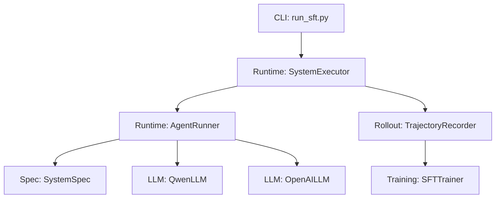
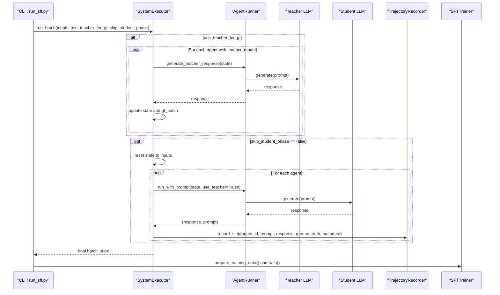
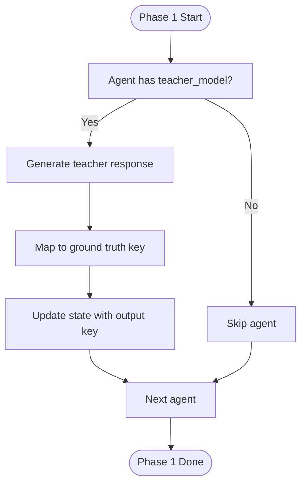
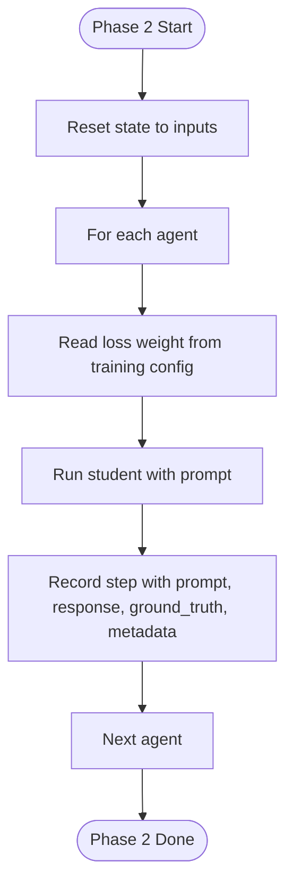
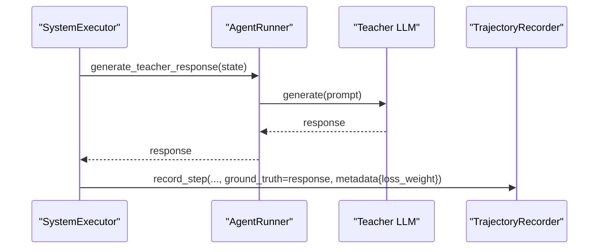
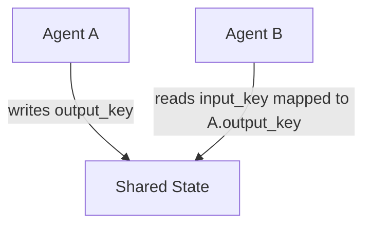
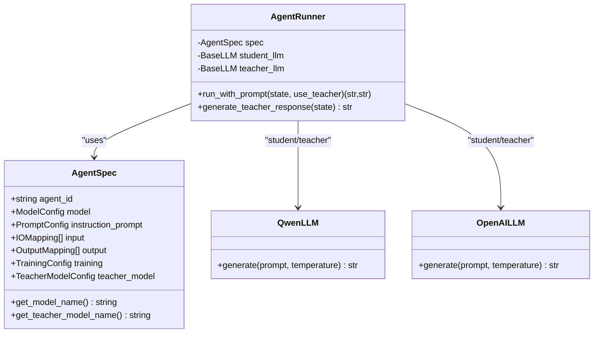
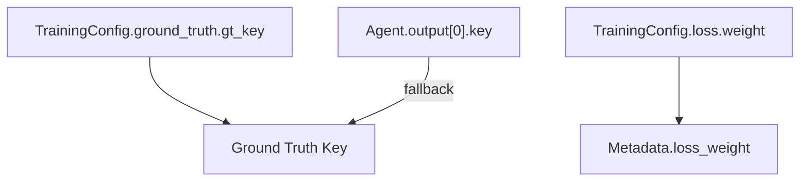
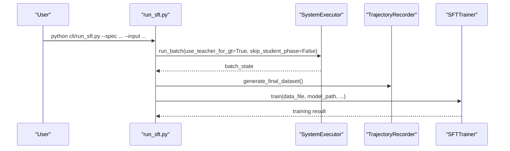
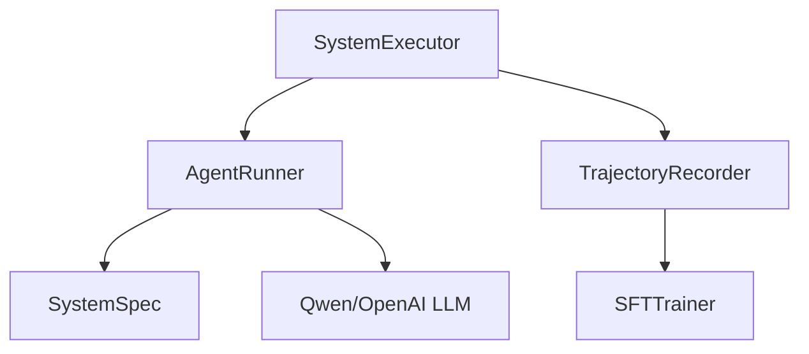

# Execution Phases

<cite>
**Referenced Files in This Document**
- [executor.py](file://runtime/executor.py)
- [agent_runner.py](file://runtime/agent_runner.py)
- [state.py](file://runtime/state.py)
- [system_spec.py](file://spec/system_spec.py)
- [recoder.py](file://rollout/recoder.py)
- [run_sft.py](file://cli/run_sft.py)
- [sft_trainer.py](file://training/sft_trainer.py)
- [qwen_llm.py](file://llm/qwen_llm.py)
- [openai_llm.py](file://llm/openai_llm.py)
- [api_config.yaml](file://configs/api_config.yaml)
</cite>

## Table of Contents
1. [Introduction](#introduction)
2. [Project Structure](#project-structure)
3. [Core Components](#core-components)
4. [Architecture Overview](#architecture-overview)
5. [Detailed Component Analysis](#detailed-component-analysis)
6. [Dependency Analysis](#dependency-analysis)
7. [Performance Considerations](#performance-considerations)
8. [Troubleshooting Guide](#troubleshooting-guide)
9. [Conclusion](#conclusion)

## Introduction
This document explains the two-phase execution system used for knowledge distillation and subsequent student model training. It covers:
- Phase 1: Teacher Ground Truth Generation
- Phase 2: Student Training Execution
It also details the knowledge distillation workflow, execution order determination, dependency resolution, state propagation, teacher model configuration, ground truth key mapping, loss weight application, examples of execution scenarios, error handling, and performance optimization techniques for large batch processing.

## Project Structure
The execution pipeline spans several modules:
- Runtime orchestration and state management
- Agent execution and LLM providers
- Trajectory recording and dataset assembly
- CLI entrypoint for end-to-end distillation and optional training
- Training integration via external trainer

**Diagram sources**
- [run_sft.py:17-117](file://cli/run_sft.py#L17-L117)
- [executor.py:9-132](file://runtime/executor.py#L9-L132)
- [agent_runner.py:10-68](file://runtime/agent_runner.py#L10-L68)
- [system_spec.py:77-114](file://spec/system_spec.py#L77-L114)
- [qwen_llm.py:7-51](file://llm/qwen_llm.py#L7-L51)
- [openai_llm.py:7-49](file://llm/openai_llm.py#L7-L49)
- [recoder.py:8-122](file://rollout/recoder.py#L8-L122)
- [sft_trainer.py:9-263](file://training/sft_trainer.py#L9-L263)

**Section sources**
- [run_sft.py:17-117](file://cli/run_sft.py#L17-L117)
- [executor.py:9-132](file://runtime/executor.py#L9-L132)
- [agent_runner.py:10-68](file://runtime/agent_runner.py#L10-L68)
- [system_spec.py:77-114](file://spec/system_spec.py#L77-L114)
- [recoder.py:8-122](file://rollout/recoder.py#L8-L122)
- [sft_trainer.py:9-263](file://training/sft_trainer.py#L9-L263)
- [qwen_llm.py:7-51](file://llm/qwen_llm.py#L7-L51)
- [openai_llm.py:7-49](file://llm/openai_llm.py#L7-L49)

## Core Components
- SystemExecutor orchestrates both phases, manages execution order, and coordinates state propagation.
- AgentRunner renders prompts, selects LLM provider (student or teacher), and executes generations.
- SystemSpec defines agent configuration, training, ground truth mapping, and model providers.
- TrajectoryRecorder persists steps with ground truth and metadata for downstream training.
- SFTTrainer converts trajectories to training-ready formats and launches training via external tools.
- LLM providers encapsulate API clients and generation logic for Qwen and OpenAI-compatible APIs.

Key responsibilities:
- Phase 1: Generate ground truths using teacher models and propagate outputs into shared state.
- Phase 2: Run student models, collect trajectories, and record ground truth aligned with training configuration.

**Section sources**
- [executor.py:9-132](file://runtime/executor.py#L9-L132)
- [agent_runner.py:10-68](file://runtime/agent_runner.py#L10-L68)
- [system_spec.py:77-114](file://spec/system_spec.py#L77-L114)
- [recoder.py:8-122](file://rollout/recoder.py#L8-L122)
- [sft_trainer.py:9-263](file://training/sft_trainer.py#L9-L263)
- [qwen_llm.py:7-51](file://llm/qwen_llm.py#L7-L51)
- [openai_llm.py:7-49](file://llm/openai_llm.py#L7-L49)

## Architecture Overview
The two-phase execution follows a deterministic order:
- Phase 1: Iterate agents in definition order; for each agent with a teacher model, generate ground truth and update state.
- Phase 2: Reset state to original inputs, iterate agents again, run student models, and record trajectories with associated metadata.

**Diagram sources**
- [run_sft.py:72-107](file://cli/run_sft.py#L72-L107)
- [executor.py:16-132](file://runtime/executor.py#L16-L132)
- [agent_runner.py:33-68](file://runtime/agent_runner.py#L33-L68)
- [recoder.py:15-40](file://rollout/recoder.py#L15-L40)
- [sft_trainer.py:16-141](file://training/sft_trainer.py#L16-L141)

## Detailed Component Analysis

### Phase 1: Teacher Ground Truth Generation
- Execution order: Agents are processed in the order defined by the system specification.
- Dependency resolution: Outputs generated in earlier agents are injected into the shared state so later agents can consume them.
- Ground truth generation:
  - For each agent with a teacher model configured, the executor invokes the agent runner to generate a response using the teacher LLM.
  - The response is stored under a ground truth key determined by the training configuration.
  - The same output key is also written into the state for downstream consumers.
- State propagation:
  - After generating ground truth for an agent, the executor updates the state with the output key so subsequent agents can reference it.

**Diagram sources**
- [executor.py:32-68](file://runtime/executor.py#L32-L68)
- [system_spec.py:23-36](file://spec/system_spec.py#L23-L36)

**Section sources**
- [executor.py:32-68](file://runtime/executor.py#L32-L68)
- [system_spec.py:23-36](file://spec/system_spec.py#L23-L36)

### Phase 2: Student Training Execution
- Execution order: Same agent order as Phase 1.
- State reset: The executor reinitializes state to the original inputs before running students, ensuring clean execution without prior teacher outputs.
- Loss weight application:
  - For each agent, the executor reads the configured loss weight from training configuration and passes it in the metadata recorded with each step.
- Trajectory recording:
  - For each step, the executor records the rendered prompt, student response, and the corresponding ground truth value (if present).
  - The recorder writes entries suitable for downstream conversion to training formats.

**Diagram sources**
- [executor.py:75-132](file://runtime/executor.py#L75-L132)
- [recoder.py:15-40](file://rollout/recoder.py#L15-L40)
- [system_spec.py:8-11](file://spec/system_spec.py#L8-L11)

**Section sources**
- [executor.py:75-132](file://runtime/executor.py#L75-L132)
- [recoder.py:15-40](file://rollout/recoder.py#L15-L40)
- [system_spec.py:8-11](file://spec/system_spec.py#L8-L11)

### Knowledge Distillation Workflow
- Ground truth generation uses the teacher model to produce canonical answers for each agent’s output key.
- These ground truths are aligned with the training configuration’s ground truth mapping and stored in the trajectory recorder.
- During student execution, the same ground truth keys are used to supervise training data preparation.

**Diagram sources**
- [executor.py:52-66](file://runtime/executor.py#L52-L66)
- [agent_runner.py:62-68](file://runtime/agent_runner.py#L62-L68)
- [recoder.py:15-40](file://rollout/recoder.py#L15-L40)

**Section sources**
- [executor.py:52-66](file://runtime/executor.py#L52-L66)
- [agent_runner.py:62-68](file://runtime/agent_runner.py#L62-L68)
- [recoder.py:15-40](file://rollout/recoder.py#L15-L40)

### Execution Order Determination and Dependency Resolution
- Execution order: The executor iterates agents in the order provided by the system specification.
- Dependency resolution: Outputs produced by earlier agents are placed into the shared state dictionary under the agent’s output key, enabling later agents to reference them via input mappings.

**Diagram sources**
- [executor.py:59-60](file://runtime/executor.py#L59-L60)
- [system_spec.py:39-59](file://spec/system_spec.py#L39-L59)

**Section sources**
- [executor.py:59-60](file://runtime/executor.py#L59-L60)
- [system_spec.py:39-59](file://spec/system_spec.py#L39-L59)

### Teacher Model Configuration and Provider Selection
- Agent configuration supports separate student and teacher models with provider selection.
- The runner initializes the appropriate LLM client based on provider and model name.
- Providers supported include Qwen and OpenAI-compatible APIs, with explicit HTTP client configuration to avoid encoding issues.

**Diagram sources**
- [system_spec.py:77-96](file://spec/system_spec.py#L77-L96)
- [agent_runner.py:10-32](file://runtime/agent_runner.py#L10-L32)
- [qwen_llm.py:7-51](file://llm/qwen_llm.py#L7-L51)
- [openai_llm.py:7-49](file://llm/openai_llm.py#L7-L49)

**Section sources**
- [system_spec.py:77-96](file://spec/system_spec.py#L77-L96)
- [agent_runner.py:10-32](file://runtime/agent_runner.py#L10-L32)
- [qwen_llm.py:7-51](file://llm/qwen_llm.py#L7-L51)
- [openai_llm.py:7-49](file://llm/openai_llm.py#L7-L49)

### Ground Truth Key Mapping and Loss Weight Application
- Ground truth key mapping:
  - The executor determines the target ground truth key from the agent’s training configuration. If unspecified, it defaults to the agent’s output key.
- Loss weight application:
  - The executor reads the loss weight from the training configuration and attaches it to the metadata recorded with each step.

**Diagram sources**
- [executor.py:55-57](file://runtime/executor.py#L55-L57)
- [executor.py:92-94](file://runtime/executor.py#L92-L94)
- [system_spec.py:23-36](file://spec/system_spec.py#L23-L36)

**Section sources**
- [executor.py:55-57](file://runtime/executor.py#L55-L57)
- [executor.py:92-94](file://runtime/executor.py#L92-L94)
- [system_spec.py:23-36](file://spec/system_spec.py#L23-L36)

### CLI Entry Point and End-to-End Scenarios
- CLI supports:
  - Loading system specification and inputs
  - Running Phase 1 only (teacher-only mode)
  - Generating trajectories and optionally launching training
- Example scenarios:
  - Teacher-only data collection: run with teacher-only flag to skip student phase and training.
  - Full pipeline: run with data collection, then re-run with training enabled to launch SFT.

**Diagram sources**
- [run_sft.py:72-107](file://cli/run_sft.py#L72-L107)
- [executor.py:16-132](file://runtime/executor.py#L16-L132)
- [sft_trainer.py:16-141](file://training/sft_trainer.py#L16-L141)

**Section sources**
- [run_sft.py:72-107](file://cli/run_sft.py#L72-L107)
- [executor.py:16-132](file://runtime/executor.py#L16-L132)
- [sft_trainer.py:16-141](file://training/sft_trainer.py#L16-L141)

## Dependency Analysis
- Coupling:
  - SystemExecutor depends on AgentRunner, SystemSpec, and TrajectoryRecorder.
  - AgentRunner depends on SystemSpec and concrete LLM implementations.
  - TrajectoryRecorder depends on the recorded metadata and ground truth presence.
- Cohesion:
  - Each module focuses on a single responsibility: orchestration, prompting/LLM invocation, configuration, recording, and training integration.
- External dependencies:
  - LLM providers rely on external APIs and configuration files.
  - Training integration relies on an external training framework.

**Diagram sources**
- [executor.py:9-14](file://runtime/executor.py#L9-L14)
- [agent_runner.py:10-32](file://runtime/agent_runner.py#L10-L32)
- [system_spec.py:77-96](file://spec/system_spec.py#L77-L96)
- [recoder.py:8-122](file://rollout/recoder.py#L8-L122)
- [sft_trainer.py:9-263](file://training/sft_trainer.py#L9-L263)

**Section sources**
- [executor.py:9-14](file://runtime/executor.py#L9-L14)
- [agent_runner.py:10-32](file://runtime/agent_runner.py#L10-L32)
- [system_spec.py:77-96](file://spec/system_spec.py#L77-L96)
- [recoder.py:8-122](file://rollout/recoder.py#L8-L122)
- [sft_trainer.py:9-263](file://training/sft_trainer.py#L9-L263)

## Performance Considerations
- Batch processing:
  - Process multiple samples sequentially within a single run to reduce overhead and leverage caching where applicable.
- State reuse:
  - Reuse the original inputs for Phase 2 to avoid recomputation and ensure deterministic student runs.
- Concurrency:
  - Consider parallelizing independent agent executions across batches while maintaining per-sample determinism.
- I/O optimization:
  - Write trajectory records incrementally to minimize memory usage and enable streaming conversions.
- LLM cost and latency:
  - Prefer efficient teacher models for Phase 1 and student models optimized for inference speed in Phase 2.
- Metadata minimization:
  - Keep metadata concise to reduce disk and transfer overhead.

[No sources needed since this section provides general guidance]

## Troubleshooting Guide
- Missing keys in state:
  - If an agent’s input mapping references a key not present in the state, the runner raises a key error during prompt rendering. Verify ground truth generation precedes dependent agents and that output keys match input mappings.
- Teacher model not configured:
  - Attempting to generate teacher responses without a teacher model raises a runtime error. Ensure teacher_model is set for agents participating in Phase 1.
- Encoding errors with LLM clients:
  - LLM providers explicitly configure HTTP clients to avoid encoding issues. If errors persist, check environment variables and ensure proper locale settings.
- Training data availability:
  - If no ground truth is recorded, the SFT trainer will filter out steps. Confirm Phase 1 ran and that ground truth keys were properly mapped.
- CLI argument validation:
  - The CLI requires either an input dataset or an existing training data file. Ensure arguments are provided correctly.

**Section sources**
- [agent_runner.py:39-41](file://runtime/agent_runner.py#L39-L41)
- [agent_runner.py:64-66](file://runtime/agent_runner.py#L64-L66)
- [qwen_llm.py:49-51](file://llm/qwen_llm.py#L49-L51)
- [run_sft.py:32-35](file://cli/run_sft.py#L32-L35)

## Conclusion
The two-phase execution system cleanly separates knowledge distillation (Phase 1) from student training (Phase 2). By leveraging deterministic execution order, explicit state propagation, and configurable teacher/student models, it enables scalable data collection and training. Proper configuration of ground truth keys and loss weights ensures high-quality training datasets, while robust error handling and performance optimizations support reliable operation at scale.