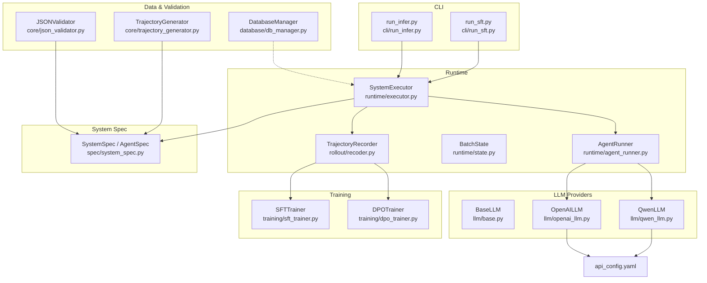
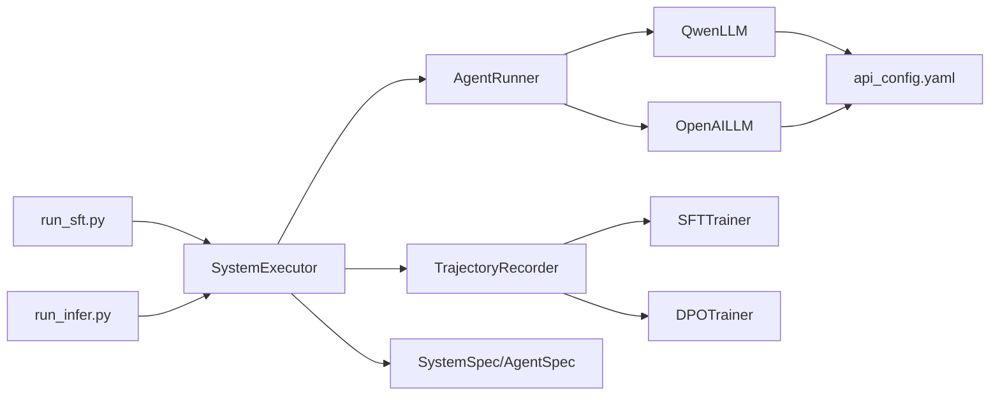

# Runtime Engine

<cite>
**Referenced Files in This Document**
- [runtime/agent_runner.py](file://runtime/agent_runner.py)
- [runtime/executor.py](file://runtime/executor.py)
- [runtime/state.py](file://runtime/state.py)
- [rollout/recoder.py](file://rollout/recoder.py)
- [spec/system_spec.py](file://spec/system_spec.py)
- [llm/base.py](file://llm/base.py)
- [llm/qwen_llm.py](file://llm/qwen_llm.py)
- [llm/openai_llm.py](file://llm/openai_llm.py)
- [cli/run_sft.py](file://cli/run_sft.py)
- [cli/run_infer.py](file://cli/run_infer.py)
- [training/sft_trainer.py](file://training/sft_trainer.py)
- [training/dpo_trainer.py](file://training/dpo_trainer.py)
- [database/db_manager.py](file://database/db_manager.py)
- [core/trajectory_generator.py](file://core/trajectory_generator.py)
- [core/json_validator.py](file://core/json_validator.py)
- [configs/api_config.yaml](file://configs/api_config.yaml)
</cite>

## Table of Contents
1. [Introduction](#introduction)
2. [Project Structure](#project-structure)
3. [Core Components](#core-components)
4. [Architecture Overview](#architecture-overview)
5. [Detailed Component Analysis](#detailed-component-analysis)
6. [Dependency Analysis](#dependency-analysis)
7. [Performance Considerations](#performance-considerations)
8. [Troubleshooting Guide](#troubleshooting-guide)
9. [Conclusion](#conclusion)
10. [Appendices](#appendices)

## Introduction
This document explains the runtime execution engine responsible for orchestrating multi-agent workflows with a two-phase execution process aligned with distillation-based supervised fine-tuning (SFT). It covers:
- Two-phase execution: teacher ground truth generation followed by student training and trajectory recording
- Agent lifecycle management, state tracking, and execution coordination
- Batch processing, trajectory recording, and real-time monitoring
- Agent runner implementation, state management patterns, and execution flow control
- Performance optimization, memory management, and error recovery mechanisms
- Practical execution scenarios, debugging techniques, and production monitoring approaches

## Project Structure
The runtime engine centers around the executor and agent runner, integrates with LLM providers, and records trajectories for downstream training. Supporting components include system specification models, validators, CLI entry points, and training integrations.



**Diagram sources**
- [runtime/executor.py:9-132](file://runtime/executor.py#L9-L132)
- [runtime/agent_runner.py:10-68](file://runtime/agent_runner.py#L10-L68)
- [runtime/state.py:1-8](file://runtime/state.py#L1-L8)
- [rollout/recoder.py:8-122](file://rollout/recoder.py#L8-L122)
- [llm/base.py:3-6](file://llm/base.py#L3-L6)
- [llm/qwen_llm.py:7-51](file://llm/qwen_llm.py#L7-L51)
- [llm/openai_llm.py:7-49](file://llm/openai_llm.py#L7-L49)
- [spec/system_spec.py:77-114](file://spec/system_spec.py#L77-L114)
- [cli/run_sft.py:17-117](file://cli/run_sft.py#L17-L117)
- [cli/run_infer.py:8-46](file://cli/run_infer.py#L8-L46)
- [training/sft_trainer.py:9-263](file://training/sft_trainer.py#L9-L263)
- [training/dpo_trainer.py:8-320](file://training/dpo_trainer.py#L8-L320)
- [core/trajectory_generator.py:58-353](file://core/trajectory_generator.py#L58-L353)
- [core/json_validator.py:37-347](file://core/json_validator.py#L37-L347)
- [database/db_manager.py:11-347](file://database/db_manager.py#L11-L347)
- [configs/api_config.yaml:1-9](file://configs/api_config.yaml#L1-L9)

**Section sources**
- [runtime/executor.py:9-132](file://runtime/executor.py#L9-L132)
- [runtime/agent_runner.py:10-68](file://runtime/agent_runner.py#L10-L68)
- [rollout/recoder.py:8-122](file://rollout/recoder.py#L8-L122)
- [spec/system_spec.py:77-114](file://spec/system_spec.py#L77-L114)
- [llm/base.py:3-6](file://llm/base.py#L3-L6)
- [llm/qwen_llm.py:7-51](file://llm/qwen_llm.py#L7-L51)
- [llm/openai_llm.py:7-49](file://llm/openai_llm.py#L7-L49)
- [cli/run_sft.py:17-117](file://cli/run_sft.py#L17-L117)
- [cli/run_infer.py:8-46](file://cli/run_infer.py#L8-L46)
- [training/sft_trainer.py:9-263](file://training/sft_trainer.py#L9-L263)
- [training/dpo_trainer.py:8-320](file://training/dpo_trainer.py#L8-L320)
- [core/trajectory_generator.py:58-353](file://core/trajectory_generator.py#L58-L353)
- [core/json_validator.py:37-347](file://core/json_validator.py#L37-L347)
- [database/db_manager.py:11-347](file://database/db_manager.py#L11-L347)
- [configs/api_config.yaml:1-9](file://configs/api_config.yaml#L1-L9)

## Core Components
- SystemExecutor: Orchestrates two-phase execution, manages agent runners, coordinates state updates, and records trajectories.
- AgentRunner: Encapsulates LLM selection (student vs teacher), prompt rendering via Jinja2 templates, and generation calls.
- TrajectoryRecorder: Streams trajectory records to JSONL for SFT/DPO/GRPO training and supports assembling datasets.
- SystemSpec and AgentSpec: Define agent configuration, I/O mappings, training settings, and execution order hints.
- LLM Providers: QwenLLM and OpenAILLM implement BaseLLM with robust HTTP client initialization and error handling.
- CLI Entrypoints: run_sft.py and run_infer.py drive end-to-end workflows and optional training.
- Training Integrations: SFTTrainer and DPOTrainer integrate with ms-swift, preparing datasets and launching training.
- Validation and Trajectory Generation: JSONValidator computes execution order and detects cycles; TrajectoryGenerator builds step-level traces.

**Section sources**
- [runtime/executor.py:9-132](file://runtime/executor.py#L9-L132)
- [runtime/agent_runner.py:10-68](file://runtime/agent_runner.py#L10-L68)
- [rollout/recoder.py:8-122](file://rollout/recoder.py#L8-L122)
- [spec/system_spec.py:77-114](file://spec/system_spec.py#L77-L114)
- [llm/base.py:3-6](file://llm/base.py#L3-L6)
- [llm/qwen_llm.py:7-51](file://llm/qwen_llm.py#L7-L51)
- [llm/openai_llm.py:7-49](file://llm/openai_llm.py#L7-L49)
- [cli/run_sft.py:17-117](file://cli/run_sft.py#L17-L117)
- [cli/run_infer.py:8-46](file://cli/run_infer.py#L8-L46)
- [training/sft_trainer.py:9-263](file://training/sft_trainer.py#L9-L263)
- [training/dpo_trainer.py:8-320](file://training/dpo_trainer.py#L8-L320)
- [core/trajectory_generator.py:58-353](file://core/trajectory_generator.py#L58-L353)
- [core/json_validator.py:37-347](file://core/json_validator.py#L37-L347)

## Architecture Overview
The runtime engine executes a deterministic two-phase pipeline:
- Phase 1 (Teacher): For agents with teacher models configured, generate ground truth responses and propagate them into shared state for dependent agents.
- Phase 2 (Student): Reset state to original inputs, run student models, collect responses, and record trajectories with optional ground truth for training.

```mermaid
sequenceDiagram
participant CLI as "CLI (run_sft.py)"
participant Exec as "SystemExecutor"
participant Runner as "AgentRunner"
participant T as "TrajectoryRecorder"
participant L1 as "QwenLLM/OpenAILLM"
participant L2 as "QwenLLM/OpenAILLM (Student)"
CLI->>Exec : "run_batch(inputs, use_teacher_for_gt, skip_student_phase)"
alt use_teacher_for_gt
loop For each agent with teacher_model
Exec->>Runner : "generate_teacher_response(state)"
Runner->>L1 : "generate(rendered_prompt, temperature)"
L1-->>Runner : "teacher_response"
Runner-->>Exec : "teacher_response"
Exec->>Exec : "update batch_state with GT"
end
end
opt skip_student_phase
Exec-->>CLI : "return batch_state (GT only)"
else run student phase
Exec->>Exec : "reset batch_state to inputs"
loop For each agent
Exec->>Runner : "run_with_prompt(state, use_teacher=False)"
Runner->>L2 : "generate(rendered_prompt, temperature)"
L2-->>Runner : "response"
Runner-->>Exec : "response, rendered_prompt"
Exec->>Exec : "update batch_state"
Exec->>T : "record_step(agent_id, prompt, response, ground_truth, metadata)"
end
end
Exec-->>CLI : "return batch_state"
```

**Diagram sources**
- [runtime/executor.py:16-132](file://runtime/executor.py#L16-L132)
- [runtime/agent_runner.py:33-68](file://runtime/agent_runner.py#L33-L68)
- [rollout/recoder.py:15-42](file://rollout/recoder.py#L15-L42)
- [llm/qwen_llm.py:40-51](file://llm/qwen_llm.py#L40-L51)
- [llm/openai_llm.py:43-49](file://llm/openai_llm.py#L43-L49)

## Detailed Component Analysis

### SystemExecutor: Two-Phase Execution and Coordination
- Initializes agents, runners, and optional trajectory recorder.
- run_batch orchestrates:
  - Phase 1: Iterate agents in execution order; for agents with teacher_model, render prompts and call generate_teacher_response; write ground truth into gt_batch and update batch_state for subsequent agents.
  - Optional skip_student_phase to return only generated ground truths.
  - Phase 2: Reset batch_state to original inputs; run student models; update state; record trajectory steps with optional ground truth and metadata.

Key behaviors:
- State isolation: batch_state is deep-copied per sample to avoid cross-sample contamination.
- Ground truth propagation: output keys from teacher GT are written into state so dependent agents receive upstream values.
- Metadata injection: loss weights, model names, and phase markers are recorded for training alignment.

**Section sources**
- [runtime/executor.py:9-132](file://runtime/executor.py#L9-L132)

### AgentRunner: LLM Selection, Prompt Rendering, and Generation
- Selects student LLM based on agent_spec.model_provider; optionally initializes teacher LLM if configured.
- Renders instruction prompts using Jinja2 templates with a context containing input mappings.
- run_with_prompt:
  - Validates required keys in state against agent input mappings.
  - Renders prompt and selects either teacher or student LLM based on use_teacher flag.
  - Returns response and rendered prompt for recording.
- generate_teacher_response: Convenience wrapper to force teacher model usage.

**Section sources**
- [runtime/agent_runner.py:10-68](file://runtime/agent_runner.py#L10-L68)
- [spec/system_spec.py:77-96](file://spec/system_spec.py#L77-L96)

### TrajectoryRecorder: Batch Trajectory Streaming and Assembly
- Streams per-step records to a JSONL file with messages and optional ground_truth.
- Supports assembling SFT-style datasets by grouping by sample_id and collecting per-agent GTs.
- Converts to SWIFT-compatible format preserving messages and loss weights.

**Section sources**
- [rollout/recoder.py:8-122](file://rollout/recoder.py#L8-L122)

### SystemSpec and AgentSpec: Configuration Contracts
- AgentSpec defines:
  - model and teacher_model providers and names
  - instruction_prompt template and temperature
  - input/output mappings and training configuration
- SystemSpec loads agent lists from JSON and provides from_file convenience.

**Section sources**
- [spec/system_spec.py:77-114](file://spec/system_spec.py#L77-L114)

### LLM Providers: BaseLLM and Implementations
- BaseLLM defines the generate interface.
- QwenLLM and OpenAILLM:
  - Load credentials and base URLs from api_config.yaml
  - Initialize OpenAI clients with explicit httpx clients to avoid header encoding issues
  - Implement generate with chat completions and temperature control

**Section sources**
- [llm/base.py:3-6](file://llm/base.py#L3-L6)
- [llm/qwen_llm.py:7-51](file://llm/qwen_llm.py#L7-L51)
- [llm/openai_llm.py:7-49](file://llm/openai_llm.py#L7-L49)
- [configs/api_config.yaml:1-9](file://configs/api_config.yaml#L1-L9)

### CLI Entrypoints: Execution Scenarios
- run_sft.py:
  - Loads SystemSpec and inputs
  - Executes run_batch with optional teacher-only mode
  - Converts trajectory JSONL to final dataset and optionally launches training via SFTTrainer
- run_infer.py:
  - Runs batch inference with optional preloaded ground truths

**Section sources**
- [cli/run_sft.py:17-117](file://cli/run_sft.py#L17-L117)
- [cli/run_infer.py:8-46](file://cli/run_infer.py#L8-L46)

### Training Integrations: SFT and DPO
- SFTTrainer:
  - Prepares SFT data by filtering steps with ground truth and writing JSONL
  - Builds and saves training command/config for ms-swift
  - Provides API-based training path with error handling
- DPOTrainer:
  - Prepares preference pairs from trajectories where response differs from ground truth
  - Supports both trajectory-derived and external preference pair inputs
  - Mirrors SFTTrainer’s command construction and API training flow

**Section sources**
- [training/sft_trainer.py:9-263](file://training/sft_trainer.py#L9-L263)
- [training/dpo_trainer.py:8-320](file://training/dpo_trainer.py#L8-L320)

### Validation and Trajectory Generation
- JSONValidator:
  - Parses and validates agent configurations
  - Detects missing fields, duplicate agent ids, invalid references, and training mode constraints
  - Builds execution graph and detects cycles; produces topological execution order
- TrajectoryGenerator:
  - Generates per-sample trajectories with steps, ground truth, and metadata
  - Exports to SFT/DPO/GRPO formats and computes statistics

**Section sources**
- [core/json_validator.py:37-347](file://core/json_validator.py#L37-L347)
- [core/trajectory_generator.py:58-353](file://core/trajectory_generator.py#L58-L353)

## Dependency Analysis
- Coupling:
  - SystemExecutor depends on AgentRunner instances and TrajectoryRecorder.
  - AgentRunner depends on LLM providers and SystemSpec for model/provider selection.
  - CLI scripts depend on SystemExecutor and trainers.
  - TrajectoryRecorder is decoupled from training engines; it emits JSONL consumed by trainers.
- Cohesion:
  - Runtime components encapsulate execution logic; LLM providers encapsulate provider-specific concerns.
- External dependencies:
  - Network libraries (httpx) and OpenAI SDK for provider APIs
  - YAML loader for configuration
  - ms-swift for training orchestration



**Diagram sources**
- [runtime/executor.py:9-132](file://runtime/executor.py#L9-L132)
- [runtime/agent_runner.py:10-68](file://runtime/agent_runner.py#L10-L68)
- [rollout/recoder.py:8-122](file://rollout/recoder.py#L8-L122)
- [llm/qwen_llm.py:7-51](file://llm/qwen_llm.py#L7-L51)
- [llm/openai_llm.py:7-49](file://llm/openai_llm.py#L7-L49)
- [spec/system_spec.py:77-114](file://spec/system_spec.py#L77-L114)
- [cli/run_sft.py:17-117](file://cli/run_sft.py#L17-L117)
- [cli/run_infer.py:8-46](file://cli/run_infer.py#L8-L46)
- [training/sft_trainer.py:9-263](file://training/sft_trainer.py#L9-L263)
- [training/dpo_trainer.py:8-320](file://training/dpo_trainer.py#L8-L320)
- [configs/api_config.yaml:1-9](file://configs/api_config.yaml#L1-L9)

**Section sources**
- [runtime/executor.py:9-132](file://runtime/executor.py#L9-L132)
- [runtime/agent_runner.py:10-68](file://runtime/agent_runner.py#L10-L68)
- [rollout/recoder.py:8-122](file://rollout/recoder.py#L8-L122)
- [spec/system_spec.py:77-114](file://spec/system_spec.py#L77-L114)
- [llm/base.py:3-6](file://llm/base.py#L3-L6)
- [llm/qwen_llm.py:7-51](file://llm/qwen_llm.py#L7-L51)
- [llm/openai_llm.py:7-49](file://llm/openai_llm.py#L7-L49)
- [cli/run_sft.py:17-117](file://cli/run_sft.py#L17-L117)
- [cli/run_infer.py:8-46](file://cli/run_infer.py#L8-L46)
- [training/sft_trainer.py:9-263](file://training/sft_trainer.py#L9-L263)
- [training/dpo_trainer.py:8-320](file://training/dpo_trainer.py#L8-L320)
- [configs/api_config.yaml:1-9](file://configs/api_config.yaml#L1-L9)

## Performance Considerations
- Memory management:
  - BatchState is a list of dicts; deep-copy per sample avoids unintended mutations across steps.
  - TrajectoryRecorder writes incrementally to JSONL to limit memory footprint during long runs.
- Concurrency and throughput:
  - Current implementation executes sequentially per agent and per sample; consider batching LLM calls at the provider level if supported by the underlying SDK.
- I/O efficiency:
  - Single-pass trajectory assembly reduces repeated reads; ensure disk write buffering is acceptable for your workload.
- Provider stability:
  - Explicit httpx client initialization prevents header encoding issues and improves reliability under varied environments.

[No sources needed since this section provides general guidance]

## Troubleshooting Guide
Common issues and remedies:
- Missing keys in state:
  - Symptom: KeyError indicating a required input key is absent.
  - Fix: Verify agent.input mappings and ensure inputs contain all referenced keys.
- Unsupported model provider:
  - Symptom: ValueError for unsupported provider in AgentRunner.
  - Fix: Set model_provider to supported values and confirm configuration.
- Teacher model not configured:
  - Symptom: RuntimeError when calling generate_teacher_response without teacher_model.
  - Fix: Add teacher_model to AgentSpec for agents requiring ground truth generation.
- Encoding errors in provider clients:
  - Symptom: Exceptions mentioning encoding issues.
  - Fix: Ensure environment variables are ASCII-friendly; the LLM implementations already set explicit headers to mitigate this.
- Training data preparation failures:
  - Symptom: Empty or malformed training files.
  - Fix: Confirm trajectory JSONL exists and contains steps with ground truth; verify trainer prepares data correctly.

**Section sources**
- [runtime/agent_runner.py:33-68](file://runtime/agent_runner.py#L33-L68)
- [runtime/executor.py:16-132](file://runtime/executor.py#L16-L132)
- [llm/qwen_llm.py:40-51](file://llm/qwen_llm.py#L40-L51)
- [llm/openai_llm.py:43-49](file://llm/openai_llm.py#L43-L49)
- [training/sft_trainer.py:16-58](file://training/sft_trainer.py#L16-L58)
- [training/dpo_trainer.py:15-59](file://training/dpo_trainer.py#L15-L59)

## Conclusion
The runtime engine provides a robust, configurable, and extensible framework for multi-agent execution with teacher-student distillation. Its two-phase design cleanly separates ground truth generation from student training, while trajectory recording and CLI-driven workflows streamline production pipelines. With clear separation of concerns, strong validation, and practical training integrations, it supports scalable deployment and maintenance.

[No sources needed since this section summarizes without analyzing specific files]

## Appendices

### Execution Scenarios and Examples
- Distillation-based SFT:
  - Use run_sft.py with --spec and --input to generate teacher GTs, assemble datasets, and optionally launch training.
- Teacher-only data collection:
  - Use run_sft.py with --teacher_only to collect GTs without running student or training.
- Batch inference:
  - Use run_infer.py with --spec and --input to run student models and capture outputs in state.

**Section sources**
- [cli/run_sft.py:17-117](file://cli/run_sft.py#L17-L117)
- [cli/run_infer.py:8-46](file://cli/run_infer.py#L8-L46)

### Monitoring and Production Deployment Approaches
- Real-time monitoring:
  - Print statements indicate phase transitions and per-sample progress; extend with structured logging for production dashboards.
  - TrajectoryRecorder prints file paths upon completion; monitor these locations for data readiness.
- Database integration:
  - DatabaseManager tracks datasets, system configs, generated data, executions, and training jobs; leverage it for audit trails and status tracking.
- Validation feedback:
  - JSONValidator provides execution order and warnings; surface these in UIs or CI checks to prevent misconfiguration.

**Section sources**
- [runtime/executor.py:32-132](file://runtime/executor.py#L32-L132)
- [rollout/recoder.py:11-42](file://rollout/recoder.py#L11-L42)
- [database/db_manager.py:11-347](file://database/db_manager.py#L11-L347)
- [core/json_validator.py:37-82](file://core/json_validator.py#L37-L82)