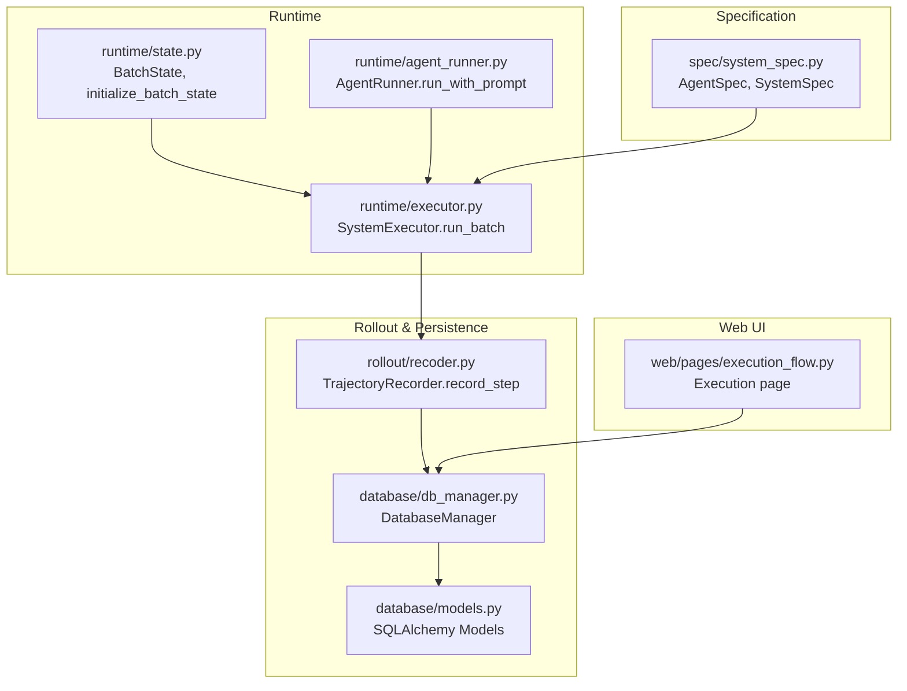
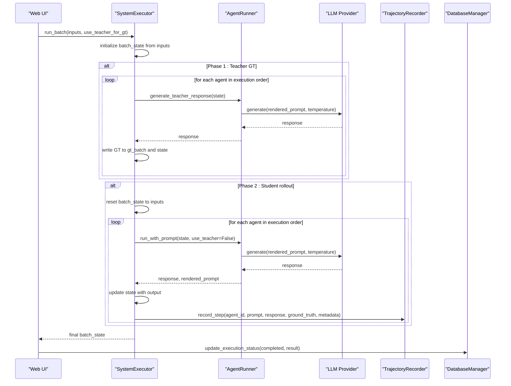
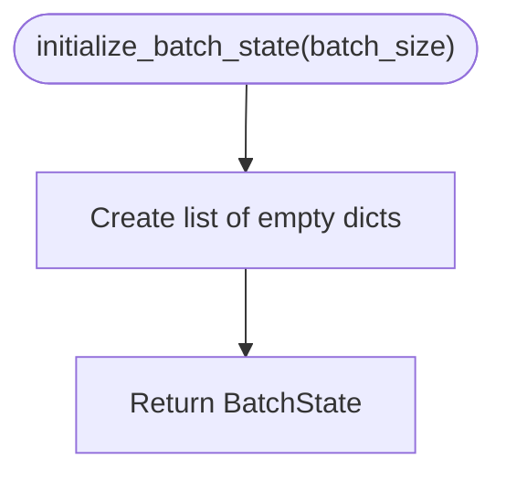
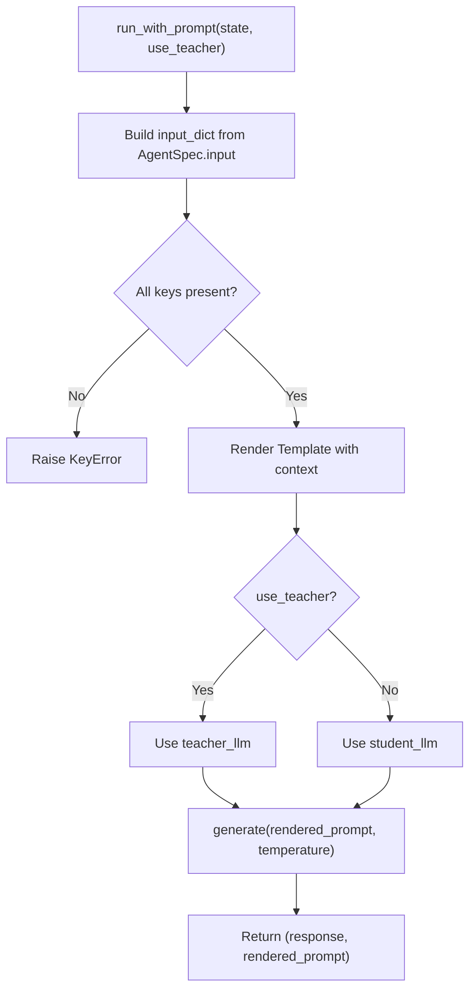
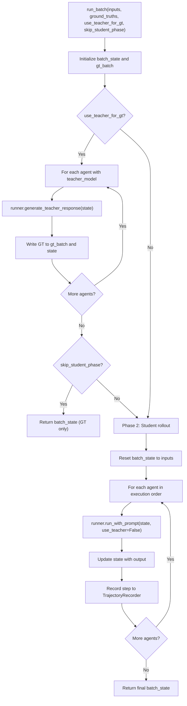
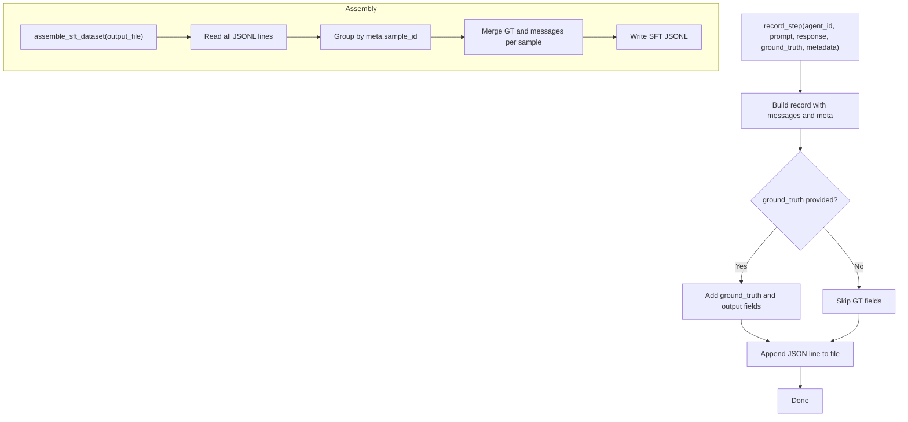
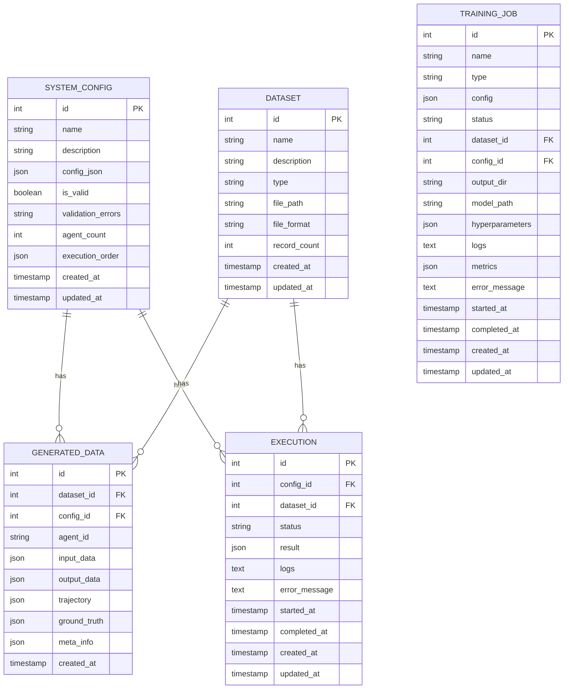
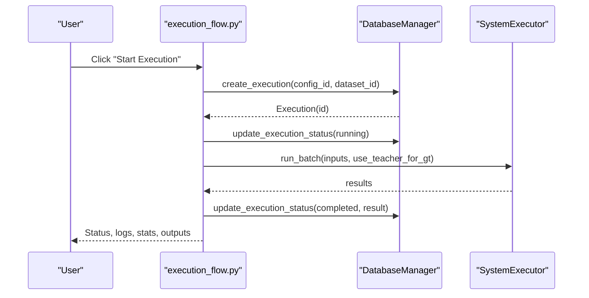
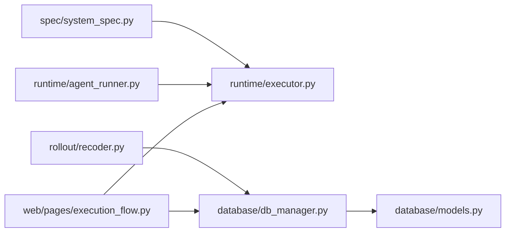

# State Tracking and Persistence

<cite>
**Referenced Files in This Document**
- [runtime/state.py](file://runtime/state.py)
- [runtime/agent_runner.py](file://runtime/agent_runner.py)
- [runtime/executor.py](file://runtime/executor.py)
- [rollout/recoder.py](file://rollout/recoder.py)
- [database/db_manager.py](file://database/db_manager.py)
- [database/models.py](file://database/models.py)
- [core/trajectory_generator.py](file://core/trajectory_generator.py)
- [web/pages/execution_flow.py](file://web/pages/execution_flow.py)
- [spec/system_spec.py](file://spec/system_spec.py)
</cite>

## Table of Contents
1. [Introduction](#introduction)
2. [Project Structure](#project-structure)
3. [Core Components](#core-components)
4. [Architecture Overview](#architecture-overview)
5. [Detailed Component Analysis](#detailed-component-analysis)
6. [Dependency Analysis](#dependency-analysis)
7. [Performance Considerations](#performance-considerations)
8. [Troubleshooting Guide](#troubleshooting-guide)
9. [Conclusion](#conclusion)

## Introduction
This document explains the state tracking and persistence mechanisms in the runtime engine. It covers how execution state is modeled, propagated across agents, serialized during rollouts, persisted to databases, and monitored via execution records. It also provides guidance on debugging state-related issues, ensuring consistency under concurrency assumptions, and optimizing performance for state-heavy workloads.

## Project Structure
The runtime engine centers around three pillars:
- State representation and initialization for batch processing
- Agent execution that reads from and writes to shared state
- Rollout recording and database persistence for training data and execution metadata

**Diagram sources**
- [runtime/state.py:1-8](file://runtime/state.py#L1-L8)
- [runtime/agent_runner.py:10-68](file://runtime/agent_runner.py#L10-L68)
- [runtime/executor.py:9-132](file://runtime/executor.py#L9-L132)
- [rollout/recoder.py:8-122](file://rollout/recoder.py#L8-L122)
- [database/db_manager.py:11-347](file://database/db_manager.py#L11-L347)
- [database/models.py:10-123](file://database/models.py#L10-L123)
- [spec/system_spec.py:77-114](file://spec/system_spec.py#L77-L114)
- [web/pages/execution_flow.py](file://web/pages/execution_flow.py)

**Section sources**
- [runtime/state.py:1-8](file://runtime/state.py#L1-L8)
- [runtime/executor.py:9-132](file://runtime/executor.py#L9-L132)
- [rollout/recoder.py:8-122](file://rollout/recoder.py#L8-L122)
- [database/db_manager.py:11-347](file://database/db_manager.py#L11-L347)
- [database/models.py:10-123](file://database/models.py#L10-L123)
- [spec/system_spec.py:77-114](file://spec/system_spec.py#L77-L114)
- [web/pages/execution_flow.py](file://web/pages/execution_flow.py)

## Core Components
- Batch state: A list of dictionaries representing per-sample state for batch execution.
- Agent runner: Reads required keys from state, renders prompts, invokes LLMs, and returns responses.
- Executor: Orchestrates two-phase execution (teacher GT generation, then student rollout), updates state, and records trajectories.
- Trajectory recorder: Writes step-level rollout data to JSONL and supports assembling SFT datasets.
- Database manager: Manages SQLite-backed persistence for datasets, system configurations, generated data, executions, and training jobs.
- Specification: Defines agent and system configuration structures used to drive execution order and IO mapping.

Key responsibilities:
- State management: Initialize, propagate, and reset state per phase.
- Serialization: Convert rollout steps to JSONL and assemble training-ready datasets.
- Persistence: Store execution metadata and generated data for later retrieval and training.
- Monitoring: Track execution status and timestamps.

**Section sources**
- [runtime/state.py:1-8](file://runtime/state.py#L1-L8)
- [runtime/agent_runner.py:33-68](file://runtime/agent_runner.py#L33-L68)
- [runtime/executor.py:16-132](file://runtime/executor.py#L16-L132)
- [rollout/recoder.py:15-42](file://rollout/recoder.py#L15-L42)
- [database/db_manager.py:11-347](file://database/db_manager.py#L11-L347)
- [database/models.py:10-123](file://database/models.py#L10-L123)
- [spec/system_spec.py:77-114](file://spec/system_spec.py#L77-L114)

## Architecture Overview
The runtime engine executes agents in a deterministic order derived from system specification. It maintains a per-batch state dictionary that is mutated by each agent’s output. Two-phase execution ensures ground-truth alignment before student rollout. Rollout steps are recorded to disk and optionally assembled into training datasets. Execution metadata is persisted to a local SQLite database.

**Diagram sources**
- [runtime/executor.py:16-132](file://runtime/executor.py#L16-L132)
- [runtime/agent_runner.py:33-68](file://runtime/agent_runner.py#L33-L68)
- [rollout/recoder.py:15-42](file://rollout/recoder.py#L15-L42)
- [web/pages/execution_flow.py:116-224](file://web/pages/execution_flow.py#L116-L224)

## Detailed Component Analysis

### State Representation and Initialization
- BatchState is a list of dictionaries, one per sample.
- Initialization creates empty dictionaries for each sample to serve as writable state containers.

**Diagram sources**
- [runtime/state.py:7-8](file://runtime/state.py#L7-L8)

**Section sources**
- [runtime/state.py:1-8](file://runtime/state.py#L1-L8)

### Agent Runner: State Access and Prompt Rendering
- Validates required input keys exist in state before rendering prompts.
- Renders Jinja2 templates with a context containing input data.
- Chooses between teacher and student model providers based on configuration.
- Returns both the response and the rendered prompt for logging/training.

**Diagram sources**
- [runtime/agent_runner.py:33-60](file://runtime/agent_runner.py#L33-L60)

**Section sources**
- [runtime/agent_runner.py:33-68](file://runtime/agent_runner.py#L33-L68)

### System Executor: Two-Phase Execution and State Propagation
- Phase 1: For agents with teacher models, generate ground truth and write to both per-sample state and a separate GT batch.
- Phase 2: Reset state to original inputs, run student models, update state, and record rollout steps.
- Records trajectory metadata including sample_id, model names, loss weights, and phase.

**Diagram sources**
- [runtime/executor.py:16-132](file://runtime/executor.py#L16-L132)

**Section sources**
- [runtime/executor.py:16-132](file://runtime/executor.py#L16-L132)

### Trajectory Recording and Dataset Assembly
- Records each step as a JSON object with messages, optional ground truth, and metadata.
- Supports assembling a consolidated SFT dataset by grouping by sample_id and collecting per-agent GT and messages.
- Provides conversion to SWIFT-compatible format.

**Diagram sources**
- [rollout/recoder.py:15-42](file://rollout/recoder.py#L15-L42)
- [rollout/recoder.py:44-96](file://rollout/recoder.py#L44-L96)

**Section sources**
- [rollout/recoder.py:15-42](file://rollout/recoder.py#L15-L42)
- [rollout/recoder.py:44-96](file://rollout/recoder.py#L44-L96)

### Database Persistence and Execution Monitoring
- DatabaseManager encapsulates CRUD operations for datasets, system configurations, generated data, executions, and training jobs.
- Execution records track status, timestamps, logs, and results.
- GeneratedData persists rollout trajectories, inputs, outputs, and ground truths as JSON.

**Diagram sources**
- [database/models.py:10-123](file://database/models.py#L10-L123)
- [database/db_manager.py:11-347](file://database/db_manager.py#L11-L347)

**Section sources**
- [database/models.py:10-123](file://database/models.py#L10-L123)
- [database/db_manager.py:11-347](file://database/db_manager.py#L11-L347)

### Web Execution Flow and Progress Monitoring
- The execution page orchestrates running a selected configuration against a chosen dataset.
- It creates an Execution record, sets status to running, executes the SystemExecutor, and upon completion updates status to completed with results.
- The UI displays execution status, progress, logs, and basic statistics.

**Diagram sources**
- [web/pages/execution_flow.py:116-224](file://web/pages/execution_flow.py#L116-L224)
- [runtime/executor.py:16-132](file://runtime/executor.py#L16-L132)
- [database/db_manager.py:205-245](file://database/db_manager.py#L205-L245)

**Section sources**
- [web/pages/execution_flow.py:116-224](file://web/pages/execution_flow.py#L116-L224)
- [database/db_manager.py:205-245](file://database/db_manager.py#L205-L245)

### State Consistency, Concurrency, and Recovery
- Consistency: The executor resets state to inputs before student rollout to avoid leaking teacher outputs into student generation. This ensures deterministic behavior per agent.
- Concurrency: The current design operates synchronously in the web page handler. There is no explicit locking mechanism; however, each execution uses separate Execution records and distinct rollout files, minimizing cross-contamination.
- Recovery: Execution records capture status and timestamps. GeneratedData stores trajectories as JSON, enabling reprocessing. The trajectory recorder writes append-only JSONL files, supporting incremental assembly.

**Section sources**
- [runtime/executor.py:80-81](file://runtime/executor.py#L80-L81)
- [runtime/executor.py:16-132](file://runtime/executor.py#L16-L132)
- [rollout/recoder.py:15-42](file://rollout/recoder.py#L15-L42)
- [database/db_manager.py:205-245](file://database/db_manager.py#L205-L245)

## Dependency Analysis
- SystemExecutor depends on AgentRunner and TrajectoryRecorder to execute agents and record steps.
- AgentRunner depends on AgentSpec and LLM providers to render prompts and generate responses.
- TrajectoryRecorder writes to disk and optionally reads back to assemble datasets.
- DatabaseManager persists Execution and GeneratedData records for auditability and reproducibility.
- Web execution page coordinates UI events with DatabaseManager and SystemExecutor.

**Diagram sources**
- [spec/system_spec.py:77-114](file://spec/system_spec.py#L77-L114)
- [runtime/executor.py:9-15](file://runtime/executor.py#L9-L15)
- [runtime/agent_runner.py:2-7](file://runtime/agent_runner.py#L2-L7)
- [rollout/recoder.py:1-6](file://rollout/recoder.py#L1-L6)
- [database/db_manager.py:1-8](file://database/db_manager.py#L1-L8)
- [database/models.py:1-6](file://database/models.py#L1-L6)
- [web/pages/execution_flow.py:1-7](file://web/pages/execution_flow.py#L1-L7)

**Section sources**
- [runtime/executor.py:9-15](file://runtime/executor.py#L9-L15)
- [runtime/agent_runner.py:2-7](file://runtime/agent_runner.py#L2-L7)
- [rollout/recoder.py:1-6](file://rollout/recoder.py#L1-L6)
- [database/db_manager.py:1-8](file://database/db_manager.py#L1-L8)
- [database/models.py:1-6](file://database/models.py#L1-L6)
- [web/pages/execution_flow.py:1-7](file://web/pages/execution_flow.py#L1-L7)

## Performance Considerations
- Minimize deep copies: The executor duplicates inputs into batch_state. For very large inputs, consider passing references or using immutable structures where safe.
- Reduce I/O: TrajectoryRecorder appends to JSONL incrementally. For massive batches, consider batching writes or using buffered I/O.
- Assemble datasets offline: The SFT assembly process reads the entire JSONL. For large datasets, pre-assemble or stream-process to reduce memory pressure.
- Database contention: SQLite is single-writer friendly. Keep writes to Execution and GeneratedData minimal and grouped to reduce lock contention.
- LLM latency: Parallelize independent agent runs within a sample when possible, but note that state propagation requires ordered execution.

[No sources needed since this section provides general guidance]

## Troubleshooting Guide
Common issues and resolutions:
- Missing state keys during prompt rendering:
  - Symptom: KeyError indicating a missing key required by an agent.
  - Cause: AgentSpec.input references a key not present in state.
  - Resolution: Ensure prior agents write the required keys or adjust AgentSpec.input mappings.
  - Section sources
    - [runtime/agent_runner.py:39-41](file://runtime/agent_runner.py#L39-L41)

- Teacher model not configured:
  - Symptom: RuntimeError when attempting to generate teacher response.
  - Cause: AgentSpec.teacher_model is None.
  - Resolution: Configure teacher_model in AgentSpec or skip teacher generation.
  - Section sources
    - [runtime/agent_runner.py:64-67](file://runtime/agent_runner.py#L64-L67)

- Incorrect execution order:
  - Symptom: Agents receive stale or missing inputs.
  - Cause: Execution order not aligned with dependencies.
  - Resolution: Validate system configuration and rely on SystemSpec-derived order.
  - Section sources
    - [spec/system_spec.py:100-114](file://spec/system_spec.py#L100-L114)
    - [core/trajectory_generator.py:68-72](file://core/trajectory_generator.py#L68-L72)

- Rollout data mismatch:
  - Symptom: Assembled SFT dataset lacks expected GT fields.
  - Cause: Missing ground truth keys or incorrect metadata.sample_id.
  - Resolution: Verify ground truth generation and metadata inclusion in record_step.
  - Section sources
    - [runtime/executor.py:54-60](file://runtime/executor.py#L54-L60)
    - [rollout/recoder.py:15-42](file://rollout/recoder.py#L15-L42)

- Execution stuck or inconsistent status:
  - Symptom: Execution remains pending or fails to update.
  - Cause: Exceptions during execution or UI not invoking status updates.
  - Resolution: Ensure exceptions are handled and update_execution_status is called after completion.
  - Section sources
    - [web/pages/execution_flow.py:173-178](file://web/pages/execution_flow.py#L173-L178)
    - [database/db_manager.py:221-245](file://database/db_manager.py#L221-L245)

## Conclusion
The runtime engine models execution state as a simple, mutable dictionary per sample, with clear two-phase execution to produce ground truth and student rollouts. State is propagated deterministically along the agent execution order, recorded to JSONL for training, and persisted to a local SQLite database for auditing and recovery. While the current design is synchronous and single-writer friendly, it provides a solid foundation for state-heavy workloads with straightforward debugging hooks and extensibility points for future enhancements such as asynchronous execution and advanced persistence strategies.