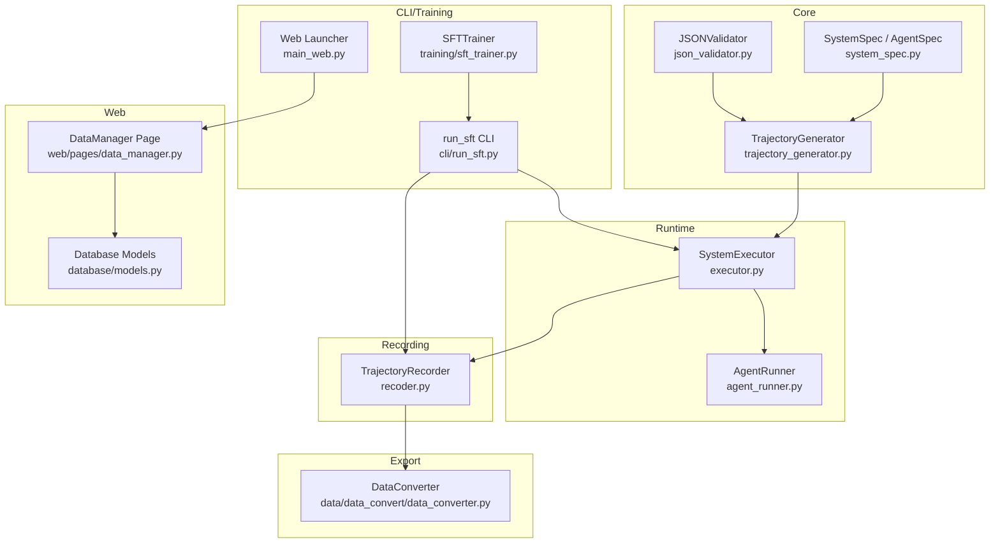
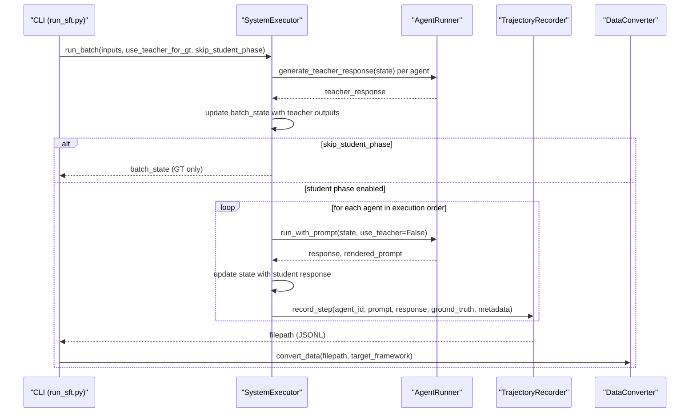
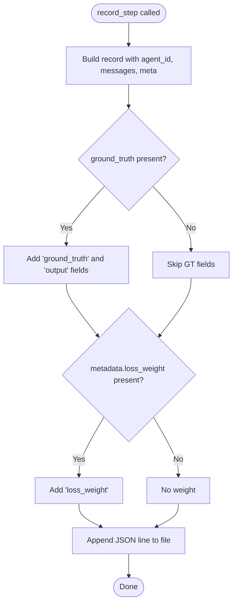
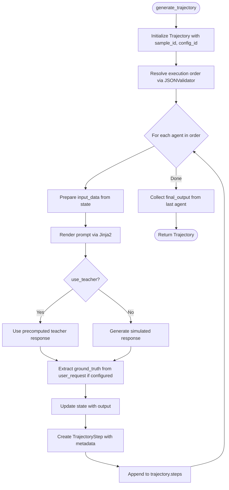
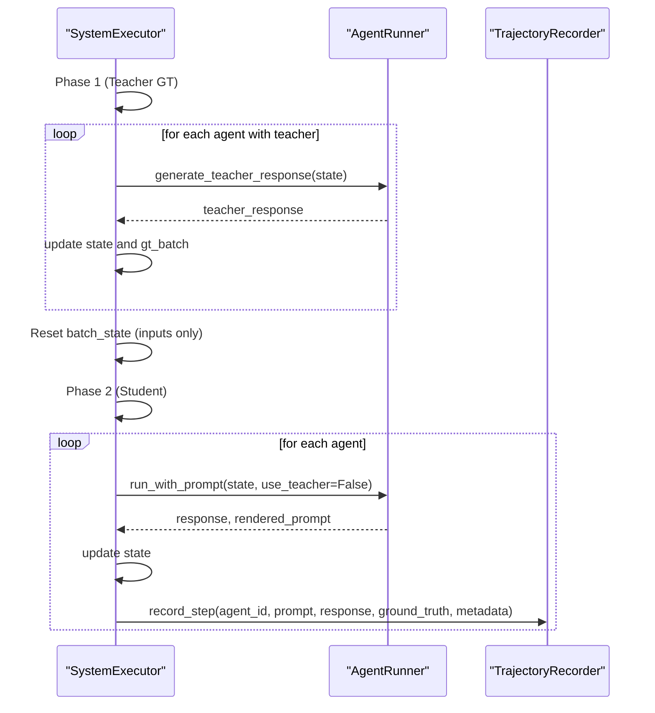
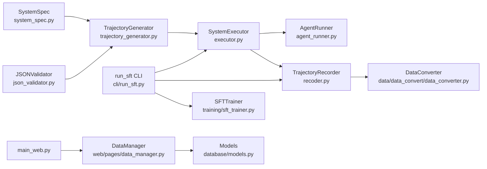

# Trajectory Recording and Data Collection

<cite>
**Referenced Files in This Document**
- [recoder.py](file://rollout/recoder.py)
- [trajectory_generator.py](file://core/trajectory_generator.py)
- [agent_runner.py](file://runtime/agent_runner.py)
- [executor.py](file://runtime/executor.py)
- [system_spec.py](file://spec/system_spec.py)
- [json_validator.py](file://core/json_validator.py)
- [data_converter.py](file://data/data_convert/data_converter.py)
- [data_manager.py](file://web/pages/data_manager.py)
- [models.py](file://database/models.py)
- [run_sft.py](file://cli/run_sft.py)
- [sft_trainer.py](file://training/sft_trainer.py)
- [main_web.py](file://main_web.py)
</cite>

## Table of Contents
1. [Introduction](#introduction)
2. [Project Structure](#project-structure)
3. [Core Components](#core-components)
4. [Architecture Overview](#architecture-overview)
5. [Detailed Component Analysis](#detailed-component-analysis)
6. [Dependency Analysis](#dependency-analysis)
7. [Performance Considerations](#performance-considerations)
8. [Troubleshooting Guide](#troubleshooting-guide)
9. [Conclusion](#conclusion)
10. [Appendices](#appendices)

## Introduction
This document explains the trajectory recording and data collection pipeline used for multi-agent system evaluation and distillation-based supervised fine-tuning. It covers how prompts and responses are captured, how ground truth is associated, how metadata is preserved, and how data is exported into training-ready formats. It also describes the CLI-driven workflow, web-based data management, and integration with training pipelines.

## Project Structure
The trajectory recording and data collection spans several modules:
- Runtime orchestration and execution
- Trajectory generation and recording
- Data export and conversion
- Web-based data management and database models
- CLI entry points and training integration

**Diagram sources**
- [executor.py:1-132](file://runtime/executor.py#L1-L132)
- [agent_runner.py:1-68](file://runtime/agent_runner.py#L1-L68)
- [trajectory_generator.py:1-354](file://core/trajectory_generator.py#L1-L354)
- [system_spec.py:1-114](file://spec/system_spec.py#L1-L114)
- [json_validator.py:1-347](file://core/json_validator.py#L1-L347)
- [recoder.py:1-122](file://rollout/recoder.py#L1-L122)
- [data_converter.py:1-99](file://data/data_convert/data_converter.py#L1-L99)
- [data_manager.py:1-310](file://web/pages/data_manager.py#L1-L310)
- [models.py:1-123](file://database/models.py#L1-L123)
- [run_sft.py:1-117](file://cli/run_sft.py#L1-L117)
- [sft_trainer.py:1-263](file://training/sft_trainer.py#L1-L263)
- [main_web.py:1-158](file://main_web.py#L1-L158)

**Section sources**
- [executor.py:1-132](file://runtime/executor.py#L1-L132)
- [recoder.py:1-122](file://rollout/recoder.py#L1-L122)
- [data_converter.py:1-99](file://data/data_convert/data_converter.py#L1-L99)
- [data_manager.py:1-310](file://web/pages/data_manager.py#L1-L310)
- [run_sft.py:1-117](file://cli/run_sft.py#L1-L117)
- [sft_trainer.py:1-263](file://training/sft_trainer.py#L1-L263)
- [main_web.py:1-158](file://main_web.py#L1-L158)

## Core Components
- TrajectoryRecorder: Records single steps into a JSONL stream, supports ground truth and loss weights, and can assemble SFT datasets and convert to SWIFT format.
- TrajectoryGenerator: Generates multi-step trajectories with optional teacher-generated ground truth, collects final outputs, and exports to multiple training formats.
- SystemExecutor: Two-phase execution pipeline (Phase 1: teacher GT generation; Phase 2: student execution and recording).
- AgentRunner: Renders prompts via Jinja2 templates and invokes LLM providers (Qwen/OpenAI) for student or teacher responses.
- DataConverter: Converts raw rollouts into SWIFT/DPO/GRPO/Raw formats for downstream training frameworks.
- DataManager (Web): Uploads datasets, previews, filters generated data, and exports training sets.
- CLI and Trainer: Orchestrates data collection and optionally launches SFT training via ms-swift.

**Section sources**
- [recoder.py:8-122](file://rollout/recoder.py#L8-L122)
- [trajectory_generator.py:58-354](file://core/trajectory_generator.py#L58-L354)
- [executor.py:9-132](file://runtime/executor.py#L9-L132)
- [agent_runner.py:10-68](file://runtime/agent_runner.py#L10-L68)
- [data_converter.py:10-99](file://data/data_convert/data_converter.py#L10-L99)
- [data_manager.py:8-310](file://web/pages/data_manager.py#L8-L310)
- [run_sft.py:17-117](file://cli/run_sft.py#L17-L117)
- [sft_trainer.py:9-263](file://training/sft_trainer.py#L9-L263)

## Architecture Overview
The system follows a two-phase distillation pipeline aligned with SFT implementation guidelines:
- Phase 1: Teacher model generates ground truth for each agent’s output keys and updates shared state for subsequent agents.
- Phase 2: Student model executes the same sequence, rendering prompts and generating responses, while TrajectoryRecorder captures steps with metadata and optional ground truth.

**Diagram sources**
- [run_sft.py:56-87](file://cli/run_sft.py#L56-L87)
- [executor.py:16-132](file://runtime/executor.py#L16-L132)
- [agent_runner.py:33-68](file://runtime/agent_runner.py#L33-L68)
- [recoder.py:15-42](file://rollout/recoder.py#L15-L42)
- [data_converter.py:10-99](file://data/data_convert/data_converter.py#L10-L99)

## Detailed Component Analysis

### TrajectoryRecorder
Responsibilities:
- Append step records to a JSONL file with fields: agent_id, messages (user/assistant), meta.
- Optionally attach ground_truth and output (for SWIFT compatibility).
- Optionally attach loss_weight from metadata.
- Assemble SFT dataset by grouping records by sample_id and collecting messages per agent.
- Convert to SWIFT format preserving messages and loss_weight.

Key behaviors:
- Step recording writes one JSON object per line.
- Assembly groups by meta.sample_id and aggregates messages with agent-specific ground truth fields.
- SWIFT conversion preserves messages and adds loss_weight and output when ground_truth exists.

**Diagram sources**
- [recoder.py:15-42](file://rollout/recoder.py#L15-L42)

**Section sources**
- [recoder.py:8-122](file://rollout/recoder.py#L8-L122)

### TrajectoryGenerator
Responsibilities:
- Generate a single trajectory with ordered steps across agents.
- Render prompts via Jinja2 templates using agent input mappings.
- Collect ground truth from user_request when configured.
- Export to SFT, DPO, and GRPO formats for training.

Processing logic:
- Iterates agents in execution order determined by JSONValidator.
- Builds input_data from state and agent input mappings.
- Renders prompt and obtains response (simulated or real).
- Stores step with prompt, response, ground_truth, and metadata.
- Final output collected from last agent’s output keys.

**Diagram sources**
- [trajectory_generator.py:74-155](file://core/trajectory_generator.py#L74-L155)
- [json_validator.py:242-267](file://core/json_validator.py#L242-L267)

**Section sources**
- [trajectory_generator.py:58-354](file://core/trajectory_generator.py#L58-L354)
- [json_validator.py:37-82](file://core/json_validator.py#L37-L82)

### SystemExecutor (Two-Phase Pipeline)
Responsibilities:
- Phase 1: For agents with teacher models, generate ground truth and update shared state.
- Phase 2: Run student models, render prompts, collect responses, and record steps with metadata and ground truth.

Highlights:
- Resets batch_state between phases to ensure student generation is independent.
- Records trajectory steps with sample_id, model names, teacher model names, loss_weight, and phase tag.
- Supports skipping student phase to collect GT only.

**Diagram sources**
- [executor.py:16-132](file://runtime/executor.py#L16-L132)
- [agent_runner.py:33-68](file://runtime/agent_runner.py#L33-L68)
- [recoder.py:15-42](file://rollout/recoder.py#L15-L42)

**Section sources**
- [executor.py:9-132](file://runtime/executor.py#L9-L132)

### AgentRunner
Responsibilities:
- Build input_dict from agent input mappings and state.
- Render prompt via Jinja2 template.
- Select LLM provider (student or teacher) based on configuration and flags.
- Generate response and return both response and rendered prompt.

**Section sources**
- [agent_runner.py:10-68](file://runtime/agent_runner.py#L10-L68)

### Data Conversion and Export
Responsibilities:
- Convert raw rollout JSONL into SWIFT/DPO/GRPO/Raw formats.
- Normalize messages and fields for downstream frameworks.
- Output to unified data/rollouts directory.

**Section sources**
- [data_converter.py:10-99](file://data/data_convert/data_converter.py#L10-L99)

### Web Data Management
Responsibilities:
- Upload datasets (JSON/JSONL) with metadata.
- Preview datasets and manage lifecycle.
- Filter and export generated data for training.

**Section sources**
- [data_manager.py:8-310](file://web/pages/data_manager.py#L8-L310)
- [models.py:10-123](file://database/models.py#L10-L123)

### CLI and Training Integration
Responsibilities:
- CLI orchestrates data collection and optional training.
- SFTTrainer prepares SFT data and launches ms-swift training (via command or API).

**Section sources**
- [run_sft.py:17-117](file://cli/run_sft.py#L17-L117)
- [sft_trainer.py:9-263](file://training/sft_trainer.py#L9-L263)

## Dependency Analysis
High-level dependencies:
- SystemExecutor depends on AgentRunner and TrajectoryRecorder.
- TrajectoryGenerator depends on SystemSpec and JSONValidator.
- DataConverter depends on rollout JSONL outputs.
- DataManager depends on database models and uploads directory.
- CLI integrates SystemExecutor and DataConverter; SFTTrainer integrates CLI outputs.

**Diagram sources**
- [system_spec.py:100-114](file://spec/system_spec.py#L100-L114)
- [json_validator.py:242-267](file://core/json_validator.py#L242-L267)
- [trajectory_generator.py:58-155](file://core/trajectory_generator.py#L58-L155)
- [executor.py:9-132](file://runtime/executor.py#L9-L132)
- [agent_runner.py:10-68](file://runtime/agent_runner.py#L10-L68)
- [recoder.py:8-122](file://rollout/recoder.py#L8-L122)
- [data_converter.py:10-99](file://data/data_convert/data_converter.py#L10-L99)
- [run_sft.py:17-117](file://cli/run_sft.py#L17-L117)
- [sft_trainer.py:9-263](file://training/sft_trainer.py#L9-L263)
- [data_manager.py:8-310](file://web/pages/data_manager.py#L8-L310)
- [models.py:10-123](file://database/models.py#L10-L123)
- [main_web.py:135-144](file://main_web.py#L135-L144)

**Section sources**
- [system_spec.py:1-114](file://spec/system_spec.py#L1-114)
- [json_validator.py:1-347](file://core/json_validator.py#L1-L347)
- [trajectory_generator.py:1-354](file://core/trajectory_generator.py#L1-L354)
- [executor.py:1-132](file://runtime/executor.py#L1-L132)
- [agent_runner.py:1-68](file://runtime/agent_runner.py#L1-L68)
- [recoder.py:1-122](file://rollout/recoder.py#L1-L122)
- [data_converter.py:1-99](file://data/data_convert/data_converter.py#L1-L99)
- [run_sft.py:1-117](file://cli/run_sft.py#L1-L117)
- [sft_trainer.py:1-263](file://training/sft_trainer.py#L1-L263)
- [data_manager.py:1-310](file://web/pages/data_manager.py#L1-L310)
- [models.py:1-123](file://database/models.py#L1-L123)
- [main_web.py:1-158](file://main_web.py#L1-L158)

## Performance Considerations
- Streaming JSONL writing: TrajectoryRecorder appends lines incrementally, minimizing memory overhead during long runs.
- Batch reset between phases: SystemExecutor resets state between teacher and student phases to avoid unnecessary recomputation.
- Metadata minimization: Only essential metadata (model names, loss weight, sample_id) is stored per step to reduce I/O.
- Export batching: DataConverter reads line-by-line and writes compact JSONL, suitable for large datasets.
- Parallelism: Current implementation is sequential per agent; consider parallelizing independent agent steps if execution order permits.
- Disk I/O: Ensure sufficient disk space in the output directory; consider rotating or archiving old files.

[No sources needed since this section provides general guidance]

## Troubleshooting Guide
Common issues and resolutions:
- Missing keys in state: AgentRunner raises a KeyError if required input keys are absent; ensure SystemSpec input mappings match the provided state.
- Missing teacher model configuration: AgentRunner raises a RuntimeError when attempting to generate teacher responses without a configured teacher model.
- Validation failures: JSONValidator detects invalid structures, duplicate agent IDs, invalid dataflow connections, and training mode mismatches; fix errors reported in validation results.
- Empty or malformed rollout files: DataConverter skips malformed lines; verify TrajectoryRecorder output and ensure proper termination of the execution pipeline.
- Training integration: SFTTrainer requires ms-swift; if not installed, it falls back to command-line invocation and saves a training script for manual execution.

**Section sources**
- [agent_runner.py:39-68](file://runtime/agent_runner.py#L39-L68)
- [json_validator.py:124-179](file://core/json_validator.py#L124-L179)
- [data_converter.py:23-30](file://data/data_convert/data_converter.py#L23-L30)
- [sft_trainer.py:210-219](file://training/sft_trainer.py#L210-L219)

## Conclusion
The trajectory recording and data collection pipeline provides a robust, configurable mechanism for capturing multi-agent interactions, associating ground truth, and exporting data into training-ready formats. The two-phase execution ensures high-quality teacher-generated supervision followed by student execution and logging. With built-in validators, converters, and web-based management, the system supports scalable data collection and training integration.

[No sources needed since this section summarizes without analyzing specific files]

## Appendices

### Example Scenarios and Workflows
- Distillation-based SFT collection:
  - Load system specification and input dataset.
  - Run CLI with teacher GT generation and student execution.
  - Convert raw rollouts to SWIFT format for training.
  - Launch SFT training via CLI or trainer module.

- Web-based data management:
  - Upload datasets via DataManager page.
  - Preview and filter generated data.
  - Export training sets in desired formats.

- GRPO/ DPO preparation:
  - Use TrajectoryGenerator export methods to produce DPO and GRPO formats directly from trajectories.

**Section sources**
- [run_sft.py:56-114](file://cli/run_sft.py#L56-L114)
- [data_manager.py:135-306](file://web/pages/data_manager.py#L135-L306)
- [trajectory_generator.py:218-330](file://core/trajectory_generator.py#L218-L330)

### Data Quality and Missing Data Handling
- Ground truth availability: TrajectoryRecorder and TrajectoryGenerator conditionally include ground truth; missing GT results in fewer training samples for SFT.
- Metadata completeness: Loss weight defaults to 1.0 if not provided; ensure training configuration specifies weights when needed.
- Validation feedback: JSONValidator reports errors and warnings; address them before execution to prevent runtime failures.

**Section sources**
- [recoder.py:28-36](file://rollout/recoder.py#L28-L36)
- [trajectory_generator.py:143-148](file://core/trajectory_generator.py#L143-L148)
- [json_validator.py:218-241](file://core/json_validator.py#L218-L241)

### Storage and File Management
- Rollout storage: TrajectoryRecorder writes JSONL files under a timestamped directory; assembly and conversion produce additional files in the same location.
- Uploads and exports: Web DataManager stores uploaded datasets under a dedicated uploads directory; conversion outputs are placed in a unified rollouts directory.
- Database persistence: DataManager uses SQLAlchemy models to track datasets, generated data, system configurations, and training jobs.

**Section sources**
- [recoder.py:9-13](file://rollout/recoder.py#L9-L13)
- [data_manager.py:154-173](file://web/pages/data_manager.py#L154-L173)
- [models.py:10-123](file://database/models.py#L10-L123)