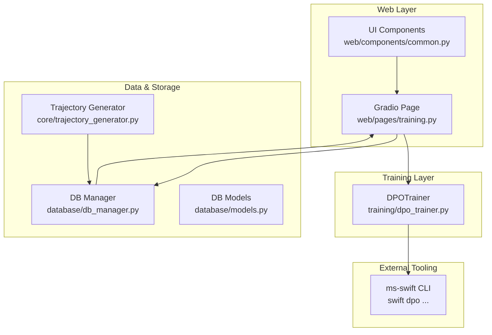
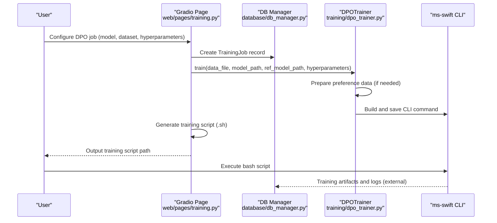
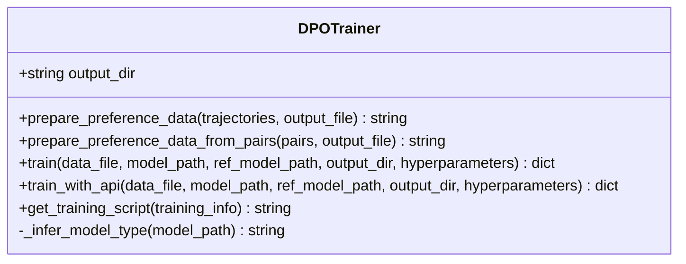
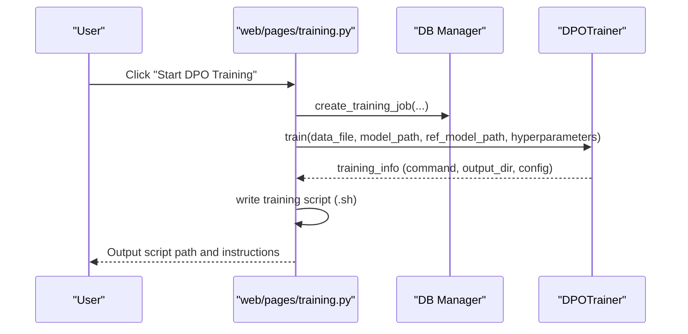
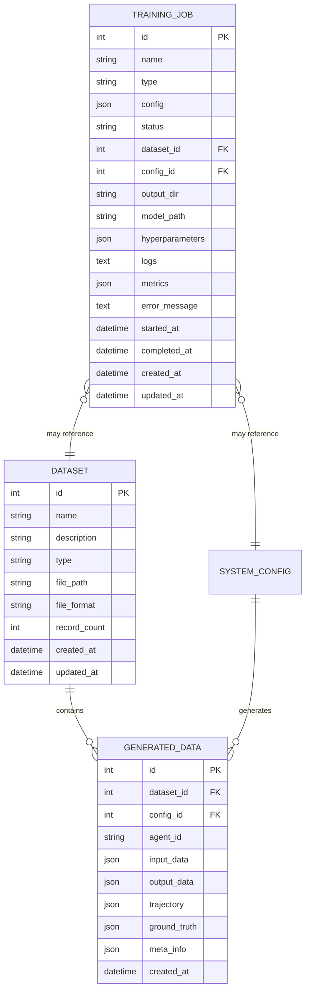
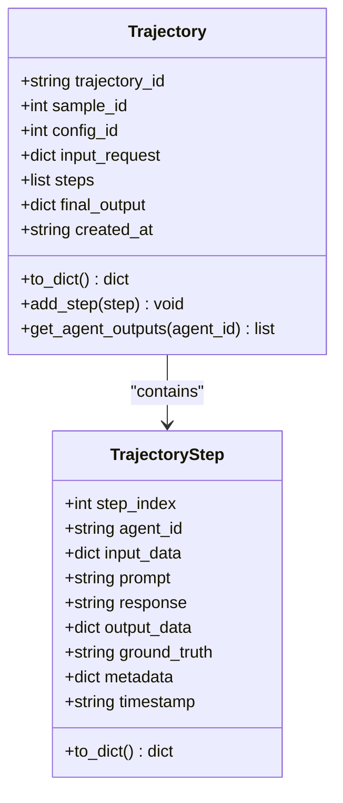
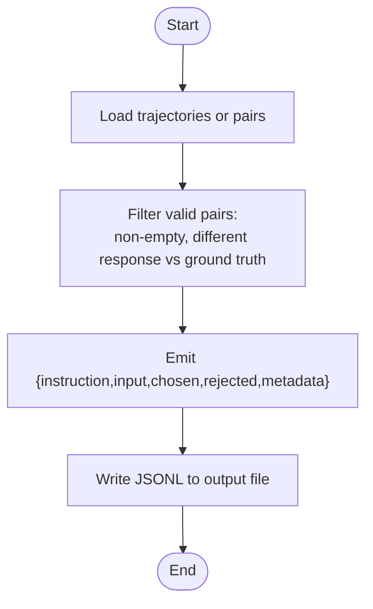
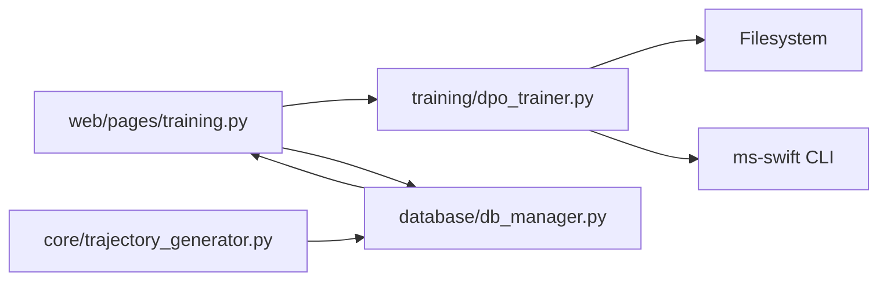

# DPO Training (Direct Preference Optimization)

<cite>
**Referenced Files in This Document**
- [dpo_trainer.py](file://training/dpo_trainer.py)
- [training.py](file://web/pages/training.py)
- [models.py](file://database/models.py)
- [db_manager.py](file://database/db_manager.py)
- [trajectory_generator.py](file://core/trajectory_generator.py)
- [common.py](file://web/components/common.py)
- [__init__.py](file://training/__init__.py)
</cite>

## Table of Contents
1. [Introduction](#introduction)
2. [Project Structure](#project-structure)
3. [Core Components](#core-components)
4. [Architecture Overview](#architecture-overview)
5. [Detailed Component Analysis](#detailed-component-analysis)
6. [Dependency Analysis](#dependency-analysis)
7. [Performance Considerations](#performance-considerations)
8. [Troubleshooting Guide](#troubleshooting-guide)
9. [Conclusion](#conclusion)
10. [Appendices](#appendices)

## Introduction
This document explains the Direct Preference Optimization (DPO) training methodology implemented in the repository. It focuses on how preference-based data is prepared, how the DPOTrainer orchestrates training via the ms-swift CLI, and how the web interface integrates with the backend to launch DPO jobs. It also compares DPO to traditional Reinforcement Learning from Human Feedback (RLHF), outlines data requirements and quality considerations, and provides guidance on hyperparameters, training stability, and evaluation strategies.

## Project Structure
The DPO implementation spans several modules:
- Training orchestration and CLI integration via DPOTrainer
- Web interface for launching DPO jobs and managing training tasks
- Database models and manager for storing datasets, generated trajectories, and training jobs
- Trajectory generation utilities that produce structured multi-agent execution traces containing ground-truth labels suitable for DPO preference pairs
- Shared UI components for consistent presentation

**Diagram sources**
- [training.py:80-147](file://web/pages/training.py#L80-L147)
- [dpo_trainer.py:8-190](file://training/dpo_trainer.py#L8-L190)
- [trajectory_generator.py:58-352](file://core/trajectory_generator.py#L58-L352)
- [db_manager.py:11-347](file://database/db_manager.py#L11-L347)
- [models.py:10-123](file://database/models.py#L10-L123)

**Section sources**
- [training.py:1-553](file://web/pages/training.py#L1-L553)
- [dpo_trainer.py:1-320](file://training/dpo_trainer.py#L1-L320)
- [trajectory_generator.py:1-352](file://core/trajectory_generator.py#L1-L352)
- [db_manager.py:1-347](file://database/db_manager.py#L1-L347)
- [models.py:1-123](file://database/models.py#L1-L123)
- [common.py:1-91](file://web/components/common.py#L1-L91)
- [__init__.py:1-7](file://training/__init__.py#L1-L7)

## Core Components
- DPOTrainer: Prepares preference datasets from trajectories or explicit pairs, constructs ms-swift CLI commands, and optionally runs training via the ms-swift Python API. It infers model types and saves training configurations.
- Web Training Page: Provides a UI to configure DPO jobs, select datasets and models, and generate/run training scripts.
- Database Models and Manager: Persist datasets, generated trajectories, and training jobs; support lookup and status updates.
- Trajectory Generator: Produces multi-agent execution traces with ground-truth labels, enabling automatic construction of DPO preference pairs.

Key capabilities:
- Preference data preparation from trajectories or explicit pairs
- CLI command generation for ms-swift DPO
- Optional API-based training invocation
- Model type inference for supported architectures
- Training job lifecycle management

**Section sources**
- [dpo_trainer.py:8-190](file://training/dpo_trainer.py#L8-L190)
- [training.py:80-147](file://web/pages/training.py#L80-L147)
- [db_manager.py:267-346](file://database/db_manager.py#L267-L346)
- [models.py:99-123](file://database/models.py#L99-L123)
- [trajectory_generator.py:11-56](file://core/trajectory_generator.py#L11-L56)

## Architecture Overview
The DPO workflow integrates web UI, training orchestration, and external training via ms-swift. The web page collects user inputs, persists a training job, and delegates to DPOTrainer to build a training script. The script invokes the ms-swift CLI with configured hyperparameters.

**Diagram sources**
- [training.py:340-408](file://web/pages/training.py#L340-L408)
- [dpo_trainer.py:100-190](file://training/dpo_trainer.py#L100-L190)
- [db_manager.py:267-314](file://database/db_manager.py#L267-L314)

## Detailed Component Analysis

### DPOTrainer: Preference Data Preparation and Training Orchestration
- Preference data preparation:
  - From trajectories: Filters steps where both response and ground truth exist and differ, emitting chosen/rejected pairs with metadata.
  - From explicit pairs: Accepts prompt, chosen, rejected, optional input, and metadata.
- Training orchestration:
  - Infers model type from model path to select appropriate ms-swift model identifiers.
  - Builds a CLI command with hyperparameters (learning rate, epochs, batch size, gradient accumulation, beta, scheduler, weight decay, mixed precision).
  - Saves a training configuration JSON for reproducibility.
  - Generates a runnable shell script encapsulating the CLI command.
  - Optionally executes training via ms-swift Python API if available.

**Diagram sources**
- [dpo_trainer.py:8-190](file://training/dpo_trainer.py#L8-L190)

**Section sources**
- [dpo_trainer.py:15-98](file://training/dpo_trainer.py#L15-L98)
- [dpo_trainer.py:100-190](file://training/dpo_trainer.py#L100-L190)
- [dpo_trainer.py:192-277](file://training/dpo_trainer.py#L192-L277)

### Web Training Page: DPO Job Launch and Script Generation
- UI elements:
  - Select dataset, model path, optional reference model path.
  - Advanced parameters: learning rate, batch size, epochs, beta.
- Workflow:
  - Creates a TrainingJob record with hyperparameters.
  - Invokes DPOTrainer.train to prepare CLI command and configuration.
  - Writes a shell script to disk and returns instructions to run it.

**Diagram sources**
- [training.py:340-408](file://web/pages/training.py#L340-L408)
- [dpo_trainer.py:100-190](file://training/dpo_trainer.py#L100-L190)

**Section sources**
- [training.py:80-147](file://web/pages/training.py#L80-L147)
- [training.py:340-408](file://web/pages/training.py#L340-L408)

### Database Models and Manager: Training Lifecycle and Data Persistence
- Models:
  - Dataset: stores raw dataset metadata and file paths.
  - GeneratedData: stores trajectories and ground truths produced by the system.
  - TrainingJob: central record for SFT/DPO/GRPO jobs with status, hyperparameters, and outputs.
- Manager:
  - CRUD operations for datasets, generated data, system configs, executions, and training jobs.
  - Status transitions and timestamps for lifecycle tracking.

**Diagram sources**
- [models.py:10-123](file://database/models.py#L10-L123)

**Section sources**
- [models.py:10-123](file://database/models.py#L10-L123)
- [db_manager.py:35-346](file://database/db_manager.py#L35-L346)

### Trajectory Generator: Multi-Agent Execution Traces with Ground Truth
- Produces Trajectory and TrajectoryStep records containing prompts, responses, and optional ground truth.
- Enables downstream conversion to DPO preference pairs by pairing each step’s response with its ground truth when they differ.

**Diagram sources**
- [trajectory_generator.py:11-56](file://core/trajectory_generator.py#L11-L56)

**Section sources**
- [trajectory_generator.py:58-352](file://core/trajectory_generator.py#L58-L352)

### Practical Workflows and Examples

#### Preparing Preference Datasets
- From trajectories:
  - Use the trajectory generator to produce traces with ground truth.
  - Invoke the DPOTrainer’s trajectory-based preparation to emit JSONL with chosen/rejected pairs.
- From explicit pairs:
  - Provide prompt, chosen, rejected, optional input, and metadata to the pair-based preparation method.

**Diagram sources**
- [dpo_trainer.py:15-98](file://training/dpo_trainer.py#L15-L98)
- [trajectory_generator.py:11-56](file://core/trajectory_generator.py#L11-L56)

**Section sources**
- [dpo_trainer.py:15-98](file://training/dpo_trainer.py#L15-L98)
- [trajectory_generator.py:58-352](file://core/trajectory_generator.py#L58-L352)

#### Configuring DPO Hyperparameters
- Core hyperparameters exposed in the UI and trainer:
  - Learning rate, batch size, epochs, beta (temperature), gradient accumulation, warmup ratio, weight decay, logging/save frequency, mixed precision.
- Model type inference:
  - The trainer infers model family and size from the model path to select appropriate ms-swift model identifiers.

**Section sources**
- [training.py:117-122](file://web/pages/training.py#L117-L122)
- [dpo_trainer.py:128-141](file://training/dpo_trainer.py#L128-L141)
- [dpo_trainer.py:278-307](file://training/dpo_trainer.py#L278-L307)

#### Executing DPO Training Workflows
- Web-driven:
  - Create a DPO training job via the UI; the backend generates a CLI command and writes a shell script.
  - Run the script to invoke ms-swift DPO training.
- API-driven:
  - Optionally call the trainer’s API-based training method if ms-swift is installed and importable.

**Section sources**
- [training.py:340-408](file://web/pages/training.py#L340-L408)
- [dpo_trainer.py:100-190](file://training/dpo_trainer.py#L100-L190)
- [dpo_trainer.py:192-277](file://training/dpo_trainer.py#L192-L277)

## Dependency Analysis
- DPOTrainer depends on:
  - ms-swift CLI for training execution.
  - Filesystem for writing JSONL preference data and training scripts.
  - Model-type inference logic for CLI compatibility.
- Web training page depends on:
  - DPOTrainer for command/script generation.
  - Database manager for job persistence and status updates.
- Trajectory generator and database:
  - Provide ground-truth-laden traces that DPOTrainer consumes to construct preference pairs.

**Diagram sources**
- [training.py:340-408](file://web/pages/training.py#L340-L408)
- [dpo_trainer.py:100-190](file://training/dpo_trainer.py#L100-L190)
- [trajectory_generator.py:58-352](file://core/trajectory_generator.py#L58-L352)
- [db_manager.py:267-346](file://database/db_manager.py#L267-L346)

**Section sources**
- [training.py:340-408](file://web/pages/training.py#L340-L408)
- [dpo_trainer.py:100-190](file://training/dpo_trainer.py#L100-L190)
- [trajectory_generator.py:58-352](file://core/trajectory_generator.py#L58-L352)
- [db_manager.py:267-346](file://database/db_manager.py#L267-L346)

## Performance Considerations
- Mixed precision:
  - Enabled by default to reduce memory footprint and accelerate training.
- Gradient accumulation:
  - Allows larger effective batch sizes on limited hardware.
- Scheduler and warmup:
  - Cosine decay with warmup helps stabilize early training.
- Batch sizing and device memory:
  - Lower per-device batch sizes and increased gradient accumulation can mitigate out-of-memory issues.
- Data volume and quality:
  - Prefer diverse, high-quality preference pairs; avoid near-duplicate or trivially different samples.
- Reference model:
  - Using a separate reference model can improve stability; otherwise, the policy model serves as the reference.

[No sources needed since this section provides general guidance]

## Troubleshooting Guide
Common issues and remedies:
- ms-swift not installed:
  - The API-based training path reports an error indicating missing installation; fall back to CLI script generation and manual execution.
- Incorrect model path:
  - Model type inference relies on substrings; ensure the path matches supported families and sizes.
- Empty or identical chosen/rejected:
  - The trajectory-based preparation filters out invalid pairs; verify ground truth presence and differences.
- Training stalls or diverges:
  - Reduce learning rate, increase gradient accumulation, enable mixed precision, and verify dataset quality.

**Section sources**
- [dpo_trainer.py:267-277](file://training/dpo_trainer.py#L267-L277)
- [dpo_trainer.py:278-307](file://training/dpo_trainer.py#L278-L307)
- [dpo_trainer.py:38-51](file://training/dpo_trainer.py#L38-L51)

## Conclusion
The repository provides a streamlined DPO pipeline: generate multi-agent trajectories with ground truth, convert them into preference pairs, and launch training via ms-swift either through a generated script or the Python API. The web interface simplifies configuration and job lifecycle management, while the database persists datasets and training jobs. Compared to RLHF, DPO removes the need for reward modeling and policy optimization loops, reducing complexity and computational overhead. Proper data quality, conservative hyperparameter tuning, and careful monitoring remain essential for stable and effective preference optimization.

[No sources needed since this section summarizes without analyzing specific files]

## Appendices

### Preference Data Format
- JSONL entries include:
  - instruction: the prompt
  - input: optional input
  - chosen: preferred response
  - rejected: dispreferred response
  - metadata: optional fields (agent_id, trajectory_id, sample_id)

**Section sources**
- [dpo_trainer.py:41-51](file://training/dpo_trainer.py#L41-L51)
- [dpo_trainer.py:84-90](file://training/dpo_trainer.py#L84-L90)
- [dpo_trainer.py:15-98](file://training/dpo_trainer.py#L15-L98)

### DPO vs RLHF: Advantages
- No reward model training required.
- Eliminates policy optimization loops and critic training.
- Simplified pipeline reduces risk of reward hacking and instability.
- Faster iteration cycles for alignment improvements.

[No sources needed since this section provides general guidance]