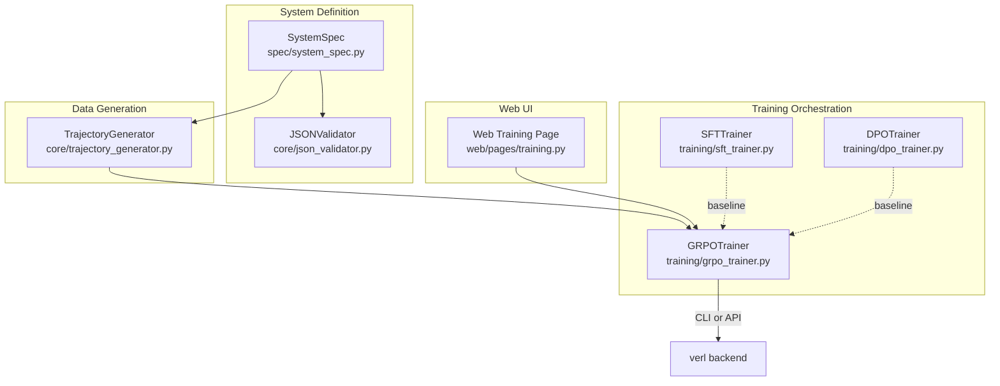
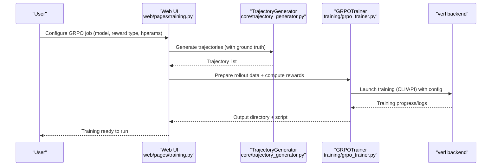
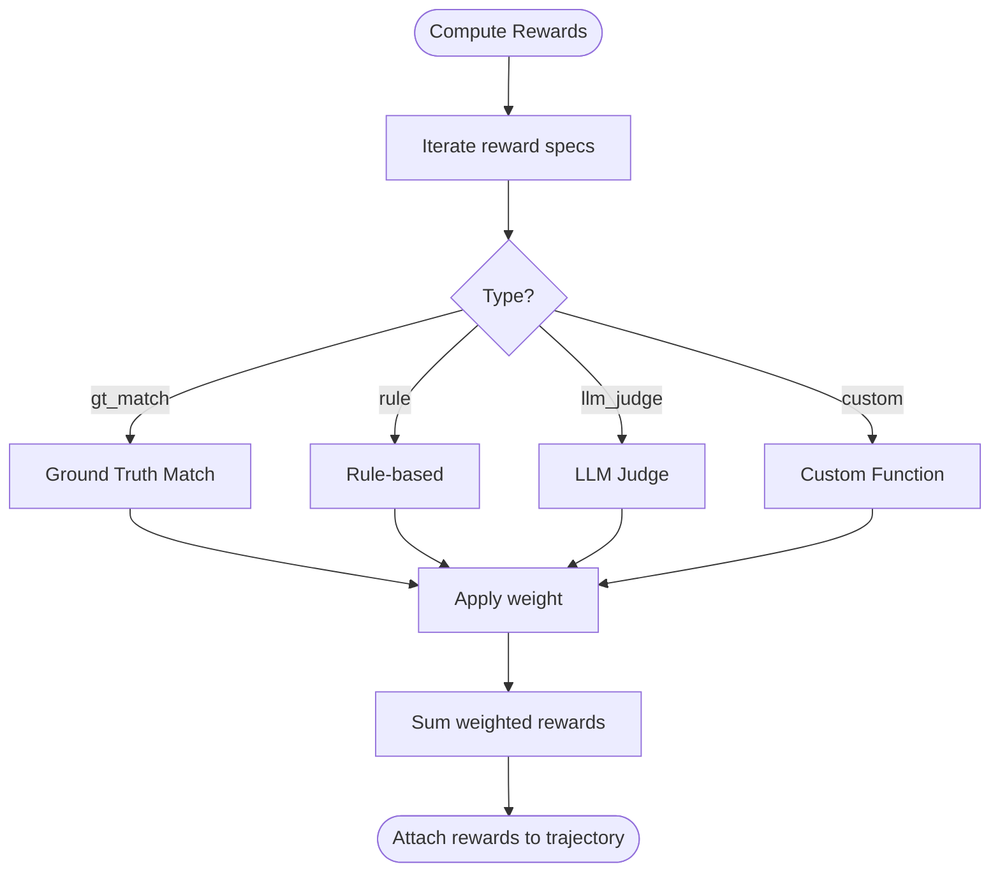
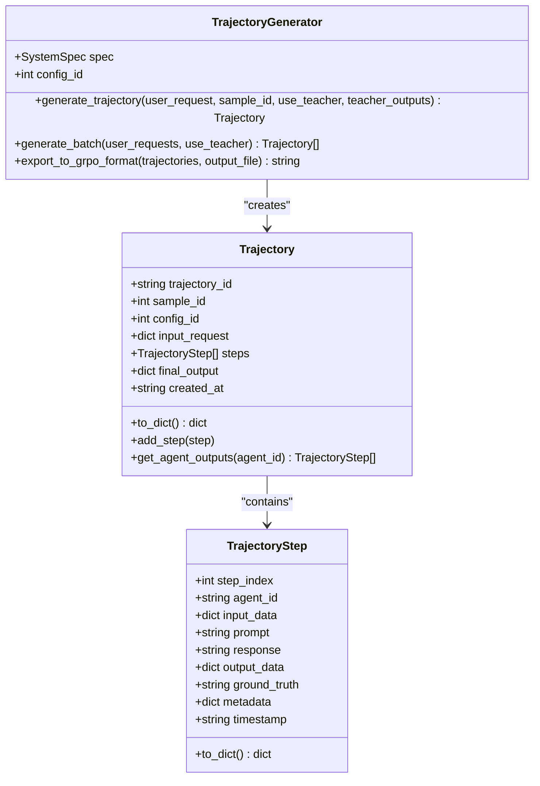
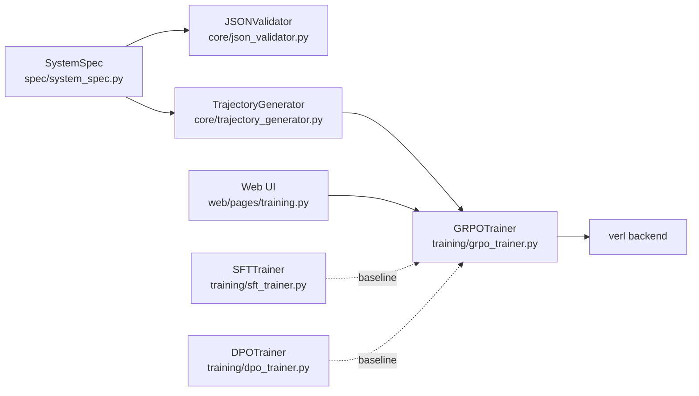

# GRPO Training (Guided Reinforcement Learning from Human Feedback)

<cite>
**Referenced Files in This Document**
- [grpo_trainer.py](file://training/grpo_trainer.py)
- [dpo_trainer.py](file://training/dpo_trainer.py)
- [sft_trainer.py](file://training/sft_trainer.py)
- [trajectory_generator.py](file://core/trajectory_generator.py)
- [system_spec.py](file://spec/system_spec.py)
- [json_validator.py](file://core/json_validator.py)
- [training.py](file://web/pages/training.py)
- [说明文档.txt](file://说明文档.txt)
- [使用流程.txt](file://使用流程.txt)
- [api_config.yaml](file://configs/api_config.yaml)
</cite>

## Table of Contents
1. [Introduction](#introduction)
2. [Project Structure](#project-structure)
3. [Core Components](#core-components)
4. [Architecture Overview](#architecture-overview)
5. [Detailed Component Analysis](#detailed-component-analysis)
6. [Dependency Analysis](#dependency-analysis)
7. [Performance Considerations](#performance-considerations)
8. [Troubleshooting Guide](#troubleshooting-guide)
9. [Conclusion](#conclusion)
10. [Appendices](#appendices)

## Introduction
This document explains the Guided Reinforcement Learning from Human Feedback (GRPO) training methodology implemented in the repository. It covers how human feedback is integrated into reinforcement learning for language models, focusing on the GRPOTrainer implementation, reward modeling integration, guided policy optimization, and the end-to-end workflow. It also provides practical guidance for preparing human feedback datasets, configuring GRPO-specific parameters, balancing exploration and guidance, reward shaping, convergence criteria, feedback quality assessment, reward function design, and performance evaluation.

## Project Structure
The GRPO training capability is composed of:
- A GRPOTrainer that prepares rollout data, computes rewards, and launches training via a backend (verl).
- A TrajectoryGenerator that produces multi-step, multi-agent rollouts with optional ground truth for reward computation.
- Supporting trainers (SFT and DPO) for comparison and baseline training.
- Web UI integration for launching GRPO jobs with configurable hyperparameters.
- System specification and validation utilities to define agents, dataflow, and training modes.

**Diagram sources**
- [grpo_trainer.py:8-385](file://training/grpo_trainer.py#L8-L385)
- [trajectory_generator.py:58-354](file://core/trajectory_generator.py#L58-L354)
- [sft_trainer.py:9-263](file://training/sft_trainer.py#L9-L263)
- [dpo_trainer.py:8-320](file://training/dpo_trainer.py#L8-L320)
- [system_spec.py:100-114](file://spec/system_spec.py#L100-L114)
- [json_validator.py:37-82](file://core/json_validator.py#L37-L82)
- [training.py:410-553](file://web/pages/training.py#L410-L553)

**Section sources**
- [grpo_trainer.py:8-385](file://training/grpo_trainer.py#L8-L385)
- [trajectory_generator.py:58-354](file://core/trajectory_generator.py#L58-L354)
- [sft_trainer.py:9-263](file://training/sft_trainer.py#L9-L263)
- [dpo_trainer.py:8-320](file://training/dpo_trainer.py#L8-L320)
- [system_spec.py:100-114](file://spec/system_spec.py#L100-L114)
- [json_validator.py:37-82](file://core/json_validator.py#L37-L82)
- [training.py:410-553](file://web/pages/training.py#L410-L553)

## Core Components
- GRPOTrainer: Prepares rollout data, computes rewards from human feedback or rules, and launches training using verl (CLI or Python API). It supports configurable reward specs and hyperparameters.
- TrajectoryGenerator: Produces multi-step, multi-agent trajectories with optional ground truth, enabling system-level rollout-based training.
- SystemSpec and JSONValidator: Define agent roles, prompts, dataflow, and training modes; validate configurations and detect cycles.
- Web Training Page: Provides a UI to configure GRPO jobs, including reward types, learning rate, batch sizes, and KL coefficient.

Key capabilities:
- Rollout data preparation for GRPO training.
- Reward computation from ground truth matches, rule-based checks, LLM judges, or custom functions.
- Training orchestration via verl with configurable hyperparameters.
- Baseline comparisons with SFT and DPO.

**Section sources**
- [grpo_trainer.py:15-114](file://training/grpo_trainer.py#L15-L114)
- [grpo_trainer.py:177-266](file://training/grpo_trainer.py#L177-L266)
- [trajectory_generator.py:28-56](file://core/trajectory_generator.py#L28-L56)
- [trajectory_generator.py:292-330](file://core/trajectory_generator.py#L292-L330)
- [system_spec.py:29-36](file://spec/system_spec.py#L29-L36)
- [json_validator.py:218-241](file://core/json_validator.py#L218-L241)
- [training.py:410-482](file://web/pages/training.py#L410-L482)

## Architecture Overview
The GRPO workflow integrates trajectory generation, reward computation, and backend training:

**Diagram sources**
- [training.py:410-482](file://web/pages/training.py#L410-L482)
- [trajectory_generator.py:74-155](file://core/trajectory_generator.py#L74-L155)
- [grpo_trainer.py:15-114](file://training/grpo_trainer.py#L15-L114)
- [grpo_trainer.py:177-266](file://training/grpo_trainer.py#L177-L266)

## Detailed Component Analysis

### GRPOTrainer
Responsibilities:
- Convert trajectories to GRPO rollout format.
- Compute rewards from multiple sources: ground truth match, rule-based checks, LLM judge, or custom functions.
- Build verl training configuration and launch training via CLI or Python API.
- Infer model type for compatibility.

Reward computation highlights:
- Ground truth match: exact or partial character-set overlap.
- Rule-based: JSON validity, length thresholds, or custom rule strings.
- LLM judge: placeholder for external model scoring (e.g., gpt-4o-mini).
- Custom functions: hook for user-defined reward logic.

Training orchestration:
- Default hyperparameters tuned for GRPO stability (small learning rates, KL regularization, PPO-style clipping).
- Supports CLI command generation and Python API training path.

**Diagram sources**
- [grpo_trainer.py:62-114](file://training/grpo_trainer.py#L62-L114)
- [grpo_trainer.py:116-175](file://training/grpo_trainer.py#L116-L175)

**Section sources**
- [grpo_trainer.py:8-385](file://training/grpo_trainer.py#L8-L385)

### TrajectoryGenerator
Responsibilities:
- Generate multi-step, multi-agent trajectories with optional ground truth.
- Export to formats compatible with SFT, DPO, and GRPO training.
- Maintain per-step metadata for reward computation.

Rollout export for GRPO:
- Preserves agent_id, prompt, response, ground truth, and metadata per step.
- Aggregates into trajectory-level records suitable for verl training.

**Diagram sources**
- [trajectory_generator.py:11-56](file://core/trajectory_generator.py#L11-L56)
- [trajectory_generator.py:58-155](file://core/trajectory_generator.py#L58-L155)
- [trajectory_generator.py:292-330](file://core/trajectory_generator.py#L292-L330)

**Section sources**
- [trajectory_generator.py:58-354](file://core/trajectory_generator.py#L58-L354)

### System Specification and Validation
SystemSpec defines agents, prompts, IO mappings, and training configuration. JSONValidator enforces correctness, detects cycles, and validates training modes.

- Training modes include sft, dpo, and grpo.
- GRPO requires rollout configuration and reward specs.

**Section sources**
- [system_spec.py:29-36](file://spec/system_spec.py#L29-L36)
- [system_spec.py:100-114](file://spec/system_spec.py#L100-L114)
- [json_validator.py:218-241](file://core/json_validator.py#L218-L241)

### Web UI Integration
The web training page:
- Accepts user inputs for model path, reward type, and hyperparameters.
- Creates a training job and generates a shell script to run verl training.
- Exposes a table of jobs and allows viewing details.

**Section sources**
- [training.py:410-553](file://web/pages/training.py#L410-L553)

## Dependency Analysis
- GRPOTrainer depends on verl for training execution and on reward computation helpers.
- TrajectoryGenerator depends on SystemSpec and JSONValidator to ensure valid agent definitions and dataflow.
- Web UI depends on GRPOTrainer to prepare and launch jobs.

**Diagram sources**
- [system_spec.py:100-114](file://spec/system_spec.py#L100-L114)
- [json_validator.py:37-82](file://core/json_validator.py#L37-L82)
- [trajectory_generator.py:58-155](file://core/trajectory_generator.py#L58-L155)
- [grpo_trainer.py:8-385](file://training/grpo_trainer.py#L8-L385)
- [sft_trainer.py:9-263](file://training/sft_trainer.py#L9-L263)
- [dpo_trainer.py:8-320](file://training/dpo_trainer.py#L8-L320)
- [training.py:410-553](file://web/pages/training.py#L410-L553)

**Section sources**
- [grpo_trainer.py:8-385](file://training/grpo_trainer.py#L8-L385)
- [trajectory_generator.py:58-155](file://core/trajectory_generator.py#L58-L155)
- [system_spec.py:100-114](file://spec/system_spec.py#L100-L114)
- [json_validator.py:37-82](file://core/json_validator.py#L37-L82)
- [training.py:410-553](file://web/pages/training.py#L410-L553)

## Performance Considerations
- Small learning rates and KL regularization help stabilize GRPO updates.
- Mini-batching and gradient accumulation reduce memory pressure during training.
- Rollout batch size impacts throughput; tune based on GPU capacity.
- Reward computation cost can be reduced by caching judgements and avoiding repeated LLM calls.

[No sources needed since this section provides general guidance]

## Troubleshooting Guide
Common issues and remedies:
- verl not installed: The Python API path returns an error indicating missing installation; fall back to CLI command generation.
- Reward computation placeholders: LLM judge reward currently returns random values; integrate real LLM APIs for production.
- Training failures: Verify verl configuration JSON and model type inference; ensure rollout data matches expected schema.
- Web UI job creation: Ensure required fields (name, config_id) are provided; check logs for exceptions.

**Section sources**
- [grpo_trainer.py:332-341](file://training/grpo_trainer.py#L332-L341)
- [grpo_trainer.py:167-175](file://training/grpo_trainer.py#L167-L175)
- [training.py:484-485](file://web/pages/training.py#L484-L485)

## Conclusion
The repository provides a structured framework for GRPO training from human feedback. It integrates trajectory generation, reward modeling, and backend training orchestration, while offering baseline comparisons with SFT and DPO. Users can configure reward specs, tune hyperparameters, and leverage the web UI to launch jobs. For production, replace reward placeholders with real LLM judges and ensure robust feedback quality assessment and reward function design.

[No sources needed since this section summarizes without analyzing specific files]

## Appendices

### Practical Examples

- Preparing human feedback datasets for GRPO:
  - Use TrajectoryGenerator to produce trajectories with ground truth.
  - Export to GRPO format for verl training.
  - Reference: [trajectory_generator.py:292-330](file://core/trajectory_generator.py#L292-L330)

- Configuring GRPO-specific parameters:
  - Set reward specs (types: gt_match, rule, llm_judge, custom).
  - Adjust hyperparameters (learning rate, batch size, rollout batch size, KL coefficient).
  - Reference: [grpo_trainer.py:202-218](file://training/grpo_trainer.py#L202-L218), [grpo_trainer.py:224-247](file://training/grpo_trainer.py#L224-L247)

- Executing guided reinforcement learning workflows:
  - Web UI: Provide model path, reward type, and hyperparameters; generate and run training script.
  - Reference: [training.py:410-482](file://web/pages/training.py#L410-L482)

- Balancing exploration and guidance:
  - Use small learning rates and KL regularization.
  - Incorporate diverse reward signals (final answer, intermediate steps).
  - Reference: [grpo_trainer.py:202-218](file://training/grpo_trainer.py#L202-L218), [说明文档.txt:329-336](file://说明文档.txt#L329-L336)

- Reward shaping techniques:
  - Combine ground truth match, rule-based checks, and LLM judge scores.
  - Weight contributions per agent or per step.
  - Reference: [grpo_trainer.py:81-114](file://training/grpo_trainer.py#L81-L114), [说明文档.txt:341-367](file://说明文档.txt#L341-L367)

- Convergence criteria:
  - Monitor training loss, KL divergence, and reward metrics.
  - Use validation splits and early stopping if available.
  - Reference: [说明文档.txt:329-336](file://说明文档.txt#L329-L336)

- Feedback quality assessment:
  - Validate prompts and templates via JSONValidator.
  - Ensure consistent dataflow and absence of cycles.
  - Reference: [json_validator.py:242-266](file://core/json_validator.py#L242-L266)

- Reward function design:
  - Align reward types with system goals (accuracy, formatting, reasoning quality).
  - Use LLM judges for nuanced quality signals; fallback to rules for deterministic checks.
  - Reference: [grpo_trainer.py:116-175](file://training/grpo_trainer.py#L116-L175), [说明文档.txt:341-367](file://说明文档.txt#L341-L367)

- Performance evaluation:
  - Compare against SFT and DPO baselines.
  - Evaluate on downstream tasks and human preference studies.
  - Reference: [sft_trainer.py:59-140](file://training/sft_trainer.py#L59-L140), [dpo_trainer.py:100-190](file://training/dpo_trainer.py#L100-L190)

- API configuration for LLM judges:
  - Configure provider credentials and model names.
  - Reference: [api_config.yaml:1-9](file://configs/api_config.yaml#L1-L9)