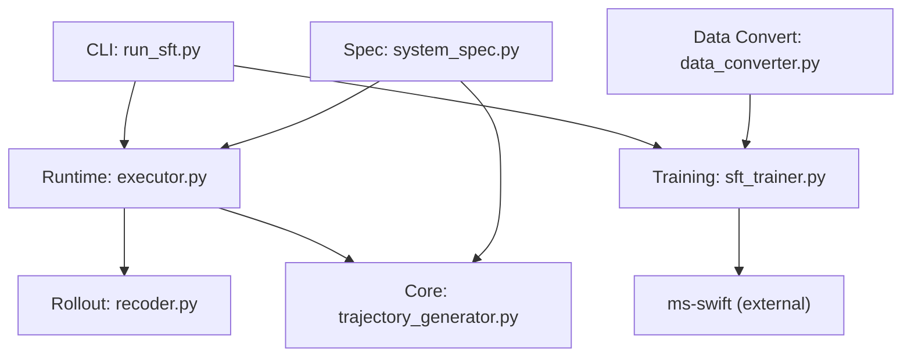
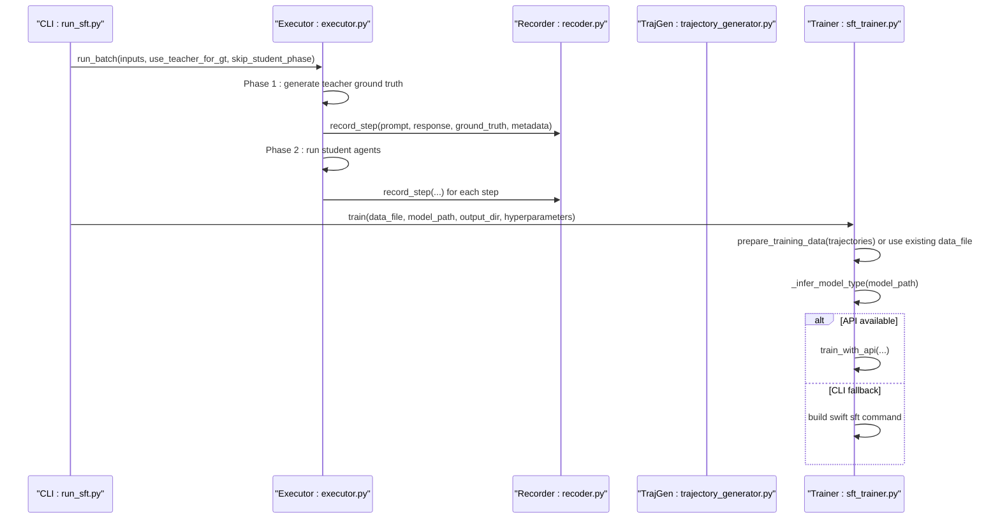
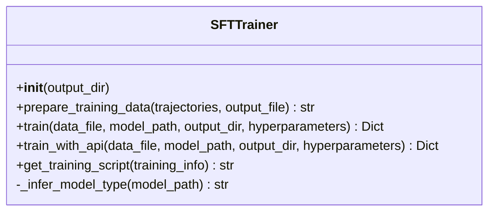
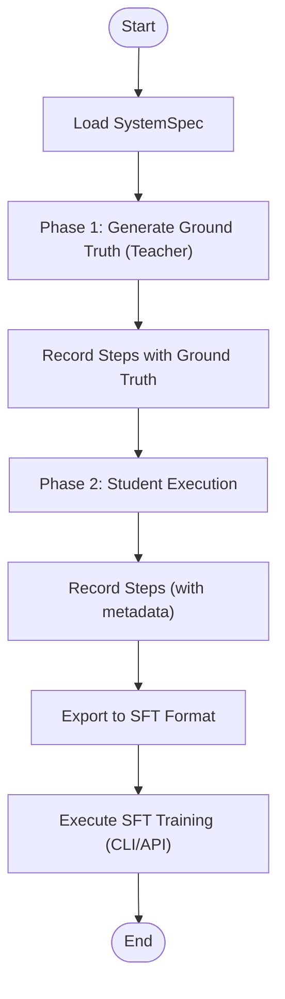
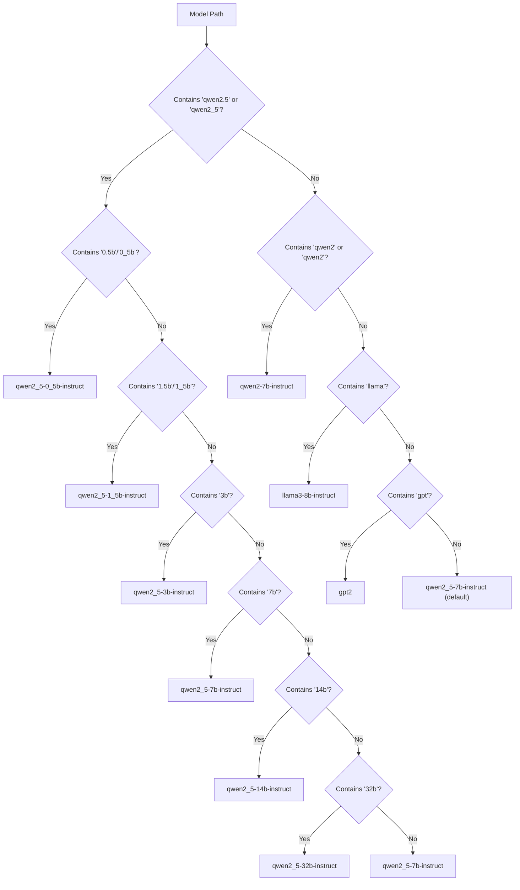
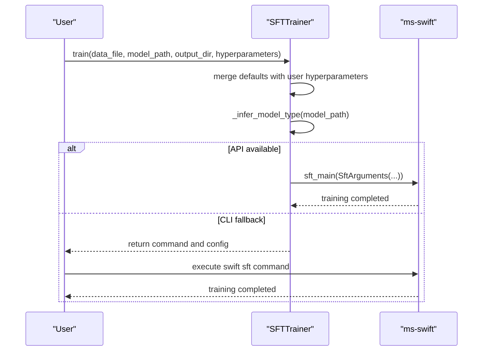
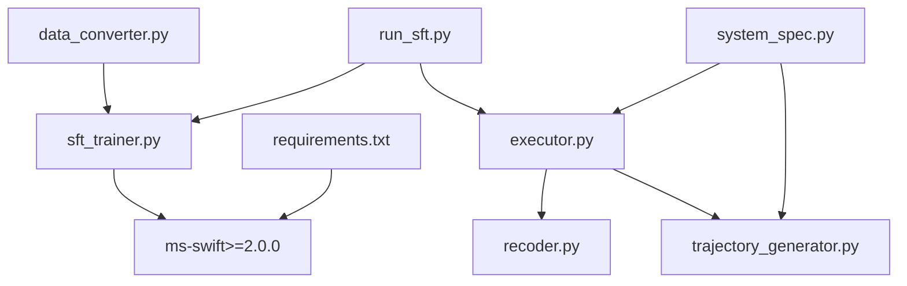

# SFT Training (Supervised Fine-Tuning)

<cite>
**Referenced Files in This Document**
- [sft_trainer.py](file://training/sft_trainer.py)
- [sft_trainer.py](file://traning/sft_trainer.py)
- [run_sft.py](file://cli/run_sft.py)
- [trajectory_generator.py](file://core/trajectory_generator.py)
- [executor.py](file://runtime/executor.py)
- [recoder.py](file://rollout/recoder.py)
- [data_converter.py](file://data/data_convert/data_converter.py)
- [system_spec.py](file://spec/system_spec.py)
- [requirements.txt](file://requirements.txt)
- [说明文档.txt](file://说明文档.txt)
</cite>

## Table of Contents
1. [Introduction](#introduction)
2. [Project Structure](#project-structure)
3. [Core Components](#core-components)
4. [Architecture Overview](#architecture-overview)
5. [Detailed Component Analysis](#detailed-component-analysis)
6. [Dependency Analysis](#dependency-analysis)
7. [Performance Considerations](#performance-considerations)
8. [Troubleshooting Guide](#troubleshooting-guide)
9. [Conclusion](#conclusion)
10. [Appendices](#appendices)

## Introduction
This document explains the Supervised Fine-Tuning (SFT) training methodology implemented in the repository. It covers the supervised learning approach for aligning multi-agent system behavior using ground-truth data derived from execution trajectories. The documentation details the SFTTrainer class, data preparation from trajectories, model type inference for different LLM families, and integration with the ms-swift training framework. It also describes the training data format conversion process, hyperparameter configuration, and execution via both command-line and Python API interfaces. Practical examples demonstrate preparing training data from execution trajectories, configuring hyperparameters, and running training jobs. Guidance is included for model type detection, training optimization, troubleshooting common issues, and evaluating training data quality and performance.

## Project Structure
The SFT training pipeline spans several modules:
- CLI entrypoint orchestrates data collection and training
- Runtime executor runs agents and collects trajectories with ground truth
- Trajectory generator exports datasets in SFT-compatible formats
- Trainer integrates with ms-swift for training execution
- Data converter transforms raw datasets into multiple framework formats
- System specification defines agent roles, prompts, and training targets

**Diagram sources**
- [run_sft.py:17-117](file://cli/run_sft.py#L17-L117)
- [executor.py:9-132](file://runtime/executor.py#L9-L132)
- [recoder.py:8-122](file://rollout/recoder.py#L8-L122)
- [trajectory_generator.py:58-353](file://core/trajectory_generator.py#L58-L353)
- [sft_trainer.py:9-263](file://training/sft_trainer.py#L9-L263)
- [data_converter.py:10-99](file://data/data_convert/data_converter.py#L10-L99)
- [system_spec.py:77-114](file://spec/system_spec.py#L77-L114)

**Section sources**
- [run_sft.py:17-117](file://cli/run_sft.py#L17-L117)
- [executor.py:9-132](file://runtime/executor.py#L9-L132)
- [recoder.py:8-122](file://rollout/recoder.py#L8-L122)
- [trajectory_generator.py:58-353](file://core/trajectory_generator.py#L58-L353)
- [sft_trainer.py:9-263](file://training/sft_trainer.py#L9-L263)
- [data_converter.py:10-99](file://data/data_convert/data_converter.py#L10-L99)
- [system_spec.py:77-114](file://spec/system_spec.py#L77-L114)

## Core Components
- SFTTrainer: Prepares SFT training data from trajectories, infers model type, builds ms-swift commands, and supports both CLI and API training modes.
- SystemExecutor: Executes agents in two phases—Phase 1 generates ground truth using teacher models; Phase 2 executes student models and records trajectories with ground truth.
- TrajectoryRecorder: Records step-level interactions with optional ground truth and loss weights, and can assemble SFT datasets.
- TrajectoryGenerator: Exports trajectories to SFT/DPO/GRPO formats and computes statistics.
- DataConverter: Converts raw datasets into multiple framework-specific formats (e.g., SWIFT SFT).
- SystemSpec: Defines agent configurations, training targets, and prompt templates.

**Section sources**
- [sft_trainer.py:9-263](file://training/sft_trainer.py#L9-L263)
- [executor.py:16-132](file://runtime/executor.py#L16-L132)
- [recoder.py:15-122](file://rollout/recoder.py#L15-L122)
- [trajectory_generator.py:217-353](file://core/trajectory_generator.py#L217-L353)
- [data_converter.py:10-99](file://data/data_convert/data_converter.py#L10-L99)
- [system_spec.py:77-114](file://spec/system_spec.py#L77-L114)

## Architecture Overview
The SFT pipeline follows a two-phase execution pattern:
- Phase 1 (Ground Truth Generation): Teacher models produce ground truth outputs for targeted agent outputs.
- Phase 2 (Student Execution and Data Recording): Student models execute according to prompts, and trajectories with ground truth are recorded for SFT training.
- Training: The prepared dataset is passed to ms-swift either via CLI or Python API, with automatic model type inference.

**Diagram sources**
- [run_sft.py:72-107](file://cli/run_sft.py#L72-L107)
- [executor.py:32-132](file://runtime/executor.py#L32-L132)
- [recoder.py:15-42](file://rollout/recoder.py#L15-L42)
- [sft_trainer.py:59-140](file://training/sft_trainer.py#L59-L140)

## Detailed Component Analysis

### SFTTrainer Implementation
The SFTTrainer class encapsulates the end-to-end SFT workflow:
- Data Preparation: Converts trajectories into SFT-ready JSONL format, filtering only steps with ground truth.
- Hyperparameters: Applies default training parameters and merges user-provided overrides.
- Model Type Inference: Infers the appropriate ms-swift model type from the model path (supports Qwen2.5 variants, Qwen2, Llama, and GPT families).
- Training Execution: Builds and returns a CLI command or executes via ms-swift Python API.
- Script Generation: Produces a runnable shell script from the generated command.

Key behaviors:
- prepare_training_data: Emits instruction-output pairs with metadata for downstream training.
- train: Constructs a swift sft command with defaults and merges user hyperparameters.
- train_with_api: Uses ms-swift Python API if available; otherwise reports an error.
- _infer_model_type: Heuristically maps model identifiers to ms-swift model types.

**Diagram sources**
- [sft_trainer.py:9-263](file://training/sft_trainer.py#L9-L263)

**Section sources**
- [sft_trainer.py:16-57](file://training/sft_trainer.py#L16-L57)
- [sft_trainer.py:59-140](file://training/sft_trainer.py#L59-L140)
- [sft_trainer.py:142-220](file://training/sft_trainer.py#L142-L220)
- [sft_trainer.py:221-263](file://training/sft_trainer.py#L221-L263)

### Data Preparation from Execution Trajectories
Two complementary approaches exist:
- Using TrajectoryRecorder and TrajectoryGenerator:
  - Recorder captures step-level interactions with optional ground truth and loss weights.
  - TrajectoryGenerator exports to SFT format and computes statistics.
- Using CLI run_sft.py:
  - Executes teacher and student phases, then converts collected trajectories to SFT format and triggers training.

**Diagram sources**
- [executor.py:32-132](file://runtime/executor.py#L32-L132)
- [recoder.py:15-42](file://rollout/recoder.py#L15-L42)
- [trajectory_generator.py:217-253](file://core/trajectory_generator.py#L217-L253)
- [run_sft.py:72-107](file://cli/run_sft.py#L72-L107)

**Section sources**
- [executor.py:32-132](file://runtime/executor.py#L32-L132)
- [recoder.py:15-122](file://rollout/recoder.py#L15-L122)
- [trajectory_generator.py:217-253](file://core/trajectory_generator.py#L217-L253)
- [run_sft.py:72-107](file://cli/run_sft.py#L72-L107)

### Model Type Inference for Different LLM Families
The trainer infers the ms-swift model type from the model path:
- Qwen2.5 family: Supports multiple sizes (e.g., 0.5B, 1.5B, 3B, 7B, 14B, 32B) and maps to instruct variants.
- Qwen2 family: Maps to a specific instruct variant.
- Llama family: Maps to a specific Llama instruct variant.
- GPT family: Defaults to a generic GPT model type.
- Fallback: Defaults to a standard Qwen2.5 instruct model if no match is found.

**Diagram sources**
- [sft_trainer.py:221-250](file://training/sft_trainer.py#L221-L250)

**Section sources**
- [sft_trainer.py:221-250](file://training/sft_trainer.py#L221-L250)

### Training Data Format Conversion
The repository supports converting raw datasets into multiple framework formats:
- SWIFT SFT: Preserves full messages and adds output fields for training.
- SWIFT DPO: Constructs chosen-rejected pairs for preference optimization.
- VERL GRPO: Extracts prompts for trajectory-based reinforcement learning.

The converter reads JSONL lines, extracts user prompts and assistant responses, and writes standardized datasets to a unified location.

**Section sources**
- [data_converter.py:10-99](file://data/data_convert/data_converter.py#L10-L99)

### Hyperparameter Configuration and Training Execution
Default hyperparameters include learning rate, batch size, number of epochs, maximum sequence length, warmup ratio, weight decay, gradient accumulation steps, logging/save frequency, and mixed precision flags. These defaults can be overridden via the trainer’s API.

Execution modes:
- CLI Mode: The trainer returns a constructed swift sft command and saves a training configuration file for reproducibility.
- API Mode: If ms-swift is installed and importable, the trainer invokes the Python API directly.

**Diagram sources**
- [sft_trainer.py:59-140](file://training/sft_trainer.py#L59-L140)
- [sft_trainer.py:142-220](file://training/sft_trainer.py#L142-L220)

**Section sources**
- [sft_trainer.py:82-98](file://training/sft_trainer.py#L82-L98)
- [sft_trainer.py:102-140](file://training/sft_trainer.py#L102-L140)
- [sft_trainer.py:162-209](file://training/sft_trainer.py#L162-L209)

### Practical Examples

- Preparing training data from execution trajectories:
  - Use the CLI to run the full pipeline: specify a system specification, optionally provide raw input or pre-existing dataset, and trigger training.
  - The executor will generate ground truth in Phase 1 and student outputs in Phase 2, recording trajectories for SFT.

- Configuring hyperparameters:
  - Pass hyperparameters dictionary to the trainer’s train method to override defaults.
  - Alternatively, adjust defaults directly in the trainer’s source.

- Running training jobs:
  - Command-line: Use the returned command from the trainer to execute swift sft.
  - Python API: Ensure ms-swift is installed; the trainer will invoke sft_main automatically.

- Example CLI invocation:
  - The CLI supports arguments for specification path, input dataset, output directory, and training flags.

**Section sources**
- [run_sft.py:17-117](file://cli/run_sft.py#L17-L117)
- [sft_trainer.py:59-140](file://training/sft_trainer.py#L59-L140)
- [sft_trainer.py:142-220](file://training/sft_trainer.py#L142-L220)

## Dependency Analysis
External and internal dependencies:
- ms-swift: Required for training execution (Python API and CLI). Declared in requirements.
- Pydantic: Used for system specification models.
- Jinja2: Used for rendering prompts in trajectory generation.
- OpenAI: Optional provider integration for LLM calls (via runtime components).
- NetworkX, NumPy, SQLAlchemy: Additional libraries supporting graph operations, numerical computing, and persistence.

**Diagram sources**
- [requirements.txt:16-18](file://requirements.txt#L16-L18)
- [system_spec.py:77-114](file://spec/system_spec.py#L77-L114)
- [executor.py:9-132](file://runtime/executor.py#L9-L132)
- [trajectory_generator.py:58-353](file://core/trajectory_generator.py#L58-L353)
- [recoder.py:8-122](file://rollout/recoder.py#L8-L122)
- [run_sft.py:12-14](file://cli/run_sft.py#L12-L14)
- [sft_trainer.py:9-263](file://training/sft_trainer.py#L9-L263)
- [data_converter.py:10-99](file://data/data_convert/data_converter.py#L10-L99)

**Section sources**
- [requirements.txt:16-18](file://requirements.txt#L16-L18)
- [system_spec.py:77-114](file://spec/system_spec.py#L77-L114)
- [executor.py:9-132](file://runtime/executor.py#L9-L132)
- [trajectory_generator.py:58-353](file://core/trajectory_generator.py#L58-L353)
- [recoder.py:8-122](file://rollout/recoder.py#L8-L122)
- [run_sft.py:12-14](file://cli/run_sft.py#L12-L14)
- [sft_trainer.py:9-263](file://training/sft_trainer.py#L9-L263)
- [data_converter.py:10-99](file://data/data_convert/data_converter.py#L10-L99)

## Performance Considerations
- Mixed Precision: Enabled by default to reduce memory usage and improve throughput.
- Gradient Accumulation: Can be adjusted to fit larger batch sizes on limited hardware.
- Sequence Length: Controlled via max_length; longer sequences increase compute cost.
- Scheduler and Warmup: Cosine decay with warmup ratio helps stabilize early training.
- Hardware Detection: The CLI path logs GPU availability and can adjust flags accordingly.

[No sources needed since this section provides general guidance]

## Troubleshooting Guide
Common issues and resolutions:
- ms-swift not installed:
  - Symptom: API mode returns an error indicating ms-swift is unavailable.
  - Resolution: Install ms-swift or rely on CLI mode.
- Invalid model path:
  - Symptom: Incorrect model type inferred leading to training failures.
  - Resolution: Ensure the model path contains recognizable identifiers for supported families.
- Missing ground truth:
  - Symptom: No training samples generated because steps lack ground truth.
  - Resolution: Verify that the system specification defines ground truth mapping for agents participating in SFT.
- Data format mismatch:
  - Symptom: ms-swift fails to parse dataset.
  - Resolution: Use the provided converters or ensure the dataset matches the expected SFT format.

**Section sources**
- [sft_trainer.py:210-219](file://training/sft_trainer.py#L210-L219)
- [sft_trainer.py:36-49](file://training/sft_trainer.py#L36-L49)
- [data_converter.py:10-99](file://data/data_convert/data_converter.py#L10-L99)

## Conclusion
The repository provides a complete SFT training pipeline integrating trajectory collection, data preparation, model type inference, and ms-swift execution via both CLI and Python API. By leveraging SystemSpec to define training targets and TrajectoryRecorder/TrajectoryGenerator to export datasets, users can efficiently supervise multi-agent system behavior. Proper configuration of hyperparameters and careful attention to model type inference and data quality are essential for successful training.

[No sources needed since this section summarizes without analyzing specific files]

## Appendices

### Appendix A: CLI Usage Example
- Run the full pipeline with a system specification and optional input dataset.
- Optionally skip student phase to collect only ground truth.
- Trigger training with desired hyperparameters.

**Section sources**
- [run_sft.py:17-117](file://cli/run_sft.py#L17-L117)

### Appendix B: System Specification Reference
- Define agents, prompts, input/output mappings, and training targets.
- Specify ground truth keys and loss weights for system-level supervision.

**Section sources**
- [system_spec.py:77-114](file://spec/system_spec.py#L77-L114)
- [说明文档.txt:130-200](file://说明文档.txt#L130-L200)