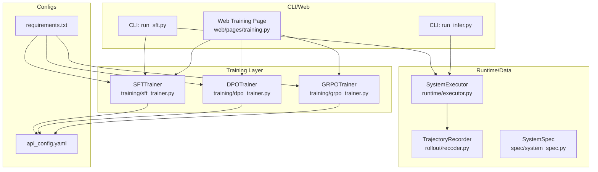
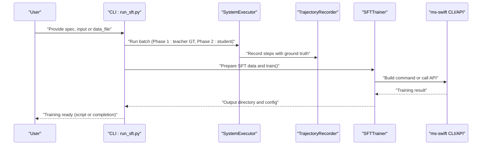
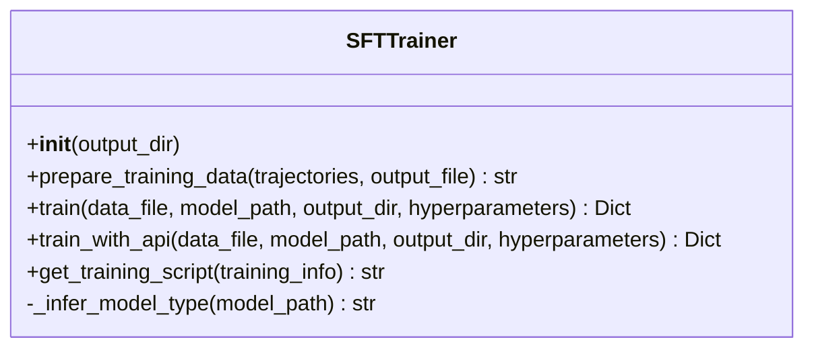
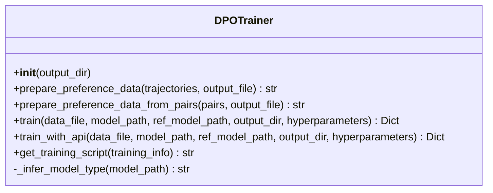
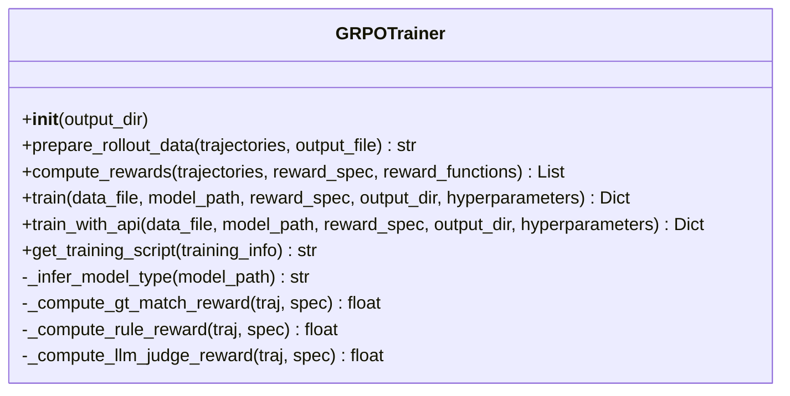
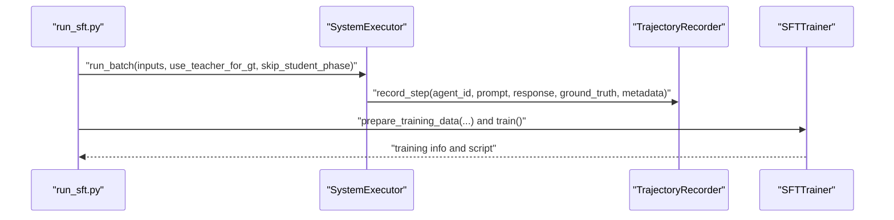
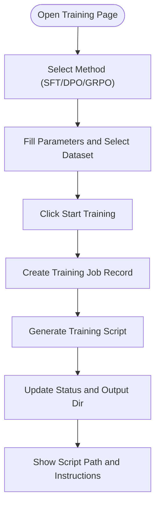
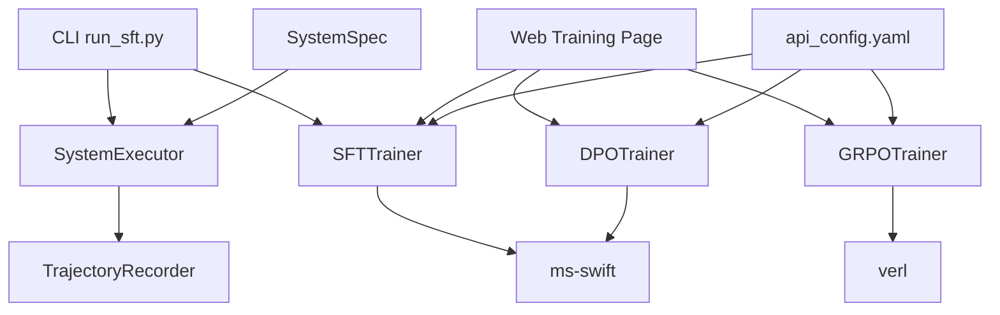

# Training Framework

<cite>
**Referenced Files in This Document**
- [training/__init__.py](file://training/__init__.py)
- [training/sft_trainer.py](file://training/sft_trainer.py)
- [training/dpo_trainer.py](file://training/dpo_trainer.py)
- [training/grpo_trainer.py](file://training/grpo_trainer.py)
- [traning/sft_trainer.py](file://traning/sft_trainer.py)
- [cli/run_sft.py](file://cli/run_sft.py)
- [cli/run_infer.py](file://cli/run_infer.py)
- [runtime/executor.py](file://runtime/executor.py)
- [rollout/recoder.py](file://rollout/recoder.py)
- [web/pages/training.py](file://web/pages/training.py)
- [spec/system_spec.py](file://spec/system_spec.py)
- [configs/api_config.yaml](file://configs/api_config.yaml)
- [requirements.txt](file://requirements.txt)
</cite>

## Table of Contents
1. [Introduction](#introduction)
2. [Project Structure](#project-structure)
3. [Core Components](#core-components)
4. [Architecture Overview](#architecture-overview)
5. [Detailed Component Analysis](#detailed-component-analysis)
6. [Dependency Analysis](#dependency-analysis)
7. [Performance Considerations](#performance-considerations)
8. [Troubleshooting Guide](#troubleshooting-guide)
9. [Conclusion](#conclusion)
10. [Appendices](#appendices)

## Introduction
This document describes the training framework implementation for supervised fine-tuning (SFT), direct preference optimization (DPO), and guided reinforcement learning from human feedback (GRPO). It explains how the system integrates with ms-swift for SFT/DPO and with verl for GRPO, how training data is prepared from multi-agent trajectories, and how trainers expose configuration options and scripts for execution. Practical workflows, hyperparameter guidance, evaluation considerations, troubleshooting tips, and deployment notes are included to support efficient and reliable training.

## Project Structure
The training framework is organized around three primary trainer classes and supporting runtime/data preparation utilities. The CLI and web UI provide user-facing entry points to orchestrate training runs.

**Diagram sources**
- [training/sft_trainer.py:1-263](file://training/sft_trainer.py#L1-L263)
- [training/dpo_trainer.py:1-320](file://training/dpo_trainer.py#L1-L320)
- [training/grpo_trainer.py:1-385](file://training/grpo_trainer.py#L1-L385)
- [runtime/executor.py:1-132](file://runtime/executor.py#L1-L132)
- [rollout/recoder.py:1-122](file://rollout/recoder.py#L1-L122)
- [cli/run_sft.py:1-117](file://cli/run_sft.py#L1-L117)
- [cli/run_infer.py:1-46](file://cli/run_infer.py#L1-L46)
- [web/pages/training.py:1-553](file://web/pages/training.py#L1-L553)
- [configs/api_config.yaml:1-9](file://configs/api_config.yaml#L1-L9)
- [requirements.txt:1-19](file://requirements.txt#L1-L19)

**Section sources**
- [training/__init__.py:1-7](file://training/__init__.py#L1-L7)
- [training/sft_trainer.py:1-263](file://training/sft_trainer.py#L1-L263)
- [training/dpo_trainer.py:1-320](file://training/dpo_trainer.py#L1-L320)
- [training/grpo_trainer.py:1-385](file://training/grpo_trainer.py#L1-L385)
- [runtime/executor.py:1-132](file://runtime/executor.py#L1-L132)
- [rollout/recoder.py:1-122](file://rollout/recoder.py#L1-L122)
- [cli/run_sft.py:1-117](file://cli/run_sft.py#L1-L117)
- [cli/run_infer.py:1-46](file://cli/run_infer.py#L1-L46)
- [web/pages/training.py:1-553](file://web/pages/training.py#L1-L553)
- [configs/api_config.yaml:1-9](file://configs/api_config.yaml#L1-L9)
- [requirements.txt:1-19](file://requirements.txt#L1-L19)

## Core Components
- SFTTrainer: Converts multi-agent trajectory steps with ground truth into supervised training format and prepares ms-swift commands or invokes the ms-swift Python API for training.
- DPOTrainer: Builds preference pairs from trajectories (chosen vs rejected) and prepares ms-swift DPO commands or uses the ms-swift Python API for training.
- GRPOTrainer: Assembles rollout-style trajectories and computes rewards via configurable reward specs, then generates verl GRPO configurations and commands or uses the verl Python API for training.
- SystemExecutor: Orchestrates two-phase execution (Phase 1: teacher-generated ground truth; Phase 2: student execution with trajectory recording) to produce training-ready datasets.
- TrajectoryRecorder: Writes step-level records and supports assembling SFT datasets and converting to SWIFT-compatible formats.
- CLI and Web: Provide command-line and GUI workflows to trigger training tasks, manage datasets, and generate executable scripts.

**Section sources**
- [training/sft_trainer.py:9-263](file://training/sft_trainer.py#L9-L263)
- [training/dpo_trainer.py:8-320](file://training/dpo_trainer.py#L8-L320)
- [training/grpo_trainer.py:8-385](file://training/grpo_trainer.py#L8-L385)
- [runtime/executor.py:9-132](file://runtime/executor.py#L9-L132)
- [rollout/recoder.py:8-122](file://rollout/recoder.py#L8-L122)
- [cli/run_sft.py:17-117](file://cli/run_sft.py#L17-L117)
- [web/pages/training.py:1-553](file://web/pages/training.py#L1-L553)

## Architecture Overview
The training pipeline integrates multi-agent execution, trajectory recording, and external training libraries (ms-swift and verl). The CLI and web UI coordinate data preparation and training launch, while the trainers encapsulate model-specific configuration and command/script generation.

**Diagram sources**
- [cli/run_sft.py:17-117](file://cli/run_sft.py#L17-L117)
- [runtime/executor.py:16-132](file://runtime/executor.py#L16-L132)
- [rollout/recoder.py:15-42](file://rollout/recoder.py#L15-L42)
- [training/sft_trainer.py:59-140](file://training/sft_trainer.py#L59-L140)

## Detailed Component Analysis

### SFTTrainer
- Purpose: Convert recorded trajectories into supervised training data and launch SFT via ms-swift (CLI or Python API).
- Data preparation: Filters steps with ground truth and writes JSONL with fields suitable for supervised finetuning.
- Training options: Supports CLI and API modes, default hyperparameters, and automatic model type inference from model path.
- Script generation: Produces a shell script containing the constructed ms-swift command for reproducible execution.

**Diagram sources**
- [training/sft_trainer.py:9-263](file://training/sft_trainer.py#L9-L263)

**Section sources**
- [training/sft_trainer.py:16-58](file://training/sft_trainer.py#L16-L58)
- [training/sft_trainer.py:59-140](file://training/sft_trainer.py#L59-L140)
- [training/sft_trainer.py:142-220](file://training/sft_trainer.py#L142-L220)
- [training/sft_trainer.py:221-263](file://training/sft_trainer.py#L221-L263)

### DPOTrainer
- Purpose: Build preference pairs (chosen vs rejected) from trajectories and launch DPO via ms-swift (CLI or Python API).
- Data preparation: Creates JSONL entries with chosen and rejected responses derived from ground truth and model outputs.
- Training options: Includes beta parameter, default hyperparameters, and model type inference.
- Script generation: Outputs a verbatim ms-swift DPO command for execution.

**Diagram sources**
- [training/dpo_trainer.py:8-320](file://training/dpo_trainer.py#L8-L320)

**Section sources**
- [training/dpo_trainer.py:15-59](file://training/dpo_trainer.py#L15-L59)
- [training/dpo_trainer.py:61-98](file://training/dpo_trainer.py#L61-L98)
- [training/dpo_trainer.py:100-190](file://training/dpo_trainer.py#L100-L190)
- [training/dpo_trainer.py:192-277](file://training/dpo_trainer.py#L192-L277)
- [training/dpo_trainer.py:278-320](file://training/dpo_trainer.py#L278-L320)

### GRPOTrainer
- Purpose: Prepare rollout-style trajectories and compute rewards via reward specs, then launch GRPO via verl (CLI or Python API).
- Data preparation: Converts trajectories into rollout format with per-step prompts, responses, and placeholders for rewards.
- Reward computation: Supports multiple reward types (ground-truth match, rule-based, LLM judge, custom) with weighted aggregation.
- Training options: Includes rollout batch size, mini-batch size, KL coefficient, clipping range, and advantage estimation.
- Script generation: Produces a verl CLI command referencing a generated configuration file.

**Diagram sources**
- [training/grpo_trainer.py:8-385](file://training/grpo_trainer.py#L8-L385)

**Section sources**
- [training/grpo_trainer.py:15-60](file://training/grpo_trainer.py#L15-L60)
- [training/grpo_trainer.py:62-114](file://training/grpo_trainer.py#L62-L114)
- [training/grpo_trainer.py:116-176](file://training/grpo_trainer.py#L116-L176)
- [training/grpo_trainer.py:177-266](file://training/grpo_trainer.py#L177-L266)
- [training/grpo_trainer.py:268-341](file://training/grpo_trainer.py#L268-L341)
- [training/grpo_trainer.py:343-385](file://training/grpo_trainer.py#L343-L385)

### Data Preparation and Execution Flow
- Two-phase execution: Phase 1 uses teacher models to generate ground truth; Phase 2 runs student models and records trajectories with ground truth for SFT.
- TrajectoryRecorder: Writes step-level records and supports assembling SFT datasets and converting to SWIFT-compatible formats.
- CLI integration: run_sft.py orchestrates the full pipeline, optionally invoking run_training from the standalone trainer module.

**Diagram sources**
- [cli/run_sft.py:72-87](file://cli/run_sft.py#L72-L87)
- [runtime/executor.py:106-123](file://runtime/executor.py#L106-L123)
- [rollout/recoder.py:15-42](file://rollout/recoder.py#L15-L42)
- [training/sft_trainer.py:16-58](file://training/sft_trainer.py#L16-L58)

**Section sources**
- [runtime/executor.py:16-132](file://runtime/executor.py#L16-L132)
- [rollout/recoder.py:44-96](file://rollout/recoder.py#L44-L96)
- [cli/run_sft.py:72-107](file://cli/run_sft.py#L72-L107)

### Web UI Integration
- Provides tabs for SFT, DPO, and GRPO training with parameter controls and progress tracking.
- Generates training jobs, saves scripts, and updates statuses in the database.
- Exposes actions to refresh, view details, and stop jobs.

**Diagram sources**
- [web/pages/training.py:16-217](file://web/pages/training.py#L16-L217)
- [web/pages/training.py:254-485](file://web/pages/training.py#L254-L485)

**Section sources**
- [web/pages/training.py:16-217](file://web/pages/training.py#L16-L217)
- [web/pages/training.py:254-485](file://web/pages/training.py#L254-L485)

## Dependency Analysis
- External training frameworks:
  - ms-swift: Used by SFTTrainer and DPOTrainer for CLI/API training.
  - verl: Used by GRPOTrainer for CLI/API training.
- Internal dependencies:
  - SystemExecutor depends on AgentRunner and TrajectoryRecorder to collect and record multi-agent trajectories.
  - CLI and Web depend on trainers to generate commands/scripts and manage training jobs.
- Configuration:
  - SystemSpec defines agent-level training configuration (ground truth keys, loss weights, training parameters).
  - API credentials are configured via api_config.yaml.

**Diagram sources**
- [training/sft_trainer.py:103-123](file://training/sft_trainer.py#L103-L123)
- [training/dpo_trainer.py:149-172](file://training/dpo_trainer.py#L149-L172)
- [training/grpo_trainer.py:254-258](file://training/grpo_trainer.py#L254-L258)
- [runtime/executor.py:14-14](file://runtime/executor.py#L14-L14)
- [cli/run_sft.py:12-14](file://cli/run_sft.py#L12-L14)
- [web/pages/training.py:4-6](file://web/pages/training.py#L4-L6)
- [spec/system_spec.py:29-36](file://spec/system_spec.py#L29-L36)
- [configs/api_config.yaml:1-9](file://configs/api_config.yaml#L1-L9)

**Section sources**
- [requirements.txt:16-18](file://requirements.txt#L16-L18)
- [training/sft_trainer.py:103-123](file://training/sft_trainer.py#L103-L123)
- [training/dpo_trainer.py:149-172](file://training/dpo_trainer.py#L149-L172)
- [training/grpo_trainer.py:254-258](file://training/grpo_trainer.py#L254-L258)
- [runtime/executor.py:14-14](file://runtime/executor.py#L14-L14)
- [web/pages/training.py:4-6](file://web/pages/training.py#L4-L6)
- [spec/system_spec.py:29-36](file://spec/system_spec.py#L29-L36)
- [configs/api_config.yaml:1-9](file://configs/api_config.yaml#L1-L9)

## Performance Considerations
- Batch sizing and accumulation:
  - Adjust per-device batch size and gradient accumulation steps to fit GPU memory while maintaining effective batch sizes.
- Mixed precision and scheduling:
  - Enable FP16 when supported; choose cosine decay with appropriate warmup ratio for stable convergence.
- Model type inference:
  - Ensure model path strings include identifiers recognized by the inference logic to select correct model types for ms-swift/verl.
- Hardware detection:
  - CLI and trainer logic detect GPUs and adjust flags accordingly; disable flash attention if stability issues arise.
- Rollout and mini-batch:
  - For GRPO, tune rollout batch size and mini-batch size to balance memory footprint and sample efficiency.

[No sources needed since this section provides general guidance]

## Troubleshooting Guide
- ms-swift not installed:
  - SFTTrainer.train_with_api and DPOTrainer.train_with_api return an error message indicating missing installation; fall back to CLI mode or install ms-swift.
- verl not installed:
  - GRPOTrainer.train_with_api returns an error message indicating missing installation; fall back to CLI mode or install verl.
- Missing training data:
  - CLI requires either an input JSONL or an existing data file; ensure one is provided.
- GPU/CPU detection:
  - If CUDA is unavailable, CLI falls back to CPU training with explicit flags; confirm torch availability and device names.
- Reward computation:
  - LLM judge reward is currently simulated; integrate a real judge model for production use.

**Section sources**
- [training/sft_trainer.py:210-219](file://training/sft_trainer.py#L210-L219)
- [training/dpo_trainer.py:267-276](file://training/dpo_trainer.py#L267-L276)
- [training/grpo_trainer.py:332-341](file://training/grpo_trainer.py#L332-L341)
- [cli/run_sft.py:32-34](file://cli/run_sft.py#L32-L34)
- [cli/run_sft.py:51-53](file://cli/run_sft.py#L51-L53)
- [cli/run_sft.py:150-161](file://cli/run_sft.py#L150-L161)
- [training/grpo_trainer.py:167-175](file://training/grpo_trainer.py#L167-L175)

## Conclusion
The training framework provides a cohesive pipeline for SFT, DPO, and GRPO using established libraries (ms-swift and verl). It leverages multi-agent execution and trajectory recording to produce high-quality training data, exposes flexible configuration and script generation, and offers both CLI and web UI entry points. By tuning hyperparameters and ensuring proper environment setup, teams can efficiently train aligned models tailored to their use cases.

[No sources needed since this section summarizes without analyzing specific files]

## Appendices

### Practical Training Workflows
- SFT (Distillation-based):
  - Use CLI to run the two-phase process: teacher-generated ground truth followed by student execution and SFT training.
  - Alternatively, use the web UI to generate a training script and execute it manually.
- DPO:
  - Prepare preference data from trajectories or provide explicit chosen/rejected pairs.
  - Launch training via CLI or web UI; verify the generated command and run it.
- GRPO:
  - Prepare rollout-style trajectories and define reward specs.
  - Launch training via CLI or web UI; monitor reward computation and training progress.

**Section sources**
- [cli/run_sft.py:72-107](file://cli/run_sft.py#L72-L107)
- [web/pages/training.py:254-485](file://web/pages/training.py#L254-L485)
- [training/dpo_trainer.py:15-59](file://training/dpo_trainer.py#L15-L59)
- [training/grpo_trainer.py:15-60](file://training/grpo_trainer.py#L15-L60)

### Hyperparameter Selection Guidelines
- SFT:
  - Learning rate: Start with small values; adjust based on convergence.
  - Batch size: Increase gradually until memory allows; use gradient accumulation for larger effective batch sizes.
  - Epochs: Monitor validation metrics; early stopping recommended.
- DPO:
  - Beta: Small positive value; tune to balance preference learning.
  - Learning rate: Typically smaller than SFT.
  - Gradient accumulation: Often increased to stabilize updates.
- GRPO:
  - KL coefficient: Controls divergence from the policy; tune to maintain stability.
  - Rollout batch size: Larger improves sample efficiency but increases memory.
  - Mini-batch size: Balance between throughput and stability.

**Section sources**
- [training/sft_trainer.py:82-94](file://training/sft_trainer.py#L82-L94)
- [training/dpo_trainer.py:129-141](file://training/dpo_trainer.py#L129-L141)
- [training/grpo_trainer.py:202-218](file://training/grpo_trainer.py#L202-L218)

### Evaluation Metrics and Monitoring
- Logging and checkpoints:
  - Use built-in logging steps and save steps to track progress during training.
- Post-training:
  - Evaluate model quality via human evaluation or automated benchmarks aligned with your reward objectives.
- Web UI:
  - Track job status and output directories; inspect training logs for anomalies.

**Section sources**
- [training/sft_trainer.py:113-119](file://training/sft_trainer.py#L113-L119)
- [training/dpo_trainer.py:167-168](file://training/dpo_trainer.py#L167-L168)
- [training/grpo_trainer.py:244-247](file://training/grpo_trainer.py#L244-L247)
- [web/pages/training.py:274-335](file://web/pages/training.py#L274-L335)

### Deployment Considerations
- Environment:
  - Ensure ms-swift and/or verl are installed according to requirements.
  - Configure API credentials for any external model providers used in reward computation.
- Resource optimization:
  - Adjust batch sizes, accumulation steps, and mixed precision settings to maximize throughput.
  - Monitor GPU utilization and memory usage; reduce batch sizes if out-of-memory errors occur.
- Script-based execution:
  - Prefer generating and running training scripts for reproducibility and auditability.

**Section sources**
- [requirements.txt:16-18](file://requirements.txt#L16-L18)
- [configs/api_config.yaml:1-9](file://configs/api_config.yaml#L1-L9)
- [cli/run_sft.py:150-161](file://cli/run_sft.py#L150-L161)