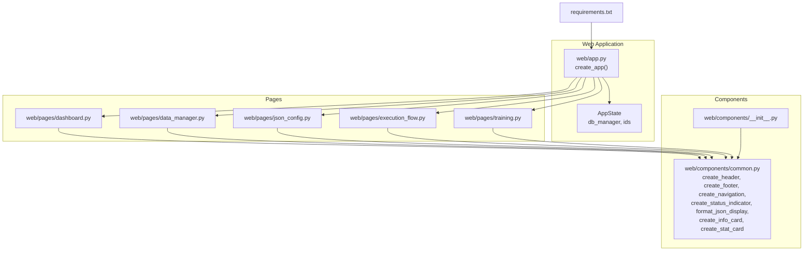
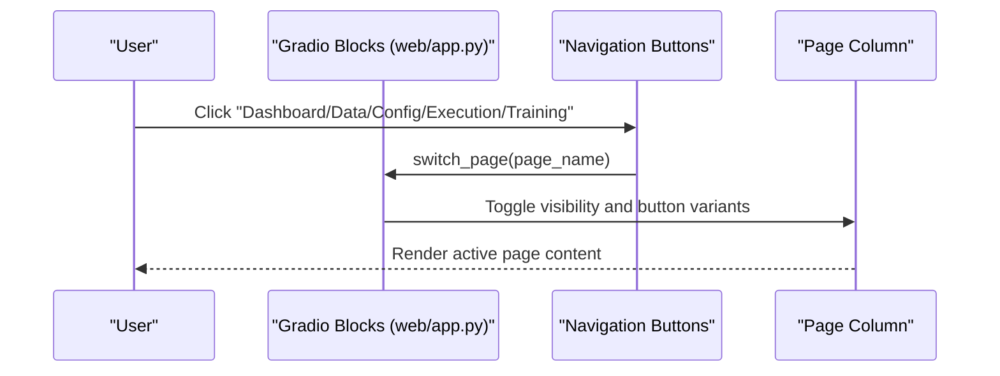
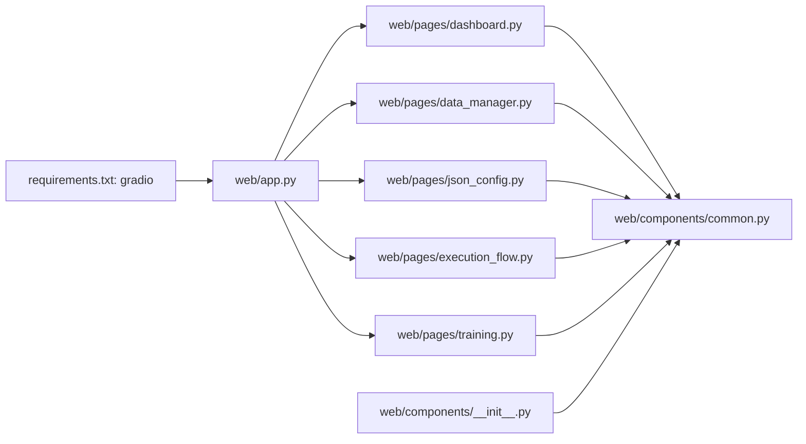

# Common UI Components

<cite>
**Referenced Files in This Document**
- [web/app.py](file://web/app.py)
- [web/components/common.py](file://web/components/common.py)
- [web/components/__init__.py](file://web/components/__init__.py)
- [web/pages/dashboard.py](file://web/pages/dashboard.py)
- [web/pages/data_manager.py](file://web/pages/data_manager.py)
- [web/pages/json_config.py](file://web/pages/json_config.py)
- [web/pages/execution_flow.py](file://web/pages/execution_flow.py)
- [web/pages/training.py](file://web/pages/training.py)
- [requirements.txt](file://requirements.txt)
</cite>

## Table of Contents
1. [Introduction](#introduction)
2. [Project Structure](#project-structure)
3. [Core Components](#core-components)
4. [Architecture Overview](#architecture-overview)
5. [Detailed Component Analysis](#detailed-component-analysis)
6. [Dependency Analysis](#dependency-analysis)
7. [Performance Considerations](#performance-considerations)
8. [Troubleshooting Guide](#troubleshooting-guide)
9. [Conclusion](#conclusion)
10. [Appendices](#appendices)

## Introduction
This document describes the shared UI components and utility functions used across the web interface built with Gradio. It explains the reusable component library, styling system, and navigation patterns. It also covers component architecture, prop-like interfaces, customization options, common usage patterns, state management, responsive design, cross-browser compatibility, performance optimization, theming, CSS customizations, and testing approaches. Guidance is included for extending the component library and maintaining design consistency.

## Project Structure
The web UI is organized around a central application factory that composes multiple page modules. Shared UI helpers live under a dedicated components package. Styling is applied via Gradio themes and inline CSS classes.

**Diagram sources**
- [web/app.py:20-157](file://web/app.py#L20-L157)
- [web/components/common.py:5-90](file://web/components/common.py#L5-L90)
- [web/components/__init__.py:1-5](file://web/components/__init__.py#L1-L5)
- [web/pages/dashboard.py:1-140](file://web/pages/dashboard.py#L1-L140)
- [web/pages/data_manager.py:1-310](file://web/pages/data_manager.py#L1-L310)
- [web/pages/json_config.py:1-377](file://web/pages/json_config.py#L1-L377)
- [web/pages/execution_flow.py:1-275](file://web/pages/execution_flow.py#L1-L275)
- [web/pages/training.py:1-553](file://web/pages/training.py#L1-L553)
- [requirements.txt:10-11](file://requirements.txt#L10-L11)

**Section sources**
- [web/app.py:20-157](file://web/app.py#L20-L157)
- [web/components/common.py:5-90](file://web/components/common.py#L5-L90)
- [web/components/__init__.py:1-5](file://web/components/__init__.py#L1-L5)
- [requirements.txt:10-11](file://requirements.txt#L10-L11)

## Core Components
Reusable UI helpers are defined in the components package and used across pages. They encapsulate common patterns such as headers, footers, navigation, status indicators, info cards, and stat cards. These functions accept parameters for labels, messages, and optional icons, returning Gradio components ready to render.

Key shared utilities:
- Header and footer: consistent branding and legal notices
- Navigation bar: primary page switching with active state styling
- Status indicator: color-coded and emoji-assisted status messaging
- JSON formatting: consistent fenced code block rendering
- Info card: Markdown-based content cards with icons
- Stat card: columnar layout for numeric summaries

These utilities promote consistency and reduce duplication across pages.

**Section sources**
- [web/components/common.py:5-90](file://web/components/common.py#L5-L90)
- [web/components/__init__.py:1-5](file://web/components/__init__.py#L1-L5)

## Architecture Overview
The application initializes a global state object and applies a Gradio theme. The main Blocks container holds multiple page columns, each representing a distinct functional area. Navigation buttons toggle visibility of these columns and update button variants to reflect the active page. Pages compose Gradio components (buttons, textboxes, dropdowns, dataframes, sliders, markdown, JSON viewers) and bind event handlers to drive state updates and user interactions.

**Diagram sources**
- [web/app.py:107-155](file://web/app.py#L107-L155)

**Section sources**
- [web/app.py:20-157](file://web/app.py#L20-L157)

## Detailed Component Analysis

### Theme and Global Styling
- Theme: Soft theme with custom hues and Inter font
- CSS: Container width, header alignment, and nav-button width are defined via inline CSS and elem_classes
- Consistent typography and spacing are enforced through the theme and CSS classes

Customization options:
- Adjust primary/secondary/neutral hues to change brand colors
- Modify max-width and margins for responsive breakpoints
- Extend elem_classes for additional component-level styles

**Section sources**
- [web/app.py:26-46](file://web/app.py#L26-L46)

### Navigation Bar
- Five buttons for page switching
- Active button variant changes dynamically
- Buttons use elem_classes to ensure full-width layout

Composition pattern:
- Returned tuple of buttons enables binding click handlers to switch pages
- Each handler invokes switch_page with the target page name

**Section sources**
- [web/app.py:60-72](file://web/app.py#L60-L72)
- [web/app.py:107-155](file://web/app.py#L107-L155)
- [web/components/common.py:27-41](file://web/components/common.py#L27-L41)

### Page Columns and Visibility Management
- Each page is wrapped in a column with initial visibility flags
- switch_page toggles visibility and button variants atomically
- Ensures only one page is rendered at a time

State management:
- Uses Gradio State to track current page
- Outputs include both visibility flags and button variants

**Section sources**
- [web/app.py:75-119](file://web/app.py#L75-L119)

### Dashboard Page
Highlights:
- Statistics cards with gradient backgrounds and centered layout
- Quick action cards for major workflows
- Recent activity lists for configs and training jobs
- Refresh button bound to a simple status output

Patterns:
- Row/column layouts for grid-based content
- Markdown for structured headings and lists
- Dataframe for tabular summaries

**Section sources**
- [web/pages/dashboard.py:6-140](file://web/pages/dashboard.py#L6-L140)

### Data Manager Page
Highlights:
- Tabs for dataset management, generated data filtering, and export
- Upload form with validation and status reporting
- Dataset table with refresh and delete actions
- Preview functionality for dataset records
- Export pipeline with configurable format

Event handling:
- Upload, refresh, delete, preview, filter, view trajectory, and export handlers
- Outputs include status messages, tables, JSON previews, and downloadable files

**Section sources**
- [web/pages/data_manager.py:8-310](file://web/pages/data_manager.py#L8-L310)

### JSON Config Page
Highlights:
- Tabs for upload/validation, configuration list, and visualization
- JSON editor with pre-filled example
- Validation status, errors/warnings, execution order, and dataflow graph
- Configuration list with refresh/view/delete actions
- Mermaid-based visualization generation

Event handling:
- Validate, save, refresh, view, delete, and visualization handlers
- Outputs include validation results, configuration details, and Mermaid code

**Section sources**
- [web/pages/json_config.py:8-377](file://web/pages/json_config.py#L8-L377)

### Execution Flow Page
Highlights:
- Run configuration selection (config and dataset), options for teacher forcing and trajectory recording
- Execution status, progress slider, and log textbox
- Tabs for results, trajectory steps, and flow visualization
- Event-driven execution with simplified batch run

Event handling:
- Run execution handler updates status, logs, outputs, statistics, and trajectory data
- Flow visualization helper generates HTML representation of execution order

**Section sources**
- [web/pages/execution_flow.py:9-275](file://web/pages/execution_flow.py#L9-L275)

### Training Page
Highlights:
- Tabs for SFT, DPO, and GRPO training
- Configuration forms with advanced parameters in accordions
- Training status, progress slider, logs, and output information
- Training job list with refresh/view/stop actions and detailed JSON viewer

Event handling:
- Start handlers for each training type create jobs, update statuses, and generate training scripts
- Job refresh and view handlers manage job lifecycle and inspection

**Section sources**
- [web/pages/training.py:9-553](file://web/pages/training.py#L9-L553)

### Shared Utilities Library
- Status indicator: maps status strings to colors and emojis, returns styled Markdown
- JSON formatter: wraps dictionaries in fenced code blocks for consistent display
- Info card: renders a titled Markdown card with optional icon
- Stat card: creates a column-based numeric summary card with optional description

Usage patterns:
- Centralized status messaging across pages
- Consistent JSON presentation for debugging and inspection
- Reusable card components for dashboards and summaries

**Section sources**
- [web/components/common.py:44-90](file://web/components/common.py#L44-L90)

## Dependency Analysis
The UI stack relies on Gradio for the front-end framework. The application module depends on page modules, which in turn depend on shared components and the database manager. The components package exports only the shared helpers.

**Diagram sources**
- [requirements.txt:10-11](file://requirements.txt#L10-L11)
- [web/app.py:1-8](file://web/app.py#L1-L8)
- [web/components/__init__.py:1-5](file://web/components/__init__.py#L1-L5)

**Section sources**
- [requirements.txt:10-11](file://requirements.txt#L10-L11)
- [web/app.py:1-8](file://web/app.py#L1-L8)
- [web/components/__init__.py:1-5](file://web/components/__init__.py#L1-L5)

## Performance Considerations
- Minimize heavy computations in event handlers; offload to background tasks if needed
- Limit table sizes and pagination where appropriate (e.g., restrict rows in generated data lists)
- Use interactive=False for static dataframes to reduce client-side overhead
- Cache expensive validations or visualizations when feasible
- Keep JSON previews concise; limit preview counts to small samples
- Prefer streaming logs for long-running operations when supported by the backend

## Troubleshooting Guide
Common issues and remedies:
- Navigation not switching pages: verify switch_page outputs include all page columns and buttons
- Empty tables: ensure fallback empty rows are provided when no data exists
- Validation failures: check JSON parsing and validation error propagation
- Export/download failures: confirm file paths and permissions for write operations
- Styling inconsistencies: ensure elem_classes match CSS selectors and theme settings

**Section sources**
- [web/app.py:107-155](file://web/app.py#L107-L155)
- [web/pages/data_manager.py:135-179](file://web/pages/data_manager.py#L135-L179)
- [web/pages/json_config.py:181-206](file://web/pages/json_config.py#L181-L206)
- [web/pages/training.py:254-339](file://web/pages/training.py#L254-L339)

## Conclusion
The UI leverages a small set of shared components and a consistent theme to deliver a cohesive experience across pages. Navigation is centralized, styling is theme-driven with targeted CSS, and event-driven interactions power dynamic content. Following the patterns outlined here ensures maintainability, responsiveness, and scalability as the component library grows.

## Appendices

### Component Composition Patterns
- Use elem_classes for consistent button widths and layout
- Wrap page content in columns with visibility toggles for single-page navigation
- Compose pages from Gradio components and bind event handlers to outputs
- Centralize status messaging and JSON formatting via shared utilities

### Accessibility and Cross-Browser Compatibility
- Gradio’s built-in accessibility features apply to components by default
- Ensure sufficient color contrast for status indicators and gradients
- Test navigation and interactive elements across browsers to confirm consistent behavior

### Extending the Component Library
- Add new helpers to the components package and export them in __init__.py
- Keep helper functions pure and parameterized for reusability
- Use elem_classes and theme settings for styling consistency

### Testing Approaches
- Unit test event handlers by invoking them with synthetic inputs and asserting outputs
- Snapshot test page compositions by rendering minimal content and validating structure
- Validate JSON formatting and status indicator mappings with focused tests