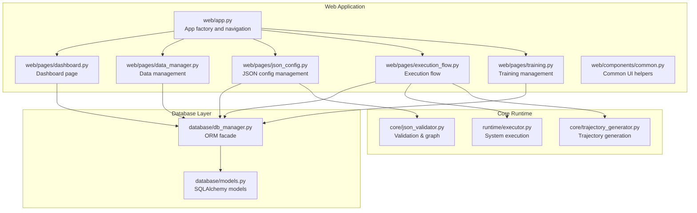
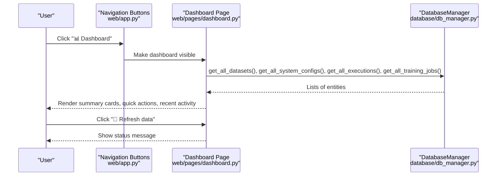
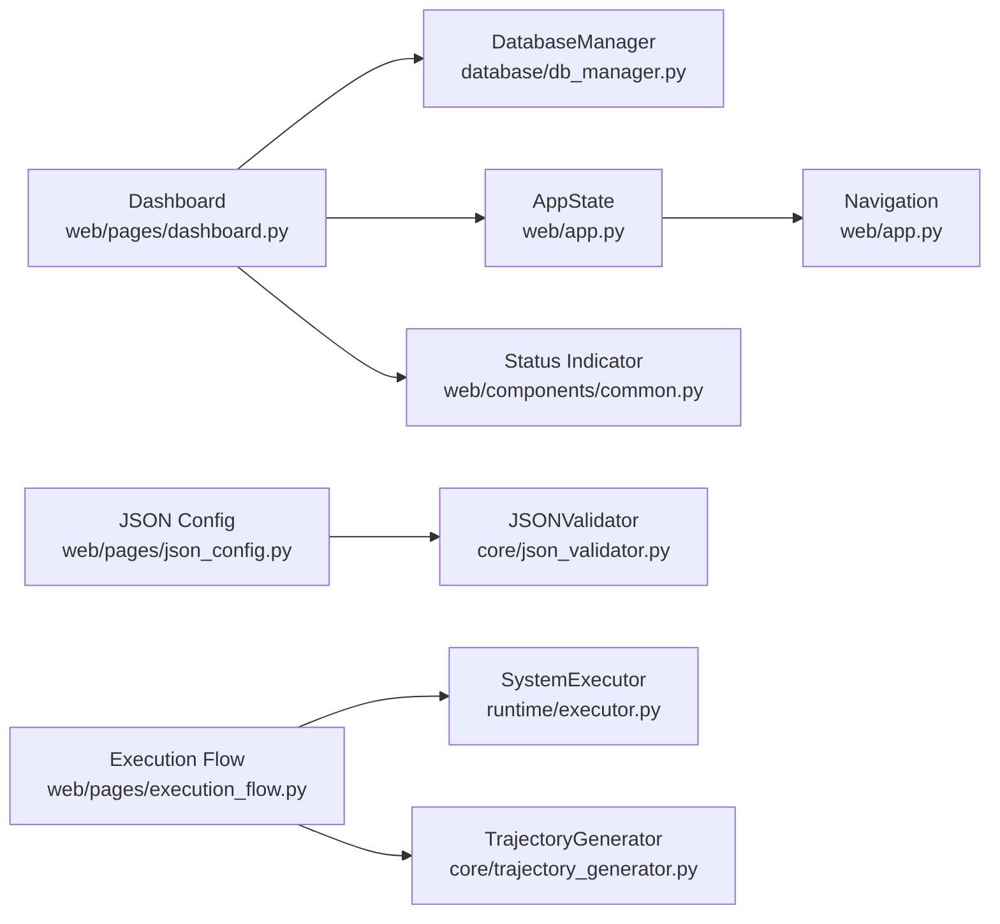
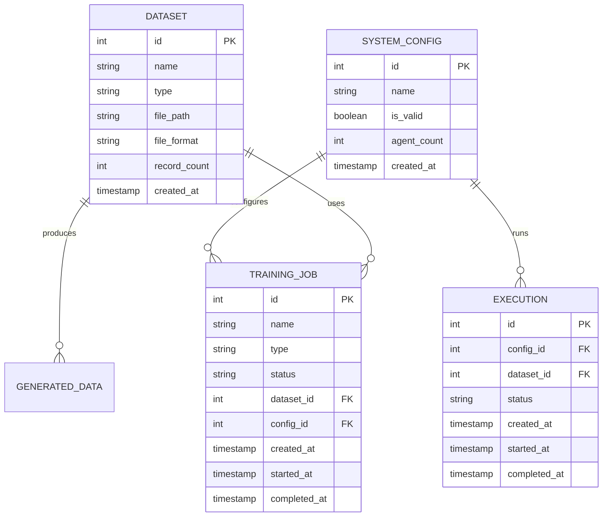

# Dashboard Overview

<cite>
**Referenced Files in This Document**
- [web/pages/dashboard.py](file://web/pages/dashboard.py)
- [web/app.py](file://web/app.py)
- [database/db_manager.py](file://database/db_manager.py)
- [database/models.py](file://database/models.py)
- [web/components/common.py](file://web/components/common.py)
- [web/pages/data_manager.py](file://web/pages/data_manager.py)
- [web/pages/json_config.py](file://web/pages/json_config.py)
- [web/pages/execution_flow.py](file://web/pages/execution_flow.py)
- [web/pages/training.py](file://web/pages/training.py)
- [core/json_validator.py](file://core/json_validator.py)
- [core/trajectory_generator.py](file://core/trajectory_generator.py)
- [runtime/executor.py](file://runtime/executor.py)
- [main_web.py](file://main_web.py)
</cite>

## Table of Contents
1. [Introduction](#introduction)
2. [Project Structure](#project-structure)
3. [Core Components](#core-components)
4. [Architecture Overview](#architecture-overview)
5. [Detailed Component Analysis](#detailed-component-analysis)
6. [Dependency Analysis](#dependency-analysis)
7. [Performance Considerations](#performance-considerations)
8. [Troubleshooting Guide](#troubleshooting-guide)
9. [Conclusion](#conclusion)
10. [Appendices](#appendices)

## Introduction
This document provides a comprehensive overview of the dashboard page within the Multi-Agent System Builder Web UI. It explains the main landing page functionality, including system status indicators, recent activity feeds, configuration summaries, and quick access controls. It also covers the dashboard layout, widget organization, real-time-like data displays, navigation structure, system health monitoring, and user workflow shortcuts. Guidance is included on interpreting dashboard metrics, customization options, data refresh mechanisms, performance considerations, and troubleshooting common dashboard issues.

## Project Structure
The dashboard is part of a Gradio-based web application with modular page components and a shared database layer. The application initializes global state, renders a navigation bar, and switches between pages via button clicks. The dashboard aggregates statistics, presents quick-access controls, and shows recent activity items.

**Diagram sources**
- [web/app.py:20-157](file://web/app.py#L20-L157)
- [web/pages/dashboard.py:6-140](file://web/pages/dashboard.py#L6-L140)
- [database/db_manager.py:11-347](file://database/db_manager.py#L11-L347)
- [database/models.py:10-123](file://database/models.py#L10-L123)
- [web/components/common.py:5-91](file://web/components/common.py#L5-L91)
- [web/pages/data_manager.py:8-310](file://web/pages/data_manager.py#L8-L310)
- [web/pages/json_config.py:8-377](file://web/pages/json_config.py#L8-L377)
- [web/pages/execution_flow.py:9-275](file://web/pages/execution_flow.py#L9-L275)
- [web/pages/training.py:9-553](file://web/pages/training.py#L9-L553)
- [core/json_validator.py:37-347](file://core/json_validator.py#L37-L347)
- [core/trajectory_generator.py:58-353](file://core/trajectory_generator.py#L58-L353)
- [runtime/executor.py:9-132](file://runtime/executor.py#L9-L132)

**Section sources**
- [web/app.py:20-157](file://web/app.py#L20-L157)
- [web/pages/dashboard.py:6-140](file://web/pages/dashboard.py#L6-L140)

## Core Components
- Dashboard page assembly: Creates summary cards, quick-access rows, recent activity lists, and a refresh mechanism.
- Navigation: Provides primary buttons to switch between dashboard, data management, configuration, execution flow, and training.
- Database integration: Uses a centralized DatabaseManager to fetch datasets, configurations, executions, and training jobs for rendering.
- Common UI helpers: Provide reusable components such as status indicators and info cards.

Key responsibilities:
- Dashboard: Render system overview, quick actions, and recent activity; support manual refresh.
- Navigation: Switch page visibility and update button variants.
- Data access: Provide aggregated counts and recent items for display.

**Section sources**
- [web/pages/dashboard.py:6-140](file://web/pages/dashboard.py#L6-L140)
- [web/app.py:11-157](file://web/app.py#L11-L157)
- [database/db_manager.py:11-347](file://database/db_manager.py#L11-L347)
- [web/components/common.py:44-91](file://web/components/common.py#L44-L91)

## Architecture Overview
The dashboard orchestrates data retrieval from the database and renders a responsive layout with Gradio. Navigation buttons control page visibility and highlight the active page. The refresh button currently logs a status message; future enhancements can integrate live updates.

**Diagram sources**
- [web/app.py:107-155](file://web/app.py#L107-L155)
- [web/pages/dashboard.py:12-27](file://web/pages/dashboard.py#L12-L27)
- [database/db_manager.py:66, 133, 254, 324](file://database/db_manager.py#L66,L133,L254,L324)

## Detailed Component Analysis

### Dashboard Layout and Widgets
- System overview cards:
  - Datasets count
  - System configurations count
  - Valid configurations count
  - Executions count
  - Training jobs count
- Quick-access row:
  - Data management
  - Configuration management
  - Execution flow
  - Training management
- Recent activity:
  - Latest configurations with validity
  - Latest training jobs with status
- Refresh control:
  - Button labeled “🔄 Refresh data”
  - Hidden status textbox for feedback

Widget organization:
- Cards arranged in a single row for overview metrics.
- Quick-access grouped in a second row for common tasks.
- Recent activity split into two columns for readability.
- Refresh control placed near the bottom for discoverability.

Examples of dashboard widgets:
- Statistic cards: render counts with gradient backgrounds and centered text.
- Markdown lists: present recent items with timestamps and statuses.
- Interactive button: triggers a refresh handler.

Real-time data displays:
- Current implementation reads data on page load and refresh click.
- No automatic polling is implemented; manual refresh is supported.

**Section sources**
- [web/pages/dashboard.py:29-140](file://web/pages/dashboard.py#L29-L140)

### Navigation Structure and Page Switching
- Navigation bar with five buttons: Dashboard, Data Management, Configuration, Execution Flow, Training.
- Page container holds all pages; only one is visible at a time.
- Button click handlers switch visibility and update button variants to indicate the active page.
- Global state tracks the current page for consistent behavior.

Workflow shortcuts:
- Quick links to major workflows: data upload, config validation, execution, and training initiation.

**Section sources**
- [web/app.py:61-155](file://web/app.py#L61-L155)

### System Health Monitoring and Status Indicators
- Status indicator utility supports multiple states (success, error, warning, info, pending) with icons and colors.
- Dashboard uses validity indicators (“✅ 有效”, “❌ 无效”) for configuration entries.
- Execution and training pages provide progress sliders and log outputs for runtime monitoring.

Note: The dashboard itself does not expose system health metrics beyond counts and recent items. Health monitoring is primarily handled on execution and training pages.

**Section sources**
- [web/components/common.py:44-66](file://web/components/common.py#L44-L66)
- [web/pages/dashboard.py:108-129](file://web/pages/dashboard.py#L108-L129)
- [web/pages/execution_flow.py:57-70](file://web/pages/execution_flow.py#L57-L70)
- [web/pages/training.py:61-79](file://web/pages/training.py#L61-L79)

### Recent Activity Feeds
- Recent configurations:
  - Displays up to five most recent configurations with name, validity, and creation time.
- Recent training jobs:
  - Displays up to five most recent jobs with name, type, status, and creation time.

These lists are populated from database queries and presented as Markdown bullet lists.

**Section sources**
- [web/pages/dashboard.py:103-130](file://web/pages/dashboard.py#L103-L130)
- [database/db_manager.py:133, 324](file://database/db_manager.py#L133,L324)

### Quick Access Controls
- Data management: Upload and manage datasets, preview, export training data.
- Configuration management: Upload JSON, validate, visualize dataflow, manage saved configurations.
- Execution flow: Select configuration and dataset, run execution, view logs, results, and trajectory.
- Training management: Create SFT/DPO/GRPO jobs, configure hyperparameters, monitor status.

Each control targets a dedicated page with appropriate forms and status displays.

**Section sources**
- [web/pages/data_manager.py:16-310](file://web/pages/data_manager.py#L16-L310)
- [web/pages/json_config.py:17-377](file://web/pages/json_config.py#L17-L377)
- [web/pages/execution_flow.py:16-275](file://web/pages/execution_flow.py#L16-L275)
- [web/pages/training.py:16-553](file://web/pages/training.py#L16-L553)

### Dashboard Customization Options
- The dashboard currently focuses on read-only presentation of counts and recent items.
- Future customization could include:
  - Adjustable refresh intervals (requires client-side polling or periodic updates).
  - Filterable recent activity (by date, status, type).
  - Configurable number of recent items shown.
  - Color-coded status badges and tooltips for deeper insights.

[No sources needed since this section provides general guidance]

### Data Refresh Mechanisms
- Manual refresh:
  - A refresh button triggers a handler that updates a hidden status textbox.
- Automatic refresh:
  - Not implemented. Data is re-fetched on page load and refresh click.

Recommendations:
- Integrate a debounced refresh callback to avoid excessive database queries.
- Add a timestamp label indicating last refresh time.
- Consider background tasks for long-running operations.

**Section sources**
- [web/pages/dashboard.py:132-139](file://web/pages/dashboard.py#L132-L139)

### Performance Considerations
- Database queries:
  - Fetches all datasets, configurations, executions, and training jobs for counts and recent lists.
  - Ordering by created_at descending ensures latest items appear first.
- Rendering:
  - Markdown-based cards and lists keep rendering lightweight.
  - Avoid heavy computations in the dashboard thread to maintain responsiveness.
- Recommendations:
  - Paginate recent activity lists if data volume grows.
  - Cache counts for short periods if refresh frequency is low.
  - Defer heavy operations (e.g., exporting training data) to background tasks.

**Section sources**
- [database/db_manager.py:66, 133, 254, 324](file://database/db_manager.py#L66,L133,L254,L324)
- [web/pages/dashboard.py:12-27](file://web/pages/dashboard.py#L12-L27)

### Interpreting Dashboard Metrics
- Datasets: Total number of uploaded datasets.
- System configurations: Total number of saved configurations.
- Valid configurations: Count of configurations that passed validation.
- Executions: Total run attempts recorded.
- Training jobs: Total training tasks created.

Guidance:
- Use “Valid configurations” to assess configuration quality.
- Monitor “Training jobs” to track training pipeline utilization.
- Review recent activity to identify bottlenecks or failures.

**Section sources**
- [web/pages/dashboard.py:18-25](file://web/pages/dashboard.py#L18-L25)

### Troubleshooting Guide
Common issues and resolutions:
- Empty recent activity:
  - Ensure datasets, configurations, executions, and training jobs exist in the database.
  - Verify database initialization during startup.
- Refresh button appears non-functional:
  - Confirm the click handler updates the status textbox.
  - Consider adding a toast notification or visible banner for feedback.
- Navigation not switching pages:
  - Check button click bindings and visibility outputs.
  - Ensure the active button variant is applied consistently.

Operational checks:
- Database initialization:
  - Startup script initializes the SQLite database and prints success messages.
- Dependencies:
  - Startup script verifies and installs required packages.

**Section sources**
- [web/pages/dashboard.py:132-139](file://web/pages/dashboard.py#L132-L139)
- [web/app.py:107-155](file://web/app.py#L107-L155)
- [main_web.py:63-70](file://main_web.py#L63-L70)
- [main_web.py:19-60](file://main_web.py#L19-L60)

## Dependency Analysis
The dashboard depends on the database layer for counts and recent items. Navigation is handled centrally, and common UI helpers provide standardized components.

**Diagram sources**
- [web/pages/dashboard.py:9, 12-27](file://web/pages/dashboard.py#L9,L12-L27)
- [database/db_manager.py:11-347](file://database/db_manager.py#L11-L347)
- [web/app.py:11-157](file://web/app.py#L11-L157)
- [web/components/common.py:44-66](file://web/components/common.py#L44-L66)
- [web/pages/json_config.py:12, 181-205](file://web/pages/json_config.py#L12,L181-L205)
- [core/json_validator.py:37-82](file://core/json_validator.py#L37-L82)
- [web/pages/execution_flow.py:12, 116-223](file://web/pages/execution_flow.py#L12,L116-L223)
- [runtime/executor.py:9-132](file://runtime/executor.py#L9-L132)
- [core/trajectory_generator.py:58-353](file://core/trajectory_generator.py#L58-L353)

**Section sources**
- [web/pages/dashboard.py:9, 12-27](file://web/pages/dashboard.py#L9,L12-L27)
- [database/db_manager.py:11-347](file://database/db_manager.py#L11-L347)
- [web/app.py:11-157](file://web/app.py#L11-L157)
- [web/components/common.py:44-66](file://web/components/common.py#L44-L66)
- [web/pages/json_config.py:12, 181-205](file://web/pages/json_config.py#L12,L181-L205)
- [web/pages/execution_flow.py:12, 116-223](file://web/pages/execution_flow.py#L12,L116-L223)
- [runtime/executor.py:9-132](file://runtime/executor.py#L9-L132)
- [core/trajectory_generator.py:58-353](file://core/trajectory_generator.py#L58-L353)

## Performance Considerations
- Keep dashboard queries minimal and indexed by created_at.
- Avoid rendering large Markdown blocks on initial load.
- Use pagination or lazy loading for recent activity if growth is expected.
- Debounce refresh actions to prevent rapid repeated queries.

[No sources needed since this section provides general guidance]

## Troubleshooting Guide
- If recent activity lists are empty:
  - Confirm database initialization and population.
  - Check that entities are being inserted correctly by other pages.
- If refresh does nothing:
  - Verify the click handler is bound and outputs are connected.
- If navigation fails:
  - Inspect button click handlers and visibility outputs.

**Section sources**
- [main_web.py:63-70](file://main_web.py#L63-L70)
- [web/pages/dashboard.py:132-139](file://web/pages/dashboard.py#L132-L139)
- [web/app.py:107-155](file://web/app.py#L107-L155)

## Conclusion
The dashboard provides a concise overview of system usage through summary cards, quick-access controls, and recent activity feeds. While current refresh is manual, the foundation is in place to extend interactivity, add automatic refresh, and incorporate richer health indicators. The modular architecture ensures maintainability and scalability as new features are introduced.

[No sources needed since this section summarizes without analyzing specific files]

## Appendices

### Data Model Overview (Dashboard Consumers)
The dashboard consumes the following entities:
- Datasets: total count and recent items
- System configurations: total, valid, and recent items
- Executions: total and recent items
- Training jobs: total and recent items

**Diagram sources**
- [database/models.py:10-123](file://database/models.py#L10-L123)