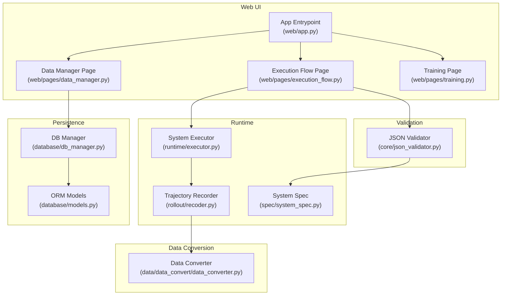
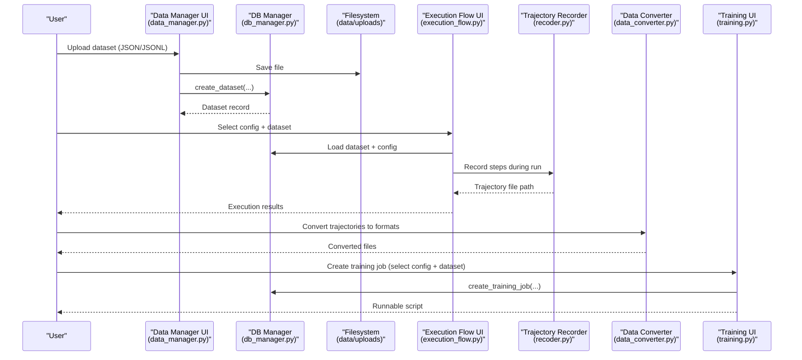
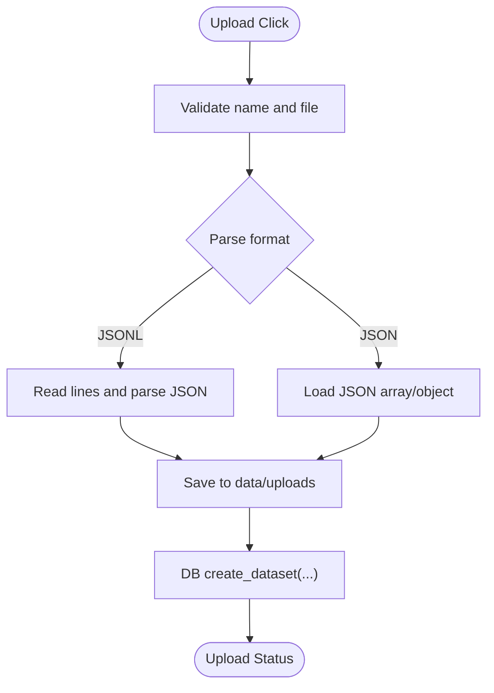
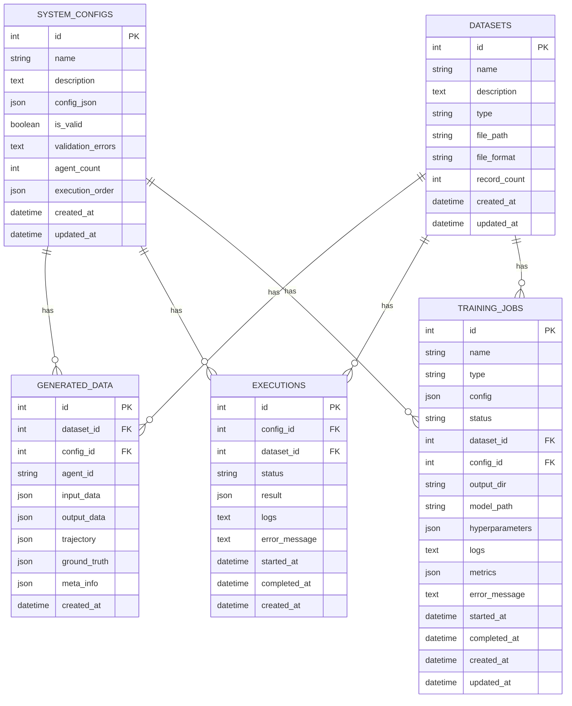
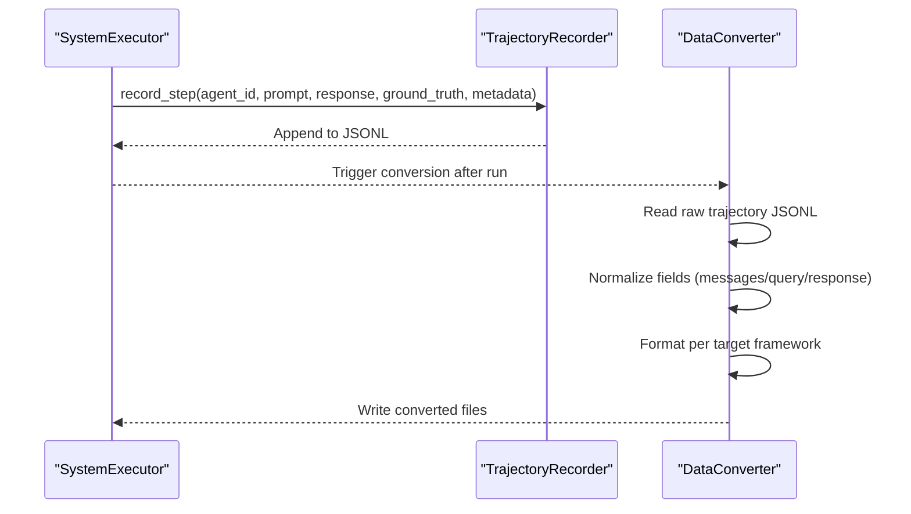
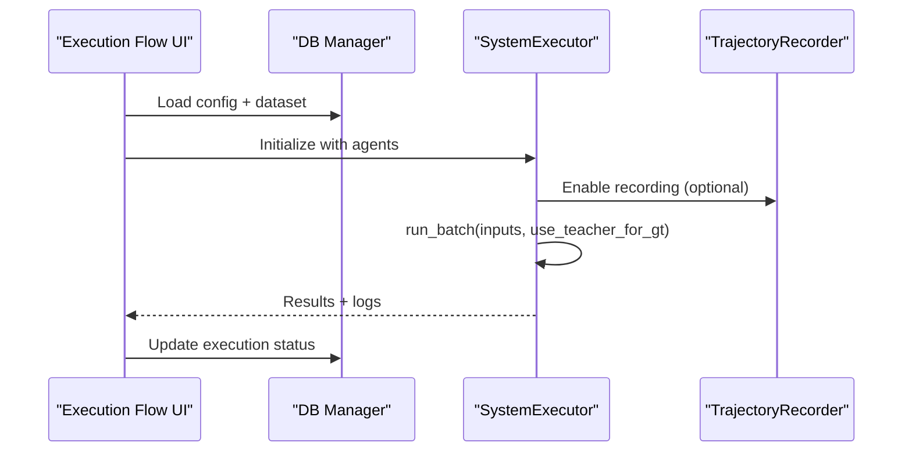
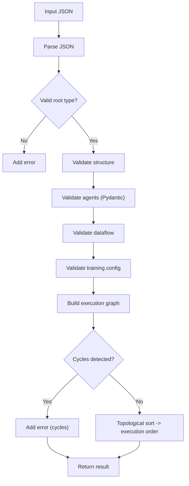
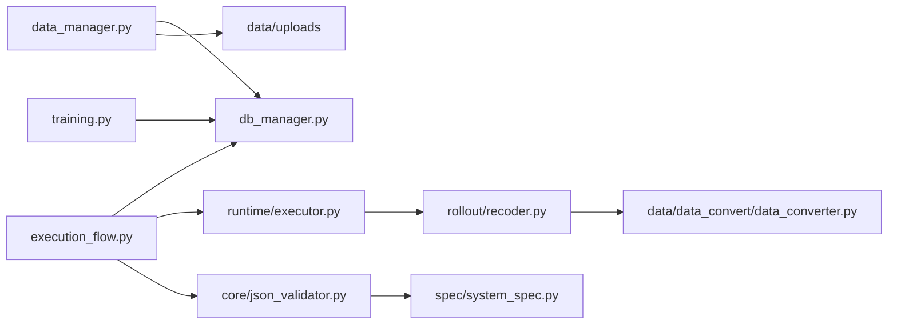

# Data Management Interface

<cite>
**Referenced Files in This Document**
- [web/pages/data_manager.py](file://web/pages/data_manager.py)
- [database/db_manager.py](file://database/db_manager.py)
- [database/models.py](file://database/models.py)
- [data/data_convert/data_converter.py](file://data/data_convert/data_converter.py)
- [rollout/recoder.py](file://rollout/recoder.py)
- [web/pages/execution_flow.py](file://web/pages/execution_flow.py)
- [web/pages/training.py](file://web/pages/training.py)
- [core/json_validator.py](file://core/json_validator.py)
- [spec/system_spec.py](file://spec/system_spec.py)
- [web/app.py](file://web/app.py)
- [main_web.py](file://main_web.py)
- [test_outputs/first_json_grpo.json](file://test_outputs/first_json_grpo.json)
</cite>

## Table of Contents
1. [Introduction](#introduction)
2. [Project Structure](#project-structure)
3. [Core Components](#core-components)
4. [Architecture Overview](#architecture-overview)
5. [Detailed Component Analysis](#detailed-component-analysis)
6. [Dependency Analysis](#dependency-analysis)
7. [Performance Considerations](#performance-considerations)
8. [Troubleshooting Guide](#troubleshooting-guide)
9. [Conclusion](#conclusion)
10. [Appendices](#appendices)

## Introduction
This document describes the data management interface and its integrated data lifecycle within the multi-agent system builder. It covers dataset upload, validation, storage, preview, filtering, export, and how generated trajectories connect to training. It also documents supported data formats, validation workflows, preprocessing and transformation utilities, and operational guidance for quality assurance and troubleshooting.

## Project Structure
The data management interface is implemented as part of the web application, backed by a local SQLite database and a set of conversion utilities. The key areas are:
- Web UI pages for data management, execution flow, and training
- Database manager and ORM models for persistence
- Data conversion utilities for transforming raw trajectories into training-ready formats
- Runtime recorder for assembling and converting trajectory data
- JSON configuration validator and system specification models

**Diagram sources**
- [web/pages/data_manager.py:1-310](file://web/pages/data_manager.py#L1-L310)
- [web/pages/execution_flow.py:1-275](file://web/pages/execution_flow.py#L1-L275)
- [web/pages/training.py:1-553](file://web/pages/training.py#L1-L553)
- [web/app.py:1-173](file://web/app.py#L1-L173)
- [database/db_manager.py:1-347](file://database/db_manager.py#L1-L347)
- [database/models.py:1-123](file://database/models.py#L1-L123)
- [rollout/recoder.py:1-122](file://rollout/recoder.py#L1-L122)
- [data/data_convert/data_converter.py:1-99](file://data/data_convert/data_converter.py#L1-L99)
- [core/json_validator.py:1-347](file://core/json_validator.py#L1-L347)
- [spec/system_spec.py:1-114](file://spec/system_spec.py#L1-L114)

**Section sources**
- [web/pages/data_manager.py:1-310](file://web/pages/data_manager.py#L1-L310)
- [web/app.py:1-173](file://web/app.py#L1-L173)
- [database/db_manager.py:1-347](file://database/db_manager.py#L1-L347)
- [database/models.py:1-123](file://database/models.py#L1-L123)
- [rollout/recoder.py:1-122](file://rollout/recoder.py#L1-L122)
- [data/data_convert/data_converter.py:1-99](file://data/data_convert/data_converter.py#L1-L99)
- [core/json_validator.py:1-347](file://core/json_validator.py#L1-L347)
- [spec/system_spec.py:1-114](file://spec/system_spec.py#L1-L114)

## Core Components
- Data Manager Page: Provides upload, preview, deletion, and export workflows for datasets; integrates with the database manager for listing and managing datasets.
- Database Manager and Models: Persist datasets, generated trajectories, system configurations, executions, and training jobs; expose CRUD APIs for the UI.
- Trajectory Recorder: Assembles step-wise trajectories into training-friendly formats and supports conversion to framework-specific formats.
- Data Converter: Converts raw trajectory records into multiple training formats (e.g., SWIFT SFT, DPO, GRPO).
- Execution Flow Page: Loads datasets and system configurations, executes the multi-agent pipeline, and records trajectories for downstream training.
- Training Page: Manages training jobs for SFT, DPO, and GRPO, integrating with the database and generating runnable scripts.
- JSON Validator and System Spec: Validates configuration JSON and constructs typed specs for execution and training.

**Section sources**
- [web/pages/data_manager.py:1-310](file://web/pages/data_manager.py#L1-L310)
- [database/db_manager.py:1-347](file://database/db_manager.py#L1-L347)
- [database/models.py:1-123](file://database/models.py#L1-L123)
- [rollout/recoder.py:1-122](file://rollout/recoder.py#L1-L122)
- [data/data_convert/data_converter.py:1-99](file://data/data_convert/data_converter.py#L1-L99)
- [web/pages/execution_flow.py:1-275](file://web/pages/execution_flow.py#L1-L275)
- [web/pages/training.py:1-553](file://web/pages/training.py#L1-L553)
- [core/json_validator.py:1-347](file://core/json_validator.py#L1-L347)
- [spec/system_spec.py:1-114](file://spec/system_spec.py#L1-L114)

## Architecture Overview
The data management interface orchestrates the flow from dataset upload to training preparation. The UI interacts with the database manager to persist datasets and system configurations. During execution, the runtime captures trajectories via the recorder and stores them for later conversion. The conversion utilities transform these trajectories into training-ready formats. The training page manages training jobs and generates runnable scripts.

**Diagram sources**
- [web/pages/data_manager.py:135-179](file://web/pages/data_manager.py#L135-L179)
- [database/db_manager.py:37-56](file://database/db_manager.py#L37-L56)
- [web/pages/execution_flow.py:116-223](file://web/pages/execution_flow.py#L116-L223)
- [rollout/recoder.py:15-42](file://rollout/recoder.py#L15-L42)
- [data/data_convert/data_converter.py:10-82](file://data/data_convert/data_converter.py#L10-L82)
- [web/pages/training.py:254-338](file://web/pages/training.py#L254-L338)

## Detailed Component Analysis

### Data Manager Page
- Upload new dataset: Accepts JSON or JSONL files, parses content, saves to a dedicated uploads directory, and persists metadata via the database manager.
- Dataset listing: Displays datasets with type, format, record count, and timestamps.
- Delete dataset: Removes dataset records and associated files.
- Preview dataset: Reads up to a small number of records for quick inspection.
- Filter generated data: Lists generated trajectories filtered by system configuration or dataset.
- Export training data: Generates export files for selected formats (e.g., SFT ms-swift, DPO, GRPO, Raw JSON).

**Diagram sources**
- [web/pages/data_manager.py:135-179](file://web/pages/data_manager.py#L135-L179)

**Section sources**
- [web/pages/data_manager.py:17-133](file://web/pages/data_manager.py#L17-L133)
- [web/pages/data_manager.py:135-179](file://web/pages/data_manager.py#L135-L179)
- [web/pages/data_manager.py:180-203](file://web/pages/data_manager.py#L180-L203)
- [web/pages/data_manager.py:204-228](file://web/pages/data_manager.py#L204-L228)
- [web/pages/data_manager.py:230-247](file://web/pages/data_manager.py#L230-L247)
- [web/pages/data_manager.py:253-264](file://web/pages/data_manager.py#L253-L264)

### Database Manager and Models
- Dataset model: Stores dataset metadata (name, type, file path, format, record count).
- GeneratedData model: Stores trajectories and intermediate results linked to datasets and system configurations.
- SystemConfig model: Stores validated JSON configurations with validation status and execution order.
- Execution model: Tracks execution runs with status and logs.
- TrainingJob model: Tracks training tasks with status, hyperparameters, and outputs.

**Diagram sources**
- [database/models.py:10-123](file://database/models.py#L10-L123)

**Section sources**
- [database/db_manager.py:37-88](file://database/db_manager.py#L37-L88)
- [database/db_manager.py:110-155](file://database/db_manager.py#L110-L155)
- [database/db_manager.py:159-201](file://database/db_manager.py#L159-L201)
- [database/db_manager.py:205-263](file://database/db_manager.py#L205-L263)
- [database/db_manager.py:267-346](file://database/db_manager.py#L267-L346)
- [database/models.py:10-123](file://database/models.py#L10-L123)

### Trajectory Recorder and Data Conversion
- Trajectory Recorder: Records step-wise prompts/responses with optional ground truth and metadata; supports assembling SFT datasets and converting to SWIFT-compatible formats.
- Data Converter: Converts raw trajectory records into multiple training formats (SWIFT SFT, SWIFT DPO, VERL GRPO) and writes them to the rollouts directory.

**Diagram sources**
- [rollout/recoder.py:15-42](file://rollout/recoder.py#L15-L42)
- [rollout/recoder.py:44-96](file://rollout/recoder.py#L44-L96)
- [rollout/recoder.py:98-122](file://rollout/recoder.py#L98-L122)
- [data/data_convert/data_converter.py:10-82](file://data/data_convert/data_converter.py#L10-L82)

**Section sources**
- [rollout/recoder.py:1-122](file://rollout/recoder.py#L1-L122)
- [data/data_convert/data_converter.py:1-99](file://data/data_convert/data_converter.py#L1-L99)

### Execution Flow and Training Integration
- Execution Flow Page: Loads system configuration and optional dataset, initializes the executor, runs the pipeline, and records trajectories when enabled.
- Training Page: Creates training jobs, updates statuses, and generates runnable scripts for SFT, DPO, and GRPO.

**Diagram sources**
- [web/pages/execution_flow.py:116-223](file://web/pages/execution_flow.py#L116-L223)
- [runtime/executor.py:16-132](file://runtime/executor.py#L16-L132)
- [rollout/recoder.py:15-42](file://rollout/recoder.py#L15-L42)

**Section sources**
- [web/pages/execution_flow.py:1-275](file://web/pages/execution_flow.py#L1-L275)
- [runtime/executor.py:1-132](file://runtime/executor.py#L1-L132)
- [web/pages/training.py:1-553](file://web/pages/training.py#L1-L553)

### JSON Validation and System Specification
- JSON Validator: Parses and validates configuration JSON, checks structural requirements, ensures unique agent IDs, validates dataflow connections, training modes, and detects cyclic dependencies; builds an execution graph and reports execution order.
- System Spec: Defines typed models for agents, IO mappings, training configuration, and system-level configuration.

**Diagram sources**
- [core/json_validator.py:43-82](file://core/json_validator.py#L43-L82)
- [core/json_validator.py:124-180](file://core/json_validator.py#L124-L180)
- [core/json_validator.py:181-267](file://core/json_validator.py#L181-L267)
- [spec/system_spec.py:77-97](file://spec/system_spec.py#L77-L97)

**Section sources**
- [core/json_validator.py:1-347](file://core/json_validator.py#L1-L347)
- [spec/system_spec.py:1-114](file://spec/system_spec.py#L1-L114)

## Dependency Analysis
- The Data Manager Page depends on the Database Manager for CRUD operations and on the filesystem for saving uploaded files.
- The Execution Flow Page depends on the Database Manager to load datasets and configurations, on the System Executor to run the pipeline, and optionally on the Trajectory Recorder to capture steps.
- The Training Page depends on the Database Manager to track training jobs and on trainers to generate runnable scripts.
- The Data Converter depends on the raw trajectory files produced by the recorder and writes converted files to the rollouts directory.
- The JSON Validator depends on the System Spec models and NetworkX to detect cycles and compute execution order.

**Diagram sources**
- [web/pages/data_manager.py:1-310](file://web/pages/data_manager.py#L1-L310)
- [database/db_manager.py:1-347](file://database/db_manager.py#L1-L347)
- [web/pages/execution_flow.py:1-275](file://web/pages/execution_flow.py#L1-L275)
- [runtime/executor.py:1-132](file://runtime/executor.py#L1-L132)
- [rollout/recoder.py:1-122](file://rollout/recoder.py#L1-L122)
- [data/data_convert/data_converter.py:1-99](file://data/data_convert/data_converter.py#L1-L99)
- [core/json_validator.py:1-347](file://core/json_validator.py#L1-L347)
- [spec/system_spec.py:1-114](file://spec/system_spec.py#L1-L114)
- [web/pages/training.py:1-553](file://web/pages/training.py#L1-L553)

**Section sources**
- [web/pages/data_manager.py:1-310](file://web/pages/data_manager.py#L1-L310)
- [database/db_manager.py:1-347](file://database/db_manager.py#L1-L347)
- [web/pages/execution_flow.py:1-275](file://web/pages/execution_flow.py#L1-L275)
- [runtime/executor.py:1-132](file://runtime/executor.py#L1-L132)
- [rollout/recoder.py:1-122](file://rollout/recoder.py#L1-L122)
- [data/data_convert/data_converter.py:1-99](file://data/data_convert/data_converter.py#L1-L99)
- [core/json_validator.py:1-347](file://core/json_validator.py#L1-L347)
- [spec/system_spec.py:1-114](file://spec/system_spec.py#L1-L114)
- [web/pages/training.py:1-553](file://web/pages/training.py#L1-L553)

## Performance Considerations
- Upload throughput: For large JSONL files, streaming parsing is used to avoid loading entire files into memory; consider batching writes to disk.
- Preview limits: The preview reads only a small subset of records to keep UI responsive.
- Conversion scaling: Conversion utilities process line-by-line; ensure sufficient disk space in the rollouts directory.
- Database queries: Ordering by creation time and limiting results helps maintain responsiveness in lists.
- Execution memory: Trajectory recording appends to a single JSONL file; for very large runs, consider rotating files or external storage.

[No sources needed since this section provides general guidance]

## Troubleshooting Guide
Common issues and resolutions:
- Upload failures: Verify the file type is JSON or JSONL and that the dataset name is provided. Check filesystem permissions for the uploads directory.
- Preview errors: Ensure the dataset exists and the file format matches the stored metadata; the preview reads only a limited number of lines.
- Deletion issues: Confirm the dataset ID exists; the operation returns a clear status message.
- Execution errors: Validate the system configuration using the JSON validator; ensure agent IDs are unique and there are no cyclic dependencies.
- Training job creation: Ensure a valid system configuration is selected and required hyperparameters are set; the training page creates a job record and generates a runnable script.

**Section sources**
- [web/pages/data_manager.py:135-179](file://web/pages/data_manager.py#L135-L179)
- [web/pages/data_manager.py:204-228](file://web/pages/data_manager.py#L204-L228)
- [web/pages/data_manager.py:194-202](file://web/pages/data_manager.py#L194-L202)
- [core/json_validator.py:256-267](file://core/json_validator.py#L256-L267)
- [web/pages/training.py:254-338](file://web/pages/training.py#L254-L338)

## Conclusion
The data management interface provides a cohesive workflow for uploading, validating, organizing, and exporting datasets, capturing execution trajectories, and preparing training data. The integration with the database, runtime recorder, and conversion utilities enables a smooth path from data ingestion to model training. Adhering to the validation and quality assurance practices outlined here will improve reliability and reproducibility.

[No sources needed since this section summarizes without analyzing specific files]

## Appendices

### Supported Data Formats and Upload Procedures
- Supported formats: JSON and JSONL.
- Upload procedure:
  - Provide dataset name and select a JSON or JSONL file.
  - The system saves the file under the uploads directory and records metadata in the database.
- Validation workflow:
  - Use the JSON validator to check configuration JSON for structural correctness, unique agent IDs, dataflow integrity, training mode validity, and absence of cycles.
- Example formats:
  - Sample trajectory format for GRPO is available in the test outputs.

**Section sources**
- [web/pages/data_manager.py:36-39](file://web/pages/data_manager.py#L36-L39)
- [web/pages/data_manager.py:135-179](file://web/pages/data_manager.py#L135-L179)
- [core/json_validator.py:43-82](file://core/json_validator.py#L43-L82)
- [test_outputs/first_json_grpo.json:1-90](file://test_outputs/first_json_grpo.json#L1-L90)

### Data Lifecycle Management and Versioning
- Lifecycle stages:
  - Upload: Store file and metadata.
  - Preview: Inspect a subset of records.
  - Execution: Run the pipeline and optionally record trajectories.
  - Conversion: Transform trajectories into training formats.
  - Export: Prepare training-ready files.
- Versioning:
  - The system does not implement explicit dataset versioning; manage versions externally by filename conventions and dataset descriptions.

**Section sources**
- [web/pages/data_manager.py:17-133](file://web/pages/data_manager.py#L17-L133)
- [web/pages/execution_flow.py:116-223](file://web/pages/execution_flow.py#L116-L223)
- [rollout/recoder.py:44-122](file://rollout/recoder.py#L44-L122)
- [data/data_convert/data_converter.py:10-82](file://data/data_convert/data_converter.py#L10-L82)

### Sharing Mechanisms
- Share datasets by distributing the saved file path recorded in the database and ensuring recipients have access to the uploads directory.
- Share training outputs by distributing the generated runnable scripts and output directories.

**Section sources**
- [database/db_manager.py:37-56](file://database/db_manager.py#L37-L56)
- [web/pages/training.py:310-335](file://web/pages/training.py#L310-L335)

### Data Preprocessing, Cleaning, and Transformation Pipelines
- Preprocessing:
  - Upload JSON/JSONL; the system parses and stores records.
- Cleaning:
  - The JSON validator enforces structural integrity and detects invalid configurations; address reported errors before execution.
- Transformation:
  - Use the trajectory recorder to assemble SFT datasets and convert to framework-specific formats via the data converter.

**Section sources**
- [web/pages/data_manager.py:135-179](file://web/pages/data_manager.py#L135-L179)
- [core/json_validator.py:124-180](file://core/json_validator.py#L124-L180)
- [rollout/recoder.py:44-122](file://rollout/recoder.py#L44-L122)
- [data/data_convert/data_converter.py:10-82](file://data/data_convert/data_converter.py#L10-L82)

### Relationship Between Uploaded Data and Training/Extraction Processes
- Execution flow:
  - The execution page loads a dataset and system configuration, runs the pipeline, and records trajectories for training.
- Training:
  - The training page creates training jobs, prepares runnable scripts, and tracks job status and outputs.

**Section sources**
- [web/pages/execution_flow.py:116-223](file://web/pages/execution_flow.py#L116-L223)
- [web/pages/training.py:254-338](file://web/pages/training.py#L254-L338)