# Execution Flow Visualization

<cite>
**Referenced Files in This Document**
- [execution_flow.py](file://web/pages/execution_flow.py)
- [agent_runner.py](file://runtime/agent_runner.py)
- [executor.py](file://runtime/executor.py)
- [state.py](file://runtime/state.py)
- [dataflow_graph.py](file://spec/dataflow_graph.py)
- [system_spec.py](file://spec/system_spec.py)
- [trajectory_generator.py](file://core/trajectory_generator.py)
- [recoder.py](file://rollout/recoder.py)
- [db_manager.py](file://database/db_manager.py)
- [models.py](file://database/models.py)
- [json_validator.py](file://core/json_validator.py)
- [app.py](file://web/app.py)
</cite>

## Table of Contents
1. [Introduction](#introduction)
2. [Project Structure](#project-structure)
3. [Core Components](#core-components)
4. [Architecture Overview](#architecture-overview)
5. [Detailed Component Analysis](#detailed-component-analysis)
6. [Dependency Analysis](#dependency-analysis)
7. [Performance Considerations](#performance-considerations)
8. [Troubleshooting Guide](#troubleshooting-guide)
9. [Conclusion](#conclusion)
10. [Appendices](#appendices)

## Introduction
This document provides a comprehensive guide to the execution flow visualization interface, focusing on real-time execution monitoring, agent interaction graphs, and workflow tracking. It explains data flow visualization, execution status indicators, progress tracking mechanisms, execution timeline display, agent state visualization, and dependency relationship mapping. The document includes examples of execution flow charts, status indicators, and interactive debugging features, along with performance monitoring, bottleneck identification, and optimization recommendations. Guidance is provided on interpreting execution graphs, troubleshooting failed executions, and optimizing agent interactions.

## Project Structure
The execution flow visualization spans several modules:
- Web interface: Gradio-based pages for user interaction and visualization
- Runtime engine: Agent execution pipeline with two-phase processing
- Specification: System configuration and data flow validation
- Data recording: Trajectory and training data generation
- Database: Persistent storage for configurations, datasets, executions, and training jobs
- Core utilities: Validation and trajectory generation

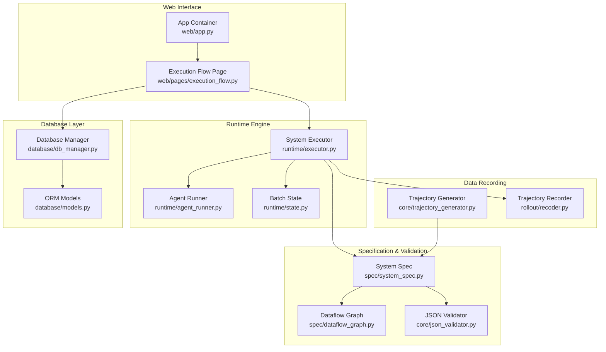

**Diagram sources**
- [execution_flow.py:1-275](file://web/pages/execution_flow.py#L1-L275)
- [app.py:1-173](file://web/app.py#L1-L173)
- [executor.py:1-132](file://runtime/executor.py#L1-L132)
- [agent_runner.py:1-68](file://runtime/agent_runner.py#L1-L68)
- [state.py:1-8](file://runtime/state.py#L1-L8)
- [system_spec.py:1-114](file://spec/system_spec.py#L1-L114)
- [dataflow_graph.py:1-32](file://spec/dataflow_graph.py#L1-L32)
- [json_validator.py:1-347](file://core/json_validator.py#L1-L347)
- [trajectory_generator.py:1-354](file://core/trajectory_generator.py#L1-L354)
- [recoder.py:1-122](file://rollout/recoder.py#L1-L122)
- [db_manager.py:1-347](file://database/db_manager.py#L1-L347)
- [models.py:1-123](file://database/models.py#L1-L123)

**Section sources**
- [execution_flow.py:1-275](file://web/pages/execution_flow.py#L1-L275)
- [app.py:1-173](file://web/app.py#L1-L173)

## Core Components
- Execution Flow Page: Provides configuration selection, execution controls, real-time status updates, progress tracking, logs, results, trajectory visualization, and execution flow charts.
- System Executor: Implements a two-phase execution pipeline (Phase 1: Teacher model generates Ground Truth; Phase 2: Student model executes and records trajectories).
- Agent Runner: Manages model selection (student vs teacher), prompt rendering, and response generation.
- Trajectory Recorder: Records step-by-step execution data for training and debugging.
- Database Manager: Persists configurations, datasets, executions, and training jobs with timestamps and status.
- JSON Validator: Validates configuration structure, dataflow dependencies, and detects circular dependencies.
- Trajectory Generator: Generates simulated or real trajectories for visualization and export.

**Section sources**
- [execution_flow.py:9-275](file://web/pages/execution_flow.py#L9-L275)
- [executor.py:9-132](file://runtime/executor.py#L9-L132)
- [agent_runner.py:10-68](file://runtime/agent_runner.py#L10-L68)
- [recoder.py:8-122](file://rollout/recoder.py#L8-L122)
- [db_manager.py:11-347](file://database/db_manager.py#L11-L347)
- [json_validator.py:37-347](file://core/json_validator.py#L37-L347)
- [trajectory_generator.py:58-354](file://core/trajectory_generator.py#L58-L354)

## Architecture Overview
The execution flow visualization integrates user interface, runtime execution, validation, and persistence layers. The flow begins with configuration selection and dataset choice, proceeds through a two-phase execution pipeline, and concludes with trajectory recording and visualization.

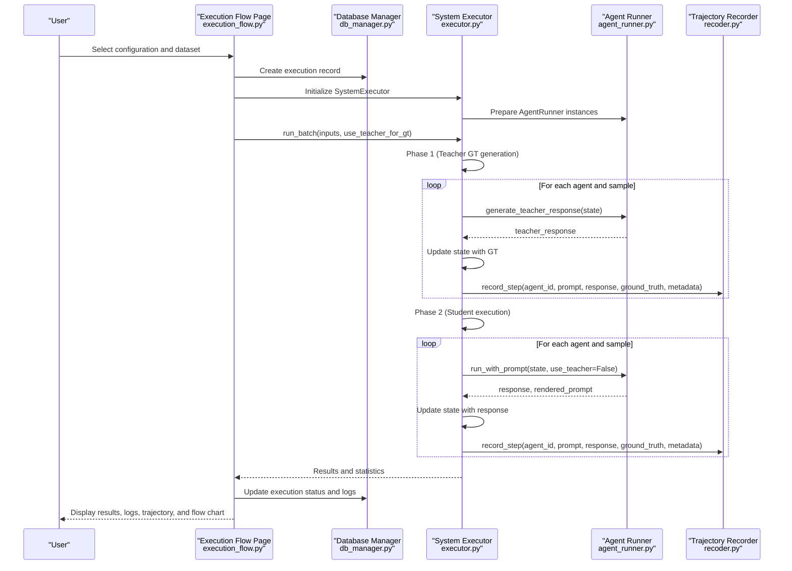

**Diagram sources**
- [execution_flow.py:116-224](file://web/pages/execution_flow.py#L116-L224)
- [executor.py:16-132](file://runtime/executor.py#L16-L132)
- [agent_runner.py:33-68](file://runtime/agent_runner.py#L33-L68)
- [recoder.py:15-42](file://rollout/recoder.py#L15-L42)
- [db_manager.py:205-244](file://database/db_manager.py#L205-L244)

## Detailed Component Analysis

### Execution Flow Page
The execution flow page orchestrates the entire workflow:
- Configuration and dataset selection with validation feedback
- Execution controls (start, stop)
- Real-time status updates and progress tracking
- Execution logs and results display
- Trajectory visualization and step details
- Execution flow chart generation

Key UI elements:
- Configuration dropdown with validity indicators
- Dataset selection
- Execution options (teacher model usage, trajectory recording)
- Status indicator and progress slider
- Logs textbox
- Results tabs: Final output, Statistics, Trajectory, Visualization
- Flow chart rendering

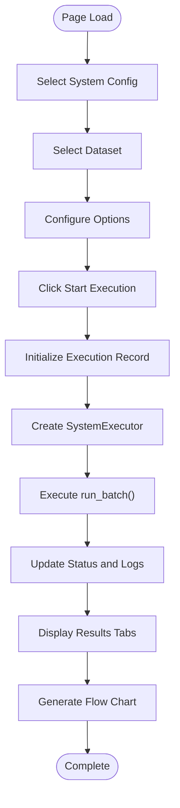

**Diagram sources**
- [execution_flow.py:116-224](file://web/pages/execution_flow.py#L116-L224)
- [execution_flow.py:225-248](file://web/pages/execution_flow.py#L225-L248)

**Section sources**
- [execution_flow.py:9-275](file://web/pages/execution_flow.py#L9-L275)

### System Executor
The System Executor implements a two-phase execution pipeline:
- Phase 1: Teacher model generates Ground Truth for agents that require it
- Phase 2: Student model executes agents and records trajectories

Execution order is derived from the system specification and validated by the JSON validator.

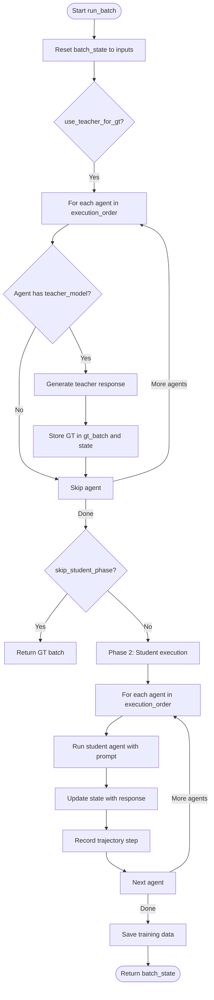

**Diagram sources**
- [executor.py:16-132](file://runtime/executor.py#L16-L132)

**Section sources**
- [executor.py:9-132](file://runtime/executor.py#L9-L132)

### Agent Runner
Agent Runner manages model selection and prompt rendering:
- Initializes student and teacher LLM instances based on agent configuration
- Renders prompts using Jinja2 templates
- Executes either teacher or student model based on configuration
- Returns response and rendered prompt for recording

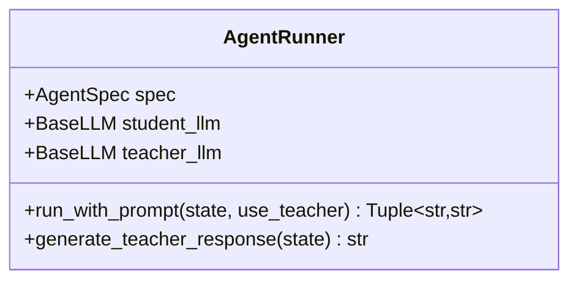

**Diagram sources**
- [agent_runner.py:10-68](file://runtime/agent_runner.py#L10-L68)

**Section sources**
- [agent_runner.py:10-68](file://runtime/agent_runner.py#L10-L68)

### Trajectory Recorder
The Trajectory Recorder persists execution steps for training and debugging:
- Records prompt, response, ground truth, and metadata
- Supports conversion to SFT and SWIFT formats
- Assembles SFT datasets by sample_id

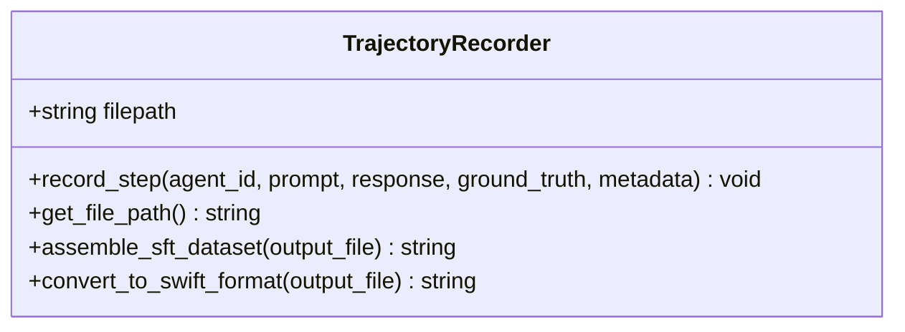

**Diagram sources**
- [recoder.py:8-122](file://rollout/recoder.py#L8-L122)

**Section sources**
- [recoder.py:8-122](file://rollout/recoder.py#L8-L122)

### Database Management
The Database Manager handles persistent storage for configurations, datasets, executions, and training jobs:
- CRUD operations for datasets and system configurations
- Execution lifecycle management (pending, running, completed, failed)
- Training job lifecycle management

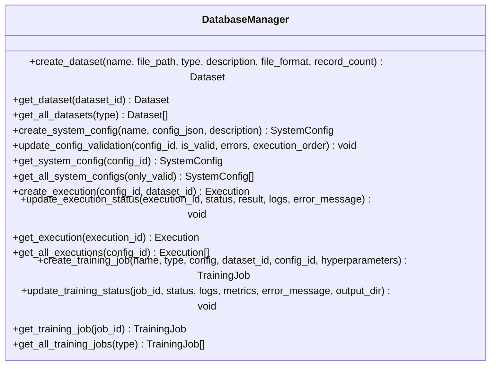

**Diagram sources**
- [db_manager.py:11-347](file://database/db_manager.py#L11-L347)
- [models.py:10-123](file://database/models.py#L10-L123)

**Section sources**
- [db_manager.py:11-347](file://database/db_manager.py#L11-L347)
- [models.py:10-123](file://database/models.py#L10-L123)

### JSON Validator and Dataflow Graph
The JSON Validator ensures configuration correctness and computes execution order:
- Parses and validates JSON structure
- Validates agent specifications using Pydantic
- Checks dataflow connections and training configurations
- Builds execution graph and detects circular dependencies
- Provides execution order for runtime

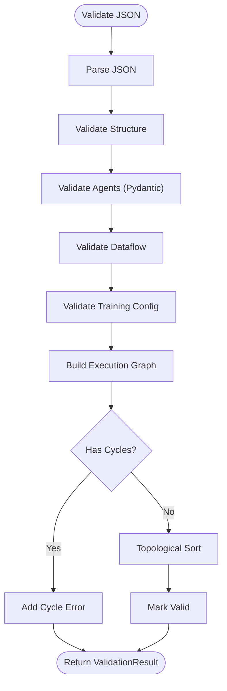

**Diagram sources**
- [json_validator.py:43-82](file://core/json_validator.py#L43-L82)
- [json_validator.py:242-266](file://core/json_validator.py#L242-L266)

**Section sources**
- [json_validator.py:37-347](file://core/json_validator.py#L37-L347)
- [dataflow_graph.py:6-32](file://spec/dataflow_graph.py#L6-L32)

### Trajectory Generation
The Trajectory Generator creates simulated or real trajectories for visualization and export:
- Generates trajectories per agent execution order
- Renders prompts and collects outputs
- Exports to SFT, DPO, and GRPO formats
- Computes statistics for analysis

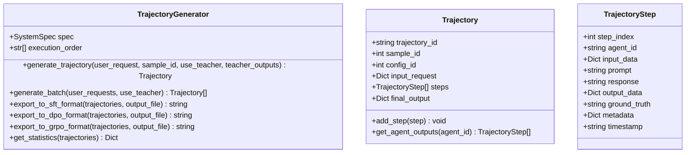

**Diagram sources**
- [trajectory_generator.py:58-354](file://core/trajectory_generator.py#L58-L354)

**Section sources**
- [trajectory_generator.py:58-354](file://core/trajectory_generator.py#L58-L354)

## Dependency Analysis
The execution flow visualization depends on:
- Web interface components for user interaction and visualization
- Runtime components for execution and data recording
- Specification components for configuration validation and execution order
- Database components for persistence and status tracking
- Core utilities for validation and trajectory generation

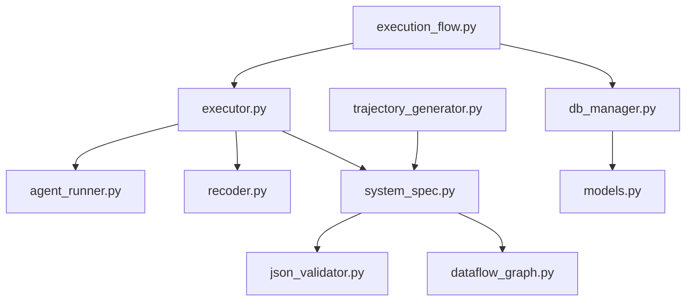

**Diagram sources**
- [execution_flow.py:1-275](file://web/pages/execution_flow.py#L1-L275)
- [executor.py:1-132](file://runtime/executor.py#L1-L132)
- [agent_runner.py:1-68](file://runtime/agent_runner.py#L1-L68)
- [recoder.py:1-122](file://rollout/recoder.py#L1-L122)
- [system_spec.py:1-114](file://spec/system_spec.py#L1-L114)
- [json_validator.py:1-347](file://core/json_validator.py#L1-L347)
- [dataflow_graph.py:1-32](file://spec/dataflow_graph.py#L1-L32)
- [trajectory_generator.py:1-354](file://core/trajectory_generator.py#L1-L354)
- [db_manager.py:1-347](file://database/db_manager.py#L1-L347)
- [models.py:1-123](file://database/models.py#L1-L123)

**Section sources**
- [execution_flow.py:1-275](file://web/pages/execution_flow.py#L1-L275)
- [executor.py:1-132](file://runtime/executor.py#L1-L132)
- [system_spec.py:1-114](file://spec/system_spec.py#L1-L114)
- [json_validator.py:1-347](file://core/json_validator.py#L1-L347)

## Performance Considerations
- Two-phase execution overhead: Teacher phase generates ground truth for agents requiring it, while student phase executes agents and records trajectories. This separation improves training data quality but increases total execution time.
- Model provider selection: Student and teacher models are selected based on agent configuration. Provider differences (e.g., Qwen vs OpenAI) impact latency and throughput.
- Batch processing: The executor processes inputs as a batch, resetting state between phases to ensure clean execution and accurate trajectory recording.
- Trajectory recording: Recording steps adds I/O overhead. Consider batching writes and using asynchronous logging for large-scale runs.
- Database operations: Frequent updates to execution status and logs can impact performance. Batch updates and indexing on frequently queried fields can help.
- Visualization generation: Flow chart generation is lightweight but can be improved by caching computed execution orders and avoiding repeated computations.

[No sources needed since this section provides general guidance]

## Troubleshooting Guide
Common issues and resolutions:
- Configuration validation failures: The JSON validator detects structural errors, invalid agent IDs, missing fields, and circular dependencies. Review the validation errors and warnings reported during configuration validation.
- Execution failures: The execution flow page catches exceptions and displays error messages. Check the execution logs for stack traces and error details.
- Missing teacher model: Some agents may not have a teacher model configured. The executor skips GT generation for these agents and proceeds with student execution.
- Dataflow inconsistencies: Ensure that agent input keys match output keys from upstream agents. The validator checks for invalid references and reports them.
- Database connectivity: Verify that the SQLite database path is writable and accessible. The database manager initializes the database on startup.

**Section sources**
- [json_validator.py:37-347](file://core/json_validator.py#L37-L347)
- [execution_flow.py:221-224](file://web/pages/execution_flow.py#L221-L224)
- [executor.py:64-67](file://runtime/executor.py#L64-L67)
- [db_manager.py:14-26](file://database/db_manager.py#L14-L26)

## Conclusion
The execution flow visualization interface provides a comprehensive view of multi-agent system execution, combining real-time monitoring, agent interaction graphs, and workflow tracking. The two-phase execution pipeline ensures high-quality training data while maintaining transparency through trajectory recording and visualization. The integrated validation and persistence layers support robust configuration management and execution lifecycle tracking. By leveraging the provided components and following the troubleshooting and optimization guidance, users can effectively interpret execution graphs, debug failed executions, and optimize agent interactions.

[No sources needed since this section summarizes without analyzing specific files]

## Appendices

### Execution Timeline Display
The execution timeline can be represented as a sequence of steps:
- Initialization: Create execution record and initialize SystemExecutor
- Phase 1: Teacher model generates Ground Truth for agents with teacher models
- Phase 2: Student model executes agents and records trajectories
- Completion: Update execution status and display results

```mermaid
gantt
title Execution Timeline
dateFormat X
axisFormat %H:%M:%S
section Initialization
Create Execution Record :milestone, 0, 0
Initialize SystemExecutor :milestone, 0, 0
section Phase 1
Teacher GT Generation :0, 10
section Phase 2
Student Execution :10, 20
section Completion
Update Status :milestone, 20, 0
Display Results :milestone, 20, 0
```

[No sources needed since this diagram shows conceptual workflow, not actual code structure]

### Agent State Visualization
Agent state visualization tracks input and output data flow:
- Input data: Collected from previous agents or user input
- Output data: Generated by the current agent and passed to downstream agents
- Ground truth: Optional teacher-generated data for training

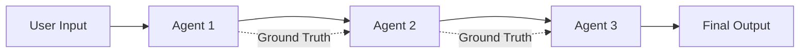

[No sources needed since this diagram shows conceptual workflow, not actual code structure]

### Dependency Relationship Mapping
Dependency relationships are validated and computed by the JSON validator:
- Input dependencies: Agents depend on outputs from upstream agents or user input
- Output targets: Outputs can target downstream agents or user output
- Circular dependencies: Detected and reported as errors

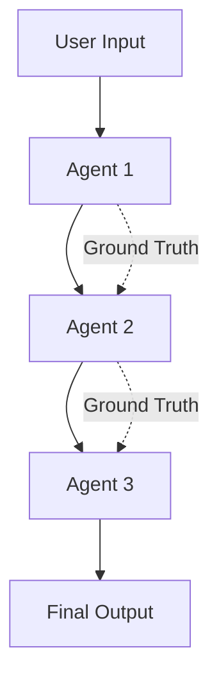

[No sources needed since this diagram shows conceptual workflow, not actual code structure]