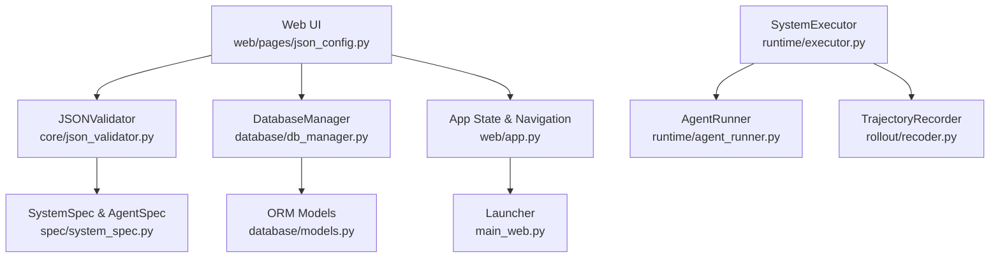
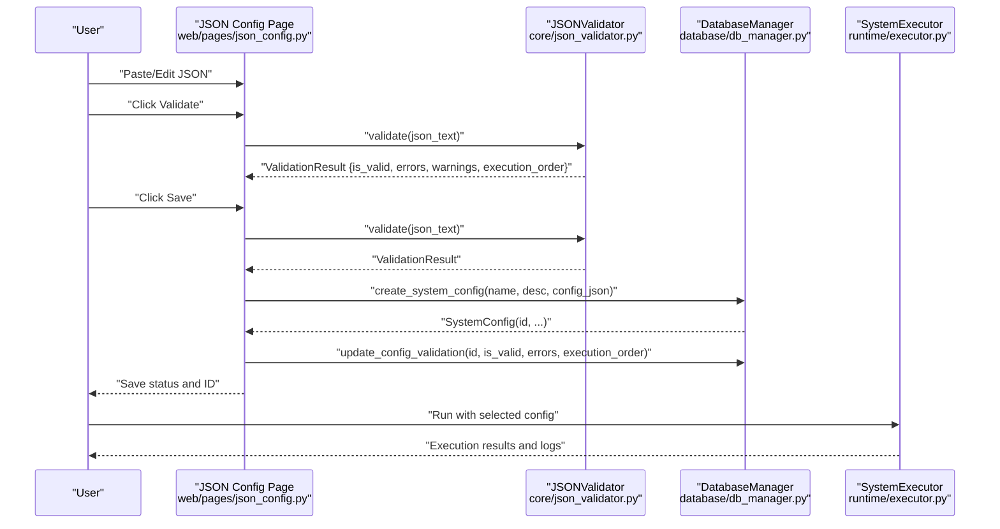
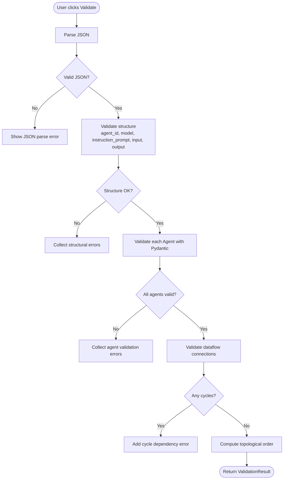
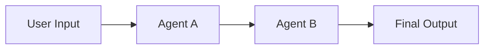
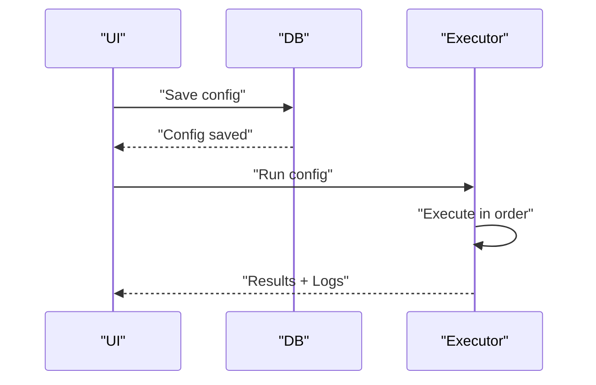
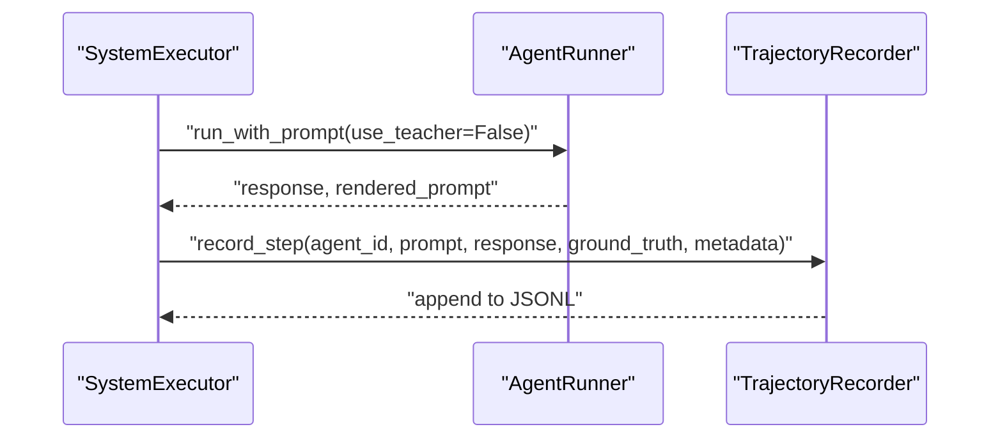
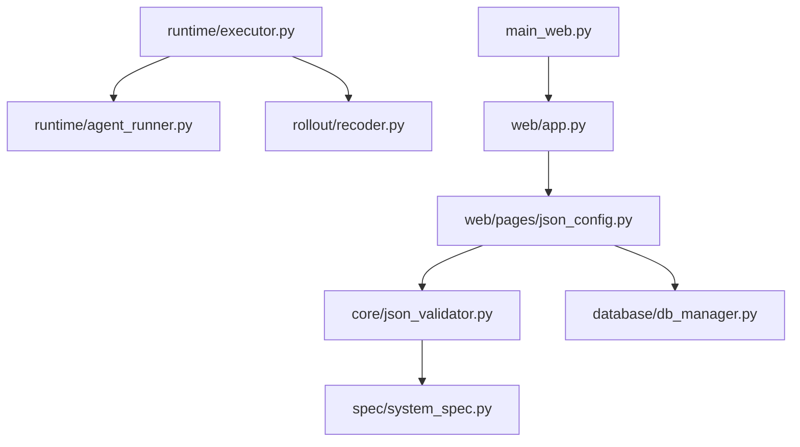

# JSON Configuration Management

<cite>
**Referenced Files in This Document**
- [web/pages/json_config.py](file://web/pages/json_config.py)
- [core/json_validator.py](file://core/json_validator.py)
- [spec/system_spec.py](file://spec/system_spec.py)
- [database/db_manager.py](file://database/db_manager.py)
- [database/models.py](file://database/models.py)
- [runtime/executor.py](file://runtime/executor.py)
- [runtime/agent_runner.py](file://runtime/agent_runner.py)
- [rollout/recoder.py](file://rollout/recoder.py)
- [web/app.py](file://web/app.py)
- [main_web.py](file://main_web.py)
- [configs/api_config.yaml](file://configs/api_config.yaml)
</cite>

## Table of Contents
1. [Introduction](#introduction)
2. [Project Structure](#project-structure)
3. [Core Components](#core-components)
4. [Architecture Overview](#architecture-overview)
5. [Detailed Component Analysis](#detailed-component-analysis)
6. [Dependency Analysis](#dependency-analysis)
7. [Performance Considerations](#performance-considerations)
8. [Troubleshooting Guide](#troubleshooting-guide)
9. [Conclusion](#conclusion)
10. [Appendices](#appendices)

## Introduction
This document describes the JSON configuration management interface for building multi-agent systems. It covers the upload and validation workflow, the validation feedback system, editing capabilities, JSON schema validation, error reporting, configuration preview, and the configuration lifecycle from upload to execution. It also documents execution order determination, dependency checking, training configuration validation, and practical guidance for versioning, backup, and restoration. Finally, it provides troubleshooting advice for common validation failures and configuration issues.

## Project Structure
The JSON configuration management feature spans several modules:
- Web UI: Provides the user interface for uploading, validating, saving, listing, viewing, deleting, and visualizing configurations.
- Validation: Centralized JSON validation and execution order computation.
- Schema: Strongly typed Pydantic models that define the JSON schema for agents and system-level configuration.
- Persistence: SQLite-backed storage for configurations, execution logs, and training jobs.
- Runtime: Executes validated configurations in a deterministic order and records trajectories for training.

**Diagram sources**
- [web/pages/json_config.py:1-377](file://web/pages/json_config.py#L1-L377)
- [core/json_validator.py:1-347](file://core/json_validator.py#L1-L347)
- [spec/system_spec.py:1-114](file://spec/system_spec.py#L1-L114)
- [database/db_manager.py:1-347](file://database/db_manager.py#L1-L347)
- [database/models.py:1-123](file://database/models.py#L1-L123)
- [runtime/executor.py:1-132](file://runtime/executor.py#L1-L132)
- [runtime/agent_runner.py:1-68](file://runtime/agent_runner.py#L1-L68)
- [rollout/recoder.py:1-122](file://rollout/recoder.py#L1-L122)
- [web/app.py:1-173](file://web/app.py#L1-L173)
- [main_web.py:1-158](file://main_web.py#L1-L158)

**Section sources**
- [web/pages/json_config.py:1-377](file://web/pages/json_config.py#L1-L377)
- [core/json_validator.py:1-347](file://core/json_validator.py#L1-L347)
- [spec/system_spec.py:1-114](file://spec/system_spec.py#L1-L114)
- [database/db_manager.py:1-347](file://database/db_manager.py#L1-L347)
- [database/models.py:1-123](file://database/models.py#L1-L123)
- [runtime/executor.py:1-132](file://runtime/executor.py#L1-L132)
- [runtime/agent_runner.py:1-68](file://runtime/agent_runner.py#L1-L68)
- [rollout/recoder.py:1-122](file://rollout/recoder.py#L1-L122)
- [web/app.py:1-173](file://web/app.py#L1-L173)
- [main_web.py:1-158](file://main_web.py#L1-L158)

## Core Components
- JSON configuration editor with syntax-highlighted JSON input and live validation feedback.
- Validation pipeline that parses JSON, validates structure and per-agent Pydantic models, checks dataflow dependencies, detects cycles, and computes execution order.
- Preview and visualization of dataflow graphs and execution order.
- Persistent storage of configurations, validation results, and execution metadata.
- Execution engine that runs agents in computed order and records trajectories for downstream training.

Key responsibilities:
- Upload and edit JSON configurations via the web UI.
- Validate JSON against a strict schema and report structured errors/warnings.
- Compute and display execution order and dataflow graph.
- Persist configurations and validation outcomes to the database.
- Execute configurations and produce training-ready trajectories.

**Section sources**
- [web/pages/json_config.py:8-377](file://web/pages/json_config.py#L8-L377)
- [core/json_validator.py:37-347](file://core/json_validator.py#L37-L347)
- [database/db_manager.py:90-156](file://database/db_manager.py#L90-L156)
- [runtime/executor.py:9-132](file://runtime/executor.py#L9-L132)

## Architecture Overview
The configuration lifecycle integrates UI, validation, persistence, and execution:

**Diagram sources**
- [web/pages/json_config.py:181-243](file://web/pages/json_config.py#L181-L243)
- [core/json_validator.py:43-82](file://core/json_validator.py#L43-L82)
- [database/db_manager.py:92-123](file://database/db_manager.py#L92-L123)
- [runtime/executor.py:16-132](file://runtime/executor.py#L16-L132)

## Detailed Component Analysis

### JSON Configuration Editor and Validation Feedback
- The editor provides a JSON code block for editing configurations and two primary actions:
  - Validate: Parses JSON, runs validation, and displays structured feedback (status, errors, warnings, execution order, and a dataflow graph).
  - Save: Validates again, persists the configuration, and updates validation metadata.
- Validation feedback includes:
  - Status indicator (valid/invalid).
  - Error list for critical issues.
  - Warning list for potential issues (e.g., ambiguous output keys).
  - Execution order string for quick review.
  - Dataflow graph suitable for visualization.

**Diagram sources**
- [web/pages/json_config.py:181-206](file://web/pages/json_config.py#L181-L206)
- [core/json_validator.py:43-82](file://core/json_validator.py#L43-L82)

**Section sources**
- [web/pages/json_config.py:18-121](file://web/pages/json_config.py#L18-L121)
- [core/json_validator.py:43-82](file://core/json_validator.py#L43-L82)

### JSON Schema Validation and Error Reporting
- Structural validation ensures each agent has required fields and unique agent identifiers.
- Per-agent validation leverages Pydantic models to enforce:
  - Model configuration (provider and model name).
  - Instruction prompt structure.
  - Input/output mappings with proper aliases.
  - Optional training configuration with supported modes and required fields.
- Dataflow validation checks:
  - Inputs referencing non-existent agents.
  - Outputs pointing to non-existent agents.
  - Ambiguous output keys across agents.
- Training configuration validation:
  - Supported training modes.
  - Required fields for SFT (ground truth).
- Execution order determination:
  - Builds a directed graph from input dependencies and performs topological sort.
  - Detects and reports cycles.

Common validation errors and resolutions:
- Missing required fields: Add the missing keys to each agent definition.
- Duplicate agent_id: Ensure each agent has a unique identifier.
- Unknown agent in input/output references: Fix agent names to match existing agent_ids.
- Unsupported training mode: Change mode to supported values.
- Missing ground_truth for SFT: Provide the required ground truth configuration.
- Cyclic dependencies: Reorder agents or restructure dataflow so dependencies form a DAG.

**Section sources**
- [core/json_validator.py:124-267](file://core/json_validator.py#L124-L267)
- [spec/system_spec.py:62-97](file://spec/system_spec.py#L62-L97)

### Configuration Preview and Visualization
- The validator generates a dataflow graph suitable for visualization:
  - Nodes represent agents and special nodes for user input and final output.
  - Edges represent data dependencies and labels indicate keys.
- The UI renders a Mermaid-based visualization and shows the computed execution order.

**Diagram sources**
- [core/json_validator.py:268-347](file://core/json_validator.py#L268-L347)
- [web/pages/json_config.py:285-341](file://web/pages/json_config.py#L285-L341)

**Section sources**
- [core/json_validator.py:268-347](file://core/json_validator.py#L268-L347)
- [web/pages/json_config.py:157-179](file://web/pages/json_config.py#L157-L179)

### Configuration Lifecycle: From Upload to Execution
- Upload and Edit:
  - Users paste or edit JSON in the code editor.
  - Validate immediately to catch errors early.
- Save:
  - On save, the system validates again, persists the configuration, and stores validation results and execution order.
- List and View:
  - The configuration list shows validity, agent count, and creation time.
  - Details view shows the stored JSON and metadata.
- Delete:
  - Removes a configuration by ID.
- Visualization:
  - Generates a Mermaid diagram and execution order for selected configurations.
- Execution:
  - The executor runs agents in the computed order, optionally generating ground truth with teacher models and collecting trajectories for training.

**Diagram sources**
- [web/pages/json_config.py:207-243](file://web/pages/json_config.py#L207-L243)
- [database/db_manager.py:92-123](file://database/db_manager.py#L92-L123)
- [runtime/executor.py:16-132](file://runtime/executor.py#L16-L132)

**Section sources**
- [web/pages/json_config.py:122-179](file://web/pages/json_config.py#L122-L179)
- [database/db_manager.py:90-156](file://database/db_manager.py#L90-L156)
- [runtime/executor.py:9-132](file://runtime/executor.py#L9-L132)

### Execution Engine and Trajectory Recording
- The executor runs agents in the computed execution order.
- Two-phase execution:
  - Phase 1: Generate ground truth using teacher models for agents with teacher configuration.
  - Phase 2: Student models execute, responses are recorded with optional ground truth and metadata.
- Trajectory recording produces JSONL files suitable for supervised fine-tuning and conversion utilities.

**Diagram sources**
- [runtime/executor.py:16-132](file://runtime/executor.py#L16-L132)
- [runtime/agent_runner.py:33-68](file://runtime/agent_runner.py#L33-L68)
- [rollout/recoder.py:15-43](file://rollout/recoder.py#L15-L43)

**Section sources**
- [runtime/executor.py:9-132](file://runtime/executor.py#L9-L132)
- [runtime/agent_runner.py:10-68](file://runtime/agent_runner.py#L10-L68)
- [rollout/recoder.py:8-122](file://rollout/recoder.py#L8-L122)

## Dependency Analysis
- UI depends on the validator and database manager for validation and persistence.
- Validator depends on Pydantic models for schema enforcement and NetworkX for graph computations.
- Database manager persists configurations, validation results, and execution/training metadata.
- Executor depends on agent runners and trajectory recorder for execution and logging.

**Diagram sources**
- [web/pages/json_config.py:1-377](file://web/pages/json_config.py#L1-L377)
- [core/json_validator.py:1-347](file://core/json_validator.py#L1-L347)
- [spec/system_spec.py:1-114](file://spec/system_spec.py#L1-L114)
- [database/db_manager.py:1-347](file://database/db_manager.py#L1-L347)
- [runtime/executor.py:1-132](file://runtime/executor.py#L1-L132)
- [runtime/agent_runner.py:1-68](file://runtime/agent_runner.py#L1-L68)
- [rollout/recoder.py:1-122](file://rollout/recoder.py#L1-L122)
- [web/app.py:1-173](file://web/app.py#L1-L173)
- [main_web.py:1-158](file://main_web.py#L1-L158)

**Section sources**
- [web/pages/json_config.py:1-377](file://web/pages/json_config.py#L1-L377)
- [core/json_validator.py:1-347](file://core/json_validator.py#L1-L347)
- [spec/system_spec.py:1-114](file://spec/system_spec.py#L1-L114)
- [database/db_manager.py:1-347](file://database/db_manager.py#L1-L347)
- [runtime/executor.py:1-132](file://runtime/executor.py#L1-L132)
- [runtime/agent_runner.py:1-68](file://runtime/agent_runner.py#L1-L68)
- [rollout/recoder.py:1-122](file://rollout/recoder.py#L1-L122)
- [web/app.py:1-173](file://web/app.py#L1-L173)
- [main_web.py:1-158](file://main_web.py#L1-L158)

## Performance Considerations
- Validation cost scales with the number of agents and complexity of dataflow; keep agent counts reasonable for interactive validation.
- Topological sorting is efficient for typical DAGs but becomes expensive with very large graphs; consider splitting complex workflows.
- JSON parsing and Pydantic validation are fast; avoid excessively large payloads in a single configuration.
- Database writes are lightweight; batching saves operations if adding bulk operations later.

## Troubleshooting Guide
Common issues and resolutions:
- JSON parse errors:
  - Cause: Malformed JSON.
  - Resolution: Fix syntax; use the built-in validator to identify the exact location.
- Missing required fields:
  - Cause: Missing agent_id, model, instruction_prompt, input, or output.
  - Resolution: Add all required fields for each agent.
- Duplicate agent_id:
  - Cause: Non-unique agent identifiers.
  - Resolution: Ensure each agent_id is unique.
- Unknown agent references:
  - Cause: Input/output references point to non-existent agents.
  - Resolution: Align agent names with existing agent_ids.
- Unsupported training mode:
  - Cause: Training mode not in supported set.
  - Resolution: Change to supported modes and configure required fields.
- Missing ground truth for SFT:
  - Cause: SFT requires ground truth configuration.
  - Resolution: Provide the required ground truth fields.
- Cyclic dependencies:
  - Cause: Circular dataflow prevents execution order computation.
  - Resolution: Break cycles by adjusting input/output mappings.

Operational tips:
- Use the “Validate” button frequently during editing to catch issues early.
- Review “Errors” and “Warnings” panels; warnings often indicate subtle correctness issues.
- Use the “Execution Order” and “Dataflow Graph” to confirm expected behavior.
- For execution problems, check the “Logs” and “Error Message” fields in the execution records.

**Section sources**
- [web/pages/json_config.py:181-206](file://web/pages/json_config.py#L181-L206)
- [core/json_validator.py:124-267](file://core/json_validator.py#L124-L267)
- [database/db_manager.py:205-245](file://database/db_manager.py#L205-L245)

## Conclusion
The JSON configuration management interface provides a robust, schema-driven workflow for designing multi-agent systems. It enforces strong validation, offers immediate feedback, and supports visualization and execution. By leveraging the provided validation rules, execution order computation, and persistence mechanisms, users can reliably manage configurations, troubleshoot issues, and prepare training datasets from execution traces.

## Appendices

### Configuration Versioning, Backup, and Restore
- Versioning:
  - Store multiple configurations with distinct names and descriptions; track agent counts and execution orders in the database.
- Backup:
  - Export configurations from the “Configuration List” and “Details” views.
  - The database file contains all persisted configurations and metadata.
- Restore:
  - Re-import exported JSON configurations via the editor and save them again.
  - For full system recovery, back up the database file and restore it to a new installation.

Best practices:
- Keep configuration names descriptive and include timestamps.
- Use comments sparingly in JSON; rely on descriptions in the UI.
- Validate before saving to minimize invalid configurations.

**Section sources**
- [database/models.py:54-74](file://database/models.py#L54-L74)
- [database/db_manager.py:92-156](file://database/db_manager.py#L92-L156)

### Example Valid Configuration Structures
- Minimal valid configuration includes:
  - An array of agents.
  - Each agent has agent_id, model, instruction_prompt, input, and output.
  - Optional training configuration for SFT/DPO/GRPO.
- Example references:
  - The editor’s default example demonstrates a three-agent planner-infer-checker workflow with proper input/output mappings and instruction prompts.

**Section sources**
- [web/pages/json_config.py:37-91](file://web/pages/json_config.py#L37-L91)
- [spec/system_spec.py:62-97](file://spec/system_spec.py#L62-L97)

### API and Environment Notes
- The project includes an API configuration file for external providers; ensure credentials and endpoints are correct for model providers used in configurations.
- The launcher script handles dependency installation and database initialization.

**Section sources**
- [configs/api_config.yaml:1-9](file://configs/api_config.yaml#L1-L9)
- [main_web.py:19-71](file://main_web.py#L19-L71)