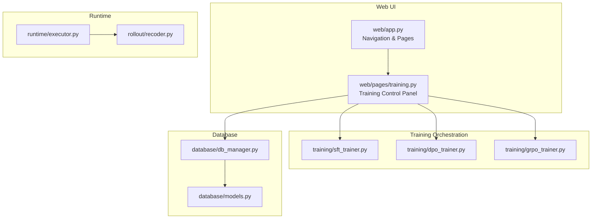
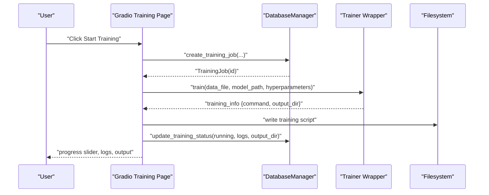
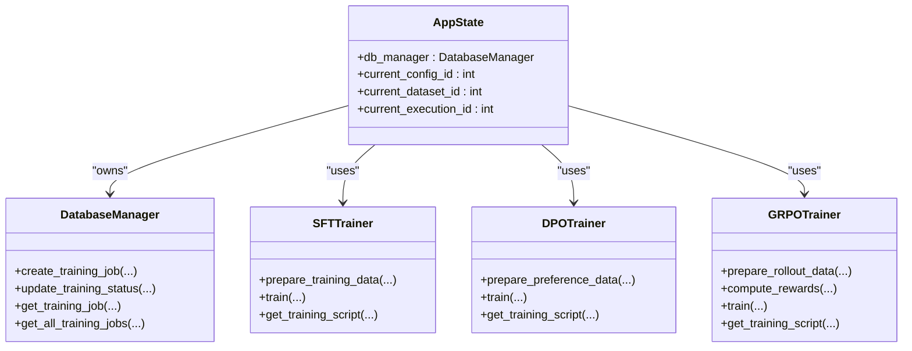
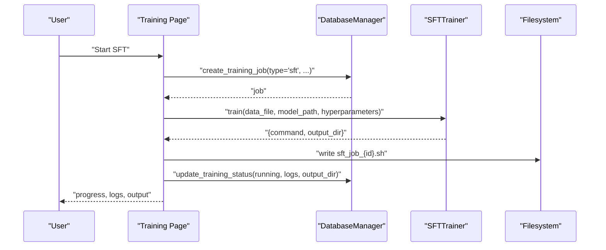
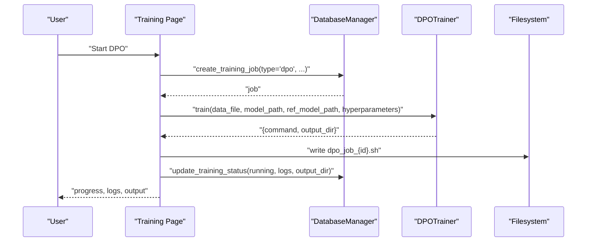
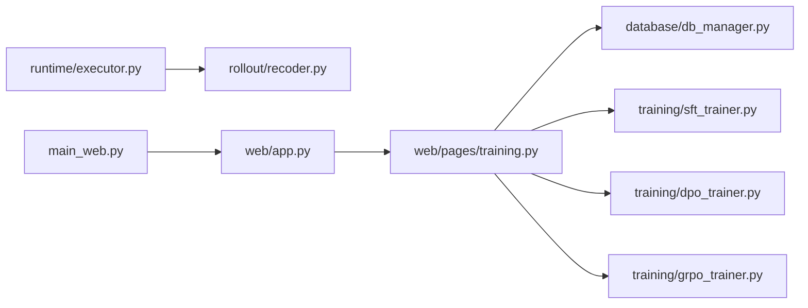

# Training Control Panel

<cite>
**Referenced Files in This Document**
- [web/pages/training.py](file://web/pages/training.py)
- [training/__init__.py](file://training/__init__.py)
- [training/sft_trainer.py](file://training/sft_trainer.py)
- [training/dpo_trainer.py](file://training/dpo_trainer.py)
- [training/grpo_trainer.py](file://training/grpo_trainer.py)
- [database/db_manager.py](file://database/db_manager.py)
- [database/models.py](file://database/models.py)
- [web/app.py](file://web/app.py)
- [main_web.py](file://main_web.py)
- [runtime/executor.py](file://runtime/executor.py)
- [rollout/recoder.py](file://rollout/recoder.py)
- [cli/run_sft.py](file://cli/run_sft.py)
- [cli/run_infer.py](file://cli/run_infer.py)
</cite>

## Table of Contents
1. [Introduction](#introduction)
2. [Project Structure](#project-structure)
3. [Core Components](#core-components)
4. [Architecture Overview](#architecture-overview)
5. [Detailed Component Analysis](#detailed-component-analysis)
6. [Dependency Analysis](#dependency-analysis)
7. [Performance Considerations](#performance-considerations)
8. [Troubleshooting Guide](#troubleshooting-guide)
9. [Conclusion](#conclusion)
10. [Appendices](#appendices)

## Introduction
This document describes the Training Control Panel interface for managing machine teaching and alignment workflows. It covers:
- Training job management via a centralized UI
- Model selection and hyperparameter configuration
- Methodology selection among SFT, DPO, and GRPO
- Training progress monitoring and result visualization
- Training queue management, resource allocation, and execution scheduling
- Practical examples, optimization strategies, and common issues

The panel integrates a Gradio-based web UI with SQLite-backed persistence and training orchestrators that generate runnable scripts for external frameworks (ms-swift for SFT/DPO and verl for GRPO).

## Project Structure
The Training Control Panel spans several modules:
- Web UI: Gradio pages and navigation
- Training orchestration: SFT/DPO/GRPO trainers
- Database: Job lifecycle and artifacts
- Runtime pipeline: Execution and rollout recording
- CLI: Optional command-line helpers for training and inference

**Diagram sources**
- [web/app.py:1-173](file://web/app.py#L1-L173)
- [web/pages/training.py:1-553](file://web/pages/training.py#L1-L553)
- [training/sft_trainer.py:1-263](file://training/sft_trainer.py#L1-L263)
- [training/dpo_trainer.py:1-320](file://training/dpo_trainer.py#L1-L320)
- [training/grpo_trainer.py:1-385](file://training/grpo_trainer.py#L1-L385)
- [database/db_manager.py:1-347](file://database/db_manager.py#L1-L347)
- [database/models.py:1-123](file://database/models.py#L1-L123)
- [runtime/executor.py:1-132](file://runtime/executor.py#L1-L132)
- [rollout/recoder.py:1-122](file://rollout/recoder.py#L1-L122)

**Section sources**
- [web/app.py:1-173](file://web/app.py#L1-L173)
- [web/pages/training.py:1-553](file://web/pages/training.py#L1-L553)
- [database/db_manager.py:1-347](file://database/db_manager.py#L1-L347)
- [database/models.py:1-123](file://database/models.py#L1-L123)

## Core Components
- Training Control Panel (Gradio Tabs): SFT, DPO, GRPO, and Jobs
- Trainer Wrappers: SFTTrainer, DPOTrainer, GRPOTrainer
- Database Manager: CRUD for datasets, system configs, and training jobs
- Data Generation Pipeline: SystemExecutor and TrajectoryRecorder
- Application Bootstrap: main_web.py and web/app.py

Key capabilities:
- Configure training tasks with model path, dataset, and hyperparameters
- Generate runnable scripts for external training frameworks
- Track job status, logs, and outputs
- View and manage training queues

**Section sources**
- [web/pages/training.py:1-553](file://web/pages/training.py#L1-L553)
- [training/__init__.py:1-7](file://training/__init__.py#L1-L7)
- [database/db_manager.py:267-347](file://database/db_manager.py#L267-L347)
- [runtime/executor.py:1-132](file://runtime/executor.py#L1-L132)
- [rollout/recoder.py:1-122](file://rollout/recoder.py#L1-L122)

## Architecture Overview
The Training Control Panel orchestrates training by:
- Collecting user inputs (task name, config, dataset, model, hyperparameters)
- Persisting a TrainingJob record
- Delegating to a Trainer wrapper to produce a framework-specific command/script
- Saving the script to disk and updating job status/logs
- Providing a live-updating UI for progress and logs

**Diagram sources**
- [web/pages/training.py:254-553](file://web/pages/training.py#L254-L553)
- [database/db_manager.py:267-314](file://database/db_manager.py#L267-L314)
- [training/sft_trainer.py:59-140](file://training/sft_trainer.py#L59-L140)
- [training/dpo_trainer.py:100-190](file://training/dpo_trainer.py#L100-L190)
- [training/grpo_trainer.py:177-266](file://training/grpo_trainer.py#L177-L266)

## Detailed Component Analysis

### Training Control Panel (Gradio)
- SFT/DPO/GRPO tabs expose:
  - Task name, system config, dataset, model path
  - Advanced hyperparameters (learning rate, batch size, epochs, method-specific params)
  - Start button triggers job creation and script generation
- Progress and logs:
  - Slider for progress percentage
  - Text area for training logs
  - Text area for output (including script path and next steps)
- Jobs tab:
  - Lists all training jobs with ID, name, type, status, created time
  - Refresh, view details, stop buttons
  - JSON viewer for selected job details

Operational flow:
- Validation: require task name and config
- Create TrainingJob with config and hyperparameters
- Update status to running
- Build trainer-specific command and write script
- Update logs and output_dir

**Section sources**
- [web/pages/training.py:14-553](file://web/pages/training.py#L14-L553)

### Trainer Wrappers
- SFTTrainer
  - Converts trajectories to training-ready JSONL
  - Builds ms-swift SFT command with defaults and merges user hyperparameters
  - Generates a bash script for execution
- DPOTrainer
  - Converts trajectories into chosen/rejected pairs
  - Builds ms-swift DPO command with defaults and merges user hyperparameters
  - Generates a bash script for execution
- GRPOTrainer
  - Prepares rollout data and computes rewards from reward specs
  - Builds verl GRPO config and command
  - Generates a Python CLI script for execution

Model type inference:
- Trainers infer model_type from model_path to select framework presets.

Script generation:
- Each trainer returns a structured info containing the command and output_dir
- The UI writes a shell script to disk and instructs the user to run it

**Section sources**
- [training/sft_trainer.py:16-140](file://training/sft_trainer.py#L16-L140)
- [training/sft_trainer.py:252-263](file://training/sft_trainer.py#L252-L263)
- [training/dpo_trainer.py:15-190](file://training/dpo_trainer.py#L15-L190)
- [training/dpo_trainer.py:309-320](file://training/dpo_trainer.py#L309-L320)
- [training/grpo_trainer.py:15-266](file://training/grpo_trainer.py#L15-L266)
- [training/grpo_trainer.py:374-385](file://training/grpo_trainer.py#L374-L385)

### Database Management
- TrainingJob schema stores:
  - Name, type, status, config, dataset_id, config_id, model_path, hyperparameters
  - Logs, metrics, error_message, timestamps
- Methods:
  - create_training_job, update_training_status, get_training_job, get_all_training_jobs
  - Utility for system configs and datasets

This enables persistent tracking of training lifecycle and results.

**Section sources**
- [database/models.py:99-123](file://database/models.py#L99-L123)
- [database/db_manager.py:267-347](file://database/db_manager.py#L267-L347)

### Execution Pipeline and Data Recording
- SystemExecutor runs two-phase execution:
  - Phase 1: Teacher models generate ground truths
  - Phase 2: Student models execute and record trajectories
- TrajectoryRecorder persists per-step prompts/responses/ground truths to JSONL
- Supports assembling SFT datasets and converting to SWIFT format

These components underpin SFT data preparation and can be used alongside the web UI.

**Section sources**
- [runtime/executor.py:16-132](file://runtime/executor.py#L16-L132)
- [rollout/recoder.py:15-122](file://rollout/recoder.py#L15-L122)

### Web Application Bootstrap
- main_web.py checks and installs dependencies, initializes the database, and launches the Gradio app
- web/app.py defines navigation, page visibility, and routes to training page

**Section sources**
- [main_web.py:19-158](file://main_web.py#L19-L158)
- [web/app.py:20-173](file://web/app.py#L20-L173)

## Architecture Overview

**Diagram sources**
- [web/app.py:11-18](file://web/app.py#L11-L18)
- [database/db_manager.py:11-347](file://database/db_manager.py#L11-L347)
- [training/sft_trainer.py:9-263](file://training/sft_trainer.py#L9-L263)
- [training/dpo_trainer.py:8-320](file://training/dpo_trainer.py#L8-L320)
- [training/grpo_trainer.py:8-385](file://training/grpo_trainer.py#L8-L385)

## Detailed Component Analysis

### SFT Training Workflow
- Inputs: task name, system config, dataset, model path, LR, batch size, epochs, max length
- Process:
  - Create TrainingJob
  - Update status to running
  - Build SFT command and write script
  - Update logs and output_dir
- Outputs: progress slider, logs, and a generated script path for manual execution

**Diagram sources**
- [web/pages/training.py:254-339](file://web/pages/training.py#L254-L339)
- [training/sft_trainer.py:59-140](file://training/sft_trainer.py#L59-L140)

**Section sources**
- [web/pages/training.py:18-79](file://web/pages/training.py#L18-L79)
- [training/sft_trainer.py:16-140](file://training/sft_trainer.py#L16-L140)

### DPO Training Workflow
- Inputs: task name, system config, dataset, model path, optional reference model, LR, batch size, epochs, beta
- Process:
  - Create TrainingJob
  - Update status to running
  - Build DPO command and write script
  - Update logs and output_dir
- Outputs: progress slider, logs, and a generated script path for manual execution

**Diagram sources**
- [web/pages/training.py:340-409](file://web/pages/training.py#L340-L409)
- [training/dpo_trainer.py:100-190](file://training/dpo_trainer.py#L100-L190)

**Section sources**
- [web/pages/training.py:81-148](file://web/pages/training.py#L81-L148)
- [training/dpo_trainer.py:15-190](file://training/dpo_trainer.py#L15-L190)

### GRPO Training Workflow
- Inputs: task name, system config, dataset, model path, reward type, LR, batch size, rollout batch size, KL coefficient
- Process:
  - Create TrainingJob
  - Update status to running
  - Build GRPO config and write script
  - Update logs and output_dir
- Outputs: progress slider, logs, and a generated script path for manual execution

**Diagram sources**
- [web/pages/training.py:410-485](file://web/pages/training.py#L410-L485)
- [training/grpo_trainer.py:177-266](file://training/grpo_trainer.py#L177-L266)

**Section sources**
- [web/pages/training.py:149-217](file://web/pages/training.py#L149-L217)
- [training/grpo_trainer.py:15-266](file://training/grpo_trainer.py#L15-L266)

### Training Progress Monitoring and Result Visualization
- Progress: slider bound to training status updates
- Logs: textbox populated during job creation and training preparation
- Output: textbox with job ID, output directory, and script path
- Jobs tab: dataframe of jobs with refresh/view/stop actions; JSON viewer for details

Note: The current UI simulates progress and logs. Real-time monitoring requires asynchronous execution and periodic updates.

**Section sources**
- [web/pages/training.py:59-78](file://web/pages/training.py#L59-L78)
- [web/pages/training.py:128-147](file://web/pages/training.py#L128-L147)
- [web/pages/training.py:197-216](file://web/pages/training.py#L197-L216)
- [web/pages/training.py:218-252](file://web/pages/training.py#L218-L252)

### Training Queue Management, Resource Allocation, and Execution Scheduling
- Queue management:
  - Jobs are persisted in TrainingJob table with status and timestamps
  - UI lists jobs and supports refresh/view
- Resource allocation:
  - Trainers rely on external frameworks (ms-swift, verl) to manage GPU/CPU resources
  - Users run generated scripts manually; no built-in resource enforcement
- Execution scheduling:
  - Current implementation is synchronous and manual
  - Future enhancements could integrate async execution and status polling

**Section sources**
- [database/models.py:99-123](file://database/models.py#L99-L123)
- [database/db_manager.py:267-347](file://database/db_manager.py#L267-L347)
- [web/pages/training.py:487-553](file://web/pages/training.py#L487-L553)

### Examples of Training Configurations
- SFT
  - Inputs: task name, system config, dataset, model path
  - Hyperparameters: learning_rate, batch_size, num_epochs, max_length
- DPO
  - Inputs: task name, system config, dataset, model path, optional reference model
  - Hyperparameters: learning_rate, batch_size, num_epochs, beta
- GRPO
  - Inputs: task name, system config, dataset, model path, reward type
  - Hyperparameters: learning_rate, batch_size, rollout_batch_size, kl_coef

Outputs:
- A generated script file path and output directory for manual execution

**Section sources**
- [web/pages/training.py:23-54](file://web/pages/training.py#L23-L54)
- [web/pages/training.py:91-123](file://web/pages/training.py#L91-L123)
- [web/pages/training.py:160-192](file://web/pages/training.py#L160-L192)

### Result Interpretation
- TrainingJob fields:
  - status, logs, metrics, error_message, output_dir, timestamps
- Use output_dir to locate model checkpoints and training artifacts
- Use logs to diagnose failures or warnings

**Section sources**
- [database/models.py:99-123](file://database/models.py#L99-L123)
- [database/db_manager.py:288-314](file://database/db_manager.py#L288-L314)

## Dependency Analysis

**Diagram sources**
- [web/pages/training.py:1-7](file://web/pages/training.py#L1-L7)
- [database/db_manager.py:1-8](file://database/db_manager.py#L1-L8)
- [training/sft_trainer.py:1-6](file://training/sft_trainer.py#L1-L6)
- [training/dpo_trainer.py:1-5](file://training/dpo_trainer.py#L1-L5)
- [training/grpo_trainer.py:1-5](file://training/grpo_trainer.py#L1-L5)
- [runtime/executor.py:1-6](file://runtime/executor.py#L1-L6)
- [rollout/recoder.py:1-5](file://rollout/recoder.py#L1-L5)
- [main_web.py:65-70](file://main_web.py#L65-L70)
- [web/app.py:1-8](file://web/app.py#L1-L8)

**Section sources**
- [web/pages/training.py:1-7](file://web/pages/training.py#L1-L7)
- [database/db_manager.py:1-8](file://database/db_manager.py#L1-L8)
- [runtime/executor.py:1-6](file://runtime/executor.py#L1-L6)
- [rollout/recoder.py:1-5](file://rollout/recoder.py#L1-L5)
- [main_web.py:65-70](file://main_web.py#L65-L70)
- [web/app.py:1-8](file://web/app.py#L1-L8)

## Performance Considerations
- Learning rates:
  - DPO and GRPO commonly use smaller learning rates than SFT
- Batch sizes:
  - Adjust per GPU memory; gradient_accumulation_steps can help fit larger batches
- Max length:
  - Tune to balance context coverage and memory usage
- Scheduler and logging:
  - Cosine decay and frequent logging steps improve convergence and observability
- Data preparation:
  - Ensure high-quality datasets; SFT/DPO/GRPO quality depends on curated data

[No sources needed since this section provides general guidance]

## Troubleshooting Guide
Common issues and remedies:
- Missing ms-swift or verl
  - The app detects missing packages and falls back to generating scripts for manual execution
- Invalid task inputs
  - Ensure task name and system config are provided before starting
- Training fails after script generation
  - Review logs captured in the TrainingJob and the generated script’s working directory
- No progress updates
  - The current UI simulates progress; real-time updates require asynchronous execution and polling

**Section sources**
- [main_web.py:33-59](file://main_web.py#L33-L59)
- [web/pages/training.py:254-339](file://web/pages/training.py#L254-L339)
- [database/db_manager.py:288-314](file://database/db_manager.py#L288-L314)

## Conclusion
The Training Control Panel provides a practical interface for configuring and launching SFT, DPO, and GRPO training jobs. It persists job state, generates framework-specific scripts, and offers basic progress and log visualization. For production-scale training, consider integrating asynchronous execution, real-time progress polling, and automated resource management.

[No sources needed since this section summarizes without analyzing specific files]

## Appendices

### CLI References
- run_sft.py: End-to-end SFT pipeline including data collection and training invocation
- run_infer.py: Batch inference with multi-agent system

**Section sources**
- [cli/run_sft.py:17-117](file://cli/run_sft.py#L17-L117)
- [cli/run_infer.py:8-46](file://cli/run_infer.py#L8-L46)