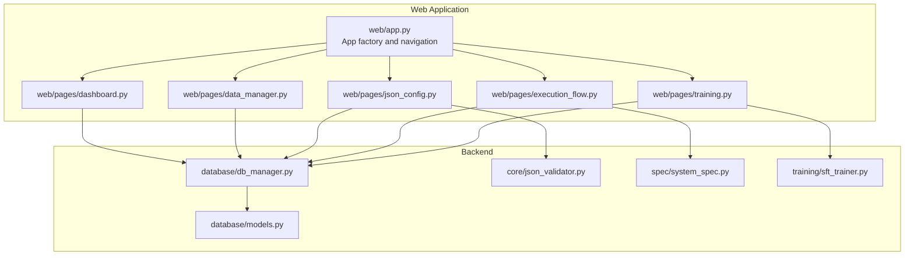
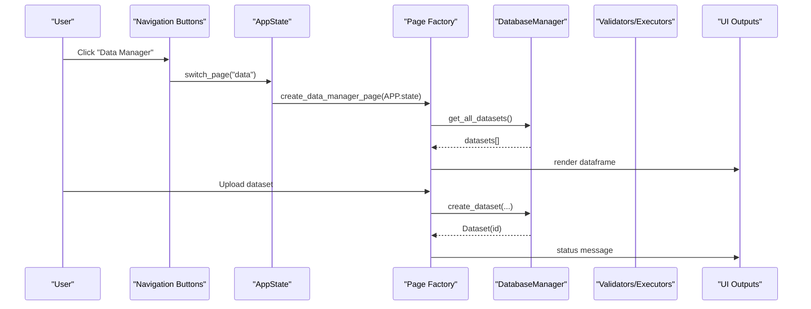
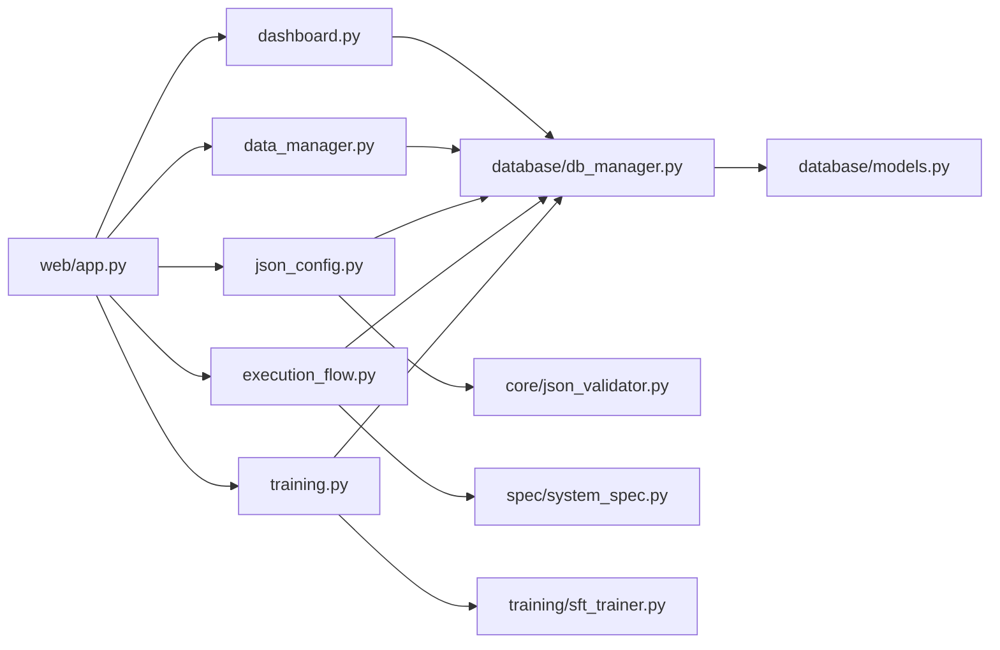

# Web Interface

<cite>
**Referenced Files in This Document**
- [web/app.py](file://web/app.py)
- [web/pages/dashboard.py](file://web/pages/dashboard.py)
- [web/pages/data_manager.py](file://web/pages/data_manager.py)
- [web/pages/json_config.py](file://web/pages/json_config.py)
- [web/pages/execution_flow.py](file://web/pages/execution_flow.py)
- [web/pages/training.py](file://web/pages/training.py)
- [database/db_manager.py](file://database/db_manager.py)
- [database/models.py](file://database/models.py)
- [core/json_validator.py](file://core/json_validator.py)
- [spec/system_spec.py](file://spec/system_spec.py)
- [training/sft_trainer.py](file://training/sft_trainer.py)
- [main_web.py](file://main_web.py)
</cite>

## Table of Contents
1. [Introduction](#introduction)
2. [Project Structure](#project-structure)
3. [Core Components](#core-components)
4. [Architecture Overview](#architecture-overview)
5. [Detailed Component Analysis](#detailed-component-analysis)
6. [Dependency Analysis](#dependency-analysis)
7. [Performance Considerations](#performance-considerations)
8. [Troubleshooting Guide](#troubleshooting-guide)
9. [Conclusion](#conclusion)
10. [Appendices](#appendices)

## Introduction
This document describes the Gradio-based web interface for the Multi-Agent System Builder. It covers the dashboard overview, page-by-page navigation, user interaction patterns, data management, JSON configuration upload and validation, execution flow visualization, and training control panel. It also explains the component architecture, state management, real-time updates, user workflow scenarios, customization options, accessibility features, common questions, navigation patterns, and best practices.

## Project Structure
The web interface is organized around a central application that hosts five pages:
- Dashboard: system overview and quick actions
- Data Manager: upload, manage, preview, and export datasets
- JSON Config: upload, validate, and visualize system configurations
- Execution Flow: run systems against datasets and inspect results
- Training: start and monitor SFT/DPO/GRPO training jobs

**Diagram sources**
- [web/app.py:20-157](file://web/app.py#L20-L157)
- [web/pages/dashboard.py:6-139](file://web/pages/dashboard.py#L6-L139)
- [web/pages/data_manager.py:8-306](file://web/pages/data_manager.py#L8-L306)
- [web/pages/json_config.py:8-376](file://web/pages/json_config.py#L8-L376)
- [web/pages/execution_flow.py:9-274](file://web/pages/execution_flow.py#L9-L274)
- [web/pages/training.py:9-552](file://web/pages/training.py#L9-L552)
- [database/db_manager.py:11-346](file://database/db_manager.py#L11-L346)
- [database/models.py:10-122](file://database/models.py#L10-L122)
- [core/json_validator.py:37-346](file://core/json_validator.py#L37-L346)
- [spec/system_spec.py:77-114](file://spec/system_spec.py#L77-L114)
- [training/sft_trainer.py:9-262](file://training/sft_trainer.py#L9-L262)

**Section sources**
- [web/app.py:20-157](file://web/app.py#L20-L157)

## Core Components
- AppState: holds global state (database manager, current IDs) and is shared across pages.
- Navigation: buttons switch visible page columns and update button variants.
- Page factories: each page module creates UI elements and binds event handlers.

Key behaviors:
- State storage: a hidden state variable tracks the current page.
- Theme: Soft theme with blue primary and gray accents; custom CSS for layout.
- Footer and header: consistent branding and navigation.

**Section sources**
- [web/app.py:11-18](file://web/app.py#L11-L18)
- [web/app.py:27-32](file://web/app.py#L27-L32)
- [web/app.py:49](file://web/app.py#L49)
- [web/app.py:107-119](file://web/app.py#L107-L119)

## Architecture Overview
High-level flow:
- User interacts with navigation buttons to switch pages.
- Each page reads from the AppState’s DatabaseManager and updates UI outputs.
- Validation and execution pages call backend validators and trainers, persisting results to the database.

**Diagram sources**
- [web/app.py:107-155](file://web/app.py#L107-L155)
- [web/pages/data_manager.py:135-179](file://web/pages/data_manager.py#L135-L179)
- [database/db_manager.py:37-56](file://database/db_manager.py#L37-L56)

## Detailed Component Analysis

### Dashboard Page
Purpose:
- Show system statistics, quick actions, and recent activity.
- Provide a refresh trigger.

Key UI elements:
- Stat cards for datasets, configs, valid configs, executions, and training jobs.
- Quick action rows linking to other pages.
- Recent configs and training jobs lists.
- Refresh button.

Behavior:
- Loads stats from the database and renders cards.
- Refresh button currently returns a status message; can be extended to reload data.

**Section sources**
- [web/pages/dashboard.py:6-139](file://web/pages/dashboard.py#L6-L139)

### Data Management Page
Purpose:
- Upload datasets (JSON/JSONL), manage existing datasets, preview data, filter generated data, and export training-ready datasets.

Tabs:
- Dataset Management: upload form, dataset table, delete, preview.
- Generated Data: filter by config or dataset, view trajectory details.
- Export: select config and format, export to file.

Upload flow:
- Validates presence of name and file.
- Parses JSON/JSONL, saves to data/uploads, and persists metadata to the database.

Preview flow:
- Reads dataset file and returns a preview object with dataset info and first few records.

Export flow:
- Generates a training-ready file (placeholder) and returns a downloadable file.

Events:
- Upload, refresh, delete, preview, filter, view trajectory, export.

**Section sources**
- [web/pages/data_manager.py:8-306](file://web/pages/data_manager.py#L8-L306)
- [database/db_manager.py:37-88](file://database/db_manager.py#L37-L88)

### JSON Configuration Page
Purpose:
- Upload and validate system configurations, visualize dataflow, and manage saved configurations.

Tabs:
- Upload & Validate: JSON editor, validate/save buttons, validation results, execution order, dataflow graph.
- Config List: list of saved configs, refresh/view/delete, select by ID.
- Visualization: select config and render Mermaid diagram.

Validation:
- Parses JSON, validates structure and agent specs, checks dataflow connections, detects cycles, infers execution order.

Visualization:
- Builds nodes/edges from parsed config and renders a Mermaid diagram with styled nodes.

Events:
- Validate, Save, Refresh, View, Delete, Generate Visualization.

**Section sources**
- [web/pages/json_config.py:8-376](file://web/pages/json_config.py#L8-L376)
- [core/json_validator.py:37-346](file://core/json_validator.py#L37-L346)
- [spec/system_spec.py:77-114](file://spec/system_spec.py#L77-L114)

### Execution Flow Page
Purpose:
- Run a selected system configuration against a dataset, record trajectories, and visualize results.

Inputs:
- Select valid system config, optional dataset, toggle teacher-for-GT, toggle trajectory recording.

Execution:
- Creates an execution record, runs the system executor, updates status/logs/results, and prepares outputs.

Results:
- Final outputs (limited samples), execution statistics, trajectory steps, step details, and a flow visualization.

Flow visualization:
- Renders a horizontal flow of agent nodes with arrows.

Events:
- Run, Stop (placeholder), view step details.

**Section sources**
- [web/pages/execution_flow.py:9-274](file://web/pages/execution_flow.py#L9-L274)
- [spec/system_spec.py:100-114](file://spec/system_spec.py#L100-L114)
- [database/db_manager.py:205-244](file://database/db_manager.py#L205-L244)

### Training Control Panel
Purpose:
- Start SFT, DPO, and GRPO training jobs with configurable hyperparameters and track progress.

Tabs:
- SFT Training: configure name, valid config, dataset, model path, advanced params, start.
- DPO Training: similar with reference model and beta.
- GRPO Training: reward type and rollout parameters.
- Training Jobs: list, refresh, view, stop.

Training process:
- Creates a training job record, marks as running, generates a training script, and writes it to disk.
- Updates status with logs and output directory.

Notes:
- Actual training is executed externally (scripts); the UI prepares and documents commands.

**Section sources**
- [web/pages/training.py:9-552](file://web/pages/training.py#L9-L552)
- [training/sft_trainer.py:9-262](file://training/sft_trainer.py#L9-L262)
- [database/db_manager.py:267-314](file://database/db_manager.py#L267-L314)

## Dependency Analysis
- App depends on page factories and DatabaseManager.
- Pages depend on DatabaseManager for persistence and on validators/executors for logic.
- Validators depend on SystemSpec for Pydantic validation and NetworkX for dependency graphs.
- Training uses SFTTrainer to generate scripts and write configs.

**Diagram sources**
- [web/app.py:20-157](file://web/app.py#L20-L157)
- [web/pages/dashboard.py:6-139](file://web/pages/dashboard.py#L6-L139)
- [web/pages/data_manager.py:8-306](file://web/pages/data_manager.py#L8-L306)
- [web/pages/json_config.py:8-376](file://web/pages/json_config.py#L8-L376)
- [web/pages/execution_flow.py:9-274](file://web/pages/execution_flow.py#L9-L274)
- [web/pages/training.py:9-552](file://web/pages/training.py#L9-L552)
- [database/db_manager.py:11-346](file://database/db_manager.py#L11-L346)
- [database/models.py:10-122](file://database/models.py#L10-L122)
- [core/json_validator.py:37-346](file://core/json_validator.py#L37-L346)
- [spec/system_spec.py:77-114](file://spec/system_spec.py#L77-L114)
- [training/sft_trainer.py:9-262](file://training/sft_trainer.py#L9-L262)

**Section sources**
- [database/db_manager.py:11-346](file://database/db_manager.py#L11-L346)
- [core/json_validator.py:37-346](file://core/json_validator.py#L37-L346)
- [spec/system_spec.py:77-114](file://spec/system_spec.py#L77-L114)
- [training/sft_trainer.py:9-262](file://training/sft_trainer.py#L9-L262)

## Performance Considerations
- Data previews and exports limit the number of items shown to avoid heavy UI rendering.
- JSON parsing and validation occur synchronously; for large files, consider async processing and progress indicators.
- Database queries are straightforward; pagination or filtering can be added for large datasets.
- Training preparation writes scripts and configs; ensure disk I/O is monitored on constrained environments.

## Troubleshooting Guide
Common issues and resolutions:
- Navigation not switching pages:
  - Verify page switch function bindings and that the current page state is updated.
- Upload failures:
  - Ensure dataset name and file are provided; check file format and readability.
- Validation errors:
  - Review validation messages; fix missing fields or invalid agent references.
- Execution failures:
  - Confirm a valid system configuration is selected; ensure dataset exists if used.
- Training not starting:
  - Check that required fields (name, config) are set; review logs and output directory.

Operational tips:
- Use the refresh buttons on data and training tabs to update lists.
- Export training data after validating configurations and preparing datasets.

**Section sources**
- [web/pages/data_manager.py:135-179](file://web/pages/data_manager.py#L135-L179)
- [web/pages/json_config.py:181-206](file://web/pages/json_config.py#L181-L206)
- [web/pages/execution_flow.py:116-223](file://web/pages/execution_flow.py#L116-L223)
- [web/pages/training.py:254-338](file://web/pages/training.py#L254-L338)

## Conclusion
The web interface provides a cohesive workflow from configuration to execution and training. Its modular design, centralized state management, and database-backed persistence support iterative development and experimentation. Extending asynchronous processing, adding real-time updates, and enhancing accessibility would further improve the user experience.

## Appendices

### Page-by-Page Navigation Guide
- Dashboard: Overview and quick actions; refresh data.
- Data Manager: Upload datasets, manage, preview, filter generated data, export.
- JSON Config: Upload and validate JSON configs, view execution order and dataflow graph, manage saved configs.
- Execution Flow: Select config and dataset, run, view results and trajectory, visualize flow.
- Training: Configure and start SFT/DPO/GRPO jobs, monitor status and logs.

### User Interaction Patterns
- Navigation: Use top buttons to switch pages; buttons update to indicate the active page.
- Forms: Fill required fields; click submit buttons to trigger actions; observe status outputs.
- Tabs: Switch between sections within a page to access different capabilities.
- Real-time updates: Refresh buttons update lists; status outputs reflect immediate results.

### Interface Customization Options
- Theme: Soft theme with customizable hues and fonts.
- Layout: Container and column scaling adjust content width.
- Styling: Custom CSS classes for containers and navigation buttons.

### Accessibility Features
- Clear labels and placeholders for inputs.
- Markdown-based content for readable headings and lists.
- Status indicators and logs provide feedback during operations.

### Best Practices
- Always validate configurations before execution.
- Use valid configurations for training to ensure compatibility.
- Limit preview sizes and export counts for performance.
- Keep datasets and configurations well-named and documented.

### Screenshots and Step-by-Step Guides
- Dashboard overview:
  - Open the app; observe the header and navigation bar.
  - Navigate to Dashboard to see statistics and recent activity.
- Upload a dataset:
  - Go to Data Manager > Dataset Management.
  - Enter dataset name and select a JSON/JSONL file.
  - Click Upload; confirm the status message and refresh the table.
- Validate a JSON configuration:
  - Go to JSON Config > Upload & Validate.
  - Paste or edit JSON; click Validate to see results and execution order.
  - Optionally save the configuration; review in Config List.
- Run an execution:
  - Go to Execution Flow.
  - Choose a valid configuration and optional dataset.
  - Toggle options (teacher-for-GT, record trajectory) and click Start.
  - Inspect logs, results, and trajectory tabs.
- Start training:
  - Go to Training > SFT/DPO/GRPO.
  - Fill in required fields and hyperparameters; click Start.
  - Review logs and generated script path; run the script externally.